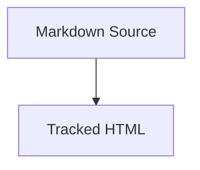

# Mermaid Documentation

Use this subskill when creating, updating, validating, or rendering Mermaid
diagrams in registered explanatory Markdown or tracked source-backed HTML
explainers in this repository.

This subskill is subordinate to `visual-explainer`. It is not an independent
documentation authority.

## Scope

Applies to:

- `markdown/html-explainer-specs/*.md`
- eligible registered explanatory Markdown in `MARKDOWN_SOURCE_REGISTRY.csv`
- tracked `html/*.html` files backed by registered HTML explainer specs

Does not apply to:

- canonical science TeX
- PDFs
- generated wiki notes
- role contracts and schema contracts
- `.local/` scratch explainers unless explicitly requested

## Canonical Source Rule

Mermaid text in registered Markdown is the canonical diagram source.

For HTML explainer specs, declare governed diagrams in frontmatter:

```yaml
mermaid_diagrams:
  required: true
  ids:
    - authority-ladder
```

Then place each diagram in the body with an immediate stable ID marker:

````markdown
<!-- mermaid-diagram-id: authority-ladder -->

````

For ordinary registered explanatory Markdown, the immediate
`mermaid-diagram-id` marker is sufficient. No frontmatter model is required.

Diagram IDs must use lowercase kebab-case:

```text
^[a-z][a-z0-9]*(?:-[a-z0-9]+)*$
```

## HTML Rendering Rule

Tracked `html/*.html` must render governed Mermaid diagrams through the
`visual-explainer` diagram shell. Do not use bare `<pre class="mermaid">` in
tracked HTML.

Each governed tracked HTML diagram must include:

- `.diagram-shell`
- `data-mermaid-diagram-id="<id>"` on the shell
- `.mermaid-wrap`
- `.zoom-controls`
- `.mermaid-viewport`
- `.mermaid-canvas`
- `<script type="text/plain" class="diagram-source">`
- matching `data-mermaid-diagram-id` on `.diagram-source`

The HTML `diagram-source` text is derivative. It must match the normalized
Markdown Mermaid source for the same ID.

## Runtime Rule

Tracked HTML with governed Mermaid diagrams must import the local pinned
runtime:

```js
import mermaid from "./assets/mermaid.esm.min.mjs";
```

Initialize with strict security:

```js
mermaid.initialize({
  startOnLoad: false,
  theme: "base",
  securityLevel: "strict"
});
```

Do not use CDN Mermaid imports in tracked `html/*.html`.

The local runtime is pinned to Mermaid `11.15.0`, sourced from the npm package
`mermaid@11.15.0`, retrieved on 2026-06-11, and stored under `html/assets/`.
The ESM runtime imports package chunks from `html/assets/chunks/mermaid.esm.min/`.
Full license provenance is recorded in
`.codex/skills/visual-explainer/THIRD_PARTY_NOTICES.md`.

Do not use `layout: "elk"` in tracked HTML unless a later bounded task vendors
`@mermaid-js/layout-elk` locally.

## Diagram Type Selection

- `flowchart TD`: processes, architecture maps, agent pipelines, and control flow.
- `sequenceDiagram`: interactions between agents, scripts, tools, and users.
- `stateDiagram-v2`: task states, router states, validation states, and lifecycle control.
- `classDiagram`: software components, classes, modules, and interfaces.
- `erDiagram`: metadata stores, documentation indexes, file maps, and ledgers.
- `gantt`: schedules and phased project plans.
- `timeline`: historical project evolution.
- `gitGraph`: branch, merge, and release-flow explanations.

Prefer `flowchart TD` for complex tracked explainers. Use `flowchart LR` only
for short linear flows.

## Validation

Run the structural and parity validator:

```zsh
.venv/bin/python .codex/skills/visual-explainer/subskills/mermaid-documentation/scripts/validate_mermaid_sources.py
```

Optional rendering validation uses Mermaid CLI when available:

```zsh
.venv/bin/python .codex/skills/visual-explainer/subskills/mermaid-documentation/scripts/validate_mermaid_sources.py --render-check
```

Missing `mmdc` is a reported skip, not a failure. Mermaid CLI failures are
hard failures when `--render-check` is used.

`bootstrap_memory_system.py --validate-only` imports the same validator in
structural/parity mode. It does not run render checks.

## Editing Rules

1. Preserve existing diagram IDs when updating a diagram.
2. Do not invent project components.
3. Keep node labels short and quote labels with punctuation.
4. Use `<br/>` for Mermaid flowchart line breaks.
5. Avoid raw HTML in Mermaid labels.
6. Use Mermaid text instead of static images unless an explicit export is required.
7. Keep static SVG or PNG exports secondary to the Mermaid source.

## Output Report

When creating or updating governed Mermaid diagrams, report:

- target Markdown path
- diagram ID
- diagram type selected
- target HTML path when applicable
- validation command and result
