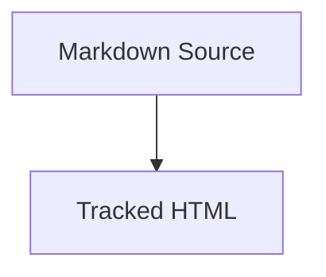

# Mermaid Documentation

Use this subskill when creating, updating, validating, or rendering Mermaid
diagrams in registered explanatory Markdown or tracked source-backed HTML
explainers in this repository.

This subskill is subordinate to `visual-explainer`. It is not an independent
documentation authority.

## Scope

Applies to:

- `markdown/html-explainer-specs/*.md`
- eligible registered explanatory Markdown in `MARKDOWN_SOURCE_REGISTRY.csv`
- tracked `html/*.html` files backed by registered HTML explainer specs

Does not apply to:

- canonical science TeX
- PDFs
- generated wiki notes
- role contracts and schema contracts
- `.local/` scratch explainers unless explicitly requested

## Canonical Source Rule

Mermaid text in registered Markdown is the canonical diagram source.

For HTML explainer specs, declare governed diagrams in frontmatter:

```yaml
mermaid_diagrams:
  required: true
  ids:
    - authority-ladder
```

Then place each diagram in the body with an immediate stable ID marker:

````markdown
<!-- mermaid-diagram-id: authority-ladder -->

````

For ordinary registered explanatory Markdown, the immediate
`mermaid-diagram-id` marker is sufficient. No frontmatter model is required.

Diagram IDs must use lowercase kebab-case:

```text
^[a-z][a-z0-9]*(?:-[a-z0-9]+)*$
```

## HTML Rendering Rule

Tracked `html/*.html` must render governed Mermaid diagrams through the
`visual-explainer` diagram shell. Do not use bare `<pre class="mermaid">` in
tracked HTML.

Each governed tracked HTML diagram must include:

- `.diagram-shell`
- `data-mermaid-diagram-id="<id>"` on the shell
- `.mermaid-wrap`
- `.zoom-controls`
- `.mermaid-viewport`
- `.mermaid-canvas`
- inline `<svg>` inside `.mermaid-canvas`
- `data-renderer` on `.mermaid-canvas`
- `data-render-source-sha256` on `.mermaid-canvas`
- `<script type="text/plain" class="diagram-source">`
- matching `data-mermaid-diagram-id` on `.diagram-source`

The HTML `diagram-source` text is derivative. It must match the normalized
Markdown Mermaid source for the same ID.

## Runtime Rule

Tracked HTML with governed Mermaid diagrams must be standalone single-file HTML.
Render Mermaid to sanitized inline SVG at build/regeneration time and embed the
SVG inside `.mermaid-canvas`. The browser page may provide zoom, pan, fit, and
source-inspection controls, but it must not run Mermaid at page load.

Render with strict Mermaid security:

```js
mermaid.initialize({
  startOnLoad: false,
  theme: "base",
  securityLevel: "strict"
});
```

Do not use CDN Mermaid imports or local browser Mermaid runtime imports in
tracked `html/*.html`. Governed tracked HTML must not contain:

- `import mermaid`
- `mermaid.render(`
- `mermaid.initialize(`
- `mermaid.esm`
- remote Mermaid URLs
- local Mermaid runtime paths under `html/assets/`

The build-time renderer is scoped to this subskill under `scripts/` and uses a
colocated npm dependency boundary. Setup:

```zsh
cd .codex/skills/visual-explainer/subskills/mermaid-documentation/scripts
npm ci
npx playwright install chromium
```

Render one file:

```zsh
node render_mermaid_inline_svg.mjs html/research-control-system-explainer.html
```

Render all registered tracked Mermaid-backed HTML explainers:

```zsh
node render_mermaid_inline_svg.mjs --all
```

Run a no-write renderer freshness check:

```zsh
node render_mermaid_inline_svg.mjs --all --check
```

The renderer stamps deterministic provenance on `.mermaid-canvas`, including
`data-renderer="mermaid@11.15.0;mermaid-inline-svg-renderer@0.1.0"` and
`data-render-source-sha256="<sha256>"`, computed from the same normalized
Mermaid source used by the Python validator. Do not stamp generated timestamps
in tracked HTML.

Do not use `layout: "elk"` in tracked HTML unless a later bounded task adds a
build-time ELK render path and validator support.

## SVG Sanitization Rule

The renderer must use a fail-closed allowlist for inline SVG:

- Keep structural SVG elements required by Mermaid, including `svg`, `g`,
  `path`, `rect`, `polygon`, `circle`, `ellipse`, `line`, `polyline`, `text`,
  `tspan`, `marker`, `defs`, `filter`, `feDropShadow`, `linearGradient`,
  `stop`, `style`, `title`, and `desc`.
- Reject `foreignObject` unless a later bounded task authorizes a stricter
  policy for a diagram type that demonstrably requires it.
- Remove comments.
- Remove scripts, event handler attributes, external references, remote URLs,
  external font/stylesheet references, and `javascript:` URLs.
- Rewrite SVG IDs and all local references deterministically by diagram ID.
- Fail if sanitization would produce an empty or invalid SVG.

## Diagram Type Selection

- `flowchart TD`: processes, architecture maps, agent pipelines, and control flow.
- `sequenceDiagram`: interactions between agents, scripts, tools, and users.
- `stateDiagram-v2`: task states, router states, validation states, and lifecycle control.
- `classDiagram`: software components, classes, modules, and interfaces.
- `erDiagram`: metadata stores, documentation indexes, file maps, and ledgers.
- `gantt`: schedules and phased project plans.
- `timeline`: historical project evolution.
- `gitGraph`: branch, merge, and release-flow explanations.

Prefer `flowchart TD` for complex tracked explainers. Use `flowchart LR` only
for short linear flows.

## Validation

Run the structural and parity validator:

```zsh
.venv/bin/python .codex/skills/visual-explainer/subskills/mermaid-documentation/scripts/validate_mermaid_sources.py
```

The validator enforces:

- Markdown-to-HTML Mermaid source parity
- preserved `script.diagram-source`
- inline SVG presence inside `.mermaid-canvas`
- matching `data-render-source-sha256`
- deterministic `data-renderer`
- no browser Mermaid runtime markers
- no stale runtime labels such as `Loading`, `Render failed`, or
  `Local server required`

Optional rendering validation uses Mermaid CLI when available as an additional
smoke check only:

```zsh
.venv/bin/python .codex/skills/visual-explainer/subskills/mermaid-documentation/scripts/validate_mermaid_sources.py --render-check
```

Missing `mmdc` is a reported skip, not a failure. Mermaid CLI failures are
hard failures when `--render-check` is used.

`bootstrap_memory_system.py --validate-only` imports the same validator in
structural/parity mode. It does not run render checks.

## Editing Rules

1. Preserve existing diagram IDs when updating a diagram.
2. Do not invent project components.
3. Keep node labels short and quote labels with punctuation.
4. Use `<br/>` for Mermaid flowchart line breaks.
5. Avoid raw HTML in Mermaid labels.
6. Use Mermaid text as canonical source; inline SVG in tracked HTML is a
   generated render artifact.
7. Keep static SVG or PNG exports secondary to the Mermaid source.

## Output Report

When creating or updating governed Mermaid diagrams, report:

- target Markdown path
- diagram ID
- diagram type selected
- target HTML path when applicable
- validation command and result
