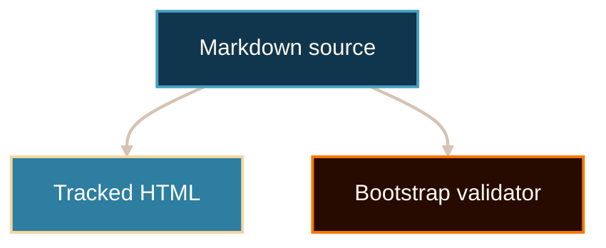

# Mermaid Documentation

Use this subskill when creating, updating, reviewing, migrating, validating, or
rendering Mermaid diagrams in registered explanatory Markdown or tracked
source-backed HTML explainers in this repository.

This subskill is subordinate to `visual-explainer`. It is not an independent
documentation authority, and diagrams must not create, strengthen, or promote
unsupported scientific or project-control claims.

## Scope

Applies to:

- `markdown/html-explainer-specs/*.md`
- eligible registered explanatory Markdown in `MARKDOWN_SOURCE_REGISTRY.csv`
- tracked `html/*.html` files backed by registered HTML explainer specs
- this subskill's examples, renderer, validator, and palette reference

Does not apply to:

- canonical science TeX
- PDFs
- generated wiki notes
- role contracts and schema contracts
- `.local/` scratch explainers unless explicitly requested

## Palette And Grammar

Read `references/palette-contract.md` before creating, reviewing, or migrating
Mermaid. That reference owns the local Angry Owl black/cyan/orange/ivory color
schema, semantic starter classes, and visual grammar checklist.

Use the palette to constrain colors, typography, canvas, and baseline
readability. Use visual grammar to encode meaning:

- shapes encode node type;
- borders encode status or authority limits;
- arrows encode relationship type;
- edge labels disambiguate direction or obligation;
- groups encode scope only when the boundary matters.

Do not use color as the only meaning carrier. Do not flatten meaningful shapes,
arrows, borders, or labels merely to fit a helper script.

For governed registered Markdown in this project, prefer class definitions and
renderer defaults over Mermaid YAML frontmatter. The current structural
validator expects the first semantic Mermaid line to be the diagram type. Use
Mermaid YAML frontmatter only for non-governed scratch diagrams or after a
bounded task adds validator support.

## Canonical Source Rule

Mermaid text in registered Markdown is the canonical diagram source. Inline SVG
inside tracked HTML is generated output.

For HTML explainer specs, declare governed diagrams in frontmatter:

```yaml
mermaid_diagrams:
  required: true
  ids:
    - authority-ladder
```

Then place each diagram in the body with an immediate stable ID marker:

````markdown
<!-- mermaid-diagram-id: authority-ladder -->

```mermaid
flowchart TD
  source["Markdown source"]:::source --> html["Tracked HTML"]:::target
  source --> validator["Bootstrap validator"]:::control

  classDef source fill:#0f364d,stroke:#48a0c0,color:#fff8ef,stroke-width:2px;
  classDef control fill:#270b01,stroke:#f87800,color:#fff8ef,stroke-width:2px;
  classDef target fill:#2d7ea0,stroke:#f4d6a1,color:#ffffff,stroke-width:2px;
  linkStyle default stroke:#d6c3b4,stroke-width:2.25px;
```
````

For ordinary registered explanatory Markdown, the immediate
`mermaid-diagram-id` marker is sufficient. No frontmatter model is required.

Diagram IDs must use lowercase kebab-case:

```text
^[a-z][a-z0-9]*(?:-[a-z0-9]+)*$
```

Preserve existing diagram IDs when updating or restyling diagrams.

## HTML Rendering Rule

Tracked `html/*.html` must render registered Mermaid diagrams through the
`visual-explainer` diagram shell. Do not use bare `<pre class="mermaid">` in
tracked HTML.

Each governed tracked HTML diagram must include:

- `.diagram-shell`
- `data-mermaid-diagram-id="<id>"` on the shell
- `.mermaid-wrap`
- `.zoom-controls`
- `.mermaid-viewport`
- `.mermaid-canvas`
- inline `<svg>` inside `.mermaid-canvas`
- explicit numeric `width` and `height` on the inline `<svg>` derived from
  its `viewBox`
- `data-renderer` on `.mermaid-canvas`
- `data-render-source-sha256` on `.mermaid-canvas`
- `<script type="text/plain" class="diagram-source">`
- matching `data-mermaid-diagram-id` on `.diagram-source`

The HTML `diagram-source` text is derivative. It must match the normalized
Markdown Mermaid source for the same ID.

Registered Mermaid diagram shells must use adaptive viewBox-based fit behavior:
read the rendered SVG natural size from `viewBox`, size the `.mermaid-wrap` /
`.mermaid-viewport` height from the diagram aspect ratio within bounded min/max
limits, set SVG and canvas pixel width and height from the natural `viewBox`
before applying CSS transforms, and make Fit recompute that best fit. Do not
constrain inline Mermaid SVGs with a fixed `max-width` rule or browser
intrinsic sizing that leaves diagrams at zero or default narrow SVG width.

## Runtime Rule

Tracked HTML with registered Mermaid diagrams must be standalone single-file
HTML. Render Mermaid to sanitized inline SVG at build/regeneration time and
embed the SVG inside `.mermaid-canvas`. The browser page may provide zoom, pan,
fit, and source-inspection controls, but it must not run Mermaid at page load.

Executable interaction scripts must not contain literal `</body>` or `</html>`
strings; build exported blob documents through DOM APIs or split closing tags
so local development servers cannot inject live-reload code into JavaScript
string literals.

Render with strict Mermaid security:

```js
mermaid.initialize({
  startOnLoad: false,
  theme: "base",
  securityLevel: "strict"
});
```

Do not use CDN Mermaid imports or local browser Mermaid runtime imports in
tracked `html/*.html`. Governed tracked HTML must not contain:

- `import mermaid`
- `mermaid.render(`
- `mermaid.initialize(`
- `mermaid.esm`
- remote Mermaid URLs
- local Mermaid runtime paths under `html/assets/`

The build-time renderer is scoped to this subskill under `scripts/` and uses a
colocated npm dependency boundary. Setup:

```zsh
cd .codex/skills/visual-explainer/subskills/mermaid-documentation/scripts
npm ci
npx playwright install chromium
```

Render one file:

```zsh
node render_mermaid_inline_svg.mjs html/research-control-system-explainer.html
```

Render all registered tracked Mermaid-backed HTML explainers:

```zsh
node render_mermaid_inline_svg.mjs --all
```

Run a no-write renderer freshness check:

```zsh
node render_mermaid_inline_svg.mjs --all --check
```

The renderer stamps deterministic provenance on `.mermaid-canvas`, including
`data-renderer="mermaid@11.15.0;mermaid-inline-svg-renderer@0.1.2"` and
`data-render-source-sha256="<sha256>"`, computed from the same normalized
Mermaid source used by the Python validator. Do not stamp generated timestamps
in tracked HTML.

Do not use `layout: "elk"` in tracked HTML unless a later bounded task adds a
build-time ELK render path and validator support.

## SVG Sanitization Rule

The renderer must use a fail-closed allowlist for inline SVG:

- Keep structural SVG elements required by Mermaid, including `svg`, `g`,
  `path`, `rect`, `polygon`, `circle`, `ellipse`, `line`, `polyline`, `text`,
  `tspan`, `marker`, `defs`, `filter`, `feDropShadow`, `linearGradient`,
  `stop`, `style`, `title`, and `desc`.
- Reject `foreignObject` unless a later bounded task authorizes a stricter
  policy for a diagram type that demonstrably requires it.
- Remove comments.
- Remove scripts, event handler attributes, external references, remote URLs,
  external font/stylesheet references, and `javascript:` URLs.
- Rewrite SVG IDs, local URL/href/ARIA references, and inline `style` ID
  selectors deterministically by diagram ID.
- Fail if sanitization would produce an empty or invalid SVG.

## Diagram Type Selection

- `flowchart TD`: processes, architecture maps, agent pipelines, and control flow.
- `sequenceDiagram`: interactions between agents, scripts, tools, and users.
- `stateDiagram-v2`: task states, router states, validation states, and lifecycle control.
- `classDiagram`: software components, classes, modules, and interfaces.
- `erDiagram`: metadata stores, documentation indexes, file maps, and ledgers.
- `gantt`: schedules and phased project plans.
- `timeline`: historical project evolution.
- `gitGraph`: branch, merge, and release-flow explanations.

Prefer `flowchart TD` for complex tracked explainers. Use `flowchart LR` only
for short linear flows.

## Procedure

1. Inspect the registered source, route, publication brief, dossier, or nearby
   content the diagram supports.
2. Define the diagram purpose, audience, publication surface, and claim boundary.
3. Read `references/palette-contract.md`.
4. Define the diagram's visual grammar before editing.
5. Use stable Mermaid syntax and preserve topology, node identifiers, and
   reader-facing labels unless the source content requires correction.
6. Use reusable `classDef` classes from the palette reference instead of
   repeated inline `style` statements.
7. Keep Mermaid text as canonical source; regenerate inline SVG or other static
   outputs only from that source.
8. Regenerate tracked HTML with the local renderer when diagrams change.
9. Run the Mermaid validator and broader project validators listed below.
10. Visually inspect rendered diagrams at expected desktop and mobile sizes
    when reader-facing HTML changes.

## Validation

Run the structural and parity validator:

```zsh
.venv/bin/python .codex/skills/visual-explainer/subskills/mermaid-documentation/scripts/validate_mermaid_sources.py
```

The validator enforces:

- Markdown-to-HTML Mermaid source parity
- preserved `script.diagram-source`
- inline SVG presence inside `.mermaid-canvas`
- matching `data-render-source-sha256`
- deterministic `data-renderer`
- no browser Mermaid runtime markers
- no stale runtime labels such as `Loading`, `Render failed`, or
  `Local server required`

Optional rendering validation uses Mermaid CLI when available as an additional
smoke check only:

```zsh
.venv/bin/python .codex/skills/visual-explainer/subskills/mermaid-documentation/scripts/validate_mermaid_sources.py --render-check
```

Missing `mmdc` is a reported skip, not a failure. Mermaid CLI failures are
hard failures when `--render-check` is used.

`bootstrap_memory_system.py --validate-only` imports the same validator in
structural/parity mode. It does not run render checks.

## Failure Modes

- Treating the palette as a substitute for meaning.
- Restyling diagrams while losing topology or semantic edge information.
- Embedding runtime Mermaid where tracked HTML requires static inline SVG.
- Updating generated assets without source or registry parity.
- Turning a reader aid into project authority.
- Importing claims, components, or route status not supported by project
  sources.

## Editing Rules

1. Preserve existing diagram IDs when updating a diagram.
2. Do not invent project components.
3. Keep node labels short and quote labels with punctuation.
4. Use `<br/>` for Mermaid flowchart line breaks.
5. Avoid raw HTML in Mermaid labels except the established `<br/>` line break.
6. Use Mermaid text as canonical source; inline SVG in tracked HTML is a
   generated render artifact.
7. Keep static SVG or PNG exports secondary to the Mermaid source.
8. Do not copy portable-template `README.md` or `AGENTS.md` files into this
   subskill; fold durable operating rules into this contract or references.

## Output Report

When creating or updating registered Mermaid diagrams, report:

- target Markdown path
- diagram ID
- diagram type selected
- visual grammar summary
- target HTML path when applicable
- validation command and result
