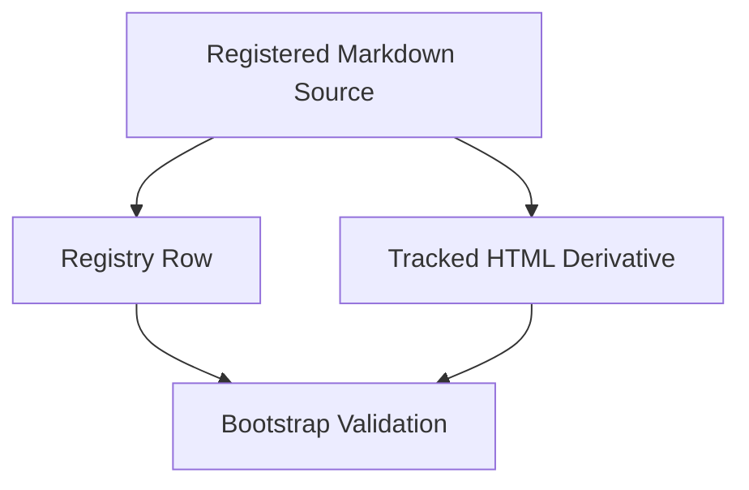

# Governed Markdown Mermaid Example

```yaml
mermaid_diagrams:
  required: true
  ids:
    - authority-ladder
```

<!-- mermaid-diagram-id: authority-ladder -->

```mermaid
flowchart TD
  Source["Registered Markdown Source"] --> Registry["Registry Row"]
  Source --> Html["Tracked HTML Derivative"]
  Registry --> Validator["Bootstrap Validation"]
  Html --> Validator
```
