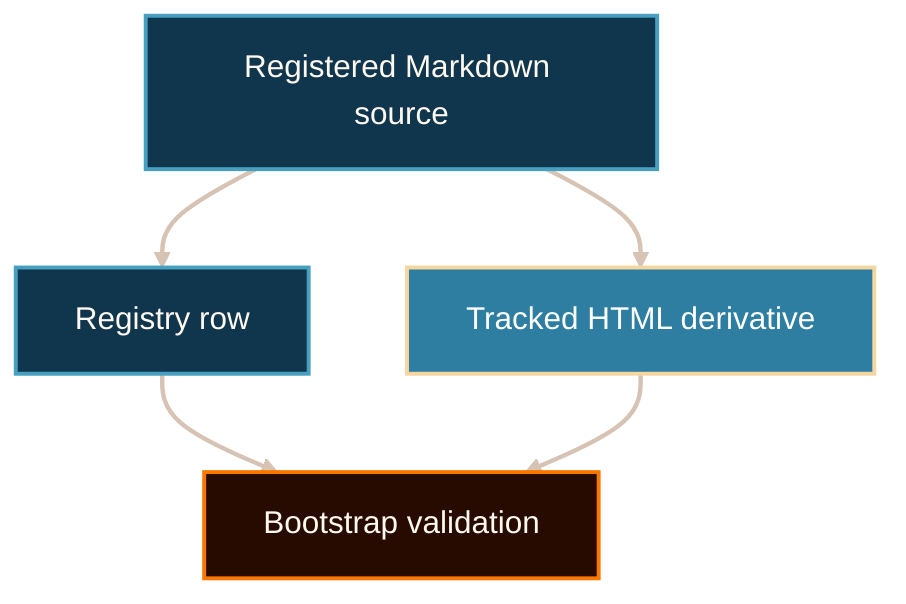

# Governed Markdown Mermaid Example

Visual grammar:

- source nodes use `source`;
- validation and transformation steps use `control`;
- final reader-facing output uses `target`;
- default arrows show required provenance flow.

```yaml
mermaid_diagrams:
  required: true
  ids:
    - authority-ladder
```

<!-- mermaid-diagram-id: authority-ladder -->

