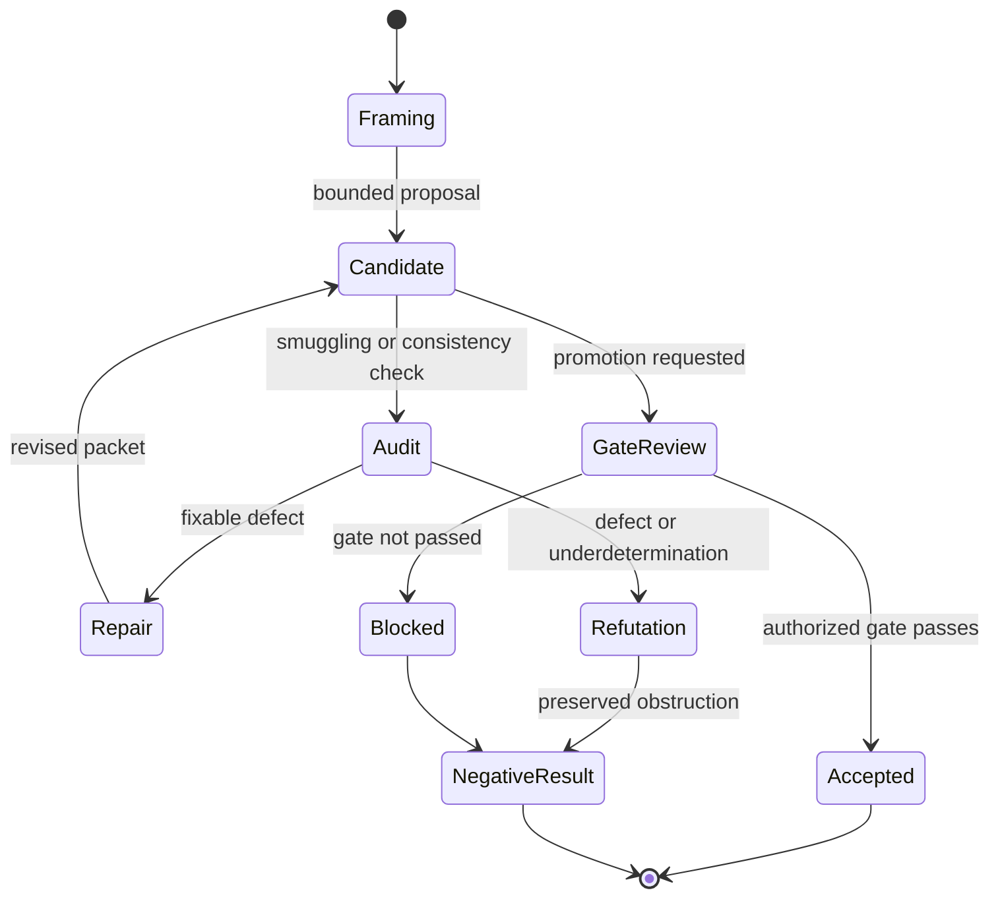
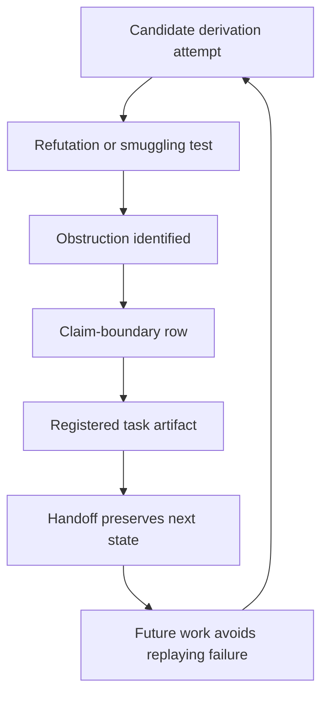

# Claim Gates

Claim gates keep hypotheses, source-side candidates, workflow progress, failed routes, and accepted physics from collapsing into one status.

## Source Binding

- **Derived from spec:** `markdown/html-explainer-specs/claim-gates-explainer.md`
- **Related HTML:** `html/claim-gates-explainer.html`
- **Authority status:** `generated_noncanonical`

## Why Claim Gates Exist

AEther-Flow intentionally works near speculative physics. That makes status discipline essential. A candidate construction may be useful without being accepted. A refutation may block one route without rejecting the whole ontology. A generated explanation may help readers without authorizing a scientific claim. Claim gates preserve those distinctions by tying status changes to source evidence, role authority, human gates when needed, registries, and completion records.

## Workflow Step Inspector

1. Frame the candidate or ontology statement with a scoped claim boundary.
2. Keep exact-GR benchmark adoption separate from substrate derivation proposals.
3. Route candidate work through bounded construction, audit, or refutation.
4. Repair only when the defect is local and the claim boundary remains honest.
5. Preserve refutations, obstructions, and underdetermination as negative results.
6. Send promotion requests through Gate Chair or human-gated review when stronger scientific status is sought.
7. Record accepted, blocked, or negative-result status in the relevant control evidence.
8. Prevent generated docs, validator passes, or completed jobs from promoting claims by presentation alone.

## Status Rules For Readers

A completed research task is not automatically an accepted claim. Completion
records show what a bounded job did, which outputs it produced, and which
validators ran. Accepted physics status requires the appropriate gate and
source evidence.

Negative results are preserved because they protect future work. A refutation
or scoped obstruction prevents the same route from being replayed as if it had
never failed. It can narrow the search without pretending that every related
route is impossible.

Exact-GR benchmark adoption means ordinary GR is the observable target behavior
for comparison. It does not mean the Æther-flow source ontology has derived
that target.

## Claim-State Diagrams

<!-- mermaid-diagram-id: claim-gate-state-machine -->

<!-- mermaid-diagram-id: negative-result-preservation-loop -->

## What Claim Gates Do Not Do

They do not prove a candidate by making its documentation clearer. They do not let a validator pass become a theorem. They do not let generated HTML or GitHub Markdown promote a claim. They do not erase negative results because a later page is more polished.

## For GitHub Readers And AI Agents

You are reading a non-authoritative GitHub-facing explainer.

Safe uses:
- identify the relevant claim-status vocabulary;
- find the claim-boundary and task evidence to inspect;
- explain why benchmark adoption and derivation success are different.

Before modifying project knowledge:
- inspect claim-boundary rows;
- inspect task artifacts and completion evidence;
- preserve blocked, refuted, and negative-result statuses accurately.

Do not:
- do not claim the Æther-flow derivation is complete;
- promote a candidate from prose quality alone;
- treat generated derivatives as gate evidence.

## All Source Materials

- `README.md`
- `AGENTS.md`
- `research_control/README.md`
- `registries/CLAIM_BOUNDARY_REGISTRY.csv`
- `registries/TEX_SOURCE_REGISTRY.csv`
- `registries/RESEARCH_TASK_REGISTRY.csv`
- `.agents/roles/physics/gate-chair.v0.1.0.md`
