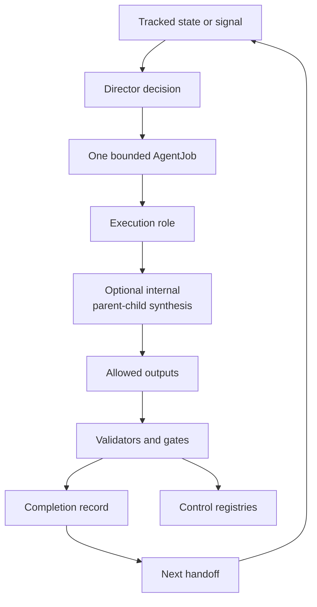
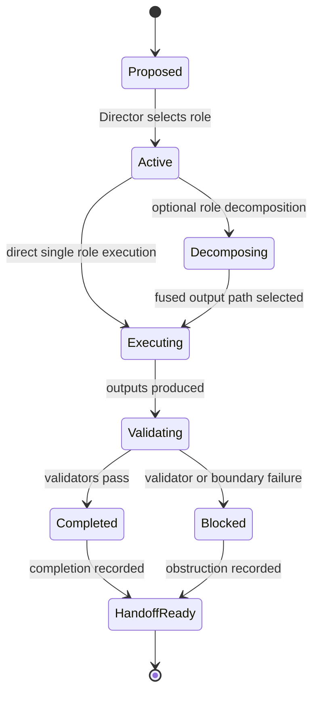

# Research System

The research system turns a question, handoff, or project-improvement signal into one bounded job with a role, allowed paths, validation evidence, and a recorded next state.

## Source Binding

- **Derived from spec:** `markdown/html-explainer-specs/research-agent-workflow-explainer.md`
- **Related HTML:** `html/research-agent-workflow-explainer.html`
- **Authority status:** `generated_noncanonical`

## Operational Model

AEther-Flow is not an informal chat log. The research system exists so theoretical work, documentation work, validator repair, and memory maintenance each move through explicit control objects. A task record states the objective. A Director decision selects a role and one AgentJob. The AgentJob records allowed reads, allowed writes, forbidden paths, expected outputs, validators, and claim boundary. Completion records preserve what happened, and handoffs preserve the next state.

## Workflow Step Inspector

1. State entry: tracked program state, handoff, or improvement signal defines the next bounded problem.
2. Director decision: the Director selects the task, role, claim boundary, and AgentJob.
3. AgentJob contract: the job records allowed reads, writes, outputs, validators, and forbidden authority surfaces.
4. Execution role: the task-local role record constrains role authority and expiry.
5. Bounded execution: the agent produces only allowlisted artifacts inside the declared claim boundary.
6. Validation: required validators test source, registry, derivative, and control consistency.
7. Completion: the completion YAML records verdict, command evidence, output paths, and next recommendation.
8. Handoff and registries: handoff state and control registries preserve the next state for future continuation.

## Evidence Path

Capability is not authority in this repository. An agent can be technically
able to write a file and still be unauthorized to change that source class.
The evidence path is what makes work inspectable: task, Director decision,
AgentJob, execution-role record, artifacts, completion YAML, validator
results, registry rows, and handoff state.

Parent-child synthesis is internal to one AgentJob. It can add analytical
perspectives, but it does not create child AgentJobs, extra write paths, new
claim boundaries, or independent child authority. Reviewers should therefore
inspect the outer job contract first and treat child outputs as supporting
evidence under that contract.

## Lifecycle Diagrams

<!-- mermaid-diagram-id: research-system-loop -->

<!-- mermaid-diagram-id: agentjob-lifecycle -->

## What Progress Means Here

Progress is not the same thing as promotion. A job can produce a useful theorem draft, refutation, source-extension classification, documentation reset, validator repair, or negative result. It becomes durable only through source registration, completion evidence, and validators. Strong physics status still needs claim gates.

## For GitHub Readers And AI Agents

You are reading a non-authoritative GitHub-facing explainer.

Safe uses:
- understand how task state becomes bounded work;
- locate the control records that prove what happened;
- distinguish execution evidence from scientific acceptance.

Before modifying project knowledge:
- inspect `AGENTS.md`, `research_control/AGENTS.md`, and the relevant task files;
- verify the AgentJob allowlist and role boundary;
- run the validators named by the job.

Do not:
- write outside the AgentJob boundary;
- treat completion as claim promotion;
- cite generated derivatives as authority.

## All Source Materials

- `README.md`
- `AGENTS.md`
- `research_control/AGENTS.md`
- `research_control/README.md`
- `.codex/skills/continue-research/SKILL.md`
- `.codex/skills/improve-project-system/SKILL.md`
- `registries/AGENT_JOB_REGISTRY.csv`
- `registries/DIRECTOR_DECISION_REGISTRY.csv`
- `registries/ROLE_EXECUTION_REGISTRY.csv`
- `registries/RESEARCH_TASK_REGISTRY.csv`
- `.agents/schemas/AGENT_JOB_SCHEMA.md`
- `.agents/schemas/EXECUTION_ROLE_SCHEMA.md`
- `research_control/templates/COMPLETION_TEMPLATE.yaml`
