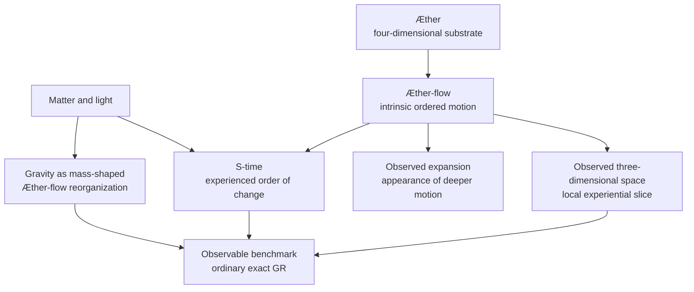
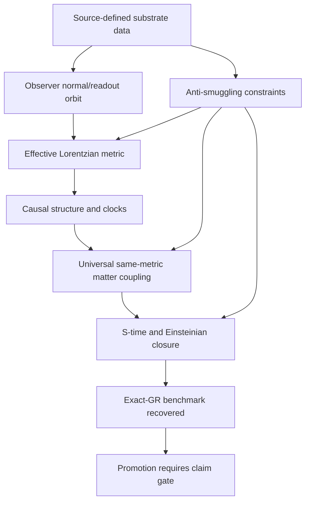

# Æther-flow Ontology Spec

## Rendering Intent

Create a standalone, source-backed HTML explainer that helps both lay readers
and technical reviewers understand what the project means by `Æther-flow
ontology`. The page should not explain generic ontology first. It should explain
this project’s vocabulary, why that vocabulary exists, how it connects to exact
general relativity as a benchmark, and why the first-principles substrate
derivation remains open.

The page should have three reading layers:

1. **Plain-language orientation**: what the ontology is trying to picture.
2. **Technical bridge**: how the project maps that picture to exact-GR benchmark
   adoption, observer readout, same-metric matter, and closure constraints.
3. **Source-grounded deep dive**: short source quotations, source chips, and
   claim-boundary notes showing what the current files do and do not authorize.

Do not alter the registered diagrams. Add richer explanation around them.

## Required Visual Structure

- Source-backed content blocks should be full-width documentation panels, not
  narrow placeholder cards.
- Each content block should include a plain answer, project function, source
  basis, and claim boundary.
- Add term cards for `Æther`, `Æther-flow`, observed three-dimensional space,
  `S-time`, observed expansion, gravity, exact closure, adoption, derivation,
  observer readout, and anti-smuggling.
- Add a source quote gallery with short excerpts from the two ontology Markdown
  files.
- Add an adoption-vs-derivation bridge for readers who know GR but not this
  project.
- Add a derivation-burden checklist explaining the missing mathematical work
  without implying the work has been solved.
- Preserve the All Source Materials section with source-path evidence.
- Preserve the human-only generated derivative boundary.

## Required Diagrams

<!-- mermaid-diagram-id: aether-flow-ontology-stack -->

<!-- mermaid-diagram-id: derivation-burden-map -->

## Source-Backed Summary

Summary heading: `Summary of Æther-flow Ontology`

Summary text:

The Æther-flow ontology is the project’s vocabulary for a proposed deeper substrate, its ordered motion, and the observer-level world that appears as space, time-order, expansion, gravity, matter behavior, and relativistic geometry. Its function is conceptual and methodological: it gives candidate construction something precise to talk about while keeping exact general relativity as the observable benchmark. The ontology does not by itself prove a replacement for GR. The current research burden is to recover Lorentzian metric structure, causal behavior, clock behavior, same-metric matter coupling, invariance, and closure from source-side substrate data without importing the target geometry by hand. That makes anti-smuggling discipline part of the ontology’s function. The vocabulary matters because the project is trying to distinguish an interpretive picture, a mathematical model, and an accepted empirical theory rather than letting those categories collapse.

Summary source basis:

- `ontology/aether-and-aether-flow.md`
- `ontology/aether_flow_interpretation-lemen.md`
- `README.md`
- `registries/CLAIM_BOUNDARY_REGISTRY.csv`

## Required Content Blocks

- subject_summary: A source-backed summary of Æther-flow Ontology that directly explains the project subject, its functionality, why it matters, how it fits the physics or AI research-agent system, and its grounding source paths: `ontology/aether-and-aether-flow.md`, `ontology/aether_flow_interpretation-lemen.md`, `README.md`, `registries/CLAIM_BOUNDARY_REGISTRY.csv`.
- layperson_orientation: A source-backed reader block on plain model that explains the project functionality, why it matters, how it works inside AEther-Flow, what boundary constrains it, and where to inspect next; source paths: `ontology/aether-and-aether-flow.md`, `README.md`.
- ontology_terms: A source-backed reader block on project terms that explains the project functionality, why it matters, how it works inside AEther-Flow, what boundary constrains it, and where to inspect next; source paths: `ontology/aether-and-aether-flow.md`, `ontology/aether_flow_interpretation-lemen.md`.
- exact_gr_benchmark: A source-backed reader block on benchmark boundary that explains the project functionality, why it matters, how it works inside AEther-Flow, what boundary constrains it, and where to inspect next; source paths: `README.md`, `registries/TEX_SOURCE_REGISTRY.csv`, `registries/CLAIM_BOUNDARY_REGISTRY.csv`.
- derivation_burden: A source-backed reader block on derivation burden that explains the project functionality, why it matters, how it works inside AEther-Flow, what boundary constrains it, and where to inspect next; source paths: `ontology/aether-and-aether-flow.md`, `registries/CLAIM_BOUNDARY_REGISTRY.csv`.
- source_quote_gallery: A source-backed reader block on source reading that explains the project functionality, why it matters, how it works inside AEther-Flow, what boundary constrains it, and where to inspect next; source paths: `ontology/aether-and-aether-flow.md`, `ontology/aether_flow_interpretation-lemen.md`.
- claim_boundaries: A source-backed reader block on claim boundary that explains the project functionality, why it matters, how it works inside AEther-Flow, what boundary constrains it, and where to inspect next; source paths: `AGENTS.md`, `registries/CLAIM_BOUNDARY_REGISTRY.csv`.
- reader_paths: A source-backed reader block on reader paths that explains the project functionality, why it matters, how it works inside AEther-Flow, what boundary constrains it, and where to inspect next; source paths: `README.md`, `AGENTS.md`, `research_control/README.md`.
