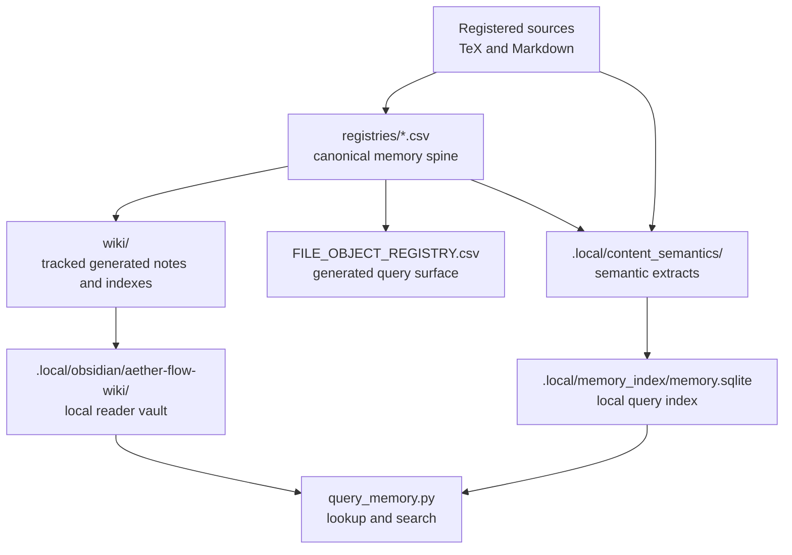
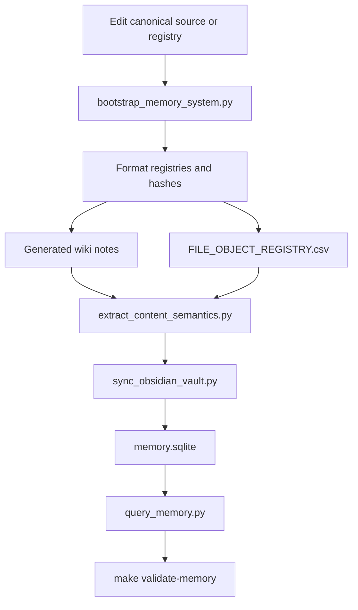

# Memory System Spec

## Rendering Intent

Create a tracked HTML drilldown for the project memory system. The page should
avoid saying the project has competing wikis. The correct model is one
source-first memory system with multiple retrieval surfaces:

- `registries/*.csv`: canonical memory spine for object identity, provenance,
  routing, hashes, ownership, validation, and generated-output binding.
- `wiki/`: tracked generated wiki notes and indexes for repo-visible
  navigation.
- `.local/obsidian/aether-flow-wiki/`: local generated Obsidian reader vault;
  useful, noncanonical, and machine-local.
- `.local/content_semantics/` and `.local/memory_index/memory.sqlite`:
  agent-queryable semantic/search layer and local query surface.

## Required Visual Structure

- Source-backed coverage rows: render `Source-Backed Coverage` content blocks
  as full-width horizontal rows rather than narrow multi-column cards. Tables
  must use readable auto layout, with any wide overflow scoped inside the
  content block instead of the page body.
- Layered map from canonical CSV spine to generated tracked wiki to local
  Obsidian vault to semantic/query surfaces.
- Regeneration workflow showing source edit -> bootstrap -> wiki/registry rows
  -> content semantics -> vault sync -> SQLite query surface.
- Authority boundary panels distinguishing canonical source/registry rows from
  generated retrieval layers.
- Workflow step inspector for regeneration and validation commands.
- All Source Materials section with source-path evidence; claim-boundary metadata remains in the source spec.

## Workflow Step Inspector Basis

Render the workflow inspector as the memory-regeneration path:

1. Edit a registered source or registry row.
2. Run memory bootstrap to refresh object rows, hashes, relationships, and
   generated-output bindings.
3. Regenerate tracked wiki notes and indexes from the registry spine.
4. Refresh file-object and semantic registries for queryable memory.
5. Sync local Obsidian and SQLite retrieval surfaces when the workflow needs
   local lookup.
6. Query memory only as an evidence-finding aid, not as independent authority.
7. Validate bootstrap, registries, wiki outputs, and documentation surfaces.
8. Inspect canonical sources before using retrieved material in a new project
   change.

## Required Diagrams

<!-- mermaid-diagram-id: memory-surface-map -->

<!-- mermaid-diagram-id: memory-regeneration-flow -->

## Source-Backed Summary

Summary heading: `Summary of Memory System`

Summary text:

The memory system is the repository’s source-first retrieval and derivative-generation layer for registered Markdown, TeX, PDFs, HTML explainers, wiki notes, semantic extracts, file objects, and local query surfaces. Its functionality is to turn canonical registries and source files into generated wiki pages, source hashes, object relationships, local Obsidian vault entries, semantic text extracts, and SQLite-backed lookup surfaces without letting any generated artifact become an independent source of claims. It matters because humans and agents need fast ways to find evidence, but retrieval convenience must not bypass the authority hierarchy. The system connects source edits to bootstrap regeneration, validation receipts, content semantics, and local reading aids while preserving provenance.

Summary source basis:

- `registries/MARKDOWN_SOURCE_REGISTRY.csv`
- `registries/HTML_EXPLAINER_REGISTRY.csv`
- `.codex/skills/project-memory-system/SKILL.md`
- `.codex/skills/obsidian-wiki/SKILL.md`

## Required Content Blocks

- subject_summary: A source-backed summary of Memory System that directly explains the project subject, its functionality, why it matters, how it fits the physics or AI research-agent system, and its grounding source paths: `registries/MARKDOWN_SOURCE_REGISTRY.csv`, `registries/HTML_EXPLAINER_REGISTRY.csv`, `.codex/skills/project-memory-system/SKILL.md`, `.codex/skills/obsidian-wiki/SKILL.md`.
- csv_memory_spine: A source-backed reader block on csv spine that explains the project functionality, why it matters, how it works inside AEther-Flow, what boundary constrains it, and where to inspect next; source paths: `registries/MARKDOWN_SOURCE_REGISTRY.csv`, `registries/FILE_OBJECT_REGISTRY.csv`.
- tracked_generated_wiki: A source-backed reader block on tracked wiki that explains the project functionality, why it matters, how it works inside AEther-Flow, what boundary constrains it, and where to inspect next; source paths: `registries/WIKI_ARTIFACT_REGISTRY.csv`, `.codex/skills/markdown-wiki/SKILL.md`.
- local_obsidian_vault: A source-backed reader block on local vault that explains the project functionality, why it matters, how it works inside AEther-Flow, what boundary constrains it, and where to inspect next; source paths: `.codex/skills/obsidian-wiki/SKILL.md`, `registries/OBSIDIAN_VAULT_REGISTRY.csv`.
- semantic_query_layer: A source-backed reader block on semantic query that explains the project functionality, why it matters, how it works inside AEther-Flow, what boundary constrains it, and where to inspect next; source paths: `registries/CONTENT_SEMANTIC_REGISTRY.csv`, `.codex/skills/project-memory-system/SKILL.md`.
- authority_boundaries: A source-backed reader block on memory boundary that explains the project functionality, why it matters, how it works inside AEther-Flow, what boundary constrains it, and where to inspect next; source paths: `AGENTS.md`, `registries/FILE_OBJECT_REGISTRY.csv`.
