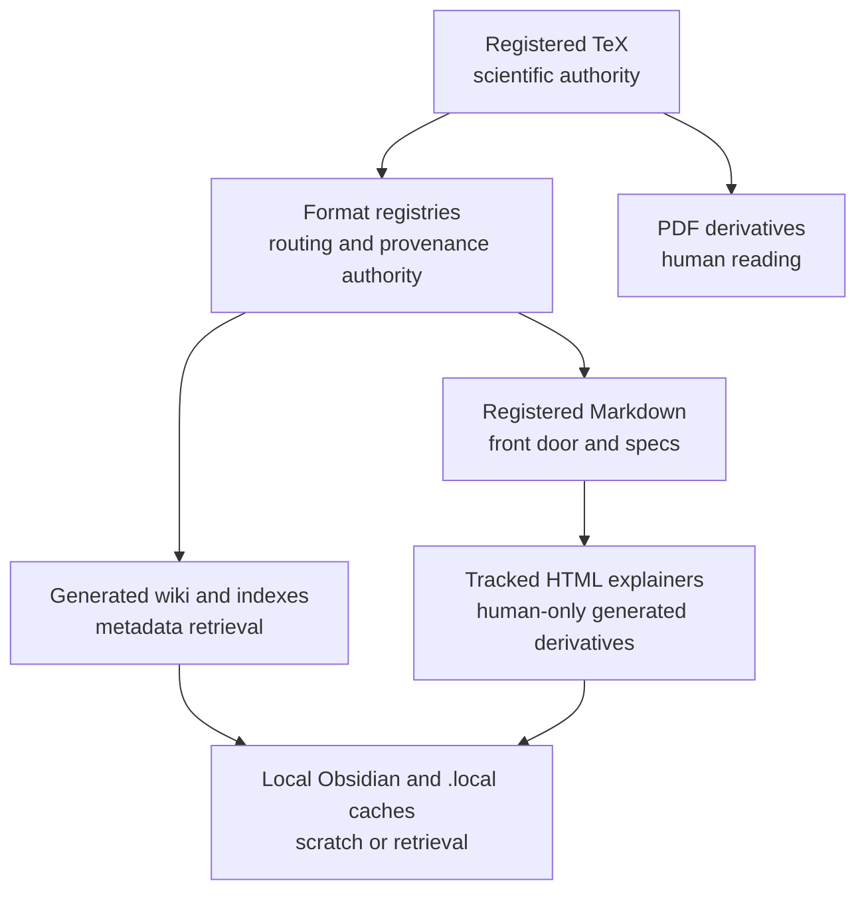
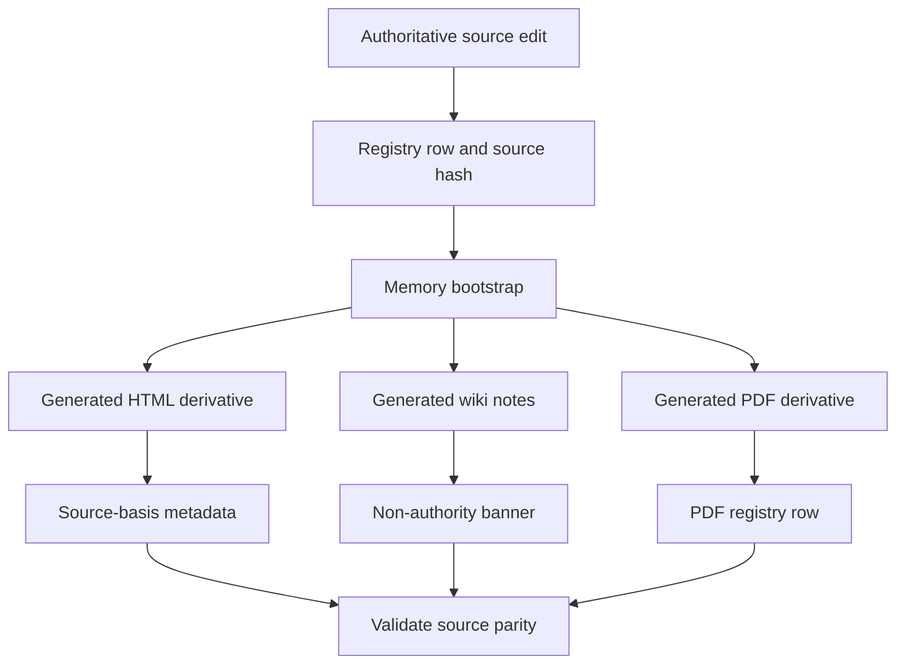

# Source Authority Spec

## Rendering Intent

Create a tracked HTML drilldown for source authority. The page should explain
which materials carry authority and which materials are generated retrieval or
human-reading derivatives.

The page should make the hierarchy explicit:

1. Registered `.tex` files are canonical for scientific and derivational
   claims.
2. Format-specific registries are canonical for routing, provenance, generated
   outputs, and agent-queryable memory.
3. Registered Markdown files are canonical for front-door material, agent
   guidance, and source-backed HTML explainer specs.
4. PDFs, generated wiki notes, generated indexes, HTML explainers, local
   Obsidian vault files, and `.local/` caches are derivative or scratch
   surfaces.

The page should use an authority/use-case matrix rather than an extension-only
list. Rows should include format or lane, primary use, authority status, who or
what edits it, generated/authored status, validation, and examples. Cover
`.tex`, `.md`, `.csv`, `.yaml`, `.html`, `.pdf`, `.sqlite` or semantic
extracts, `.meta.json`, and `.local/` surfaces.

## Required Visual Structure

- Source-backed coverage rows: render `Source-Backed Coverage` content blocks
  as full-width horizontal rows rather than narrow multi-column cards. Tables
  must use readable auto layout, with any wide overflow scoped inside the
  content block instead of the page body.
- Responsive containment: navigation chips, grids, tables, code paths, source
  drilldowns, and diagram shells must not create body-level horizontal overflow
  on mobile or desktop viewports.
- Adaptive diagram fit: diagram-backed boxes must read the rendered
  SVG viewBox, set the box height from diagram aspect ratio and available
  width within bounded min/max limits, and make Fit recompute that best-fit
  geometry so horizontal diagrams do not collapse to intrinsic SVG width.
- Three-layer readability: stack the high-level, operational, and evidence
  layer sections vertically; cards inside each layer must auto-fit at a
  readable minimum width rather than nesting fixed three-column grids.
- High-level model: authority ladder and why source-first governance exists.
- Operational model: update source -> regenerate derivatives -> validate
  registries and parity.
- Low-level evidence model: registry rows, source hashes, generated-output
  links, source-basis metadata, and validation commands.
- Format matrix: explain what a file means in this project before naming the
  extension.
- Workflow step inspector for derivative generation.
- All Source Materials section with source-path evidence; claim-boundary metadata remains in the source spec.

## Workflow Step Inspector Basis

Render the workflow inspector as the source-first derivative path:

1. Edit the authoritative TeX, registry, or registered Markdown source first.
2. Update the corresponding registry row and source hash when required.
3. Regenerate dependent wiki, HTML, PDF, semantic, or local retrieval surfaces
   through approved tooling.
4. Preserve source-basis metadata and visible source evidence in derivatives.
5. Validate source parity, hashes, generated-output bindings, and authority
   status.
6. Use generated surfaces for reading and retrieval, not independent claims.
7. Treat `.local/` caches as scratch or machine-local retrieval aids.
8. Return to the canonical source or registry before making project-knowledge
   changes.

## Required Diagrams

<!-- mermaid-diagram-id: source-authority-ladder -->

<!-- mermaid-diagram-id: derivative-generation-flow -->

## Source-Backed Summary

Summary heading: `Summary of Source Authority`

Summary text:

Source authority is the repository rule for deciding which files can define project truth and which files are generated aids for reading, retrieval, validation, or publication. Its functionality is to rank registered TeX, format-specific registries, registered Markdown, generated HTML, generated wiki notes, PDFs, local Obsidian surfaces, and `.local` caches so contributors update canonical sources first and regenerate dependent artifacts afterward. This matters because many surfaces are polished, searchable, or easier to read than the source files, but convenience does not create independent authority. The model preserves scientific claim discipline, project-control provenance, and reproducible memory refreshes across a repository that intentionally generates many human-facing derivatives.

Summary source basis:

- `AGENTS.md`
- `.codex/skills/project-memory-system/SKILL.md`
- `registries/HTML_EXPLAINER_REGISTRY.csv`
- `registries/FILE_OBJECT_REGISTRY.csv`

## Required Content Blocks

- subject_summary: A source-backed summary of Source Authority that directly explains the project subject, its functionality, why it matters, how it fits the physics or AI research-agent system, and its grounding source paths: `AGENTS.md`, `.codex/skills/project-memory-system/SKILL.md`, `registries/HTML_EXPLAINER_REGISTRY.csv`, `registries/FILE_OBJECT_REGISTRY.csv`.
- authority_ladder: A source-backed reader block on authority ladder that explains the project functionality, why it matters, how it works inside AEther-Flow, what boundary constrains it, and where to inspect next; source paths: `AGENTS.md`, `registries/TEX_SOURCE_REGISTRY.csv`, `registries/MARKDOWN_SOURCE_REGISTRY.csv`.
- format_use_case_matrix: A source-backed reader block on format matrix that explains the project functionality, why it matters, how it works inside AEther-Flow, what boundary constrains it, and where to inspect next; source paths: `README.md`, `AGENTS.md`, `.codex/skills/project-memory-system/SKILL.md`.
- generated_derivatives: A source-backed reader block on generated derivatives that explains the project functionality, why it matters, how it works inside AEther-Flow, what boundary constrains it, and where to inspect next; source paths: `registries/HTML_EXPLAINER_REGISTRY.csv`, `registries/WIKI_ARTIFACT_REGISTRY.csv`, `registries/PDF_DERIVATIVE_REGISTRY.csv`.
- local_retrieval_surfaces: A source-backed reader block on local retrieval that explains the project functionality, why it matters, how it works inside AEther-Flow, what boundary constrains it, and where to inspect next; source paths: `.codex/skills/obsidian-wiki/SKILL.md`, `.codex/skills/project-memory-system/SKILL.md`.
- validation_evidence: A source-backed reader block on validation evidence that explains the project functionality, why it matters, how it works inside AEther-Flow, what boundary constrains it, and where to inspect next; source paths: `.codex/skills/project-memory-system/SKILL.md`, `scripts/project_control/validate_documentation_impact.py`.
