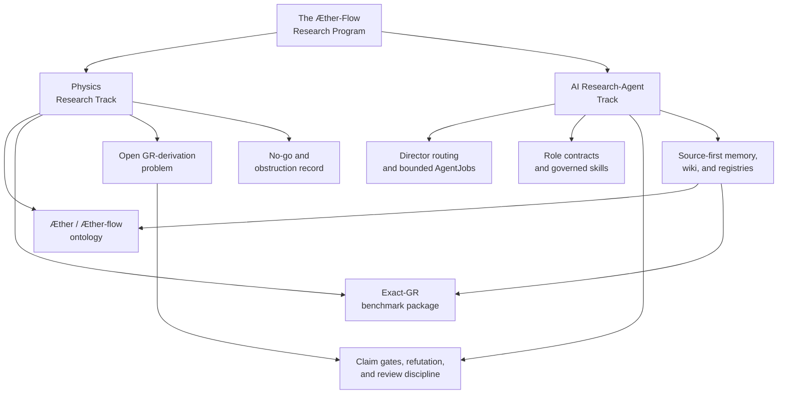

<!-- authority: explanatory -->
---

# The Æther-Flow Interpretation of Relativity Research Project

---

<p align="center">
  
</p>

---

## The Research Program

The Æther-Flow Interpretation of Relativity Research Program is a dual physics-and-AI research project.

The physics track studies whether ordinary general relativity can be interpreted, and eventually derived, from a deeper four-dimensional `Æther` / `Æther-flow` ontology. The current public benchmark keeps GR exactly at observable scale: one operative Lorentzian metric, universal matter coupling, standard causal structure, and the same empirical content expected from ordinary GR. A first-principles derivation of that benchmark from substrate structure remains open.

The AI research-agent track develops and tests a human-scaffolded research-agent system for theoretical physics: agent roles, routing rules, claim gates, manuscript tools, result handling, review discipline, and source-first scientific memory. Its long-term technical goal is staged autonomy toward an autonomous theoretical-physics research system, while public release, authorship responsibility, and external outreach remain human-accountable under current governance.

### The Two Tracks

#### Physics track

- Public benchmark: an exact-GR interpretive package for `The Æther-Flow Interpretation of Relativity`.
- Current observable scale: ordinary GR, one operative metric, universal matter coupling, standard causal structure.
- Open burden: deriving the benchmark from explicit substrate structure, with effective Lorentzian metric generation as the first proof milestone.
- Negative result: the frozen derivation line is preserved under `Not Derived On Current Line`.

#### AI research-agent track

- Currently human-scaffolded AI workflow for theoretical physics research, with staged autonomy as the long-term AI-system ambition.
- Role-based routing through candidate intake, refutation, defense, gate decisions, and integration notes.
- Manuscript-centered memory through active `.tex`, PDFs, CSV routing, and the Manuscript Wiki.
- Support for exploring, testing, refuting, proving, accepting, and organizing candidate derivation steps without treating workflow status as physics proof.
- Explicit separation between physics claims, AI-methodology claims, tooling claims, open problems, and stopped results.
- A project-system improvement loop for documentation drift, validators, roles,
  schemas, memory tooling, and operational reliability.

#### How they co-develop

The physics problem gives the AI system a hard, real research environment. The AI research-agent system gives the physics program disciplined ways to explore ideas, reject failed mechanisms, preserve negative results, and avoid overclaiming. The shared target is stronger than organization alone: derive GR from the `Æther` / `Æther-flow` ontology if the required gates can actually be passed.



---

## This repo

This repository is a reset of the earlier research program in The Æther GR Derivation. The previous control system accumulated useful artifacts and lessons, but it did not derive GR from the ontology or produce a decisive hard-fail result. This reset keeps the exact-GR benchmark as a disciplined reference point while rebuilding the derivation program around clearer claim boundaries, tighter negative-result preservation, and more explicit AI-agent governance.

The working goal is not to assert that GR has already been derived. The working goal is to improve the research system until it can either construct a valid derivation path from the Æther Flow ontology or identify reproducible obstructions strong enough to stop a line of attack.

---

## The Æther Flow Ontology

The project’s ontology lane treats `Æther` as a proposed four-dimensional substrate and `Æther-flow` as the structured flow or relational organization from which relativistic behavior might be recovered. In the current repository state, this is a research ontology and an explanatory frame, not an established derivation of GR.

The accepted benchmark boundary is conservative: observable-scale physics remains ordinary GR. The open burden is to show, without importing the target metric by hand, how effective Lorentzian geometry, causal structure, clock behavior, matter coupling, and invariance properties could arise from source-defined substrate data. Registered `.tex` sources and claim-boundary registries carry scientific authority; this README only summarizes that state for humans.

<p align="left">
   Watch the Æther-Flow Ontology Video:</br>
  <a href="https://www.youtube.com/watch?v=psbk97rd9T8">
    
  </a>
</p>

---

## The research-agent system

The research-agent system is the project’s operating discipline for theoretical work. It routes bounded tasks through Director decisions, AgentJobs, role contracts, completion records, registries, validation scripts, and handoffs. Its purpose is to make research progress auditable: proposals can be constructed, refuted, repaired, preserved as negative results, or held behind gates without being mistaken for accepted physics.

Every new physics research AgentJob created after `2026-06-17T04:08:16Z` must declare `parent_child_parallel_synthesis`. That mode preserves the external invariant: one Director decision, one outer AgentJob, one execution-role record, one completion record, and one fused final output. The parent and child execution units inherit the same authority, claim boundary, allowlists, validators, and stop conditions; they are not separate AgentJobs, new roles, or a route around conflict review.

Future routing after `2026-06-17T04:29:31Z` treats generic controlled pause as a human-gate condition, not a normal result of missing local data. If the next step is theoretical selection among a source-side selector primitive, irrelevance theorem, concrete witness, scoped no-go question, or bounded calculation, the Director routes a bounded `theoretical-continuation-selector@0.1.0` AgentJob. A pause-like route is reserved for protected authority such as canonical ontology edit or ontology adoption.

Every new physics research AgentJob created after `2026-06-17T15:46:25Z` must name a `target_derivation_milestone` and `milestone_burden` from `research_control/design/gr_derivation_burden_map.md`. Future completions must update the expanded Distance-to-GR matrix and include a new mathematical payload. Repeated-burden or scoped-obstruction results must evaluate freeze criteria rather than orbiting the same missing bridge step indefinitely.

The system deliberately separates several kinds of claims:

- Physics claims about ontology, benchmark behavior, derivations, obstructions, and accepted or rejected candidates.
- AI-methodology claims about agent workflows, routing, memory, validation, and staged autonomy.
- Tooling claims about scripts, generated artifacts, documentation, and registry consistency.
- Human-facing explanations that help readers understand the project without changing authority.

Project-system improvement is tracked separately from physics continuation. Documentation Curator work may improve explanatory Markdown and source-backed visual explainers, but it must not change control contracts, validators, role authority, or scientific claim status.

---

## Human Visual Explainers

Tracked HTML explainers under `html/` are human-only generated derivatives.
Each retained public page must have a publication brief under
`markdown/publication-briefs/`, a Markdown source spec under
`markdown/html-explainer-specs/`, and a row in
`registries/PUBLICATION_BRIEF_REGISTRY.csv`. The publication brief registry is
the sole active control surface for public HTML and GitHub-facing Markdown
publication pages.

For GitHub browsing, start with the reviewed publication pages below. They are
source-backed reader surfaces, but they are generated noncanonical derivatives:
they are non-authoritative for physics claims, control decisions, routing,
validator behavior, and registry authority.

### Start here

| Page | Reader job | GitHub Markdown | HTML |
| --- | --- | --- | --- |
| Project Overview | Front-door orientation to the two project missions and first reading path. | [`project-overview-explainer.md`](github-facing/project-overview-explainer.md) | [`project-overview-explainer.html`](html/project-overview-explainer.html) |
| Source Authority And Generated Derivatives | Boundary map for source authority, generated derivatives, registries, and local retrieval layers. | [`source-authority-explainer.md`](github-facing/source-authority-explainer.md) | [`source-authority-explainer.html`](html/source-authority-explainer.html) |

### Physics frame

| Page | Reader job | GitHub Markdown | HTML |
| --- | --- | --- | --- |
| AEther-Flow Physics Program | Overview of the physics mission, exact-GR benchmark boundary, and open derivation burden. | [`aether-flow-physics-program-explainer.md`](github-facing/aether-flow-physics-program-explainer.md) | [`aether-flow-physics-program-explainer.html`](html/aether-flow-physics-program-explainer.html) |
| AEther-Flow Ontology | Concept explainer for the proposed substrate ontology and its current claim limits. | [`aether-flow-ontology-explainer.md`](github-facing/aether-flow-ontology-explainer.md) | [`aether-flow-ontology-explainer.html`](html/aether-flow-ontology-explainer.html) |
| Exact-GR Benchmark Boundary | Comparison map separating benchmark compatibility from first-principles derivation. | [`exact-gr-benchmark-boundary-explainer.md`](github-facing/exact-gr-benchmark-boundary-explainer.md) | [`exact-gr-benchmark-boundary-explainer.html`](html/exact-gr-benchmark-boundary-explainer.html) |
| GR Derivation Roadmap | Decision guide for the staged burden from ontology to effective Lorentzian geometry and GR. | [`gr-derivation-roadmap-explainer.md`](github-facing/gr-derivation-roadmap-explainer.md) | [`gr-derivation-roadmap-explainer.html`](html/gr-derivation-roadmap-explainer.html) |
| Claim Gates, Negative Results, And Freeze Criteria | Boundary map for accepted claims, stopped lines, no-go records, and freeze conditions. | [`claim-gates-explainer.md`](github-facing/claim-gates-explainer.md) | [`claim-gates-explainer.html`](html/claim-gates-explainer.html) |

### Research-control operation

| Page | Reader job | GitHub Markdown | HTML |
| --- | --- | --- | --- |
| Research-Agent Workflow | Workflow guide for Director routing, AgentJobs, roles, completions, and handoffs. | [`research-agent-workflow-explainer.md`](github-facing/research-agent-workflow-explainer.md) | [`research-agent-workflow-explainer.html`](html/research-agent-workflow-explainer.html) |
| Director Decisions And AgentJob Lifecycle | Lifecycle guide for decisions, job contracts, execution records, and completion evidence. | [`director-agentjob-lifecycle-explainer.md`](github-facing/director-agentjob-lifecycle-explainer.md) | [`director-agentjob-lifecycle-explainer.html`](html/director-agentjob-lifecycle-explainer.html) |
| Parent-Child Parallel Synthesis | Concept explainer for one outer AgentJob with internal parent/child synthesis. | [`parent-child-synthesis-explainer.md`](github-facing/parent-child-synthesis-explainer.md) | [`parent-child-synthesis-explainer.html`](html/parent-child-synthesis-explainer.html) |
| Role Routing And Execution Contracts | Reference catalog for role identity, task overlays, provisional roles, and write boundaries. | [`role-routing-explainer.md`](github-facing/role-routing-explainer.md) | [`role-routing-explainer.html`](html/role-routing-explainer.html) |

### Project-system/operator references

| Page | Reader job | GitHub Markdown | HTML |
| --- | --- | --- | --- |
| Documentation Curator Publication Process | Workflow guide for brief-first public documentation and review evidence. | [`documentation-curator-publication-process-explainer.md`](github-facing/documentation-curator-publication-process-explainer.md) | [`documentation-curator-publication-process-explainer.html`](html/documentation-curator-publication-process-explainer.html) |
| Project-System Improvement Loop | Workflow guide for non-physics repairs to roles, validators, memory tooling, and docs. | [`project-system-improvement-explainer.md`](github-facing/project-system-improvement-explainer.md) | [`project-system-improvement-explainer.html`](html/project-system-improvement-explainer.html) |
| Memory Registries Wiki And Retrieval Surfaces | Reference catalog for CSV registries, wiki notes, Obsidian, semantic extracts, and retrieval limits. | [`memory-system-explainer.md`](github-facing/memory-system-explainer.md) | [`memory-system-explainer.html`](html/memory-system-explainer.html) |
| Roles And Skills Catalog | Reference catalog for active role contracts and repo-local skills. | [`roles-and-skills-explainer.md`](github-facing/roles-and-skills-explainer.md) | [`roles-and-skills-explainer.html`](html/roles-and-skills-explainer.html) |
| Validator And Operator Workflow | Operator guide for deterministic checks, documentation impact, and checkpoint gates. | [`validator-operator-workflow-explainer.md`](github-facing/validator-operator-workflow-explainer.md) | [`validator-operator-workflow-explainer.html`](html/validator-operator-workflow-explainer.html) |
| Technical Requirements For Reproducible Operation | Operator guide for the local Python, Codex, memory, validation, and rendering requirements. | [`technical-requirements-explainer.md`](github-facing/technical-requirements-explainer.md) | [`technical-requirements-explainer.html`](html/technical-requirements-explainer.html) |

---

## Requirements

<!-- authority: control -->

### Current AI-agent harness

This project is currently developed and operated inside the Codex app. The
repo-local `.codex/` skills, prompts, agent configuration files, continuation
workflows, tool-use expectations, and Documentation Curator loops assume the
Codex app as the present AI-agent execution harness.

Read-only inspection, normal Git use, and Python validators can still be run
outside the Codex app. Reproducing the governed research-agent workflow as it is
used in this repository currently requires Codex app access. A future custom or
third-party AI harness may replace that dependency only after it preserves the
same tracked state, authority hierarchy, role boundaries, allowlists, validator
gates, checkpoint discipline, and generated-derivative boundaries.

### Python environment

This repository uses a local Python virtual environment for scripts.

- Runtime: Python 3.12.13 in `.venv/`
- Dependency file: `requirements.txt`
- Environment directory: `.venv/`, ignored by `.gitignore`
- Current dependency status: PyMuPDF is used for direct PDF text extraction in
  the local semantic memory system.

Create or refresh the environment from the repository root:

```zsh
python3 -m venv .venv
source .venv/bin/activate
python -m pip install -r requirements.txt
```

Run scripts with the active environment:

```zsh
python path/to/script.py
```

Or run scripts without activating the shell:

```zsh
.venv/bin/python path/to/script.py
```

When a Python script requires an external package, add one package per line to
`requirements.txt`, then rerun:

```zsh
.venv/bin/python -m pip install -r requirements.txt
```

### Requirement tiers

- Read and inspect: browser, text editor, and Git.
- Operate the governed AI-agent workflow: Codex app plus the repo-local
  `.codex/` skills, prompts, and agent configuration files.
- Run validators and memory scripts: Python `.venv`, `requirements.txt`, and
  PyMuPDF.
- Regenerate memory/wiki/registry surfaces:
  `.codex/skills/project-memory-system/scripts/bootstrap_memory_system.py` and
  `make validate-memory`.
- Regenerate diagram-backed HTML: Node.js, npm, pinned Mermaid dependencies,
  and Playwright Chromium under
  `.codex/skills/visual-explainer/subskills/mermaid-documentation/scripts/`.
- Use local retrieval vault: optional Obsidian reader plus
  `.local/obsidian/aether-flow-wiki/`.
- Build or refresh PDFs: LaTeX/PDF build path only when TeX derivatives are in
  scope.

Diagram-rendering setup:

```zsh
cd .codex/skills/visual-explainer/subskills/mermaid-documentation/scripts
npm ci
npx playwright install chromium
```

---

## Memory, wiki, and registry system

This repository uses a source-first memory system for project knowledge.

Authority order:

1. Registered `.tex` files are canonical for physics research and derivational claims.
2. Format-specific CSV registries are canonical for routing, provenance, generated-output tracking, and agent-queryable memory.
3. Registered Markdown files are canonical for GitHub documentation, agent guidance, and project-control notes.
4. PDFs, wiki notes, wiki indexes, master registries, and HTML explainers are generated derivatives.

Generated artifacts are tracked when they are part of the project memory surface, but they are not independent authority. Update the source file and registry row, then regenerate.

The live ontology lane is `ontology/`. The `legacy_ontology/` lane is a
2026-06-18 archival snapshot of the ontology TeX, PDF, and Markdown package for
future comparison. It is registered for wiki and CSV retrieval as archival
noncanonical material; it does not replace the live ontology, authorize
ontology extension, or promote any derivation claim.

Registered Markdown sources include front-door docs, scoped agent guidance,
role contracts, schema contracts, skill contracts, key research-control design
notes, ontology-adjacent explanatory notes, publication briefs, and Markdown
source specs for generated HTML explainers.

Tracked HTML explainers are human-only generated derivatives. A tracked
`html/*.html` file is valid only when it is listed in
`registries/PUBLICATION_BRIEF_REGISTRY.csv` and backed by the row's publication
brief and Markdown source spec. Modify the publication brief and spec first,
then regenerate or replace the HTML output in the same bounded transaction.
Use `scripts/validate_publication_process.py --root . --strict` to verify
source grounding, authority boundaries, no-network HTML, review evidence, and
absence of orphan public explainer outputs.

Bootstrap or refresh the memory system:

```zsh
.venv/bin/python .codex/skills/project-memory-system/scripts/bootstrap_memory_system.py
```

Validate without writing:

```zsh
.venv/bin/python .codex/skills/project-memory-system/scripts/bootstrap_memory_system.py --validate-only
```

Run smoke tests:

```zsh
.venv/bin/python -m unittest discover -s tests
```

Run the full memory-system acceptance chain, including generated memory refresh,
local vault sync, linting, tests, and query smoke checks:

```zsh
make validate-memory
```

Initialize and sync the local Obsidian memory vault:

```zsh
.venv/bin/python .codex/skills/project-memory-system/scripts/sync_obsidian_vault.py
```

Query the combined CSV, relationship, vault, and content-semantic memory system:

```zsh
.venv/bin/python .codex/skills/project-memory-system/scripts/query_memory.py status --json
```

Clean ignored local noise from canonical lanes:

```zsh
.venv/bin/python .codex/skills/project-memory-system/scripts/clean_local_noise.py --dry-run
```

---

## Research-control workflow

Research-control continuation is tracked under `research_control/`. Use
`.codex/skills/continue-research/SKILL.md` as the entry point.

## Project-system improvement workflow

Project-system improvement is tracked separately from physics continuation.
Use `.codex/skills/improve-project-system/SKILL.md` when a change affects
roles, schemas, validators, checkpoint gates, memory tooling, control-marked
skill guidance, project-control documentation, or generated-doc pipelines.

Mixed Markdown files use authority markers. Explanatory sections describe
current behavior without changing obligations. Control sections change or define
agent behavior, routing, authority, validator expectations, allowed paths,
commands, schemas, stop conditions, or workflow gates.

Decision vocabulary:

| Term | Use when | Authority and outputs | Boundary |
| --- | --- | --- | --- |
| `continue-research` | Continue physics research-control from tracked state, handoffs, and the active task boundary. | Uses `.codex/skills/continue-research/SKILL.md`; may route one bounded research AgentJob through the Director-controlled control spine. | Does not repair project-system machinery unless the routed task explicitly allows it. |
| `improve-project-system` | Repair or clarify the research system itself: roles, schemas, validators, checkpoint gates, memory tooling, skill guidance, docs, or generated-doc pipelines. | Uses `.codex/skills/improve-project-system/SKILL.md`; may resolve one signal, one classifier result, or one bounded project-system AgentJob. | Does not perform physics derivation, promote claims, or edit canonical science sources. |
| `user-modified-project` | Integrate human-made local repository edits after a brief intent note. | Uses `.codex/skills/user-modified-project/SKILL.md`; classifies the diff, routes to the correct controlled workflow, refreshes registry/wiki derivatives through bootstrap, and checkpoints only after validation. | Does not bypass `continue-research`, `improve-project-system`, claim gates, generated-surface rules, or AgentJob allowlists. |
| Project-System Director | A project-system boundary or routing question must be resolved before work proceeds. | Creates a project-system Director Decision Record and selects one bounded non-scientific AgentJob. | Does not execute the selected job or expand role authority by convention. |
| Documentation Curator | Publication briefs, explanatory documentation, documentation registries, documentation-source specs, source-backed human HTML explainers, GitHub-facing Markdown derivatives, or documentation-impact receipts drift from current machinery. | Updates allowed explanatory Markdown, publication briefs, `markdown/html-explainer-specs/*.md`, spec-backed `html/*.html` derivatives, GitHub-facing Markdown, and documentation-impact records when required. | Does not change control contracts, workflow commands, routing, validators, permissions, scientific claim status, or generated public docs as independent authority. |
| Project-Control Maintainer | Skill contracts, role contracts, schema contracts, control registries, or control-marked mixed Markdown need functional maintenance. | Edits allowed control markdown and project-control contracts under one AgentJob allowlist. | Does not edit explanatory-only sections unless a task overlay explicitly grants `explanatory_markdown` permission. |
| Validator Engineer | Deterministic validator, checkpoint gate, or test behavior is missing, unclear, or incorrect. | Edits allowed validator scripts, tests, documented validator contracts, and registry rows. | Does not use model judgment as a validator substitute or decide human policy questions. |
| Memory-System Maintainer | Source-first memory, wiki, registry, Obsidian, query, or derivative metadata tooling needs maintenance. | Edits allowed memory-system scripts, registry generation rules, query tooling, and related skill documentation. | Does not make generated artifacts authoritative or alter claim-promotion semantics. |

Classify current Git changes:

```zsh
.venv/bin/python scripts/project_control/classify_project_changes.py --json
```

Resolve the next bounded project-system action:

```zsh
.venv/bin/python scripts/project_control/resolve_project_improvement.py --json
```

Resolver output is advisory routing state. Checkpoint blocking is defined by
validator failures and concrete authority-boundary violations, not by the
resolver seeing future work. Completion records do not need a fresh resolver
snapshot just because high or critical signals remain open; resolver snapshots
are optional handoff context unless the AgentJob sets
`resolves_signal_routing: true`. Routing-resolution completions must preserve
repo-relative `resolver_snapshots.before` and `resolver_snapshots.after`
paths to JSON output from `resolve_project_improvement.py --json` and include
nonblank `routing_delta_summary`. The hard validator checks only summary
presence and minimal resolver-shape fields: the advisory flags, checkpoint
gate source, selected signal, open signals, and change classification.
Ordinary validator and documentation jobs do not inherit that burden.

Validate documentation impact:

```zsh
.venv/bin/python scripts/project_control/validate_documentation_impact.py
```

Audit registered documentation surfaces, derivative paths, source hashes, HTML
source-basis links, GitHub-facing derived explainers, and local retrieval
surfaces:

```zsh
.venv/bin/python scripts/project_control/audit_documentation_surfaces.py
```

For project-control validation or CI contexts where ignored `.local/`
retrieval files have not been generated, use the tracked-surface mode:

```zsh
.venv/bin/python scripts/project_control/audit_documentation_surfaces.py --skip-local
```

Project-improvement signal types are defined in
`registries/PROJECT_IMPROVEMENT_SIGNAL_TYPE_REGISTRY.csv`; concrete emitted
signals are recorded in `registries/PROJECT_IMPROVEMENT_SIGNAL_REGISTRY.csv`.
The type registry owns allowed signal kinds and default routing metadata.
Severity remains on the concrete signal instance because the same signal type
can be low or critical depending on the transaction context and concrete
conflict.
A project-system AgentJob should execute at most one bounded improvement and write
`research_control/tasks/<task_id>/documentation_impact.yaml` when the
transaction changes project-system sources. Source-doc-only handling is valid
only for plain documentation edits outside a project-system AgentJob.
Registered high/critical signals are routed before current Git-change work;
registered low/medium signals remain backlog unless no current project-system
action is pending. Documentation-impact records are mechanically checked:
source changes, generated derivatives, classifier reason codes, and required
validators must match the live transaction.
Signal rows that leave the open backlog by moving to `resolved`, `completed`,
`closed`, or `rejected` must include `resolved_by_job_id`,
`resolution_evidence_path`, and `resolved_at`; otherwise future work can be
erased without a bounded AgentJob receipt. For `resolved`, `completed`, and
`closed`, `resolution_evidence_path` must point to a completion YAML with
`validation_status: "PASS"` and a matching `job_id`. For `rejected`, it may
instead point to a Director decision record that names the signal and explains
the rejection. Signal rows do not duplicate validator command strings; the
referenced completion record owns command evidence through `command_results`.
One bounded AgentJob may close multiple project-improvement signals only when
its `objective` names every closed signal ID and its completion record lists
the same IDs in `resolved_project_improvement_signals` with a nonblank
`coherent_resolution_summary`. For shared closures, every signal row must use
the resolving job's canonical `completion_path` from
`registries/AGENT_JOB_REGISTRY.csv` as `resolution_evidence_path`.

Validate that completion or handoff-emitted signals are represented in the
canonical registry:

```zsh
.venv/bin/python scripts/project_control/collect_project_improvement_signals.py --validate-emitted
```

Signal detection is structural: completion and handoff YAML files are parsed
for nonblank `project_improvement_signals` entries, and signal types are read
from the canonical type registry rather than duplicated local constant sets.

---

<!-- authority: explanatory -->

## Project map

```
.
├── .agents/
│   ├── roles/
│   └── schemas/
├── .codex/
│   ├── prompts/
│   │   └── Repo-local prompt templates for visual explanations and reviews.
│   └── skills/
│       ├── project-memory-system/
│       │   └── scripts/
│       ├── improve-project-system/
│       ├── grill-me/
│       ├── markdown-wiki/
│       ├── tex-wiki/
│       ├── pdf-derivative-build/
│       ├── obsidian-wiki/
│       ├── html-visual-explainer/
│       ├── user-modified-project/
│       ├── ontology-promotion/
│       └── visual-explainer/
├── AGENTS.md
│   └── Root instructions for research agents working in this repository.
├── LICENSE
│   └── Project license.
├── Makefile
│   └── Single-command validation wrappers for repository operators.
├── README.md
│   └── Project overview, environment setup, and file map.
├── requirements.txt
│   └── Python dependency ledger for repository scripts.
├── assets/
│   └── images/
│       ├── readme-banner.png
│       └── readme-banner-old*.png
├── html/
│   └── Generated human-only visual explainers backed by Markdown specs.
├── github-facing/
│   └── Reviewed GitHub-facing Markdown derivatives backed by publication briefs and source specs.
├── markdown/
│   ├── grill-memory-wiki-registry-design-handoff.md
│   ├── html-explainer-specs/
│   │   └── Source specs for tracked human-only HTML explainers.
│   ├── publication-briefs/
│   │   └── Briefs governing reviewed GitHub-facing Markdown and HTML publication pages.
│   └── ontology-promotions/
├── manuscripts/
│   ├── tex/
│   └── pdfs/
├── legacy_ontology/
│   ├── tex/
│   └── pdfs/
├── ontology/
│   ├── aether-and-aether-flow.md
│   ├── tex/
│   └── pdfs/
├── registries/
│   ├── AGENT_ROLE_REGISTRY.csv
│   ├── AGENT_JOB_REGISTRY.csv
│   ├── DIRECTOR_DECISION_REGISTRY.csv
│   ├── RESEARCH_TASK_REGISTRY.csv
│   ├── CLAIM_BOUNDARY_REGISTRY.csv
│   ├── MARKDOWN_SOURCE_REGISTRY.csv
│   ├── TEX_SOURCE_REGISTRY.csv
│   ├── PDF_DERIVATIVE_REGISTRY.csv
│   ├── HTML_EXPLAINER_REGISTRY.csv
│   ├── PROJECT_IMPROVEMENT_SIGNAL_TYPE_REGISTRY.csv
│   ├── PROJECT_IMPROVEMENT_SIGNAL_REGISTRY.csv
│   ├── WIKI_ARTIFACT_REGISTRY.csv
│   ├── OBSIDIAN_VAULT_REGISTRY.csv
│   ├── CONTENT_SEMANTIC_REGISTRY.csv
│   ├── OBJECT_RELATIONSHIP_REGISTRY.csv
│   └── FILE_OBJECT_REGISTRY.csv
├── research_control/
│   └── Tracked Director decisions, AgentJobs, completions, handoffs, and templates.
├── scripts/
│   ├── project_control/
│   │   └── Project-system classifiers, resolvers, and documentation-impact validators.
│   └── research_control/
│       └── Research-control validators and continuation helpers.
├── tests/
│   └── Memory-system smoke checks.
├── tex_shared/
│   └── Shared LaTeX inputs used by ontology and manuscript TeX builds.
├── wiki/
│   ├── markdown/
│   ├── tex/
│   ├── pdf/
│   ├── html/
│   └── indexes/
└── Step-by-step-Comments/
    ├── README.md
    └── Comments - Phase-1.md through Comments - Phase-5.md
```
