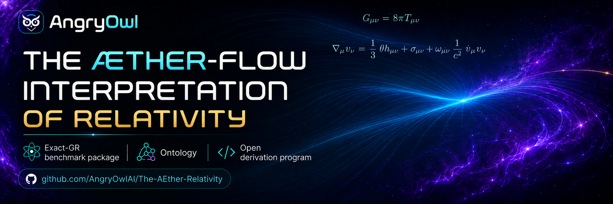

---

# The Æther-Flow Interpretation of Relativity Research Project

---

<p align="center">
  
</p>

---

## The Research Program

The The Æther-Flow Interpretation of Relativity Research Program is a dual physics-and-AI research project.

The physics track studies whether ordinary general relativity can be interpreted, and eventually derived, from a deeper four-dimensional `Æther` / `Æther-flow` ontology. The current public benchmark keeps GR exactly at observable scale. A first-principles derivation of GR from the ontology remains open.

The AI research-agent track currently develops and tests a human-scaffolded research-agent system for theoretical physics: agent roles, routing rules, claim gates, manuscript tools, result handling, review discipline, and scientific memory. Its long-term technical goal is staged autonomy toward an autonomous theoretical-physics research system, while public release, authorship responsibility, and external outreach remain human-accountable under current governance.

### The Two Tracks

#### Physics track

- Public benchmark: an exact-GR interpretive package for `The Æther-Flow Interpretation of Relativity`.
- Current observable scale: ordinary GR, one operative metric, universal matter coupling, standard causal structure.
- Open burden: deriving the benchmark from explicit substrate structure, with effective Lorentzian metric generation as the first proof milestone.
- Negative result: the frozen derivation line is preserved under `Not Derived On Current Line`.

#### AI research-agent track

- Currently human-scaffolded AI workflow for theoretical physics research, with staged autonomy as the long-term AI-system ambition.
- Role-based routing through candidate intake, refutation, defense, gate decisions, and integration notes.
- Manuscript-centered memory through active `.tex`, PDFs, CSV routing, and the Manuscript Wiki.
- Support for exploring, testing, refuting, proving, accepting, and organizing candidate derivation steps without treating workflow status as physics proof.
- Explicit separation between physics claims, AI-methodology claims, tooling claims, open problems, and stopped results.

#### How they co-develop

The physics problem gives the AI system a hard, real research environment. The AI research-agent system gives the physics program disciplined ways to explore ideas, reject failed mechanisms, preserve negative results, and avoid overclaiming. The shared target is stronger than organization alone: derive GR from the `Æther` / `Æther-flow` ontology if the required gates can actually be passed.

```text
                          THE ÆTHER-FLOW RESEARCH PROGRAM
                                      |
              +-----------------------+-----------------------+
              |                                               |
      PHYSICS RESEARCH TRACK                         AI RESEARCH-AGENT TRACK
              |                                               
  Æther / Æther-flow ontology                    
              |                                               
  Exact-GR benchmark package                     
              |                                               
  Open GR-derivation problem                     
              |                                               
  No-go and obstruction record                   
```

---

## This repo

This repo is a reset of the research program: [The Æther GR Derivation](/Volumes/P-SSD/AngryOwl/The Æther GR Derivation/) as the research system was failing to derive GR from the ontology or hard-fail the derivation, so we need to start over with a new approach.
The goal of this research program is to improve itself using the lessons learned from the previous attempt and ultimately derive GR from the Æther Flow ontology.

---

## The Æther Flow Ontology

[...]

---

## The research-agent system

[...] 

---

## Requirements

### Python environment

This repository uses a local Python virtual environment for scripts.

- Runtime: Python 3.12.13 in `.venv/`
- Dependency file: `requirements.txt`
- Environment directory: `.venv/`, ignored by `.gitignore`
- Current dependency status: PyMuPDF is used for direct PDF text extraction in
  the local semantic memory system.

Create or refresh the environment from the repository root:

```zsh
python3 -m venv .venv
source .venv/bin/activate
python -m pip install -r requirements.txt
```

Run scripts with the active environment:

```zsh
python path/to/script.py
```

Or run scripts without activating the shell:

```zsh
.venv/bin/python path/to/script.py
```

When a Python script requires an external package, add one package per line to
`requirements.txt`, then rerun:

```zsh
.venv/bin/python -m pip install -r requirements.txt
```

---

## Memory, wiki, and registry system

This repository uses a source-first memory system for project knowledge.

Authority order:

1. Registered `.tex` files are canonical for physics research and derivational claims.
2. Format-specific CSV registries are canonical for routing, provenance, generated-output tracking, and agent-queryable memory.
3. Registered Markdown files are canonical for GitHub documentation, agent guidance, and project-control notes.
4. PDFs, wiki notes, wiki indexes, master registries, and HTML explainers are generated derivatives.

Generated artifacts are tracked when they are part of the project memory surface, but they are not independent authority. Update the source file and registry row, then regenerate.

Bootstrap or refresh the memory system:

```zsh
.venv/bin/python .codex/skills/project-memory-system/scripts/bootstrap_memory_system.py
```

Validate without writing:

```zsh
.venv/bin/python .codex/skills/project-memory-system/scripts/bootstrap_memory_system.py --validate-only
```

Run smoke tests:

```zsh
.venv/bin/python -m unittest discover -s tests
```

Run the full memory-system acceptance chain, including generated memory refresh,
local vault sync, linting, tests, and query smoke checks:

```zsh
make validate-memory
```

Initialize and sync the local Obsidian memory vault:

```zsh
.venv/bin/python .codex/skills/project-memory-system/scripts/sync_obsidian_vault.py
```

Query the combined CSV, relationship, vault, and content-semantic memory system:

```zsh
.venv/bin/python .codex/skills/project-memory-system/scripts/query_memory.py status --json
```

Clean ignored local noise from canonical lanes:

```zsh
.venv/bin/python .codex/skills/project-memory-system/scripts/clean_local_noise.py --dry-run
```

---

## Research-control workflow

Research-control continuation is tracked under `research_control/`. Use
`.codex/skills/continue-research/SKILL.md` as the entry point.

---

## Project map

```
.
├── .agents/
│   ├── roles/
│   └── schemas/
├── .codex/
│   ├── prompts/
│   │   └── Repo-local prompt templates for visual explanations and reviews.
│   └── skills/
│       ├── project-memory-system/
│       │   └── scripts/
│       ├── grill-me/
│       ├── markdown-wiki/
│       ├── tex-wiki/
│       ├── pdf-derivative-build/
│       ├── obsidian-wiki/
│       ├── html-visual-explainer/
│       ├── ontology-promotion/
│       └── visual-explainer/
├── AGENTS.md
│   └── Root instructions for research agents working in this repository.
├── LICENSE
│   └── Project license.
├── Makefile
│   └── Single-command validation wrappers for repository operators.
├── README.md
│   └── Project overview, environment setup, and file map.
├── requirements.txt
│   └── Python dependency ledger for repository scripts.
├── assets/
│   └── images/
│       ├── readme-banner.png
│       └── readme-banner-old*.png
├── html/
│   └── Generated human-only visual explainers.
├── markdown/
│   ├── grill-memory-wiki-registry-design-handoff.md
│   ├── html-explainer-specs/
│   └── ontology-promotions/
├── manuscripts/
│   ├── tex/
│   └── pdfs/
├── ontology/
│   ├── aether-and-aether-flow.md
│   ├── tex/
│   └── pdfs/
├── registries/
│   ├── AGENT_ROLE_REGISTRY.csv
│   ├── AGENT_JOB_REGISTRY.csv
│   ├── DIRECTOR_DECISION_REGISTRY.csv
│   ├── RESEARCH_TASK_REGISTRY.csv
│   ├── CLAIM_BOUNDARY_REGISTRY.csv
│   ├── MARKDOWN_SOURCE_REGISTRY.csv
│   ├── TEX_SOURCE_REGISTRY.csv
│   ├── PDF_DERIVATIVE_REGISTRY.csv
│   ├── HTML_EXPLAINER_REGISTRY.csv
│   ├── WIKI_ARTIFACT_REGISTRY.csv
│   ├── OBSIDIAN_VAULT_REGISTRY.csv
│   ├── CONTENT_SEMANTIC_REGISTRY.csv
│   ├── OBJECT_RELATIONSHIP_REGISTRY.csv
│   └── FILE_OBJECT_REGISTRY.csv
├── research_control/
│   └── Tracked Director decisions, AgentJobs, completions, handoffs, and templates.
├── scripts/
│   └── research_control/
│       └── Research-control validators and continuation helpers.
├── tests/
│   └── Memory-system smoke checks.
├── tex_shared/
│   └── Shared LaTeX inputs used by ontology and manuscript TeX builds.
├── wiki/
│   ├── markdown/
│   ├── tex/
│   ├── pdf/
│   ├── html/
│   └── indexes/
└── Step-by-step-Comments/
    ├── README.md
    └── Comments - Phase-1.md through Comments - Phase-5.md
```

Local or generated files intentionally excluded from the project map include
`.venv/`, `.DS_Store`, `.local/`, and other ignored operating-system or build artifacts.
