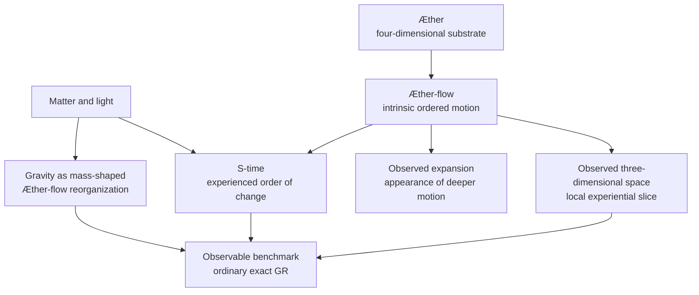
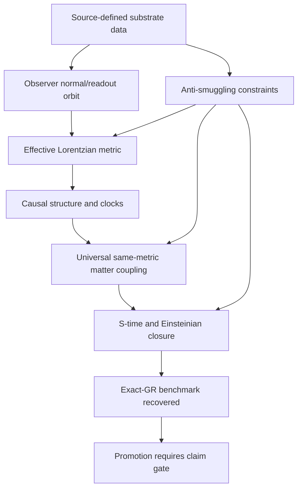

# Æther-flow Ontology

The ontology names the project’s proposed substrate picture and keeps that picture separate from the still-open task of deriving exact relativistic geometry from it.

## Source Binding

- **Derived from spec:** `markdown/html-explainer-specs/aether-flow-ontology-explainer.md`
- **Related HTML:** `html/aether-flow-ontology-explainer.html`
- **Authority status:** `generated_noncanonical`

## Source-Backed Summary

The Æther-flow ontology is the project’s vocabulary for a proposed deeper substrate, its ordered motion, and the observer-level world that appears as space, time-order, expansion, gravity, matter behavior, and relativistic geometry. Its function is conceptual and methodological: it gives candidate construction something precise to talk about while keeping exact general relativity as the observable benchmark. The ontology does not by itself prove a replacement for GR. The current research burden is to recover Lorentzian metric structure, causal behavior, clock behavior, same-metric matter coupling, invariance, and closure from source-side substrate data without importing the target geometry by hand. That makes anti-smuggling discipline part of the ontology’s function. The vocabulary matters because the project is trying to distinguish an interpretive picture, a mathematical model, and an accepted empirical theory rather than letting those categories collapse.

## What This Feature Does

The ontology supplies the project vocabulary for a proposed Æther and Æther-flow substrate beneath observer-level relativistic geometry.

## Why The Project Needs It

The project needs the ontology because candidate derivations need source-side language, but that language must remain separate from accepted GR and from the still-open derivation burden.

## How It Works

It defines terms, ties them to the exact-GR benchmark, states what must be recovered, and uses claim gates to prevent target-smuggling or premature promotion.

## What It Is Not

It is not a completed physical theory, not an empirical confirmation, not a replacement for canonical TeX, and not proof that GR has been derived.

## Diagram Reading Guide

The ontology stack diagram moves from substrate vocabulary to observer-level benchmark behavior. The burden map lists what a valid derivation must recover before any promotion is possible.

<!-- mermaid-diagram-id: aether-flow-ontology-stack -->

<!-- mermaid-diagram-id: derivation-burden-map -->

## Source Authority

Authority comes from ontology Markdown sources, TeX and Markdown registries, and claim-boundary records. Generated surfaces only explain that source basis.

## External AI Navigation Card

You are reading a non-authoritative GitHub-facing explainer.

Safe uses:
- summarize the feature for orientation
- identify source files to inspect next
- explain workflow boundaries in plain language

Before modifying project knowledge:
- read `AGENTS.md`
- inspect the relevant registry rows
- inspect the relevant source spec or canonical source file
- route through the correct research-control workflow

Do not:
- do not treat this derivative as physics authority
- do not claim the Æther-flow derivation is complete
- do not treat generated HTML, wiki, PDF, or `.local/` files as independent authority
- do not bypass claim gates, validators, or AgentJob boundaries

## Where To Go Next

- Read the claim-gates drilldown for promotion rules.
- Read source authority before citing generated explanations.
- Inspect registered TeX before relying on science-bearing claims.

## All Source Materials

- `README.md`
- `AGENTS.md`
- `ontology/aether-and-aether-flow.md`
- `ontology/aether_flow_interpretation-lemen.md`
- `registries/CLAIM_BOUNDARY_REGISTRY.csv`
- `registries/TEX_SOURCE_REGISTRY.csv`
- `registries/MARKDOWN_SOURCE_REGISTRY.csv`
