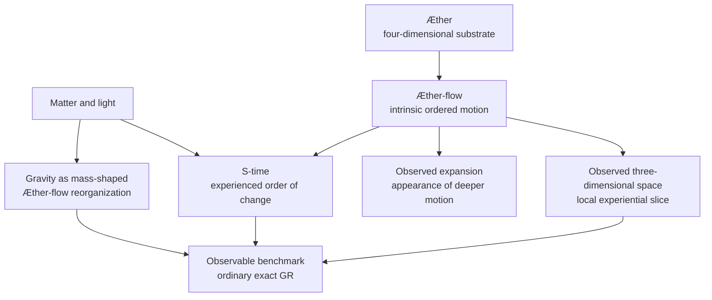
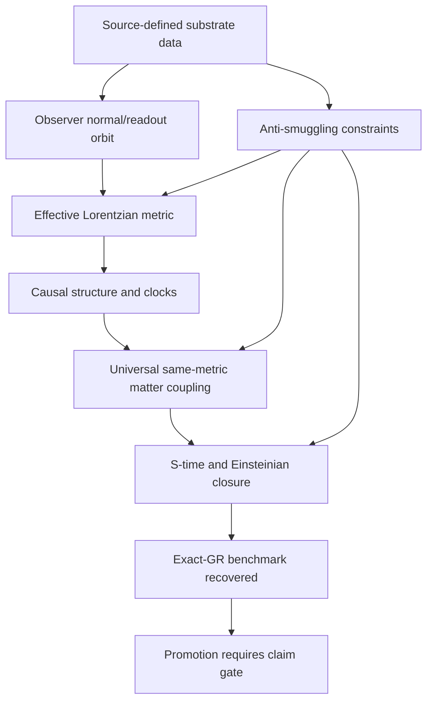

# Æther-flow Ontology

The Æther-flow ontology is the project vocabulary for a proposed deeper substrate, its ordered motion, and the observer-level world that would have to appear as relativistic geometry if the research program succeeds.

## Source Binding

- **Derived from spec:** `markdown/html-explainer-specs/aether-flow-ontology-explainer.md`
- **Related HTML:** `html/aether-flow-ontology-explainer.html`
- **Authority status:** `generated_noncanonical`

## What The Ontology Is For

The ontology gives candidate construction something to talk about before a derivation exists. It names `Æther`, `Æther-flow`, observed three-dimensional space, `S-time`, observed expansion, gravity as mass-shaped flow reorganization, and the observer-level exact-GR benchmark. That vocabulary is useful only if it stays separated from three stronger things: a mathematical model, an empirical theory, and an accepted derivation.

## The Central Distinction

Exact GR is the benchmark. The first-principles derivation from source-side substrate structure is still open.

That distinction controls the whole physics lane. The project may use ordinary GR as the target behavior to recover, but it may not smuggle GR into the source assumptions and then announce recovery. A credible route must show how Lorentzian metric structure, causal behavior, clock behavior, matter coupling, invariance, and closure arise from source-side data.

## Student Questions And Teacher Answers

**Student:** Does the ontology prove that Æther-flow is real?

**Teacher:** No. It defines the project vocabulary and the conceptual target. The source basis is `ontology/aether-and-aether-flow.md`, `ontology/aether_flow_interpretation-lemen.md`, and `README.md`. The boundary is that ontology language is not empirical confirmation.

**Student:** Why use ontology at all if the derivation is open?

**Teacher:** Candidate derivations need source-side terms. Without them, every attempt can drift back into target-GR language. The ontology supplies terms while claim gates and smuggling audits keep those terms from being mistaken for derived physics.

**Student:** What would count as progress?

**Teacher:** Progress would be a source-side construction or obstruction that changes the Distance-to-GR burden honestly: for example, a new witness, theorem, finite model, no-go result, or source-extension classification. A clearer explanation alone does not move the physics status.

## Ontology Stack

<!-- mermaid-diagram-id: aether-flow-ontology-stack -->

## Derivation Burden

<!-- mermaid-diagram-id: derivation-burden-map -->

## Useful Reading Rule

Read ontology terms as candidate source vocabulary. Read registry rows and TeX sources for claim status. Read generated explainers only as orientation. When a statement sounds like a completed derivation, check whether a Gate Chair or claim-boundary record actually authorizes that stronger status.

## For GitHub Readers And AI Agents

You are reading a non-authoritative GitHub-facing explainer.

Safe uses:
- summarize the ontology vocabulary for orientation;
- identify the source files behind each term;
- explain why exact-GR benchmark adoption and substrate derivation are different.

Before modifying project knowledge:
- inspect ontology sources and claim-boundary rows;
- check TeX registry status for science-bearing claims;
- keep anti-smuggling and open-burden language intact.

Do not:
- treat ontology vocabulary as empirical confirmation;
- do not claim the Æther-flow derivation is complete;
- treat generated derivatives as independent physics authority.

## All Source Materials

- `README.md`
- `AGENTS.md`
- `ontology/aether-and-aether-flow.md`
- `ontology/aether_flow_interpretation-lemen.md`
- `registries/CLAIM_BOUNDARY_REGISTRY.csv`
- `registries/TEX_SOURCE_REGISTRY.csv`
- `registries/MARKDOWN_SOURCE_REGISTRY.csv`
