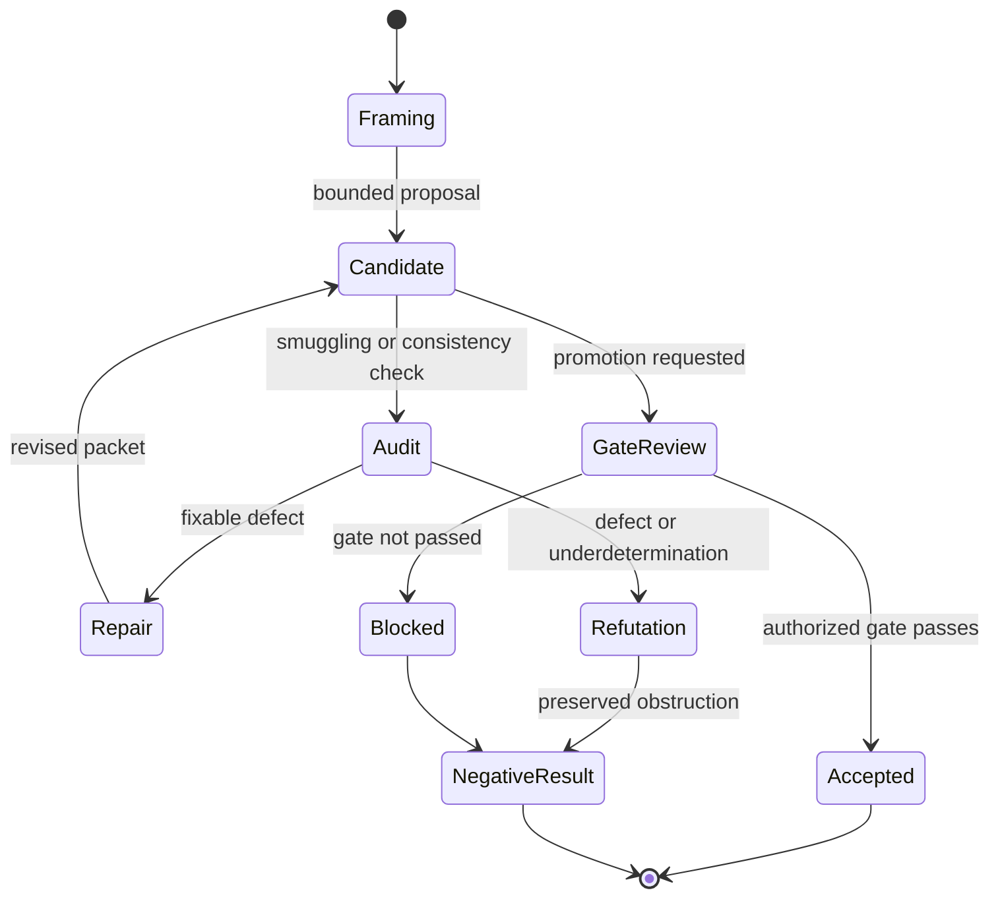
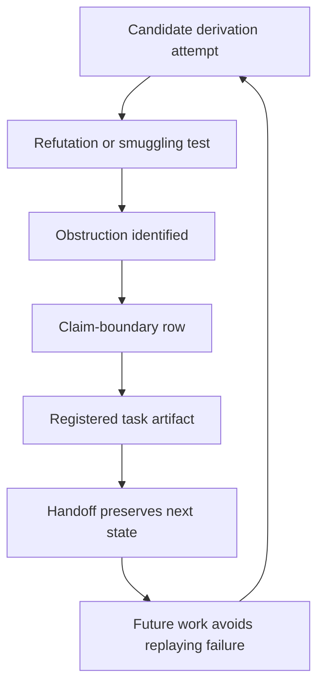

# Claim Gates

Claim gates keep ontology, candidate work, workflow completion, refutation, and accepted science in separate states.

## Source Binding

- **Derived from spec:** `markdown/html-explainer-specs/claim-gates-explainer.md`
- **Related HTML:** `html/claim-gates-explainer.html`
- **Authority status:** `generated_noncanonical`

## Source-Backed Summary

Claim gates are the project’s control mechanism for deciding when a physics statement may move from framing, proposal, repair, audit, or explanation into stronger accepted status. Their function is to keep exact-GR benchmark adoption separate from unproven substrate derivation claims by requiring source evidence, explicit claim-boundary records, routed review, Gate Chair or human-gated authority when needed, and registry updates before promotion. They matter because polished explainers, completed tasks, and preserved repair packets can make candidate ideas look more settled than they are. A visual explanation, validator pass, or completed AgentJob cannot authorize science claims by itself. Claim gates also protect negative results by preserving why a route is blocked, refuted, underdetermined, or still conjectural.

## What This Feature Does

Claim gates define the allowed status transitions for physics statements and research outcomes.

## Why The Project Needs It

The project needs them because speculative ontology, exact-GR benchmark use, candidate derivations, repairs, and refutations can otherwise blur into unsupported acceptance.

## How It Works

They bind claims to source evidence, role authority, registry rows, gate review, validation receipts, and preserved negative-result records.

## What It Is Not

They are not ordinary formatting checks, not proof by completion, and not a way for generated pages or agents to promote science claims.

## Diagram Reading Guide

The state machine shows how framing, candidate, audit, repair, refutation, blocked, accepted, and negative-result states differ. The preservation loop shows why failed routes remain useful memory.

<!-- mermaid-diagram-id: claim-gate-state-machine -->

<!-- mermaid-diagram-id: negative-result-preservation-loop -->

## Source Authority

Authority comes from claim-boundary rows, research-control guidance, TeX registry evidence, and the Gate Chair role contract when human-gated review is authorized.

## External AI Navigation Card

You are reading a non-authoritative GitHub-facing explainer.

Safe uses:
- summarize the feature for orientation
- identify source files to inspect next
- explain workflow boundaries in plain language

Before modifying project knowledge:
- read `AGENTS.md`
- inspect the relevant registry rows
- inspect the relevant source spec or canonical source file
- route through the correct research-control workflow

Do not:
- do not treat this derivative as physics authority
- do not claim the Æther-flow derivation is complete
- do not treat generated HTML, wiki, PDF, or `.local/` files as independent authority
- do not bypass claim gates, validators, or AgentJob boundaries

## Where To Go Next

- Read the ontology drilldown to understand what is being gated.
- Read research system to see how task artifacts are preserved.
- Inspect claim-boundary registry rows before repeating a derivation-status phrase.

## All Source Materials

- `README.md`
- `AGENTS.md`
- `research_control/README.md`
- `registries/CLAIM_BOUNDARY_REGISTRY.csv`
- `registries/TEX_SOURCE_REGISTRY.csv`
- `registries/RESEARCH_TASK_REGISTRY.csv`
- `.agents/roles/physics/gate-chair.v0.1.0.md`
