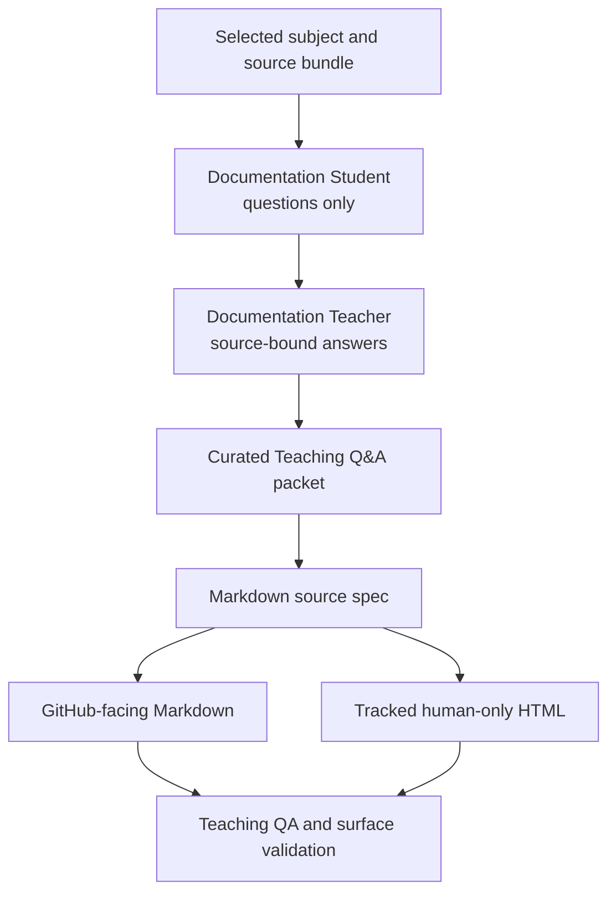

# Documentation Curator Teaching Loop

The Documentation Curator teaching loop makes project explanations more useful by having a Student ask reader-centered questions, a Teacher answer from sources, and the Curator synthesize the result into source-backed documentation.

## Source Binding

- **Derived from spec:** `markdown/html-explainer-specs/documentation-curator-teaching-loop-explainer.md`
- **Related HTML:** `html/documentation-curator-teaching-loop-explainer.html`
- **Authority status:** `generated_noncanonical`

## The Role Split

The Curator is the writer. The Student asks questions only. The Teacher answers only from the selected source bundle. The teaching packet is explanatory support. The source spec, role contracts, schemas, validators, registries, and claim gates keep their own authority.

## Workflow Step Inspector

1. Select one subject and source bundle.
2. Ask reader-centered Student questions about purpose, operation, boundaries, examples, and confusion points.
3. Answer those questions through the Teacher inside the declared source boundary.
4. Have the Curator synthesize a teaching packet as explanatory support.
5. Distill the packet into the Markdown source spec.
6. Synchronize the GitHub-facing Markdown derivative.
7. Regenerate the tracked human-only HTML derivative.
8. Validate teaching QA, source specs, derivatives, documentation impact, and research-control state.

## Student Questions And Teacher Answers

**Student:** Why ask questions before writing?

**Teacher:** Questions expose where a reader lacks the model: what the subject does, why it exists, how it works, what examples clarify it, and what boundary prevents misuse. The source basis is the Student role contract and the Curator role contract.

**Student:** Why must Teacher answers name sources?

**Teacher:** Source paths keep the answer from becoming improvised project truth. If the selected source bundle does not answer, the Teacher records a source gap.

**Student:** Can a packet override a validator or role contract?

**Teacher:** No. A Teaching Q&A packet improves explanations. It does not change routing, schemas, validators, role authority, claim status, ontology authority, benchmark status, or generated-output authority.

## Curator Judgment

Scripts can enforce safety and source binding. They should not freeze all explanations into one template. The Curator's job is to decide which prose structure teaches the subject: Q&A, glossary, workflow, diagram, examples, non-examples, misconception repair, or a reading path. The required boundary is evidence-based explanation, not mechanical section sameness.

## For GitHub Readers And AI Agents

You are reading a non-authoritative GitHub-facing explainer.

Safe uses:
- understand the teaching-loop workflow;
- find role contracts, packet schema, example packets, and validators;
- distinguish explanation support from project authority.

Before modifying project knowledge:
- inspect the selected source spec and source bundle;
- keep Student and Teacher outputs inside their roles;
- let the Curator synthesize tracked documentation.

Do not:
- let Student or Teacher outputs write tracked docs directly;
- treat teaching packets as canonical authority;
- replace source-bound answers with outside facts.

## All Source Materials

- `.agents/roles/research_ops/documentation-curator.v0.9.0.md`
- `.agents/roles/research_ops/documentation-student.v0.1.0.md`
- `.agents/roles/research_ops/documentation-teacher.v0.1.0.md`
- `.agents/schemas/TEACHING_QA_PACKET_SCHEMA.md`
- `.codex/skills/aether-teaching-explainer/SKILL.md`
- `.codex/skills/html-visual-explainer/SKILL.md`
- `research_control/design/github_facing_explainer_contract.md`
- `markdown/teaching-packets/project-overview.teaching-qa.md`
- `markdown/teaching-packets/role-routing.teaching-qa.md`
- `scripts/validate_teaching_qa.py`
