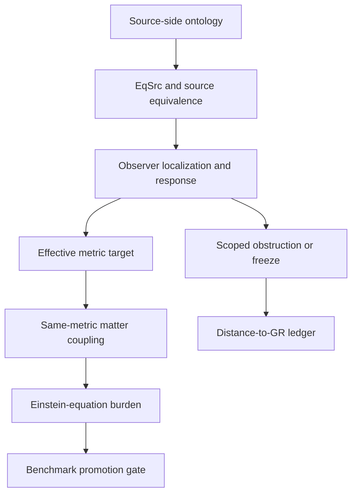

# GR Derivation Roadmap

The GR derivation roadmap tracks the open route from source-side Æther-flow structure toward ordinary GR or an exact-GR benchmark without pretending that the route is complete.

## Source Binding

- **Derived from spec:** `markdown/html-explainer-specs/gr-derivation-roadmap-explainer.md`
- **Related HTML:** `html/gr-derivation-roadmap-explainer.html`
- **Authority status:** `generated_noncanonical`

## The Burden Being Tracked

The project must distinguish a useful physics draft from a completed derivation. The roadmap names the burdens that remain visible across jobs: source ontology primitives, source equivalence, retention and generation conditions, observer localization, response structure, source metric objects, effective metric recovery, matter coupling, Einstein equations, finite-variation robustness, benchmark promotion, Gate Chair status, and route freeze or hard-fail status.

## How To Use The Roadmap

The roadmap does not say the project is close to deriving GR. It names the
burdens and status vocabulary needed to avoid vague progress claims. A physics
job can then be judged against a specific burden rather than implying global
movement toward the whole derivation.

Future completions must say what mathematical payload was added and what
remains unresolved. If a route keeps failing under the same burden, the control
system can evaluate repeated-burden or scoped-obstruction freeze criteria. A
freeze is controlled memory for a route; it is not a universal rejection of
every possible ontology or source-extension path.

## Status Vocabulary

- **Open burden:** required object or relation is not established.
- **Local payload:** a definition, lemma, theorem, witness, finite model, obstruction, or classification was added for a scoped burden.
- **Scoped obstruction:** a bounded route fails under declared assumptions.
- **Source extension pressure:** current ontology may lack a needed primitive, but adding one must be classified and audited.
- **Benchmark promotion:** stronger status that requires gates beyond a helpful draft or generated explanation.

## For GitHub Readers And AI Agents

You are reading a non-authoritative GitHub-facing explainer.

Safe uses:
- identify which derivation burden a task mentions;
- separate local progress from benchmark promotion;
- find ledger and burden-map files before summarizing status.

Before modifying project knowledge:
- inspect the burden map and Distance-to-GR ledger;
- preserve exact qualifiers around open, blocked, scoped, or frozen routes;
- do not inflate local payloads into global derivation claims.

Do not:
- do not claim the Æther-flow derivation is complete;
- treat a finite toy model as full GR recovery;
- treat generated documentation as a Gate Chair verdict.

## All Source Materials

- `README.md`
- `AGENTS.md`
- `research_control/README.md`
- `research_control/design/gr_derivation_burden_map.md`
- `registries/DISTANCE_TO_GR_LEDGER.csv`
- `registries/CLAIM_BOUNDARY_REGISTRY.csv`
- `.agents/roles/physics/theoretical-continuation-selector.v0.1.0.md`
