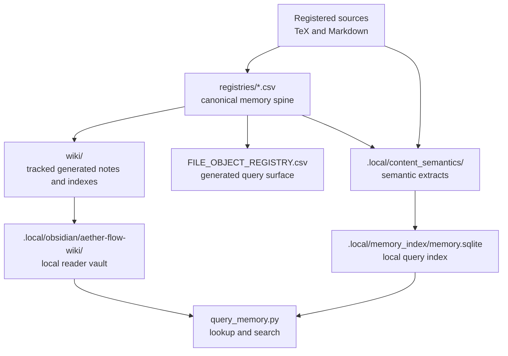
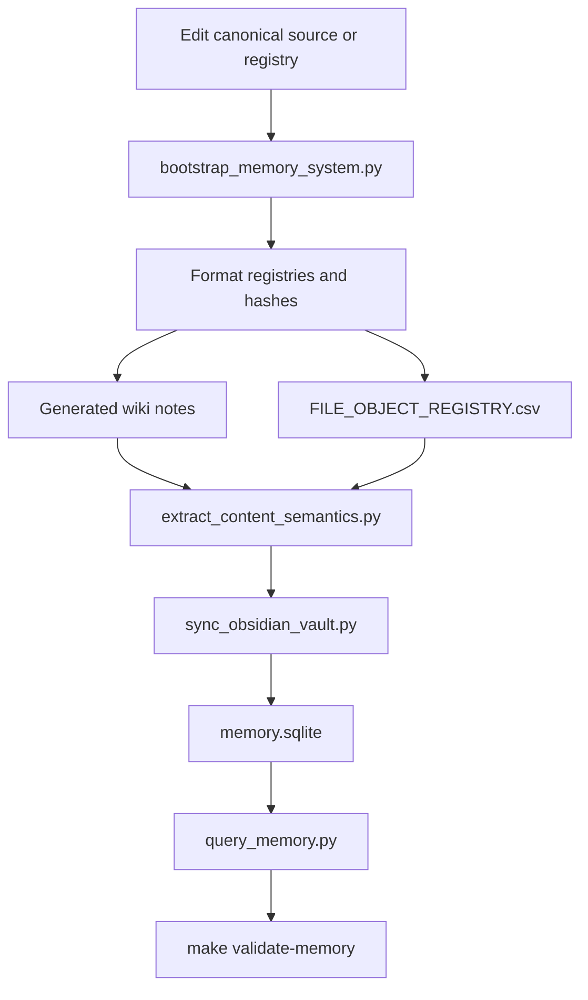

# Memory System

The memory system turns registered sources and registries into searchable, generated reading surfaces while keeping the registries and sources in charge.

## Source Binding

- **Derived from spec:** `markdown/html-explainer-specs/memory-system-explainer.md`
- **Related HTML:** `html/memory-system-explainer.html`
- **Authority status:** `generated_noncanonical`

## Source-First Memory

The memory system is not a second truth store. It is a retrieval and derivative-generation layer. Registered Markdown, TeX, PDF, and HTML rows feed canonical CSV registries. Bootstrap uses those rows to refresh generated wiki notes, file-object rows, relationship metadata, semantic extracts, Obsidian vault files, SQLite lookup surfaces, and source hashes. A reader can search quickly, but any claim still has to return to the registered source or registry row.

## Workflow Step Inspector

1. Edit a registered source or registry row.
2. Run memory bootstrap to refresh object rows, hashes, relationships, and generated outputs.
3. Regenerate tracked wiki notes and indexes from the registry spine.
4. Refresh file-object and semantic registries for queryable memory.
5. Sync local Obsidian and SQLite retrieval surfaces when the workflow needs them.
6. Query memory only as an evidence-finding aid, not as independent authority.
7. Validate bootstrap, registries, wiki outputs, and documentation surfaces.
8. Inspect canonical sources before using retrieved material in a new project claim or control change.

## Student Questions And Teacher Answers

**Student:** Why not just search the repo?

**Teacher:** Search finds text. The memory system also preserves object identity, authority status, source hashes, generated-output links, and relationship metadata. That makes retrieval auditable.

**Student:** Are wiki notes canonical?

**Teacher:** No. They are tracked generated derivatives. They are useful for navigation and summarization, but source files and registries remain authority.

**Student:** What does `.local/` mean here?

**Teacher:** `.local/` contains scratch or machine-local retrieval aids such as semantic extracts, Obsidian vaults, and SQLite indexes. It must not override tracked control state.

## Memory Surface Map

<!-- mermaid-diagram-id: memory-surface-map -->

<!-- mermaid-diagram-id: memory-regeneration-flow -->

## For GitHub Readers And AI Agents

You are reading a non-authoritative GitHub-facing explainer.

Safe uses:
- understand how generated memory surfaces are built;
- locate registry rows and source hashes;
- use retrieval results as a path back to sources.

Before modifying project knowledge:
- inspect the registered source or registry row;
- run bootstrap after source or registry changes;
- validate generated surfaces rather than hand-editing them.

Do not:
- treat wiki notes as independent authority;
- let `.local/` search output override tracked files;
- use memory retrieval to promote physics claims.

## All Source Materials

- `README.md`
- `AGENTS.md`
- `registries/MARKDOWN_SOURCE_REGISTRY.csv`
- `registries/TEX_SOURCE_REGISTRY.csv`
- `registries/PDF_DERIVATIVE_REGISTRY.csv`
- `registries/HTML_EXPLAINER_REGISTRY.csv`
- `registries/WIKI_ARTIFACT_REGISTRY.csv`
- `registries/CONTENT_SEMANTIC_REGISTRY.csv`
- `registries/FILE_OBJECT_REGISTRY.csv`
- `.codex/skills/project-memory-system/SKILL.md`
- `.codex/skills/markdown-wiki/SKILL.md`
- `.codex/skills/tex-wiki/SKILL.md`
- `.codex/skills/pdf-derivative-build/SKILL.md`
- `.codex/skills/html-visual-explainer/SKILL.md`
- `.codex/skills/obsidian-wiki/SKILL.md`
