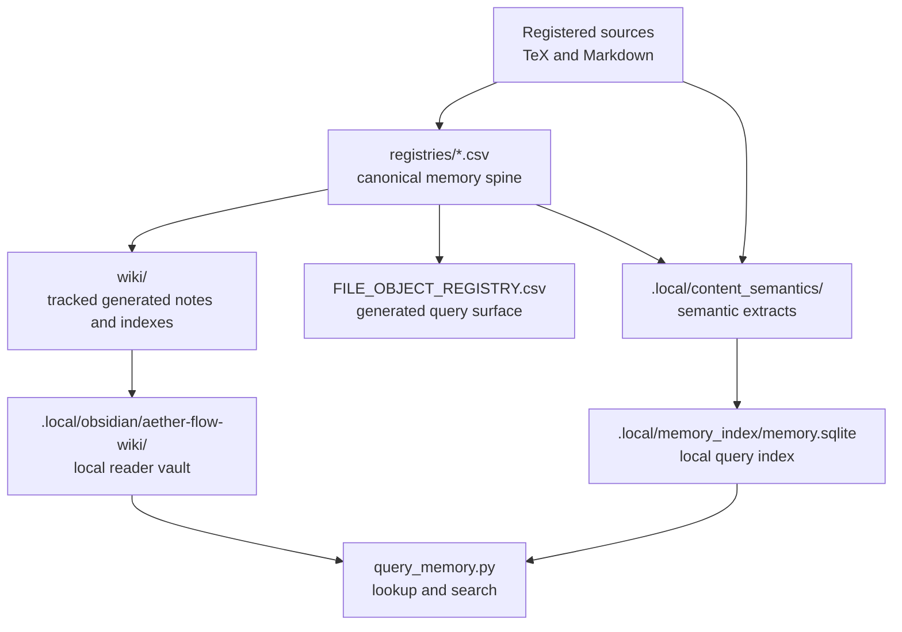
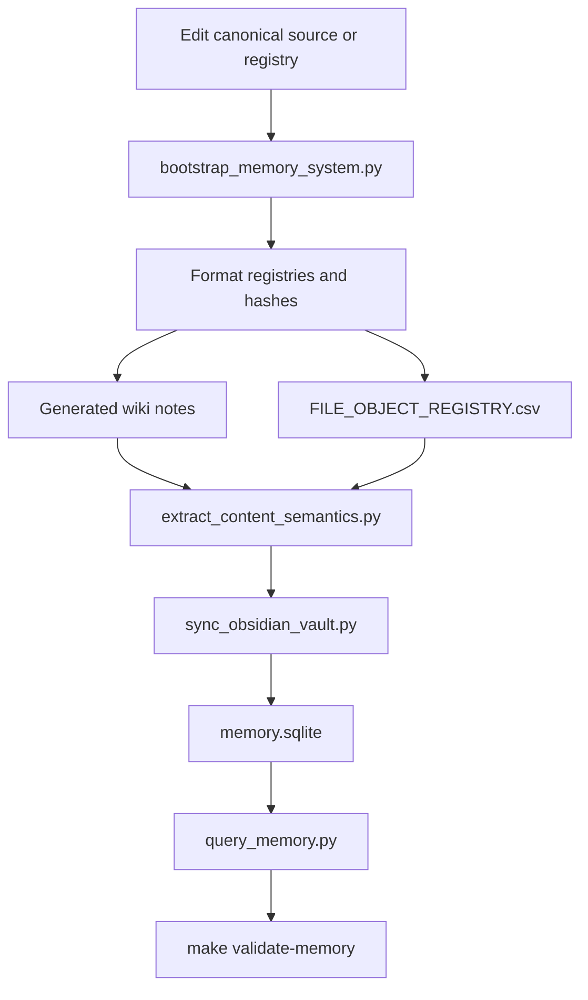

# Memory System

The memory system turns registered sources and registries into searchable, generated, noncanonical reading surfaces.

## Source Binding

- **Derived from spec:** `markdown/html-explainer-specs/memory-system-explainer.md`
- **Related HTML:** `html/memory-system-explainer.html`
- **Authority status:** `generated_noncanonical`

## Source-Backed Summary

The memory system is the repository’s source-first retrieval and derivative-generation layer for registered Markdown, TeX, PDFs, HTML explainers, wiki notes, semantic extracts, file objects, and local query surfaces. Its functionality is to turn canonical registries and source files into generated wiki pages, source hashes, object relationships, local Obsidian vault entries, semantic text extracts, and SQLite-backed lookup surfaces without letting any generated artifact become an independent source of claims. It matters because humans and agents need fast ways to find evidence, but retrieval convenience must not bypass the authority hierarchy. The system connects source edits to bootstrap regeneration, validation receipts, content semantics, and local reading aids while preserving provenance.

## What This Feature Does

The memory system records and regenerates source-backed retrieval surfaces.

## Why The Project Needs It

The project needs it because long-running research requires fast lookup without losing source authority.

## How It Works

Source and registry edits feed bootstrap, generated wiki notes, file object rows, semantic extracts, local vault sync, SQLite indexing, and query tools.

## What It Is Not

It is not competing canonical wikis, not independent claim authority, and not a way for `.local` caches to override tracked state.

## Diagram Reading Guide

The surface map shows the CSV spine feeding tracked and local retrieval. The regeneration flow shows source edit, bootstrap, registries, wiki, semantic extraction, vault, index, query, and validation.

<!-- mermaid-diagram-id: memory-surface-map -->

<!-- mermaid-diagram-id: memory-regeneration-flow -->

## Source Authority

Authority comes from format registries, project-memory-system, and source files; generated retrieval views remain subordinate.

## External AI Navigation Card

You are reading a non-authoritative GitHub-facing explainer.

Safe uses:
- summarize the feature for orientation
- identify source files to inspect next
- explain workflow boundaries in plain language

Before modifying project knowledge:
- read `AGENTS.md`
- inspect the relevant registry rows
- inspect the relevant source spec or canonical source file
- route through the correct research-control workflow

Do not:
- do not treat this derivative as physics authority
- do not claim the Æther-flow derivation is complete
- do not treat generated HTML, wiki, PDF, or `.local/` files as independent authority
- do not bypass claim gates, validators, or AgentJob boundaries

## Where To Go Next

- Run bootstrap after source changes.
- Use source authority to decide which retrieved object can support a claim.
- Use technical requirements for setup tiers.

## All Source Materials

- `README.md`
- `AGENTS.md`
- `registries/MARKDOWN_SOURCE_REGISTRY.csv`
- `registries/TEX_SOURCE_REGISTRY.csv`
- `registries/PDF_DERIVATIVE_REGISTRY.csv`
- `registries/HTML_EXPLAINER_REGISTRY.csv`
- `registries/WIKI_ARTIFACT_REGISTRY.csv`
- `registries/CONTENT_SEMANTIC_REGISTRY.csv`
- `registries/FILE_OBJECT_REGISTRY.csv`
- `.codex/skills/project-memory-system/SKILL.md`
- `.codex/skills/markdown-wiki/SKILL.md`
- `.codex/skills/tex-wiki/SKILL.md`
- `.codex/skills/pdf-derivative-build/SKILL.md`
- `.codex/skills/html-visual-explainer/SKILL.md`
- `.codex/skills/obsidian-wiki/SKILL.md`
