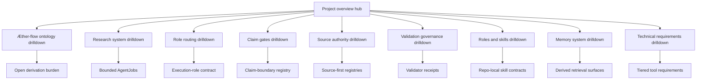
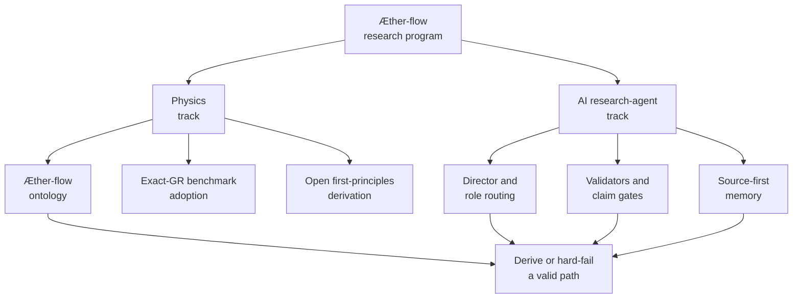

# Project Overview

AEther-Flow is a dual research program: one lane tests a speculative Æther-flow interpretation against ordinary exact general relativity, and the other lane builds the agent-control machinery that keeps that research auditable.

## Source Binding

- **Derived from spec:** `markdown/html-explainer-specs/project-overview-explainer.md`
- **Related HTML:** `html/project-overview-explainer.html`
- **Authority status:** `generated_noncanonical`

## Source-Backed Summary

AEther-Flow is organized around two coupled systems. The physics system keeps ordinary exact general relativity as the observable benchmark while treating any first-principles derivation from Æther or Æther-flow substrate structure as open until a gated source-side derivation succeeds. The AI research-agent system supplies the operating discipline: tracked state, Director decisions, bounded AgentJobs, role contracts, validators, registries, handoffs, project-system improvement, Documentation Curator teaching support, and generated explanatory surfaces. The project needs both systems because speculative physics can drift into unsupported certainty unless every proposal, refutation, repair, and negative result remains source-bound and auditable. The overview functions as the entry map for that structure: physics terms route to ontology, claim gates, and the derivation roadmap; workflow questions route to research system, role routing, research control, and project-system improvement; authority and documentation questions route to source authority, roles and skills, memory, technical requirements, and the Documentation Curator teaching loop.

## What This Feature Does

AEther-Flow combines a speculative physics program with a governed AI research-agent workflow. The physics lane asks whether an Æther-flow substrate can recover exact-GR observables without smuggling in the target. The agent lane makes every proposal, audit, repair, refutation, documentation update, and generated derivative traceable through roles, registries, validators, and task records.

## Why The Project Needs It

The project needs a front-door model because the repository deliberately contains polished explanations, generated artifacts, source specs, registries, and unfinished research artifacts. Without a two-lane map, a reader can mistake explanation for proof, generated output for authority, or workflow completion for scientific acceptance.

## How It Works

Start with the physics lane for ontology, benchmark status, derivation burden, claim gates, and the Distance-to-GR roadmap. Move to the agent lane for Director decisions, AgentJobs, role routing, validators, project-system improvement, documentation impact, teaching support, memory, and technical operation. Use source authority to decide which files can support a claim before relying on any derived surface.

## Common questions

- What are the two main lanes? The physics lane and the AI research-agent lane.
- What is accepted today? Ordinary exact GR is the observable benchmark; the substrate derivation remains open.
- Why so much control machinery? It prevents documentation, workflow, or generated output from becoming scientific authority.

## Common misunderstandings

- A generated explanation is not a proof.
- A completed AgentJob is not a Gate Chair verdict.
- A memory search result is not stronger than the source row it points to.

## What It Is Not

It is not a completed GR derivation, not a claim-promotion mechanism, not a replacement for registries or source files, and not a license to treat generated explainers as authority.

## Diagram Reading Guide

The hub diagram shows navigation among drilldowns. The dual-track diagram shows the physics and AI research-agent lanes converging on a controlled derive-or-hard-fail objective; it does not assert that the substrate derivation has succeeded.

<!-- mermaid-diagram-id: research-atlas-hub -->

<!-- mermaid-diagram-id: dual-track-map -->

## Source Authority

Authority comes from the root guidance, ontology sources, research-control guidance, and registries. Generated HTML and GitHub-facing Markdown remain orientation surfaces.

## External AI Navigation Card

You are reading a non-authoritative GitHub-facing explainer.

Safe uses:
- summarize the feature for orientation
- identify source files to inspect next
- explain workflow boundaries in plain language

Before modifying project knowledge:
- read `AGENTS.md`
- inspect the relevant registry rows
- inspect the relevant source spec or canonical source file
- route through the correct research-control workflow

Do not:
- do not treat this derivative as physics authority
- do not claim the Æther-flow derivation is complete
- do not treat generated HTML, wiki, PDF, or `.local/` files as independent authority
- do not bypass claim gates, validators, or AgentJob boundaries

## Where To Go Next

- Read the ontology drilldown for the physics vocabulary.
- Read the GR derivation roadmap before describing milestone or Distance-to-GR status.
- Read claim gates before accepting derivation-status language.
- Read research system, role routing, and project-system improvement before modifying controlled work.
- Read the Documentation Curator teaching loop before adding teaching-enriched explanations.
- Read source authority before citing generated artifacts.

## All Source Materials

- `README.md`
- `AGENTS.md`
- `ontology/aether-and-aether-flow.md`
- `research_control/README.md`
- `registries/CLAIM_BOUNDARY_REGISTRY.csv`
- `registries/MARKDOWN_SOURCE_REGISTRY.csv`
- `registries/HTML_EXPLAINER_REGISTRY.csv`
- `markdown/html-explainer-specs/aether-flow-ontology-explainer.md`
- `markdown/html-explainer-specs/research-agent-workflow-explainer.md`
- `markdown/html-explainer-specs/research-control-system-explainer.md`
- `markdown/html-explainer-specs/role-routing-explainer.md`
- `markdown/html-explainer-specs/claim-gates-explainer.md`
- `markdown/html-explainer-specs/source-authority-explainer.md`
- `markdown/html-explainer-specs/roles-and-skills-explainer.md`
- `markdown/html-explainer-specs/memory-system-explainer.md`
- `markdown/html-explainer-specs/technical-requirements-explainer.md`
- `markdown/html-explainer-specs/gr-derivation-roadmap-explainer.md`
- `markdown/html-explainer-specs/project-system-improvement-explainer.md`
- `markdown/html-explainer-specs/documentation-curator-teaching-loop-explainer.md`
