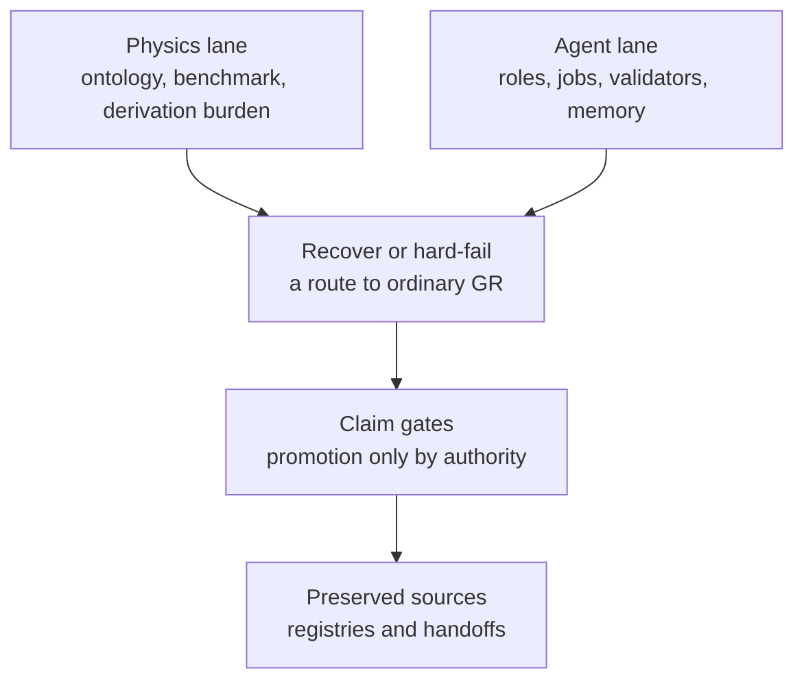
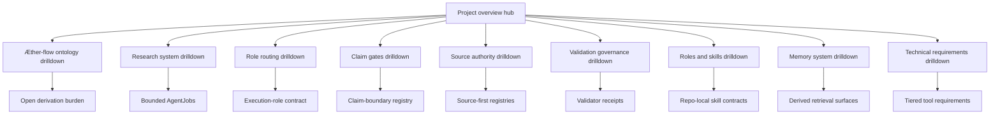
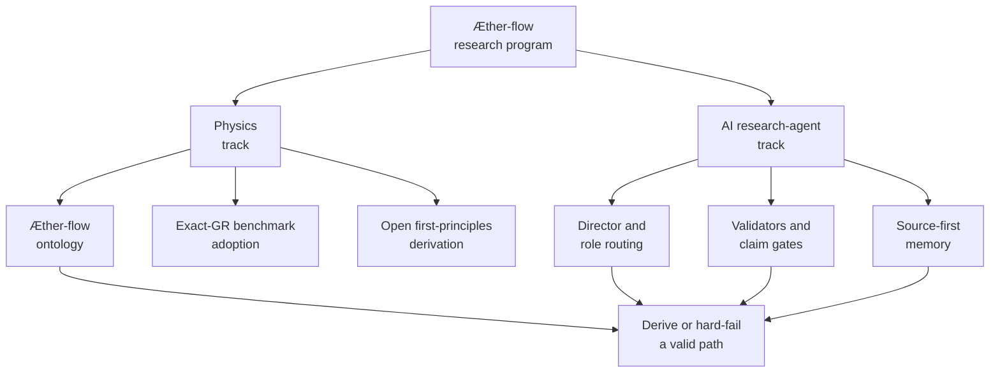

# Project Overview

AEther-Flow is both a speculative physics research program and a controlled AI research-agent system. The physics lane asks whether an Æther-flow substrate can recover ordinary relativistic geometry. The agent lane keeps that inquiry bounded, source-backed, auditable, and honest about what has not been derived.

## Source Binding

- **Derived from spec:** `markdown/html-explainer-specs/project-overview-explainer.md`
- **Related HTML:** `html/project-overview-explainer.html`
- **Authority status:** `generated_noncanonical`

## The Project In One Paragraph

The project studies a proposed deeper substrate vocabulary, called Æther and Æther-flow, while keeping ordinary exact general relativity as the observable benchmark. That does not mean the substrate derivation has succeeded. It means the repository has a disciplined target: recover metric behavior, causal structure, clock behavior, same-metric matter coupling, invariance, and Einsteinian closure from source-side assumptions or preserve the failure clearly. The AI research-agent system exists because this work produces many drafts, refutations, validators, role records, generated explainers, and memory surfaces. Those artifacts are useful only if their authority is explicit.

## Two Systems That Must Not Be Confused

The physics system supplies the question: can the project move from source-side Æther-flow structure to the exact-GR benchmark without importing the target geometry by hand?

The research-control system supplies the method: resolve tracked state, select one bounded AgentJob, bind it to a role and claim boundary, validate outputs, preserve negative results, and hand off the next state.

## Student Questions And Teacher Answers

**Student:** What is the project trying to do in plain language?

**Teacher:** It is testing whether a substrate picture can explain relativistic geometry while using a controlled agent workflow to keep claims, sources, and failures separated. The source basis is `README.md` and `AGENTS.md`. The boundary is that no overview can promote the derivation.

**Student:** Why are there two lanes instead of one research folder?

**Teacher:** The physics lane asks the scientific question. The agent lane governs how work is selected, constrained, validated, and recorded. The source basis is `AGENTS.md` and `research_control/README.md`. The boundary is that workflow completion is not a physics result.

**Student:** What should a new reader trust first?

**Teacher:** Trust registered TeX for science-bearing derivational claims, registries for provenance and routing, and registered Markdown for front-door and control guidance. Generated HTML, GitHub-facing Markdown, wiki notes, PDFs, and `.local/` caches are reading and retrieval aids.

## Research Atlas

<!-- mermaid-diagram-id: research-atlas-hub -->

<!-- mermaid-diagram-id: dual-track-map -->

## Common questions

- **Is this a completed physics theory?** No. Exact GR is the benchmark; the substrate derivation remains open until claim gates authorize stronger status.
- **Why so many registries and task records?** They prevent generated explanations, drafts, and workflow completions from replacing source authority.
- **Can an AI agent change project truth by writing a polished explanation?** No. Explanations orient readers; registered sources and control records decide authority.
- **Where should a reader begin?** Start with ontology for the physics picture, claim gates for status, research system for workflow, and source authority before citing any generated surface.

## Common misunderstandings

- A successful validator run is evidence of repository consistency, not proof of a physical derivation.
- A generated explainer can be clearer than the source, but it is not more authoritative than the source.
- A completed AgentJob records bounded work; it does not become a Gate Chair decision.
- A negative result is not wasted work. It preserves an obstruction so the project does not replay the same route blindly.

## For GitHub Readers And AI Agents

You are reading a non-authoritative GitHub-facing explainer.

Safe uses:
- orient yourself before reading the source files;
- identify which registry, source spec, role, or task record to inspect next;
- summarize the project structure without changing claim status.

Before modifying project knowledge:
- read `AGENTS.md`;
- inspect the relevant source file and registry row;
- use the appropriate research-control or project-system workflow;
- keep generated derivatives subordinate to registered sources.

Do not:
- do not claim the Æther-flow derivation is complete;
- treat generated HTML, wiki notes, PDFs, GitHub-facing Markdown, or `.local/` files as independent authority;
- bypass claim gates, validators, or AgentJob boundaries.

## All Source Materials

- `README.md`
- `AGENTS.md`
- `ontology/aether-and-aether-flow.md`
- `research_control/README.md`
- `registries/CLAIM_BOUNDARY_REGISTRY.csv`
- `registries/MARKDOWN_SOURCE_REGISTRY.csv`
- `registries/HTML_EXPLAINER_REGISTRY.csv`
- `markdown/html-explainer-specs/aether-flow-ontology-explainer.md`
- `markdown/html-explainer-specs/research-agent-workflow-explainer.md`
- `markdown/html-explainer-specs/research-control-system-explainer.md`
- `markdown/html-explainer-specs/role-routing-explainer.md`
- `markdown/html-explainer-specs/claim-gates-explainer.md`
- `markdown/html-explainer-specs/source-authority-explainer.md`
- `markdown/html-explainer-specs/roles-and-skills-explainer.md`
- `markdown/html-explainer-specs/memory-system-explainer.md`
- `markdown/html-explainer-specs/technical-requirements-explainer.md`
- `markdown/html-explainer-specs/gr-derivation-roadmap-explainer.md`
- `markdown/html-explainer-specs/project-system-improvement-explainer.md`
- `markdown/html-explainer-specs/documentation-curator-teaching-loop-explainer.md`
