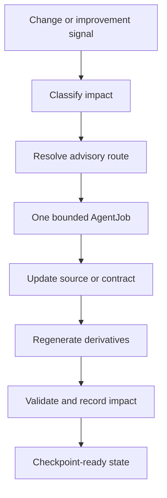

# Project-System Improvement

Project-system improvement is the bounded repair loop for documentation drift, validator gaps, role or schema drift, memory tooling, signal routing, and operational reliability.

## Source Binding

- **Derived from spec:** `markdown/html-explainer-specs/project-system-improvement-explainer.md`
- **Related HTML:** `html/project-system-improvement-explainer.html`
- **Authority status:** `generated_noncanonical`

## Why This Loop Exists

The repository contains both research content and the machinery that governs research work. That machinery can drift: validators can miss a case, documentation can mislead readers, generated surfaces can fall out of sync, and routing rules can become ambiguous. Project-system improvement fixes the machinery without promoting physics claims or treating a script as the source of scientific truth.

## Workflow Step Inspector

1. Inspect root guidance, research-control guidance, relevant registries, and current Git changes.
2. Classify changed paths and reason codes.
3. Resolve advisory routing state and open project-improvement signals.
4. Route at most one bounded AgentJob to the fitting project-system role.
5. Execute only within the job allowlist and source authority boundary.
6. Record documentation impact for state-changing project-system work.
7. Regenerate derived memory, registry, HTML, wiki, or GitHub-facing surfaces through the approved path.
8. Validate the transaction before treating it as checkpoint-ready.

## Student Questions And Teacher Answers

**Student:** Is the resolver the boss?

**Teacher:** No. Resolver output is advisory routing state. Validators and authority boundaries are hard gates. The source basis is `.codex/skills/improve-project-system/SKILL.md` and `scripts/project_control/resolve_project_improvement.py`.

**Student:** When should Documentation Curator own the fix?

**Teacher:** When the problem is explanatory coverage, reader confusion, source-backed documentation, teaching packets, GitHub-facing Markdown, or generated HTML synchronization. If validator law or role contracts must change, the route may need Project-Control Maintainer or Validator Engineer.

**Student:** Why only one AgentJob?

**Teacher:** A bounded job keeps cause, authority, writes, validators, and receipts inspectable. Broad rewrites can be split into successive jobs when the boundary changes.

## Practical Rule

If a script is checking safety, keep the hard check. If a script is dictating the exact prose format of a human explanation, treat it as guidance unless a registered source explicitly makes that format a gate.

## For GitHub Readers And AI Agents

You are reading a non-authoritative GitHub-facing explainer.

Safe uses:
- understand the project-system repair path;
- find classifier, resolver, signal, and documentation-impact sources;
- distinguish advisory routing from hard validation gates.

Before modifying project knowledge:
- classify changes;
- inspect the relevant project-improvement registries;
- create or reuse one bounded AgentJob;
- write documentation-impact evidence when required.

Do not:
- use project-system repair to promote physics claims;
- bypass validator failures;
- hand-edit generated wiki or HTML as authority.

## All Source Materials

- `AGENTS.md`
- `research_control/README.md`
- `.codex/skills/improve-project-system/SKILL.md`
- `registries/PROJECT_IMPROVEMENT_SIGNAL_TYPE_REGISTRY.csv`
- `registries/PROJECT_IMPROVEMENT_SIGNAL_REGISTRY.csv`
- `scripts/project_control/classify_project_changes.py`
- `scripts/project_control/resolve_project_improvement.py`
- `scripts/project_control/collect_project_improvement_signals.py`
- `scripts/project_control/validate_documentation_impact.py`
