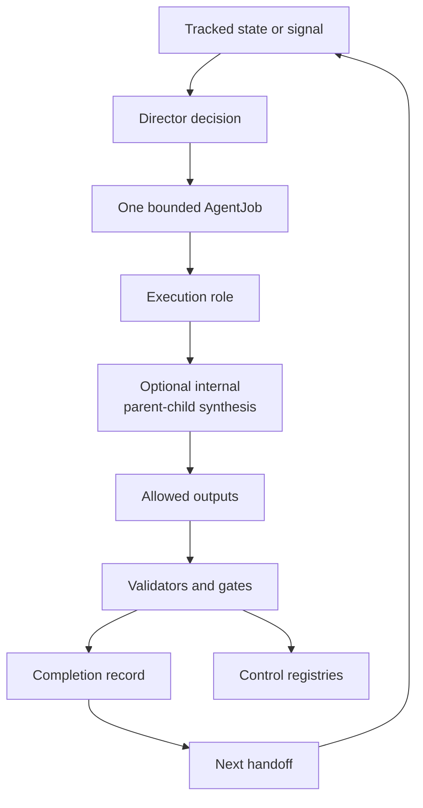
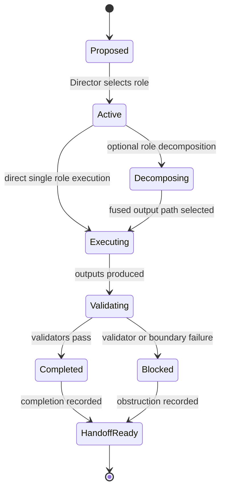

# Research System

The research system turns questions, handoffs, and improvement signals into bounded agent work with explicit authority and receipts.

## Source Binding

- **Derived from spec:** `markdown/html-explainer-specs/research-agent-workflow-explainer.md`
- **Related HTML:** `html/research-agent-workflow-explainer.html`
- **Authority status:** `generated_noncanonical`

## Source-Backed Summary

The research system is the governed workflow that turns a question, continuation state, or project-improvement signal into bounded agent work with explicit roles, decisions, registries, artifacts, validation, completion records, and handoffs. Its function is to separate physics continuation from project-system maintenance, resolve tracked state before acting, assign one bounded AgentJob, constrain that job with role authority and allowlists, and preserve completion evidence for the next handoff. Optional parent-child synthesis can add analytical perspectives inside one AgentJob, but it cannot create new authority, extra jobs, or independent outputs. The system matters because AEther-Flow is not an informal chat log or autonomous proof engine. It is a controlled research program where progress, obstructions, generated derivatives, and negative results must remain reproducible and auditable.

## What This Feature Does

The research system is the operating workflow for bounded physics continuation and project-system improvement.

## Why The Project Needs It

The project needs it because speculative research, agent work, documentation, and validation must remain traceable instead of depending on unrecorded conversation state.

## How It Works

Tracked state leads to a Director decision, one AgentJob, a task-local role record, allowed outputs, validators, completion evidence, registries, and the next handoff.

## What It Is Not

It is not autonomous proof, not claim promotion, not permission to write outside an allowlist, and not a substitute for human-gated decisions.

## Diagram Reading Guide

The loop diagram shows state, Director, AgentJob, role, outputs, validators, completion, handoff, and registries. The lifecycle diagram shows how one job moves from proposal through execution to completion or blocked handoff.

<!-- mermaid-diagram-id: research-system-loop -->

<!-- mermaid-diagram-id: agentjob-lifecycle -->

## Source Authority

Authority comes from research-control guidance, AgentJob and execution-role schemas, task records, and registries.

## External AI Navigation Card

You are reading a non-authoritative GitHub-facing explainer.

Safe uses:
- summarize the feature for orientation
- identify source files to inspect next
- explain workflow boundaries in plain language

Before modifying project knowledge:
- read `AGENTS.md`
- inspect the relevant registry rows
- inspect the relevant source spec or canonical source file
- route through the correct research-control workflow

Do not:
- do not treat this derivative as physics authority
- do not claim the Æther-flow derivation is complete
- do not treat generated HTML, wiki, PDF, or `.local/` files as independent authority
- do not bypass claim gates, validators, or AgentJob boundaries

## Where To Go Next

- Read role routing before selecting an agent role.
- Read research-control system before changing project machinery.
- Read claim gates before interpreting scientific status.

## All Source Materials

- `README.md`
- `AGENTS.md`
- `research_control/AGENTS.md`
- `research_control/README.md`
- `.codex/skills/continue-research/SKILL.md`
- `.codex/skills/improve-project-system/SKILL.md`
- `registries/AGENT_JOB_REGISTRY.csv`
- `registries/DIRECTOR_DECISION_REGISTRY.csv`
- `registries/ROLE_EXECUTION_REGISTRY.csv`
- `registries/RESEARCH_TASK_REGISTRY.csv`
- `.agents/schemas/AGENT_JOB_SCHEMA.md`
- `.agents/schemas/EXECUTION_ROLE_SCHEMA.md`
- `research_control/templates/COMPLETION_TEMPLATE.yaml`
