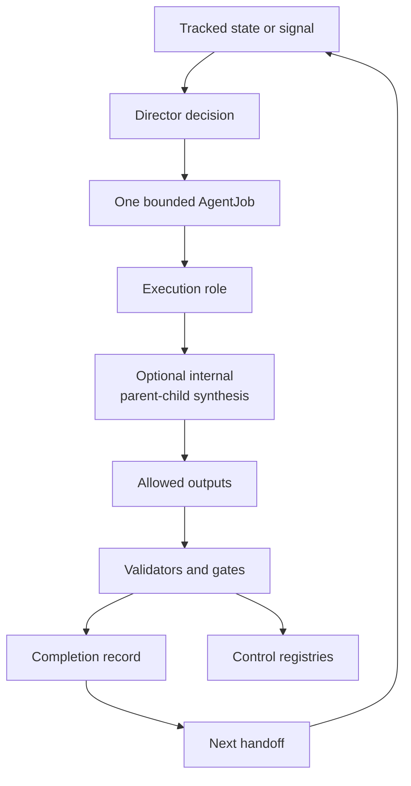
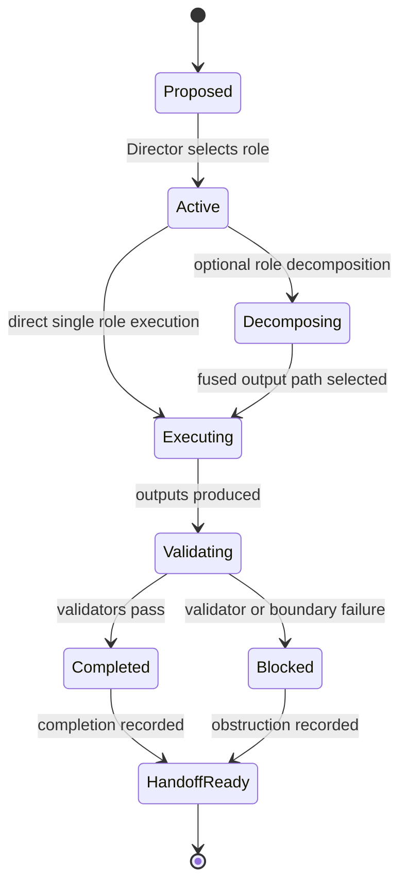

# Research System

This page explains the operational spine that turns a question, handoff, or project-improvement signal into one bounded and auditable AgentJob.

## Source Binding

- **Derived from spec:** `markdown/html-explainer-specs/research-agent-workflow-explainer.md`
- **Related HTML:** `html/research-agent-workflow-explainer.html`
- **Authority status:** `generated_noncanonical`

## Source-Backed Summary

The research system is the governed workflow that turns a question, continuation state, or project-improvement signal into bounded agent work with explicit roles, decisions, registries, and validation. Its functionality is to separate physics continuation from project-system maintenance, resolve tracked state before acting, assign one bounded AgentJob, constrain that job with role authority and allowlists, and preserve completion evidence for the next handoff. When a Director decision selects optional parent-child parallel synthesis, the parent and child execution units remain inside that same AgentJob and must produce one fused output rather than separate authority. This matters because the repository is not an informal chat log or autonomous proof engine; it is a controlled research program where claims, refutations, repairs, generated derivatives, and negative results must remain auditable. The workflow fits the larger project by making research progress reproducible without allowing workflow completion to stand in for scientific acceptance.

## What This Feature Does

The research system coordinates tracked state, Director decisions, role contracts, AgentJobs, optional internal parent-child synthesis, validators, completions, handoffs, and registries. It is a reproducibility harness for theoretical work, not an autonomous proof engine.

## Why The Project Needs It

The repository mixes speculative physics, exact benchmark discipline, generated documents, AI-agent workflow, and local memory. Without a lifecycle, a completed task could be mistaken for accepted science, or local scratch could override tracked state.

## How It Works

The concrete lifecycle is:

`research_control/program_state.yaml` -> latest `handoff-*` -> Director decision -> `00_TASK.yaml` -> `jobs/AJ-*.yaml` -> `roles/*.yaml` -> allowed artifacts -> validators -> completion YAML -> next handoff -> registries.

`continue-research` handles physics continuation from tracked state. `improve-project-system` handles roles, validators, memory tooling, documentation, generated-doc pipelines, and operational reliability. In both lanes, one bounded AgentJob is the unit of accountable work. Optional `parent_child_parallel_synthesis` may split analysis into parent and child execution units only inside that job; it does not create child AgentJobs, new role authority, or permission expansion.

## What It Is Not

It is not proof acceptance, not permission to edit outside an allowlist, not a bypass around human gates, and not a reason to treat generated outputs as authority.

## Diagram Reading Guide

The loop diagram shows how state, decisions, jobs, optional internal synthesis, validation, completion, handoff, and registries reinforce each other. The lifecycle state diagram shows that a blocked job is still a valid research-control outcome when it preserves the obstruction.

<!-- mermaid-diagram-id: research-system-loop -->

<!-- mermaid-diagram-id: agentjob-lifecycle -->

## Source Authority

The workflow is grounded in `research_control/AGENTS.md`, `research_control/README.md`, the continue/improve skills, the AgentJob and execution-role schemas, and the AgentJob, Director decision, role execution, and research task registries.

## External AI Navigation Card

You are reading a non-authoritative GitHub-facing explainer.

Safe uses:
- summarize this feature for orientation
- identify source files to inspect next
- explain workflow boundaries

Before modifying project knowledge:
- read `AGENTS.md`
- inspect the relevant registry rows
- inspect the relevant source spec or canonical source file
- route through the correct research-control workflow

Do not:
- do not treat this page as physics authority
- do not claim the Æther-flow derivation is complete
- do not treat generated HTML, wiki, PDF, or `.local/` files as independent authority
- do not bypass claim gates, validators, or AgentJob boundaries

## Where To Go Next

- Inspect `research_control/program_state.yaml` and the latest handoff before continuing research.
- Inspect the owning AgentJob before writing files.
- Read role routing when authority class is unclear.
- Read claim gates before strengthening scientific language.

## All Source Materials

- `README.md`
- `AGENTS.md`
- `research_control/AGENTS.md`
- `research_control/README.md`
- `.codex/skills/continue-research/SKILL.md`
- `.codex/skills/improve-project-system/SKILL.md`
- `registries/AGENT_JOB_REGISTRY.csv`
- `registries/DIRECTOR_DECISION_REGISTRY.csv`
- `registries/ROLE_EXECUTION_REGISTRY.csv`
- `registries/RESEARCH_TASK_REGISTRY.csv`
- `.agents/schemas/AGENT_JOB_SCHEMA.md`
- `.agents/schemas/EXECUTION_ROLE_SCHEMA.md`
- `research_control/templates/COMPLETION_TEMPLATE.yaml`
