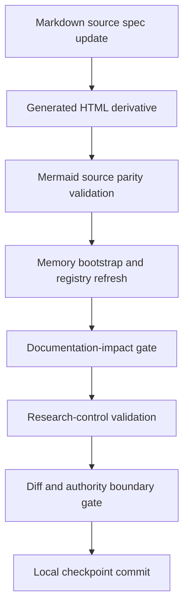
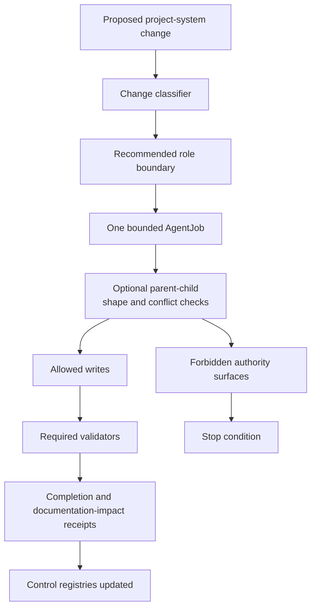

# Research-Control System

The research-control system is the governance layer that decides how project-system work and research-continuation work may proceed without blurring authority.

## Source Binding

- **Derived from spec:** `markdown/html-explainer-specs/research-control-system-explainer.md`
- **Related HTML:** `html/research-control-system-explainer.html`
- **Authority status:** `generated_noncanonical`

## What It Controls

The system controls state-changing work: project-system repairs, documentation synchronization, validator changes, role/schema changes, memory-tooling updates, and physics continuation. It separates those lanes so a documentation task does not promote science, a validator repair does not rewrite ontology, and a research continuation does not bypass tracked state.

## Workflow Step Inspector

1. Classify changed paths and reason codes.
2. Resolve advisory project-system or continuation routing.
3. Bind the work to one bounded AgentJob and execution role.
4. Update canonical source specs or project-control sources before derivatives.
5. Record documentation impact when project machinery changes.
6. Regenerate memory, registry, HTML, wiki, or GitHub-facing derivatives through approved tooling.
7. Run the validator chain: teaching QA, depth lint, unit tests, bootstrap, documentation-surface audit, documentation-impact validation, research-control validation, and diff checks where required.
8. Treat checkpoint readiness as validator-backed authority-boundary evidence, not as a scientific result.

## Student Questions And Teacher Answers

**Student:** Why is documentation work controlled?

**Teacher:** Documentation can affect how humans and agents interpret authority. If a generated explainer suggests a stronger claim than the sources allow, it becomes project-system risk. The source basis is `AGENTS.md`, `research_control/README.md`, and the Documentation Curator role.

**Student:** Is the resolver a hard command?

**Teacher:** No. The project-improvement resolver is advisory routing state. Hard checkpoint gates are validator failures and authority-boundary violations.

**Student:** What protects generated explainers?

**Teacher:** Source specs, renderer contracts, source-basis hashes, Mermaid parity checks, documentation-impact receipts, and research-control validation keep derivatives aligned with registered sources.

## Validation Flow

<!-- mermaid-diagram-id: research-control-validation-flow -->

<!-- mermaid-diagram-id: control-boundary-map -->

## Failure Modes It Prevents

- A generated page becoming source authority.
- A role writing outside its AgentJob allowlist.
- A project-system repair changing physics claim status.
- A physics continuation stopping too early because local data is absent when tracked state authorizes a bounded next packet.
- A repeated workflow problem staying informal instead of becoming a registered project-improvement signal.

## For GitHub Readers And AI Agents

You are reading a non-authoritative GitHub-facing explainer.

Safe uses:
- understand which validation path protects a change;
- identify the source files and scripts that govern control state;
- distinguish advisory routing from hard gates.

Before modifying project knowledge:
- run the classifier or resolver only in the correct workflow context;
- inspect the AgentJob and documentation-impact requirements;
- validate with the current command chain before checkpointing.

Do not:
- treat resolver output as a physics verdict;
- bypass documentation-impact receipts after project-system changes;
- hand-edit generated wiki notes or tracked HTML derivatives as authority.

## All Source Materials

- `AGENTS.md`
- `README.md`
- `research_control/README.md`
- `.codex/skills/improve-project-system/SKILL.md`
- `.codex/skills/html-visual-explainer/SKILL.md`
- `.codex/skills/aether-teaching-explainer/SKILL.md`
- `.codex/skills/visual-explainer/SKILL.md`
- `.codex/skills/visual-explainer/subskills/mermaid-documentation/SKILL.md`
- `.agents/roles/research_ops/documentation-curator.v0.9.0.md`
- `.agents/roles/research_ops/documentation-student.v0.1.0.md`
- `.agents/roles/research_ops/documentation-teacher.v0.1.0.md`
- `.agents/schemas/AGENT_JOB_SCHEMA.md`
- `.agents/schemas/EXECUTION_ROLE_SCHEMA.md`
- `.agents/schemas/TEACHING_QA_PACKET_SCHEMA.md`
- `research_control/templates/COMPLETION_TEMPLATE.yaml`
- `research_control/templates/PARENT_CHILD_CONFLICT_REVIEW_TEMPLATE.yaml`
- `research_control/design/html_explainer_flexible_presentation_contract.md`
- `scripts/project_control/validate_documentation_impact.py`
- `scripts/research_control/validate_research_control.py`
- `scripts/spec_depth_lint.py`
- `scripts/validate_teaching_qa.py`
- `.codex/skills/project-memory-system/scripts/bootstrap_memory_system.py`
