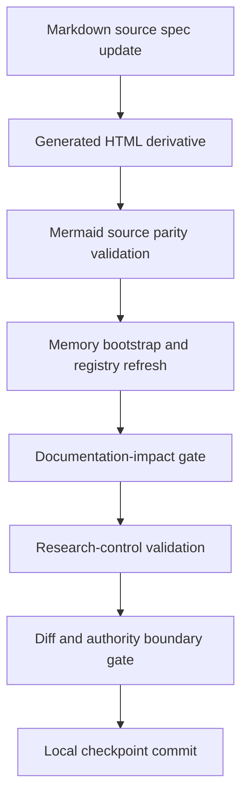
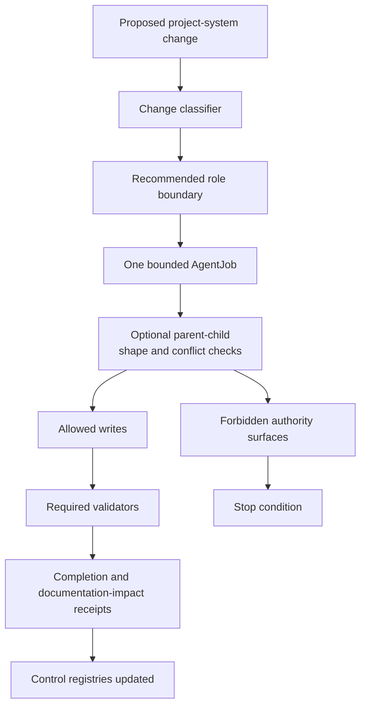

# Research-Control System

The research-control system governs changes to the project itself: roles, skills, validators, documentation, generated derivatives, and checkpoint boundaries.

## Source Binding

- **Derived from spec:** `markdown/html-explainer-specs/research-control-system-explainer.md`
- **Related HTML:** `html/research-control-system-explainer.html`
- **Authority status:** `generated_noncanonical`

## Source-Backed Summary

The research-control system is the repository’s governance layer for deciding how project-system and research-continuation work may proceed. Its function is to classify changes, resolve advisory routing, create or reuse one bounded AgentJob, enforce role and write-path boundaries, require documentation-impact receipts when project machinery changes, and validate that source specs, skills, roles, registries, claim boundaries, optional parent-child decomposition evidence, teaching Q&A packets, and generated derivatives remain aligned. It matters because AEther-Flow deliberately combines scientific exploration with agent workflow development. Without control records, generated HTML, GitHub-facing Markdown, teaching packets, validators, and role contracts could drift or be mistaken for scientific authority. The system makes improvements reversible, auditable, and separate from physics claim promotion.

## What This Feature Does

The research-control system governs project-system changes and research-continuation boundaries.

## Why The Project Needs It

The project needs it because improving roles, skills, validators, documentation, and generated surfaces can accidentally change authority if not routed and receipted.

## How It Works

It classifies changes, resolves advisory routing, binds one AgentJob, records documentation impact, regenerates derivatives from sources, runs validators, and blocks checkpointing when boundaries fail.

## What It Is Not

It is not physics continuation, not a broad rewrite license, not direct HTML authority, and not a substitute for human-gated policy decisions.

## Diagram Reading Guide

The validation-flow diagram shows source update, derivative generation, Mermaid parity, bootstrap, documentation impact, research-control validation, diff gate, and checkpoint. The boundary map shows classifier, role, job, allowed writes, forbidden surfaces, validators, receipts, and registries.

<!-- mermaid-diagram-id: research-control-validation-flow -->

<!-- mermaid-diagram-id: control-boundary-map -->

## Source Authority

Authority comes from AGENTS guidance, research-control guidance, improve-project-system, role contracts, validator scripts, and design contracts.

## External AI Navigation Card

You are reading a non-authoritative GitHub-facing explainer.

Safe uses:
- summarize the feature for orientation
- identify source files to inspect next
- explain workflow boundaries in plain language

Before modifying project knowledge:
- read `AGENTS.md`
- inspect the relevant registry rows
- inspect the relevant source spec or canonical source file
- route through the correct research-control workflow

Do not:
- do not treat this derivative as physics authority
- do not claim the Æther-flow derivation is complete
- do not treat generated HTML, wiki, PDF, or `.local/` files as independent authority
- do not bypass claim gates, validators, or AgentJob boundaries

## Where To Go Next

- Use continue-research for physics continuation.
- Use improve-project-system for project machinery.
- Use the teaching explainer only inside an authorized bounded job.

## All Source Materials

- `AGENTS.md`
- `README.md`
- `research_control/README.md`
- `.codex/skills/improve-project-system/SKILL.md`
- `.codex/skills/html-visual-explainer/SKILL.md`
- `.codex/skills/aether-teaching-explainer/SKILL.md`
- `.codex/skills/visual-explainer/SKILL.md`
- `.codex/skills/visual-explainer/subskills/mermaid-documentation/SKILL.md`
- `.agents/roles/research_ops/documentation-curator.v0.9.0.md`
- `.agents/roles/research_ops/documentation-student.v0.1.0.md`
- `.agents/roles/research_ops/documentation-teacher.v0.1.0.md`
- `.agents/schemas/AGENT_JOB_SCHEMA.md`
- `.agents/schemas/EXECUTION_ROLE_SCHEMA.md`
- `.agents/schemas/TEACHING_QA_PACKET_SCHEMA.md`
- `research_control/templates/COMPLETION_TEMPLATE.yaml`
- `research_control/templates/PARENT_CHILD_CONFLICT_REVIEW_TEMPLATE.yaml`
- `research_control/design/html_explainer_flexible_presentation_contract.md`
- `scripts/project_control/validate_documentation_impact.py`
- `scripts/research_control/validate_research_control.py`
- `scripts/spec_depth_lint.py`
- `scripts/validate_teaching_qa.py`
- `.codex/skills/project-memory-system/scripts/bootstrap_memory_system.py`
