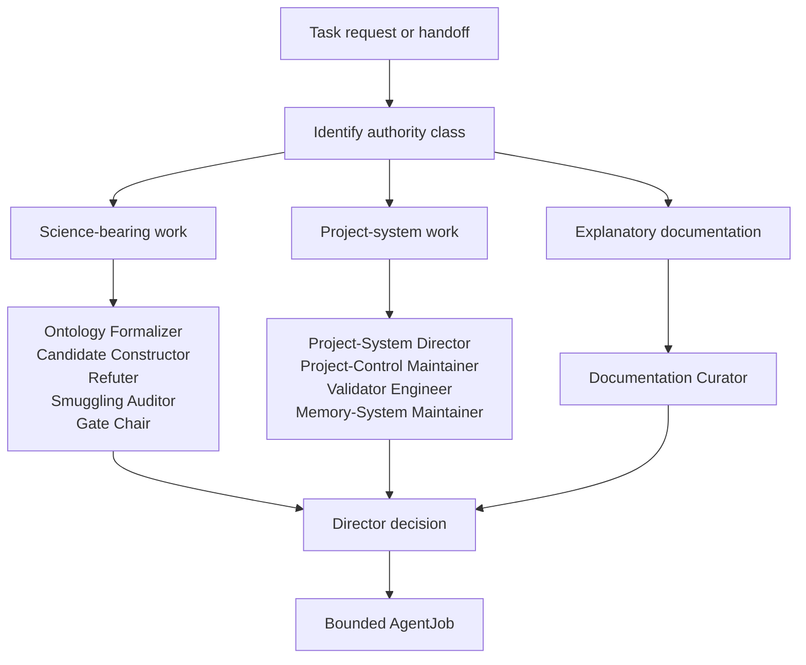
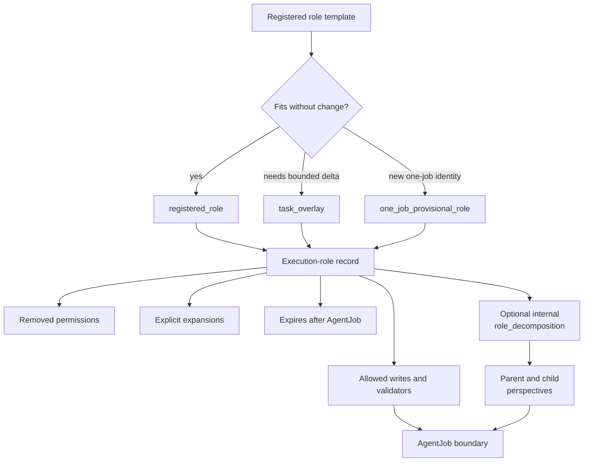

# Role Routing

Role routing chooses the correct authority lane before an agent changes files or claims progress.

## Source Binding

- **Derived from spec:** `markdown/html-explainer-specs/role-routing-explainer.md`
- **Related HTML:** `html/role-routing-explainer.html`
- **Authority status:** `generated_noncanonical`

## Source-Backed Summary

Role routing is the project’s decision system for assigning bounded work to the correct registered role or task-local execution overlay. Its function is to connect task state, Director decisions, base role contracts, provisional or overlay authority, and registry evidence so an agent knows who owns the change, what paths may be written, which validators are required, and when the job must stop. It also explains why optional parent-child synthesis is a decomposition of analytical perspective inside the selected AgentJob, not a new role class or permission expansion. The project needs role routing because physics roles, documentation roles, validator roles, memory roles, and project-control roles carry different authority. Collapsing them into one generic helper would risk claim promotion, direct derivative edits, or untracked control changes.

## What This Feature Does

Role routing selects the authority lane and role contract for one bounded task.

## Why The Project Needs It

The project needs it because different tasks require different permissions, validators, claim boundaries, and stop conditions.

## How It Works

A Director decision chooses the role, the execution-role record binds that role to one AgentJob, and the AgentJob constrains paths, outputs, validators, and expiry.

## Common questions

- Who selects the role? The Director decision.
- Can a task overlay become reusable policy? No, it expires with the job.
- Does parent-child synthesis create extra authority? No, it stays inside one AgentJob.

## Common misunderstandings

- A generated explainer is not a permission source.
- A provisional role is not a permanent role.
- A child perspective is not a separate job.

## What It Is Not

It is not permission for every capable tool to act, not permanent role registration, not generated-output authority, and not child-job creation.

## Diagram Reading Guide

The decision tree routes task requests by authority class. The contract map distinguishes registered roles, overlays, provisional roles, execution records, decomposition, and the AgentJob boundary.

<!-- mermaid-diagram-id: role-routing-decision-tree -->

<!-- mermaid-diagram-id: execution-role-contract-map -->

## Source Authority

Authority comes from role, execution-role, Director decision, AgentJob, and schema records.

## External AI Navigation Card

You are reading a non-authoritative GitHub-facing explainer.

Safe uses:
- summarize the feature for orientation
- identify source files to inspect next
- explain workflow boundaries in plain language

Before modifying project knowledge:
- read `AGENTS.md`
- inspect the relevant registry rows
- inspect the relevant source spec or canonical source file
- route through the correct research-control workflow

Do not:
- do not treat this derivative as physics authority
- do not claim the Æther-flow derivation is complete
- do not treat generated HTML, wiki, PDF, or `.local/` files as independent authority
- do not bypass claim gates, validators, or AgentJob boundaries

## Where To Go Next

- Inspect the role registry before selecting a role.
- Inspect the task-local execution role before writing.
- Read research-control system before changing contracts.

## All Source Materials

- `README.md`
- `AGENTS.md`
- `research_control/README.md`
- `research_control/AGENTS.md`
- `registries/AGENT_ROLE_REGISTRY.csv`
- `registries/ROLE_EXECUTION_REGISTRY.csv`
- `registries/DIRECTOR_DECISION_REGISTRY.csv`
- `.agents/schemas/AGENT_JOB_SCHEMA.md`
- `.agents/schemas/EXECUTION_ROLE_SCHEMA.md`
- `.agents/schemas/ROLE_SCHEMA.md`
