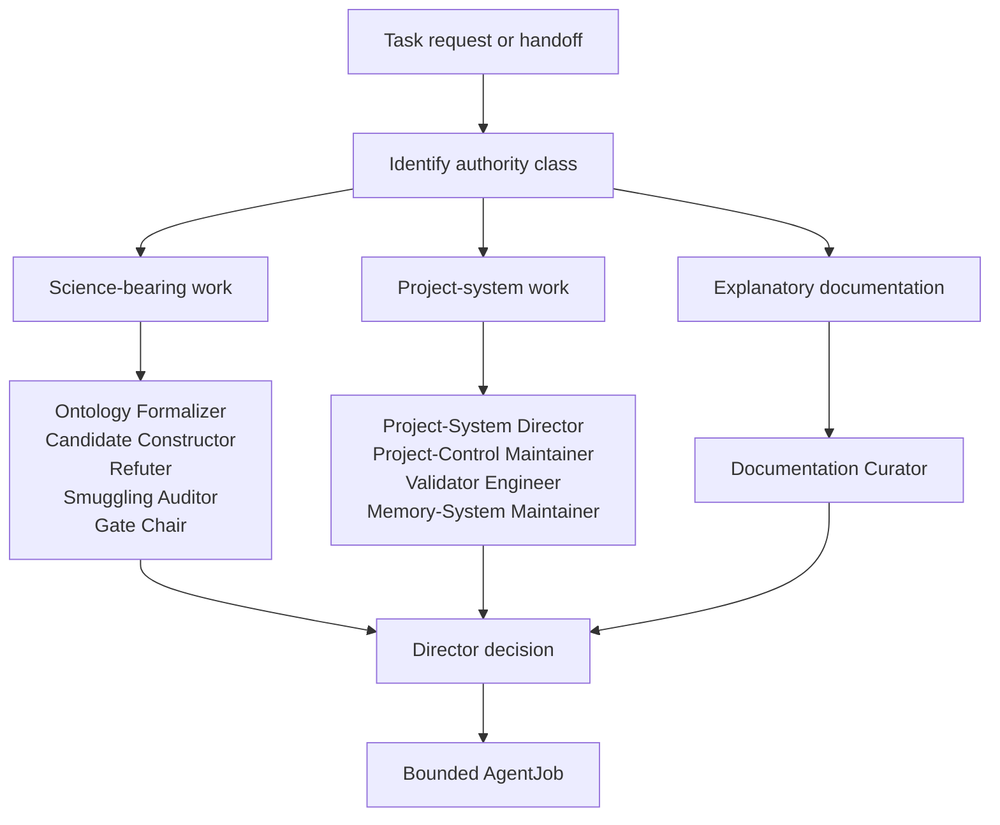
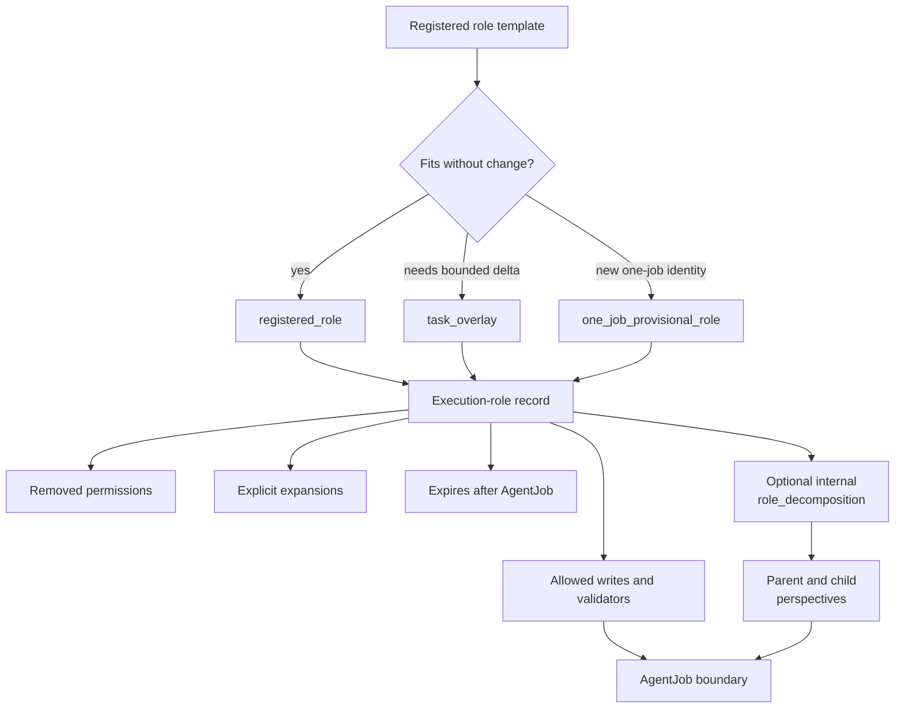

# Role Routing

Role routing decides which kind of agent may perform one bounded task, what authority that role carries, and where the task must stop.

## Source Binding

- **Derived from spec:** `markdown/html-explainer-specs/role-routing-explainer.md`
- **Related HTML:** `html/role-routing-explainer.html`
- **Authority status:** `generated_noncanonical`

## Plain-Language Model

A role is a controlled job identity. It is not a personality label and not a measure of general ability. The project uses roles because physics construction, refutation, documentation, validator repair, memory maintenance, and project-control maintenance have different authority boundaries. A Director decision selects the role for one AgentJob. A task-local execution-role record then says exactly how that role is used for the task.

## Workflow Step Inspector

1. Classify the task request or handoff by authority class.
2. Compare candidate registered roles against the required source classes.
3. Record the Director decision with the selected role and one AgentJob.
4. Choose direct registered-role use, a bounded task overlay, or a one-job provisional role.
5. Bind the execution-role record to allowed writes, removed permissions, expansions, and validators.
6. Keep optional role decomposition inside the same AgentJob and inherited authority.
7. Execute within the role boundary and record completion evidence.
8. Expire the overlay or provisional role after the job unless a later human-authorized registration changes the role system.

## Common questions

- **Who selects the role?** The Director decision selects the role for the bounded job.
- **What is an execution-role record?** It is the task-local binding between the reusable role and the exact AgentJob authority.
- **Can a task overlay become reusable policy?** No. A task overlay expires with the job unless a later human-authorized registration changes the role system.
- **Does parent-child synthesis create extra authority?** No. Parent and child perspectives inherit the outer AgentJob authority, claim boundary, and write allowlist.
- **What should a reviewer inspect?** Read the role registry, Director decision, execution-role row, AgentJob YAML, and completion record.

## Common misunderstandings

- A capable tool is not automatically the correct role.
- A Documentation Curator cannot silently become a Validator Engineer or Gate Chair.
- A one-job provisional role is not a permanent role.
- A generated explainer is not permission to write project-control or physics sources.
- Internal child perspectives are not child AgentJobs.

## Student Questions And Teacher Answers

**Student:** Why cannot one smart helper do everything?

**Teacher:** One helper would blur work types that the project deliberately separates. Physics drafting, refutation, validation, documentation, memory, and project-control repair have different failure modes. The source basis is `AGENT_ROLE_REGISTRY.csv`, `ROLE_EXECUTION_REGISTRY.csv`, and `research_control/README.md`.

**Student:** What is the safest mental model?

**Teacher:** Read routing as a chain: request, authority class, Director decision, role, execution-role record, AgentJob, validator evidence, completion. If any link is missing, authority is incomplete.

## Routing Diagrams

<!-- mermaid-diagram-id: role-routing-decision-tree -->

<!-- mermaid-diagram-id: execution-role-contract-map -->

## For GitHub Readers And AI Agents

You are reading a non-authoritative GitHub-facing explainer.

Safe uses:
- orient yourself to the role-selection chain;
- find the records that constrain a task;
- distinguish role authority from tool capability.

Before modifying project knowledge:
- inspect the selected role row and execution-role row;
- inspect the AgentJob allowlist;
- follow the current task's validators and stop conditions.

Do not:
- infer write permission from skill availability;
- convert a provisional role into permanent policy;
- use generated docs as authority for routing.

## All Source Materials

- `README.md`
- `AGENTS.md`
- `research_control/README.md`
- `research_control/AGENTS.md`
- `registries/AGENT_ROLE_REGISTRY.csv`
- `registries/ROLE_EXECUTION_REGISTRY.csv`
- `registries/DIRECTOR_DECISION_REGISTRY.csv`
- `.agents/schemas/AGENT_JOB_SCHEMA.md`
- `.agents/schemas/EXECUTION_ROLE_SCHEMA.md`
- `.agents/schemas/ROLE_SCHEMA.md`
