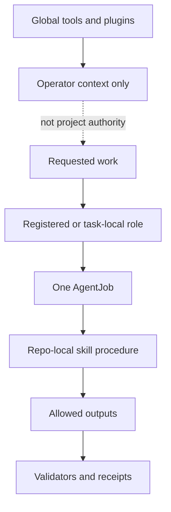

# Roles And Skills

Roles define who may do project work. Repo-local skills define governed procedures for doing that work. Tool availability alone is not project authority.

## Source Binding

- **Derived from spec:** `markdown/html-explainer-specs/roles-and-skills-explainer.md`
- **Related HTML:** `html/roles-and-skills-explainer.html`
- **Authority status:** `generated_noncanonical`

## Catalog Model

The catalog has three layers. Active roles are the current operating contracts. Status-defined and superseded roles remain visible for audit history or human-gated definition, but they are not automatically available for new work. Repo-local skills are front doors for governed procedures such as research continuation, project-system improvement, memory regeneration, visual explainers, teaching explainers, ontology promotion, and grill sessions.

## Student Questions And Teacher Answers

**Student:** What is the difference between a role and a skill?

**Teacher:** A role carries authority for a bounded job. A skill describes a governed procedure or workflow. A role may use a skill, but the skill does not replace the AgentJob allowlist or claim boundary.

**Student:** Why keep superseded roles?

**Teacher:** Old task records must remain auditable. Superseded role contracts explain historical execution without authorizing new work under old semantics.

**Student:** Are global Codex plugins project requirements?

**Teacher:** Not unless mirrored into `.codex/skills/` or registered in project sources. Otherwise they are operator-context aids.

## Active Role Families

- **Routing and control:** Director of Research and Project-System Director select bounded work.
- **Project-system maintenance:** Project-Control Maintainer, Validator Engineer, Memory-System Maintainer, and Process Integrity Auditor repair machinery under explicit boundaries.
- **Documentation:** Documentation Curator writes source-backed explainers, teaching packets, GitHub-facing Markdown, and HTML derivatives; Documentation Student and Documentation Teacher support the teaching loop without writing tracked docs directly.
- **Physics work:** Ontology Formalizer, Candidate Constructor, Refuter, Smuggling Auditor, Theoretical Continuation Selector, and Gate Chair each carry science-lane constraints.

## Skill Families

- **Continuation and integration:** `continue-research`, `improve-project-system`, `user-modified-project`.
- **Memory and derivatives:** `project-memory-system`, `markdown-wiki`, `tex-wiki`, `pdf-derivative-build`, `obsidian-wiki`.
- **Explanatory surfaces:** `html-visual-explainer`, `visual-explainer`, `aether-teaching-explainer`, `mermaid-documentation`.
- **Promotion and review:** `ontology-promotion`, `grill-me`, `grill-with-docs`.

## Boundary Rule

Before invoking a skill, identify the role and AgentJob that authorize the work. Before relying on a role, inspect the registry row and role contract. Before treating a helper tool as project authority, check whether it is registered in repo-local sources.

## For GitHub Readers And AI Agents

You are reading a non-authoritative GitHub-facing explainer.

Safe uses:
- identify likely role and skill surfaces to inspect;
- distinguish role authority from skill procedure;
- avoid confusing external tools with project contracts.

Before modifying project knowledge:
- inspect `registries/AGENT_ROLE_REGISTRY.csv`;
- inspect any task-local execution-role record;
- follow the selected skill only inside its authorized workflow.

Do not:
- use a superseded role for new work;
- infer permission from a plugin name;
- bypass AgentJob boundaries with a convenient skill.

## All Source Materials

- `README.md`
- `AGENTS.md`
- `research_control/README.md`
- `registries/AGENT_ROLE_REGISTRY.csv`
- `registries/ROLE_EXECUTION_REGISTRY.csv`
- `registries/MARKDOWN_SOURCE_REGISTRY.csv`
- `.agents/schemas/EXECUTION_ROLE_SCHEMA.md`
- `.agents/schemas/TEACHING_QA_PACKET_SCHEMA.md`
- `.agents/roles/research_ops/director-of-research.v0.1.0.md`
- `.agents/roles/research_ops/project-system-director.v0.1.0.md`
- `.agents/roles/research_ops/project-control-maintainer.v0.1.0.md`
- `.agents/roles/research_ops/documentation-curator.v0.9.0.md`
- `.agents/roles/research_ops/documentation-curator.v0.7.0.md`
- `.agents/roles/research_ops/documentation-student.v0.1.0.md`
- `.agents/roles/research_ops/documentation-teacher.v0.1.0.md`
- `.agents/roles/research_ops/validator-engineer.v0.1.0.md`
- `.agents/roles/research_ops/memory-system-maintainer.v0.1.0.md`
- `.agents/roles/research_ops/process-integrity-auditor.v0.1.0.md`
- `.agents/roles/physics/ontology-formalizer.v0.1.0.md`
- `.agents/roles/physics/candidate-constructor.v0.1.0.md`
- `.agents/roles/physics/refuter.v0.1.0.md`
- `.agents/roles/physics/smuggling-auditor.v0.1.0.md`
- `.agents/roles/physics/gate-chair.v0.1.0.md`
- `.agents/roles/research_ops/documentation-curator.v0.1.0.md`
- `.codex/skills/aether-teaching-explainer/SKILL.md`
- `.codex/skills/continue-research/SKILL.md`
- `.codex/skills/user-modified-project/SKILL.md`
- `.codex/skills/improve-project-system/SKILL.md`
- `.codex/skills/project-memory-system/SKILL.md`
- `.codex/skills/markdown-wiki/SKILL.md`
- `.codex/skills/tex-wiki/SKILL.md`
- `.codex/skills/pdf-derivative-build/SKILL.md`
- `.codex/skills/obsidian-wiki/SKILL.md`
- `.codex/skills/html-visual-explainer/SKILL.md`
- `.codex/skills/visual-explainer/SKILL.md`
- `.codex/skills/visual-explainer/subskills/mermaid-documentation/SKILL.md`
- `.codex/skills/ontology-promotion/SKILL.md`
- `.codex/skills/grill-me/SKILL.md`
- `.codex/skills/grill-with-docs/SKILL.md`
