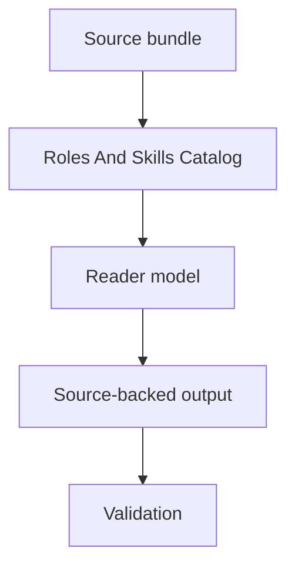

# Roles And Skills Catalog

The roles and skills catalog lists the project-governed execution roles and local skill front doors that structure work. It separates stable role authority, historical versions, task-local overlays, support subroles, and general tool availability. This matters because having a skill or tool available does not authorize source edits; only the selected role, AgentJob allowlist, and project-control contract do.

## What This Does

Roles And Skills Catalog gives readers a source-backed model of the roles and skills catalog. It identifies the component, the work it performs inside AEther-Flow, the objects it touches, and the authority boundary that keeps explanation separate from proof or permission. The block is intentionally functional: it starts with what the mechanism does in the project and only then points to source evidence such as `registries/AGENT_ROLE_REGISTRY.csv` and `.agents/roles/research_ops/documentation-curator.v1.0.0.md`. This lets humans and agents learn the subject without treating a generated derivative as an independent control surface.

## Why AEther Needs It

AEther-Flow needs this topic because the project combines speculative physics, exact-GR benchmarking, and validator-gated research operations. Without a clear account of the roles and skills catalog, readers can collapse benchmark adoption, derivation attempts, generated documentation, and control authority into one vague claim. The atlas model keeps the reason for the component visible: it improves orientation, reproducibility, and source discipline while preserving the authority hierarchy recorded in `registries/AGENT_ROLE_REGISTRY.csv` and related registry or control files.

## System Map

<!-- mermaid-diagram-id: roles-skills-catalog-map -->

## Source Binding

- **Derived from spec:** `markdown/html-explainer-specs/roles-and-skills-explainer.md`
- **Related HTML:** `html/roles-and-skills-explainer.html`
- **Authority status:** `generated_noncanonical`

## How It Works

The mechanism works by starting from tracked source material, applying the project rule or workflow named by the topic, producing a bounded explanatory or control artifact, and validating the result against deterministic checks. For the roles and skills catalog, the important pattern is sequence and containment: source first, bounded operation second, derivative or task evidence third, validation last. If an operator needs to change project knowledge, the next step is to inspect `registries/AGENT_ROLE_REGISTRY.csv` and the related registry row before editing anything.

## Objects And Authority

The objects involved in the roles and skills catalog include source files, registries, role or schema contracts where relevant, generated reader surfaces, and validation commands. Authority is not uniform across those objects. Source files and registries define the project state for their lanes; generated HTML, GitHub Markdown, wiki notes, semantic extracts, and local caches orient readers but remain noncanonical. This block keeps those authority levels visible so a polished derivative cannot silently outrank `registries/AGENT_ROLE_REGISTRY.csv` or `.agents/roles/research_ops/documentation-curator.v1.0.0.md`.

| Object | Function | Authority status |
| --- | --- | --- |
| Source spec | Declares topic, sources, visuals, reader blocks, and output paths | Canonical Markdown source for this explainer |
| GitHub Markdown | Native reader explanation with Mermaid source | Generated noncanonical derivative |
| HTML explainer | Standalone visual reader surface | Generated noncanonical derivative |
| Registries and validators | Track coverage, hashes, parity, and boundaries | Authority only for their declared control fields |

## Example

Documentation Curator writes source-backed explainers; Documentation Student asks questions; Documentation Teacher answers from sources; Project-Control Maintainer changes validators only inside an authorized job. The valid pattern is source-first and bounded: the operator can trace the action to `registries/AGENT_ROLE_REGISTRY.csv`, inspect the relevant registry or task file, perform only the authorized change, regenerate derivatives when needed, and record validation evidence. The example is deliberately local to the project so it can be tested against actual files rather than treated as generic process advice.

## Non-Example

Invalid: using an available tool as proof that the current AgentJob may edit unrelated files. The failure mode is authority inflation: a reader takes an orientation surface, support artifact, convenience tool, or partial calculation and treats it as if it changed the project state. The correction is to return to `registries/AGENT_ROLE_REGISTRY.csv`, inspect the controlling registry or task record, and route a bounded job when a change is actually required. This matters because local cache state, generated derivatives, and unregistered convenience notes can look operationally persuasive while still lacking the tracked control authority needed to change the repository state.

## Common Confusions

Common confusions around the roles and skills catalog usually have the same form. Readers may mistake generated explainers for source authority, confuse benchmark compatibility with completed derivation, treat available tools as permissions, or assume a PASS validator means more than the validator checks. The repair is to name the exact authority lane, preserve qualifiers such as local or source-only, cite concrete source paths, and use validators as contract checks rather than as broad scientific verdicts.

- Generated pages can be clearer than sources, but clarity is not authority.
- A validator PASS means the checked contract passed; it is not a physics verdict.
- Role or tool availability does not expand the current AgentJob allowlist.
- Local or source-only results must keep those qualifiers.

## What This Does Not Authorize

Roles And Skills Catalog does not authorize ontology edits, benchmark promotion, Gate Chair verdicts, role or schema authority expansion, new write permissions, child AgentJobs, generated-output authority, or completed-GR-derivation claims. It is an explanatory and operational map only. It also does not collapse orientation into permission: even an accurate map remains evidence for navigation, not a substitute for the source file, task record, role contract, or validator named by that action. Any change to project truth must still pass through the relevant canonical source, registry row, bounded AgentJob, documentation-impact receipt, and validation sequence named by the governing sources.

## Workflow Step Inspector

1. Inspect the declared source bundle and topic registry row.
2. Confirm the current task or reader question belongs to this topic.
3. Follow the source-first workflow before changing project knowledge.
4. Regenerate GitHub, HTML, wiki, and registry derivatives only from governed sources.
5. Run the relevant validators and preserve failures as evidence.

## Source Map

The source map for the roles and skills catalog lists the files that ground the explanation and tells the reader what each contributes. Source paths are visible in both the GitHub and HTML derivatives because generated surfaces must lead back to authority. The core source bundle for this topic includes `registries/AGENT_ROLE_REGISTRY.csv` and `.agents/roles/research_ops/documentation-curator.v1.0.0.md`; additional files appear as source chips and in the All Source Materials section so validators can check parity.

- `registries/AGENT_ROLE_REGISTRY.csv`
- `.agents/roles/research_ops/documentation-curator.v1.0.0.md`
- `.agents/roles/research_ops/documentation-student.v0.1.0.md`
- `.agents/roles/research_ops/documentation-teacher.v0.1.0.md`
- `.codex/skills/improve-project-system/SKILL.md`
- `.codex/skills/html-visual-explainer/SKILL.md`

## Next Reading Path

The next reading path depends on the reader question. Physics-status questions should continue to ontology, exact-GR benchmark, claim gates, and the derivation roadmap. Workflow questions should continue to research-agent system, Director decisions, role routing, and project-system improvement. Documentation or trust questions should continue to source authority, memory/registry/wiki, validator workflow, roles and skills, and technical requirements before any edit is made. The safe rule is to read laterally, not forward into authority inflation: each destination answers a narrower question and points back to its own source files. When a reader cannot decide, inspect Source Authority first, then choose the workflow whose registry or control record names the required permission.

## External AI Navigation Card

You are reading a non-authoritative GitHub-facing explainer.

Safe uses:
- learn the project mechanism before inspecting sources;
- identify which source files and registries to inspect next;
- summarize authority boundaries without promoting claims.

Before modifying project knowledge:
- inspect the relevant source file and registry row;
- route through the appropriate research-control or project-system workflow;
- regenerate derivatives through approved tooling;
- run the validators named by the task.

Do not:
- treat this generated page as physics authority;
- treat generated HTML, wiki, PDF, semantic, Obsidian, or local cache output as independent authority;
- bypass claim gates, validators, AgentJob boundaries, or documentation-impact receipts.

## All Source Materials

- `registries/AGENT_ROLE_REGISTRY.csv`
- `.agents/roles/research_ops/documentation-curator.v1.0.0.md`
- `.agents/roles/research_ops/documentation-student.v0.1.0.md`
- `.agents/roles/research_ops/documentation-teacher.v0.1.0.md`
- `.codex/skills/improve-project-system/SKILL.md`
- `.codex/skills/html-visual-explainer/SKILL.md`
