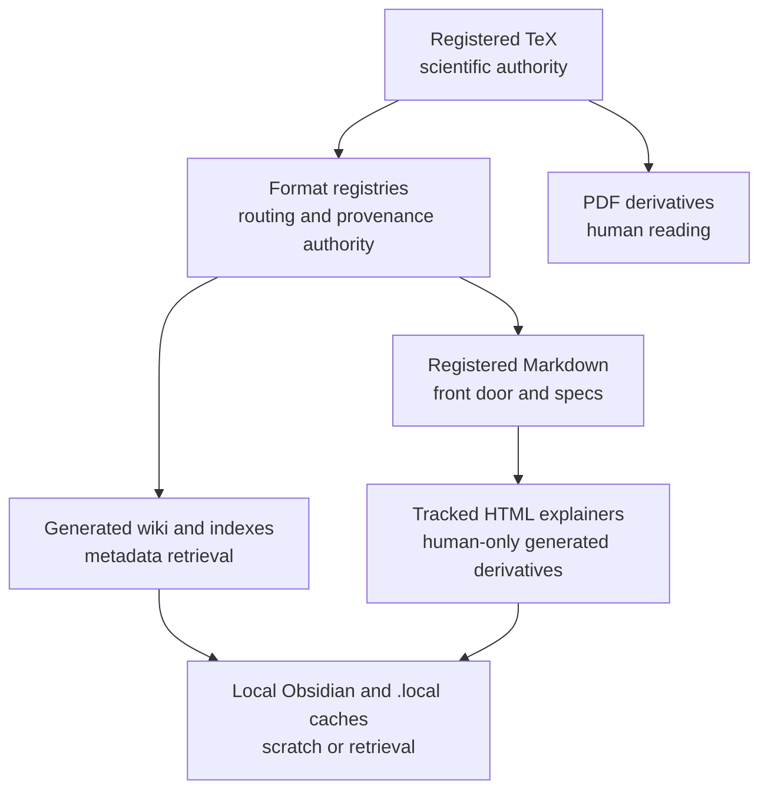
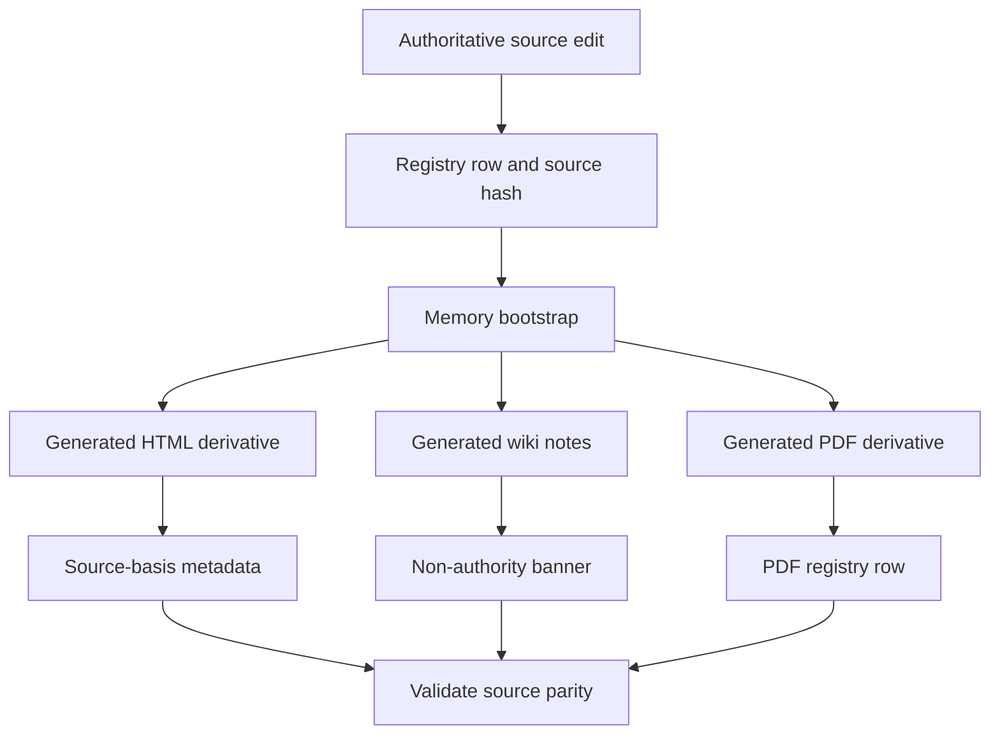

# Source Authority

Source authority is the repository rule that decides which files can define project truth and which files are reading, retrieval, validation, or publication derivatives.

## Source Binding

- **Derived from spec:** `markdown/html-explainer-specs/source-authority-explainer.md`
- **Related HTML:** `html/source-authority-explainer.html`
- **Authority status:** `generated_noncanonical`

## Authority Ladder

The highest science-bearing authority is registered TeX. Format registries carry routing, provenance, source hash, generated-output, and memory authority. Registered Markdown carries front-door guidance, source specs, and project-control notes. PDFs, HTML explainers, GitHub-facing Markdown, generated wiki notes, indexes, semantic extracts, local Obsidian vaults, and `.local/` caches are useful only because they point back to those sources.

## Workflow Step Inspector

1. Edit the authoritative TeX, registry, or registered Markdown source first.
2. Update the corresponding registry row and source hash when required.
3. Regenerate dependent wiki, HTML, PDF, semantic, or local retrieval surfaces through approved tooling.
4. Preserve source-basis metadata and visible source evidence in derivatives.
5. Validate source parity, hashes, generated-output bindings, and authority status.
6. Use generated surfaces for reading and retrieval, not independent claims.
7. Treat `.local/` caches as scratch or machine-local retrieval aids.
8. Return to the canonical source or registry before making project-knowledge changes.

## Student Questions And Teacher Answers

**Student:** What if a generated page explains something better than the source?

**Teacher:** Better readability does not create authority. Use the generated page to find the source, then cite or modify the registered source and registry row.

**Student:** Why are registries so important?

**Teacher:** Registries carry object identity, provenance, hashes, related sources, generated outputs, and validation status. They are how humans and agents know whether a derivative still matches its source.

**Student:** Can `.local/` retrieval output settle a disagreement?

**Teacher:** No. `.local/` output is scratch or machine-local retrieval. It can help find evidence, but the evidence must come from tracked source authority.

## Authority And Generation Diagrams

<!-- mermaid-diagram-id: source-authority-ladder -->

<!-- mermaid-diagram-id: derivative-generation-flow -->

## Practical Use Matrix

| Surface | Use | Authority Boundary |
| --- | --- | --- |
| Registered TeX | Physics and derivational claims | Science authority when registered and valid |
| Registries | Provenance, routing, memory, generated-output tracking | Canonical for their schema-owned fields |
| Registered Markdown | Guidance, specs, project-control notes | Authority for its declared lane |
| Generated HTML and GitHub Markdown | Human orientation | Nonauthoritative derivatives |
| Wiki, semantic extracts, `.local/` | Search and retrieval | Evidence-finding aids only |

## For GitHub Readers And AI Agents

You are reading a non-authoritative GitHub-facing explainer.

Safe uses:
- learn which source type to inspect;
- trace generated surfaces back to sources;
- explain why a derivative is not independent authority.

Before modifying project knowledge:
- inspect the source and registry row;
- regenerate derivatives through the approved path;
- run the relevant validation gates.

Do not:
- edit generated wiki notes by hand;
- cite generated HTML as physics authority;
- let a local cache override tracked control state.

## All Source Materials

- `README.md`
- `AGENTS.md`
- `.codex/skills/project-memory-system/SKILL.md`
- `.codex/skills/html-visual-explainer/SKILL.md`
- `registries/TEX_SOURCE_REGISTRY.csv`
- `registries/MARKDOWN_SOURCE_REGISTRY.csv`
- `registries/HTML_EXPLAINER_REGISTRY.csv`
- `registries/WIKI_ARTIFACT_REGISTRY.csv`
- `registries/PDF_DERIVATIVE_REGISTRY.csv`
- `registries/FILE_OBJECT_REGISTRY.csv`
- `research_control/design/html_explainer_flexible_presentation_contract.md`
