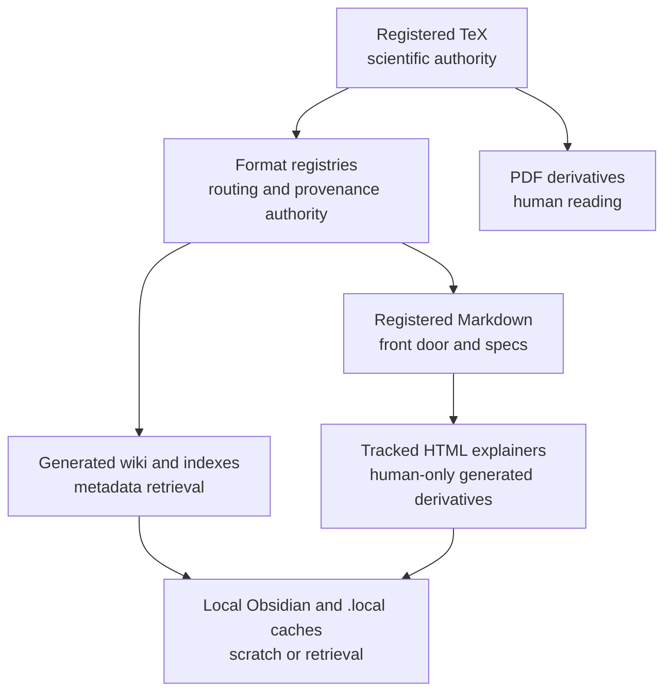
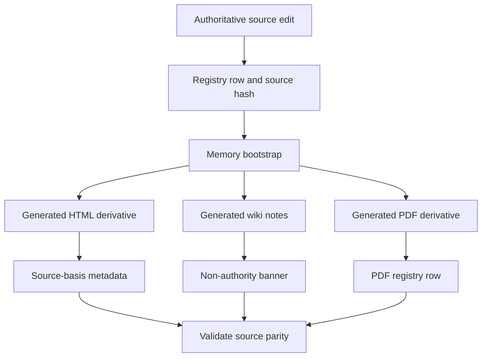

# Source Authority

Source authority decides which files can define project truth and which surfaces are generated aids.

## Source Binding

- **Derived from spec:** `markdown/html-explainer-specs/source-authority-explainer.md`
- **Related HTML:** `html/source-authority-explainer.html`
- **Authority status:** `generated_noncanonical`

## Source-Backed Summary

Source authority is the repository rule for deciding which files can define project truth and which files are generated aids for reading, retrieval, validation, or publication. Its functionality is to rank registered TeX, format-specific registries, registered Markdown, generated HTML, generated wiki notes, PDFs, local Obsidian surfaces, and `.local` caches so contributors update canonical sources first and regenerate dependent artifacts afterward. This matters because many surfaces are polished, searchable, or easier to read than the source files, but convenience does not create independent authority. The model preserves scientific claim discipline, project-control provenance, and reproducible memory refreshes across a repository that intentionally generates many human-facing derivatives.

## What This Feature Does

Source authority ranks repository surfaces by the kind of truth they may define.

## Why The Project Needs It

The project needs it because generated outputs are often easier to read than canonical sources but cannot override them.

## How It Works

Edit registered sources and registries first, regenerate derivatives, refresh hashes and metadata, and run validation before relying on the result.

## What It Is Not

It is not a ban on generated outputs, not a claim that retrieval is useless, and not permission for a readable derivative to replace source authority.

## Diagram Reading Guide

The ladder diagram shows authority descending from TeX and registries into Markdown and generated derivatives. The generation flow shows source edit, registry row, bootstrap, derivative outputs, metadata, and validation.

<!-- mermaid-diagram-id: source-authority-ladder -->

<!-- mermaid-diagram-id: derivative-generation-flow -->

## Source Authority

Authority comes from AGENTS, project-memory-system, and the format registries that record source and generated-output relationships.

## External AI Navigation Card

You are reading a non-authoritative GitHub-facing explainer.

Safe uses:
- summarize the feature for orientation
- identify source files to inspect next
- explain workflow boundaries in plain language

Before modifying project knowledge:
- read `AGENTS.md`
- inspect the relevant registry rows
- inspect the relevant source spec or canonical source file
- route through the correct research-control workflow

Do not:
- do not treat this derivative as physics authority
- do not claim the Æther-flow derivation is complete
- do not treat generated HTML, wiki, PDF, or `.local/` files as independent authority
- do not bypass claim gates, validators, or AgentJob boundaries

## Where To Go Next

- Inspect the relevant registry row before editing.
- Regenerate derivatives after source changes.
- Use memory-system docs for retrieval mechanics.

## All Source Materials

- `README.md`
- `AGENTS.md`
- `.codex/skills/project-memory-system/SKILL.md`
- `.codex/skills/html-visual-explainer/SKILL.md`
- `registries/TEX_SOURCE_REGISTRY.csv`
- `registries/MARKDOWN_SOURCE_REGISTRY.csv`
- `registries/HTML_EXPLAINER_REGISTRY.csv`
- `registries/WIKI_ARTIFACT_REGISTRY.csv`
- `registries/PDF_DERIVATIVE_REGISTRY.csv`
- `registries/FILE_OBJECT_REGISTRY.csv`
- `research_control/design/html_explainer_flexible_presentation_contract.md`
