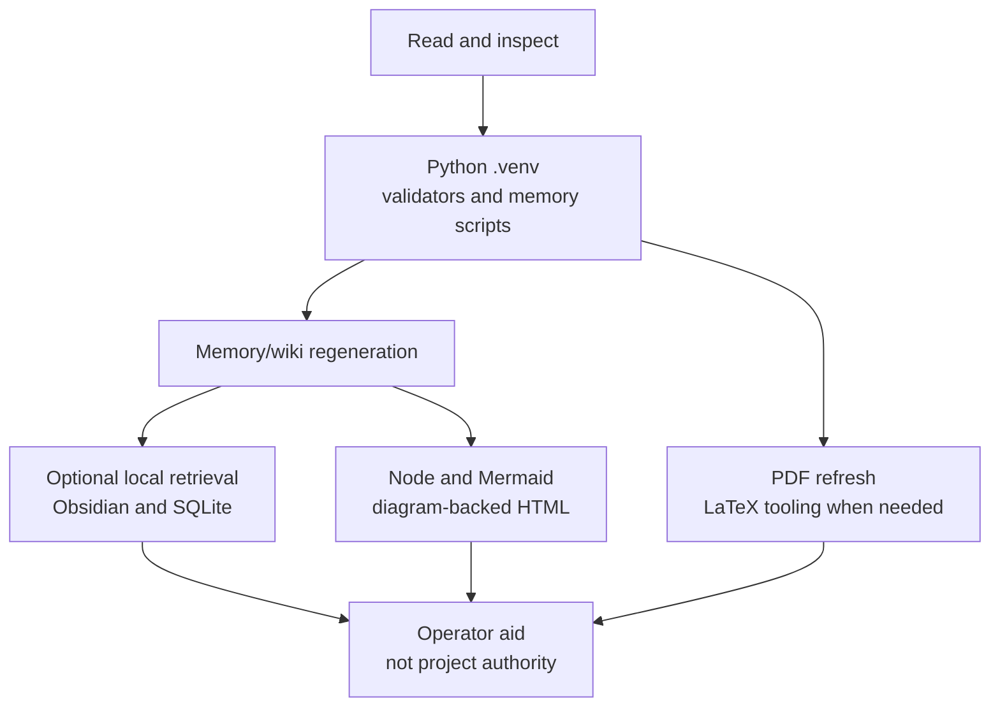

# Technical Requirements

Technical requirements are tiered by task: reading the repo, running validators, regenerating memory, rendering diagrams, using local retrieval, and refreshing PDFs do not require the same tools.

## Source Binding

- **Derived from spec:** `markdown/html-explainer-specs/technical-requirements-explainer.md`
- **Related HTML:** `html/technical-requirements-explainer.html`
- **Authority status:** `generated_noncanonical`

## Requirement Tiers

## Installation Strategy

Not every reader needs every tool. Read-only inspection needs the repository and
normal Markdown rendering. Validation and memory regeneration need the Python
environment. Diagram-backed HTML regeneration needs Node, npm, Mermaid
dependencies, and browser/rendering support. PDF refresh needs LaTeX only when
refreshing PDF derivatives.

Start with the Python environment and `requirements.txt`, because validators
and bootstrap are central to repository consistency. Add diagram, retrieval, or
PDF tooling only for the derivative lane being regenerated. Obsidian and
global Codex plugins are operator aids unless project-local guidance or skill
contracts make them part of a tracked workflow.

## Practical Matrix

| Tier | Needed For | Source Evidence |
| --- | --- | --- |
| Read and inspect | Understanding files and source boundaries | `README.md`, `AGENTS.md` |
| Python validators | Project-control and memory checks | `requirements.txt`, `Makefile` |
| Memory regeneration | Registries, wiki, semantic, and vault refresh | `project-memory-system` skill |
| Mermaid rendering | Governed diagram-backed HTML | Mermaid subskill and package files |
| Local retrieval | Search and local reading aids | `obsidian-wiki` and memory skill |
| PDF refresh | Human-reading PDF derivatives | `pdf-derivative-build` skill |

## Boundary Rule

A tool requirement does not create authority. Python, Node, Mermaid, Obsidian, LaTeX, and plugins are means of inspection or regeneration. Source files, registries, task records, and validators decide whether the result is acceptable.

## For GitHub Readers And AI Agents

You are reading a non-authoritative GitHub-facing explainer.

Safe uses:
- identify which tool tier applies to a task;
- separate project requirements from operator aids;
- find setup and skill-contract sources.

Before modifying project knowledge:
- use the relevant validator or bootstrap command;
- avoid claiming optional local tools are project authority;
- inspect source authority when tool output disagrees with tracked state.

Do not:
- require every reader to install every optional aid;
- treat local retrieval as canonical;
- change dependency policy through explanatory prose.

## All Source Materials

- `README.md`
- `requirements.txt`
- `Makefile`
- `.codex/skills/project-memory-system/SKILL.md`
- `.codex/skills/obsidian-wiki/SKILL.md`
- `.codex/skills/pdf-derivative-build/SKILL.md`
- `.codex/skills/html-visual-explainer/SKILL.md`
- `.codex/skills/visual-explainer/subskills/mermaid-documentation/SKILL.md`
- `.codex/skills/visual-explainer/subskills/mermaid-documentation/scripts/package.json`
- `.codex/skills/visual-explainer/subskills/mermaid-documentation/scripts/package-lock.json`
