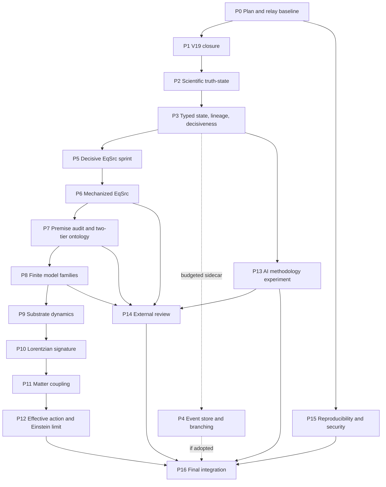

<!-- authority: control -->

# Recommendations Implementation Plan Continue Task v20

```yaml
plan_id: "recommendations_implementation_plan_continue_task-v20"
plan_version: "v20"
status: "draft_control_implementation_plan"
plan_filename: "recommendations_implementation_plan_continue_task-v20.md"
recommended_repo_path: "implementations_plans/recommendations_implementation_plan_continue_task-v20.md"
primary_subject: "scientific_truth_state_decisive_eqsrc_substrate_dynamics_external_validation_and_reproducible_research_control"
implementation_track: "mixed_scientific_program_with_bounded_project_system_sidecars"
primary_controlling_launcher: "continue-research-goal"
generation_worker: "continue-research-continue-goal"
one_packet_research_authority: "continue-research"
intended_executor: "local AI agents operating through fresh file-backed goal relays in the Codex desktop app"
execution_unit: "one v20 plan task equals one immutable continue-research-goal record and one bounded recursive relay"
generation_unit: "exactly one continue-research invocation and at most one outer AgentJob per relay generation"
cross_task_relay_reuse: false
production_profile_requires_exact_user_authorization: true
goal_files_are_tracked_authority: false
plan_is_runtime_authority: false
ordinary_research_handoff_basis: "research_control/handoffs/handoff-0740.yaml"
ordinary_research_route_basis: "EqSrc_family_closure_repair_or_stress"
current_program_state_basis: "research_control/program_state.yaml"
current_v19_sidecar_basis: "research_control/tasks/RT-20260718-008/"
physics_promotion_authorized: false
proof_authority: false
source_law_adoption_authorized: false
canonical_ontology_edit_authorized: false
benchmark_promotion_authorized: false
gate_chair_verdict_authorized: false
completed_derivation_authorized: false
external_outreach_authorized_by_default: false
push_merge_rebase_or_pr_authorized_by_goal_relay: false
phase_count: 17
planned_task_count: 104
recommendation_count: 21
```

## 0. Executive directive

This plan converts the multidisciplinary recommendations from the comprehensive project review into a file-backed, phase-addressable research and engineering program for local AI agents.

The central directive is:

> Complete or freeze the validation sidecar, make the scientific state unambiguous, force the active EqSrc route to a decisive result, expose circular premises, build one actual substrate dynamics model, derive or obstruct Lorentzian geometry, matter coupling, and an effective action, test the AI research method against baselines, obtain independent review, and make every major result reproducible.

The plan is deliberately designed around `continue-research-goal`. It does not treat that skill as a bulk executor. One v20 plan task is one immutable goal record. The relay may use several fresh successor discussions and several `continue-research` passes only while pursuing that exact task. Each generation may invoke `continue-research` exactly once and may execute at most one outer AgentJob. Once the task completion contract is met, the goal must reach `terminal_complete`; unused pass budget may not implement the next task.

A scoped obstruction, minimal countermodel, frozen route, capability block, or protected human-gate result can be a successful research disposition when it satisfies the task's completion contract. Transaction completion never means that a scientific burden was discharged.

## 1. Authority, non-authority, and freshness boundary

### 1.1 Runtime authority

At execution time, agents must read the current tracked contracts in this order:

1. `AGENTS.md`
2. `.codex/skills/continue-research-goal/SKILL.md`
3. `.codex/skills/continue-research-goal/references/goal-file-schema.md`
4. `.codex/skills/continue-research-continue-goal/SKILL.md`
5. `.codex/skills/continue-research/SKILL.md`
6. `research_control/AGENTS.md`
7. Current `research_control/program_state.yaml`, latest handoff, registries, and `continue_research.py` boundary

Those tracked runtime sources govern over this plan whenever they differ. This plan guides task selection, evidence expectations, sequencing, and recommendation coverage. It does not itself authorize a role, AgentJob, tracked write, scientific conclusion, checkpoint, push, external outreach, or protected gate.

### 1.2 Authoring-time source hashes

| Source | Authoring-time Git blob SHA | Use |
| --- | --- | --- |
| `.codex/skills/continue-research-goal/SKILL.md` | `614ea45579ed2977d3ca43b390be6a28e2498fa0` | Launcher contract |
| `.codex/skills/continue-research-goal/references/goal-file-schema.md` | `7f98af6ce76f8098615cfa2e2abe367af9d001d0` | Goal state, receipt, transition, and lease schema |
| `.codex/skills/continue-research-continue-goal/SKILL.md` | `e9bff4c03035e93b27ae564e51c081fdfb5effbf` | One-generation worker and recursion contract |
| `.codex/skills/continue-research/SKILL.md` | `599c1d7828f2a1e205eb7ccf01552f220b2c4561` | One-packet research authority |
| `research_control/program_state.yaml` | `6de3e8b80bc0cc07d278caa4c8d50d332025bab0` | Current scientific anchor at plan authoring |

P0 must re-resolve every path and hash. A changed hash is not automatically a failure, but the task must inspect the changed contract and update the plan backlog or emit a narrow incompatibility finding before any relay launch.

### 1.3 Scientific claim boundary

Nothing in v20 authorizes:

- canonical ontology editing or adoption;
- source-law adoption;
- general EqSrc discharge;
- RetainH or GenH adoption;
- physical manifold or Lorentzian metric authority from source records;
- detector or readout semantics adoption;
- universal coupling-law or matter-coupling adoption;
- stress-energy, matter-action, or Einstein-equation derivation claims beyond exact task evidence;
- exact-GR benchmark promotion or Gate Chair closure;
- external endorsement;
- future source-extension impossibility or program-wide no-go;
- completed substrate derivation; or
- validator, CI, proof-assistant, cache, registry, task, handoff, commit, or goal status as independent physics proof.

Protected conclusions require their current tracked human-gated authority. The goal relay must stop at such a boundary.

## 2. Current state basis and problem statement

At plan authoring, `research_control/program_state.yaml` still names `RT-20260709-006` and `handoff-0740`, with the ordinary scientific next action `EqSrc_family_closure_repair_or_stress`. The v19 project-system sidecar has advanced validation planning, caching, sharding, memory deduplication, and hosted-CI cutover evidence, but its latest recorded substantive disposition retains legacy execution authority because exact-checkpoint hosted evidence was unavailable in the audited task.

The current scientific program has real but scoped results: an exact-GR effective benchmark, typed EqSrc objects, finite countermodels, scoped source-side M_src and g_eff records, finite toy models, certificate-indexed matter evidence, and strong claim controls. It still lacks a minimally complete substrate dynamics, noncircular Lorentzian-signature derivation, universal matter coupling, stress-energy and matter action, a controlled effective action, and an independently validated AI methodology.

V20 addresses both deficits while imposing a hard rule: project-system repair may support science, but it may not become the default scientific route.

## 3. Complete v20 recommendation inventory

| ID | Recommendation | Direct implementation phases |
| --- | --- | --- |
| `V20-R01` | Publish one canonical, machine-readable scientific truth-state that separates object kind, epistemic status, physical status, derivation status, authority scope, premises, consequences, open burdens, and forbidden overreads. | P0, P2, P3, P7, P14, P16 |
| `V20-R02` | Complete or explicitly freeze the remaining v19 validation-orchestration migration, retire recursive infrastructure drift, impose an infrastructure budget, and restore the ordinary EqSrc scientific route. | P0, P1, P16 |
| `V20-R03` | Replace open-ended EqSrc continuation with a bounded decisive sprint that fixes a primitive source theory, classifies assumptions, proves a substantive family result or records a minimal countermodel or primitive-gap verdict, and ends with a terminal route decision. | P0, P3, P5, P16 |
| `V20-R04` | Mechanize the EqSrc mathematical kernel and its countermodels in a proof assistant, with explicit axiom and dependency reports and authority-limited CI integration. | P0, P6, P8, P16 |
| `V20-R05` | Create a premise-output and circularity audit that exposes target-equivalent assumptions in M_src, g_eff, metric-form, signature, continuity, matter, and benchmark-facing constructions. | P0, P2, P5, P6, P7, P8, P9, P10, P11, P12, P16 |
| `V20-R06` | Resolve the manifold-first versus pregeometry-first ambiguity through an explicit two-tier program architecture or a protected alternative decision, with terminology and claim boundaries repaired accordingly. | P0, P2, P7, P16 |
| `V20-R07` | Upgrade the finite toy-response lane from isolated examples to theorem-bearing model families with isomorphism invariance, perturbation behavior, quotient and refinement analysis, countermodels, and continuum or causal-limit criteria. | P0, P8, P16 |
| `V20-R08` | Specify and analyze one minimally complete substrate dynamics model with state space, variables, symmetries, evolution or action, constraints, observables, coarse-graining map, stability analysis, and a decisive result. | P0, P8, P9, P16 |
| `V20-R09` | Treat Lorentzian signature, causal cones, time orientation, local Lorentz behavior, nondegeneracy, and hyperbolicity as explicit theorem or obstruction targets rather than metric-labeled input records. | P0, P7, P8, P9, P10, P16 |
| `V20-R10` | Reframe matter coupling as a full physical dynamics program covering matter-state semantics, readout, universal versus species-dependent coupling, stress-energy or an alternative, backreaction, conservation, anomalies, and radiative stability. | P0, P7, P10, P11, P12, P16 |
| `V20-R11` | Require a controlled effective-action or equivalent variational derivation before any Einstein-equation derivation claim, including higher-curvature corrections, symmetry emergence, conservation, extra modes, constants, and controlled error estimates. | P0, P7, P9, P11, P12, P16 |
| `V20-R12` | Validate the AI research-agent methodology experimentally against human-only, simple-agent, checklist, full-governance, independent-reviewer, and cross-model baselines using blinded expert scoring and cost-adjusted statistics. | P0, P3, P13, P15, P16 |
| `V20-R13` | Normalize candidate lineage with stable candidate and transition identifiers connecting construction, audit, stress, repair, selector, gate, adoption, rejection, freeze, and supersession records. | P0, P3, P4, P13, P16 |
| `V20-R14` | Replace overloaded task completion status with a typed transaction, disposition, epistemic, burden-effect, authority, and terminal-state model; distinguish completed transactions from solved scientific burdens. | P0, P2, P3, P13, P16 |
| `V20-R15` | Refactor registries toward an append-only typed event store or equivalently transactional canonical representation with deterministic CSV, Markdown, graph, and dashboard materializations. | P0, P4, P16 |
| `V20-R16` | Support bounded scientific branching and later synthesis while preserving one live relay and one AgentJob per generation, explicit branch budgets, conflict review, and fail-closed authority boundaries. | P0, P1, P4, P7, P16 |
| `V20-R17` | Compress repeated claim boundaries through versioned hashed profiles plus task-local deltas, while rendering the positive result, exact scope, unresolved burden, and prohibited overreads in that order. | P0, P2, P3, P7, P16 |
| `V20-R18` | Add a scientific novelty and decisiveness gate requiring each physics-bearing task to identify new content, reduced uncertainty, assumption changes, generality, independent checkability, and a terminal decision consequence. | P0, P1, P3, P5, P6, P7, P8, P9, P10, P11, P12, P13, P14, P16 |
| `V20-R19` | Establish genuine external review, response intake, issue disposition, independent replication, and public response procedures for the highest-value mathematical and physical claims. | P0, P2, P6, P12, P13, P14, P16 |
| `V20-R20` | Build a full reproducibility capsule covering repository state, sources, dependencies, operating environment, models, prompts, retrieval, tools, randomization, human decisions, artifacts, validators, runtime, and known nondeterminism. | P0, P1, P4, P6, P8, P9, P10, P11, P12, P13, P14, P15, P16 |
| `V20-R21` | Harden software supply-chain and release security with pinned workflow actions, dependency scanning, secret scanning, SBOMs, attestations, least privilege, protected branches, signed releases, and bounded security red-team checks. | P0, P1, P4, P6, P14, P15, P16 |

## 4. Program-level success criteria

V20 is complete only when all of the following are true:

1. Every required plan task has a terminal disposition, canonical evidence, validation result, checkpoint outcome when state changed, and recommendation coverage row.
2. V19 is either planner-authoritative with legacy command ownership retired or explicitly frozen with legacy authority retained. No open v19 recursive relay remains.
3. One canonical scientific truth-state renders exact benchmark adoption separately from substrate derivation.
4. The EqSrc sprint ends in a theorem, countermodel, primitive-gap, scoped-obstruction, freeze, or protected human question. Generic continuation is not an allowed terminal.
5. The EqSrc mathematical kernel and selected countermodels are mechanized or a capability block is precisely recorded.
6. M_src, g_eff, matter, and benchmark-facing premises have derivation-debt rows and target-equivalent assumptions are visible.
7. The manifold-first and pregeometry-first programs are separated or an explicit protected alternative has been chosen.
8. The finite-model lane yields at least one family theorem or a precise family-level obstruction.
9. One minimally complete substrate dynamics model has a decisive viability or obstruction result.
10. Lorentzian signature, matter coupling, and effective action each have terminal scoped results, even when negative.
11. The AI methodology has a preregistered baseline comparison, blinded scoring, analysis, and at least one replication attempt.
12. External review has been genuinely attempted after human authorization, and responses or capability limits are preserved.
13. Major results have reproducibility capsules and a bounded security baseline.
14. The final truth-state, ledgers, lineages, registries, branch records, public status, and generated surfaces agree.
15. Exactly one next ordinary research route or protected human boundary is recorded.

## 5. Continue-research-goal execution model

### 5.1 One plan task, one goal record

For every task `P<phase>-T<task>`:

- launch a new `$continue-research-goal` request;
- use the exact goal text supplied by the task card or an explicitly user-authorized equivalent that does not broaden the task;
- set the task's declared `max_continue_passes` and `max_elapsed_minutes`;
- use the production profile only after the user explicitly authorizes that exact goal and guards;
- bind to the clean validated non-main `codex/*` branch resolved by the tracked skill;
- let each successor frame invoke `$continue-research` exactly once;
- permit multiple `RT-*` transactions only when they all implement the same v20 plan task and the goal remains unmet;
- terminalize when the task is complete, blocked, repeated, human-gated, validation-failed, capability-blocked, or guard-exhausted; and
- create a new goal record for the next v20 task.

### 5.2 Operator launch shape

The user or operator should issue a fresh request in this shape:

```yaml
use_skill: "$continue-research-goal"
goal: |-
  <copy the exact goal text from the selected task card>
max_continue_passes: <task value>
max_elapsed_minutes: <task value>
```

The launcher itself performs no research. It creates the ignored goal record, dispatches one fresh worker discussion, records the successor, and stops. The worker claims one generation, consumes one at-most-once invocation, calls `$continue-research`, verifies canonical state, and either terminalizes or dispatches one successor.

### 5.3 Fixed relay guards

All v20 relays inherit the current fixed guards:

```yaml
max_repeated_state_fingerprints: 1
max_live_continuations: 1
handoff_ready_timeout_seconds: 60
stop_on_human_gate: true
stop_on_validation_failure: true
stop_on_checkpoint_failure: true
stop_on_unexpected_dirty_state: true
stop_on_no_progress: true
stop_on_repeated_state: true
stop_on_capability_loss: true
stop_on_branch_or_repository_mismatch: true
```

No task may weaken these guards. A guard amendment may extend only pass count or deadline through the current append-only human-authorized mechanism.

### 5.4 Task-boundary invariant

A relay is forbidden to continue into another plan task. When `P5-T02` is complete, for example, the generation must finalize the `P5-T02` receipt and reach a terminal state. It may not spend a remaining pass on `P5-T03`. A later task uses a new immutable goal, new goal hash, new completion contract, and new generation sequence.

### 5.5 Valid negative completion

For scientific tasks, the following can satisfy the completion contract when supported by new canonical evidence:

- theorem or lemma under exact assumptions;
- explicit construction or witness;
- minimal countermodel;
- independence result;
- precise primitive gap;
- scoped obstruction;
- fatal instability or inconsistency;
- route freeze under named assumptions;
- capability block; or
- protected human-gate requirement.

A generic `continue research`, `more work needed`, validator PASS, or new wrapper without new mathematical content cannot satisfy a physics task.

## 6. Human and external action boundaries

| Boundary ID | Trigger | Relay behavior | Required external action | Lawful resumption |
| --- | --- | --- | --- | --- |
| `HG20-01` | Production relay authorization | Launcher stops before initialization when absent | User authorizes exact goal, budgets, branch, and production profile | New launcher request |
| `HG20-02` | Branch publication or hosted workflow evidence | P1 packet terminalizes; relay never pushes or dispatches unauthorized workflow | Human or separately authorized tool publishes exact checkpoint and obtains hosted evidence | New P1-T03 goal |
| `HG20-03` | Canonical ontology, source-law, metric, matter, Einstein, benchmark, or Gate Chair authority | Worker terminalizes `terminal_awaiting_human` | Protected human decision under current project rules | New post-decision integration goal or explicit recovery when lawful |
| `HG20-04` | External reviewer outreach | P14 packet terminalizes | Human authorizes and performs outreach | New response-intake goal after evidence exists |
| `HG20-05` | Named reviewer scoring or replication | Relay records missing human evidence and stops | Qualified reviewer performs scoring or replication | New analysis goal |
| `HG20-06` | Push, merge, rebase, PR, signed tag, or public release | Relay does not perform the action | Human or separately authorized release workflow acts | New read-only verification goal |

The plan must never represent a prepared packet as the external action itself.

## 7. Global execution rules

### 7.1 Memory and source inspection

Every generation that reaches research execution must:

1. run `continue_research_memory_preflight.py --json`;
2. read the compact continuation summary;
3. perform at least one targeted memory query;
4. inspect every canonical source that materially influences routing or claims;
5. record source object IDs, registries, paths, and hashes; and
6. keep retrieval layers nonauthoritative.

### 7.2 One outer AgentJob per generation

Each relay generation may execute zero or one outer AgentJob. Physics AgentJobs use `parent_child_parallel_synthesis` under the current contract. Parent and children share one role authority, allowlist, claim boundary, validators, and stop conditions. Child outputs are support drafts. The fused artifact is the downstream result.

### 7.3 Role selection

Task cards list expected role families for planning and source inspection. They do not preselect runtime authority. The Director must choose or overlay the narrowest current registered role that fits the immediate packet. New permanent roles require the project-system and human-authorized registration path.

### 7.4 Scientific payload and decisiveness

Every physics-bearing completion must include:

```yaml
target_derivation_milestone: <current burden-map milestone>
milestone_burden: <exact task-local burden>
physics_progress_status:
distance_to_gr_delta:
distance_to_gr_status:
new_mathematical_payload:
mathematical_payload_manifest:
scientific_novelty:
candidate_lineage:
forbidden_conclusion_summary:
```

Constructor, Refuter, Selector, source-extension, and finite-model tasks must also satisfy their current role-specific decisive fields.

### 7.5 Project-system budget

After P1, project-system work is a capped sidecar. The P4 registry architecture and later security work may proceed only under the infrastructure budget adopted in P1-T05. A concrete integrity, reproducibility, or security blocker may justify an exception. Convenience, polish, or possible speed improvement does not.

### 7.6 Validation and checkpoint

Use the current shared validation profile and executor authority. During a legacy or shadow epoch, legacy execution remains authoritative. After an evidenced cutover, planner execution governs. A profile plan is selection evidence only, not validation.

State-changing tasks must satisfy applicable obligations, including:

- `memory_sync` when affected;
- `memory_core`;
- documentation impact;
- project-improvement signal validation when emitted;
- research-control diff and claim-language checks;
- task-selected tests and scientific support checks;
- `git diff --check`;
- final staged residue and allowlist;
- checkpoint commit; and
- exact tree and receipt hashes.

Push is never implied by checkpoint success.

### 7.7 Completion and handoff

Each task completion must record:

```yaml
implementation_plan_receipt:
  plan_id: "recommendations_implementation_plan_continue_task-v20"
  plan_path: "implementations_plans/recommendations_implementation_plan_continue_task-v20.md"
  plan_task_id: "P<phase>-T<task>"
  recommendation_ids: ["V20-Rnn"]
goal_relay_receipt:
  goal_id: string
  goal_sha256: string
  generation_count: integer
  passes_consumed: integer
  terminal_phase: string
  terminal_reason: string
  initial_fingerprint: string
  final_fingerprint: string
  finalized_step_receipt_hashes: [string]
transaction_status:
result_disposition:
epistemic_status:
burden_effect:
authority_status:
validation_evidence:
checkpoint_evidence:
recommendation_coverage:
remaining_work:
next_route:
```

The completion must report substantive work first and orchestration telemetry second.

## 8. Phase map and execution topology

| Phase | Title | Tasks | Primary recommendation families | Exit dependency |
| --- | --- | ---: | --- | --- |
| `P0` | Plan registration, relay governance, backlog, and baseline | 4 | `V20-R01`, `V20-R02`, `V20-R03`, `V20-R04`, `V20-R05`, `V20-R06`, `V20-R07`, `V20-R08`, `V20-R09`, `V20-R10`, `V20-R11`, `V20-R12`, `V20-R13`, `V20-R14`, `V20-R15`, `V20-R16`, `V20-R17`, `V20-R18`, `V20-R19`, `V20-R20`, `V20-R21` | Plan start |
| `P1` | V19 closure, validation cutover decision, infrastructure freeze, and science-route restoration | 5 | `V20-R02`, `V20-R20`, `V20-R21`, `V20-R16`, `V20-R18` | `P0` |
| `P2` | Canonical scientific truth-state and public epistemic clarity | 5 | `V20-R01`, `V20-R14`, `V20-R17`, `V20-R05`, `V20-R06`, `V20-R19` | `P1` |
| `P3` | Typed transaction semantics, candidate lineage, claim profiles, and scientific decisiveness | 6 | `V20-R14`, `V20-R13`, `V20-R12`, `V20-R01`, `V20-R17`, `V20-R03`, `V20-R18` | `P2` |
| `P4` | Append-only registry architecture and bounded scientific branching sidecar | 6 | `V20-R15`, `V20-R16`, `V20-R13`, `V20-R20`, `V20-R21` | `P3` |
| `P5` | Decisive EqSrc family-closure research sprint | 5 | `V20-R03`, `V20-R05`, `V20-R18` | `P1`, `P3` |
| `P6` | Mechanized EqSrc kernel and assumption reporting | 4 | `V20-R04`, `V20-R20`, `V20-R18`, `V20-R21`, `V20-R05`, `V20-R19` | `P5` |
| `P7` | Premise-output circularity audit and two-tier ontology program | 7 | `V20-R05`, `V20-R06`, `V20-R18`, `V20-R09`, `V20-R10`, `V20-R11`, `V20-R16`, `V20-R01`, `V20-R17` | `P6` |
| `P8` | Finite source-model families, invariance, perturbation, and scaling | 7 | `V20-R07`, `V20-R18`, `V20-R09`, `V20-R04`, `V20-R20`, `V20-R05`, `V20-R08` | `P7` |
| `P9` | Minimally complete substrate dynamics model | 8 | `V20-R08`, `V20-R18`, `V20-R11`, `V20-R09`, `V20-R20`, `V20-R05` | `P8` |
| `P10` | Lorentzian signature, causal structure, and local relativistic behavior | 6 | `V20-R09`, `V20-R18`, `V20-R20`, `V20-R10`, `V20-R05` | `P9` |
| `P11` | Matter-state semantics, universal coupling, stress-energy, action, and backreaction | 8 | `V20-R10`, `V20-R18`, `V20-R11`, `V20-R20`, `V20-R05` | `P10` |
| `P12` | Effective action, Einstein limit, corrections, and controlled derivation claim | 9 | `V20-R11`, `V20-R18`, `V20-R10`, `V20-R20`, `V20-R19`, `V20-R05` | `P11` |
| `P13` | Experimental validation of the AI research-agent methodology | 7 | `V20-R12`, `V20-R18`, `V20-R20`, `V20-R19`, `V20-R13`, `V20-R14` | `P3` |
| `P14` | External mathematical, physical, philosophical, and AI-science review | 6 | `V20-R19`, `V20-R20`, `V20-R21`, `V20-R18`, `V20-R01` | `P13`, `P6`, `P7`, `P8` |
| `P15` | Reproducibility capsules, execution identity, software supply chain, and secure release | 6 | `V20-R20`, `V20-R21`, `V20-R12` | `P0` |
| `P16` | Final integration, recommendation coverage, scientific disposition, and route handoff | 5 | `V20-R01`, `V20-R05`, `V20-R06`, `V20-R13`, `V20-R14`, `V20-R15`, `V20-R16`, `V20-R17`, `V20-R02`, `V20-R04`, `V20-R20`, `V20-R21`, `V20-R03`, `V20-R07`, `V20-R08`, `V20-R09`, `V20-R10`, `V20-R11`, `V20-R12`, `V20-R18`, `V20-R19` | `P12`, `P13`, `P14`, `P15` |



P4 is not a prerequisite for P5. It is a budgeted project-system sidecar. The global relay lease still permits only one live continuation in the bound worktree, so branch execution is serially interleaved even when the tracked scientific graph has several queued branches.

## 9. Standard task-card interpretation

Each task below includes a copyable launch packet. The `goal` text is the recommended exact user objective. The operator may not broaden it without creating a new goal. `Expected role families` are planning hints only. `Required durable outputs` list task-specific artifacts in addition to standard task, DDR, AgentJob, execution-role, completion, documentation-impact, handoff, registry, and generated-derivative records.

For all state-changing tasks, rollback means: stage nothing and commit nothing on failure; preserve the working evidence; restore the entry index when the checkpoint contract requires it; and route one narrow repair only when a new actionable defect exists.

## P0. Plan registration, relay governance, backlog, and baseline

**Purpose:** Register v20 as a tracked control plan, materialize a machine-readable backlog, define the exact continue-research-goal task boundary, and capture the state from which every later recommendation will be judged.

**Phase exit contract:** The plan and backlog are registered, every task is dependency-addressable, the relay policy is validated against the tracked skills, and a reproducible baseline records active scientific and project-system state without changing physics.

**Planned task count:** 4

### P0-T01: Register the v20 plan and preserve its non-authority boundary

```yaml
plan_task_id: "P0-T01"
phase_id: "P0"
task_kind: "project"
recommendation_ids:
  - "V20-R01"
  - "V20-R02"
  - "V20-R03"
  - "V20-R04"
  - "V20-R05"
  - "V20-R06"
  - "V20-R07"
  - "V20-R08"
  - "V20-R09"
  - "V20-R10"
  - "V20-R11"
  - "V20-R12"
  - "V20-R13"
  - "V20-R14"
  - "V20-R15"
  - "V20-R16"
  - "V20-R17"
  - "V20-R18"
  - "V20-R19"
  - "V20-R20"
  - "V20-R21"
expected_role_families:
  - "project-control-maintainer@0.2.0"
  - "process-integrity-auditor@0.1.0"
controlling_launcher: "continue-research-goal"
generation_worker: "continue-research-continue-goal"
research_authority_per_generation: "continue-research"
execution_profile: "production_profile after exact user authorization"
max_continue_passes: 3
max_elapsed_minutes: 180
max_live_continuations: 1
max_outer_agentjobs_per_generation: 1
cross_task_relay_reuse: false
requires_human_gate: false
conditional_task: false
state_changing_expected: true
target_derivation_milestone: "none"
depends_on:
  - none
```

#### Copyable continue-research-goal launch packet

```yaml
use_skill: "$continue-research-goal"
goal: |-
  Implement v20 plan task P0-T01: Register the v20 plan and preserve its non-authority boundary. Track this Markdown source at the requested repository path, register its source identity, and state that it guides planning but does not replace the runtime contracts of continue-research-goal, continue-research-continue-goal, continue-research, tracked DDRs, AgentJobs, validators, checkpoints, or protected human authority. Remain strictly inside plan task P0-T01 even if multiple fresh continue-research passes or multiple tracked RT transactions are required. Use current tracked research-control authority, execute at most one outer AgentJob per relay generation, preserve all human gates and claim boundaries, and terminalize before any other v20 task. Success requires canonical evidence that: The requested file exists at implementations_plans/recommendations_implementation_plan_continue_task-v20.md and has one canonical source row.; All V20-R01 through V20-R21 IDs occur in the recommendation inventory and coverage table.; The completion states that goal files and implementation plans are orchestration or planning surfaces, not scientific authority.. A precise obstruction, freeze, capability block, or protected human-gate result is acceptable only when it is the honest terminal disposition defined by this task.
max_continue_passes: 3
max_elapsed_minutes: 180
```

The goal text above is a task objective, not role or write authority. The launcher and worker must derive authority from current tracked state. The relay must stop when this task is complete and must not advance to another v20 task.

#### Objective

Track this Markdown source at the requested repository path, register its source identity, and state that it guides planning but does not replace the runtime contracts of continue-research-goal, continue-research-continue-goal, continue-research, tracked DDRs, AgentJobs, validators, checkpoints, or protected human authority.

#### Preconditions and dependency evidence

- P0 plan registration is the root dependency.
- The selected production worktree, branch, HEAD, saved-project identity, goal lease, and repository fingerprint must satisfy the current relay preflight.
- The active Director context must permit this plan task or record a narrow superseding decision.
- The working tree must be clean or contain only the exact authorized transaction state.
- Any human or external evidence named by this task must already exist before a post-human relay begins.

#### Required source inspection

- AGENTS.md
- `research_control/AGENTS.md`
- `.codex/skills/continue-research-goal/SKILL.md`
- `.codex/skills/continue-research-continue-goal/SKILL.md`
- `.codex/skills/continue-research/SKILL.md`
- `research_control/program_state.yaml`
- the latest tracked handoff pair
- the current task, DDR, AgentJob, execution-role, completion, and relevant registry rows
- `implementations_plans/recommendations_implementation_plan_continue_task-v20.md`
- current project-system sidecar and validation authority files relevant to the changed paths
- Every task-specific predecessor artifact, countermodel, audit, stress result, selector, and protected decision cited by the Director.

#### Planned write boundary

- Task-local durable artifact named `v20_plan_registration_report.json` under the active `research_control/tasks/<task-id>/artifacts/` directory, unless an explicit repository path is shown.
- Task-local durable artifact named `v20_plan_source_hash_receipt.json` under the active `research_control/tasks/<task-id>/artifacts/` directory, unless an explicit repository path is shown.
- Standard task, DDR, AgentJob, execution-role, completion, documentation-impact, handoff, applicable registry, and authorized generated-derivative records.
- No path outside the active AgentJob allowlist. A newly discovered required path needs a tracked repair or supersession decision.
- Canonical science TeX and scientific status are outside scope unless this card explicitly says otherwise.

#### Implementation actions

1. Verify filename, plan ID, version, authority marker, source path, recommendation inventory, and phase/task identifiers.
2. Create or update the canonical Markdown source registry row and only the generated derivatives required by repository policy.
3. Record the exact source hashes of the relay skill, worker skill, schema, continue-research skill, current program state, handoff-0740, v19 plan, and latest v19 sidecar completion.
4. Validate that the plan never grants push, merge, Gate Chair, ontology-adoption, benchmark, proof, or physics-promotion authority.
5. Checkpoint only the bounded registration transaction.
6. Record recommendation coverage for V20-R01, V20-R02, V20-R03, V20-R04, V20-R05, V20-R06, V20-R07, V20-R08, V20-R09, V20-R10, V20-R11, V20-R12, V20-R13, V20-R14, V20-R15, V20-R16, V20-R17, V20-R18, V20-R19, V20-R20, V20-R21, including direct, support, validation, negative-result, conditional, or deferred effect.
7. Verify canonical progress after every generation; worker prose is telemetry only.
8. Terminalize the goal when the task completion contract is met or a deterministic stop applies.

#### Required durable outputs

- `v20_plan_registration_report.json`
- `v20_plan_source_hash_receipt.json`
- Task completion receipt with goal, generation, canonical fingerprint, validator, checkpoint, and next-route evidence.
- Updated recommendation coverage and typed transaction/result fields.
- Explicit `no_distance_delta`, `scientific_claims_changed: false`, and project-system authority boundary.

#### Required validation and canonical evidence

- Memory preflight PASS with targeted retrieval query and direct canonical source inspection.
- Current `continue_research.py --summary` boundary agrees with the active task and latest handoff.
- Task-local artifact schema, syntax, source-hash, and semantic checks PASS.
- Documentation impact and project-improvement signal obligations are resolved.
- No canonical physics source or scientific status changes unless the task explicitly and lawfully authorizes that surface.
- Affected validation or the current authoritative compatibility path PASSes with compact receipt path and hash recorded.
- `git diff --check`, write-path allowlist, final staged residue, and exact-tree checks PASS.
- The governed checkpoint succeeds and records the exact commit without push.

#### Definition of done

- The requested file exists at implementations_plans/recommendations_implementation_plan_continue_task-v20.md and has one canonical source row.
- All V20-R01 through V20-R21 IDs occur in the recommendation inventory and coverage table.
- The completion states that goal files and implementation plans are orchestration or planning surfaces, not scientific authority.
- The ordinary research route remains EqSrc_family_closure_repair_or_stress and no Distance-to-GR row changes.
- No unrelated tracked change remains.
- The goal record has one legal terminal state, every consumed generation has one finalized receipt or explicit recovery evidence, and no successor remains ambiguous.

#### Required completion fields

```yaml
plan_id: "recommendations_implementation_plan_continue_task-v20"
plan_task_id: "P0-T01"
recommendation_ids: ["V20-R01", "V20-R02", "V20-R03", "V20-R04", "V20-R05", "V20-R06", "V20-R07", "V20-R08", "V20-R09", "V20-R10", "V20-R11", "V20-R12", "V20-R13", "V20-R14", "V20-R15", "V20-R16", "V20-R17", "V20-R18", "V20-R19", "V20-R20", "V20-R21"]
goal_id: "<recorded goal id>"
goal_sha256: "<immutable goal hash>"
passes_consumed: "<integer>"
terminal_phase: "<terminal_complete or mapped protected terminal>"
transaction_status: "<typed transaction state>"
result_disposition: "<typed result>"
epistemic_status: "<typed status>"
burden_effect: "<typed effect>"
validation_status: "<PASS or exact non-PASS>"
checkpoint_commit: "<sha or empty for valid no-commit result>"
project_system_change_only: true
scientific_claims_changed: false
distance_to_gr_delta.changed: false
new_mathematical_payload: []
recommendation_coverage:
  implementation_status: "completed | blocked | frozen | deferred | superseded | conditionally_not_required"
  coverage_effect: "direct | support | validation | audit | negative_result | migration | documentation | external"
remaining_work: [string]
next_route: string
```

#### Stop, repair, rollback, and guard conditions

- Stop if registration requires editing canonical physics TeX or changing handoff-0740.
- Stop on any source-hash, registry, generated-derivative, write-allowlist, or checkpoint mismatch.
- Stop on human gate, validation or checkpoint failure, unexpected dirty state, repeated or unchanged canonical fingerprint, capability loss, branch or repository mismatch, lease conflict, corrupt goal state, no progress, pass exhaustion, or elapsed deadline.
- A repair pass is lawful only when it addresses a new actionable defect within the same plan task. Repeating the same missing burden or same finding set triggers `terminal_no_progress` or `terminal_guard_exhausted`.
- Never steal an expired lease, hand-edit goal state, rerun a consumed generation, retry an ambiguous successor creation, or delete runtime evidence.

#### Handoff rule

- On PASS, launch P0-T02 as a new goal relay; never continue into it with unused passes.
- Report the substantive result before relay telemetry.
- A new v20 task always starts through a new explicitly authorized `$continue-research-goal` request.

### P0-T02: Materialize the v20 recommendation backlog and dependency DAG

```yaml
plan_task_id: "P0-T02"
phase_id: "P0"
task_kind: "project"
recommendation_ids:
  - "V20-R01"
  - "V20-R02"
  - "V20-R03"
  - "V20-R04"
  - "V20-R05"
  - "V20-R06"
  - "V20-R07"
  - "V20-R08"
  - "V20-R09"
  - "V20-R10"
  - "V20-R11"
  - "V20-R12"
  - "V20-R13"
  - "V20-R14"
  - "V20-R15"
  - "V20-R16"
  - "V20-R17"
  - "V20-R18"
  - "V20-R19"
  - "V20-R20"
  - "V20-R21"
expected_role_families:
  - "project-control-maintainer@0.2.0"
  - "validator-engineer@0.2.0"
controlling_launcher: "continue-research-goal"
generation_worker: "continue-research-continue-goal"
research_authority_per_generation: "continue-research"
execution_profile: "production_profile after exact user authorization"
max_continue_passes: 4
max_elapsed_minutes: 240
max_live_continuations: 1
max_outer_agentjobs_per_generation: 1
cross_task_relay_reuse: false
requires_human_gate: false
conditional_task: false
state_changing_expected: true
target_derivation_milestone: "none"
depends_on:
  - "P0-T01"
```

#### Copyable continue-research-goal launch packet

```yaml
use_skill: "$continue-research-goal"
goal: |-
  Implement v20 plan task P0-T02: Materialize the v20 recommendation backlog and dependency DAG. Create a typed backlog and dependency graph containing every phase, task, recommendation mapping, relay budget, role expectation, source and write boundary, validator obligation, terminal outcome, rollback rule, human intervention boundary, and next-task rule. Remain strictly inside plan task P0-T02 even if multiple fresh continue-research passes or multiple tracked RT transactions are required. Use current tracked research-control authority, execute at most one outer AgentJob per relay generation, preserve all human gates and claim boundaries, and terminalize before any other v20 task. Success requires canonical evidence that: The backlog validates with no duplicate, dangling, cyclic, or unreachable required task.; Every recommendation has direct implementation tasks and final audit coverage.; Every task declares one exact goal relay boundary and prohibits crossing to another v20 task.. A precise obstruction, freeze, capability block, or protected human-gate result is acceptable only when it is the honest terminal disposition defined by this task.
max_continue_passes: 4
max_elapsed_minutes: 240
```

The goal text above is a task objective, not role or write authority. The launcher and worker must derive authority from current tracked state. The relay must stop when this task is complete and must not advance to another v20 task.

#### Objective

Create a typed backlog and dependency graph containing every phase, task, recommendation mapping, relay budget, role expectation, source and write boundary, validator obligation, terminal outcome, rollback rule, human intervention boundary, and next-task rule.

#### Preconditions and dependency evidence

Every dependency must have a PASS or valid terminal completion, or a tracked supersession that preserves this task's acceptance criteria:

- `P0-T01`
- The selected production worktree, branch, HEAD, saved-project identity, goal lease, and repository fingerprint must satisfy the current relay preflight.
- The active Director context must permit this plan task or record a narrow superseding decision.
- The working tree must be clean or contain only the exact authorized transaction state.
- Any human or external evidence named by this task must already exist before a post-human relay begins.

#### Required source inspection

- AGENTS.md
- `research_control/AGENTS.md`
- `.codex/skills/continue-research-goal/SKILL.md`
- `.codex/skills/continue-research-continue-goal/SKILL.md`
- `.codex/skills/continue-research/SKILL.md`
- `research_control/program_state.yaml`
- the latest tracked handoff pair
- the current task, DDR, AgentJob, execution-role, completion, and relevant registry rows
- `implementations_plans/recommendations_implementation_plan_continue_task-v20.md`
- current project-system sidecar and validation authority files relevant to the changed paths
- Every task-specific predecessor artifact, countermodel, audit, stress result, selector, and protected decision cited by the Director.

#### Planned write boundary

- Task-local durable artifact named `v20_recommendation_backlog.yaml` under the active `research_control/tasks/<task-id>/artifacts/` directory, unless an explicit repository path is shown.
- Task-local durable artifact named `v20_recommendation_backlog_schema.md` under the active `research_control/tasks/<task-id>/artifacts/` directory, unless an explicit repository path is shown.
- Task-local durable artifact named `v20_backlog_dependency_report.json` under the active `research_control/tasks/<task-id>/artifacts/` directory, unless an explicit repository path is shown.
- Standard task, DDR, AgentJob, execution-role, completion, documentation-impact, handoff, applicable registry, and authorized generated-derivative records.
- No path outside the active AgentJob allowlist. A newly discovered required path needs a tracked repair or supersession decision.
- Canonical science TeX and scientific status are outside scope unless this card explicitly says otherwise.

#### Implementation actions

1. Define fields for plan task identity, dependencies, recommendation IDs, task kind, expected role families, goal text hash, pass and elapsed guards, target milestone, burden, artifacts, validators, completion states, and conditionality.
2. Materialize every task exactly once and reject duplicate IDs, cycles, orphan tasks, unregistered recommendation IDs, empty completion criteria, or missing relay guards.
3. Represent branch points, human action boundaries, optional repairs, and negative scientific outcomes explicitly.
4. Generate a deterministic topological ordering and recommendation-to-task coverage matrix.
5. Add focused schema and graph tests.
6. Record recommendation coverage for V20-R01, V20-R02, V20-R03, V20-R04, V20-R05, V20-R06, V20-R07, V20-R08, V20-R09, V20-R10, V20-R11, V20-R12, V20-R13, V20-R14, V20-R15, V20-R16, V20-R17, V20-R18, V20-R19, V20-R20, V20-R21, including direct, support, validation, negative-result, conditional, or deferred effect.
7. Verify canonical progress after every generation; worker prose is telemetry only.
8. Terminalize the goal when the task completion contract is met or a deterministic stop applies.

#### Required durable outputs

- `v20_recommendation_backlog.yaml`
- `v20_recommendation_backlog_schema.md`
- `v20_backlog_dependency_report.json`
- Task completion receipt with goal, generation, canonical fingerprint, validator, checkpoint, and next-route evidence.
- Updated recommendation coverage and typed transaction/result fields.
- Explicit `no_distance_delta`, `scientific_claims_changed: false`, and project-system authority boundary.

#### Required validation and canonical evidence

- Memory preflight PASS with targeted retrieval query and direct canonical source inspection.
- Current `continue_research.py --summary` boundary agrees with the active task and latest handoff.
- Task-local artifact schema, syntax, source-hash, and semantic checks PASS.
- Documentation impact and project-improvement signal obligations are resolved.
- No canonical physics source or scientific status changes unless the task explicitly and lawfully authorizes that surface.
- Affected validation or the current authoritative compatibility path PASSes with compact receipt path and hash recorded.
- `git diff --check`, write-path allowlist, final staged residue, and exact-tree checks PASS.
- The governed checkpoint succeeds and records the exact commit without push.

#### Definition of done

- The backlog validates with no duplicate, dangling, cyclic, or unreachable required task.
- Every recommendation has direct implementation tasks and final audit coverage.
- Every task declares one exact goal relay boundary and prohibits crossing to another v20 task.
- Human actions outside the relay are represented as preconditions rather than AI authority.
- No unrelated tracked change remains.
- The goal record has one legal terminal state, every consumed generation has one finalized receipt or explicit recovery evidence, and no successor remains ambiguous.

#### Required completion fields

```yaml
plan_id: "recommendations_implementation_plan_continue_task-v20"
plan_task_id: "P0-T02"
recommendation_ids: ["V20-R01", "V20-R02", "V20-R03", "V20-R04", "V20-R05", "V20-R06", "V20-R07", "V20-R08", "V20-R09", "V20-R10", "V20-R11", "V20-R12", "V20-R13", "V20-R14", "V20-R15", "V20-R16", "V20-R17", "V20-R18", "V20-R19", "V20-R20", "V20-R21"]
goal_id: "<recorded goal id>"
goal_sha256: "<immutable goal hash>"
passes_consumed: "<integer>"
terminal_phase: "<terminal_complete or mapped protected terminal>"
transaction_status: "<typed transaction state>"
result_disposition: "<typed result>"
epistemic_status: "<typed status>"
burden_effect: "<typed effect>"
validation_status: "<PASS or exact non-PASS>"
checkpoint_commit: "<sha or empty for valid no-commit result>"
project_system_change_only: true
scientific_claims_changed: false
distance_to_gr_delta.changed: false
new_mathematical_payload: []
recommendation_coverage:
  implementation_status: "completed | blocked | frozen | deferred | superseded | conditionally_not_required"
  coverage_effect: "direct | support | validation | audit | negative_result | migration | documentation | external"
remaining_work: [string]
next_route: string
```

#### Stop, repair, rollback, and guard conditions

- Stop if the backlog cannot represent a valid negative or frozen scientific result without falsely marking the burden solved.
- Stop if any task implies more than one live continuation or more than one outer AgentJob per generation.
- Stop on human gate, validation or checkpoint failure, unexpected dirty state, repeated or unchanged canonical fingerprint, capability loss, branch or repository mismatch, lease conflict, corrupt goal state, no progress, pass exhaustion, or elapsed deadline.
- A repair pass is lawful only when it addresses a new actionable defect within the same plan task. Repeating the same missing burden or same finding set triggers `terminal_no_progress` or `terminal_guard_exhausted`.
- Never steal an expired lease, hand-edit goal state, rerun a consumed generation, retry an ambiguous successor creation, or delete runtime evidence.

#### Handoff rule

- On PASS, launch P0-T03.
- Report the substantive result before relay telemetry.
- A new v20 task always starts through a new explicitly authorized `$continue-research-goal` request.

### P0-T03: Validate the v20 continue-research-goal execution policy

```yaml
plan_task_id: "P0-T03"
phase_id: "P0"
task_kind: "project"
recommendation_ids:
  - "V20-R02"
  - "V20-R14"
  - "V20-R16"
  - "V20-R18"
  - "V20-R20"
expected_role_families:
  - "process-integrity-auditor@0.1.0"
  - "validator-engineer@0.2.0"
controlling_launcher: "continue-research-goal"
generation_worker: "continue-research-continue-goal"
research_authority_per_generation: "continue-research"
execution_profile: "production_profile after exact user authorization"
max_continue_passes: 4
max_elapsed_minutes: 240
max_live_continuations: 1
max_outer_agentjobs_per_generation: 1
cross_task_relay_reuse: false
requires_human_gate: false
conditional_task: false
state_changing_expected: true
target_derivation_milestone: "none"
depends_on:
  - "P0-T02"
```

#### Copyable continue-research-goal launch packet

```yaml
use_skill: "$continue-research-goal"
goal: |-
  Implement v20 plan task P0-T03: Validate the v20 continue-research-goal execution policy. Create and test the v20-specific operator policy stating that one plan task is one immutable goal record and one recursive relay; each generation invokes continue-research at most once; a relay may create multiple tracked research-control tasks only when all implement the same plan task; and terminalization is required before a different v20 task begins. Remain strictly inside plan task P0-T03 even if multiple fresh continue-research passes or multiple tracked RT transactions are required. Use current tracked research-control authority, execute at most one outer AgentJob per relay generation, preserve all human gates and claim boundaries, and terminalize before any other v20 task. Success requires canonical evidence that: The policy is byte-compatible in meaning with the tracked relay skills and schema.; Each task goal is self-contained enough to derive a completion contract from canonical repository evidence.; Every scenario maps to a legal terminal or recursive state.. A precise obstruction, freeze, capability block, or protected human-gate result is acceptable only when it is the honest terminal disposition defined by this task.
max_continue_passes: 4
max_elapsed_minutes: 240
```

The goal text above is a task objective, not role or write authority. The launcher and worker must derive authority from current tracked state. The relay must stop when this task is complete and must not advance to another v20 task.

#### Objective

Create and test the v20-specific operator policy stating that one plan task is one immutable goal record and one recursive relay; each generation invokes continue-research at most once; a relay may create multiple tracked research-control tasks only when all implement the same plan task; and terminalization is required before a different v20 task begins.

#### Preconditions and dependency evidence

Every dependency must have a PASS or valid terminal completion, or a tracked supersession that preserves this task's acceptance criteria:

- `P0-T02`
- The selected production worktree, branch, HEAD, saved-project identity, goal lease, and repository fingerprint must satisfy the current relay preflight.
- The active Director context must permit this plan task or record a narrow superseding decision.
- The working tree must be clean or contain only the exact authorized transaction state.
- Any human or external evidence named by this task must already exist before a post-human relay begins.

#### Required source inspection

- AGENTS.md
- `research_control/AGENTS.md`
- `.codex/skills/continue-research-goal/SKILL.md`
- `.codex/skills/continue-research-continue-goal/SKILL.md`
- `.codex/skills/continue-research/SKILL.md`
- `research_control/program_state.yaml`
- the latest tracked handoff pair
- the current task, DDR, AgentJob, execution-role, completion, and relevant registry rows
- `implementations_plans/recommendations_implementation_plan_continue_task-v20.md`
- current project-system sidecar and validation authority files relevant to the changed paths
- Every task-specific predecessor artifact, countermodel, audit, stress result, selector, and protected decision cited by the Director.

#### Planned write boundary

- Task-local durable artifact named `v20_goal_relay_execution_policy.md` under the active `research_control/tasks/<task-id>/artifacts/` directory, unless an explicit repository path is shown.
- Task-local durable artifact named `v20_goal_relay_scenarios.json` under the active `research_control/tasks/<task-id>/artifacts/` directory, unless an explicit repository path is shown.
- Task-local durable artifact named `v20_goal_relay_policy_validation.json` under the active `research_control/tasks/<task-id>/artifacts/` directory, unless an explicit repository path is shown.
- Standard task, DDR, AgentJob, execution-role, completion, documentation-impact, handoff, applicable registry, and authorized generated-derivative records.
- No path outside the active AgentJob allowlist. A newly discovered required path needs a tracked repair or supersession decision.
- Canonical science TeX and scientific status are outside scope unless this card explicitly says otherwise.

#### Implementation actions

1. Directly inspect and hash the launcher skill, worker skill, goal schema, and continue-research skill.
2. Define copy-safe launch packets, exact goal canonicalization, production-profile preconditions, pass budgets, task-boundary enforcement, human-gate stops, repeated-state stops, and recovery rules.
3. Specify that no relay may push, merge, rebase, open a pull request, steal a lease, hand-edit a goal file, or use native goal operations.
4. Create scenarios for ordinary completion, repair across generations, human-gate stop, validation failure, repeated fingerprint, guard exhaustion, ambiguous successor dispatch, and stale duplicate workers.
5. Add a validator that checks every backlog task includes an executable goal packet and immutable completion boundary.
6. Record recommendation coverage for V20-R02, V20-R14, V20-R16, V20-R18, V20-R20, including direct, support, validation, negative-result, conditional, or deferred effect.
7. Verify canonical progress after every generation; worker prose is telemetry only.
8. Terminalize the goal when the task completion contract is met or a deterministic stop applies.

#### Required durable outputs

- `v20_goal_relay_execution_policy.md`
- `v20_goal_relay_scenarios.json`
- `v20_goal_relay_policy_validation.json`
- Task completion receipt with goal, generation, canonical fingerprint, validator, checkpoint, and next-route evidence.
- Updated recommendation coverage and typed transaction/result fields.
- Explicit `no_distance_delta`, `scientific_claims_changed: false`, and project-system authority boundary.

#### Required validation and canonical evidence

- Memory preflight PASS with targeted retrieval query and direct canonical source inspection.
- Current `continue_research.py --summary` boundary agrees with the active task and latest handoff.
- Task-local artifact schema, syntax, source-hash, and semantic checks PASS.
- Documentation impact and project-improvement signal obligations are resolved.
- No canonical physics source or scientific status changes unless the task explicitly and lawfully authorizes that surface.
- Affected validation or the current authoritative compatibility path PASSes with compact receipt path and hash recorded.
- `git diff --check`, write-path allowlist, final staged residue, and exact-tree checks PASS.
- The governed checkpoint succeeds and records the exact commit without push.

#### Definition of done

- The policy is byte-compatible in meaning with the tracked relay skills and schema.
- Each task goal is self-contained enough to derive a completion contract from canonical repository evidence.
- Every scenario maps to a legal terminal or recursive state.
- No scenario allows unused passes to implement a later plan task.
- No unrelated tracked change remains.
- The goal record has one legal terminal state, every consumed generation has one finalized receipt or explicit recovery evidence, and no successor remains ambiguous.

#### Required completion fields

```yaml
plan_id: "recommendations_implementation_plan_continue_task-v20"
plan_task_id: "P0-T03"
recommendation_ids: ["V20-R02", "V20-R14", "V20-R16", "V20-R18", "V20-R20"]
goal_id: "<recorded goal id>"
goal_sha256: "<immutable goal hash>"
passes_consumed: "<integer>"
terminal_phase: "<terminal_complete or mapped protected terminal>"
transaction_status: "<typed transaction state>"
result_disposition: "<typed result>"
epistemic_status: "<typed status>"
burden_effect: "<typed effect>"
validation_status: "<PASS or exact non-PASS>"
checkpoint_commit: "<sha or empty for valid no-commit result>"
project_system_change_only: true
scientific_claims_changed: false
distance_to_gr_delta.changed: false
new_mathematical_payload: []
recommendation_coverage:
  implementation_status: "completed | blocked | frozen | deferred | superseded | conditionally_not_required"
  coverage_effect: "direct | support | validation | audit | negative_result | migration | documentation | external"
remaining_work: [string]
next_route: string
```

#### Stop, repair, rollback, and guard conditions

- Stop if current task tools cannot satisfy the production profile preflight.
- Stop if a required behavior would need modifying the relay skills; emit a project-improvement signal rather than silently changing runtime.
- Stop on human gate, validation or checkpoint failure, unexpected dirty state, repeated or unchanged canonical fingerprint, capability loss, branch or repository mismatch, lease conflict, corrupt goal state, no progress, pass exhaustion, or elapsed deadline.
- A repair pass is lawful only when it addresses a new actionable defect within the same plan task. Repeating the same missing burden or same finding set triggers `terminal_no_progress` or `terminal_guard_exhausted`.
- Never steal an expired lease, hand-edit goal state, rerun a consumed generation, retry an ambiguous successor creation, or delete runtime evidence.

#### Handoff rule

- On PASS, launch P0-T04.
- Report the substantive result before relay telemetry.
- A new v20 task always starts through a new explicitly authorized `$continue-research-goal` request.

### P0-T04: Capture the v20 baseline scientific, control, performance, and reproducibility state

```yaml
plan_task_id: "P0-T04"
phase_id: "P0"
task_kind: "audit"
recommendation_ids:
  - "V20-R01"
  - "V20-R02"
  - "V20-R12"
  - "V20-R18"
  - "V20-R20"
  - "V20-R21"
expected_role_families:
  - "process-integrity-auditor@0.1.0"
controlling_launcher: "continue-research-goal"
generation_worker: "continue-research-continue-goal"
research_authority_per_generation: "continue-research"
execution_profile: "production_profile after exact user authorization"
max_continue_passes: 3
max_elapsed_minutes: 300
max_live_continuations: 1
max_outer_agentjobs_per_generation: 1
cross_task_relay_reuse: false
requires_human_gate: false
conditional_task: false
state_changing_expected: true
target_derivation_milestone: "none"
depends_on:
  - "P0-T03"
```

#### Copyable continue-research-goal launch packet

```yaml
use_skill: "$continue-research-goal"
goal: |-
  Implement v20 plan task P0-T04: Capture the v20 baseline scientific, control, performance, and reproducibility state. Record a reproducible baseline of the active research handoff, v19 sidecar state, Distance-to-GR rows, candidate lineages, task and registry counts, validation authority, hosted-CI evidence, test and performance metrics, model-execution metadata availability, external-review status, and security posture. Remain strictly inside plan task P0-T04 even if multiple fresh continue-research passes or multiple tracked RT transactions are required. Use current tracked research-control authority, execute at most one outer AgentJob per relay generation, preserve all human gates and claim boundaries, and terminalize before any other v20 task. Success requires canonical evidence that: The baseline separates measured, inferred, unavailable, stale, and historical values.; The active scientific route and v19 sidecar state are both visible without one superseding the other.; No measurement task repairs unrelated state or claims physics progress.. A precise obstruction, freeze, capability block, or protected human-gate result is acceptable only when it is the honest terminal disposition defined by this task.
max_continue_passes: 3
max_elapsed_minutes: 300
```

The goal text above is a task objective, not role or write authority. The launcher and worker must derive authority from current tracked state. The relay must stop when this task is complete and must not advance to another v20 task.

#### Objective

Record a reproducible baseline of the active research handoff, v19 sidecar state, Distance-to-GR rows, candidate lineages, task and registry counts, validation authority, hosted-CI evidence, test and performance metrics, model-execution metadata availability, external-review status, and security posture.

#### Preconditions and dependency evidence

Every dependency must have a PASS or valid terminal completion, or a tracked supersession that preserves this task's acceptance criteria:

- `P0-T03`
- The selected production worktree, branch, HEAD, saved-project identity, goal lease, and repository fingerprint must satisfy the current relay preflight.
- The active Director context must permit this plan task or record a narrow superseding decision.
- The working tree must be clean or contain only the exact authorized transaction state.
- Any human or external evidence named by this task must already exist before a post-human relay begins.

#### Required source inspection

- AGENTS.md
- `research_control/AGENTS.md`
- `.codex/skills/continue-research-goal/SKILL.md`
- `.codex/skills/continue-research-continue-goal/SKILL.md`
- `.codex/skills/continue-research/SKILL.md`
- `research_control/program_state.yaml`
- the latest tracked handoff pair
- the current task, DDR, AgentJob, execution-role, completion, and relevant registry rows
- `implementations_plans/recommendations_implementation_plan_continue_task-v20.md`
- current project-system sidecar and validation authority files relevant to the changed paths
- Every task-specific predecessor artifact, countermodel, audit, stress result, selector, and protected decision cited by the Director.

#### Planned write boundary

- Task-local durable artifact named `v20_baseline_state.json` under the active `research_control/tasks/<task-id>/artifacts/` directory, unless an explicit repository path is shown.
- Task-local durable artifact named `v20_baseline_state.md` under the active `research_control/tasks/<task-id>/artifacts/` directory, unless an explicit repository path is shown.
- Task-local durable artifact named `v20_baseline_hash_manifest.json` under the active `research_control/tasks/<task-id>/artifacts/` directory, unless an explicit repository path is shown.
- Standard task, DDR, AgentJob, execution-role, completion, documentation-impact, handoff, applicable registry, and authorized generated-derivative records.
- No path outside the active AgentJob allowlist. A newly discovered required path needs a tracked repair or supersession decision.
- Canonical science TeX and scientific status are outside scope unless this card explicitly says otherwise.

#### Implementation actions

1. Capture program_state.yaml, handoff-0740, current frontier, relevant ledgers, latest v19 tasks, branch and HEAD, clean-state evidence, validator authority epoch, and hosted workflow evidence available without pushing.
2. Count task statuses by transaction and scientific disposition where deterministically extractable; report unknowns rather than infer them.
3. Record current availability of candidate IDs, transition IDs, proof-assistant artifacts, external review responses, reproducibility metadata, lockfiles, workflow pinning, SBOMs, and security scans.
4. Capture current validation wall time, subprocess count, output bytes, and duplicate gate count only under a declared machine and cache state.
5. Hash all durable reports and preserve raw logs only in ignored local storage.
6. Record recommendation coverage for V20-R01, V20-R02, V20-R12, V20-R18, V20-R20, V20-R21, including direct, support, validation, negative-result, conditional, or deferred effect.
7. Verify canonical progress after every generation; worker prose is telemetry only.
8. Terminalize the goal when the task completion contract is met or a deterministic stop applies.

#### Required durable outputs

- `v20_baseline_state.json`
- `v20_baseline_state.md`
- `v20_baseline_hash_manifest.json`
- Task completion receipt with goal, generation, canonical fingerprint, validator, checkpoint, and next-route evidence.
- Updated recommendation coverage and typed transaction/result fields.
- Explicit `no_distance_delta`, `scientific_claims_changed: false`, and project-system authority boundary.

#### Required validation and canonical evidence

- Memory preflight PASS with targeted retrieval query and direct canonical source inspection.
- Current `continue_research.py --summary` boundary agrees with the active task and latest handoff.
- Task-local artifact schema, syntax, source-hash, and semantic checks PASS.
- Documentation impact and project-improvement signal obligations are resolved.
- No canonical physics source or scientific status changes unless the task explicitly and lawfully authorizes that surface.
- Affected validation or the current authoritative compatibility path PASSes with compact receipt path and hash recorded.
- `git diff --check`, write-path allowlist, final staged residue, and exact-tree checks PASS.
- The governed checkpoint succeeds and records the exact commit without push.

#### Definition of done

- The baseline separates measured, inferred, unavailable, stale, and historical values.
- The active scientific route and v19 sidecar state are both visible without one superseding the other.
- No measurement task repairs unrelated state or claims physics progress.
- The baseline can be reused by P16 to compute exact deltas.
- No unrelated tracked change remains.
- The goal record has one legal terminal state, every consumed generation has one finalized receipt or explicit recovery evidence, and no successor remains ambiguous.

#### Required completion fields

```yaml
plan_id: "recommendations_implementation_plan_continue_task-v20"
plan_task_id: "P0-T04"
recommendation_ids: ["V20-R01", "V20-R02", "V20-R12", "V20-R18", "V20-R20", "V20-R21"]
goal_id: "<recorded goal id>"
goal_sha256: "<immutable goal hash>"
passes_consumed: "<integer>"
terminal_phase: "<terminal_complete or mapped protected terminal>"
transaction_status: "<typed transaction state>"
result_disposition: "<typed result>"
epistemic_status: "<typed status>"
burden_effect: "<typed effect>"
validation_status: "<PASS or exact non-PASS>"
checkpoint_commit: "<sha or empty for valid no-commit result>"
project_system_change_only: true
scientific_claims_changed: false
distance_to_gr_delta.changed: false
new_mathematical_payload: []
recommendation_coverage:
  implementation_status: "completed | blocked | frozen | deferred | superseded | conditionally_not_required"
  coverage_effect: "direct | support | validation | audit | negative_result | migration | documentation | external"
remaining_work: [string]
next_route: string
```

#### Stop, repair, rollback, and guard conditions

- Stop on unrelated dirty state or ambiguous repository identity.
- Do not run a mutating synchronization merely to improve a measurement; record the limitation.
- Stop on human gate, validation or checkpoint failure, unexpected dirty state, repeated or unchanged canonical fingerprint, capability loss, branch or repository mismatch, lease conflict, corrupt goal state, no progress, pass exhaustion, or elapsed deadline.
- A repair pass is lawful only when it addresses a new actionable defect within the same plan task. Repeating the same missing burden or same finding set triggers `terminal_no_progress` or `terminal_guard_exhausted`.
- Never steal an expired lease, hand-edit goal state, rerun a consumed generation, retry an ambiguous successor creation, or delete runtime evidence.

#### Handoff rule

- On PASS, P1 begins. P0 relays are then closed and may not be reused.
- Report the substantive result before relay telemetry.
- A new v20 task always starts through a new explicitly authorized `$continue-research-goal` request.

## P1. V19 closure, validation cutover decision, infrastructure freeze, and science-route restoration

**Purpose:** Resolve the remaining v19 planner-authority question without an endless relay, either complete the cutover on matched hosted evidence or freeze v19 with legacy authority retained, then impose an infrastructure budget and restore the ordinary scientific route.

**Phase exit contract:** V19 has a terminal PASS or FROZEN classification; no recursive v19 successor is active; validation authority is explicit; performance and safety evidence are recorded; and the next ordinary research action is again a bounded EqSrc packet.

**Planned task count:** 5

### P1-T01: Audit the exact remaining v19 obligations and choose the lawful closure branch

```yaml
plan_task_id: "P1-T01"
phase_id: "P1"
task_kind: "audit"
recommendation_ids:
  - "V20-R02"
expected_role_families:
  - "process-integrity-auditor@0.1.0"
  - "validator-engineer@0.2.0"
controlling_launcher: "continue-research-goal"
generation_worker: "continue-research-continue-goal"
research_authority_per_generation: "continue-research"
execution_profile: "production_profile after exact user authorization"
max_continue_passes: 3
max_elapsed_minutes: 240
max_live_continuations: 1
max_outer_agentjobs_per_generation: 1
cross_task_relay_reuse: false
requires_human_gate: false
conditional_task: false
state_changing_expected: true
target_derivation_milestone: "none"
depends_on:
  - "P0-T04"
```

#### Copyable continue-research-goal launch packet

```yaml
use_skill: "$continue-research-goal"
goal: |-
  Implement v20 plan task P1-T01: Audit the exact remaining v19 obligations and choose the lawful closure branch. Reconcile the v19 plan, tasks RT-20260718-006 through RT-20260718-008, current workflows, validation manifest, Make targets, hosted status, branch state, and P11/P12 dependencies to identify the smallest lawful terminal branch: planner-authoritative cutover or explicit frozen legacy retention. Remain strictly inside plan task P1-T01 even if multiple fresh continue-research passes or multiple tracked RT transactions are required. Use current tracked research-control authority, execute at most one outer AgentJob per relay generation, preserve all human gates and claim boundaries, and terminalize before any other v20 task. Success requires canonical evidence that: One terminal branch is selected with complete evidence and no ambiguous hybrid authority.; The audit explains whether P11-T04 can complete, must remain frozen, or needs one external human action.; No science claim or Distance-to-GR status changes.. A precise obstruction, freeze, capability block, or protected human-gate result is acceptable only when it is the honest terminal disposition defined by this task.
max_continue_passes: 3
max_elapsed_minutes: 240
```

The goal text above is a task objective, not role or write authority. The launcher and worker must derive authority from current tracked state. The relay must stop when this task is complete and must not advance to another v20 task.

#### Objective

Reconcile the v19 plan, tasks RT-20260718-006 through RT-20260718-008, current workflows, validation manifest, Make targets, hosted status, branch state, and P11/P12 dependencies to identify the smallest lawful terminal branch: planner-authoritative cutover or explicit frozen legacy retention.

#### Preconditions and dependency evidence

Every dependency must have a PASS or valid terminal completion, or a tracked supersession that preserves this task's acceptance criteria:

- `P0-T04`
- The selected production worktree, branch, HEAD, saved-project identity, goal lease, and repository fingerprint must satisfy the current relay preflight.
- The active Director context must permit this plan task or record a narrow superseding decision.
- The working tree must be clean or contain only the exact authorized transaction state.
- Any human or external evidence named by this task must already exist before a post-human relay begins.

#### Required source inspection

- AGENTS.md
- `research_control/AGENTS.md`
- `.codex/skills/continue-research-goal/SKILL.md`
- `.codex/skills/continue-research-continue-goal/SKILL.md`
- `.codex/skills/continue-research/SKILL.md`
- `research_control/program_state.yaml`
- the latest tracked handoff pair
- the current task, DDR, AgentJob, execution-role, completion, and relevant registry rows
- `implementations_plans/recommendations_implementation_plan_continue_task-v20.md`
- current project-system sidecar and validation authority files relevant to the changed paths
- Every task-specific predecessor artifact, countermodel, audit, stress result, selector, and protected decision cited by the Director.

#### Planned write boundary

- Task-local durable artifact named `v19_remaining_obligations_audit.md` under the active `research_control/tasks/<task-id>/artifacts/` directory, unless an explicit repository path is shown.
- Task-local durable artifact named `v19_remaining_obligations.json` under the active `research_control/tasks/<task-id>/artifacts/` directory, unless an explicit repository path is shown.
- Standard task, DDR, AgentJob, execution-role, completion, documentation-impact, handoff, applicable registry, and authorized generated-derivative records.
- No path outside the active AgentJob allowlist. A newly discovered required path needs a tracked repair or supersession decision.
- Canonical science TeX and scientific status are outside scope unless this card explicitly says otherwise.

#### Implementation actions

1. Enumerate every uncompleted or conditionally blocked v19 plan task and its evidence dependency.
2. Verify whether the audited checkpoint is now published and whether matched push, pull-request, and scheduled-full runs exist.
3. Classify evidence as exact-checkpoint, different-tree, local-only, hosted, scheduled, or unavailable.
4. Prohibit creation of another v19 repair relay unless the audit identifies one new actionable defect rather than the same publication absence.
5. Select one closure branch and write its preconditions.
6. Record recommendation coverage for V20-R02, including direct, support, validation, negative-result, conditional, or deferred effect.
7. Verify canonical progress after every generation; worker prose is telemetry only.
8. Terminalize the goal when the task completion contract is met or a deterministic stop applies.

#### Required durable outputs

- `v19_remaining_obligations_audit.md`
- `v19_remaining_obligations.json`
- Task completion receipt with goal, generation, canonical fingerprint, validator, checkpoint, and next-route evidence.
- Updated recommendation coverage and typed transaction/result fields.
- Explicit `no_distance_delta`, `scientific_claims_changed: false`, and project-system authority boundary.

#### Required validation and canonical evidence

- Memory preflight PASS with targeted retrieval query and direct canonical source inspection.
- Current `continue_research.py --summary` boundary agrees with the active task and latest handoff.
- Task-local artifact schema, syntax, source-hash, and semantic checks PASS.
- Documentation impact and project-improvement signal obligations are resolved.
- No canonical physics source or scientific status changes unless the task explicitly and lawfully authorizes that surface.
- Affected validation or the current authoritative compatibility path PASSes with compact receipt path and hash recorded.
- `git diff --check`, write-path allowlist, final staged residue, and exact-tree checks PASS.
- The governed checkpoint succeeds and records the exact commit without push.

#### Definition of done

- One terminal branch is selected with complete evidence and no ambiguous hybrid authority.
- The audit explains whether P11-T04 can complete, must remain frozen, or needs one external human action.
- No science claim or Distance-to-GR status changes.
- No unrelated tracked change remains.
- The goal record has one legal terminal state, every consumed generation has one finalized receipt or explicit recovery evidence, and no successor remains ambiguous.

#### Required completion fields

```yaml
plan_id: "recommendations_implementation_plan_continue_task-v20"
plan_task_id: "P1-T01"
recommendation_ids: ["V20-R02"]
goal_id: "<recorded goal id>"
goal_sha256: "<immutable goal hash>"
passes_consumed: "<integer>"
terminal_phase: "<terminal_complete or mapped protected terminal>"
transaction_status: "<typed transaction state>"
result_disposition: "<typed result>"
epistemic_status: "<typed status>"
burden_effect: "<typed effect>"
validation_status: "<PASS or exact non-PASS>"
checkpoint_commit: "<sha or empty for valid no-commit result>"
project_system_change_only: true
scientific_claims_changed: false
distance_to_gr_delta.changed: false
new_mathematical_payload: []
recommendation_coverage:
  implementation_status: "completed | blocked | frozen | deferred | superseded | conditionally_not_required"
  coverage_effect: "direct | support | validation | audit | negative_result | migration | documentation | external"
remaining_work: [string]
next_route: string
```

#### Stop, repair, rollback, and guard conditions

- Stop if the branch or checkpoint identity is ambiguous.
- Treat absent external publication authority as a human boundary, not as permission to push.
- Stop on human gate, validation or checkpoint failure, unexpected dirty state, repeated or unchanged canonical fingerprint, capability loss, branch or repository mismatch, lease conflict, corrupt goal state, no progress, pass exhaustion, or elapsed deadline.
- A repair pass is lawful only when it addresses a new actionable defect within the same plan task. Repeating the same missing burden or same finding set triggers `terminal_no_progress` or `terminal_guard_exhausted`.
- Never steal an expired lease, hand-edit goal state, rerun a consumed generation, retry an ambiguous successor creation, or delete runtime evidence.

#### Handoff rule

- If external publication is required, launch P1-T02. Otherwise proceed directly to P1-T03 or P1-T04 according to the selected branch.
- Report the substantive result before relay telemetry.
- A new v20 task always starts through a new explicitly authorized `$continue-research-goal` request.

### P1-T02: Prepare the external publication and hosted-CI human-action packet

```yaml
plan_task_id: "P1-T02"
phase_id: "P1"
task_kind: "human_boundary"
recommendation_ids:
  - "V20-R02"
  - "V20-R20"
  - "V20-R21"
expected_role_families:
  - "validator-engineer@0.2.0"
  - "process-integrity-auditor@0.1.0"
controlling_launcher: "continue-research-goal"
generation_worker: "continue-research-continue-goal"
research_authority_per_generation: "continue-research"
execution_profile: "production_profile after exact user authorization"
max_continue_passes: 2
max_elapsed_minutes: 120
max_live_continuations: 1
max_outer_agentjobs_per_generation: 1
cross_task_relay_reuse: false
requires_human_gate: true
conditional_task: false
state_changing_expected: true
target_derivation_milestone: "none"
depends_on:
  - "P1-T01"
```

#### Copyable continue-research-goal launch packet

```yaml
use_skill: "$continue-research-goal"
goal: |-
  Implement v20 plan task P1-T02: Prepare the external publication and hosted-CI human-action packet. Produce a non-executing packet that names the exact branch, checkpoint SHA, workflow set, required hosted runs, expected artifacts, rollback conditions, and user authorization wording needed for a human or separate authorized tool to publish and dispatch evidence outside the goal relay. Remain strictly inside plan task P1-T02 even if multiple fresh continue-research passes or multiple tracked RT transactions are required. Use current tracked research-control authority, execute at most one outer AgentJob per relay generation, preserve all human gates and claim boundaries, and terminalize before any other v20 task. Success requires canonical evidence that: The packet is sufficient for an authorized human to perform the external action without interpreting unstated intent.; No publication or workflow dispatch is performed by the relay.; The next task is blocked until canonical GitHub evidence exists or the user explicitly chooses frozen legacy closure.. A precise obstruction, freeze, capability block, or protected human-gate result is acceptable only when it is the honest terminal disposition defined by this task.
max_continue_passes: 2
max_elapsed_minutes: 120
```

The goal text above is a task objective, not role or write authority. The launcher and worker must derive authority from current tracked state. The relay must stop when this task is complete and must not advance to another v20 task.

#### Objective

Produce a non-executing packet that names the exact branch, checkpoint SHA, workflow set, required hosted runs, expected artifacts, rollback conditions, and user authorization wording needed for a human or separate authorized tool to publish and dispatch evidence outside the goal relay.

#### Preconditions and dependency evidence

Every dependency must have a PASS or valid terminal completion, or a tracked supersession that preserves this task's acceptance criteria:

- `P1-T01`
- The selected production worktree, branch, HEAD, saved-project identity, goal lease, and repository fingerprint must satisfy the current relay preflight.
- The active Director context must permit this plan task or record a narrow superseding decision.
- The working tree must be clean or contain only the exact authorized transaction state.
- Any human or external evidence named by this task must already exist before a post-human relay begins.

#### Required source inspection

- AGENTS.md
- `research_control/AGENTS.md`
- `.codex/skills/continue-research-goal/SKILL.md`
- `.codex/skills/continue-research-continue-goal/SKILL.md`
- `.codex/skills/continue-research/SKILL.md`
- `research_control/program_state.yaml`
- the latest tracked handoff pair
- the current task, DDR, AgentJob, execution-role, completion, and relevant registry rows
- `implementations_plans/recommendations_implementation_plan_continue_task-v20.md`
- current project-system sidecar and validation authority files relevant to the changed paths
- Every task-specific predecessor artifact, countermodel, audit, stress result, selector, and protected decision cited by the Director.

#### Planned write boundary

- Task-local durable artifact named `v19_publication_human_action_packet.md` under the active `research_control/tasks/<task-id>/artifacts/` directory, unless an explicit repository path is shown.
- Task-local durable artifact named `v19_expected_hosted_evidence.json` under the active `research_control/tasks/<task-id>/artifacts/` directory, unless an explicit repository path is shown.
- Standard task, DDR, AgentJob, execution-role, completion, documentation-impact, handoff, applicable registry, and authorized generated-derivative records.
- No path outside the active AgentJob allowlist. A newly discovered required path needs a tracked repair or supersession decision.
- Canonical science TeX and scientific status are outside scope unless this card explicitly says otherwise.

#### Implementation actions

1. State that continue-research-goal and continue-research-continue-goal may not push, merge, rebase, open a pull request, or dispatch an unauthorized external action.
2. Name the exact commit and branch, required push or pull-request run, scheduled-full or manual run, expected environment fingerprints, and artifact names.
3. Provide verification commands that a later read-only relay can use after the human action.
4. Define rollback and contamination rules if a different commit or workflow version runs.
5. Terminalize the relay after the packet is checkpointed; do not wait indefinitely inside an active lease.
6. Record recommendation coverage for V20-R02, V20-R20, V20-R21, including direct, support, validation, negative-result, conditional, or deferred effect.
7. Verify canonical progress after every generation; worker prose is telemetry only.
8. Terminalize the goal when the task completion contract is met or a deterministic stop applies.

#### Required durable outputs

- `v19_publication_human_action_packet.md`
- `v19_expected_hosted_evidence.json`
- Task completion receipt with goal, generation, canonical fingerprint, validator, checkpoint, and next-route evidence.
- Updated recommendation coverage and typed transaction/result fields.
- Explicit `no_distance_delta`, `scientific_claims_changed: false`, and project-system authority boundary.

#### Required validation and canonical evidence

- Memory preflight PASS with targeted retrieval query and direct canonical source inspection.
- Current `continue_research.py --summary` boundary agrees with the active task and latest handoff.
- Task-local artifact schema, syntax, source-hash, and semantic checks PASS.
- Documentation impact and project-improvement signal obligations are resolved.
- No canonical physics source or scientific status changes unless the task explicitly and lawfully authorizes that surface.
- Affected validation or the current authoritative compatibility path PASSes with compact receipt path and hash recorded.
- `git diff --check`, write-path allowlist, final staged residue, and exact-tree checks PASS.
- The governed checkpoint succeeds and records the exact commit without push.
- The relay performs no protected or external action and terminates at the declared human boundary.

#### Definition of done

- The packet is sufficient for an authorized human to perform the external action without interpreting unstated intent.
- No publication or workflow dispatch is performed by the relay.
- The next task is blocked until canonical GitHub evidence exists or the user explicitly chooses frozen legacy closure.
- No unrelated tracked change remains.
- The goal record has one legal terminal state, every consumed generation has one finalized receipt or explicit recovery evidence, and no successor remains ambiguous.

#### Required completion fields

```yaml
plan_id: "recommendations_implementation_plan_continue_task-v20"
plan_task_id: "P1-T02"
recommendation_ids: ["V20-R02", "V20-R20", "V20-R21"]
goal_id: "<recorded goal id>"
goal_sha256: "<immutable goal hash>"
passes_consumed: "<integer>"
terminal_phase: "<terminal_complete or mapped protected terminal>"
transaction_status: "<typed transaction state>"
result_disposition: "<typed result>"
epistemic_status: "<typed status>"
burden_effect: "<typed effect>"
validation_status: "<PASS or exact non-PASS>"
checkpoint_commit: "<sha or empty for valid no-commit result>"
project_system_change_only: true
scientific_claims_changed: false
distance_to_gr_delta.changed: false
new_mathematical_payload: []
recommendation_coverage:
  implementation_status: "completed | blocked | frozen | deferred | superseded | conditionally_not_required"
  coverage_effect: "direct | support | validation | audit | negative_result | migration | documentation | external"
remaining_work: [string]
next_route: string
```

#### Stop, repair, rollback, and guard conditions

- Stop at terminal_awaiting_human after the packet exists.
- Do not amend the goal to smuggle push authority into the relay.
- Stop on human gate, validation or checkpoint failure, unexpected dirty state, repeated or unchanged canonical fingerprint, capability loss, branch or repository mismatch, lease conflict, corrupt goal state, no progress, pass exhaustion, or elapsed deadline.
- A repair pass is lawful only when it addresses a new actionable defect within the same plan task. Repeating the same missing burden or same finding set triggers `terminal_no_progress` or `terminal_guard_exhausted`.
- Never steal an expired lease, hand-edit goal state, rerun a consumed generation, retry an ambiguous successor creation, or delete runtime evidence.

#### Handoff rule

- After external action, start a new P1-T03 goal relay. If the user declines, start P1-T04 with the frozen-legacy branch.
- Report the substantive result before relay telemetry.
- A new v20 task always starts through a new explicitly authorized `$continue-research-goal` request.

### P1-T03: Verify matched hosted evidence and execute the planner-authority canary

```yaml
plan_task_id: "P1-T03"
phase_id: "P1"
task_kind: "project"
recommendation_ids:
  - "V20-R02"
  - "V20-R20"
  - "V20-R21"
expected_role_families:
  - "validator-engineer@0.2.0"
  - "process-integrity-auditor@0.1.0"
controlling_launcher: "continue-research-goal"
generation_worker: "continue-research-continue-goal"
research_authority_per_generation: "continue-research"
execution_profile: "production_profile after exact user authorization"
max_continue_passes: 5
max_elapsed_minutes: 420
max_live_continuations: 1
max_outer_agentjobs_per_generation: 1
cross_task_relay_reuse: false
requires_human_gate: false
conditional_task: true
state_changing_expected: true
target_derivation_milestone: "none"
depends_on:
  - "P1-T02"
```

#### Copyable continue-research-goal launch packet

```yaml
use_skill: "$continue-research-goal"
goal: |-
  Implement v20 plan task P1-T03: Verify matched hosted evidence and execute the planner-authority canary. After independently authorized publication, verify exact-checkpoint hosted and scheduled evidence, run the bounded planner-authority canary and rollback drill through tracked project-control authority, and decide whether planner execution can become authoritative. Remain strictly inside plan task P1-T03 even if multiple fresh continue-research passes or multiple tracked RT transactions are required. Use current tracked research-control authority, execute at most one outer AgentJob per relay generation, preserve all human gates and claim boundaries, and terminalize before any other v20 task. Success requires canonical evidence that: Hosted evidence belongs to the exact checkpoint and required workflow versions.; The canary and rollback both pass, or the task records a narrow defect and returns to frozen legacy closure.; No unexplained failure-mode loss, shard omission, or authority mismatch remains.. A precise obstruction, freeze, capability block, or protected human-gate result is acceptable only when it is the honest terminal disposition defined by this task.
max_continue_passes: 5
max_elapsed_minutes: 420
```

The goal text above is a task objective, not role or write authority. The launcher and worker must derive authority from current tracked state. The relay must stop when this task is complete and must not advance to another v20 task.

#### Objective

After independently authorized publication, verify exact-checkpoint hosted and scheduled evidence, run the bounded planner-authority canary and rollback drill through tracked project-control authority, and decide whether planner execution can become authoritative.

#### Preconditions and dependency evidence

Every dependency must have a PASS or valid terminal completion, or a tracked supersession that preserves this task's acceptance criteria:

- `P1-T02`
- The selected production worktree, branch, HEAD, saved-project identity, goal lease, and repository fingerprint must satisfy the current relay preflight.
- The active Director context must permit this plan task or record a narrow superseding decision.
- The working tree must be clean or contain only the exact authorized transaction state.
- Any human or external evidence named by this task must already exist before a post-human relay begins.

#### Required source inspection

- AGENTS.md
- `research_control/AGENTS.md`
- `.codex/skills/continue-research-goal/SKILL.md`
- `.codex/skills/continue-research-continue-goal/SKILL.md`
- `.codex/skills/continue-research/SKILL.md`
- `research_control/program_state.yaml`
- the latest tracked handoff pair
- the current task, DDR, AgentJob, execution-role, completion, and relevant registry rows
- `implementations_plans/recommendations_implementation_plan_continue_task-v20.md`
- current project-system sidecar and validation authority files relevant to the changed paths
- Every task-specific predecessor artifact, countermodel, audit, stress result, selector, and protected decision cited by the Director.

#### Planned write boundary

- Task-local durable artifact named `planner_hosted_evidence_bundle.json` under the active `research_control/tasks/<task-id>/artifacts/` directory, unless an explicit repository path is shown.
- Task-local durable artifact named `planner_authority_canary_report.md` under the active `research_control/tasks/<task-id>/artifacts/` directory, unless an explicit repository path is shown.
- Task-local durable artifact named `planner_rollback_drill.json` under the active `research_control/tasks/<task-id>/artifacts/` directory, unless an explicit repository path is shown.
- Standard task, DDR, AgentJob, execution-role, completion, documentation-impact, handoff, applicable registry, and authorized generated-derivative records.
- No path outside the active AgentJob allowlist. A newly discovered required path needs a tracked repair or supersession decision.
- Canonical science TeX and scientific status are outside scope unless this card explicitly says otherwise.

#### Implementation actions

1. Match commit SHA, workflow file hashes, manifest hash, environment fingerprint, dependency lock, selected gate union, shard receipts, and legacy comparison receipts.
2. Require zero unexplained blocking mismatch across the declared scenario corpus.
3. Run one canary in which planner execution is authoritative only within the exact tracked migration boundary.
4. Exercise rollback to legacy authority and prove the rollback leaves the repository and validation results coherent.
5. Record timing, subprocess, output, cache, and critical-path deltas without treating speed as a substitute for coverage.
6. Record recommendation coverage for V20-R02, V20-R20, V20-R21, including direct, support, validation, negative-result, conditional, or deferred effect.
7. Verify canonical progress after every generation; worker prose is telemetry only.
8. Terminalize the goal when the task completion contract is met or a deterministic stop applies.

#### Required durable outputs

- `planner_hosted_evidence_bundle.json`
- `planner_authority_canary_report.md`
- `planner_rollback_drill.json`
- Task completion receipt with goal, generation, canonical fingerprint, validator, checkpoint, and next-route evidence.
- Updated recommendation coverage and typed transaction/result fields.
- Explicit `no_distance_delta`, `scientific_claims_changed: false`, and project-system authority boundary.

#### Required validation and canonical evidence

- Memory preflight PASS with targeted retrieval query and direct canonical source inspection.
- Current `continue_research.py --summary` boundary agrees with the active task and latest handoff.
- Task-local artifact schema, syntax, source-hash, and semantic checks PASS.
- Documentation impact and project-improvement signal obligations are resolved.
- No canonical physics source or scientific status changes unless the task explicitly and lawfully authorizes that surface.
- Affected validation or the current authoritative compatibility path PASSes with compact receipt path and hash recorded.
- `git diff --check`, write-path allowlist, final staged residue, and exact-tree checks PASS.
- The governed checkpoint succeeds and records the exact commit without push.

#### Definition of done

- Hosted evidence belongs to the exact checkpoint and required workflow versions.
- The canary and rollback both pass, or the task records a narrow defect and returns to frozen legacy closure.
- No unexplained failure-mode loss, shard omission, or authority mismatch remains.
- No unrelated tracked change remains.
- The goal record has one legal terminal state, every consumed generation has one finalized receipt or explicit recovery evidence, and no successor remains ambiguous.

#### Required completion fields

```yaml
plan_id: "recommendations_implementation_plan_continue_task-v20"
plan_task_id: "P1-T03"
recommendation_ids: ["V20-R02", "V20-R20", "V20-R21"]
goal_id: "<recorded goal id>"
goal_sha256: "<immutable goal hash>"
passes_consumed: "<integer>"
terminal_phase: "<terminal_complete or mapped protected terminal>"
transaction_status: "<typed transaction state>"
result_disposition: "<typed result>"
epistemic_status: "<typed status>"
burden_effect: "<typed effect>"
validation_status: "<PASS or exact non-PASS>"
checkpoint_commit: "<sha or empty for valid no-commit result>"
project_system_change_only: true
scientific_claims_changed: false
distance_to_gr_delta.changed: false
new_mathematical_payload: []
recommendation_coverage:
  implementation_status: "completed | blocked | frozen | deferred | superseded | conditionally_not_required"
  coverage_effect: "direct | support | validation | audit | negative_result | migration | documentation | external"
remaining_work: [string]
next_route: string
```

#### Stop, repair, rollback, and guard conditions

- Stop on a different commit, different manifest, missing shard, unexplained mismatch, dirty state, or rollback failure.
- Do not infer scheduled-full success from a pull-request run.
- Stop on human gate, validation or checkpoint failure, unexpected dirty state, repeated or unchanged canonical fingerprint, capability loss, branch or repository mismatch, lease conflict, corrupt goal state, no progress, pass exhaustion, or elapsed deadline.
- A repair pass is lawful only when it addresses a new actionable defect within the same plan task. Repeating the same missing burden or same finding set triggers `terminal_no_progress` or `terminal_guard_exhausted`.
- Never steal an expired lease, hand-edit goal state, rerun a consumed generation, retry an ambiguous successor creation, or delete runtime evidence.

#### Handoff rule

- On PASS select planner-authoritative closure in P1-T04; on failure select frozen legacy closure in P1-T04.
- Report the substantive result before relay telemetry.
- A new v20 task always starts through a new explicitly authorized `$continue-research-goal` request.

### P1-T04: Issue the terminal v19 closure decision and retire or freeze legacy machinery

```yaml
plan_task_id: "P1-T04"
phase_id: "P1"
task_kind: "project"
recommendation_ids:
  - "V20-R02"
  - "V20-R21"
expected_role_families:
  - "project-control-maintainer@0.2.0"
  - "validator-engineer@0.2.0"
  - "process-integrity-auditor@0.1.0"
controlling_launcher: "continue-research-goal"
generation_worker: "continue-research-continue-goal"
research_authority_per_generation: "continue-research"
execution_profile: "production_profile after exact user authorization"
max_continue_passes: 6
max_elapsed_minutes: 480
max_live_continuations: 1
max_outer_agentjobs_per_generation: 1
cross_task_relay_reuse: false
requires_human_gate: false
conditional_task: false
state_changing_expected: true
target_derivation_milestone: "none"
depends_on:
  - "P1-T01"
```

#### Copyable continue-research-goal launch packet

```yaml
use_skill: "$continue-research-goal"
goal: |-
  Implement v20 plan task P1-T04: Issue the terminal v19 closure decision and retire or freeze legacy machinery. Close v19 through exactly one coherent disposition: planner authoritative with independently owned legacy command plans retired, or v19 frozen with legacy authority explicitly retained and further optimization prohibited until a new human-authorized plan. Remain strictly inside plan task P1-T04 even if multiple fresh continue-research passes or multiple tracked RT transactions are required. Use current tracked research-control authority, execute at most one outer AgentJob per relay generation, preserve all human gates and claim boundaries, and terminalize before any other v20 task. Success requires canonical evidence that: V19 has one terminal status and no open recursive relay.; Validation authority is unambiguous in the manifest, Makefile, workflows, skills, and completion.; Legacy code is either retired with evidence or retained with an explicit freeze and no false completion claim.. A precise obstruction, freeze, capability block, or protected human-gate result is acceptable only when it is the honest terminal disposition defined by this task.
max_continue_passes: 6
max_elapsed_minutes: 480
```

The goal text above is a task objective, not role or write authority. The launcher and worker must derive authority from current tracked state. The relay must stop when this task is complete and must not advance to another v20 task.

#### Objective

Close v19 through exactly one coherent disposition: planner authoritative with independently owned legacy command plans retired, or v19 frozen with legacy authority explicitly retained and further optimization prohibited until a new human-authorized plan.

#### Preconditions and dependency evidence

Every dependency must have a PASS or valid terminal completion, or a tracked supersession that preserves this task's acceptance criteria:

- `P1-T01`
- The selected production worktree, branch, HEAD, saved-project identity, goal lease, and repository fingerprint must satisfy the current relay preflight.
- The active Director context must permit this plan task or record a narrow superseding decision.
- The working tree must be clean or contain only the exact authorized transaction state.
- Any human or external evidence named by this task must already exist before a post-human relay begins.

#### Required source inspection

- AGENTS.md
- `research_control/AGENTS.md`
- `.codex/skills/continue-research-goal/SKILL.md`
- `.codex/skills/continue-research-continue-goal/SKILL.md`
- `.codex/skills/continue-research/SKILL.md`
- `research_control/program_state.yaml`
- the latest tracked handoff pair
- the current task, DDR, AgentJob, execution-role, completion, and relevant registry rows
- `implementations_plans/recommendations_implementation_plan_continue_task-v20.md`
- current project-system sidecar and validation authority files relevant to the changed paths
- Every task-specific predecessor artifact, countermodel, audit, stress result, selector, and protected decision cited by the Director.

#### Planned write boundary

- Task-local durable artifact named `v19_terminal_closure_decision.md` under the active `research_control/tasks/<task-id>/artifacts/` directory, unless an explicit repository path is shown.
- Task-local durable artifact named `v19_deprecation_or_freeze_ledger.yaml` under the active `research_control/tasks/<task-id>/artifacts/` directory, unless an explicit repository path is shown.
- Task-local durable artifact named `v19_final_performance_comparison.json` under the active `research_control/tasks/<task-id>/artifacts/` directory, unless an explicit repository path is shown.
- Standard task, DDR, AgentJob, execution-role, completion, documentation-impact, handoff, applicable registry, and authorized generated-derivative records.
- No path outside the active AgentJob allowlist. A newly discovered required path needs a tracked repair or supersession decision.
- Canonical science TeX and scientific status are outside scope unless this card explicitly says otherwise.

#### Implementation actions

1. For planner closure, migrate wrappers, remove duplicated command-plan ownership, preserve compatibility aliases only when documented, and validate full and checkpoint profiles.
2. For frozen closure, mark downstream cutover tasks conditionally not implemented, retain safe legacy authority, and prevent automatic successor creation around the same missing evidence.
3. Update the migration and deprecation ledger, documentation, Make and workflow surfaces only within the selected branch.
4. Run adversarial non-regression, cache-disabled, scheduled-full, rollback, and exact-tree tests as applicable.
5. Record final performance against P0 baseline.
6. Record recommendation coverage for V20-R02, V20-R21, including direct, support, validation, negative-result, conditional, or deferred effect.
7. Verify canonical progress after every generation; worker prose is telemetry only.
8. Terminalize the goal when the task completion contract is met or a deterministic stop applies.

#### Required durable outputs

- `v19_terminal_closure_decision.md`
- `v19_deprecation_or_freeze_ledger.yaml`
- `v19_final_performance_comparison.json`
- Task completion receipt with goal, generation, canonical fingerprint, validator, checkpoint, and next-route evidence.
- Updated recommendation coverage and typed transaction/result fields.
- Explicit `no_distance_delta`, `scientific_claims_changed: false`, and project-system authority boundary.

#### Required validation and canonical evidence

- Memory preflight PASS with targeted retrieval query and direct canonical source inspection.
- Current `continue_research.py --summary` boundary agrees with the active task and latest handoff.
- Task-local artifact schema, syntax, source-hash, and semantic checks PASS.
- Documentation impact and project-improvement signal obligations are resolved.
- No canonical physics source or scientific status changes unless the task explicitly and lawfully authorizes that surface.
- Affected validation or the current authoritative compatibility path PASSes with compact receipt path and hash recorded.
- `git diff --check`, write-path allowlist, final staged residue, and exact-tree checks PASS.
- The governed checkpoint succeeds and records the exact commit without push.

#### Definition of done

- V19 has one terminal status and no open recursive relay.
- Validation authority is unambiguous in the manifest, Makefile, workflows, skills, and completion.
- Legacy code is either retired with evidence or retained with an explicit freeze and no false completion claim.
- All v19 recommendation coverage rows have final dispositions.
- No unrelated tracked change remains.
- The goal record has one legal terminal state, every consumed generation has one finalized receipt or explicit recovery evidence, and no successor remains ambiguous.

#### Required completion fields

```yaml
plan_id: "recommendations_implementation_plan_continue_task-v20"
plan_task_id: "P1-T04"
recommendation_ids: ["V20-R02", "V20-R21"]
goal_id: "<recorded goal id>"
goal_sha256: "<immutable goal hash>"
passes_consumed: "<integer>"
terminal_phase: "<terminal_complete or mapped protected terminal>"
transaction_status: "<typed transaction state>"
result_disposition: "<typed result>"
epistemic_status: "<typed status>"
burden_effect: "<typed effect>"
validation_status: "<PASS or exact non-PASS>"
checkpoint_commit: "<sha or empty for valid no-commit result>"
project_system_change_only: true
scientific_claims_changed: false
distance_to_gr_delta.changed: false
new_mathematical_payload: []
recommendation_coverage:
  implementation_status: "completed | blocked | frozen | deferred | superseded | conditionally_not_required"
  coverage_effect: "direct | support | validation | audit | negative_result | migration | documentation | external"
remaining_work: [string]
next_route: string
```

#### Stop, repair, rollback, and guard conditions

- Stop if both planner and legacy are marked authoritative.
- Stop if retirement removes a safeguard before equivalence evidence exists.
- Performance improvement cannot compensate for missing checks.
- Stop on human gate, validation or checkpoint failure, unexpected dirty state, repeated or unchanged canonical fingerprint, capability loss, branch or repository mismatch, lease conflict, corrupt goal state, no progress, pass exhaustion, or elapsed deadline.
- A repair pass is lawful only when it addresses a new actionable defect within the same plan task. Repeating the same missing burden or same finding set triggers `terminal_no_progress` or `terminal_guard_exhausted`.
- Never steal an expired lease, hand-edit goal state, rerun a consumed generation, retry an ambiguous successor creation, or delete runtime evidence.

#### Handoff rule

- On PASS launch P1-T05.
- Report the substantive result before relay telemetry.
- A new v20 task always starts through a new explicitly authorized `$continue-research-goal` request.

### P1-T05: Adopt the infrastructure budget and restore the EqSrc research route

```yaml
plan_task_id: "P1-T05"
phase_id: "P1"
task_kind: "project"
recommendation_ids:
  - "V20-R02"
  - "V20-R16"
  - "V20-R18"
expected_role_families:
  - "director-of-research@0.3.0"
  - "project-system-director@0.2.0"
  - "process-integrity-auditor@0.1.0"
controlling_launcher: "continue-research-goal"
generation_worker: "continue-research-continue-goal"
research_authority_per_generation: "continue-research"
execution_profile: "production_profile after exact user authorization"
max_continue_passes: 3
max_elapsed_minutes: 240
max_live_continuations: 1
max_outer_agentjobs_per_generation: 1
cross_task_relay_reuse: false
requires_human_gate: false
conditional_task: false
state_changing_expected: true
target_derivation_milestone: "none"
depends_on:
  - "P1-T04"
```

#### Copyable continue-research-goal launch packet

```yaml
use_skill: "$continue-research-goal"
goal: |-
  Implement v20 plan task P1-T05: Adopt the infrastructure budget and restore the EqSrc research route. Create the v20 infrastructure budget, sidecar scheduling rule, no-recursive-repair rule, and ordinary-route restoration handoff so project-system work cannot again consume an unbounded succession of scientific continuations. Remain strictly inside plan task P1-T05 even if multiple fresh continue-research passes or multiple tracked RT transactions are required. Use current tracked research-control authority, execute at most one outer AgentJob per relay generation, preserve all human gates and claim boundaries, and terminalize before any other v20 task. Success requires canonical evidence that: The active scientific handoff is preserved or lawfully updated to the v20 EqSrc sprint.; The infrastructure budget is machine-checkable and has a fail-closed exception path.; No unfinished v19 optimization remains an automatic blocker to physics.. A precise obstruction, freeze, capability block, or protected human-gate result is acceptable only when it is the honest terminal disposition defined by this task.
max_continue_passes: 3
max_elapsed_minutes: 240
```

The goal text above is a task objective, not role or write authority. The launcher and worker must derive authority from current tracked state. The relay must stop when this task is complete and must not advance to another v20 task.

#### Objective

Create the v20 infrastructure budget, sidecar scheduling rule, no-recursive-repair rule, and ordinary-route restoration handoff so project-system work cannot again consume an unbounded succession of scientific continuations.

#### Preconditions and dependency evidence

Every dependency must have a PASS or valid terminal completion, or a tracked supersession that preserves this task's acceptance criteria:

- `P1-T04`
- The selected production worktree, branch, HEAD, saved-project identity, goal lease, and repository fingerprint must satisfy the current relay preflight.
- The active Director context must permit this plan task or record a narrow superseding decision.
- The working tree must be clean or contain only the exact authorized transaction state.
- Any human or external evidence named by this task must already exist before a post-human relay begins.

#### Required source inspection

- AGENTS.md
- `research_control/AGENTS.md`
- `.codex/skills/continue-research-goal/SKILL.md`
- `.codex/skills/continue-research-continue-goal/SKILL.md`
- `.codex/skills/continue-research/SKILL.md`
- `research_control/program_state.yaml`
- the latest tracked handoff pair
- the current task, DDR, AgentJob, execution-role, completion, and relevant registry rows
- `implementations_plans/recommendations_implementation_plan_continue_task-v20.md`
- current project-system sidecar and validation authority files relevant to the changed paths
- Every task-specific predecessor artifact, countermodel, audit, stress result, selector, and protected decision cited by the Director.

#### Planned write boundary

- Task-local durable artifact named `v20_infrastructure_budget_policy.md` under the active `research_control/tasks/<task-id>/artifacts/` directory, unless an explicit repository path is shown.
- Task-local durable artifact named `v20_route_restoration_report.json` under the active `research_control/tasks/<task-id>/artifacts/` directory, unless an explicit repository path is shown.
- Standard task, DDR, AgentJob, execution-role, completion, documentation-impact, handoff, applicable registry, and authorized generated-derivative records.
- No path outside the active AgentJob allowlist. A newly discovered required path needs a tracked repair or supersession decision.
- Canonical science TeX and scientific status are outside scope unless this card explicitly says otherwise.

#### Implementation actions

1. Define a rolling project-system task fraction, exception criteria, maximum consecutive project-system relay count, and mandatory science-route restoration point.
2. Require project-system signals to remain sidecars unless the active AgentJob explicitly authorizes repair.
3. Require a new scientific payload or decisive obstruction before another generic selector cycle.
4. Restore EqSrc_family_closure_repair_or_stress as the ordinary research route and point to P5 after the minimal P2/P3 safeguards.
5. Ensure P4 registry work is a bounded sidecar that cannot block P5 unless a concrete integrity defect exists.
6. Record recommendation coverage for V20-R02, V20-R16, V20-R18, including direct, support, validation, negative-result, conditional, or deferred effect.
7. Verify canonical progress after every generation; worker prose is telemetry only.
8. Terminalize the goal when the task completion contract is met or a deterministic stop applies.

#### Required durable outputs

- `v20_infrastructure_budget_policy.md`
- `v20_route_restoration_report.json`
- Task completion receipt with goal, generation, canonical fingerprint, validator, checkpoint, and next-route evidence.
- Updated recommendation coverage and typed transaction/result fields.
- Explicit `no_distance_delta`, `scientific_claims_changed: false`, and project-system authority boundary.

#### Required validation and canonical evidence

- Memory preflight PASS with targeted retrieval query and direct canonical source inspection.
- Current `continue_research.py --summary` boundary agrees with the active task and latest handoff.
- Task-local artifact schema, syntax, source-hash, and semantic checks PASS.
- Documentation impact and project-improvement signal obligations are resolved.
- No canonical physics source or scientific status changes unless the task explicitly and lawfully authorizes that surface.
- Affected validation or the current authoritative compatibility path PASSes with compact receipt path and hash recorded.
- `git diff --check`, write-path allowlist, final staged residue, and exact-tree checks PASS.
- The governed checkpoint succeeds and records the exact commit without push.

#### Definition of done

- The active scientific handoff is preserved or lawfully updated to the v20 EqSrc sprint.
- The infrastructure budget is machine-checkable and has a fail-closed exception path.
- No unfinished v19 optimization remains an automatic blocker to physics.
- The completion creates no physics promotion.
- No unrelated tracked change remains.
- The goal record has one legal terminal state, every consumed generation has one finalized receipt or explicit recovery evidence, and no successor remains ambiguous.

#### Required completion fields

```yaml
plan_id: "recommendations_implementation_plan_continue_task-v20"
plan_task_id: "P1-T05"
recommendation_ids: ["V20-R02", "V20-R16", "V20-R18"]
goal_id: "<recorded goal id>"
goal_sha256: "<immutable goal hash>"
passes_consumed: "<integer>"
terminal_phase: "<terminal_complete or mapped protected terminal>"
transaction_status: "<typed transaction state>"
result_disposition: "<typed result>"
epistemic_status: "<typed status>"
burden_effect: "<typed effect>"
validation_status: "<PASS or exact non-PASS>"
checkpoint_commit: "<sha or empty for valid no-commit result>"
project_system_change_only: true
scientific_claims_changed: false
distance_to_gr_delta.changed: false
new_mathematical_payload: []
recommendation_coverage:
  implementation_status: "completed | blocked | frozen | deferred | superseded | conditionally_not_required"
  coverage_effect: "direct | support | validation | audit | negative_result | migration | documentation | external"
remaining_work: [string]
next_route: string
```

#### Stop, repair, rollback, and guard conditions

- Stop if the policy would allow a sidecar to supersede the scientific handoff without a tracked decision.
- Stop if a task-count metric is presented as scientific productivity.
- Stop on human gate, validation or checkpoint failure, unexpected dirty state, repeated or unchanged canonical fingerprint, capability loss, branch or repository mismatch, lease conflict, corrupt goal state, no progress, pass exhaustion, or elapsed deadline.
- A repair pass is lawful only when it addresses a new actionable defect within the same plan task. Repeating the same missing burden or same finding set triggers `terminal_no_progress` or `terminal_guard_exhausted`.
- Never steal an expired lease, hand-edit goal state, rerun a consumed generation, retry an ambiguous successor creation, or delete runtime evidence.

#### Handoff rule

- P2 begins. P4 may later run as a capped sidecar; P5 science must not wait on optional P4 work.
- Report the substantive result before relay telemetry.
- A new v20 task always starts through a new explicitly authorized `$continue-research-goal` request.

## P2. Canonical scientific truth-state and public epistemic clarity

**Purpose:** Create one authoritative machine-readable status surface, populate it from canonical evidence, reconcile contradictory or stale control summaries, and render a positive-first public status statement.

**Phase exit contract:** Every major object and target has a typed status with exact authority, premises, open burdens, and forbidden overreads; the ledger, frontier, burden map, and public status render consistently; and red-team review finds no material overclaim or underclaim.

**Planned task count:** 5

### P2-T01: Design the scientific truth-state schema and authority precedence

```yaml
plan_task_id: "P2-T01"
phase_id: "P2"
task_kind: "project"
recommendation_ids:
  - "V20-R01"
  - "V20-R14"
  - "V20-R17"
expected_role_families:
  - "project-control-maintainer@0.2.0"
  - "ontology-formalizer@0.2.0"
controlling_launcher: "continue-research-goal"
generation_worker: "continue-research-continue-goal"
research_authority_per_generation: "continue-research"
execution_profile: "production_profile after exact user authorization"
max_continue_passes: 4
max_elapsed_minutes: 300
max_live_continuations: 1
max_outer_agentjobs_per_generation: 1
cross_task_relay_reuse: false
requires_human_gate: false
conditional_task: false
state_changing_expected: true
target_derivation_milestone: "none"
depends_on:
  - "P1-T05"
```

#### Copyable continue-research-goal launch packet

```yaml
use_skill: "$continue-research-goal"
goal: |-
  Implement v20 plan task P2-T01: Design the scientific truth-state schema and authority precedence. Define a canonical scientific-state schema that separates object kind, transaction status, epistemic status, mathematical status, physical status, derivation status, promotion status, premises, dependencies, evidence paths, open burdens, allowed uses, forbidden overreads, and protected authority. Remain strictly inside plan task P2-T01 even if multiple fresh continue-research passes or multiple tracked RT transactions are required. Use current tracked research-control authority, execute at most one outer AgentJob per relay generation, preserve all human gates and claim boundaries, and terminalize before any other v20 task. Success requires canonical evidence that: The schema represents all current high-risk objects without semantic loss.; Transaction completion cannot imply burden discharge.; Scoped evidence cannot render as physical adoption.. A precise obstruction, freeze, capability block, or protected human-gate result is acceptable only when it is the honest terminal disposition defined by this task.
max_continue_passes: 4
max_elapsed_minutes: 300
```

The goal text above is a task objective, not role or write authority. The launcher and worker must derive authority from current tracked state. The relay must stop when this task is complete and must not advance to another v20 task.

#### Objective

Define a canonical scientific-state schema that separates object kind, transaction status, epistemic status, mathematical status, physical status, derivation status, promotion status, premises, dependencies, evidence paths, open burdens, allowed uses, forbidden overreads, and protected authority.

#### Preconditions and dependency evidence

Every dependency must have a PASS or valid terminal completion, or a tracked supersession that preserves this task's acceptance criteria:

- `P1-T05`
- The selected production worktree, branch, HEAD, saved-project identity, goal lease, and repository fingerprint must satisfy the current relay preflight.
- The active Director context must permit this plan task or record a narrow superseding decision.
- The working tree must be clean or contain only the exact authorized transaction state.
- Any human or external evidence named by this task must already exist before a post-human relay begins.

#### Required source inspection

- AGENTS.md
- `research_control/AGENTS.md`
- `.codex/skills/continue-research-goal/SKILL.md`
- `.codex/skills/continue-research-continue-goal/SKILL.md`
- `.codex/skills/continue-research/SKILL.md`
- `research_control/program_state.yaml`
- the latest tracked handoff pair
- the current task, DDR, AgentJob, execution-role, completion, and relevant registry rows
- `implementations_plans/recommendations_implementation_plan_continue_task-v20.md`
- current project-system sidecar and validation authority files relevant to the changed paths
- Every task-specific predecessor artifact, countermodel, audit, stress result, selector, and protected decision cited by the Director.

#### Planned write boundary

- Task-local durable artifact named `scientific_state_schema_v1.md` under the active `research_control/tasks/<task-id>/artifacts/` directory, unless an explicit repository path is shown.
- Task-local durable artifact named `scientific_state_precedence_policy_v1.md` under the active `research_control/tasks/<task-id>/artifacts/` directory, unless an explicit repository path is shown.
- Task-local durable artifact named `scientific_state_fixtures.json` under the active `research_control/tasks/<task-id>/artifacts/` directory, unless an explicit repository path is shown.
- Standard task, DDR, AgentJob, execution-role, completion, documentation-impact, handoff, applicable registry, and authorized generated-derivative records.
- No path outside the active AgentJob allowlist. A newly discovered required path needs a tracked repair or supersession decision.
- Canonical science TeX and scientific status are outside scope unless this card explicitly says otherwise.

#### Implementation actions

1. Map existing Distance-to-GR, current frontier, task completion, Gate Chair, source registry, and public status fields into non-overloaded typed fields.
2. Define authority precedence and conflict behavior; disagreement must fail closed rather than choose the newest file.
3. Provide positive, negative, blocked, frozen, scoped-adopted, evidence-only, and not-started fixtures.
4. Define versioning, migrations, and machine-readable status aliases.
5. Add tests that reject bare accepted, adopted, completed, metric, manifold, or proof language when object kind and scope are omitted.
6. Record recommendation coverage for V20-R01, V20-R14, V20-R17, including direct, support, validation, negative-result, conditional, or deferred effect.
7. Verify canonical progress after every generation; worker prose is telemetry only.
8. Terminalize the goal when the task completion contract is met or a deterministic stop applies.

#### Required durable outputs

- `scientific_state_schema_v1.md`
- `scientific_state_precedence_policy_v1.md`
- `scientific_state_fixtures.json`
- Task completion receipt with goal, generation, canonical fingerprint, validator, checkpoint, and next-route evidence.
- Updated recommendation coverage and typed transaction/result fields.
- Explicit `no_distance_delta`, `scientific_claims_changed: false`, and project-system authority boundary.

#### Required validation and canonical evidence

- Memory preflight PASS with targeted retrieval query and direct canonical source inspection.
- Current `continue_research.py --summary` boundary agrees with the active task and latest handoff.
- Task-local artifact schema, syntax, source-hash, and semantic checks PASS.
- Documentation impact and project-improvement signal obligations are resolved.
- No canonical physics source or scientific status changes unless the task explicitly and lawfully authorizes that surface.
- Affected validation or the current authoritative compatibility path PASSes with compact receipt path and hash recorded.
- `git diff --check`, write-path allowlist, final staged residue, and exact-tree checks PASS.
- The governed checkpoint succeeds and records the exact commit without push.

#### Definition of done

- The schema represents all current high-risk objects without semantic loss.
- Transaction completion cannot imply burden discharge.
- Scoped evidence cannot render as physical adoption.
- Conflicts among canonical sources are detected and named.
- No unrelated tracked change remains.
- The goal record has one legal terminal state, every consumed generation has one finalized receipt or explicit recovery evidence, and no successor remains ambiguous.

#### Required completion fields

```yaml
plan_id: "recommendations_implementation_plan_continue_task-v20"
plan_task_id: "P2-T01"
recommendation_ids: ["V20-R01", "V20-R14", "V20-R17"]
goal_id: "<recorded goal id>"
goal_sha256: "<immutable goal hash>"
passes_consumed: "<integer>"
terminal_phase: "<terminal_complete or mapped protected terminal>"
transaction_status: "<typed transaction state>"
result_disposition: "<typed result>"
epistemic_status: "<typed status>"
burden_effect: "<typed effect>"
validation_status: "<PASS or exact non-PASS>"
checkpoint_commit: "<sha or empty for valid no-commit result>"
project_system_change_only: true
scientific_claims_changed: false
distance_to_gr_delta.changed: false
new_mathematical_payload: []
recommendation_coverage:
  implementation_status: "completed | blocked | frozen | deferred | superseded | conditionally_not_required"
  coverage_effect: "direct | support | validation | audit | negative_result | migration | documentation | external"
remaining_work: [string]
next_route: string
```

#### Stop, repair, rollback, and guard conditions

- Stop if schema simplification loses a protected distinction.
- Do not change scientific status while defining the schema.
- Stop on human gate, validation or checkpoint failure, unexpected dirty state, repeated or unchanged canonical fingerprint, capability loss, branch or repository mismatch, lease conflict, corrupt goal state, no progress, pass exhaustion, or elapsed deadline.
- A repair pass is lawful only when it addresses a new actionable defect within the same plan task. Repeating the same missing burden or same finding set triggers `terminal_no_progress` or `terminal_guard_exhausted`.
- Never steal an expired lease, hand-edit goal state, rerun a consumed generation, retry an ambiguous successor creation, or delete runtime evidence.

#### Handoff rule

- On PASS launch P2-T02.
- Report the substantive result before relay telemetry.
- A new v20 task always starts through a new explicitly authorized `$continue-research-goal` request.

### P2-T02: Populate the canonical scientific truth-state from source evidence

```yaml
plan_task_id: "P2-T02"
phase_id: "P2"
task_kind: "audit"
recommendation_ids:
  - "V20-R01"
  - "V20-R05"
  - "V20-R06"
  - "V20-R17"
expected_role_families:
  - "process-integrity-auditor@0.1.0"
  - "ontology-formalizer@0.2.0"
controlling_launcher: "continue-research-goal"
generation_worker: "continue-research-continue-goal"
research_authority_per_generation: "continue-research"
execution_profile: "production_profile after exact user authorization"
max_continue_passes: 6
max_elapsed_minutes: 420
max_live_continuations: 1
max_outer_agentjobs_per_generation: 1
cross_task_relay_reuse: false
requires_human_gate: false
conditional_task: false
state_changing_expected: true
target_derivation_milestone: "none"
depends_on:
  - "P2-T01"
```

#### Copyable continue-research-goal launch packet

```yaml
use_skill: "$continue-research-goal"
goal: |-
  Implement v20 plan task P2-T02: Populate the canonical scientific truth-state from source evidence. Populate rows for the ontology, exact-GR benchmark, EqSrc, RetainH, GenH, ObsLoc_lc, Resp_lc, M_src, g_eff, finite toy models, matter semantics, detector/readout semantics, coupling law, stress-energy, matter action, Einstein equations, benchmark promotion, external review, and AI methodology. Remain strictly inside plan task P2-T02 even if multiple fresh continue-research passes or multiple tracked RT transactions are required. Use current tracked research-control authority, execute at most one outer AgentJob per relay generation, preserve all human gates and claim boundaries, and terminalize before any other v20 task. Success requires canonical evidence that: Every named object has at least one evidence path and one explicit scope.; No row claims universal matter coupling, Einstein derivation, benchmark derivation, or completed substrate derivation.; Positive scoped achievements remain visible rather than collapsed into blocked status.. A precise obstruction, freeze, capability block, or protected human-gate result is acceptable only when it is the honest terminal disposition defined by this task.
max_continue_passes: 6
max_elapsed_minutes: 420
```

The goal text above is a task objective, not role or write authority. The launcher and worker must derive authority from current tracked state. The relay must stop when this task is complete and must not advance to another v20 task.

#### Objective

Populate rows for the ontology, exact-GR benchmark, EqSrc, RetainH, GenH, ObsLoc_lc, Resp_lc, M_src, g_eff, finite toy models, matter semantics, detector/readout semantics, coupling law, stress-energy, matter action, Einstein equations, benchmark promotion, external review, and AI methodology.

#### Preconditions and dependency evidence

Every dependency must have a PASS or valid terminal completion, or a tracked supersession that preserves this task's acceptance criteria:

- `P2-T01`
- The selected production worktree, branch, HEAD, saved-project identity, goal lease, and repository fingerprint must satisfy the current relay preflight.
- The active Director context must permit this plan task or record a narrow superseding decision.
- The working tree must be clean or contain only the exact authorized transaction state.
- Any human or external evidence named by this task must already exist before a post-human relay begins.

#### Required source inspection

- AGENTS.md
- `research_control/AGENTS.md`
- `.codex/skills/continue-research-goal/SKILL.md`
- `.codex/skills/continue-research-continue-goal/SKILL.md`
- `.codex/skills/continue-research/SKILL.md`
- `research_control/program_state.yaml`
- the latest tracked handoff pair
- the current task, DDR, AgentJob, execution-role, completion, and relevant registry rows
- `implementations_plans/recommendations_implementation_plan_continue_task-v20.md`
- current project-system sidecar and validation authority files relevant to the changed paths
- Every task-specific predecessor artifact, countermodel, audit, stress result, selector, and protected decision cited by the Director.

#### Planned write boundary

- Task-local durable artifact named `research_control/SCIENTIFIC_STATE.yaml` under the active `research_control/tasks/<task-id>/artifacts/` directory, unless an explicit repository path is shown.
- Task-local durable artifact named `scientific_state_source_map.json` under the active `research_control/tasks/<task-id>/artifacts/` directory, unless an explicit repository path is shown.
- Task-local durable artifact named `scientific_state_population_report.md` under the active `research_control/tasks/<task-id>/artifacts/` directory, unless an explicit repository path is shown.
- Standard task, DDR, AgentJob, execution-role, completion, documentation-impact, handoff, applicable registry, and authorized generated-derivative records.
- No path outside the active AgentJob allowlist. A newly discovered required path needs a tracked repair or supersession decision.
- Canonical science TeX and scientific status are outside scope unless this card explicitly says otherwise.

#### Implementation actions

1. Inspect each canonical TeX or protected gate artifact directly and record source hashes.
2. Separate adopted effective GR dynamics from uncompleted substrate derivation.
3. Record every target-equivalent premise that is already visible, without preempting the P7 circularity audit.
4. Render unknown or disputed fields as unknown or conflict, not inferred.
5. Require every row to state the next lawful burden.
6. Record recommendation coverage for V20-R01, V20-R05, V20-R06, V20-R17, including direct, support, validation, negative-result, conditional, or deferred effect.
7. Verify canonical progress after every generation; worker prose is telemetry only.
8. Terminalize the goal when the task completion contract is met or a deterministic stop applies.

#### Required durable outputs

- `research_control/SCIENTIFIC_STATE.yaml`
- `scientific_state_source_map.json`
- `scientific_state_population_report.md`
- Task completion receipt with goal, generation, canonical fingerprint, validator, checkpoint, and next-route evidence.
- Updated recommendation coverage and typed transaction/result fields.
- Explicit `no_distance_delta`, `scientific_claims_changed: false`, and project-system authority boundary.

#### Required validation and canonical evidence

- Memory preflight PASS with targeted retrieval query and direct canonical source inspection.
- Current `continue_research.py --summary` boundary agrees with the active task and latest handoff.
- Task-local artifact schema, syntax, source-hash, and semantic checks PASS.
- Documentation impact and project-improvement signal obligations are resolved.
- No canonical physics source or scientific status changes unless the task explicitly and lawfully authorizes that surface.
- Affected validation or the current authoritative compatibility path PASSes with compact receipt path and hash recorded.
- `git diff --check`, write-path allowlist, final staged residue, and exact-tree checks PASS.
- The governed checkpoint succeeds and records the exact commit without push.

#### Definition of done

- Every named object has at least one evidence path and one explicit scope.
- No row claims universal matter coupling, Einstein derivation, benchmark derivation, or completed substrate derivation.
- Positive scoped achievements remain visible rather than collapsed into blocked status.
- The source map is hash-complete.
- No unrelated tracked change remains.
- The goal record has one legal terminal state, every consumed generation has one finalized receipt or explicit recovery evidence, and no successor remains ambiguous.

#### Required completion fields

```yaml
plan_id: "recommendations_implementation_plan_continue_task-v20"
plan_task_id: "P2-T02"
recommendation_ids: ["V20-R01", "V20-R05", "V20-R06", "V20-R17"]
goal_id: "<recorded goal id>"
goal_sha256: "<immutable goal hash>"
passes_consumed: "<integer>"
terminal_phase: "<terminal_complete or mapped protected terminal>"
transaction_status: "<typed transaction state>"
result_disposition: "<typed result>"
epistemic_status: "<typed status>"
burden_effect: "<typed effect>"
validation_status: "<PASS or exact non-PASS>"
checkpoint_commit: "<sha or empty for valid no-commit result>"
project_system_change_only: true
scientific_claims_changed: false
distance_to_gr_delta.changed: false
new_mathematical_payload: []
recommendation_coverage:
  implementation_status: "completed | blocked | frozen | deferred | superseded | conditionally_not_required"
  coverage_effect: "direct | support | validation | audit | negative_result | migration | documentation | external"
remaining_work: [string]
next_route: string
```

#### Stop, repair, rollback, and guard conditions

- Stop on contradictory protected Gate Chair evidence and route a narrow reconciliation task.
- Do not use generated wiki or validator output as scientific evidence.
- Stop on human gate, validation or checkpoint failure, unexpected dirty state, repeated or unchanged canonical fingerprint, capability loss, branch or repository mismatch, lease conflict, corrupt goal state, no progress, pass exhaustion, or elapsed deadline.
- A repair pass is lawful only when it addresses a new actionable defect within the same plan task. Repeating the same missing burden or same finding set triggers `terminal_no_progress` or `terminal_guard_exhausted`.
- Never steal an expired lease, hand-edit goal state, rerun a consumed generation, retry an ambiguous successor creation, or delete runtime evidence.

#### Handoff rule

- On PASS launch P2-T03.
- Report the substantive result before relay telemetry.
- A new v20 task always starts through a new explicitly authorized `$continue-research-goal` request.

### P2-T03: Reconcile the burden map, Distance-to-GR ledger, frontier, and status aliases

```yaml
plan_task_id: "P2-T03"
phase_id: "P2"
task_kind: "project"
recommendation_ids:
  - "V20-R01"
  - "V20-R14"
  - "V20-R17"
expected_role_families:
  - "process-integrity-auditor@0.1.0"
  - "project-control-maintainer@0.2.0"
controlling_launcher: "continue-research-goal"
generation_worker: "continue-research-continue-goal"
research_authority_per_generation: "continue-research"
execution_profile: "production_profile after exact user authorization"
max_continue_passes: 4
max_elapsed_minutes: 300
max_live_continuations: 1
max_outer_agentjobs_per_generation: 1
cross_task_relay_reuse: false
requires_human_gate: false
conditional_task: false
state_changing_expected: true
target_derivation_milestone: "none"
depends_on:
  - "P2-T02"
```

#### Copyable continue-research-goal launch packet

```yaml
use_skill: "$continue-research-goal"
goal: |-
  Implement v20 plan task P2-T03: Reconcile the burden map, Distance-to-GR ledger, frontier, and status aliases. Bring the burden map, persistent ledger, program state, current frontier, compact frontier, status aliases, and truth-state into deterministic agreement without rewriting protected scientific decisions. Remain strictly inside plan task P2-T03 even if multiple fresh continue-research passes or multiple tracked RT transactions are required. Use current tracked research-control authority, execute at most one outer AgentJob per relay generation, preserve all human gates and claim boundaries, and terminalize before any other v20 task. Success requires canonical evidence that: All current status surfaces agree on substantive meaning.; Historical records remain immutable and readable.; The active route remains explicit and separate from project-system sidecars.. A precise obstruction, freeze, capability block, or protected human-gate result is acceptable only when it is the honest terminal disposition defined by this task.
max_continue_passes: 4
max_elapsed_minutes: 300
```

The goal text above is a task objective, not role or write authority. The launcher and worker must derive authority from current tracked state. The relay must stop when this task is complete and must not advance to another v20 task.

#### Objective

Bring the burden map, persistent ledger, program state, current frontier, compact frontier, status aliases, and truth-state into deterministic agreement without rewriting protected scientific decisions.

#### Preconditions and dependency evidence

Every dependency must have a PASS or valid terminal completion, or a tracked supersession that preserves this task's acceptance criteria:

- `P2-T02`
- The selected production worktree, branch, HEAD, saved-project identity, goal lease, and repository fingerprint must satisfy the current relay preflight.
- The active Director context must permit this plan task or record a narrow superseding decision.
- The working tree must be clean or contain only the exact authorized transaction state.
- Any human or external evidence named by this task must already exist before a post-human relay begins.

#### Required source inspection

- AGENTS.md
- `research_control/AGENTS.md`
- `.codex/skills/continue-research-goal/SKILL.md`
- `.codex/skills/continue-research-continue-goal/SKILL.md`
- `.codex/skills/continue-research/SKILL.md`
- `research_control/program_state.yaml`
- the latest tracked handoff pair
- the current task, DDR, AgentJob, execution-role, completion, and relevant registry rows
- `implementations_plans/recommendations_implementation_plan_continue_task-v20.md`
- current project-system sidecar and validation authority files relevant to the changed paths
- Every task-specific predecessor artifact, countermodel, audit, stress result, selector, and protected decision cited by the Director.

#### Planned write boundary

- Task-local durable artifact named `scientific_state_reconciliation_report.json` under the active `research_control/tasks/<task-id>/artifacts/` directory, unless an explicit repository path is shown.
- Task-local durable artifact named `distance_status_migration_ledger.yaml` under the active `research_control/tasks/<task-id>/artifacts/` directory, unless an explicit repository path is shown.
- Standard task, DDR, AgentJob, execution-role, completion, documentation-impact, handoff, applicable registry, and authorized generated-derivative records.
- No path outside the active AgentJob allowlist. A newly discovered required path needs a tracked repair or supersession decision.
- Canonical science TeX and scientific status are outside scope unless this card explicitly says otherwise.

#### Implementation actions

1. Identify historical status text that is stale relative to later scoped decisions.
2. Preserve original historical records while correcting current reader-facing and machine state.
3. Add validators comparing every overlapping field and authority path.
4. Require explicit migration notes for legacy current_status values.
5. Update renderers to consume the typed truth-state or a deterministic projection.
6. Record recommendation coverage for V20-R01, V20-R14, V20-R17, including direct, support, validation, negative-result, conditional, or deferred effect.
7. Verify canonical progress after every generation; worker prose is telemetry only.
8. Terminalize the goal when the task completion contract is met or a deterministic stop applies.

#### Required durable outputs

- `scientific_state_reconciliation_report.json`
- `distance_status_migration_ledger.yaml`
- Task completion receipt with goal, generation, canonical fingerprint, validator, checkpoint, and next-route evidence.
- Updated recommendation coverage and typed transaction/result fields.
- Explicit `no_distance_delta`, `scientific_claims_changed: false`, and project-system authority boundary.

#### Required validation and canonical evidence

- Memory preflight PASS with targeted retrieval query and direct canonical source inspection.
- Current `continue_research.py --summary` boundary agrees with the active task and latest handoff.
- Task-local artifact schema, syntax, source-hash, and semantic checks PASS.
- Documentation impact and project-improvement signal obligations are resolved.
- No canonical physics source or scientific status changes unless the task explicitly and lawfully authorizes that surface.
- Affected validation or the current authoritative compatibility path PASSes with compact receipt path and hash recorded.
- `git diff --check`, write-path allowlist, final staged residue, and exact-tree checks PASS.
- The governed checkpoint succeeds and records the exact commit without push.

#### Definition of done

- All current status surfaces agree on substantive meaning.
- Historical records remain immutable and readable.
- The active route remains explicit and separate from project-system sidecars.
- No status migration promotes a claim.
- No unrelated tracked change remains.
- The goal record has one legal terminal state, every consumed generation has one finalized receipt or explicit recovery evidence, and no successor remains ambiguous.

#### Required completion fields

```yaml
plan_id: "recommendations_implementation_plan_continue_task-v20"
plan_task_id: "P2-T03"
recommendation_ids: ["V20-R01", "V20-R14", "V20-R17"]
goal_id: "<recorded goal id>"
goal_sha256: "<immutable goal hash>"
passes_consumed: "<integer>"
terminal_phase: "<terminal_complete or mapped protected terminal>"
transaction_status: "<typed transaction state>"
result_disposition: "<typed result>"
epistemic_status: "<typed status>"
burden_effect: "<typed effect>"
validation_status: "<PASS or exact non-PASS>"
checkpoint_commit: "<sha or empty for valid no-commit result>"
project_system_change_only: true
scientific_claims_changed: false
distance_to_gr_delta.changed: false
new_mathematical_payload: []
recommendation_coverage:
  implementation_status: "completed | blocked | frozen | deferred | superseded | conditionally_not_required"
  coverage_effect: "direct | support | validation | audit | negative_result | migration | documentation | external"
remaining_work: [string]
next_route: string
```

#### Stop, repair, rollback, and guard conditions

- Stop if reconciliation would overwrite a historical scientific source.
- Stop if the canonical precedence cannot resolve a conflict without protected human authority.
- Stop on human gate, validation or checkpoint failure, unexpected dirty state, repeated or unchanged canonical fingerprint, capability loss, branch or repository mismatch, lease conflict, corrupt goal state, no progress, pass exhaustion, or elapsed deadline.
- A repair pass is lawful only when it addresses a new actionable defect within the same plan task. Repeating the same missing burden or same finding set triggers `terminal_no_progress` or `terminal_guard_exhausted`.
- Never steal an expired lease, hand-edit goal state, rerun a consumed generation, retry an ambiguous successor creation, or delete runtime evidence.

#### Handoff rule

- On PASS launch P2-T04.
- Report the substantive result before relay telemetry.
- A new v20 task always starts through a new explicitly authorized `$continue-research-goal` request.

### P2-T04: Render the canonical public status statement and machine API

```yaml
plan_task_id: "P2-T04"
phase_id: "P2"
task_kind: "project"
recommendation_ids:
  - "V20-R01"
  - "V20-R17"
  - "V20-R19"
expected_role_families:
  - "documentation-curator@2.0.0"
  - "project-control-maintainer@0.2.0"
controlling_launcher: "continue-research-goal"
generation_worker: "continue-research-continue-goal"
research_authority_per_generation: "continue-research"
execution_profile: "production_profile after exact user authorization"
max_continue_passes: 4
max_elapsed_minutes: 300
max_live_continuations: 1
max_outer_agentjobs_per_generation: 1
cross_task_relay_reuse: false
requires_human_gate: false
conditional_task: false
state_changing_expected: true
target_derivation_milestone: "none"
depends_on:
  - "P2-T03"
```

#### Copyable continue-research-goal launch packet

```yaml
use_skill: "$continue-research-goal"
goal: |-
  Implement v20 plan task P2-T04: Render the canonical public status statement and machine API. Generate a concise public status statement, proof-state table, and machine-readable status endpoint from the canonical truth-state, with positive result first, exact scope second, blocked overread third, and next burden fourth. Remain strictly inside plan task P2-T04 even if multiple fresh continue-research passes or multiple tracked RT transactions are required. Use current tracked research-control authority, execute at most one outer AgentJob per relay generation, preserve all human gates and claim boundaries, and terminalize before any other v20 task. Success requires canonical evidence that: A technically informed reader can determine what is adopted, interpreted, reconstructed, derived, open, or blocked from one page.; Machine output and public text are deterministic projections of the same source.; Generated pages carry no independent authority.. A precise obstruction, freeze, capability block, or protected human-gate result is acceptable only when it is the honest terminal disposition defined by this task.
max_continue_passes: 4
max_elapsed_minutes: 300
```

The goal text above is a task objective, not role or write authority. The launcher and worker must derive authority from current tracked state. The relay must stop when this task is complete and must not advance to another v20 task.

#### Objective

Generate a concise public status statement, proof-state table, and machine-readable status endpoint from the canonical truth-state, with positive result first, exact scope second, blocked overread third, and next burden fourth.

#### Preconditions and dependency evidence

Every dependency must have a PASS or valid terminal completion, or a tracked supersession that preserves this task's acceptance criteria:

- `P2-T03`
- The selected production worktree, branch, HEAD, saved-project identity, goal lease, and repository fingerprint must satisfy the current relay preflight.
- The active Director context must permit this plan task or record a narrow superseding decision.
- The working tree must be clean or contain only the exact authorized transaction state.
- Any human or external evidence named by this task must already exist before a post-human relay begins.

#### Required source inspection

- AGENTS.md
- `research_control/AGENTS.md`
- `.codex/skills/continue-research-goal/SKILL.md`
- `.codex/skills/continue-research-continue-goal/SKILL.md`
- `.codex/skills/continue-research/SKILL.md`
- `research_control/program_state.yaml`
- the latest tracked handoff pair
- the current task, DDR, AgentJob, execution-role, completion, and relevant registry rows
- `implementations_plans/recommendations_implementation_plan_continue_task-v20.md`
- current project-system sidecar and validation authority files relevant to the changed paths
- Every task-specific predecessor artifact, countermodel, audit, stress result, selector, and protected decision cited by the Director.

#### Planned write boundary

- Task-local durable artifact named `public_scientific_status_source_spec.md` under the active `research_control/tasks/<task-id>/artifacts/` directory, unless an explicit repository path is shown.
- Task-local durable artifact named `github-facing/scientific-status-explainer.md` under the active `research_control/tasks/<task-id>/artifacts/` directory, unless an explicit repository path is shown.
- Task-local durable artifact named `output/scientific_state.json` under the active `research_control/tasks/<task-id>/artifacts/` directory, unless an explicit repository path is shown.
- Task-local durable artifact named `public_status_render_report.json` under the active `research_control/tasks/<task-id>/artifacts/` directory, unless an explicit repository path is shown.
- Standard task, DDR, AgentJob, execution-role, completion, documentation-impact, handoff, applicable registry, and authorized generated-derivative records.
- No path outside the active AgentJob allowlist. A newly discovered required path needs a tracked repair or supersession decision.
- Canonical science TeX and scientific status are outside scope unless this card explicitly says otherwise.

#### Implementation actions

1. Use the recommended public wording as a starting point but derive every statement from the truth-state.
2. Include separate columns for effective benchmark adoption and substrate derivation.
3. Label generated pages as noncanonical derivatives.
4. Provide stable object IDs and source links for external reviewers.
5. Add snapshot and claim-language tests for overclaim and excessive pessimism.
6. Record recommendation coverage for V20-R01, V20-R17, V20-R19, including direct, support, validation, negative-result, conditional, or deferred effect.
7. Verify canonical progress after every generation; worker prose is telemetry only.
8. Terminalize the goal when the task completion contract is met or a deterministic stop applies.

#### Required durable outputs

- `public_scientific_status_source_spec.md`
- `github-facing/scientific-status-explainer.md`
- `output/scientific_state.json`
- `public_status_render_report.json`
- Task completion receipt with goal, generation, canonical fingerprint, validator, checkpoint, and next-route evidence.
- Updated recommendation coverage and typed transaction/result fields.
- Explicit `no_distance_delta`, `scientific_claims_changed: false`, and project-system authority boundary.

#### Required validation and canonical evidence

- Memory preflight PASS with targeted retrieval query and direct canonical source inspection.
- Current `continue_research.py --summary` boundary agrees with the active task and latest handoff.
- Task-local artifact schema, syntax, source-hash, and semantic checks PASS.
- Documentation impact and project-improvement signal obligations are resolved.
- No canonical physics source or scientific status changes unless the task explicitly and lawfully authorizes that surface.
- Affected validation or the current authoritative compatibility path PASSes with compact receipt path and hash recorded.
- `git diff --check`, write-path allowlist, final staged residue, and exact-tree checks PASS.
- The governed checkpoint succeeds and records the exact commit without push.

#### Definition of done

- A technically informed reader can determine what is adopted, interpreted, reconstructed, derived, open, or blocked from one page.
- Machine output and public text are deterministic projections of the same source.
- Generated pages carry no independent authority.
- No unrelated tracked change remains.
- The goal record has one legal terminal state, every consumed generation has one finalized receipt or explicit recovery evidence, and no successor remains ambiguous.

#### Required completion fields

```yaml
plan_id: "recommendations_implementation_plan_continue_task-v20"
plan_task_id: "P2-T04"
recommendation_ids: ["V20-R01", "V20-R17", "V20-R19"]
goal_id: "<recorded goal id>"
goal_sha256: "<immutable goal hash>"
passes_consumed: "<integer>"
terminal_phase: "<terminal_complete or mapped protected terminal>"
transaction_status: "<typed transaction state>"
result_disposition: "<typed result>"
epistemic_status: "<typed status>"
burden_effect: "<typed effect>"
validation_status: "<PASS or exact non-PASS>"
checkpoint_commit: "<sha or empty for valid no-commit result>"
project_system_change_only: true
scientific_claims_changed: false
distance_to_gr_delta.changed: false
new_mathematical_payload: []
recommendation_coverage:
  implementation_status: "completed | blocked | frozen | deferred | superseded | conditionally_not_required"
  coverage_effect: "direct | support | validation | audit | negative_result | migration | documentation | external"
remaining_work: [string]
next_route: string
```

#### Stop, repair, rollback, and guard conditions

- Stop if public simplification drops the distinction between exact closure and derivation.
- Do not hand-edit generated outputs.
- Stop on human gate, validation or checkpoint failure, unexpected dirty state, repeated or unchanged canonical fingerprint, capability loss, branch or repository mismatch, lease conflict, corrupt goal state, no progress, pass exhaustion, or elapsed deadline.
- A repair pass is lawful only when it addresses a new actionable defect within the same plan task. Repeating the same missing burden or same finding set triggers `terminal_no_progress` or `terminal_guard_exhausted`.
- Never steal an expired lease, hand-edit goal state, rerun a consumed generation, retry an ambiguous successor creation, or delete runtime evidence.

#### Handoff rule

- On PASS launch P2-T05.
- Report the substantive result before relay telemetry.
- A new v20 task always starts through a new explicitly authorized `$continue-research-goal` request.

### P2-T05: Red-team the truth-state for overread, underread, and terminology hazards

```yaml
plan_task_id: "P2-T05"
phase_id: "P2"
task_kind: "audit"
recommendation_ids:
  - "V20-R01"
  - "V20-R05"
  - "V20-R06"
  - "V20-R17"
  - "V20-R19"
expected_role_families:
  - "refuter@0.2.0"
  - "external-red-team-reviewer@0.1.0"
controlling_launcher: "continue-research-goal"
generation_worker: "continue-research-continue-goal"
research_authority_per_generation: "continue-research"
execution_profile: "production_profile after exact user authorization"
max_continue_passes: 5
max_elapsed_minutes: 360
max_live_continuations: 1
max_outer_agentjobs_per_generation: 1
cross_task_relay_reuse: false
requires_human_gate: false
conditional_task: false
state_changing_expected: true
target_derivation_milestone: "none"
depends_on:
  - "P2-T04"
```

#### Copyable continue-research-goal launch packet

```yaml
use_skill: "$continue-research-goal"
goal: |-
  Implement v20 plan task P2-T05: Red-team the truth-state for overread, underread, and terminology hazards. Stress the canonical truth-state and public renderings against semantic promotion, conservative-status collapse, misleading object names, stale precedence, missing positive status, and external-reader misunderstanding. Remain strictly inside plan task P2-T05 even if multiple fresh continue-research passes or multiple tracked RT transactions are required. Use current tracked research-control authority, execute at most one outer AgentJob per relay generation, preserve all human gates and claim boundaries, and terminalize before any other v20 task. Success requires canonical evidence that: All hard overread cases fail closed.; All high-risk positive scoped results are rendered.; No unresolved blocking red-team finding remains.. A precise obstruction, freeze, capability block, or protected human-gate result is acceptable only when it is the honest terminal disposition defined by this task.
max_continue_passes: 5
max_elapsed_minutes: 360
```

The goal text above is a task objective, not role or write authority. The launcher and worker must derive authority from current tracked state. The relay must stop when this task is complete and must not advance to another v20 task.

#### Objective

Stress the canonical truth-state and public renderings against semantic promotion, conservative-status collapse, misleading object names, stale precedence, missing positive status, and external-reader misunderstanding.

#### Preconditions and dependency evidence

Every dependency must have a PASS or valid terminal completion, or a tracked supersession that preserves this task's acceptance criteria:

- `P2-T04`
- The selected production worktree, branch, HEAD, saved-project identity, goal lease, and repository fingerprint must satisfy the current relay preflight.
- The active Director context must permit this plan task or record a narrow superseding decision.
- The working tree must be clean or contain only the exact authorized transaction state.
- Any human or external evidence named by this task must already exist before a post-human relay begins.

#### Required source inspection

- AGENTS.md
- `research_control/AGENTS.md`
- `.codex/skills/continue-research-goal/SKILL.md`
- `.codex/skills/continue-research-continue-goal/SKILL.md`
- `.codex/skills/continue-research/SKILL.md`
- `research_control/program_state.yaml`
- the latest tracked handoff pair
- the current task, DDR, AgentJob, execution-role, completion, and relevant registry rows
- `implementations_plans/recommendations_implementation_plan_continue_task-v20.md`
- current project-system sidecar and validation authority files relevant to the changed paths
- Every task-specific predecessor artifact, countermodel, audit, stress result, selector, and protected decision cited by the Director.

#### Planned write boundary

- Task-local durable artifact named `scientific_state_red_team.md` under the active `research_control/tasks/<task-id>/artifacts/` directory, unless an explicit repository path is shown.
- Task-local durable artifact named `scientific_state_adversarial_cases.json` under the active `research_control/tasks/<task-id>/artifacts/` directory, unless an explicit repository path is shown.
- Task-local durable artifact named `scientific_state_final_validation.json` under the active `research_control/tasks/<task-id>/artifacts/` directory, unless an explicit repository path is shown.
- Standard task, DDR, AgentJob, execution-role, completion, documentation-impact, handoff, applicable registry, and authorized generated-derivative records.
- No path outside the active AgentJob allowlist. A newly discovered required path needs a tracked repair or supersession decision.
- Canonical science TeX and scientific status are outside scope unless this card explicitly says otherwise.

#### Implementation actions

1. Construct adversarial readings for M_src, g_eff, matter evidence, Einstein equations, exact closure, and task completion.
2. Test whether bare names can be mistaken for physical manifolds, metrics, coupling, or proofs.
3. Test whether blocked-overread text hides actual scoped results.
4. Require repairs to source state or renderer rules, not ad hoc public prose.
5. Run final reconciliation, linter, publication, memory, and checkpoint validation.
6. Record recommendation coverage for V20-R01, V20-R05, V20-R06, V20-R17, V20-R19, including direct, support, validation, negative-result, conditional, or deferred effect.
7. Verify canonical progress after every generation; worker prose is telemetry only.
8. Terminalize the goal when the task completion contract is met or a deterministic stop applies.

#### Required durable outputs

- `scientific_state_red_team.md`
- `scientific_state_adversarial_cases.json`
- `scientific_state_final_validation.json`
- Task completion receipt with goal, generation, canonical fingerprint, validator, checkpoint, and next-route evidence.
- Updated recommendation coverage and typed transaction/result fields.
- Explicit `no_distance_delta`, `scientific_claims_changed: false`, and project-system authority boundary.

#### Required validation and canonical evidence

- Memory preflight PASS with targeted retrieval query and direct canonical source inspection.
- Current `continue_research.py --summary` boundary agrees with the active task and latest handoff.
- Task-local artifact schema, syntax, source-hash, and semantic checks PASS.
- Documentation impact and project-improvement signal obligations are resolved.
- No canonical physics source or scientific status changes unless the task explicitly and lawfully authorizes that surface.
- Affected validation or the current authoritative compatibility path PASSes with compact receipt path and hash recorded.
- `git diff --check`, write-path allowlist, final staged residue, and exact-tree checks PASS.
- The governed checkpoint succeeds and records the exact commit without push.

#### Definition of done

- All hard overread cases fail closed.
- All high-risk positive scoped results are rendered.
- No unresolved blocking red-team finding remains.
- P2 truth-state is ready to govern later phases.
- No unrelated tracked change remains.
- The goal record has one legal terminal state, every consumed generation has one finalized receipt or explicit recovery evidence, and no successor remains ambiguous.

#### Required completion fields

```yaml
plan_id: "recommendations_implementation_plan_continue_task-v20"
plan_task_id: "P2-T05"
recommendation_ids: ["V20-R01", "V20-R05", "V20-R06", "V20-R17", "V20-R19"]
goal_id: "<recorded goal id>"
goal_sha256: "<immutable goal hash>"
passes_consumed: "<integer>"
terminal_phase: "<terminal_complete or mapped protected terminal>"
transaction_status: "<typed transaction state>"
result_disposition: "<typed result>"
epistemic_status: "<typed status>"
burden_effect: "<typed effect>"
validation_status: "<PASS or exact non-PASS>"
checkpoint_commit: "<sha or empty for valid no-commit result>"
project_system_change_only: true
scientific_claims_changed: false
distance_to_gr_delta.changed: false
new_mathematical_payload: []
recommendation_coverage:
  implementation_status: "completed | blocked | frozen | deferred | superseded | conditionally_not_required"
  coverage_effect: "direct | support | validation | audit | negative_result | migration | documentation | external"
remaining_work: [string]
next_route: string
```

#### Stop, repair, rollback, and guard conditions

- Stop if a finding requires a protected scientific status change.
- Do not convert a semantic hazard into a physics verdict.
- Stop on human gate, validation or checkpoint failure, unexpected dirty state, repeated or unchanged canonical fingerprint, capability loss, branch or repository mismatch, lease conflict, corrupt goal state, no progress, pass exhaustion, or elapsed deadline.
- A repair pass is lawful only when it addresses a new actionable defect within the same plan task. Repeating the same missing burden or same finding set triggers `terminal_no_progress` or `terminal_guard_exhausted`.
- Never steal an expired lease, hand-edit goal state, rerun a consumed generation, retry an ambiguous successor creation, or delete runtime evidence.

#### Handoff rule

- On PASS P3 begins; P5 may not start before P3-T05 novelty and decisiveness controls exist.
- Report the substantive result before relay telemetry.
- A new v20 task always starts through a new explicitly authorized `$continue-research-goal` request.

## P3. Typed transaction semantics, candidate lineage, claim profiles, and scientific decisiveness

**Purpose:** Repair the control data model so transaction closure is not confused with scientific success, candidates can be followed through their full lifecycle, repeated claim text is compressed safely, and every physics-bearing task must produce a novel and decision-relevant payload.

**Phase exit contract:** Typed statuses are enforced, key candidate lineages are backfilled, claim profiles preserve exact meaning with less repetition, and the novelty/decisiveness gate is active before the EqSrc sprint.

**Planned task count:** 6

### P3-T01: Implement the typed transaction and scientific-result state machine

```yaml
plan_task_id: "P3-T01"
phase_id: "P3"
task_kind: "project"
recommendation_ids:
  - "V20-R14"
expected_role_families:
  - "project-control-maintainer@0.2.0"
  - "validator-engineer@0.2.0"
controlling_launcher: "continue-research-goal"
generation_worker: "continue-research-continue-goal"
research_authority_per_generation: "continue-research"
execution_profile: "production_profile after exact user authorization"
max_continue_passes: 6
max_elapsed_minutes: 420
max_live_continuations: 1
max_outer_agentjobs_per_generation: 1
cross_task_relay_reuse: false
requires_human_gate: false
conditional_task: false
state_changing_expected: true
target_derivation_milestone: "none"
depends_on:
  - "P2-T05"
```

#### Copyable continue-research-goal launch packet

```yaml
use_skill: "$continue-research-goal"
goal: |-
  Implement v20 plan task P3-T01: Implement the typed transaction and scientific-result state machine. Define and implement separate fields for transaction lifecycle, result disposition, epistemic state, burden effect, authority level, validation state, checkpoint state, and terminal reason, while retaining backward-readable legacy status. Remain strictly inside plan task P3-T01 even if multiple fresh continue-research passes or multiple tracked RT transactions are required. Use current tracked research-control authority, execute at most one outer AgentJob per relay generation, preserve all human gates and claim boundaries, and terminalize before any other v20 task. Success requires canonical evidence that: New transactions cannot omit typed status fields.; Legacy records remain readable and are not retroactively falsified.; Dashboards distinguish throughput from burden progress.. A precise obstruction, freeze, capability block, or protected human-gate result is acceptable only when it is the honest terminal disposition defined by this task.
max_continue_passes: 6
max_elapsed_minutes: 420
```

The goal text above is a task objective, not role or write authority. The launcher and worker must derive authority from current tracked state. The relay must stop when this task is complete and must not advance to another v20 task.

#### Objective

Define and implement separate fields for transaction lifecycle, result disposition, epistemic state, burden effect, authority level, validation state, checkpoint state, and terminal reason, while retaining backward-readable legacy status.

#### Preconditions and dependency evidence

Every dependency must have a PASS or valid terminal completion, or a tracked supersession that preserves this task's acceptance criteria:

- `P2-T05`
- The selected production worktree, branch, HEAD, saved-project identity, goal lease, and repository fingerprint must satisfy the current relay preflight.
- The active Director context must permit this plan task or record a narrow superseding decision.
- The working tree must be clean or contain only the exact authorized transaction state.
- Any human or external evidence named by this task must already exist before a post-human relay begins.

#### Required source inspection

- AGENTS.md
- `research_control/AGENTS.md`
- `.codex/skills/continue-research-goal/SKILL.md`
- `.codex/skills/continue-research-continue-goal/SKILL.md`
- `.codex/skills/continue-research/SKILL.md`
- `research_control/program_state.yaml`
- the latest tracked handoff pair
- the current task, DDR, AgentJob, execution-role, completion, and relevant registry rows
- `implementations_plans/recommendations_implementation_plan_continue_task-v20.md`
- current project-system sidecar and validation authority files relevant to the changed paths
- Every task-specific predecessor artifact, countermodel, audit, stress result, selector, and protected decision cited by the Director.

#### Planned write boundary

- Task-local durable artifact named `research_transaction_state_schema_v1.md` under the active `research_control/tasks/<task-id>/artifacts/` directory, unless an explicit repository path is shown.
- Task-local durable artifact named `research_result_disposition_schema_v1.md` under the active `research_control/tasks/<task-id>/artifacts/` directory, unless an explicit repository path is shown.
- Task-local durable artifact named `task_status_migration_report.json` under the active `research_control/tasks/<task-id>/artifacts/` directory, unless an explicit repository path is shown.
- Standard task, DDR, AgentJob, execution-role, completion, documentation-impact, handoff, applicable registry, and authorized generated-derivative records.
- No path outside the active AgentJob allowlist. A newly discovered required path needs a tracked repair or supersession decision.
- Canonical science TeX and scientific status are outside scope unless this card explicitly says otherwise.

#### Implementation actions

1. Define legal values and transitions for planned, active, closed, theorem, countermodel, candidate, obstruction, repair_required, blocked_external, infrastructure_change, no_op, draft, audited, stress_survived, scoped_evidence, scoped_adopted, rejected, superseded, discharged, narrowed, unchanged, expanded, and frozen.
2. Map every legacy status field to one or more typed fields with uncertainty where necessary.
3. Update task templates, completion templates, registries, renderers, and validators.
4. Add fixtures proving that completed plus obstruction does not become solved, and PASS validation does not become theorem.
5. Rename reader-facing active_task semantics to current anchor when the task is closed, without breaking historical data.
6. Record recommendation coverage for V20-R14, including direct, support, validation, negative-result, conditional, or deferred effect.
7. Verify canonical progress after every generation; worker prose is telemetry only.
8. Terminalize the goal when the task completion contract is met or a deterministic stop applies.

#### Required durable outputs

- `research_transaction_state_schema_v1.md`
- `research_result_disposition_schema_v1.md`
- `task_status_migration_report.json`
- Task completion receipt with goal, generation, canonical fingerprint, validator, checkpoint, and next-route evidence.
- Updated recommendation coverage and typed transaction/result fields.
- Explicit `no_distance_delta`, `scientific_claims_changed: false`, and project-system authority boundary.

#### Required validation and canonical evidence

- Memory preflight PASS with targeted retrieval query and direct canonical source inspection.
- Current `continue_research.py --summary` boundary agrees with the active task and latest handoff.
- Task-local artifact schema, syntax, source-hash, and semantic checks PASS.
- Documentation impact and project-improvement signal obligations are resolved.
- No canonical physics source or scientific status changes unless the task explicitly and lawfully authorizes that surface.
- Affected validation or the current authoritative compatibility path PASSes with compact receipt path and hash recorded.
- `git diff --check`, write-path allowlist, final staged residue, and exact-tree checks PASS.
- The governed checkpoint succeeds and records the exact commit without push.

#### Definition of done

- New transactions cannot omit typed status fields.
- Legacy records remain readable and are not retroactively falsified.
- Dashboards distinguish throughput from burden progress.
- No validator PASS or checkpoint commit creates scientific authority.
- No unrelated tracked change remains.
- The goal record has one legal terminal state, every consumed generation has one finalized receipt or explicit recovery evidence, and no successor remains ambiguous.

#### Required completion fields

```yaml
plan_id: "recommendations_implementation_plan_continue_task-v20"
plan_task_id: "P3-T01"
recommendation_ids: ["V20-R14"]
goal_id: "<recorded goal id>"
goal_sha256: "<immutable goal hash>"
passes_consumed: "<integer>"
terminal_phase: "<terminal_complete or mapped protected terminal>"
transaction_status: "<typed transaction state>"
result_disposition: "<typed result>"
epistemic_status: "<typed status>"
burden_effect: "<typed effect>"
validation_status: "<PASS or exact non-PASS>"
checkpoint_commit: "<sha or empty for valid no-commit result>"
project_system_change_only: true
scientific_claims_changed: false
distance_to_gr_delta.changed: false
new_mathematical_payload: []
recommendation_coverage:
  implementation_status: "completed | blocked | frozen | deferred | superseded | conditionally_not_required"
  coverage_effect: "direct | support | validation | audit | negative_result | migration | documentation | external"
remaining_work: [string]
next_route: string
```

#### Stop, repair, rollback, and guard conditions

- Stop if migration would rewrite immutable historical completions.
- Stop on any many-to-one mapping that loses scientific disposition.
- Stop on human gate, validation or checkpoint failure, unexpected dirty state, repeated or unchanged canonical fingerprint, capability loss, branch or repository mismatch, lease conflict, corrupt goal state, no progress, pass exhaustion, or elapsed deadline.
- A repair pass is lawful only when it addresses a new actionable defect within the same plan task. Repeating the same missing burden or same finding set triggers `terminal_no_progress` or `terminal_guard_exhausted`.
- Never steal an expired lease, hand-edit goal state, rerun a consumed generation, retry an ambiguous successor creation, or delete runtime evidence.

#### Handoff rule

- On PASS launch P3-T02.
- Report the substantive result before relay telemetry.
- A new v20 task always starts through a new explicitly authorized `$continue-research-goal` request.

### P3-T02: Create the candidate and transition lineage model

```yaml
plan_task_id: "P3-T02"
phase_id: "P3"
task_kind: "project"
recommendation_ids:
  - "V20-R13"
  - "V20-R14"
expected_role_families:
  - "project-control-maintainer@0.2.0"
  - "ontology-formalizer@0.2.0"
  - "validator-engineer@0.2.0"
controlling_launcher: "continue-research-goal"
generation_worker: "continue-research-continue-goal"
research_authority_per_generation: "continue-research"
execution_profile: "production_profile after exact user authorization"
max_continue_passes: 5
max_elapsed_minutes: 360
max_live_continuations: 1
max_outer_agentjobs_per_generation: 1
cross_task_relay_reuse: false
requires_human_gate: false
conditional_task: false
state_changing_expected: true
target_derivation_milestone: "none"
depends_on:
  - "P3-T01"
```

#### Copyable continue-research-goal launch packet

```yaml
use_skill: "$continue-research-goal"
goal: |-
  Implement v20 plan task P3-T02: Create the candidate and transition lineage model. Create stable candidate_id and transition_id records linking construction, audit, stress, repair, selector, gate, adoption, rejection, freeze, and supersession while preserving source hashes and assumption-set identity. Remain strictly inside plan task P3-T02 even if multiple fresh continue-research passes or multiple tracked RT transactions are required. Use current tracked research-control authority, execute at most one outer AgentJob per relay generation, preserve all human gates and claim boundaries, and terminalize before any other v20 task. Success requires canonical evidence that: Every future candidate-bearing task emits stable lineage identifiers.; One candidate cannot silently split or merge without explicit transitions.; Adoption requires the protected gate transition rather than a status string edit.. A precise obstruction, freeze, capability block, or protected human-gate result is acceptable only when it is the honest terminal disposition defined by this task.
max_continue_passes: 5
max_elapsed_minutes: 360
```

The goal text above is a task objective, not role or write authority. The launcher and worker must derive authority from current tracked state. The relay must stop when this task is complete and must not advance to another v20 task.

#### Objective

Create stable candidate_id and transition_id records linking construction, audit, stress, repair, selector, gate, adoption, rejection, freeze, and supersession while preserving source hashes and assumption-set identity.

#### Preconditions and dependency evidence

Every dependency must have a PASS or valid terminal completion, or a tracked supersession that preserves this task's acceptance criteria:

- `P3-T01`
- The selected production worktree, branch, HEAD, saved-project identity, goal lease, and repository fingerprint must satisfy the current relay preflight.
- The active Director context must permit this plan task or record a narrow superseding decision.
- The working tree must be clean or contain only the exact authorized transaction state.
- Any human or external evidence named by this task must already exist before a post-human relay begins.

#### Required source inspection

- AGENTS.md
- `research_control/AGENTS.md`
- `.codex/skills/continue-research-goal/SKILL.md`
- `.codex/skills/continue-research-continue-goal/SKILL.md`
- `.codex/skills/continue-research/SKILL.md`
- `research_control/program_state.yaml`
- the latest tracked handoff pair
- the current task, DDR, AgentJob, execution-role, completion, and relevant registry rows
- `implementations_plans/recommendations_implementation_plan_continue_task-v20.md`
- current project-system sidecar and validation authority files relevant to the changed paths
- Every task-specific predecessor artifact, countermodel, audit, stress result, selector, and protected decision cited by the Director.

#### Planned write boundary

- Task-local durable artifact named `candidate_lineage_schema_v1.md` under the active `research_control/tasks/<task-id>/artifacts/` directory, unless an explicit repository path is shown.
- Task-local durable artifact named `registries/CANDIDATE_LINEAGE_REGISTRY.csv` under the active `research_control/tasks/<task-id>/artifacts/` directory, unless an explicit repository path is shown.
- Task-local durable artifact named `candidate_lineage_validator_report.json` under the active `research_control/tasks/<task-id>/artifacts/` directory, unless an explicit repository path is shown.
- Standard task, DDR, AgentJob, execution-role, completion, documentation-impact, handoff, applicable registry, and authorized generated-derivative records.
- No path outside the active AgentJob allowlist. A newly discovered required path needs a tracked repair or supersession decision.
- Canonical science TeX and scientific status are outside scope unless this card explicitly says otherwise.

#### Implementation actions

1. Define candidate identity, object hash, assumption-set hash, formal object list, source path, parent candidate, branch, and current typed disposition.
2. Define transition identity, from and to states, role, task, evidence, scope, findings, authority, and invalid transition rules.
3. Integrate lineage fields into physics completion templates and selected registries.
4. Reject audit or stress transitions without an identifiable candidate unless a documented legacy exception exists.
5. Add graph and lifecycle validators.
6. Record recommendation coverage for V20-R13, V20-R14, including direct, support, validation, negative-result, conditional, or deferred effect.
7. Verify canonical progress after every generation; worker prose is telemetry only.
8. Terminalize the goal when the task completion contract is met or a deterministic stop applies.

#### Required durable outputs

- `candidate_lineage_schema_v1.md`
- `registries/CANDIDATE_LINEAGE_REGISTRY.csv`
- `candidate_lineage_validator_report.json`
- Task completion receipt with goal, generation, canonical fingerprint, validator, checkpoint, and next-route evidence.
- Updated recommendation coverage and typed transaction/result fields.
- Explicit `no_distance_delta`, `scientific_claims_changed: false`, and project-system authority boundary.

#### Required validation and canonical evidence

- Memory preflight PASS with targeted retrieval query and direct canonical source inspection.
- Current `continue_research.py --summary` boundary agrees with the active task and latest handoff.
- Task-local artifact schema, syntax, source-hash, and semantic checks PASS.
- Documentation impact and project-improvement signal obligations are resolved.
- No canonical physics source or scientific status changes unless the task explicitly and lawfully authorizes that surface.
- Affected validation or the current authoritative compatibility path PASSes with compact receipt path and hash recorded.
- `git diff --check`, write-path allowlist, final staged residue, and exact-tree checks PASS.
- The governed checkpoint succeeds and records the exact commit without push.

#### Definition of done

- Every future candidate-bearing task emits stable lineage identifiers.
- One candidate cannot silently split or merge without explicit transitions.
- Adoption requires the protected gate transition rather than a status string edit.
- Lineage data does not confer proof authority.
- No unrelated tracked change remains.
- The goal record has one legal terminal state, every consumed generation has one finalized receipt or explicit recovery evidence, and no successor remains ambiguous.

#### Required completion fields

```yaml
plan_id: "recommendations_implementation_plan_continue_task-v20"
plan_task_id: "P3-T02"
recommendation_ids: ["V20-R13", "V20-R14"]
goal_id: "<recorded goal id>"
goal_sha256: "<immutable goal hash>"
passes_consumed: "<integer>"
terminal_phase: "<terminal_complete or mapped protected terminal>"
transaction_status: "<typed transaction state>"
result_disposition: "<typed result>"
epistemic_status: "<typed status>"
burden_effect: "<typed effect>"
validation_status: "<PASS or exact non-PASS>"
checkpoint_commit: "<sha or empty for valid no-commit result>"
project_system_change_only: true
scientific_claims_changed: false
distance_to_gr_delta.changed: false
new_mathematical_payload: []
recommendation_coverage:
  implementation_status: "completed | blocked | frozen | deferred | superseded | conditionally_not_required"
  coverage_effect: "direct | support | validation | audit | negative_result | migration | documentation | external"
remaining_work: [string]
next_route: string
```

#### Stop, repair, rollback, and guard conditions

- Stop if identity would depend on generated derivatives or file order.
- Do not invent lineage certainty for ambiguous legacy records.
- Stop on human gate, validation or checkpoint failure, unexpected dirty state, repeated or unchanged canonical fingerprint, capability loss, branch or repository mismatch, lease conflict, corrupt goal state, no progress, pass exhaustion, or elapsed deadline.
- A repair pass is lawful only when it addresses a new actionable defect within the same plan task. Repeating the same missing burden or same finding set triggers `terminal_no_progress` or `terminal_guard_exhausted`.
- Never steal an expired lease, hand-edit goal state, rerun a consumed generation, retry an ambiguous successor creation, or delete runtime evidence.

#### Handoff rule

- On PASS launch P3-T03.
- Report the substantive result before relay telemetry.
- A new v20 task always starts through a new explicitly authorized `$continue-research-goal` request.

### P3-T03: Backfill high-value scientific candidate lineages and repair lifecycle metrics

```yaml
plan_task_id: "P3-T03"
phase_id: "P3"
task_kind: "audit"
recommendation_ids:
  - "V20-R12"
  - "V20-R13"
  - "V20-R14"
expected_role_families:
  - "process-integrity-auditor@0.1.0"
  - "ontology-formalizer@0.2.0"
controlling_launcher: "continue-research-goal"
generation_worker: "continue-research-continue-goal"
research_authority_per_generation: "continue-research"
execution_profile: "production_profile after exact user authorization"
max_continue_passes: 6
max_elapsed_minutes: 420
max_live_continuations: 1
max_outer_agentjobs_per_generation: 1
cross_task_relay_reuse: false
requires_human_gate: false
conditional_task: false
state_changing_expected: true
target_derivation_milestone: "none"
depends_on:
  - "P3-T02"
```

#### Copyable continue-research-goal launch packet

```yaml
use_skill: "$continue-research-goal"
goal: |-
  Implement v20 plan task P3-T03: Backfill high-value scientific candidate lineages and repair lifecycle metrics. Backfill lineage for the EqSrc typed object and family theorem, V1 and V2 finite response models, M_src, g_eff, source readout, matter-semantics candidates, and representative obstructions; then recompute lifecycle metrics from transitions rather than stage counts. Remain strictly inside plan task P3-T03 even if multiple fresh continue-research passes or multiple tracked RT transactions are required. Use current tracked research-control authority, execute at most one outer AgentJob per relay generation, preserve all human gates and claim boundaries, and terminalize before any other v20 task. Success requires canonical evidence that: Priority lineages have traceable construction-to-disposition paths.; Metrics report denominators, exclusions, uncertainty, and authority limits.; No backfill changes the underlying scientific result.. A precise obstruction, freeze, capability block, or protected human-gate result is acceptable only when it is the honest terminal disposition defined by this task.
max_continue_passes: 6
max_elapsed_minutes: 420
```

The goal text above is a task objective, not role or write authority. The launcher and worker must derive authority from current tracked state. The relay must stop when this task is complete and must not advance to another v20 task.

#### Objective

Backfill lineage for the EqSrc typed object and family theorem, V1 and V2 finite response models, M_src, g_eff, source readout, matter-semantics candidates, and representative obstructions; then recompute lifecycle metrics from transitions rather than stage counts.

#### Preconditions and dependency evidence

Every dependency must have a PASS or valid terminal completion, or a tracked supersession that preserves this task's acceptance criteria:

- `P3-T02`
- The selected production worktree, branch, HEAD, saved-project identity, goal lease, and repository fingerprint must satisfy the current relay preflight.
- The active Director context must permit this plan task or record a narrow superseding decision.
- The working tree must be clean or contain only the exact authorized transaction state.
- Any human or external evidence named by this task must already exist before a post-human relay begins.

#### Required source inspection

- AGENTS.md
- `research_control/AGENTS.md`
- `.codex/skills/continue-research-goal/SKILL.md`
- `.codex/skills/continue-research-continue-goal/SKILL.md`
- `.codex/skills/continue-research/SKILL.md`
- `research_control/program_state.yaml`
- the latest tracked handoff pair
- the current task, DDR, AgentJob, execution-role, completion, and relevant registry rows
- `implementations_plans/recommendations_implementation_plan_continue_task-v20.md`
- current project-system sidecar and validation authority files relevant to the changed paths
- Every task-specific predecessor artifact, countermodel, audit, stress result, selector, and protected decision cited by the Director.

#### Planned write boundary

- Task-local durable artifact named `candidate_lineage_backfill_report.md` under the active `research_control/tasks/<task-id>/artifacts/` directory, unless an explicit repository path is shown.
- Task-local durable artifact named `candidate_lineage_backfill.json` under the active `research_control/tasks/<task-id>/artifacts/` directory, unless an explicit repository path is shown.
- Task-local durable artifact named `lifecycle_metrics_v2.json` under the active `research_control/tasks/<task-id>/artifacts/` directory, unless an explicit repository path is shown.
- Standard task, DDR, AgentJob, execution-role, completion, documentation-impact, handoff, applicable registry, and authorized generated-derivative records.
- No path outside the active AgentJob allowlist. A newly discovered required path needs a tracked repair or supersession decision.
- Canonical science TeX and scientific status are outside scope unless this card explicitly says otherwise.

#### Implementation actions

1. Trace canonical source hashes and task relationships rather than relying on names alone.
2. Mark ambiguous or merged histories explicitly.
3. Compute candidate-to-audit, audit-to-stress, stress-survival, repair, freeze, and adoption rates from actual transition IDs.
4. Compare corrected metrics with the earlier aggregate proxies and explain material differences.
5. Add invariant tests preventing orphan or impossible transitions.
6. Record recommendation coverage for V20-R12, V20-R13, V20-R14, including direct, support, validation, negative-result, conditional, or deferred effect.
7. Verify canonical progress after every generation; worker prose is telemetry only.
8. Terminalize the goal when the task completion contract is met or a deterministic stop applies.

#### Required durable outputs

- `candidate_lineage_backfill_report.md`
- `candidate_lineage_backfill.json`
- `lifecycle_metrics_v2.json`
- Task completion receipt with goal, generation, canonical fingerprint, validator, checkpoint, and next-route evidence.
- Updated recommendation coverage and typed transaction/result fields.
- Explicit `no_distance_delta`, `scientific_claims_changed: false`, and project-system authority boundary.

#### Required validation and canonical evidence

- Memory preflight PASS with targeted retrieval query and direct canonical source inspection.
- Current `continue_research.py --summary` boundary agrees with the active task and latest handoff.
- Task-local artifact schema, syntax, source-hash, and semantic checks PASS.
- Documentation impact and project-improvement signal obligations are resolved.
- No canonical physics source or scientific status changes unless the task explicitly and lawfully authorizes that surface.
- Affected validation or the current authoritative compatibility path PASSes with compact receipt path and hash recorded.
- `git diff --check`, write-path allowlist, final staged residue, and exact-tree checks PASS.
- The governed checkpoint succeeds and records the exact commit without push.

#### Definition of done

- Priority lineages have traceable construction-to-disposition paths.
- Metrics report denominators, exclusions, uncertainty, and authority limits.
- No backfill changes the underlying scientific result.
- No unrelated tracked change remains.
- The goal record has one legal terminal state, every consumed generation has one finalized receipt or explicit recovery evidence, and no successor remains ambiguous.

#### Required completion fields

```yaml
plan_id: "recommendations_implementation_plan_continue_task-v20"
plan_task_id: "P3-T03"
recommendation_ids: ["V20-R12", "V20-R13", "V20-R14"]
goal_id: "<recorded goal id>"
goal_sha256: "<immutable goal hash>"
passes_consumed: "<integer>"
terminal_phase: "<terminal_complete or mapped protected terminal>"
transaction_status: "<typed transaction state>"
result_disposition: "<typed result>"
epistemic_status: "<typed status>"
burden_effect: "<typed effect>"
validation_status: "<PASS or exact non-PASS>"
checkpoint_commit: "<sha or empty for valid no-commit result>"
project_system_change_only: true
scientific_claims_changed: false
distance_to_gr_delta.changed: false
new_mathematical_payload: []
recommendation_coverage:
  implementation_status: "completed | blocked | frozen | deferred | superseded | conditionally_not_required"
  coverage_effect: "direct | support | validation | audit | negative_result | migration | documentation | external"
remaining_work: [string]
next_route: string
```

#### Stop, repair, rollback, and guard conditions

- Stop rather than guess when multiple artifacts could be the same candidate.
- Do not rank physics truth by lifecycle stage.
- Stop on human gate, validation or checkpoint failure, unexpected dirty state, repeated or unchanged canonical fingerprint, capability loss, branch or repository mismatch, lease conflict, corrupt goal state, no progress, pass exhaustion, or elapsed deadline.
- A repair pass is lawful only when it addresses a new actionable defect within the same plan task. Repeating the same missing burden or same finding set triggers `terminal_no_progress` or `terminal_guard_exhausted`.
- Never steal an expired lease, hand-edit goal state, rerun a consumed generation, retry an ambiguous successor creation, or delete runtime evidence.

#### Handoff rule

- On PASS launch P3-T04.
- Report the substantive result before relay telemetry.
- A new v20 task always starts through a new explicitly authorized `$continue-research-goal` request.

### P3-T04: Implement hashed claim-boundary profiles and deterministic underclaim detection

```yaml
plan_task_id: "P3-T04"
phase_id: "P3"
task_kind: "project"
recommendation_ids:
  - "V20-R01"
  - "V20-R17"
expected_role_families:
  - "project-control-maintainer@0.2.0"
  - "validator-engineer@0.2.0"
  - "documentation-curator@2.0.0"
controlling_launcher: "continue-research-goal"
generation_worker: "continue-research-continue-goal"
research_authority_per_generation: "continue-research"
execution_profile: "production_profile after exact user authorization"
max_continue_passes: 6
max_elapsed_minutes: 420
max_live_continuations: 1
max_outer_agentjobs_per_generation: 1
cross_task_relay_reuse: false
requires_human_gate: false
conditional_task: false
state_changing_expected: true
target_derivation_milestone: "none"
depends_on:
  - "P3-T03"
```

#### Copyable continue-research-goal launch packet

```yaml
use_skill: "$continue-research-goal"
goal: |-
  Implement v20 plan task P3-T04: Implement hashed claim-boundary profiles and deterministic underclaim detection. Replace repeated prohibition blocks with versioned, hashed claim profiles plus task-local deltas, and implement a deterministic warning for omitted positive scoped status without weakening overclaim controls. Remain strictly inside plan task P3-T04 even if multiple fresh continue-research passes or multiple tracked RT transactions are required. Use current tracked research-control authority, execute at most one outer AgentJob per relay generation, preserve all human gates and claim boundaries, and terminalize before any other v20 task. Success requires canonical evidence that: Expanded profiles are semantically equivalent to current hard boundaries.; Task-local deltas cannot delete inherited prohibitions.; Underclaim warnings are deterministic and non-promotional.. A precise obstruction, freeze, capability block, or protected human-gate result is acceptable only when it is the honest terminal disposition defined by this task.
max_continue_passes: 6
max_elapsed_minutes: 420
```

The goal text above is a task objective, not role or write authority. The launcher and worker must derive authority from current tracked state. The relay must stop when this task is complete and must not advance to another v20 task.

#### Objective

Replace repeated prohibition blocks with versioned, hashed claim profiles plus task-local deltas, and implement a deterministic warning for omitted positive scoped status without weakening overclaim controls.

#### Preconditions and dependency evidence

Every dependency must have a PASS or valid terminal completion, or a tracked supersession that preserves this task's acceptance criteria:

- `P3-T03`
- The selected production worktree, branch, HEAD, saved-project identity, goal lease, and repository fingerprint must satisfy the current relay preflight.
- The active Director context must permit this plan task or record a narrow superseding decision.
- The working tree must be clean or contain only the exact authorized transaction state.
- Any human or external evidence named by this task must already exist before a post-human relay begins.

#### Required source inspection

- AGENTS.md
- `research_control/AGENTS.md`
- `.codex/skills/continue-research-goal/SKILL.md`
- `.codex/skills/continue-research-continue-goal/SKILL.md`
- `.codex/skills/continue-research/SKILL.md`
- `research_control/program_state.yaml`
- the latest tracked handoff pair
- the current task, DDR, AgentJob, execution-role, completion, and relevant registry rows
- `implementations_plans/recommendations_implementation_plan_continue_task-v20.md`
- current project-system sidecar and validation authority files relevant to the changed paths
- Every task-specific predecessor artifact, countermodel, audit, stress result, selector, and protected decision cited by the Director.

#### Planned write boundary

- Task-local durable artifact named `claim_boundary_profile_schema_v1.md` under the active `research_control/tasks/<task-id>/artifacts/` directory, unless an explicit repository path is shown.
- Task-local durable artifact named `claim_boundary_profiles_v1.yaml` under the active `research_control/tasks/<task-id>/artifacts/` directory, unless an explicit repository path is shown.
- Task-local durable artifact named `underclaim_detection_policy_v1.md` under the active `research_control/tasks/<task-id>/artifacts/` directory, unless an explicit repository path is shown.
- Task-local durable artifact named `claim_profile_migration_report.json` under the active `research_control/tasks/<task-id>/artifacts/` directory, unless an explicit repository path is shown.
- Standard task, DDR, AgentJob, execution-role, completion, documentation-impact, handoff, applicable registry, and authorized generated-derivative records.
- No path outside the active AgentJob allowlist. A newly discovered required path needs a tracked repair or supersession decision.
- Canonical science TeX and scientific status are outside scope unless this card explicitly says otherwise.

#### Implementation actions

1. Create profiles for project-system-only, source candidate, scoped evidence, scoped adopted source object, finite toy, obstruction, external review, and exact benchmark contexts.
2. Require the positive result, exact scope, unresolved burden, and profile reference before task-specific forbidden deltas.
3. Validate profile hash, version, inheritance, and expansion.
4. Build underclaim fixtures in which a summary lists only blockers and omits a tracked positive scoped result.
5. Measure output-size and token reductions without hiding task-specific exclusions.
6. Record recommendation coverage for V20-R01, V20-R17, including direct, support, validation, negative-result, conditional, or deferred effect.
7. Verify canonical progress after every generation; worker prose is telemetry only.
8. Terminalize the goal when the task completion contract is met or a deterministic stop applies.

#### Required durable outputs

- `claim_boundary_profile_schema_v1.md`
- `claim_boundary_profiles_v1.yaml`
- `underclaim_detection_policy_v1.md`
- `claim_profile_migration_report.json`
- Task completion receipt with goal, generation, canonical fingerprint, validator, checkpoint, and next-route evidence.
- Updated recommendation coverage and typed transaction/result fields.
- Explicit `no_distance_delta`, `scientific_claims_changed: false`, and project-system authority boundary.

#### Required validation and canonical evidence

- Memory preflight PASS with targeted retrieval query and direct canonical source inspection.
- Current `continue_research.py --summary` boundary agrees with the active task and latest handoff.
- Task-local artifact schema, syntax, source-hash, and semantic checks PASS.
- Documentation impact and project-improvement signal obligations are resolved.
- No canonical physics source or scientific status changes unless the task explicitly and lawfully authorizes that surface.
- Affected validation or the current authoritative compatibility path PASSes with compact receipt path and hash recorded.
- `git diff --check`, write-path allowlist, final staged residue, and exact-tree checks PASS.
- The governed checkpoint succeeds and records the exact commit without push.

#### Definition of done

- Expanded profiles are semantically equivalent to current hard boundaries.
- Task-local deltas cannot delete inherited prohibitions.
- Underclaim warnings are deterministic and non-promotional.
- Completions become materially shorter while remaining auditable.
- No unrelated tracked change remains.
- The goal record has one legal terminal state, every consumed generation has one finalized receipt or explicit recovery evidence, and no successor remains ambiguous.

#### Required completion fields

```yaml
plan_id: "recommendations_implementation_plan_continue_task-v20"
plan_task_id: "P3-T04"
recommendation_ids: ["V20-R01", "V20-R17"]
goal_id: "<recorded goal id>"
goal_sha256: "<immutable goal hash>"
passes_consumed: "<integer>"
terminal_phase: "<terminal_complete or mapped protected terminal>"
transaction_status: "<typed transaction state>"
result_disposition: "<typed result>"
epistemic_status: "<typed status>"
burden_effect: "<typed effect>"
validation_status: "<PASS or exact non-PASS>"
checkpoint_commit: "<sha or empty for valid no-commit result>"
project_system_change_only: true
scientific_claims_changed: false
distance_to_gr_delta.changed: false
new_mathematical_payload: []
recommendation_coverage:
  implementation_status: "completed | blocked | frozen | deferred | superseded | conditionally_not_required"
  coverage_effect: "direct | support | validation | audit | negative_result | migration | documentation | external"
remaining_work: [string]
next_route: string
```

#### Stop, repair, rollback, and guard conditions

- Stop if compression changes a prohibition or authority condition.
- Do not use a profile version change to rewrite historical receipts.
- Stop on human gate, validation or checkpoint failure, unexpected dirty state, repeated or unchanged canonical fingerprint, capability loss, branch or repository mismatch, lease conflict, corrupt goal state, no progress, pass exhaustion, or elapsed deadline.
- A repair pass is lawful only when it addresses a new actionable defect within the same plan task. Repeating the same missing burden or same finding set triggers `terminal_no_progress` or `terminal_guard_exhausted`.
- Never steal an expired lease, hand-edit goal state, rerun a consumed generation, retry an ambiguous successor creation, or delete runtime evidence.

#### Handoff rule

- On PASS launch P3-T05.
- Report the substantive result before relay telemetry.
- A new v20 task always starts through a new explicitly authorized `$continue-research-goal` request.

### P3-T05: Activate the scientific novelty and decisiveness gate

```yaml
plan_task_id: "P3-T05"
phase_id: "P3"
task_kind: "project"
recommendation_ids:
  - "V20-R03"
  - "V20-R18"
expected_role_families:
  - "ontology-formalizer@0.2.0"
  - "refuter@0.2.0"
  - "validator-engineer@0.2.0"
controlling_launcher: "continue-research-goal"
generation_worker: "continue-research-continue-goal"
research_authority_per_generation: "continue-research"
execution_profile: "production_profile after exact user authorization"
max_continue_passes: 5
max_elapsed_minutes: 360
max_live_continuations: 1
max_outer_agentjobs_per_generation: 1
cross_task_relay_reuse: false
requires_human_gate: false
conditional_task: false
state_changing_expected: true
target_derivation_milestone: "none"
depends_on:
  - "P3-T04"
```

#### Copyable continue-research-goal launch packet

```yaml
use_skill: "$continue-research-goal"
goal: |-
  Implement v20 plan task P3-T05: Activate the scientific novelty and decisiveness gate. Require every new physics-bearing AgentJob and completion to identify its new proposition, construction, calculation, countermodel, witness, or obstruction; the uncertainty reduced; assumption changes; generality; independent check; and terminal decision consequence. Remain strictly inside plan task P3-T05 even if multiple fresh continue-research passes or multiple tracked RT transactions are required. Use current tracked research-control authority, execute at most one outer AgentJob per relay generation, preserve all human gates and claim boundaries, and terminalize before any other v20 task. Success requires canonical evidence that: The EqSrc phase cannot complete with generic continuation language.; Definition unfolding alone cannot satisfy novelty.; Negative results qualify when they narrow a precise assumption set.. A precise obstruction, freeze, capability block, or protected human-gate result is acceptable only when it is the honest terminal disposition defined by this task.
max_continue_passes: 5
max_elapsed_minutes: 360
```

The goal text above is a task objective, not role or write authority. The launcher and worker must derive authority from current tracked state. The relay must stop when this task is complete and must not advance to another v20 task.

#### Objective

Require every new physics-bearing AgentJob and completion to identify its new proposition, construction, calculation, countermodel, witness, or obstruction; the uncertainty reduced; assumption changes; generality; independent check; and terminal decision consequence.

#### Preconditions and dependency evidence

Every dependency must have a PASS or valid terminal completion, or a tracked supersession that preserves this task's acceptance criteria:

- `P3-T04`
- The selected production worktree, branch, HEAD, saved-project identity, goal lease, and repository fingerprint must satisfy the current relay preflight.
- The active Director context must permit this plan task or record a narrow superseding decision.
- The working tree must be clean or contain only the exact authorized transaction state.
- Any human or external evidence named by this task must already exist before a post-human relay begins.

#### Required source inspection

- AGENTS.md
- `research_control/AGENTS.md`
- `.codex/skills/continue-research-goal/SKILL.md`
- `.codex/skills/continue-research-continue-goal/SKILL.md`
- `.codex/skills/continue-research/SKILL.md`
- `research_control/program_state.yaml`
- the latest tracked handoff pair
- the current task, DDR, AgentJob, execution-role, completion, and relevant registry rows
- `implementations_plans/recommendations_implementation_plan_continue_task-v20.md`
- current project-system sidecar and validation authority files relevant to the changed paths
- Every task-specific predecessor artifact, countermodel, audit, stress result, selector, and protected decision cited by the Director.

#### Planned write boundary

- Task-local durable artifact named `scientific_novelty_decisiveness_policy_v1.md` under the active `research_control/tasks/<task-id>/artifacts/` directory, unless an explicit repository path is shown.
- Task-local durable artifact named `scientific_novelty_schema_v1.md` under the active `research_control/tasks/<task-id>/artifacts/` directory, unless an explicit repository path is shown.
- Task-local durable artifact named `scientific_novelty_fixtures.json` under the active `research_control/tasks/<task-id>/artifacts/` directory, unless an explicit repository path is shown.
- Standard task, DDR, AgentJob, execution-role, completion, documentation-impact, handoff, applicable registry, and authorized generated-derivative records.
- No path outside the active AgentJob allowlist. A newly discovered required path needs a tracked repair or supersession decision.
- Canonical science TeX and scientific status are outside scope unless this card explicitly says otherwise.

#### Implementation actions

1. Define novelty classes and distinguish new mathematical content from renamed definitions, formatting changes, validator work, and process receipts.
2. Require a comparison with the strongest prior artifact and an explicit nontriviality statement.
3. Require tasks to say whether they eliminate, derive, add, or merely restate assumptions.
4. Require decisive terminal outcomes for bounded sprints: positive result, minimal countermodel, primitive gap, scoped obstruction, freeze, or human gate.
5. Add advisory and hard-fail modes, initially piloted on EqSrc before broader activation.
6. Record recommendation coverage for V20-R03, V20-R18, including direct, support, validation, negative-result, conditional, or deferred effect.
7. Verify canonical progress after every generation; worker prose is telemetry only.
8. Terminalize the goal when the task completion contract is met or a deterministic stop applies.

#### Required durable outputs

- `scientific_novelty_decisiveness_policy_v1.md`
- `scientific_novelty_schema_v1.md`
- `scientific_novelty_fixtures.json`
- Task completion receipt with goal, generation, canonical fingerprint, validator, checkpoint, and next-route evidence.
- Updated recommendation coverage and typed transaction/result fields.
- Explicit `no_distance_delta`, `scientific_claims_changed: false`, and project-system authority boundary.

#### Required validation and canonical evidence

- Memory preflight PASS with targeted retrieval query and direct canonical source inspection.
- Current `continue_research.py --summary` boundary agrees with the active task and latest handoff.
- Task-local artifact schema, syntax, source-hash, and semantic checks PASS.
- Documentation impact and project-improvement signal obligations are resolved.
- No canonical physics source or scientific status changes unless the task explicitly and lawfully authorizes that surface.
- Affected validation or the current authoritative compatibility path PASSes with compact receipt path and hash recorded.
- `git diff --check`, write-path allowlist, final staged residue, and exact-tree checks PASS.
- The governed checkpoint succeeds and records the exact commit without push.

#### Definition of done

- The EqSrc phase cannot complete with generic continuation language.
- Definition unfolding alone cannot satisfy novelty.
- Negative results qualify when they narrow a precise assumption set.
- Validators check declaration and evidence linkage but do not judge mathematical truth.
- No unrelated tracked change remains.
- The goal record has one legal terminal state, every consumed generation has one finalized receipt or explicit recovery evidence, and no successor remains ambiguous.

#### Required completion fields

```yaml
plan_id: "recommendations_implementation_plan_continue_task-v20"
plan_task_id: "P3-T05"
recommendation_ids: ["V20-R03", "V20-R18"]
goal_id: "<recorded goal id>"
goal_sha256: "<immutable goal hash>"
passes_consumed: "<integer>"
terminal_phase: "<terminal_complete or mapped protected terminal>"
transaction_status: "<typed transaction state>"
result_disposition: "<typed result>"
epistemic_status: "<typed status>"
burden_effect: "<typed effect>"
validation_status: "<PASS or exact non-PASS>"
checkpoint_commit: "<sha or empty for valid no-commit result>"
project_system_change_only: true
scientific_claims_changed: false
distance_to_gr_delta.changed: false
new_mathematical_payload: []
recommendation_coverage:
  implementation_status: "completed | blocked | frozen | deferred | superseded | conditionally_not_required"
  coverage_effect: "direct | support | validation | audit | negative_result | migration | documentation | external"
remaining_work: [string]
next_route: string
```

#### Stop, repair, rollback, and guard conditions

- Stop if the policy creates a truth-ranking metric from artifact counts.
- Do not suppress necessary repair work that identifies a genuinely new defect.
- Stop on human gate, validation or checkpoint failure, unexpected dirty state, repeated or unchanged canonical fingerprint, capability loss, branch or repository mismatch, lease conflict, corrupt goal state, no progress, pass exhaustion, or elapsed deadline.
- A repair pass is lawful only when it addresses a new actionable defect within the same plan task. Repeating the same missing burden or same finding set triggers `terminal_no_progress` or `terminal_guard_exhausted`.
- Never steal an expired lease, hand-edit goal state, rerun a consumed generation, retry an ambiguous successor creation, or delete runtime evidence.

#### Handoff rule

- On PASS launch P3-T06.
- Report the substantive result before relay telemetry.
- A new v20 task always starts through a new explicitly authorized `$continue-research-goal` request.

### P3-T06: Integrate typed state, lineage, claim profiles, and novelty controls across the workflow

```yaml
plan_task_id: "P3-T06"
phase_id: "P3"
task_kind: "audit"
recommendation_ids:
  - "V20-R12"
  - "V20-R13"
  - "V20-R14"
  - "V20-R17"
  - "V20-R18"
expected_role_families:
  - "process-integrity-auditor@0.1.0"
  - "validator-engineer@0.2.0"
controlling_launcher: "continue-research-goal"
generation_worker: "continue-research-continue-goal"
research_authority_per_generation: "continue-research"
execution_profile: "production_profile after exact user authorization"
max_continue_passes: 5
max_elapsed_minutes: 360
max_live_continuations: 1
max_outer_agentjobs_per_generation: 1
cross_task_relay_reuse: false
requires_human_gate: false
conditional_task: false
state_changing_expected: true
target_derivation_milestone: "none"
depends_on:
  - "P3-T05"
```

#### Copyable continue-research-goal launch packet

```yaml
use_skill: "$continue-research-goal"
goal: |-
  Implement v20 plan task P3-T06: Integrate typed state, lineage, claim profiles, and novelty controls across the workflow. Run end-to-end fixtures and one live non-promotional pilot proving that a candidate can be constructed, audited, stressed, classified, rendered, measured, and checkpointed with typed states, lineage, compact claim profiles, and novelty evidence. Remain strictly inside plan task P3-T06 even if multiple fresh continue-research passes or multiple tracked RT transactions are required. Use current tracked research-control authority, execute at most one outer AgentJob per relay generation, preserve all human gates and claim boundaries, and terminalize before any other v20 task. Success requires canonical evidence that: All pilot scenarios produce coherent typed results.; No unresolved hard finding remains.; The controls are active before P5.. A precise obstruction, freeze, capability block, or protected human-gate result is acceptable only when it is the honest terminal disposition defined by this task.
max_continue_passes: 5
max_elapsed_minutes: 360
```

The goal text above is a task objective, not role or write authority. The launcher and worker must derive authority from current tracked state. The relay must stop when this task is complete and must not advance to another v20 task.

#### Objective

Run end-to-end fixtures and one live non-promotional pilot proving that a candidate can be constructed, audited, stressed, classified, rendered, measured, and checkpointed with typed states, lineage, compact claim profiles, and novelty evidence.

#### Preconditions and dependency evidence

Every dependency must have a PASS or valid terminal completion, or a tracked supersession that preserves this task's acceptance criteria:

- `P3-T05`
- The selected production worktree, branch, HEAD, saved-project identity, goal lease, and repository fingerprint must satisfy the current relay preflight.
- The active Director context must permit this plan task or record a narrow superseding decision.
- The working tree must be clean or contain only the exact authorized transaction state.
- Any human or external evidence named by this task must already exist before a post-human relay begins.

#### Required source inspection

- AGENTS.md
- `research_control/AGENTS.md`
- `.codex/skills/continue-research-goal/SKILL.md`
- `.codex/skills/continue-research-continue-goal/SKILL.md`
- `.codex/skills/continue-research/SKILL.md`
- `research_control/program_state.yaml`
- the latest tracked handoff pair
- the current task, DDR, AgentJob, execution-role, completion, and relevant registry rows
- `implementations_plans/recommendations_implementation_plan_continue_task-v20.md`
- current project-system sidecar and validation authority files relevant to the changed paths
- Every task-specific predecessor artifact, countermodel, audit, stress result, selector, and protected decision cited by the Director.

#### Planned write boundary

- Task-local durable artifact named `v20_epistemic_controls_integration_report.md` under the active `research_control/tasks/<task-id>/artifacts/` directory, unless an explicit repository path is shown.
- Task-local durable artifact named `v20_epistemic_controls_integration.json` under the active `research_control/tasks/<task-id>/artifacts/` directory, unless an explicit repository path is shown.
- Standard task, DDR, AgentJob, execution-role, completion, documentation-impact, handoff, applicable registry, and authorized generated-derivative records.
- No path outside the active AgentJob allowlist. A newly discovered required path needs a tracked repair or supersession decision.
- Canonical science TeX and scientific status are outside scope unless this card explicitly says otherwise.

#### Implementation actions

1. Create positive, negative, repair, freeze, human-gate, and project-system pilot scenarios.
2. Verify task, registry, graph, truth-state, dashboard, public status, and candidate lineage consistency.
3. Check migration compatibility with old tasks and generated derivatives.
4. Measure cognitive and output reductions.
5. Red-team attempts to promote through status aliases, profile omission, lineage gaps, or validator PASS.
6. Record recommendation coverage for V20-R12, V20-R13, V20-R14, V20-R17, V20-R18, including direct, support, validation, negative-result, conditional, or deferred effect.
7. Verify canonical progress after every generation; worker prose is telemetry only.
8. Terminalize the goal when the task completion contract is met or a deterministic stop applies.

#### Required durable outputs

- `v20_epistemic_controls_integration_report.md`
- `v20_epistemic_controls_integration.json`
- Task completion receipt with goal, generation, canonical fingerprint, validator, checkpoint, and next-route evidence.
- Updated recommendation coverage and typed transaction/result fields.
- Explicit `no_distance_delta`, `scientific_claims_changed: false`, and project-system authority boundary.

#### Required validation and canonical evidence

- Memory preflight PASS with targeted retrieval query and direct canonical source inspection.
- Current `continue_research.py --summary` boundary agrees with the active task and latest handoff.
- Task-local artifact schema, syntax, source-hash, and semantic checks PASS.
- Documentation impact and project-improvement signal obligations are resolved.
- No canonical physics source or scientific status changes unless the task explicitly and lawfully authorizes that surface.
- Affected validation or the current authoritative compatibility path PASSes with compact receipt path and hash recorded.
- `git diff --check`, write-path allowlist, final staged residue, and exact-tree checks PASS.
- The governed checkpoint succeeds and records the exact commit without push.

#### Definition of done

- All pilot scenarios produce coherent typed results.
- No unresolved hard finding remains.
- The controls are active before P5.
- The completion changes no scientific status.
- No unrelated tracked change remains.
- The goal record has one legal terminal state, every consumed generation has one finalized receipt or explicit recovery evidence, and no successor remains ambiguous.

#### Required completion fields

```yaml
plan_id: "recommendations_implementation_plan_continue_task-v20"
plan_task_id: "P3-T06"
recommendation_ids: ["V20-R12", "V20-R13", "V20-R14", "V20-R17", "V20-R18"]
goal_id: "<recorded goal id>"
goal_sha256: "<immutable goal hash>"
passes_consumed: "<integer>"
terminal_phase: "<terminal_complete or mapped protected terminal>"
transaction_status: "<typed transaction state>"
result_disposition: "<typed result>"
epistemic_status: "<typed status>"
burden_effect: "<typed effect>"
validation_status: "<PASS or exact non-PASS>"
checkpoint_commit: "<sha or empty for valid no-commit result>"
project_system_change_only: true
scientific_claims_changed: false
distance_to_gr_delta.changed: false
new_mathematical_payload: []
recommendation_coverage:
  implementation_status: "completed | blocked | frozen | deferred | superseded | conditionally_not_required"
  coverage_effect: "direct | support | validation | audit | negative_result | migration | documentation | external"
remaining_work: [string]
next_route: string
```

#### Stop, repair, rollback, and guard conditions

- Stop if any path allows transaction status or profile metadata to promote a claim.
- Stop if migration breaks current continuation routing.
- Stop on human gate, validation or checkpoint failure, unexpected dirty state, repeated or unchanged canonical fingerprint, capability loss, branch or repository mismatch, lease conflict, corrupt goal state, no progress, pass exhaustion, or elapsed deadline.
- A repair pass is lawful only when it addresses a new actionable defect within the same plan task. Repeating the same missing burden or same finding set triggers `terminal_no_progress` or `terminal_guard_exhausted`.
- Never steal an expired lease, hand-edit goal state, rerun a consumed generation, retry an ambiguous successor creation, or delete runtime evidence.

#### Handoff rule

- After P3 PASS, P5 may begin. P4 is an independently budgeted project-system sidecar.
- Report the substantive result before relay telemetry.
- A new v20 task always starts through a new explicitly authorized `$continue-research-goal` request.

## P4. Append-only registry architecture and bounded scientific branching sidecar

**Purpose:** Reduce monolithic registry and serial-chain fragility through a typed event architecture and explicit branch DAG, while respecting the v20 infrastructure budget and the relay's one-live-continuation guard.

**Phase exit contract:** A bounded, reversible registry and branch architecture is either adopted with export parity or explicitly deferred; it cannot block the EqSrc science branch absent a concrete integrity failure.

**Planned task count:** 6

### P4-T01: Specify the canonical event model and deterministic materialization contract

```yaml
plan_task_id: "P4-T01"
phase_id: "P4"
task_kind: "project"
recommendation_ids:
  - "V20-R15"
  - "V20-R16"
expected_role_families:
  - "project-control-maintainer@0.2.0"
  - "process-integrity-auditor@0.1.0"
controlling_launcher: "continue-research-goal"
generation_worker: "continue-research-continue-goal"
research_authority_per_generation: "continue-research"
execution_profile: "production_profile after exact user authorization"
max_continue_passes: 5
max_elapsed_minutes: 360
max_live_continuations: 1
max_outer_agentjobs_per_generation: 1
cross_task_relay_reuse: false
requires_human_gate: false
conditional_task: true
state_changing_expected: true
target_derivation_milestone: "none"
depends_on:
  - "P3-T06"
```

#### Copyable continue-research-goal launch packet

```yaml
use_skill: "$continue-research-goal"
goal: |-
  Implement v20 plan task P4-T01: Specify the canonical event model and deterministic materialization contract. Design an append-only typed event representation for tasks, decisions, jobs, roles, candidates, claims, gates, handoffs, and state transitions, with deterministic CSV, Markdown, graph, and dashboard projections and a text-reviewable authority surface. Remain strictly inside plan task P4-T01 even if multiple fresh continue-research passes or multiple tracked RT transactions are required. Use current tracked research-control authority, execute at most one outer AgentJob per relay generation, preserve all human gates and claim boundaries, and terminalize before any other v20 task. Success requires canonical evidence that: The architecture can reproduce current canonical registry semantics.; History is append-only and corrections are explicit.; Binary state is never the sole inspectable authority.. A precise obstruction, freeze, capability block, or protected human-gate result is acceptable only when it is the honest terminal disposition defined by this task.
max_continue_passes: 5
max_elapsed_minutes: 360
```

The goal text above is a task objective, not role or write authority. The launcher and worker must derive authority from current tracked state. The relay must stop when this task is complete and must not advance to another v20 task.

#### Objective

Design an append-only typed event representation for tasks, decisions, jobs, roles, candidates, claims, gates, handoffs, and state transitions, with deterministic CSV, Markdown, graph, and dashboard projections and a text-reviewable authority surface.

#### Preconditions and dependency evidence

Every dependency must have a PASS or valid terminal completion, or a tracked supersession that preserves this task's acceptance criteria:

- `P3-T06`
- The selected production worktree, branch, HEAD, saved-project identity, goal lease, and repository fingerprint must satisfy the current relay preflight.
- The active Director context must permit this plan task or record a narrow superseding decision.
- The working tree must be clean or contain only the exact authorized transaction state.
- Any human or external evidence named by this task must already exist before a post-human relay begins.

#### Required source inspection

- AGENTS.md
- `research_control/AGENTS.md`
- `.codex/skills/continue-research-goal/SKILL.md`
- `.codex/skills/continue-research-continue-goal/SKILL.md`
- `.codex/skills/continue-research/SKILL.md`
- `research_control/program_state.yaml`
- the latest tracked handoff pair
- the current task, DDR, AgentJob, execution-role, completion, and relevant registry rows
- `implementations_plans/recommendations_implementation_plan_continue_task-v20.md`
- current project-system sidecar and validation authority files relevant to the changed paths
- Every task-specific predecessor artifact, countermodel, audit, stress result, selector, and protected decision cited by the Director.

#### Planned write boundary

- Task-local durable artifact named `research_event_store_architecture_v1.md` under the active `research_control/tasks/<task-id>/artifacts/` directory, unless an explicit repository path is shown.
- Task-local durable artifact named `research_event_schema_v1.md` under the active `research_control/tasks/<task-id>/artifacts/` directory, unless an explicit repository path is shown.
- Task-local durable artifact named `materialization_contract_v1.md` under the active `research_control/tasks/<task-id>/artifacts/` directory, unless an explicit repository path is shown.
- Standard task, DDR, AgentJob, execution-role, completion, documentation-impact, handoff, applicable registry, and authorized generated-derivative records.
- No path outside the active AgentJob allowlist. A newly discovered required path needs a tracked repair or supersession decision.
- Canonical science TeX and scientific status are outside scope unless this card explicitly says otherwise.

#### Implementation actions

1. Define event identity, sequence, timestamp semantics, source hash, actor, task, transaction, payload schema, prior-state reference, and correction events.
2. Specify whether JSONL, SQLite plus deterministic export, or another text-reviewable transactional form is selected.
3. Define foreign-key, uniqueness, migration, rollback, and history-preservation rules.
4. Keep scientific source files and protected Gate Chair artifacts outside metadata promotion.
5. Define incremental invalidation and affected materialization.
6. Record recommendation coverage for V20-R15, V20-R16, including direct, support, validation, negative-result, conditional, or deferred effect.
7. Verify canonical progress after every generation; worker prose is telemetry only.
8. Terminalize the goal when the task completion contract is met or a deterministic stop applies.

#### Required durable outputs

- `research_event_store_architecture_v1.md`
- `research_event_schema_v1.md`
- `materialization_contract_v1.md`
- Task completion receipt with goal, generation, canonical fingerprint, validator, checkpoint, and next-route evidence.
- Updated recommendation coverage and typed transaction/result fields.
- Explicit `no_distance_delta`, `scientific_claims_changed: false`, and project-system authority boundary.

#### Required validation and canonical evidence

- Memory preflight PASS with targeted retrieval query and direct canonical source inspection.
- Current `continue_research.py --summary` boundary agrees with the active task and latest handoff.
- Task-local artifact schema, syntax, source-hash, and semantic checks PASS.
- Documentation impact and project-improvement signal obligations are resolved.
- No canonical physics source or scientific status changes unless the task explicitly and lawfully authorizes that surface.
- Affected validation or the current authoritative compatibility path PASSes with compact receipt path and hash recorded.
- `git diff --check`, write-path allowlist, final staged residue, and exact-tree checks PASS.
- The governed checkpoint succeeds and records the exact commit without push.

#### Definition of done

- The architecture can reproduce current canonical registry semantics.
- History is append-only and corrections are explicit.
- Binary state is never the sole inspectable authority.
- Adoption remains reversible.
- No unrelated tracked change remains.
- The goal record has one legal terminal state, every consumed generation has one finalized receipt or explicit recovery evidence, and no successor remains ambiguous.

#### Required completion fields

```yaml
plan_id: "recommendations_implementation_plan_continue_task-v20"
plan_task_id: "P4-T01"
recommendation_ids: ["V20-R15", "V20-R16"]
goal_id: "<recorded goal id>"
goal_sha256: "<immutable goal hash>"
passes_consumed: "<integer>"
terminal_phase: "<terminal_complete or mapped protected terminal>"
transaction_status: "<typed transaction state>"
result_disposition: "<typed result>"
epistemic_status: "<typed status>"
burden_effect: "<typed effect>"
validation_status: "<PASS or exact non-PASS>"
checkpoint_commit: "<sha or empty for valid no-commit result>"
project_system_change_only: true
scientific_claims_changed: false
distance_to_gr_delta.changed: false
new_mathematical_payload: []
recommendation_coverage:
  implementation_status: "completed | blocked | frozen | deferred | superseded | conditionally_not_required"
  coverage_effect: "direct | support | validation | audit | negative_result | migration | documentation | external"
remaining_work: [string]
next_route: string
```

#### Stop, repair, rollback, and guard conditions

- Stop if the infrastructure budget is exceeded without a concrete integrity exception.
- Do not make P5 depend on this task unless current registry defects block science.
- Stop on human gate, validation or checkpoint failure, unexpected dirty state, repeated or unchanged canonical fingerprint, capability loss, branch or repository mismatch, lease conflict, corrupt goal state, no progress, pass exhaustion, or elapsed deadline.
- A repair pass is lawful only when it addresses a new actionable defect within the same plan task. Repeating the same missing burden or same finding set triggers `terminal_no_progress` or `terminal_guard_exhausted`.
- Never steal an expired lease, hand-edit goal state, rerun a consumed generation, retry an ambiguous successor creation, or delete runtime evidence.

#### Handoff rule

- On PASS launch P4-T02 when budget permits.
- Report the substantive result before relay telemetry.
- A new v20 task always starts through a new explicitly authorized `$continue-research-goal` request.

### P4-T02: Build the event-store prototype and prove round-trip export parity

```yaml
plan_task_id: "P4-T02"
phase_id: "P4"
task_kind: "project"
recommendation_ids:
  - "V20-R15"
expected_role_families:
  - "validator-engineer@0.2.0"
  - "project-control-maintainer@0.2.0"
controlling_launcher: "continue-research-goal"
generation_worker: "continue-research-continue-goal"
research_authority_per_generation: "continue-research"
execution_profile: "production_profile after exact user authorization"
max_continue_passes: 6
max_elapsed_minutes: 420
max_live_continuations: 1
max_outer_agentjobs_per_generation: 1
cross_task_relay_reuse: false
requires_human_gate: false
conditional_task: true
state_changing_expected: true
target_derivation_milestone: "none"
depends_on:
  - "P4-T01"
```

#### Copyable continue-research-goal launch packet

```yaml
use_skill: "$continue-research-goal"
goal: |-
  Implement v20 plan task P4-T02: Build the event-store prototype and prove round-trip export parity. Implement an isolated prototype that imports current registries, emits events, materializes equivalent outputs, and proves byte or semantic parity for selected high-value registries without changing production authority. Remain strictly inside plan task P4-T02 even if multiple fresh continue-research passes or multiple tracked RT transactions are required. Use current tracked research-control authority, execute at most one outer AgentJob per relay generation, preserve all human gates and claim boundaries, and terminalize before any other v20 task. Success requires canonical evidence that: Selected exports are deterministically equivalent or differences are fully explained.; Corruption and concurrency fail closed.; Prototype performance is measured against P0.. A precise obstruction, freeze, capability block, or protected human-gate result is acceptable only when it is the honest terminal disposition defined by this task.
max_continue_passes: 6
max_elapsed_minutes: 420
```

The goal text above is a task objective, not role or write authority. The launcher and worker must derive authority from current tracked state. The relay must stop when this task is complete and must not advance to another v20 task.

#### Objective

Implement an isolated prototype that imports current registries, emits events, materializes equivalent outputs, and proves byte or semantic parity for selected high-value registries without changing production authority.

#### Preconditions and dependency evidence

Every dependency must have a PASS or valid terminal completion, or a tracked supersession that preserves this task's acceptance criteria:

- `P4-T01`
- The selected production worktree, branch, HEAD, saved-project identity, goal lease, and repository fingerprint must satisfy the current relay preflight.
- The active Director context must permit this plan task or record a narrow superseding decision.
- The working tree must be clean or contain only the exact authorized transaction state.
- Any human or external evidence named by this task must already exist before a post-human relay begins.

#### Required source inspection

- AGENTS.md
- `research_control/AGENTS.md`
- `.codex/skills/continue-research-goal/SKILL.md`
- `.codex/skills/continue-research-continue-goal/SKILL.md`
- `.codex/skills/continue-research/SKILL.md`
- `research_control/program_state.yaml`
- the latest tracked handoff pair
- the current task, DDR, AgentJob, execution-role, completion, and relevant registry rows
- `implementations_plans/recommendations_implementation_plan_continue_task-v20.md`
- current project-system sidecar and validation authority files relevant to the changed paths
- Every task-specific predecessor artifact, countermodel, audit, stress result, selector, and protected decision cited by the Director.

#### Planned write boundary

- Task-local durable artifact named `scripts/research_control/event_store_prototype/` under the active `research_control/tasks/<task-id>/artifacts/` directory, unless an explicit repository path is shown.
- Task-local durable artifact named `event_store_roundtrip_report.json` under the active `research_control/tasks/<task-id>/artifacts/` directory, unless an explicit repository path is shown.
- Task-local durable artifact named `event_store_migration_fixtures/` under the active `research_control/tasks/<task-id>/artifacts/` directory, unless an explicit repository path is shown.
- Standard task, DDR, AgentJob, execution-role, completion, documentation-impact, handoff, applicable registry, and authorized generated-derivative records.
- No path outside the active AgentJob allowlist. A newly discovered required path needs a tracked repair or supersession decision.
- Canonical science TeX and scientific status are outside scope unless this card explicitly says otherwise.

#### Implementation actions

1. Prototype import, validation, append, query, and deterministic export.
2. Cover task, job, role execution, claim boundary, candidate lineage, and Distance-to-GR projections.
3. Test duplicate, out-of-order, corrupt, missing-reference, concurrent-write, and recovery scenarios.
4. Benchmark full and incremental materialization.
5. Keep the prototype non-authoritative and easy to remove.
6. Record recommendation coverage for V20-R15, including direct, support, validation, negative-result, conditional, or deferred effect.
7. Verify canonical progress after every generation; worker prose is telemetry only.
8. Terminalize the goal when the task completion contract is met or a deterministic stop applies.

#### Required durable outputs

- `scripts/research_control/event_store_prototype/`
- `event_store_roundtrip_report.json`
- `event_store_migration_fixtures/`
- Task completion receipt with goal, generation, canonical fingerprint, validator, checkpoint, and next-route evidence.
- Updated recommendation coverage and typed transaction/result fields.
- Explicit `no_distance_delta`, `scientific_claims_changed: false`, and project-system authority boundary.

#### Required validation and canonical evidence

- Memory preflight PASS with targeted retrieval query and direct canonical source inspection.
- Current `continue_research.py --summary` boundary agrees with the active task and latest handoff.
- Task-local artifact schema, syntax, source-hash, and semantic checks PASS.
- Documentation impact and project-improvement signal obligations are resolved.
- No canonical physics source or scientific status changes unless the task explicitly and lawfully authorizes that surface.
- Affected validation or the current authoritative compatibility path PASSes with compact receipt path and hash recorded.
- `git diff --check`, write-path allowlist, final staged residue, and exact-tree checks PASS.
- The governed checkpoint succeeds and records the exact commit without push.

#### Definition of done

- Selected exports are deterministically equivalent or differences are fully explained.
- Corruption and concurrency fail closed.
- Prototype performance is measured against P0.
- No production reader silently switches authority.
- No unrelated tracked change remains.
- The goal record has one legal terminal state, every consumed generation has one finalized receipt or explicit recovery evidence, and no successor remains ambiguous.

#### Required completion fields

```yaml
plan_id: "recommendations_implementation_plan_continue_task-v20"
plan_task_id: "P4-T02"
recommendation_ids: ["V20-R15"]
goal_id: "<recorded goal id>"
goal_sha256: "<immutable goal hash>"
passes_consumed: "<integer>"
terminal_phase: "<terminal_complete or mapped protected terminal>"
transaction_status: "<typed transaction state>"
result_disposition: "<typed result>"
epistemic_status: "<typed status>"
burden_effect: "<typed effect>"
validation_status: "<PASS or exact non-PASS>"
checkpoint_commit: "<sha or empty for valid no-commit result>"
project_system_change_only: true
scientific_claims_changed: false
distance_to_gr_delta.changed: false
new_mathematical_payload: []
recommendation_coverage:
  implementation_status: "completed | blocked | frozen | deferred | superseded | conditionally_not_required"
  coverage_effect: "direct | support | validation | audit | negative_result | migration | documentation | external"
remaining_work: [string]
next_route: string
```

#### Stop, repair, rollback, and guard conditions

- Stop on unexplained parity difference.
- Stop if prototype files leak into scientific authority or generated memory as proof.
- Stop on human gate, validation or checkpoint failure, unexpected dirty state, repeated or unchanged canonical fingerprint, capability loss, branch or repository mismatch, lease conflict, corrupt goal state, no progress, pass exhaustion, or elapsed deadline.
- A repair pass is lawful only when it addresses a new actionable defect within the same plan task. Repeating the same missing burden or same finding set triggers `terminal_no_progress` or `terminal_guard_exhausted`.
- Never steal an expired lease, hand-edit goal state, rerun a consumed generation, retry an ambiguous successor creation, or delete runtime evidence.

#### Handoff rule

- On PASS launch P4-T03.
- Report the substantive result before relay telemetry.
- A new v20 task always starts through a new explicitly authorized `$continue-research-goal` request.

### P4-T03: Implement bounded scientific branch records and synthesis contracts

```yaml
plan_task_id: "P4-T03"
phase_id: "P4"
task_kind: "project"
recommendation_ids:
  - "V20-R16"
expected_role_families:
  - "project-control-maintainer@0.2.0"
  - "director-of-research@0.3.0"
  - "validator-engineer@0.2.0"
controlling_launcher: "continue-research-goal"
generation_worker: "continue-research-continue-goal"
research_authority_per_generation: "continue-research"
execution_profile: "production_profile after exact user authorization"
max_continue_passes: 5
max_elapsed_minutes: 360
max_live_continuations: 1
max_outer_agentjobs_per_generation: 1
cross_task_relay_reuse: false
requires_human_gate: false
conditional_task: true
state_changing_expected: true
target_derivation_milestone: "none"
depends_on:
  - "P4-T02"
```

#### Copyable continue-research-goal launch packet

```yaml
use_skill: "$continue-research-goal"
goal: |-
  Implement v20 plan task P4-T03: Implement bounded scientific branch records and synthesis contracts. Represent multiple queued scientific branches, branch budgets, common ancestor state, branch-local assumptions, branch results, conflict review, and explicit synthesis while preserving one live goal relay and one AgentJob per generation. Remain strictly inside plan task P4-T03 even if multiple fresh continue-research passes or multiple tracked RT transactions are required. Use current tracked research-control authority, execute at most one outer AgentJob per relay generation, preserve all human gates and claim boundaries, and terminalize before any other v20 task. Success requires canonical evidence that: Branches are scientifically distinct, not duplicate task chains.; Only one relay generation is executable at a time.; Branch budgets and freeze conditions are machine-checkable.. A precise obstruction, freeze, capability block, or protected human-gate result is acceptable only when it is the honest terminal disposition defined by this task.
max_continue_passes: 5
max_elapsed_minutes: 360
```

The goal text above is a task objective, not role or write authority. The launcher and worker must derive authority from current tracked state. The relay must stop when this task is complete and must not advance to another v20 task.

#### Objective

Represent multiple queued scientific branches, branch budgets, common ancestor state, branch-local assumptions, branch results, conflict review, and explicit synthesis while preserving one live goal relay and one AgentJob per generation.

#### Preconditions and dependency evidence

Every dependency must have a PASS or valid terminal completion, or a tracked supersession that preserves this task's acceptance criteria:

- `P4-T02`
- The selected production worktree, branch, HEAD, saved-project identity, goal lease, and repository fingerprint must satisfy the current relay preflight.
- The active Director context must permit this plan task or record a narrow superseding decision.
- The working tree must be clean or contain only the exact authorized transaction state.
- Any human or external evidence named by this task must already exist before a post-human relay begins.

#### Required source inspection

- AGENTS.md
- `research_control/AGENTS.md`
- `.codex/skills/continue-research-goal/SKILL.md`
- `.codex/skills/continue-research-continue-goal/SKILL.md`
- `.codex/skills/continue-research/SKILL.md`
- `research_control/program_state.yaml`
- the latest tracked handoff pair
- the current task, DDR, AgentJob, execution-role, completion, and relevant registry rows
- `implementations_plans/recommendations_implementation_plan_continue_task-v20.md`
- current project-system sidecar and validation authority files relevant to the changed paths
- Every task-specific predecessor artifact, countermodel, audit, stress result, selector, and protected decision cited by the Director.

#### Planned write boundary

- Task-local durable artifact named `scientific_branching_policy_v1.md` under the active `research_control/tasks/<task-id>/artifacts/` directory, unless an explicit repository path is shown.
- Task-local durable artifact named `scientific_branch_schema_v1.md` under the active `research_control/tasks/<task-id>/artifacts/` directory, unless an explicit repository path is shown.
- Task-local durable artifact named `scientific_branch_fixtures.json` under the active `research_control/tasks/<task-id>/artifacts/` directory, unless an explicit repository path is shown.
- Standard task, DDR, AgentJob, execution-role, completion, documentation-impact, handoff, applicable registry, and authorized generated-derivative records.
- No path outside the active AgentJob allowlist. A newly discovered required path needs a tracked repair or supersession decision.
- Canonical science TeX and scientific status are outside scope unless this card explicitly says otherwise.

#### Implementation actions

1. Define branch IDs, parent branch, target milestone, burden, hypothesis set, budget, status, selected task, and synthesis target.
2. Prohibit simultaneous active relay leases in the same bound worktree.
3. Allow serial interleaving of branch tasks without losing branch identity.
4. Require synthesis to compare assumptions, results, conflicts, and shared evidence rather than merely concatenate outputs.
5. Add fixtures for branch success, independent countermodels, conflicting results, abandoned branches, and budget exhaustion.
6. Record recommendation coverage for V20-R16, including direct, support, validation, negative-result, conditional, or deferred effect.
7. Verify canonical progress after every generation; worker prose is telemetry only.
8. Terminalize the goal when the task completion contract is met or a deterministic stop applies.

#### Required durable outputs

- `scientific_branching_policy_v1.md`
- `scientific_branch_schema_v1.md`
- `scientific_branch_fixtures.json`
- Task completion receipt with goal, generation, canonical fingerprint, validator, checkpoint, and next-route evidence.
- Updated recommendation coverage and typed transaction/result fields.
- Explicit `no_distance_delta`, `scientific_claims_changed: false`, and project-system authority boundary.

#### Required validation and canonical evidence

- Memory preflight PASS with targeted retrieval query and direct canonical source inspection.
- Current `continue_research.py --summary` boundary agrees with the active task and latest handoff.
- Task-local artifact schema, syntax, source-hash, and semantic checks PASS.
- Documentation impact and project-improvement signal obligations are resolved.
- No canonical physics source or scientific status changes unless the task explicitly and lawfully authorizes that surface.
- Affected validation or the current authoritative compatibility path PASSes with compact receipt path and hash recorded.
- `git diff --check`, write-path allowlist, final staged residue, and exact-tree checks PASS.
- The governed checkpoint succeeds and records the exact commit without push.

#### Definition of done

- Branches are scientifically distinct, not duplicate task chains.
- Only one relay generation is executable at a time.
- Branch budgets and freeze conditions are machine-checkable.
- No branch can expand protected authority.
- No unrelated tracked change remains.
- The goal record has one legal terminal state, every consumed generation has one finalized receipt or explicit recovery evidence, and no successor remains ambiguous.

#### Required completion fields

```yaml
plan_id: "recommendations_implementation_plan_continue_task-v20"
plan_task_id: "P4-T03"
recommendation_ids: ["V20-R16"]
goal_id: "<recorded goal id>"
goal_sha256: "<immutable goal hash>"
passes_consumed: "<integer>"
terminal_phase: "<terminal_complete or mapped protected terminal>"
transaction_status: "<typed transaction state>"
result_disposition: "<typed result>"
epistemic_status: "<typed status>"
burden_effect: "<typed effect>"
validation_status: "<PASS or exact non-PASS>"
checkpoint_commit: "<sha or empty for valid no-commit result>"
project_system_change_only: true
scientific_claims_changed: false
distance_to_gr_delta.changed: false
new_mathematical_payload: []
recommendation_coverage:
  implementation_status: "completed | blocked | frozen | deferred | superseded | conditionally_not_required"
  coverage_effect: "direct | support | validation | audit | negative_result | migration | documentation | external"
remaining_work: [string]
next_route: string
```

#### Stop, repair, rollback, and guard conditions

- Stop if branch concurrency conflicts with the global relay lease.
- Do not advertise branch count as independent replication.
- Stop on human gate, validation or checkpoint failure, unexpected dirty state, repeated or unchanged canonical fingerprint, capability loss, branch or repository mismatch, lease conflict, corrupt goal state, no progress, pass exhaustion, or elapsed deadline.
- A repair pass is lawful only when it addresses a new actionable defect within the same plan task. Repeating the same missing burden or same finding set triggers `terminal_no_progress` or `terminal_guard_exhausted`.
- Never steal an expired lease, hand-edit goal state, rerun a consumed generation, retry an ambiguous successor creation, or delete runtime evidence.

#### Handoff rule

- On PASS launch P4-T04.
- Report the substantive result before relay telemetry.
- A new v20 task always starts through a new explicitly authorized `$continue-research-goal` request.

### P4-T04: Pilot incremental materialization and branch synthesis on historical data

```yaml
plan_task_id: "P4-T04"
phase_id: "P4"
task_kind: "audit"
recommendation_ids:
  - "V20-R13"
  - "V20-R15"
  - "V20-R16"
expected_role_families:
  - "process-integrity-auditor@0.1.0"
  - "validator-engineer@0.2.0"
controlling_launcher: "continue-research-goal"
generation_worker: "continue-research-continue-goal"
research_authority_per_generation: "continue-research"
execution_profile: "production_profile after exact user authorization"
max_continue_passes: 5
max_elapsed_minutes: 360
max_live_continuations: 1
max_outer_agentjobs_per_generation: 1
cross_task_relay_reuse: false
requires_human_gate: false
conditional_task: true
state_changing_expected: true
target_derivation_milestone: "none"
depends_on:
  - "P4-T03"
```

#### Copyable continue-research-goal launch packet

```yaml
use_skill: "$continue-research-goal"
goal: |-
  Implement v20 plan task P4-T04: Pilot incremental materialization and branch synthesis on historical data. Replay a bounded historical subset through the event and branch model, including EqSrc, finite toy v1/v2, M_src, and g_eff, then compare current outputs, candidate lineages, dependency graphs, and route histories. Remain strictly inside plan task P4-T04 even if multiple fresh continue-research passes or multiple tracked RT transactions are required. Use current tracked research-control authority, execute at most one outer AgentJob per relay generation, preserve all human gates and claim boundaries, and terminalize before any other v20 task. Success requires canonical evidence that: Pilot results are reproducible and reversible.; No historical scientific status changes.; Incremental materialization yields a measurable benefit or the proposal is deferred.. A precise obstruction, freeze, capability block, or protected human-gate result is acceptable only when it is the honest terminal disposition defined by this task.
max_continue_passes: 5
max_elapsed_minutes: 360
```

The goal text above is a task objective, not role or write authority. The launcher and worker must derive authority from current tracked state. The relay must stop when this task is complete and must not advance to another v20 task.

#### Objective

Replay a bounded historical subset through the event and branch model, including EqSrc, finite toy v1/v2, M_src, and g_eff, then compare current outputs, candidate lineages, dependency graphs, and route histories.

#### Preconditions and dependency evidence

Every dependency must have a PASS or valid terminal completion, or a tracked supersession that preserves this task's acceptance criteria:

- `P4-T03`
- The selected production worktree, branch, HEAD, saved-project identity, goal lease, and repository fingerprint must satisfy the current relay preflight.
- The active Director context must permit this plan task or record a narrow superseding decision.
- The working tree must be clean or contain only the exact authorized transaction state.
- Any human or external evidence named by this task must already exist before a post-human relay begins.

#### Required source inspection

- AGENTS.md
- `research_control/AGENTS.md`
- `.codex/skills/continue-research-goal/SKILL.md`
- `.codex/skills/continue-research-continue-goal/SKILL.md`
- `.codex/skills/continue-research/SKILL.md`
- `research_control/program_state.yaml`
- the latest tracked handoff pair
- the current task, DDR, AgentJob, execution-role, completion, and relevant registry rows
- `implementations_plans/recommendations_implementation_plan_continue_task-v20.md`
- current project-system sidecar and validation authority files relevant to the changed paths
- Every task-specific predecessor artifact, countermodel, audit, stress result, selector, and protected decision cited by the Director.

#### Planned write boundary

- Task-local durable artifact named `event_store_branch_pilot_report.md` under the active `research_control/tasks/<task-id>/artifacts/` directory, unless an explicit repository path is shown.
- Task-local durable artifact named `event_store_branch_pilot.json` under the active `research_control/tasks/<task-id>/artifacts/` directory, unless an explicit repository path is shown.
- Standard task, DDR, AgentJob, execution-role, completion, documentation-impact, handoff, applicable registry, and authorized generated-derivative records.
- No path outside the active AgentJob allowlist. A newly discovered required path needs a tracked repair or supersession decision.
- Canonical science TeX and scientific status are outside scope unless this card explicitly says otherwise.

#### Implementation actions

1. Select a frozen historical range and preserve its original outputs.
2. Import events, materialize outputs, reconstruct branches, and synthesize results.
3. Compare hashes, semantic rows, graph edges, lineage transitions, and performance.
4. Record irreducible legacy ambiguity rather than rewriting history.
5. Exercise rollback to current CSV authority.
6. Record recommendation coverage for V20-R13, V20-R15, V20-R16, including direct, support, validation, negative-result, conditional, or deferred effect.
7. Verify canonical progress after every generation; worker prose is telemetry only.
8. Terminalize the goal when the task completion contract is met or a deterministic stop applies.

#### Required durable outputs

- `event_store_branch_pilot_report.md`
- `event_store_branch_pilot.json`
- Task completion receipt with goal, generation, canonical fingerprint, validator, checkpoint, and next-route evidence.
- Updated recommendation coverage and typed transaction/result fields.
- Explicit `no_distance_delta`, `scientific_claims_changed: false`, and project-system authority boundary.

#### Required validation and canonical evidence

- Memory preflight PASS with targeted retrieval query and direct canonical source inspection.
- Current `continue_research.py --summary` boundary agrees with the active task and latest handoff.
- Task-local artifact schema, syntax, source-hash, and semantic checks PASS.
- Documentation impact and project-improvement signal obligations are resolved.
- No canonical physics source or scientific status changes unless the task explicitly and lawfully authorizes that surface.
- Affected validation or the current authoritative compatibility path PASSes with compact receipt path and hash recorded.
- `git diff --check`, write-path allowlist, final staged residue, and exact-tree checks PASS.
- The governed checkpoint succeeds and records the exact commit without push.

#### Definition of done

- Pilot results are reproducible and reversible.
- No historical scientific status changes.
- Incremental materialization yields a measurable benefit or the proposal is deferred.
- Branch synthesis preserves negative-result scope.
- No unrelated tracked change remains.
- The goal record has one legal terminal state, every consumed generation has one finalized receipt or explicit recovery evidence, and no successor remains ambiguous.

#### Required completion fields

```yaml
plan_id: "recommendations_implementation_plan_continue_task-v20"
plan_task_id: "P4-T04"
recommendation_ids: ["V20-R13", "V20-R15", "V20-R16"]
goal_id: "<recorded goal id>"
goal_sha256: "<immutable goal hash>"
passes_consumed: "<integer>"
terminal_phase: "<terminal_complete or mapped protected terminal>"
transaction_status: "<typed transaction state>"
result_disposition: "<typed result>"
epistemic_status: "<typed status>"
burden_effect: "<typed effect>"
validation_status: "<PASS or exact non-PASS>"
checkpoint_commit: "<sha or empty for valid no-commit result>"
project_system_change_only: true
scientific_claims_changed: false
distance_to_gr_delta.changed: false
new_mathematical_payload: []
recommendation_coverage:
  implementation_status: "completed | blocked | frozen | deferred | superseded | conditionally_not_required"
  coverage_effect: "direct | support | validation | audit | negative_result | migration | documentation | external"
remaining_work: [string]
next_route: string
```

#### Stop, repair, rollback, and guard conditions

- Stop on any non-reversible migration.
- Stop if the pilot would consume the science budget beyond policy.
- Stop on human gate, validation or checkpoint failure, unexpected dirty state, repeated or unchanged canonical fingerprint, capability loss, branch or repository mismatch, lease conflict, corrupt goal state, no progress, pass exhaustion, or elapsed deadline.
- A repair pass is lawful only when it addresses a new actionable defect within the same plan task. Repeating the same missing burden or same finding set triggers `terminal_no_progress` or `terminal_guard_exhausted`.
- Never steal an expired lease, hand-edit goal state, rerun a consumed generation, retry an ambiguous successor creation, or delete runtime evidence.

#### Handoff rule

- On PASS launch P4-T05; on weak benefit, defer remaining P4 work and return to science.
- Report the substantive result before relay telemetry.
- A new v20 task always starts through a new explicitly authorized `$continue-research-goal` request.

### P4-T05: Decide event-store and branching adoption, deferral, or rejection

```yaml
plan_task_id: "P4-T05"
phase_id: "P4"
task_kind: "selector"
recommendation_ids:
  - "V20-R15"
  - "V20-R16"
expected_role_families:
  - "project-system-director@0.2.0"
  - "process-integrity-auditor@0.1.0"
controlling_launcher: "continue-research-goal"
generation_worker: "continue-research-continue-goal"
research_authority_per_generation: "continue-research"
execution_profile: "production_profile after exact user authorization"
max_continue_passes: 3
max_elapsed_minutes: 240
max_live_continuations: 1
max_outer_agentjobs_per_generation: 1
cross_task_relay_reuse: false
requires_human_gate: false
conditional_task: true
state_changing_expected: true
target_derivation_milestone: "none"
depends_on:
  - "P4-T04"
```

#### Copyable continue-research-goal launch packet

```yaml
use_skill: "$continue-research-goal"
goal: |-
  Implement v20 plan task P4-T05: Decide event-store and branching adoption, deferral, or rejection. Use measured parity, integrity, complexity, performance, and maintenance evidence to adopt a bounded migration, defer it, or reject it; never keep the sidecar open through indefinite prototype refinement. Remain strictly inside plan task P4-T05 even if multiple fresh continue-research passes or multiple tracked RT transactions are required. Use current tracked research-control authority, execute at most one outer AgentJob per relay generation, preserve all human gates and claim boundaries, and terminalize before any other v20 task. Success requires canonical evidence that: One terminal project-system disposition exists.; P5 and later science are unblocked.; No prototype remains a shadow authority.. A precise obstruction, freeze, capability block, or protected human-gate result is acceptable only when it is the honest terminal disposition defined by this task.
max_continue_passes: 3
max_elapsed_minutes: 240
```

The goal text above is a task objective, not role or write authority. The launcher and worker must derive authority from current tracked state. The relay must stop when this task is complete and must not advance to another v20 task.

#### Objective

Use measured parity, integrity, complexity, performance, and maintenance evidence to adopt a bounded migration, defer it, or reject it; never keep the sidecar open through indefinite prototype refinement.

#### Preconditions and dependency evidence

Every dependency must have a PASS or valid terminal completion, or a tracked supersession that preserves this task's acceptance criteria:

- `P4-T04`
- The selected production worktree, branch, HEAD, saved-project identity, goal lease, and repository fingerprint must satisfy the current relay preflight.
- The active Director context must permit this plan task or record a narrow superseding decision.
- The working tree must be clean or contain only the exact authorized transaction state.
- Any human or external evidence named by this task must already exist before a post-human relay begins.

#### Required source inspection

- AGENTS.md
- `research_control/AGENTS.md`
- `.codex/skills/continue-research-goal/SKILL.md`
- `.codex/skills/continue-research-continue-goal/SKILL.md`
- `.codex/skills/continue-research/SKILL.md`
- `research_control/program_state.yaml`
- the latest tracked handoff pair
- the current task, DDR, AgentJob, execution-role, completion, and relevant registry rows
- `implementations_plans/recommendations_implementation_plan_continue_task-v20.md`
- Every task-specific predecessor artifact, countermodel, audit, stress result, selector, and protected decision cited by the Director.

#### Planned write boundary

- Task-local durable artifact named `event_store_branching_decision.md` under the active `research_control/tasks/<task-id>/artifacts/` directory, unless an explicit repository path is shown.
- Task-local durable artifact named `event_store_branching_coverage.json` under the active `research_control/tasks/<task-id>/artifacts/` directory, unless an explicit repository path is shown.
- Standard task, DDR, AgentJob, execution-role, completion, documentation-impact, handoff, applicable registry, and authorized generated-derivative records.
- No path outside the active AgentJob allowlist. A newly discovered required path needs a tracked repair or supersession decision.
- Canonical science TeX and scientific status are outside scope unless this card explicitly says otherwise.

#### Implementation actions

1. Compare benefits against migration risk and infrastructure budget.
2. Define an exact cutover sequence and rollback if adopted.
3. Define stable archive and deletion boundaries if rejected.
4. Record which later tasks depend on the decision.
5. Close every P4 recommendation row with a final disposition.
6. Record recommendation coverage for V20-R15, V20-R16, including direct, support, validation, negative-result, conditional, or deferred effect.
7. Verify canonical progress after every generation; worker prose is telemetry only.
8. Terminalize the goal when the task completion contract is met or a deterministic stop applies.

#### Required durable outputs

- `event_store_branching_decision.md`
- `event_store_branching_coverage.json`
- Task completion receipt with goal, generation, canonical fingerprint, validator, checkpoint, and next-route evidence.
- Updated recommendation coverage and typed transaction/result fields.
- Explicit `no_distance_delta`, `scientific_claims_changed: false`, and project-system authority boundary.

#### Required validation and canonical evidence

- Memory preflight PASS with targeted retrieval query and direct canonical source inspection.
- Current `continue_research.py --summary` boundary agrees with the active task and latest handoff.
- Task-local artifact schema, syntax, source-hash, and semantic checks PASS.
- Documentation impact and project-improvement signal obligations are resolved.
- No canonical physics source or scientific status changes unless the task explicitly and lawfully authorizes that surface.
- Affected validation or the current authoritative compatibility path PASSes with compact receipt path and hash recorded.
- `git diff --check`, write-path allowlist, final staged residue, and exact-tree checks PASS.
- The governed checkpoint succeeds and records the exact commit without push.

#### Definition of done

- One terminal project-system disposition exists.
- P5 and later science are unblocked.
- No prototype remains a shadow authority.
- No recursive P4 relay remains active.
- No unrelated tracked change remains.
- The goal record has one legal terminal state, every consumed generation has one finalized receipt or explicit recovery evidence, and no successor remains ambiguous.

#### Required completion fields

```yaml
plan_id: "recommendations_implementation_plan_continue_task-v20"
plan_task_id: "P4-T05"
recommendation_ids: ["V20-R15", "V20-R16"]
goal_id: "<recorded goal id>"
goal_sha256: "<immutable goal hash>"
passes_consumed: "<integer>"
terminal_phase: "<terminal_complete or mapped protected terminal>"
transaction_status: "<typed transaction state>"
result_disposition: "<typed result>"
epistemic_status: "<typed status>"
burden_effect: "<typed effect>"
validation_status: "<PASS or exact non-PASS>"
checkpoint_commit: "<sha or empty for valid no-commit result>"
project_system_change_only: true
scientific_claims_changed: false
distance_to_gr_delta.changed: false
new_mathematical_payload: []
recommendation_coverage:
  implementation_status: "completed | blocked | frozen | deferred | superseded | conditionally_not_required"
  coverage_effect: "direct | support | validation | audit | negative_result | migration | documentation | external"
remaining_work: [string]
next_route: string
```

#### Stop, repair, rollback, and guard conditions

- Stop for explicit human approval if canonical registry authority is to change in a high-risk way.
- Do not continue merely because more optimization is possible.
- Stop on human gate, validation or checkpoint failure, unexpected dirty state, repeated or unchanged canonical fingerprint, capability loss, branch or repository mismatch, lease conflict, corrupt goal state, no progress, pass exhaustion, or elapsed deadline.
- A repair pass is lawful only when it addresses a new actionable defect within the same plan task. Repeating the same missing burden or same finding set triggers `terminal_no_progress` or `terminal_guard_exhausted`.
- Never steal an expired lease, hand-edit goal state, rerun a consumed generation, retry an ambiguous successor creation, or delete runtime evidence.

#### Handoff rule

- If adopted, launch P4-T06; otherwise terminalize P4 and return to the highest-priority science route.
- Report the substantive result before relay telemetry.
- A new v20 task always starts through a new explicitly authorized `$continue-research-goal` request.

### P4-T06: Execute and audit the bounded event-store or branch cutover when authorized

```yaml
plan_task_id: "P4-T06"
phase_id: "P4"
task_kind: "project"
recommendation_ids:
  - "V20-R15"
  - "V20-R16"
  - "V20-R20"
  - "V20-R21"
expected_role_families:
  - "validator-engineer@0.2.0"
  - "project-control-maintainer@0.2.0"
  - "process-integrity-auditor@0.1.0"
controlling_launcher: "continue-research-goal"
generation_worker: "continue-research-continue-goal"
research_authority_per_generation: "continue-research"
execution_profile: "production_profile after exact user authorization"
max_continue_passes: 7
max_elapsed_minutes: 480
max_live_continuations: 1
max_outer_agentjobs_per_generation: 1
cross_task_relay_reuse: false
requires_human_gate: false
conditional_task: true
state_changing_expected: true
target_derivation_milestone: "none"
depends_on:
  - "P4-T05"
```

#### Copyable continue-research-goal launch packet

```yaml
use_skill: "$continue-research-goal"
goal: |-
  Implement v20 plan task P4-T06: Execute and audit the bounded event-store or branch cutover when authorized. Perform the authorized migration, update readers and exporters, run full parity and rollback drills, and issue a final closure report; conditionally not required when P4-T05 defers or rejects adoption. Remain strictly inside plan task P4-T06 even if multiple fresh continue-research passes or multiple tracked RT transactions are required. Use current tracked research-control authority, execute at most one outer AgentJob per relay generation, preserve all human gates and claim boundaries, and terminalize before any other v20 task. Success requires canonical evidence that: Production authority is unambiguous.; All deterministic projections validate.; Rollback is proven.. A precise obstruction, freeze, capability block, or protected human-gate result is acceptable only when it is the honest terminal disposition defined by this task.
max_continue_passes: 7
max_elapsed_minutes: 480
```

The goal text above is a task objective, not role or write authority. The launcher and worker must derive authority from current tracked state. The relay must stop when this task is complete and must not advance to another v20 task.

#### Objective

Perform the authorized migration, update readers and exporters, run full parity and rollback drills, and issue a final closure report; conditionally not required when P4-T05 defers or rejects adoption.

#### Preconditions and dependency evidence

Every dependency must have a PASS or valid terminal completion, or a tracked supersession that preserves this task's acceptance criteria:

- `P4-T05`
- The selected production worktree, branch, HEAD, saved-project identity, goal lease, and repository fingerprint must satisfy the current relay preflight.
- The active Director context must permit this plan task or record a narrow superseding decision.
- The working tree must be clean or contain only the exact authorized transaction state.
- Any human or external evidence named by this task must already exist before a post-human relay begins.

#### Required source inspection

- AGENTS.md
- `research_control/AGENTS.md`
- `.codex/skills/continue-research-goal/SKILL.md`
- `.codex/skills/continue-research-continue-goal/SKILL.md`
- `.codex/skills/continue-research/SKILL.md`
- `research_control/program_state.yaml`
- the latest tracked handoff pair
- the current task, DDR, AgentJob, execution-role, completion, and relevant registry rows
- `implementations_plans/recommendations_implementation_plan_continue_task-v20.md`
- current project-system sidecar and validation authority files relevant to the changed paths
- Every task-specific predecessor artifact, countermodel, audit, stress result, selector, and protected decision cited by the Director.

#### Planned write boundary

- Task-local durable artifact named `event_store_cutover_report.md` under the active `research_control/tasks/<task-id>/artifacts/` directory, unless an explicit repository path is shown.
- Task-local durable artifact named `event_store_cutover_receipt.json` under the active `research_control/tasks/<task-id>/artifacts/` directory, unless an explicit repository path is shown.
- Task-local durable artifact named `event_store_rollback_receipt.json` under the active `research_control/tasks/<task-id>/artifacts/` directory, unless an explicit repository path is shown.
- Standard task, DDR, AgentJob, execution-role, completion, documentation-impact, handoff, applicable registry, and authorized generated-derivative records.
- No path outside the active AgentJob allowlist. A newly discovered required path needs a tracked repair or supersession decision.
- Canonical science TeX and scientific status are outside scope unless this card explicitly says otherwise.

#### Implementation actions

1. Use a staged migration with dual-read comparison but one declared authority at each step.
2. Run full registry, continuation, checkpoint, memory, graph, and candidate-lineage tests.
3. Verify deterministic exports and incremental invalidation.
4. Exercise rollback from the final staged tree.
5. Remove obsolete prototype or duplicate authority paths.
6. Record recommendation coverage for V20-R15, V20-R16, V20-R20, V20-R21, including direct, support, validation, negative-result, conditional, or deferred effect.
7. Verify canonical progress after every generation; worker prose is telemetry only.
8. Terminalize the goal when the task completion contract is met or a deterministic stop applies.

#### Required durable outputs

- `event_store_cutover_report.md`
- `event_store_cutover_receipt.json`
- `event_store_rollback_receipt.json`
- Task completion receipt with goal, generation, canonical fingerprint, validator, checkpoint, and next-route evidence.
- Updated recommendation coverage and typed transaction/result fields.
- Explicit `no_distance_delta`, `scientific_claims_changed: false`, and project-system authority boundary.

#### Required validation and canonical evidence

- Memory preflight PASS with targeted retrieval query and direct canonical source inspection.
- Current `continue_research.py --summary` boundary agrees with the active task and latest handoff.
- Task-local artifact schema, syntax, source-hash, and semantic checks PASS.
- Documentation impact and project-improvement signal obligations are resolved.
- No canonical physics source or scientific status changes unless the task explicitly and lawfully authorizes that surface.
- Affected validation or the current authoritative compatibility path PASSes with compact receipt path and hash recorded.
- `git diff --check`, write-path allowlist, final staged residue, and exact-tree checks PASS.
- The governed checkpoint succeeds and records the exact commit without push.

#### Definition of done

- Production authority is unambiguous.
- All deterministic projections validate.
- Rollback is proven.
- The infrastructure budget remains satisfied.
- No unrelated tracked change remains.
- The goal record has one legal terminal state, every consumed generation has one finalized receipt or explicit recovery evidence, and no successor remains ambiguous.

#### Required completion fields

```yaml
plan_id: "recommendations_implementation_plan_continue_task-v20"
plan_task_id: "P4-T06"
recommendation_ids: ["V20-R15", "V20-R16", "V20-R20", "V20-R21"]
goal_id: "<recorded goal id>"
goal_sha256: "<immutable goal hash>"
passes_consumed: "<integer>"
terminal_phase: "<terminal_complete or mapped protected terminal>"
transaction_status: "<typed transaction state>"
result_disposition: "<typed result>"
epistemic_status: "<typed status>"
burden_effect: "<typed effect>"
validation_status: "<PASS or exact non-PASS>"
checkpoint_commit: "<sha or empty for valid no-commit result>"
project_system_change_only: true
scientific_claims_changed: false
distance_to_gr_delta.changed: false
new_mathematical_payload: []
recommendation_coverage:
  implementation_status: "completed | blocked | frozen | deferred | superseded | conditionally_not_required"
  coverage_effect: "direct | support | validation | audit | negative_result | migration | documentation | external"
remaining_work: [string]
next_route: string
```

#### Stop, repair, rollback, and guard conditions

- Stop on any unexplained parity difference, lost history, or failed rollback.
- Do not complete when both old and new stores can accept authoritative writes.
- Stop on human gate, validation or checkpoint failure, unexpected dirty state, repeated or unchanged canonical fingerprint, capability loss, branch or repository mismatch, lease conflict, corrupt goal state, no progress, pass exhaustion, or elapsed deadline.
- A repair pass is lawful only when it addresses a new actionable defect within the same plan task. Repeating the same missing burden or same finding set triggers `terminal_no_progress` or `terminal_guard_exhausted`.
- Never steal an expired lease, hand-edit goal state, rerun a consumed generation, retry an ambiguous successor creation, or delete runtime evidence.

#### Handoff rule

- Terminalize P4. It must not select another infrastructure optimization task.
- Report the substantive result before relay telemetry.
- A new v20 task always starts through a new explicitly authorized `$continue-research-goal` request.

## P5. Decisive EqSrc family-closure research sprint

**Purpose:** Turn the active EqSrc route into a bounded theorem-or-countermodel program that fixes primitive assumptions, derives nontrivial closure where possible, exposes independent gaps, survives adversarial review, and ends with one terminal scientific classification.

**Phase exit contract:** EqSrc has a precise theorem, countermodel, primitive-gap, scoped-obstruction, freeze, or protected human-gate result for a declared family; no generic continuation loop remains.

**Planned task count:** 5

### P5-T01: Freeze the primitive source theory and classify the EqSrc assumptions

```yaml
plan_task_id: "P5-T01"
phase_id: "P5"
task_kind: "science"
recommendation_ids:
  - "V20-R03"
  - "V20-R05"
  - "V20-R18"
expected_role_families:
  - "ontology-formalizer@0.2.0"
  - "theoretical-continuation-selector@0.1.0"
controlling_launcher: "continue-research-goal"
generation_worker: "continue-research-continue-goal"
research_authority_per_generation: "continue-research"
execution_profile: "production_profile after exact user authorization"
max_continue_passes: 5
max_elapsed_minutes: 420
max_live_continuations: 1
max_outer_agentjobs_per_generation: 1
cross_task_relay_reuse: false
requires_human_gate: false
conditional_task: false
state_changing_expected: true
target_derivation_milestone: "source_equivalence_eqsrc"
milestone_burden: "Fix the primitive source theory and classify the assumptions needed for a substantive EqSrc family theorem or countermodel."
depends_on:
  - "P3-T06"
  - "P1-T05"
```

#### Copyable continue-research-goal launch packet

```yaml
use_skill: "$continue-research-goal"
goal: |-
  Implement v20 plan task P5-T01: Freeze the primitive source theory and classify the EqSrc assumptions. Define the minimal primitive source theory T_src and classify every H1-H7 family-closure assumption as definition, primitive axiom, derived theorem, empirical assumption, technical regularity, target-equivalent import, or independent open burden. Remain strictly inside plan task P5-T01 even if multiple fresh continue-research passes or multiple tracked RT transactions are required. Use current tracked research-control authority, execute at most one outer AgentJob per relay generation, preserve all human gates and claim boundaries, and terminalize before any other v20 task. Success requires canonical evidence that: T_src has a finite, explicit primitive vocabulary and law set.; Every H1-H7 item has one classification and evidence basis.; Target-equivalent or process-authority premises are visible.. A precise obstruction, freeze, capability block, or protected human-gate result is acceptable only when it is the honest terminal disposition defined by this task.
max_continue_passes: 5
max_elapsed_minutes: 420
```

The goal text above is a task objective, not role or write authority. The launcher and worker must derive authority from current tracked state. The relay must stop when this task is complete and must not advance to another v20 task.

#### Objective

Define the minimal primitive source theory T_src and classify every H1-H7 family-closure assumption as definition, primitive axiom, derived theorem, empirical assumption, technical regularity, target-equivalent import, or independent open burden.

#### Preconditions and dependency evidence

Every dependency must have a PASS or valid terminal completion, or a tracked supersession that preserves this task's acceptance criteria:

- `P3-T06`
- `P1-T05`
- The selected production worktree, branch, HEAD, saved-project identity, goal lease, and repository fingerprint must satisfy the current relay preflight.
- The active Director context must permit this plan task or record a narrow superseding decision.
- The working tree must be clean or contain only the exact authorized transaction state.
- Any human or external evidence named by this task must already exist before a post-human relay begins.

#### Required source inspection

- AGENTS.md
- `research_control/AGENTS.md`
- `.codex/skills/continue-research-goal/SKILL.md`
- `.codex/skills/continue-research-continue-goal/SKILL.md`
- `.codex/skills/continue-research/SKILL.md`
- `research_control/program_state.yaml`
- the latest tracked handoff pair
- the current task, DDR, AgentJob, execution-role, completion, and relevant registry rows
- `implementations_plans/recommendations_implementation_plan_continue_task-v20.md`
- `research_control/design/gr_derivation_burden_map.md`
- `registries/DISTANCE_TO_GR_LEDGER.csv`
- research_control/SCIENTIFIC_STATE.yaml when available
- registries/DERIVATION_DEBT_LEDGER.csv when available
- registries/CANDIDATE_LINEAGE_REGISTRY.csv when applicable
- Every task-specific predecessor artifact, countermodel, audit, stress result, selector, and protected decision cited by the Director.

#### Planned write boundary

- Task-local durable artifact named `eqsrc_primitive_source_theory_v1.tex` under the active `research_control/tasks/<task-id>/artifacts/` directory, unless an explicit repository path is shown.
- Task-local durable artifact named `eqsrc_hypothesis_classification_v1.yaml` under the active `research_control/tasks/<task-id>/artifacts/` directory, unless an explicit repository path is shown.
- Task-local durable artifact named `eqsrc_prior_result_comparison.md` under the active `research_control/tasks/<task-id>/artifacts/` directory, unless an explicit repository path is shown.
- Standard task, DDR, AgentJob, execution-role, completion, documentation-impact, handoff, applicable registry, and authorized generated-derivative records.
- No path outside the active AgentJob allowlist. A newly discovered required path needs a tracked repair or supersession decision.
- Canonical science sources, ledgers, or Gate Chair surfaces may change only when the active role and protected authority explicitly permit that exact change.

#### Implementation actions

1. Extract the strongest prior EqSrc typed object, theorem candidate, countermodels, audits, and stress results.
2. Define objects, primitive relations, admissibility, laws, evidence semantics, and no-target boundary without presupposing closure unless explicitly axiomatic.
3. State the exact family scope and nontriviality criterion.
4. Classify RetainH and GenH trigger conditions separately.
5. Identify the smallest theorem and countermodel questions for later tasks.
6. Record recommendation coverage for V20-R03, V20-R05, V20-R18, including direct, support, validation, negative-result, conditional, or deferred effect.
7. Verify canonical progress after every generation; worker prose is telemetry only.
8. Terminalize the goal when the task completion contract is met or a deterministic stop applies.

#### Required durable outputs

- `eqsrc_primitive_source_theory_v1.tex`
- `eqsrc_hypothesis_classification_v1.yaml`
- `eqsrc_prior_result_comparison.md`
- Task completion receipt with goal, generation, canonical fingerprint, validator, checkpoint, and next-route evidence.
- Updated recommendation coverage and typed transaction/result fields.
- New mathematical payload or exact negative result, full burden matrix, novelty statement, lineage transition, and claim profile.

#### Required validation and canonical evidence

- Memory preflight PASS with targeted retrieval query and direct canonical source inspection.
- Current `continue_research.py --summary` boundary agrees with the active task and latest handoff.
- Task-local artifact schema, syntax, source-hash, and semantic checks PASS.
- Physics completion fields, expanded Distance-to-GR matrix, novelty evidence, lineage, and forbidden-conclusion profile validate.
- Parent-child synthesis is complete with no unresolved blocking conflict when the active physics contract requires it.
- Changed scientific TeX, formal code, data, or computation has the task-specific proof, audit, Refuter, or mechanized support required by the task.
- Affected validation or the current authoritative compatibility path PASSes with compact receipt path and hash recorded.
- `git diff --check`, write-path allowlist, final staged residue, and exact-tree checks PASS.
- The governed checkpoint succeeds and records the exact commit without push.

#### Definition of done

- T_src has a finite, explicit primitive vocabulary and law set.
- Every H1-H7 item has one classification and evidence basis.
- Target-equivalent or process-authority premises are visible.
- The task supplies a new mathematical payload and no adoption claim.
- No unrelated tracked change remains.
- The goal record has one legal terminal state, every consumed generation has one finalized receipt or explicit recovery evidence, and no successor remains ambiguous.

#### Required completion fields

```yaml
plan_id: "recommendations_implementation_plan_continue_task-v20"
plan_task_id: "P5-T01"
recommendation_ids: ["V20-R03", "V20-R05", "V20-R18"]
goal_id: "<recorded goal id>"
goal_sha256: "<immutable goal hash>"
passes_consumed: "<integer>"
terminal_phase: "<terminal_complete or mapped protected terminal>"
transaction_status: "<typed transaction state>"
result_disposition: "<typed result>"
epistemic_status: "<typed status>"
burden_effect: "<typed effect>"
validation_status: "<PASS or exact non-PASS>"
checkpoint_commit: "<sha or empty for valid no-commit result>"
target_derivation_milestone: "source_equivalence_eqsrc"
milestone_burden: "Fix the primitive source theory and classify the assumptions needed for a substantive EqSrc family theorem or countermodel."
physics_promotion_authorized: false
new_mathematical_payload: ["<exact payload or valid obstruction>"]
scientific_novelty: "<new content and decision consequence>"
candidate_lineage: "<candidate and transition ids when applicable>"
recommendation_coverage:
  implementation_status: "completed | blocked | frozen | deferred | superseded | conditionally_not_required"
  coverage_effect: "direct | support | validation | audit | negative_result | migration | documentation | external"
remaining_work: [string]
next_route: string
```

#### Stop, repair, rollback, and guard conditions

- Stop at a protected ontology-edit or source-law adoption requirement.
- Do not hide a missing law inside the definition of admissible morphism.
- Stop on human gate, validation or checkpoint failure, unexpected dirty state, repeated or unchanged canonical fingerprint, capability loss, branch or repository mismatch, lease conflict, corrupt goal state, no progress, pass exhaustion, or elapsed deadline.
- A repair pass is lawful only when it addresses a new actionable defect within the same plan task. Repeating the same missing burden or same finding set triggers `terminal_no_progress` or `terminal_guard_exhausted`.
- Never steal an expired lease, hand-edit goal state, rerun a consumed generation, retry an ambiguous successor creation, or delete runtime evidence.

#### Handoff rule

- On PASS launch P5-T02.
- Report the substantive result before relay telemetry.
- A new v20 task always starts through a new explicitly authorized `$continue-research-goal` request.

### P5-T02: Derive closure laws or isolate the minimal primitive gap

```yaml
plan_task_id: "P5-T02"
phase_id: "P5"
task_kind: "science"
recommendation_ids:
  - "V20-R03"
  - "V20-R18"
expected_role_families:
  - "ontology-formalizer@0.2.0"
  - "candidate-constructor@0.2.0"
controlling_launcher: "continue-research-goal"
generation_worker: "continue-research-continue-goal"
research_authority_per_generation: "continue-research"
execution_profile: "production_profile after exact user authorization"
max_continue_passes: 7
max_elapsed_minutes: 540
max_live_continuations: 1
max_outer_agentjobs_per_generation: 1
cross_task_relay_reuse: false
requires_human_gate: false
conditional_task: false
state_changing_expected: true
target_derivation_milestone: "source_equivalence_eqsrc"
milestone_burden: "Derive or isolate the exact source-side closure laws supporting EqSrc."
depends_on:
  - "P5-T01"
```

#### Copyable continue-research-goal launch packet

```yaml
use_skill: "$continue-research-goal"
goal: |-
  Implement v20 plan task P5-T02: Derive closure laws or isolate the minimal primitive gap. Attempt to derive identity, inverse, composition, ledger preservation, comparison coherence, and no-target stability from T_src; for each failed derivation, produce a minimal witness or formal primitive-gap statement. Remain strictly inside plan task P5-T02 even if multiple fresh continue-research passes or multiple tracked RT transactions are required. Use current tracked research-control authority, execute at most one outer AgentJob per relay generation, preserve all human gates and claim boundaries, and terminalize before any other v20 task. Success requires canonical evidence that: Each closure obligation is derived, independent, countermodeled, or precisely unresolved.; At least one nontrivial theorem, model, or countermodel is new.; No result relies on target metric, benchmark behavior, validator status, or registry authority.. A precise obstruction, freeze, capability block, or protected human-gate result is acceptable only when it is the honest terminal disposition defined by this task.
max_continue_passes: 7
max_elapsed_minutes: 540
```

The goal text above is a task objective, not role or write authority. The launcher and worker must derive authority from current tracked state. The relay must stop when this task is complete and must not advance to another v20 task.

#### Objective

Attempt to derive identity, inverse, composition, ledger preservation, comparison coherence, and no-target stability from T_src; for each failed derivation, produce a minimal witness or formal primitive-gap statement.

#### Preconditions and dependency evidence

Every dependency must have a PASS or valid terminal completion, or a tracked supersession that preserves this task's acceptance criteria:

- `P5-T01`
- The selected production worktree, branch, HEAD, saved-project identity, goal lease, and repository fingerprint must satisfy the current relay preflight.
- The active Director context must permit this plan task or record a narrow superseding decision.
- The working tree must be clean or contain only the exact authorized transaction state.
- Any human or external evidence named by this task must already exist before a post-human relay begins.

#### Required source inspection

- AGENTS.md
- `research_control/AGENTS.md`
- `.codex/skills/continue-research-goal/SKILL.md`
- `.codex/skills/continue-research-continue-goal/SKILL.md`
- `.codex/skills/continue-research/SKILL.md`
- `research_control/program_state.yaml`
- the latest tracked handoff pair
- the current task, DDR, AgentJob, execution-role, completion, and relevant registry rows
- `implementations_plans/recommendations_implementation_plan_continue_task-v20.md`
- `research_control/design/gr_derivation_burden_map.md`
- `registries/DISTANCE_TO_GR_LEDGER.csv`
- research_control/SCIENTIFIC_STATE.yaml when available
- registries/DERIVATION_DEBT_LEDGER.csv when available
- registries/CANDIDATE_LINEAGE_REGISTRY.csv when applicable
- Every task-specific predecessor artifact, countermodel, audit, stress result, selector, and protected decision cited by the Director.

#### Planned write boundary

- Task-local durable artifact named `eqsrc_closure_law_derivation_attempt_v1.tex` under the active `research_control/tasks/<task-id>/artifacts/` directory, unless an explicit repository path is shown.
- Task-local durable artifact named `eqsrc_primitive_gap_catalog_v1.yaml` under the active `research_control/tasks/<task-id>/artifacts/` directory, unless an explicit repository path is shown.
- Standard task, DDR, AgentJob, execution-role, completion, documentation-impact, handoff, applicable registry, and authorized generated-derivative records.
- No path outside the active AgentJob allowlist. A newly discovered required path needs a tracked repair or supersession decision.
- Canonical science sources, ledgers, or Gate Chair surfaces may change only when the active role and protected authority explicitly permit that exact change.

#### Implementation actions

1. Prove any closure law that follows from the primitive laws without definitional circularity.
2. Construct finite or locally finite models satisfying all but one law.
3. State independence results and model assumptions.
4. Analyze whether RetainH or GenH is genuinely needed for the declared family.
5. Produce a decision-relevant map from each missing law to theorem, countermodel, source-extension, or freeze route.
6. Record recommendation coverage for V20-R03, V20-R18, including direct, support, validation, negative-result, conditional, or deferred effect.
7. Verify canonical progress after every generation; worker prose is telemetry only.
8. Terminalize the goal when the task completion contract is met or a deterministic stop applies.

#### Required durable outputs

- `eqsrc_closure_law_derivation_attempt_v1.tex`
- `eqsrc_primitive_gap_catalog_v1.yaml`
- Task completion receipt with goal, generation, canonical fingerprint, validator, checkpoint, and next-route evidence.
- Updated recommendation coverage and typed transaction/result fields.
- New mathematical payload or exact negative result, full burden matrix, novelty statement, lineage transition, and claim profile.

#### Required validation and canonical evidence

- Memory preflight PASS with targeted retrieval query and direct canonical source inspection.
- Current `continue_research.py --summary` boundary agrees with the active task and latest handoff.
- Task-local artifact schema, syntax, source-hash, and semantic checks PASS.
- Physics completion fields, expanded Distance-to-GR matrix, novelty evidence, lineage, and forbidden-conclusion profile validate.
- Parent-child synthesis is complete with no unresolved blocking conflict when the active physics contract requires it.
- Changed scientific TeX, formal code, data, or computation has the task-specific proof, audit, Refuter, or mechanized support required by the task.
- Affected validation or the current authoritative compatibility path PASSes with compact receipt path and hash recorded.
- `git diff --check`, write-path allowlist, final staged residue, and exact-tree checks PASS.
- The governed checkpoint succeeds and records the exact commit without push.

#### Definition of done

- Each closure obligation is derived, independent, countermodeled, or precisely unresolved.
- At least one nontrivial theorem, model, or countermodel is new.
- No result relies on target metric, benchmark behavior, validator status, or registry authority.
- Generic missing primitive language is prohibited.
- No unrelated tracked change remains.
- The goal record has one legal terminal state, every consumed generation has one finalized receipt or explicit recovery evidence, and no successor remains ambiguous.

#### Required completion fields

```yaml
plan_id: "recommendations_implementation_plan_continue_task-v20"
plan_task_id: "P5-T02"
recommendation_ids: ["V20-R03", "V20-R18"]
goal_id: "<recorded goal id>"
goal_sha256: "<immutable goal hash>"
passes_consumed: "<integer>"
terminal_phase: "<terminal_complete or mapped protected terminal>"
transaction_status: "<typed transaction state>"
result_disposition: "<typed result>"
epistemic_status: "<typed status>"
burden_effect: "<typed effect>"
validation_status: "<PASS or exact non-PASS>"
checkpoint_commit: "<sha or empty for valid no-commit result>"
target_derivation_milestone: "source_equivalence_eqsrc"
milestone_burden: "Derive or isolate the exact source-side closure laws supporting EqSrc."
physics_promotion_authorized: false
new_mathematical_payload: ["<exact payload or valid obstruction>"]
scientific_novelty: "<new content and decision consequence>"
candidate_lineage: "<candidate and transition ids when applicable>"
recommendation_coverage:
  implementation_status: "completed | blocked | frozen | deferred | superseded | conditionally_not_required"
  coverage_effect: "direct | support | validation | audit | negative_result | migration | documentation | external"
remaining_work: [string]
next_route: string
```

#### Stop, repair, rollback, and guard conditions

- Stop if progress requires canonical ontology adoption.
- Stop on repeated state or an unchanged assumption list after a repair pass.
- Stop on human gate, validation or checkpoint failure, unexpected dirty state, repeated or unchanged canonical fingerprint, capability loss, branch or repository mismatch, lease conflict, corrupt goal state, no progress, pass exhaustion, or elapsed deadline.
- A repair pass is lawful only when it addresses a new actionable defect within the same plan task. Repeating the same missing burden or same finding set triggers `terminal_no_progress` or `terminal_guard_exhausted`.
- Never steal an expired lease, hand-edit goal state, rerun a consumed generation, retry an ambiguous successor creation, or delete runtime evidence.

#### Handoff rule

- On PASS launch P5-T03.
- Report the substantive result before relay telemetry.
- A new v20 task always starts through a new explicitly authorized `$continue-research-goal` request.

### P5-T03: Construct the strongest EqSrc theorem or countermodel package

```yaml
plan_task_id: "P5-T03"
phase_id: "P5"
task_kind: "science"
recommendation_ids:
  - "V20-R03"
  - "V20-R18"
expected_role_families:
  - "ontology-formalizer@0.2.0"
  - "candidate-constructor@0.2.0"
controlling_launcher: "continue-research-goal"
generation_worker: "continue-research-continue-goal"
research_authority_per_generation: "continue-research"
execution_profile: "production_profile after exact user authorization"
max_continue_passes: 8
max_elapsed_minutes: 600
max_live_continuations: 1
max_outer_agentjobs_per_generation: 1
cross_task_relay_reuse: false
requires_human_gate: false
conditional_task: false
state_changing_expected: true
target_derivation_milestone: "source_equivalence_eqsrc"
milestone_burden: "Supply a substantive EqSrc family theorem or a minimal countermodel or primitive-gap result."
depends_on:
  - "P5-T02"
```

#### Copyable continue-research-goal launch packet

```yaml
use_skill: "$continue-research-goal"
goal: |-
  Implement v20 plan task P5-T03: Construct the strongest EqSrc theorem or countermodel package. Using P5-T01 and P5-T02, construct the strongest honest family theorem and the minimal countermodels for its independent assumptions, or establish a decisive primitive-gap or nonexistence result within the declared scope. Remain strictly inside plan task P5-T03 even if multiple fresh continue-research passes or multiple tracked RT transactions are required. Use current tracked research-control authority, execute at most one outer AgentJob per relay generation, preserve all human gates and claim boundaries, and terminalize before any other v20 task. Success requires canonical evidence that: The package yields one decisive primary result.; The result is stronger than merely restating equivalence-relation axioms, or it explicitly explains why no stronger result follows.; Countermodels are source-side and assumption-minimal to the extent proved.. A precise obstruction, freeze, capability block, or protected human-gate result is acceptable only when it is the honest terminal disposition defined by this task.
max_continue_passes: 8
max_elapsed_minutes: 600
```

The goal text above is a task objective, not role or write authority. The launcher and worker must derive authority from current tracked state. The relay must stop when this task is complete and must not advance to another v20 task.

#### Objective

Using P5-T01 and P5-T02, construct the strongest honest family theorem and the minimal countermodels for its independent assumptions, or establish a decisive primitive-gap or nonexistence result within the declared scope.

#### Preconditions and dependency evidence

Every dependency must have a PASS or valid terminal completion, or a tracked supersession that preserves this task's acceptance criteria:

- `P5-T02`
- The selected production worktree, branch, HEAD, saved-project identity, goal lease, and repository fingerprint must satisfy the current relay preflight.
- The active Director context must permit this plan task or record a narrow superseding decision.
- The working tree must be clean or contain only the exact authorized transaction state.
- Any human or external evidence named by this task must already exist before a post-human relay begins.

#### Required source inspection

- AGENTS.md
- `research_control/AGENTS.md`
- `.codex/skills/continue-research-goal/SKILL.md`
- `.codex/skills/continue-research-continue-goal/SKILL.md`
- `.codex/skills/continue-research/SKILL.md`
- `research_control/program_state.yaml`
- the latest tracked handoff pair
- the current task, DDR, AgentJob, execution-role, completion, and relevant registry rows
- `implementations_plans/recommendations_implementation_plan_continue_task-v20.md`
- `research_control/design/gr_derivation_burden_map.md`
- `registries/DISTANCE_TO_GR_LEDGER.csv`
- research_control/SCIENTIFIC_STATE.yaml when available
- registries/DERIVATION_DEBT_LEDGER.csv when available
- registries/CANDIDATE_LINEAGE_REGISTRY.csv when applicable
- Every task-specific predecessor artifact, countermodel, audit, stress result, selector, and protected decision cited by the Director.

#### Planned write boundary

- Task-local durable artifact named `eqsrc_family_theorem_or_countermodel_v2.tex` under the active `research_control/tasks/<task-id>/artifacts/` directory, unless an explicit repository path is shown.
- Task-local durable artifact named `eqsrc_model_and_countermodel_manifest_v2.yaml` under the active `research_control/tasks/<task-id>/artifacts/` directory, unless an explicit repository path is shown.
- Standard task, DDR, AgentJob, execution-role, completion, documentation-impact, handoff, applicable registry, and authorized generated-derivative records.
- No path outside the active AgentJob allowlist. A newly discovered required path needs a tracked repair or supersession decision.
- Canonical science sources, ledgers, or Gate Chair surfaces may change only when the active role and protected authority explicitly permit that exact change.

#### Implementation actions

1. State theorem domain, assumptions, conclusion, proof, and nontriviality relative to the prior conditional closure lemma.
2. Include explicit models showing consistency where possible.
3. Include minimal countermodels for removed assumptions.
4. Separate theorem truth from source-law adoption.
5. Record candidate and transition IDs for every new formal object.
6. Record recommendation coverage for V20-R03, V20-R18, including direct, support, validation, negative-result, conditional, or deferred effect.
7. Verify canonical progress after every generation; worker prose is telemetry only.
8. Terminalize the goal when the task completion contract is met or a deterministic stop applies.

#### Required durable outputs

- `eqsrc_family_theorem_or_countermodel_v2.tex`
- `eqsrc_model_and_countermodel_manifest_v2.yaml`
- Task completion receipt with goal, generation, canonical fingerprint, validator, checkpoint, and next-route evidence.
- Updated recommendation coverage and typed transaction/result fields.
- New mathematical payload or exact negative result, full burden matrix, novelty statement, lineage transition, and claim profile.

#### Required validation and canonical evidence

- Memory preflight PASS with targeted retrieval query and direct canonical source inspection.
- Current `continue_research.py --summary` boundary agrees with the active task and latest handoff.
- Task-local artifact schema, syntax, source-hash, and semantic checks PASS.
- Physics completion fields, expanded Distance-to-GR matrix, novelty evidence, lineage, and forbidden-conclusion profile validate.
- Parent-child synthesis is complete with no unresolved blocking conflict when the active physics contract requires it.
- Changed scientific TeX, formal code, data, or computation has the task-specific proof, audit, Refuter, or mechanized support required by the task.
- Affected validation or the current authoritative compatibility path PASSes with compact receipt path and hash recorded.
- `git diff --check`, write-path allowlist, final staged residue, and exact-tree checks PASS.
- The governed checkpoint succeeds and records the exact commit without push.

#### Definition of done

- The package yields one decisive primary result.
- The result is stronger than merely restating equivalence-relation axioms, or it explicitly explains why no stronger result follows.
- Countermodels are source-side and assumption-minimal to the extent proved.
- The completion includes a complete distance-to-GR matrix and forbidden conclusion profile.
- No unrelated tracked change remains.
- The goal record has one legal terminal state, every consumed generation has one finalized receipt or explicit recovery evidence, and no successor remains ambiguous.

#### Required completion fields

```yaml
plan_id: "recommendations_implementation_plan_continue_task-v20"
plan_task_id: "P5-T03"
recommendation_ids: ["V20-R03", "V20-R18"]
goal_id: "<recorded goal id>"
goal_sha256: "<immutable goal hash>"
passes_consumed: "<integer>"
terminal_phase: "<terminal_complete or mapped protected terminal>"
transaction_status: "<typed transaction state>"
result_disposition: "<typed result>"
epistemic_status: "<typed status>"
burden_effect: "<typed effect>"
validation_status: "<PASS or exact non-PASS>"
checkpoint_commit: "<sha or empty for valid no-commit result>"
target_derivation_milestone: "source_equivalence_eqsrc"
milestone_burden: "Supply a substantive EqSrc family theorem or a minimal countermodel or primitive-gap result."
physics_promotion_authorized: false
new_mathematical_payload: ["<exact payload or valid obstruction>"]
scientific_novelty: "<new content and decision consequence>"
candidate_lineage: "<candidate and transition ids when applicable>"
recommendation_coverage:
  implementation_status: "completed | blocked | frozen | deferred | superseded | conditionally_not_required"
  coverage_effect: "direct | support | validation | audit | negative_result | migration | documentation | external"
remaining_work: [string]
next_route: string
```

#### Stop, repair, rollback, and guard conditions

- Stop if the theorem conclusion is already encoded verbatim in the assumptions.
- Do not call a scoped countermodel a global no-go theorem.
- Stop on human gate, validation or checkpoint failure, unexpected dirty state, repeated or unchanged canonical fingerprint, capability loss, branch or repository mismatch, lease conflict, corrupt goal state, no progress, pass exhaustion, or elapsed deadline.
- A repair pass is lawful only when it addresses a new actionable defect within the same plan task. Repeating the same missing burden or same finding set triggers `terminal_no_progress` or `terminal_guard_exhausted`.
- Never steal an expired lease, hand-edit goal state, rerun a consumed generation, retry an ambiguous successor creation, or delete runtime evidence.

#### Handoff rule

- On PASS launch P5-T04.
- Report the substantive result before relay telemetry.
- A new v20 task always starts through a new explicitly authorized `$continue-research-goal` request.

### P5-T04: Audit and refute the EqSrc package

```yaml
plan_task_id: "P5-T04"
phase_id: "P5"
task_kind: "audit"
recommendation_ids:
  - "V20-R03"
  - "V20-R05"
  - "V20-R18"
expected_role_families:
  - "smuggling-auditor@0.2.0"
  - "refuter@0.2.0"
controlling_launcher: "continue-research-goal"
generation_worker: "continue-research-continue-goal"
research_authority_per_generation: "continue-research"
execution_profile: "production_profile after exact user authorization"
max_continue_passes: 7
max_elapsed_minutes: 540
max_live_continuations: 1
max_outer_agentjobs_per_generation: 1
cross_task_relay_reuse: false
requires_human_gate: false
conditional_task: false
state_changing_expected: true
target_derivation_milestone: "source_equivalence_eqsrc"
milestone_burden: "Determine whether the strongest EqSrc package survives source-purity and adversarial stress."
depends_on:
  - "P5-T03"
```

#### Copyable continue-research-goal launch packet

```yaml
use_skill: "$continue-research-goal"
goal: |-
  Implement v20 plan task P5-T04: Audit and refute the EqSrc package. Run separate source-purity and adversarial stress passes against the EqSrc package, targeting target import, authority laundering, hidden equivalence axioms, nonunique witnesses, failed closure, unstable invariants, RetainH and GenH dependence, finite-variation failure, and overgeneralization. Remain strictly inside plan task P5-T04 even if multiple fresh continue-research passes or multiple tracked RT transactions are required. Use current tracked research-control authority, execute at most one outer AgentJob per relay generation, preserve all human gates and claim boundaries, and terminalize before any other v20 task. Success requires canonical evidence that: All hard findings have dispositions and evidence.; The final candidate is unchanged, repaired and re-audited, rejected, or scoped precisely.; No unresolved blocking conflict remains before selection.. A precise obstruction, freeze, capability block, or protected human-gate result is acceptable only when it is the honest terminal disposition defined by this task.
max_continue_passes: 7
max_elapsed_minutes: 540
```

The goal text above is a task objective, not role or write authority. The launcher and worker must derive authority from current tracked state. The relay must stop when this task is complete and must not advance to another v20 task.

#### Objective

Run separate source-purity and adversarial stress passes against the EqSrc package, targeting target import, authority laundering, hidden equivalence axioms, nonunique witnesses, failed closure, unstable invariants, RetainH and GenH dependence, finite-variation failure, and overgeneralization.

#### Preconditions and dependency evidence

Every dependency must have a PASS or valid terminal completion, or a tracked supersession that preserves this task's acceptance criteria:

- `P5-T03`
- The selected production worktree, branch, HEAD, saved-project identity, goal lease, and repository fingerprint must satisfy the current relay preflight.
- The active Director context must permit this plan task or record a narrow superseding decision.
- The working tree must be clean or contain only the exact authorized transaction state.
- Any human or external evidence named by this task must already exist before a post-human relay begins.

#### Required source inspection

- AGENTS.md
- `research_control/AGENTS.md`
- `.codex/skills/continue-research-goal/SKILL.md`
- `.codex/skills/continue-research-continue-goal/SKILL.md`
- `.codex/skills/continue-research/SKILL.md`
- `research_control/program_state.yaml`
- the latest tracked handoff pair
- the current task, DDR, AgentJob, execution-role, completion, and relevant registry rows
- `implementations_plans/recommendations_implementation_plan_continue_task-v20.md`
- `research_control/design/gr_derivation_burden_map.md`
- `registries/DISTANCE_TO_GR_LEDGER.csv`
- research_control/SCIENTIFIC_STATE.yaml when available
- registries/DERIVATION_DEBT_LEDGER.csv when available
- registries/CANDIDATE_LINEAGE_REGISTRY.csv when applicable
- current project-system sidecar and validation authority files relevant to the changed paths
- Every task-specific predecessor artifact, countermodel, audit, stress result, selector, and protected decision cited by the Director.

#### Planned write boundary

- Task-local durable artifact named `eqsrc_package_smuggling_audit_v2.tex` under the active `research_control/tasks/<task-id>/artifacts/` directory, unless an explicit repository path is shown.
- Task-local durable artifact named `eqsrc_package_refuter_stress_v2.tex` under the active `research_control/tasks/<task-id>/artifacts/` directory, unless an explicit repository path is shown.
- Task-local durable artifact named `eqsrc_adversarial_findings_v2.yaml` under the active `research_control/tasks/<task-id>/artifacts/` directory, unless an explicit repository path is shown.
- Standard task, DDR, AgentJob, execution-role, completion, documentation-impact, handoff, applicable registry, and authorized generated-derivative records.
- No path outside the active AgentJob allowlist. A newly discovered required path needs a tracked repair or supersession decision.
- Canonical science sources, ledgers, or Gate Chair surfaces may change only when the active role and protected authority explicitly permit that exact change.

#### Implementation actions

1. Trace every proof premise to T_src or an explicit extension.
2. Attempt countermodels outside the declared family and near its boundaries.
3. Test witness nonuniqueness, inverse failure, composition failure, ledger drift, negative controls, and proxy channels.
4. Classify findings as repairable defect, assumption clarification, scoped obstruction, theorem failure, or no blocking finding.
5. Require any repair to produce a new candidate transition rather than overwrite the audited artifact.
6. Record recommendation coverage for V20-R03, V20-R05, V20-R18, including direct, support, validation, negative-result, conditional, or deferred effect.
7. Verify canonical progress after every generation; worker prose is telemetry only.
8. Terminalize the goal when the task completion contract is met or a deterministic stop applies.

#### Required durable outputs

- `eqsrc_package_smuggling_audit_v2.tex`
- `eqsrc_package_refuter_stress_v2.tex`
- `eqsrc_adversarial_findings_v2.yaml`
- Task completion receipt with goal, generation, canonical fingerprint, validator, checkpoint, and next-route evidence.
- Updated recommendation coverage and typed transaction/result fields.
- New mathematical payload or exact negative result, full burden matrix, novelty statement, lineage transition, and claim profile.

#### Required validation and canonical evidence

- Memory preflight PASS with targeted retrieval query and direct canonical source inspection.
- Current `continue_research.py --summary` boundary agrees with the active task and latest handoff.
- Task-local artifact schema, syntax, source-hash, and semantic checks PASS.
- Physics completion fields, expanded Distance-to-GR matrix, novelty evidence, lineage, and forbidden-conclusion profile validate.
- Parent-child synthesis is complete with no unresolved blocking conflict when the active physics contract requires it.
- Changed scientific TeX, formal code, data, or computation has the task-specific proof, audit, Refuter, or mechanized support required by the task.
- Affected validation or the current authoritative compatibility path PASSes with compact receipt path and hash recorded.
- `git diff --check`, write-path allowlist, final staged residue, and exact-tree checks PASS.
- The governed checkpoint succeeds and records the exact commit without push.

#### Definition of done

- All hard findings have dispositions and evidence.
- The final candidate is unchanged, repaired and re-audited, rejected, or scoped precisely.
- No unresolved blocking conflict remains before selection.
- No unrelated tracked change remains.
- The goal record has one legal terminal state, every consumed generation has one finalized receipt or explicit recovery evidence, and no successor remains ambiguous.

#### Required completion fields

```yaml
plan_id: "recommendations_implementation_plan_continue_task-v20"
plan_task_id: "P5-T04"
recommendation_ids: ["V20-R03", "V20-R05", "V20-R18"]
goal_id: "<recorded goal id>"
goal_sha256: "<immutable goal hash>"
passes_consumed: "<integer>"
terminal_phase: "<terminal_complete or mapped protected terminal>"
transaction_status: "<typed transaction state>"
result_disposition: "<typed result>"
epistemic_status: "<typed status>"
burden_effect: "<typed effect>"
validation_status: "<PASS or exact non-PASS>"
checkpoint_commit: "<sha or empty for valid no-commit result>"
target_derivation_milestone: "source_equivalence_eqsrc"
milestone_burden: "Determine whether the strongest EqSrc package survives source-purity and adversarial stress."
physics_promotion_authorized: false
new_mathematical_payload: ["<exact payload or valid obstruction>"]
scientific_novelty: "<new content and decision consequence>"
candidate_lineage: "<candidate and transition ids when applicable>"
recommendation_coverage:
  implementation_status: "completed | blocked | frozen | deferred | superseded | conditionally_not_required"
  coverage_effect: "direct | support | validation | audit | negative_result | migration | documentation | external"
remaining_work: [string]
next_route: string
```

#### Stop, repair, rollback, and guard conditions

- Stop on a new protected source-law adoption requirement.
- Stop if repair cycles repeat the same fingerprint or finding set.
- Stop on human gate, validation or checkpoint failure, unexpected dirty state, repeated or unchanged canonical fingerprint, capability loss, branch or repository mismatch, lease conflict, corrupt goal state, no progress, pass exhaustion, or elapsed deadline.
- A repair pass is lawful only when it addresses a new actionable defect within the same plan task. Repeating the same missing burden or same finding set triggers `terminal_no_progress` or `terminal_guard_exhausted`.
- Never steal an expired lease, hand-edit goal state, rerun a consumed generation, retry an ambiguous successor creation, or delete runtime evidence.

#### Handoff rule

- On PASS launch P5-T05.
- Report the substantive result before relay telemetry.
- A new v20 task always starts through a new explicitly authorized `$continue-research-goal` request.

### P5-T05: Issue the terminal EqSrc route decision and integrate the result

```yaml
plan_task_id: "P5-T05"
phase_id: "P5"
task_kind: "selector"
recommendation_ids:
  - "V20-R03"
  - "V20-R18"
expected_role_families:
  - "theoretical-continuation-selector@0.1.0"
  - "director-of-research@0.3.0"
  - "process-integrity-auditor@0.1.0"
controlling_launcher: "continue-research-goal"
generation_worker: "continue-research-continue-goal"
research_authority_per_generation: "continue-research"
execution_profile: "production_profile after exact user authorization"
max_continue_passes: 3
max_elapsed_minutes: 240
max_live_continuations: 1
max_outer_agentjobs_per_generation: 1
cross_task_relay_reuse: false
requires_human_gate: false
conditional_task: false
state_changing_expected: true
target_derivation_milestone: "source_equivalence_eqsrc"
milestone_burden: "Select the lawful terminal EqSrc disposition and next milestone."
depends_on:
  - "P5-T04"
```

#### Copyable continue-research-goal launch packet

```yaml
use_skill: "$continue-research-goal"
goal: |-
  Implement v20 plan task P5-T05: Issue the terminal EqSrc route decision and integrate the result. Classify the EqSrc sprint as theorem candidate, declared-family theorem, minimal countermodel, primitive requirement, scoped obstruction, route freeze, or human-gated adoption question; integrate truth-state and lineage without silently promoting. Remain strictly inside plan task P5-T05 even if multiple fresh continue-research passes or multiple tracked RT transactions are required. Use current tracked research-control authority, execute at most one outer AgentJob per relay generation, preserve all human gates and claim boundaries, and terminalize before any other v20 task. Success requires canonical evidence that: One terminal disposition is recorded.; A positive theorem names exact scope; a negative result names assumptions and freeze scope.; Any human-gated question is exact and the relay stops.. A precise obstruction, freeze, capability block, or protected human-gate result is acceptable only when it is the honest terminal disposition defined by this task.
max_continue_passes: 3
max_elapsed_minutes: 240
```

The goal text above is a task objective, not role or write authority. The launcher and worker must derive authority from current tracked state. The relay must stop when this task is complete and must not advance to another v20 task.

#### Objective

Classify the EqSrc sprint as theorem candidate, declared-family theorem, minimal countermodel, primitive requirement, scoped obstruction, route freeze, or human-gated adoption question; integrate truth-state and lineage without silently promoting.

#### Preconditions and dependency evidence

Every dependency must have a PASS or valid terminal completion, or a tracked supersession that preserves this task's acceptance criteria:

- `P5-T04`
- The selected production worktree, branch, HEAD, saved-project identity, goal lease, and repository fingerprint must satisfy the current relay preflight.
- The active Director context must permit this plan task or record a narrow superseding decision.
- The working tree must be clean or contain only the exact authorized transaction state.
- Any human or external evidence named by this task must already exist before a post-human relay begins.

#### Required source inspection

- AGENTS.md
- `research_control/AGENTS.md`
- `.codex/skills/continue-research-goal/SKILL.md`
- `.codex/skills/continue-research-continue-goal/SKILL.md`
- `.codex/skills/continue-research/SKILL.md`
- `research_control/program_state.yaml`
- the latest tracked handoff pair
- the current task, DDR, AgentJob, execution-role, completion, and relevant registry rows
- `implementations_plans/recommendations_implementation_plan_continue_task-v20.md`
- `research_control/design/gr_derivation_burden_map.md`
- `registries/DISTANCE_TO_GR_LEDGER.csv`
- research_control/SCIENTIFIC_STATE.yaml when available
- registries/DERIVATION_DEBT_LEDGER.csv when available
- registries/CANDIDATE_LINEAGE_REGISTRY.csv when applicable
- Every task-specific predecessor artifact, countermodel, audit, stress result, selector, and protected decision cited by the Director.

#### Planned write boundary

- Task-local durable artifact named `eqsrc_terminal_decision_v2.yaml` under the active `research_control/tasks/<task-id>/artifacts/` directory, unless an explicit repository path is shown.
- Task-local durable artifact named `eqsrc_sprint_integration_report.md` under the active `research_control/tasks/<task-id>/artifacts/` directory, unless an explicit repository path is shown.
- Standard task, DDR, AgentJob, execution-role, completion, documentation-impact, handoff, applicable registry, and authorized generated-derivative records.
- No path outside the active AgentJob allowlist. A newly discovered required path needs a tracked repair or supersession decision.
- Canonical science sources, ledgers, or Gate Chair surfaces may change only when the active role and protected authority explicitly permit that exact change.

#### Implementation actions

1. Compare completion criteria with canonical theorem, audit, and stress evidence.
2. Choose exactly one primary disposition and one next scientific route.
3. Update truth-state, candidate lineage, countermodel obligations, and Distance-to-GR only when protected authority permits.
4. Prepare but do not execute any human-gated source-law or ontology adoption question.
5. Close all P5 tasks and prevent another generic EqSrc selector loop.
6. Record recommendation coverage for V20-R03, V20-R18, including direct, support, validation, negative-result, conditional, or deferred effect.
7. Verify canonical progress after every generation; worker prose is telemetry only.
8. Terminalize the goal when the task completion contract is met or a deterministic stop applies.

#### Required durable outputs

- `eqsrc_terminal_decision_v2.yaml`
- `eqsrc_sprint_integration_report.md`
- Task completion receipt with goal, generation, canonical fingerprint, validator, checkpoint, and next-route evidence.
- Updated recommendation coverage and typed transaction/result fields.
- New mathematical payload or exact negative result, full burden matrix, novelty statement, lineage transition, and claim profile.

#### Required validation and canonical evidence

- Memory preflight PASS with targeted retrieval query and direct canonical source inspection.
- Current `continue_research.py --summary` boundary agrees with the active task and latest handoff.
- Task-local artifact schema, syntax, source-hash, and semantic checks PASS.
- Physics completion fields, expanded Distance-to-GR matrix, novelty evidence, lineage, and forbidden-conclusion profile validate.
- Parent-child synthesis is complete with no unresolved blocking conflict when the active physics contract requires it.
- Changed scientific TeX, formal code, data, or computation has the task-specific proof, audit, Refuter, or mechanized support required by the task.
- Affected validation or the current authoritative compatibility path PASSes with compact receipt path and hash recorded.
- `git diff --check`, write-path allowlist, final staged residue, and exact-tree checks PASS.
- The governed checkpoint succeeds and records the exact commit without push.

#### Definition of done

- One terminal disposition is recorded.
- A positive theorem names exact scope; a negative result names assumptions and freeze scope.
- Any human-gated question is exact and the relay stops.
- The next route is either P6 formal confirmation, P7 premise audit, a later physics milestone, or a justified freeze.
- No unrelated tracked change remains.
- The goal record has one legal terminal state, every consumed generation has one finalized receipt or explicit recovery evidence, and no successor remains ambiguous.

#### Required completion fields

```yaml
plan_id: "recommendations_implementation_plan_continue_task-v20"
plan_task_id: "P5-T05"
recommendation_ids: ["V20-R03", "V20-R18"]
goal_id: "<recorded goal id>"
goal_sha256: "<immutable goal hash>"
passes_consumed: "<integer>"
terminal_phase: "<terminal_complete or mapped protected terminal>"
transaction_status: "<typed transaction state>"
result_disposition: "<typed result>"
epistemic_status: "<typed status>"
burden_effect: "<typed effect>"
validation_status: "<PASS or exact non-PASS>"
checkpoint_commit: "<sha or empty for valid no-commit result>"
target_derivation_milestone: "source_equivalence_eqsrc"
milestone_burden: "Select the lawful terminal EqSrc disposition and next milestone."
physics_promotion_authorized: false
new_mathematical_payload: ["<exact payload or valid obstruction>"]
scientific_novelty: "<new content and decision consequence>"
candidate_lineage: "<candidate and transition ids when applicable>"
recommendation_coverage:
  implementation_status: "completed | blocked | frozen | deferred | superseded | conditionally_not_required"
  coverage_effect: "direct | support | validation | audit | negative_result | migration | documentation | external"
remaining_work: [string]
next_route: string
```

#### Stop, repair, rollback, and guard conditions

- Stop at human-gated adoption or canonical ontology change.
- Do not choose generic continue EqSrc as the next route.
- Stop on human gate, validation or checkpoint failure, unexpected dirty state, repeated or unchanged canonical fingerprint, capability loss, branch or repository mismatch, lease conflict, corrupt goal state, no progress, pass exhaustion, or elapsed deadline.
- A repair pass is lawful only when it addresses a new actionable defect within the same plan task. Repeating the same missing burden or same finding set triggers `terminal_no_progress` or `terminal_guard_exhausted`.
- Never steal an expired lease, hand-edit goal state, rerun a consumed generation, retry an ambiguous successor creation, or delete runtime evidence.

#### Handoff rule

- On terminal_complete proceed to P6. On terminal_awaiting_human, resume only after an explicit external protected decision and a new goal relay.
- Report the substantive result before relay telemetry.
- A new v20 task always starts through a new explicitly authorized `$continue-research-goal` request.

## P6. Mechanized EqSrc kernel and assumption reporting

**Purpose:** Encode the smallest scientifically meaningful EqSrc kernel in a proof assistant, formalize its theorem and countermodels, expose exact axiom dependencies, and integrate authority-limited reproducible checking.

**Phase exit contract:** The selected kernel compiles from a reproducible environment, theorems and countermodels have machine-checked dependencies, and an independent audit confirms that mechanization has not been overread as physical proof or source-law adoption.

**Planned task count:** 4

### P6-T01: Select the proof assistant and freeze the mechanization scope

```yaml
plan_task_id: "P6-T01"
phase_id: "P6"
task_kind: "science"
recommendation_ids:
  - "V20-R04"
  - "V20-R20"
expected_role_families:
  - "theoretical-continuation-selector@0.1.0"
  - "ontology-formalizer@0.2.0"
  - "validator-engineer@0.2.0"
controlling_launcher: "continue-research-goal"
generation_worker: "continue-research-continue-goal"
research_authority_per_generation: "continue-research"
execution_profile: "production_profile after exact user authorization"
max_continue_passes: 4
max_elapsed_minutes: 360
max_live_continuations: 1
max_outer_agentjobs_per_generation: 1
cross_task_relay_reuse: false
requires_human_gate: false
conditional_task: false
state_changing_expected: true
target_derivation_milestone: "source_equivalence_eqsrc"
milestone_burden: "Select a reproducible formal environment for the EqSrc theorem and countermodels."
depends_on:
  - "P5-T05"
```

#### Copyable continue-research-goal launch packet

```yaml
use_skill: "$continue-research-goal"
goal: |-
  Implement v20 plan task P6-T01: Select the proof assistant and freeze the mechanization scope. Choose a proof assistant and the smallest formal scope covering source objects, admissible morphisms, EqSrc, identity, inverse, composition, ledger preservation abstractions, no-target dependency labels, and key finite countermodels. Remain strictly inside plan task P6-T01 even if multiple fresh continue-research passes or multiple tracked RT transactions are required. Use current tracked research-control authority, execute at most one outer AgentJob per relay generation, preserve all human gates and claim boundaries, and terminalize before any other v20 task. Success requires canonical evidence that: One tool and scope are selected with reasons and rollback.; The scope is small enough for bounded implementation and large enough to test the EqSrc result.; Tool absence is reported as capability blocked rather than worked around through unverifiable output.. A precise obstruction, freeze, capability block, or protected human-gate result is acceptable only when it is the honest terminal disposition defined by this task.
max_continue_passes: 4
max_elapsed_minutes: 360
```

The goal text above is a task objective, not role or write authority. The launcher and worker must derive authority from current tracked state. The relay must stop when this task is complete and must not advance to another v20 task.

#### Objective

Choose a proof assistant and the smallest formal scope covering source objects, admissible morphisms, EqSrc, identity, inverse, composition, ledger preservation abstractions, no-target dependency labels, and key finite countermodels.

#### Preconditions and dependency evidence

Every dependency must have a PASS or valid terminal completion, or a tracked supersession that preserves this task's acceptance criteria:

- `P5-T05`
- The selected production worktree, branch, HEAD, saved-project identity, goal lease, and repository fingerprint must satisfy the current relay preflight.
- The active Director context must permit this plan task or record a narrow superseding decision.
- The working tree must be clean or contain only the exact authorized transaction state.
- Any human or external evidence named by this task must already exist before a post-human relay begins.

#### Required source inspection

- AGENTS.md
- `research_control/AGENTS.md`
- `.codex/skills/continue-research-goal/SKILL.md`
- `.codex/skills/continue-research-continue-goal/SKILL.md`
- `.codex/skills/continue-research/SKILL.md`
- `research_control/program_state.yaml`
- the latest tracked handoff pair
- the current task, DDR, AgentJob, execution-role, completion, and relevant registry rows
- `implementations_plans/recommendations_implementation_plan_continue_task-v20.md`
- `research_control/design/gr_derivation_burden_map.md`
- `registries/DISTANCE_TO_GR_LEDGER.csv`
- research_control/SCIENTIFIC_STATE.yaml when available
- registries/DERIVATION_DEBT_LEDGER.csv when available
- registries/CANDIDATE_LINEAGE_REGISTRY.csv when applicable
- Every task-specific predecessor artifact, countermodel, audit, stress result, selector, and protected decision cited by the Director.

#### Planned write boundary

- Task-local durable artifact named `eqsrc_formalization_selection.md` under the active `research_control/tasks/<task-id>/artifacts/` directory, unless an explicit repository path is shown.
- Task-local durable artifact named `eqsrc_formalization_scope.yaml` under the active `research_control/tasks/<task-id>/artifacts/` directory, unless an explicit repository path is shown.
- Task-local durable artifact named `formal_environment_lock.json` under the active `research_control/tasks/<task-id>/artifacts/` directory, unless an explicit repository path is shown.
- Standard task, DDR, AgentJob, execution-role, completion, documentation-impact, handoff, applicable registry, and authorized generated-derivative records.
- No path outside the active AgentJob allowlist. A newly discovered required path needs a tracked repair or supersession decision.
- Canonical science sources, ledgers, or Gate Chair surfaces may change only when the active role and protected authority explicitly permit that exact change.

#### Implementation actions

1. Compare candidate proof assistants using official documentation, library maturity, CI reproducibility, dependency footprint, and local tool availability.
2. Separate formal mathematical claims from repository-control predicates.
3. Define theorems, countermodels, axioms, imported libraries, naming conventions, and exclusion list.
4. Specify reproducible installation or container requirements without altering validation provisioning rules.
5. Create an acceptance fixture proving the toolchain can run in the authorized environment.
6. Record recommendation coverage for V20-R04, V20-R20, including direct, support, validation, negative-result, conditional, or deferred effect.
7. Verify canonical progress after every generation; worker prose is telemetry only.
8. Terminalize the goal when the task completion contract is met or a deterministic stop applies.

#### Required durable outputs

- `eqsrc_formalization_selection.md`
- `eqsrc_formalization_scope.yaml`
- `formal_environment_lock.json`
- Task completion receipt with goal, generation, canonical fingerprint, validator, checkpoint, and next-route evidence.
- Updated recommendation coverage and typed transaction/result fields.
- New mathematical payload or exact negative result, full burden matrix, novelty statement, lineage transition, and claim profile.

#### Required validation and canonical evidence

- Memory preflight PASS with targeted retrieval query and direct canonical source inspection.
- Current `continue_research.py --summary` boundary agrees with the active task and latest handoff.
- Task-local artifact schema, syntax, source-hash, and semantic checks PASS.
- Physics completion fields, expanded Distance-to-GR matrix, novelty evidence, lineage, and forbidden-conclusion profile validate.
- Parent-child synthesis is complete with no unresolved blocking conflict when the active physics contract requires it.
- Changed scientific TeX, formal code, data, or computation has the task-specific proof, audit, Refuter, or mechanized support required by the task.
- Affected validation or the current authoritative compatibility path PASSes with compact receipt path and hash recorded.
- `git diff --check`, write-path allowlist, final staged residue, and exact-tree checks PASS.
- The governed checkpoint succeeds and records the exact commit without push.

#### Definition of done

- One tool and scope are selected with reasons and rollback.
- The scope is small enough for bounded implementation and large enough to test the EqSrc result.
- Tool absence is reported as capability blocked rather than worked around through unverifiable output.
- No unrelated tracked change remains.
- The goal record has one legal terminal state, every consumed generation has one finalized receipt or explicit recovery evidence, and no successor remains ambiguous.

#### Required completion fields

```yaml
plan_id: "recommendations_implementation_plan_continue_task-v20"
plan_task_id: "P6-T01"
recommendation_ids: ["V20-R04", "V20-R20"]
goal_id: "<recorded goal id>"
goal_sha256: "<immutable goal hash>"
passes_consumed: "<integer>"
terminal_phase: "<terminal_complete or mapped protected terminal>"
transaction_status: "<typed transaction state>"
result_disposition: "<typed result>"
epistemic_status: "<typed status>"
burden_effect: "<typed effect>"
validation_status: "<PASS or exact non-PASS>"
checkpoint_commit: "<sha or empty for valid no-commit result>"
target_derivation_milestone: "source_equivalence_eqsrc"
milestone_burden: "Select a reproducible formal environment for the EqSrc theorem and countermodels."
physics_promotion_authorized: false
new_mathematical_payload: ["<exact payload or valid obstruction>"]
scientific_novelty: "<new content and decision consequence>"
candidate_lineage: "<candidate and transition ids when applicable>"
recommendation_coverage:
  implementation_status: "completed | blocked | frozen | deferred | superseded | conditionally_not_required"
  coverage_effect: "direct | support | validation | audit | negative_result | migration | documentation | external"
remaining_work: [string]
next_route: string
```

#### Stop, repair, rollback, and guard conditions

- Stop if installing or invoking the tool requires unauthorized system mutation.
- Do not select a tool based on model familiarity alone.
- Stop on human gate, validation or checkpoint failure, unexpected dirty state, repeated or unchanged canonical fingerprint, capability loss, branch or repository mismatch, lease conflict, corrupt goal state, no progress, pass exhaustion, or elapsed deadline.
- A repair pass is lawful only when it addresses a new actionable defect within the same plan task. Repeating the same missing burden or same finding set triggers `terminal_no_progress` or `terminal_guard_exhausted`.
- Never steal an expired lease, hand-edit goal state, rerun a consumed generation, retry an ambiguous successor creation, or delete runtime evidence.

#### Handoff rule

- On PASS launch P6-T02.
- Report the substantive result before relay telemetry.
- A new v20 task always starts through a new explicitly authorized `$continue-research-goal` request.

### P6-T02: Formalize the EqSrc objects, theorem, and countermodels

```yaml
plan_task_id: "P6-T02"
phase_id: "P6"
task_kind: "science"
recommendation_ids:
  - "V20-R04"
  - "V20-R18"
expected_role_families:
  - "ontology-formalizer@0.2.0"
  - "candidate-constructor@0.2.0"
controlling_launcher: "continue-research-goal"
generation_worker: "continue-research-continue-goal"
research_authority_per_generation: "continue-research"
execution_profile: "production_profile after exact user authorization"
max_continue_passes: 8
max_elapsed_minutes: 600
max_live_continuations: 1
max_outer_agentjobs_per_generation: 1
cross_task_relay_reuse: false
requires_human_gate: false
conditional_task: false
state_changing_expected: true
target_derivation_milestone: "source_equivalence_eqsrc"
milestone_burden: "Machine-check the EqSrc kernel and minimal countermodels."
depends_on:
  - "P6-T01"
```

#### Copyable continue-research-goal launch packet

```yaml
use_skill: "$continue-research-goal"
goal: |-
  Implement v20 plan task P6-T02: Formalize the EqSrc objects, theorem, and countermodels. Encode the declared source theory, EqSrc relation, theorem, finite models, and minimal countermodels with explicit axioms and no hidden repository metadata premises. Remain strictly inside plan task P6-T02 even if multiple fresh continue-research passes or multiple tracked RT transactions are required. Use current tracked research-control authority, execute at most one outer AgentJob per relay generation, preserve all human gates and claim boundaries, and terminalize before any other v20 task. Success requires canonical evidence that: The formal project compiles from a clean environment.; Every theorem has a source mapping and explicit axiom set.; Countermodels are executable or machine-checkable.. A precise obstruction, freeze, capability block, or protected human-gate result is acceptable only when it is the honest terminal disposition defined by this task.
max_continue_passes: 8
max_elapsed_minutes: 600
```

The goal text above is a task objective, not role or write authority. The launcher and worker must derive authority from current tracked state. The relay must stop when this task is complete and must not advance to another v20 task.

#### Objective

Encode the declared source theory, EqSrc relation, theorem, finite models, and minimal countermodels with explicit axioms and no hidden repository metadata premises.

#### Preconditions and dependency evidence

Every dependency must have a PASS or valid terminal completion, or a tracked supersession that preserves this task's acceptance criteria:

- `P6-T01`
- The selected production worktree, branch, HEAD, saved-project identity, goal lease, and repository fingerprint must satisfy the current relay preflight.
- The active Director context must permit this plan task or record a narrow superseding decision.
- The working tree must be clean or contain only the exact authorized transaction state.
- Any human or external evidence named by this task must already exist before a post-human relay begins.

#### Required source inspection

- AGENTS.md
- `research_control/AGENTS.md`
- `.codex/skills/continue-research-goal/SKILL.md`
- `.codex/skills/continue-research-continue-goal/SKILL.md`
- `.codex/skills/continue-research/SKILL.md`
- `research_control/program_state.yaml`
- the latest tracked handoff pair
- the current task, DDR, AgentJob, execution-role, completion, and relevant registry rows
- `implementations_plans/recommendations_implementation_plan_continue_task-v20.md`
- `research_control/design/gr_derivation_burden_map.md`
- `registries/DISTANCE_TO_GR_LEDGER.csv`
- research_control/SCIENTIFIC_STATE.yaml when available
- registries/DERIVATION_DEBT_LEDGER.csv when available
- registries/CANDIDATE_LINEAGE_REGISTRY.csv when applicable
- Every task-specific predecessor artifact, countermodel, audit, stress result, selector, and protected decision cited by the Director.

#### Planned write boundary

- Task-local durable artifact named `formal/eqsrc/` under the active `research_control/tasks/<task-id>/artifacts/` directory, unless an explicit repository path is shown.
- Task-local durable artifact named `eqsrc_formalization_manifest.yaml` under the active `research_control/tasks/<task-id>/artifacts/` directory, unless an explicit repository path is shown.
- Standard task, DDR, AgentJob, execution-role, completion, documentation-impact, handoff, applicable registry, and authorized generated-derivative records.
- No path outside the active AgentJob allowlist. A newly discovered required path needs a tracked repair or supersession decision.
- Canonical science sources, ledgers, or Gate Chair surfaces may change only when the active role and protected authority explicitly permit that exact change.

#### Implementation actions

1. Encode object and morphism types, admissibility, composition, inverse, identity, ledger predicates, comparison outcomes, and no-target labels.
2. Prove the accepted theorem within its exact declared assumptions.
3. Encode missing-inverse and other independent countermodels.
4. Map formal symbols to canonical source definitions and hashes.
5. Keep every unformalized physical interpretation outside theorem statements.
6. Record recommendation coverage for V20-R04, V20-R18, including direct, support, validation, negative-result, conditional, or deferred effect.
7. Verify canonical progress after every generation; worker prose is telemetry only.
8. Terminalize the goal when the task completion contract is met or a deterministic stop applies.

#### Required durable outputs

- `formal/eqsrc/`
- `eqsrc_formalization_manifest.yaml`
- Task completion receipt with goal, generation, canonical fingerprint, validator, checkpoint, and next-route evidence.
- Updated recommendation coverage and typed transaction/result fields.
- New mathematical payload or exact negative result, full burden matrix, novelty statement, lineage transition, and claim profile.

#### Required validation and canonical evidence

- Memory preflight PASS with targeted retrieval query and direct canonical source inspection.
- Current `continue_research.py --summary` boundary agrees with the active task and latest handoff.
- Task-local artifact schema, syntax, source-hash, and semantic checks PASS.
- Physics completion fields, expanded Distance-to-GR matrix, novelty evidence, lineage, and forbidden-conclusion profile validate.
- Parent-child synthesis is complete with no unresolved blocking conflict when the active physics contract requires it.
- Changed scientific TeX, formal code, data, or computation has the task-specific proof, audit, Refuter, or mechanized support required by the task.
- Affected validation or the current authoritative compatibility path PASSes with compact receipt path and hash recorded.
- `git diff --check`, write-path allowlist, final staged residue, and exact-tree checks PASS.
- The governed checkpoint succeeds and records the exact commit without push.

#### Definition of done

- The formal project compiles from a clean environment.
- Every theorem has a source mapping and explicit axiom set.
- Countermodels are executable or machine-checkable.
- No process or validator status appears as a mathematical premise.
- No unrelated tracked change remains.
- The goal record has one legal terminal state, every consumed generation has one finalized receipt or explicit recovery evidence, and no successor remains ambiguous.

#### Required completion fields

```yaml
plan_id: "recommendations_implementation_plan_continue_task-v20"
plan_task_id: "P6-T02"
recommendation_ids: ["V20-R04", "V20-R18"]
goal_id: "<recorded goal id>"
goal_sha256: "<immutable goal hash>"
passes_consumed: "<integer>"
terminal_phase: "<terminal_complete or mapped protected terminal>"
transaction_status: "<typed transaction state>"
result_disposition: "<typed result>"
epistemic_status: "<typed status>"
burden_effect: "<typed effect>"
validation_status: "<PASS or exact non-PASS>"
checkpoint_commit: "<sha or empty for valid no-commit result>"
target_derivation_milestone: "source_equivalence_eqsrc"
milestone_burden: "Machine-check the EqSrc kernel and minimal countermodels."
physics_promotion_authorized: false
new_mathematical_payload: ["<exact payload or valid obstruction>"]
scientific_novelty: "<new content and decision consequence>"
candidate_lineage: "<candidate and transition ids when applicable>"
recommendation_coverage:
  implementation_status: "completed | blocked | frozen | deferred | superseded | conditionally_not_required"
  coverage_effect: "direct | support | validation | audit | negative_result | migration | documentation | external"
remaining_work: [string]
next_route: string
```

#### Stop, repair, rollback, and guard conditions

- Stop if formalization reveals a theorem mismatch and route a repair rather than weakening the statement.
- Do not use admitted axioms without listing and classifying them.
- Stop on human gate, validation or checkpoint failure, unexpected dirty state, repeated or unchanged canonical fingerprint, capability loss, branch or repository mismatch, lease conflict, corrupt goal state, no progress, pass exhaustion, or elapsed deadline.
- A repair pass is lawful only when it addresses a new actionable defect within the same plan task. Repeating the same missing burden or same finding set triggers `terminal_no_progress` or `terminal_guard_exhausted`.
- Never steal an expired lease, hand-edit goal state, rerun a consumed generation, retry an ambiguous successor creation, or delete runtime evidence.

#### Handoff rule

- On PASS launch P6-T03.
- Report the substantive result before relay telemetry.
- A new v20 task always starts through a new explicitly authorized `$continue-research-goal` request.

### P6-T03: Generate the formal assumption report and integrate authority-limited CI

```yaml
plan_task_id: "P6-T03"
phase_id: "P6"
task_kind: "project"
recommendation_ids:
  - "V20-R04"
  - "V20-R20"
  - "V20-R21"
expected_role_families:
  - "validator-engineer@0.2.0"
  - "ontology-formalizer@0.2.0"
controlling_launcher: "continue-research-goal"
generation_worker: "continue-research-continue-goal"
research_authority_per_generation: "continue-research"
execution_profile: "production_profile after exact user authorization"
max_continue_passes: 5
max_elapsed_minutes: 360
max_live_continuations: 1
max_outer_agentjobs_per_generation: 1
cross_task_relay_reuse: false
requires_human_gate: false
conditional_task: false
state_changing_expected: true
target_derivation_milestone: "source_equivalence_eqsrc"
milestone_burden: "Expose exact formal dependencies and make checking reproducible."
depends_on:
  - "P6-T02"
```

#### Copyable continue-research-goal launch packet

```yaml
use_skill: "$continue-research-goal"
goal: |-
  Implement v20 plan task P6-T03: Generate the formal assumption report and integrate authority-limited CI. Produce deterministic axiom and dependency reports, lock the formal toolchain, add an affected scientific-support gate, and keep mechanized PASS explicitly non-promotional. Remain strictly inside plan task P6-T03 even if multiple fresh continue-research passes or multiple tracked RT transactions are required. Use current tracked research-control authority, execute at most one outer AgentJob per relay generation, preserve all human gates and claim boundaries, and terminalize before any other v20 task. Success requires canonical evidence that: A clean build emits stable theorem and axiom hashes.; CI runs only when relevant inputs change plus scheduled full backstop.; The assumption report is readable by non-proof-assistant reviewers.. A precise obstruction, freeze, capability block, or protected human-gate result is acceptable only when it is the honest terminal disposition defined by this task.
max_continue_passes: 5
max_elapsed_minutes: 360
```

The goal text above is a task objective, not role or write authority. The launcher and worker must derive authority from current tracked state. The relay must stop when this task is complete and must not advance to another v20 task.

#### Objective

Produce deterministic axiom and dependency reports, lock the formal toolchain, add an affected scientific-support gate, and keep mechanized PASS explicitly non-promotional.

#### Preconditions and dependency evidence

Every dependency must have a PASS or valid terminal completion, or a tracked supersession that preserves this task's acceptance criteria:

- `P6-T02`
- The selected production worktree, branch, HEAD, saved-project identity, goal lease, and repository fingerprint must satisfy the current relay preflight.
- The active Director context must permit this plan task or record a narrow superseding decision.
- The working tree must be clean or contain only the exact authorized transaction state.
- Any human or external evidence named by this task must already exist before a post-human relay begins.

#### Required source inspection

- AGENTS.md
- `research_control/AGENTS.md`
- `.codex/skills/continue-research-goal/SKILL.md`
- `.codex/skills/continue-research-continue-goal/SKILL.md`
- `.codex/skills/continue-research/SKILL.md`
- `research_control/program_state.yaml`
- the latest tracked handoff pair
- the current task, DDR, AgentJob, execution-role, completion, and relevant registry rows
- `implementations_plans/recommendations_implementation_plan_continue_task-v20.md`
- `research_control/design/gr_derivation_burden_map.md`
- `registries/DISTANCE_TO_GR_LEDGER.csv`
- research_control/SCIENTIFIC_STATE.yaml when available
- registries/DERIVATION_DEBT_LEDGER.csv when available
- registries/CANDIDATE_LINEAGE_REGISTRY.csv when applicable
- current project-system sidecar and validation authority files relevant to the changed paths
- Every task-specific predecessor artifact, countermodel, audit, stress result, selector, and protected decision cited by the Director.

#### Planned write boundary

- Task-local durable artifact named `formal/eqsrc/ASSUMPTIONS.md` under the active `research_control/tasks/<task-id>/artifacts/` directory, unless an explicit repository path is shown.
- Task-local durable artifact named `formal_eqsrc_receipt_schema_v1.md` under the active `research_control/tasks/<task-id>/artifacts/` directory, unless an explicit repository path is shown.
- Task-local durable artifact named `formal_eqsrc_ci_report.json` under the active `research_control/tasks/<task-id>/artifacts/` directory, unless an explicit repository path is shown.
- Standard task, DDR, AgentJob, execution-role, completion, documentation-impact, handoff, applicable registry, and authorized generated-derivative records.
- No path outside the active AgentJob allowlist. A newly discovered required path needs a tracked repair or supersession decision.
- Canonical science sources, ledgers, or Gate Chair surfaces may change only when the active role and protected authority explicitly permit that exact change.

#### Implementation actions

1. Extract theorem dependencies and compare them with P5 classifications.
2. Fail on untracked axiom growth, source mapping drift, admitted placeholders, or stale generated reports.
3. Add focused local and hosted CI coverage with exact dependency locks.
4. Emit compact receipts with full details on disk.
5. Add claim-language guards against mechanized proof as source-law, physical metric, or GR derivation authority.
6. Record recommendation coverage for V20-R04, V20-R20, V20-R21, including direct, support, validation, negative-result, conditional, or deferred effect.
7. Verify canonical progress after every generation; worker prose is telemetry only.
8. Terminalize the goal when the task completion contract is met or a deterministic stop applies.

#### Required durable outputs

- `formal/eqsrc/ASSUMPTIONS.md`
- `formal_eqsrc_receipt_schema_v1.md`
- `formal_eqsrc_ci_report.json`
- Task completion receipt with goal, generation, canonical fingerprint, validator, checkpoint, and next-route evidence.
- Updated recommendation coverage and typed transaction/result fields.
- New mathematical payload or exact negative result, full burden matrix, novelty statement, lineage transition, and claim profile.

#### Required validation and canonical evidence

- Memory preflight PASS with targeted retrieval query and direct canonical source inspection.
- Current `continue_research.py --summary` boundary agrees with the active task and latest handoff.
- Task-local artifact schema, syntax, source-hash, and semantic checks PASS.
- Physics completion fields, expanded Distance-to-GR matrix, novelty evidence, lineage, and forbidden-conclusion profile validate.
- Parent-child synthesis is complete with no unresolved blocking conflict when the active physics contract requires it.
- Changed scientific TeX, formal code, data, or computation has the task-specific proof, audit, Refuter, or mechanized support required by the task.
- Affected validation or the current authoritative compatibility path PASSes with compact receipt path and hash recorded.
- `git diff --check`, write-path allowlist, final staged residue, and exact-tree checks PASS.
- The governed checkpoint succeeds and records the exact commit without push.

#### Definition of done

- A clean build emits stable theorem and axiom hashes.
- CI runs only when relevant inputs change plus scheduled full backstop.
- The assumption report is readable by non-proof-assistant reviewers.
- No formal PASS changes the truth-state beyond mechanized verification status.
- No unrelated tracked change remains.
- The goal record has one legal terminal state, every consumed generation has one finalized receipt or explicit recovery evidence, and no successor remains ambiguous.

#### Required completion fields

```yaml
plan_id: "recommendations_implementation_plan_continue_task-v20"
plan_task_id: "P6-T03"
recommendation_ids: ["V20-R04", "V20-R20", "V20-R21"]
goal_id: "<recorded goal id>"
goal_sha256: "<immutable goal hash>"
passes_consumed: "<integer>"
terminal_phase: "<terminal_complete or mapped protected terminal>"
transaction_status: "<typed transaction state>"
result_disposition: "<typed result>"
epistemic_status: "<typed status>"
burden_effect: "<typed effect>"
validation_status: "<PASS or exact non-PASS>"
checkpoint_commit: "<sha or empty for valid no-commit result>"
target_derivation_milestone: "source_equivalence_eqsrc"
milestone_burden: "Expose exact formal dependencies and make checking reproducible."
physics_promotion_authorized: false
new_mathematical_payload: ["<exact payload or valid obstruction>"]
scientific_novelty: "<new content and decision consequence>"
candidate_lineage: "<candidate and transition ids when applicable>"
recommendation_coverage:
  implementation_status: "completed | blocked | frozen | deferred | superseded | conditionally_not_required"
  coverage_effect: "direct | support | validation | audit | negative_result | migration | documentation | external"
remaining_work: [string]
next_route: string
```

#### Stop, repair, rollback, and guard conditions

- Stop if CI requires unpinned downloads or hidden network state.
- Stop if a formal artifact cannot be mapped to a canonical source statement.
- Stop on human gate, validation or checkpoint failure, unexpected dirty state, repeated or unchanged canonical fingerprint, capability loss, branch or repository mismatch, lease conflict, corrupt goal state, no progress, pass exhaustion, or elapsed deadline.
- A repair pass is lawful only when it addresses a new actionable defect within the same plan task. Repeating the same missing burden or same finding set triggers `terminal_no_progress` or `terminal_guard_exhausted`.
- Never steal an expired lease, hand-edit goal state, rerun a consumed generation, retry an ambiguous successor creation, or delete runtime evidence.

#### Handoff rule

- On PASS launch P6-T04.
- Report the substantive result before relay telemetry.
- A new v20 task always starts through a new explicitly authorized `$continue-research-goal` request.

### P6-T04: Conduct an independent formalization and semantics audit

```yaml
plan_task_id: "P6-T04"
phase_id: "P6"
task_kind: "audit"
recommendation_ids:
  - "V20-R04"
  - "V20-R05"
  - "V20-R19"
expected_role_families:
  - "refuter@0.2.0"
  - "external-red-team-reviewer@0.1.0"
controlling_launcher: "continue-research-goal"
generation_worker: "continue-research-continue-goal"
research_authority_per_generation: "continue-research"
execution_profile: "production_profile after exact user authorization"
max_continue_passes: 5
max_elapsed_minutes: 420
max_live_continuations: 1
max_outer_agentjobs_per_generation: 1
cross_task_relay_reuse: false
requires_human_gate: false
conditional_task: false
state_changing_expected: true
target_derivation_milestone: "source_equivalence_eqsrc"
milestone_burden: "Establish semantic fidelity between the formal kernel and the intended EqSrc result."
depends_on:
  - "P6-T03"
```

#### Copyable continue-research-goal launch packet

```yaml
use_skill: "$continue-research-goal"
goal: |-
  Implement v20 plan task P6-T04: Conduct an independent formalization and semantics audit. Review the machine-checked kernel for mistranslation, vacuity, overstrong types, hidden closure, axiom smuggling, countermodel mismatch, and divergence from the prose theorem. Remain strictly inside plan task P6-T04 even if multiple fresh continue-research passes or multiple tracked RT transactions are required. Use current tracked research-control authority, execute at most one outer AgentJob per relay generation, preserve all human gates and claim boundaries, and terminalize before any other v20 task. Success requires canonical evidence that: No unresolved semantic mismatch remains.; The final truth-state says machine-checked under assumptions, not source law adopted or physics derived.; External reviewers can reproduce the build from the capsule inputs.. A precise obstruction, freeze, capability block, or protected human-gate result is acceptable only when it is the honest terminal disposition defined by this task.
max_continue_passes: 5
max_elapsed_minutes: 420
```

The goal text above is a task objective, not role or write authority. The launcher and worker must derive authority from current tracked state. The relay must stop when this task is complete and must not advance to another v20 task.

#### Objective

Review the machine-checked kernel for mistranslation, vacuity, overstrong types, hidden closure, axiom smuggling, countermodel mismatch, and divergence from the prose theorem.

#### Preconditions and dependency evidence

Every dependency must have a PASS or valid terminal completion, or a tracked supersession that preserves this task's acceptance criteria:

- `P6-T03`
- The selected production worktree, branch, HEAD, saved-project identity, goal lease, and repository fingerprint must satisfy the current relay preflight.
- The active Director context must permit this plan task or record a narrow superseding decision.
- The working tree must be clean or contain only the exact authorized transaction state.
- Any human or external evidence named by this task must already exist before a post-human relay begins.

#### Required source inspection

- AGENTS.md
- `research_control/AGENTS.md`
- `.codex/skills/continue-research-goal/SKILL.md`
- `.codex/skills/continue-research-continue-goal/SKILL.md`
- `.codex/skills/continue-research/SKILL.md`
- `research_control/program_state.yaml`
- the latest tracked handoff pair
- the current task, DDR, AgentJob, execution-role, completion, and relevant registry rows
- `implementations_plans/recommendations_implementation_plan_continue_task-v20.md`
- `research_control/design/gr_derivation_burden_map.md`
- `registries/DISTANCE_TO_GR_LEDGER.csv`
- research_control/SCIENTIFIC_STATE.yaml when available
- registries/DERIVATION_DEBT_LEDGER.csv when available
- registries/CANDIDATE_LINEAGE_REGISTRY.csv when applicable
- current project-system sidecar and validation authority files relevant to the changed paths
- Every task-specific predecessor artifact, countermodel, audit, stress result, selector, and protected decision cited by the Director.

#### Planned write boundary

- Task-local durable artifact named `eqsrc_formalization_independent_audit.md` under the active `research_control/tasks/<task-id>/artifacts/` directory, unless an explicit repository path is shown.
- Task-local durable artifact named `eqsrc_formalization_semantic_diff.json` under the active `research_control/tasks/<task-id>/artifacts/` directory, unless an explicit repository path is shown.
- Standard task, DDR, AgentJob, execution-role, completion, documentation-impact, handoff, applicable registry, and authorized generated-derivative records.
- No path outside the active AgentJob allowlist. A newly discovered required path needs a tracked repair or supersession decision.
- Canonical science sources, ledgers, or Gate Chair surfaces may change only when the active role and protected authority explicitly permit that exact change.

#### Implementation actions

1. Reconstruct the theorem statement from the formal code without relying on the author summary.
2. Compare every assumption and conclusion with P5 source artifacts.
3. Attempt vacuous-model, empty-domain, proof-irrelevance, definitional-equality, and type-strength counterexamples.
4. Check that countermodels invalidate the intended assumptions rather than a translated surrogate.
5. Require repair and re-audit for hard findings.
6. Record recommendation coverage for V20-R04, V20-R05, V20-R19, including direct, support, validation, negative-result, conditional, or deferred effect.
7. Verify canonical progress after every generation; worker prose is telemetry only.
8. Terminalize the goal when the task completion contract is met or a deterministic stop applies.

#### Required durable outputs

- `eqsrc_formalization_independent_audit.md`
- `eqsrc_formalization_semantic_diff.json`
- Task completion receipt with goal, generation, canonical fingerprint, validator, checkpoint, and next-route evidence.
- Updated recommendation coverage and typed transaction/result fields.
- New mathematical payload or exact negative result, full burden matrix, novelty statement, lineage transition, and claim profile.

#### Required validation and canonical evidence

- Memory preflight PASS with targeted retrieval query and direct canonical source inspection.
- Current `continue_research.py --summary` boundary agrees with the active task and latest handoff.
- Task-local artifact schema, syntax, source-hash, and semantic checks PASS.
- Physics completion fields, expanded Distance-to-GR matrix, novelty evidence, lineage, and forbidden-conclusion profile validate.
- Parent-child synthesis is complete with no unresolved blocking conflict when the active physics contract requires it.
- Changed scientific TeX, formal code, data, or computation has the task-specific proof, audit, Refuter, or mechanized support required by the task.
- Affected validation or the current authoritative compatibility path PASSes with compact receipt path and hash recorded.
- `git diff --check`, write-path allowlist, final staged residue, and exact-tree checks PASS.
- The governed checkpoint succeeds and records the exact commit without push.

#### Definition of done

- No unresolved semantic mismatch remains.
- The final truth-state says machine-checked under assumptions, not source law adopted or physics derived.
- External reviewers can reproduce the build from the capsule inputs.
- No unrelated tracked change remains.
- The goal record has one legal terminal state, every consumed generation has one finalized receipt or explicit recovery evidence, and no successor remains ambiguous.

#### Required completion fields

```yaml
plan_id: "recommendations_implementation_plan_continue_task-v20"
plan_task_id: "P6-T04"
recommendation_ids: ["V20-R04", "V20-R05", "V20-R19"]
goal_id: "<recorded goal id>"
goal_sha256: "<immutable goal hash>"
passes_consumed: "<integer>"
terminal_phase: "<terminal_complete or mapped protected terminal>"
transaction_status: "<typed transaction state>"
result_disposition: "<typed result>"
epistemic_status: "<typed status>"
burden_effect: "<typed effect>"
validation_status: "<PASS or exact non-PASS>"
checkpoint_commit: "<sha or empty for valid no-commit result>"
target_derivation_milestone: "source_equivalence_eqsrc"
milestone_burden: "Establish semantic fidelity between the formal kernel and the intended EqSrc result."
physics_promotion_authorized: false
new_mathematical_payload: ["<exact payload or valid obstruction>"]
scientific_novelty: "<new content and decision consequence>"
candidate_lineage: "<candidate and transition ids when applicable>"
recommendation_coverage:
  implementation_status: "completed | blocked | frozen | deferred | superseded | conditionally_not_required"
  coverage_effect: "direct | support | validation | audit | negative_result | migration | documentation | external"
remaining_work: [string]
next_route: string
```

#### Stop, repair, rollback, and guard conditions

- Stop if the formal theorem is vacuous or materially weaker or stronger than the source claim.
- Do not paper over a mismatch with documentation alone.
- Stop on human gate, validation or checkpoint failure, unexpected dirty state, repeated or unchanged canonical fingerprint, capability loss, branch or repository mismatch, lease conflict, corrupt goal state, no progress, pass exhaustion, or elapsed deadline.
- A repair pass is lawful only when it addresses a new actionable defect within the same plan task. Repeating the same missing burden or same finding set triggers `terminal_no_progress` or `terminal_guard_exhausted`.
- Never steal an expired lease, hand-edit goal state, rerun a consumed generation, retry an ambiguous successor creation, or delete runtime evidence.

#### Handoff rule

- On PASS P6 closes and P7 begins.
- Report the substantive result before relay telemetry.
- A new v20 task always starts through a new explicitly authorized `$continue-research-goal` request.

## P7. Premise-output circularity audit and two-tier ontology program

**Purpose:** Expose how much target structure is already present in the premises of M_src, g_eff, signature, matter, and benchmark-facing constructions, then make an explicit manifold-first and pregeometry-first program split or another protected choice.

**Phase exit contract:** A canonical derivation-debt ledger exists, every major output has premise classifications, M_src and g_eff terminology is calibrated, and the project has a coherent program architecture with no cross-branch promotion.

**Planned task count:** 7

### P7-T01: Define the premise-output and derivation-debt ledger

```yaml
plan_task_id: "P7-T01"
phase_id: "P7"
task_kind: "project"
recommendation_ids:
  - "V20-R05"
  - "V20-R06"
  - "V20-R18"
expected_role_families:
  - "ontology-formalizer@0.2.0"
  - "project-control-maintainer@0.2.0"
controlling_launcher: "continue-research-goal"
generation_worker: "continue-research-continue-goal"
research_authority_per_generation: "continue-research"
execution_profile: "production_profile after exact user authorization"
max_continue_passes: 5
max_elapsed_minutes: 360
max_live_continuations: 1
max_outer_agentjobs_per_generation: 1
cross_task_relay_reuse: false
requires_human_gate: false
conditional_task: false
state_changing_expected: true
target_derivation_milestone: "source_equivalence_eqsrc"
milestone_burden: "Define how premise content and derivation debt will be audited across the source-to-GR chain."
depends_on:
  - "P6-T04"
```

#### Copyable continue-research-goal launch packet

```yaml
use_skill: "$continue-research-goal"
goal: |-
  Implement v20 plan task P7-T01: Define the premise-output and derivation-debt ledger. Create a typed ledger distinguishing primitive premises, definitions, axioms, empirical inputs, technical regularity, source extensions, target-equivalent assumptions, derived results, interpretations, reconstructions, effective derivations, fundamental derivations, and predictions. Remain strictly inside plan task P7-T01 even if multiple fresh continue-research passes or multiple tracked RT transactions are required. Use current tracked research-control authority, execute at most one outer AgentJob per relay generation, preserve all human gates and claim boundaries, and terminalize before any other v20 task. Success requires canonical evidence that: The schema can distinguish exact closure adoption from substrate derivation.; Target-equivalent assumptions are visible rather than hidden in names.; Ledger status does not itself become proof.. A precise obstruction, freeze, capability block, or protected human-gate result is acceptable only when it is the honest terminal disposition defined by this task.
max_continue_passes: 5
max_elapsed_minutes: 360
```

The goal text above is a task objective, not role or write authority. The launcher and worker must derive authority from current tracked state. The relay must stop when this task is complete and must not advance to another v20 task.

#### Objective

Create a typed ledger distinguishing primitive premises, definitions, axioms, empirical inputs, technical regularity, source extensions, target-equivalent assumptions, derived results, interpretations, reconstructions, effective derivations, fundamental derivations, and predictions.

#### Preconditions and dependency evidence

Every dependency must have a PASS or valid terminal completion, or a tracked supersession that preserves this task's acceptance criteria:

- `P6-T04`
- The selected production worktree, branch, HEAD, saved-project identity, goal lease, and repository fingerprint must satisfy the current relay preflight.
- The active Director context must permit this plan task or record a narrow superseding decision.
- The working tree must be clean or contain only the exact authorized transaction state.
- Any human or external evidence named by this task must already exist before a post-human relay begins.

#### Required source inspection

- AGENTS.md
- `research_control/AGENTS.md`
- `.codex/skills/continue-research-goal/SKILL.md`
- `.codex/skills/continue-research-continue-goal/SKILL.md`
- `.codex/skills/continue-research/SKILL.md`
- `research_control/program_state.yaml`
- the latest tracked handoff pair
- the current task, DDR, AgentJob, execution-role, completion, and relevant registry rows
- `implementations_plans/recommendations_implementation_plan_continue_task-v20.md`
- `research_control/design/gr_derivation_burden_map.md`
- `registries/DISTANCE_TO_GR_LEDGER.csv`
- research_control/SCIENTIFIC_STATE.yaml when available
- registries/DERIVATION_DEBT_LEDGER.csv when available
- registries/CANDIDATE_LINEAGE_REGISTRY.csv when applicable
- current project-system sidecar and validation authority files relevant to the changed paths
- Every task-specific predecessor artifact, countermodel, audit, stress result, selector, and protected decision cited by the Director.

#### Planned write boundary

- Task-local durable artifact named `premise_output_ledger_schema_v1.md` under the active `research_control/tasks/<task-id>/artifacts/` directory, unless an explicit repository path is shown.
- Task-local durable artifact named `registries/DERIVATION_DEBT_LEDGER.csv` under the active `research_control/tasks/<task-id>/artifacts/` directory, unless an explicit repository path is shown.
- Task-local durable artifact named `derivation_claim_taxonomy_v1.md` under the active `research_control/tasks/<task-id>/artifacts/` directory, unless an explicit repository path is shown.
- Standard task, DDR, AgentJob, execution-role, completion, documentation-impact, handoff, applicable registry, and authorized generated-derivative records.
- No path outside the active AgentJob allowlist. A newly discovered required path needs a tracked repair or supersession decision.
- Canonical science sources, ledgers, or Gate Chair surfaces may change only when the active role and protected authority explicitly permit that exact change.

#### Implementation actions

1. Define criteria for target-equivalent content and derivation debt.
2. Require every scientific object to list premises, transformations, outputs, eliminated assumptions, added assumptions, unresolved debt, and validation status.
3. Define interpretation, representation, reconstruction, effective derivation, fundamental derivation, and empirical prediction as non-overlapping claim classes.
4. Add fixtures for graph distance, metric-form assignment, signature records, adopted GR dynamics, and genuine theorem derivation.
5. Integrate the ledger with the truth-state and novelty gate.
6. Record recommendation coverage for V20-R05, V20-R06, V20-R18, including direct, support, validation, negative-result, conditional, or deferred effect.
7. Verify canonical progress after every generation; worker prose is telemetry only.
8. Terminalize the goal when the task completion contract is met or a deterministic stop applies.

#### Required durable outputs

- `premise_output_ledger_schema_v1.md`
- `registries/DERIVATION_DEBT_LEDGER.csv`
- `derivation_claim_taxonomy_v1.md`
- Task completion receipt with goal, generation, canonical fingerprint, validator, checkpoint, and next-route evidence.
- Updated recommendation coverage and typed transaction/result fields.
- New mathematical payload or exact negative result, full burden matrix, novelty statement, lineage transition, and claim profile.

#### Required validation and canonical evidence

- Memory preflight PASS with targeted retrieval query and direct canonical source inspection.
- Current `continue_research.py --summary` boundary agrees with the active task and latest handoff.
- Task-local artifact schema, syntax, source-hash, and semantic checks PASS.
- Physics completion fields, expanded Distance-to-GR matrix, novelty evidence, lineage, and forbidden-conclusion profile validate.
- Parent-child synthesis is complete with no unresolved blocking conflict when the active physics contract requires it.
- Changed scientific TeX, formal code, data, or computation has the task-specific proof, audit, Refuter, or mechanized support required by the task.
- Affected validation or the current authoritative compatibility path PASSes with compact receipt path and hash recorded.
- `git diff --check`, write-path allowlist, final staged residue, and exact-tree checks PASS.
- The governed checkpoint succeeds and records the exact commit without push.

#### Definition of done

- The schema can distinguish exact closure adoption from substrate derivation.
- Target-equivalent assumptions are visible rather than hidden in names.
- Ledger status does not itself become proof.
- No unrelated tracked change remains.
- The goal record has one legal terminal state, every consumed generation has one finalized receipt or explicit recovery evidence, and no successor remains ambiguous.

#### Required completion fields

```yaml
plan_id: "recommendations_implementation_plan_continue_task-v20"
plan_task_id: "P7-T01"
recommendation_ids: ["V20-R05", "V20-R06", "V20-R18"]
goal_id: "<recorded goal id>"
goal_sha256: "<immutable goal hash>"
passes_consumed: "<integer>"
terminal_phase: "<terminal_complete or mapped protected terminal>"
transaction_status: "<typed transaction state>"
result_disposition: "<typed result>"
epistemic_status: "<typed status>"
burden_effect: "<typed effect>"
validation_status: "<PASS or exact non-PASS>"
checkpoint_commit: "<sha or empty for valid no-commit result>"
target_derivation_milestone: "source_equivalence_eqsrc"
milestone_burden: "Define how premise content and derivation debt will be audited across the source-to-GR chain."
physics_promotion_authorized: false
new_mathematical_payload: ["<exact payload or valid obstruction>"]
scientific_novelty: "<new content and decision consequence>"
candidate_lineage: "<candidate and transition ids when applicable>"
recommendation_coverage:
  implementation_status: "completed | blocked | frozen | deferred | superseded | conditionally_not_required"
  coverage_effect: "direct | support | validation | audit | negative_result | migration | documentation | external"
remaining_work: [string]
next_route: string
```

#### Stop, repair, rollback, and guard conditions

- Stop if the taxonomy collapses interpretation and derivation.
- Do not assign debt scores without transparent categories.
- Stop on human gate, validation or checkpoint failure, unexpected dirty state, repeated or unchanged canonical fingerprint, capability loss, branch or repository mismatch, lease conflict, corrupt goal state, no progress, pass exhaustion, or elapsed deadline.
- A repair pass is lawful only when it addresses a new actionable defect within the same plan task. Repeating the same missing burden or same finding set triggers `terminal_no_progress` or `terminal_guard_exhausted`.
- Never steal an expired lease, hand-edit goal state, rerun a consumed generation, retry an ambiguous successor creation, or delete runtime evidence.

#### Handoff rule

- On PASS launch P7-T02.
- Report the substantive result before relay telemetry.
- A new v20 task always starts through a new explicitly authorized `$continue-research-goal` request.

### P7-T02: Inventory canonical premises and audit M_src

```yaml
plan_task_id: "P7-T02"
phase_id: "P7"
task_kind: "audit"
recommendation_ids:
  - "V20-R05"
  - "V20-R06"
expected_role_families:
  - "smuggling-auditor@0.2.0"
  - "ontology-formalizer@0.2.0"
controlling_launcher: "continue-research-goal"
generation_worker: "continue-research-continue-goal"
research_authority_per_generation: "continue-research"
execution_profile: "production_profile after exact user authorization"
max_continue_passes: 6
max_elapsed_minutes: 480
max_live_continuations: 1
max_outer_agentjobs_per_generation: 1
cross_task_relay_reuse: false
requires_human_gate: false
conditional_task: false
state_changing_expected: true
target_derivation_milestone: "source_manifold_m_src"
milestone_burden: "Determine the derivational content and target-equivalent premise load of the scoped M_src package."
depends_on:
  - "P7-T01"
```

#### Copyable continue-research-goal launch packet

```yaml
use_skill: "$continue-research-goal"
goal: |-
  Implement v20 plan task P7-T02: Inventory canonical premises and audit M_src. Inventory canonical manifold, graph, order, flow, topology, regularity, coverage, transition, certificate, and fail-closed premises, then audit the scoped M_src package for what is assumed, derived, reconstructed, or merely renamed. Remain strictly inside plan task P7-T02 even if multiple fresh continue-research passes or multiple tracked RT transactions are required. Use current tracked research-control authority, execute at most one outer AgentJob per relay generation, preserve all human gates and claim boundaries, and terminalize before any other v20 task. Success requires canonical evidence that: Every M_src component has a premise classification and source hash.; The audit states what, if anything, is genuinely derived.; No target manifold or metric authority is inferred.. A precise obstruction, freeze, capability block, or protected human-gate result is acceptable only when it is the honest terminal disposition defined by this task.
max_continue_passes: 6
max_elapsed_minutes: 480
```

The goal text above is a task objective, not role or write authority. The launcher and worker must derive authority from current tracked state. The relay must stop when this task is complete and must not advance to another v20 task.

#### Objective

Inventory canonical manifold, graph, order, flow, topology, regularity, coverage, transition, certificate, and fail-closed premises, then audit the scoped M_src package for what is assumed, derived, reconstructed, or merely renamed.

#### Preconditions and dependency evidence

Every dependency must have a PASS or valid terminal completion, or a tracked supersession that preserves this task's acceptance criteria:

- `P7-T01`
- The selected production worktree, branch, HEAD, saved-project identity, goal lease, and repository fingerprint must satisfy the current relay preflight.
- The active Director context must permit this plan task or record a narrow superseding decision.
- The working tree must be clean or contain only the exact authorized transaction state.
- Any human or external evidence named by this task must already exist before a post-human relay begins.

#### Required source inspection

- AGENTS.md
- `research_control/AGENTS.md`
- `.codex/skills/continue-research-goal/SKILL.md`
- `.codex/skills/continue-research-continue-goal/SKILL.md`
- `.codex/skills/continue-research/SKILL.md`
- `research_control/program_state.yaml`
- the latest tracked handoff pair
- the current task, DDR, AgentJob, execution-role, completion, and relevant registry rows
- `implementations_plans/recommendations_implementation_plan_continue_task-v20.md`
- `research_control/design/gr_derivation_burden_map.md`
- `registries/DISTANCE_TO_GR_LEDGER.csv`
- research_control/SCIENTIFIC_STATE.yaml when available
- registries/DERIVATION_DEBT_LEDGER.csv when available
- registries/CANDIDATE_LINEAGE_REGISTRY.csv when applicable
- current project-system sidecar and validation authority files relevant to the changed paths
- Every task-specific predecessor artifact, countermodel, audit, stress result, selector, and protected decision cited by the Director.

#### Planned write boundary

- Task-local durable artifact named `canonical_premise_inventory_v1.yaml` under the active `research_control/tasks/<task-id>/artifacts/` directory, unless an explicit repository path is shown.
- Task-local durable artifact named `m_src_premise_output_audit_v1.tex` under the active `research_control/tasks/<task-id>/artifacts/` directory, unless an explicit repository path is shown.
- Task-local durable artifact named `m_src_derivation_debt_row.json` under the active `research_control/tasks/<task-id>/artifacts/` directory, unless an explicit repository path is shown.
- Standard task, DDR, AgentJob, execution-role, completion, documentation-impact, handoff, applicable registry, and authorized generated-derivative records.
- No path outside the active AgentJob allowlist. A newly discovered required path needs a tracked repair or supersession decision.
- Canonical science sources, ledgers, or Gate Chair surfaces may change only when the active role and protected authority explicitly permit that exact change.

#### Implementation actions

1. Trace canonical foundations statements and all H1-H13 inputs.
2. Classify source topology analogues, chart-support, transition tokens, regularity, finite variation, soldering, and bottom behavior.
3. Test whether the construction establishes a universal property, nontrivial model class, uniqueness, or only a typed package.
4. Separate manifold-first interpretation from pregeometric emergence.
5. Record exact positive scoped status and exact remaining debt.
6. Record recommendation coverage for V20-R05, V20-R06, including direct, support, validation, negative-result, conditional, or deferred effect.
7. Verify canonical progress after every generation; worker prose is telemetry only.
8. Terminalize the goal when the task completion contract is met or a deterministic stop applies.

#### Required durable outputs

- `canonical_premise_inventory_v1.yaml`
- `m_src_premise_output_audit_v1.tex`
- `m_src_derivation_debt_row.json`
- Task completion receipt with goal, generation, canonical fingerprint, validator, checkpoint, and next-route evidence.
- Updated recommendation coverage and typed transaction/result fields.
- New mathematical payload or exact negative result, full burden matrix, novelty statement, lineage transition, and claim profile.

#### Required validation and canonical evidence

- Memory preflight PASS with targeted retrieval query and direct canonical source inspection.
- Current `continue_research.py --summary` boundary agrees with the active task and latest handoff.
- Task-local artifact schema, syntax, source-hash, and semantic checks PASS.
- Physics completion fields, expanded Distance-to-GR matrix, novelty evidence, lineage, and forbidden-conclusion profile validate.
- Parent-child synthesis is complete with no unresolved blocking conflict when the active physics contract requires it.
- Changed scientific TeX, formal code, data, or computation has the task-specific proof, audit, Refuter, or mechanized support required by the task.
- Affected validation or the current authoritative compatibility path PASSes with compact receipt path and hash recorded.
- `git diff --check`, write-path allowlist, final staged residue, and exact-tree checks PASS.
- The governed checkpoint succeeds and records the exact commit without push.

#### Definition of done

- Every M_src component has a premise classification and source hash.
- The audit states what, if anything, is genuinely derived.
- No target manifold or metric authority is inferred.
- Terminology hazards are listed for P7-T05.
- No unrelated tracked change remains.
- The goal record has one legal terminal state, every consumed generation has one finalized receipt or explicit recovery evidence, and no successor remains ambiguous.

#### Required completion fields

```yaml
plan_id: "recommendations_implementation_plan_continue_task-v20"
plan_task_id: "P7-T02"
recommendation_ids: ["V20-R05", "V20-R06"]
goal_id: "<recorded goal id>"
goal_sha256: "<immutable goal hash>"
passes_consumed: "<integer>"
terminal_phase: "<terminal_complete or mapped protected terminal>"
transaction_status: "<typed transaction state>"
result_disposition: "<typed result>"
epistemic_status: "<typed status>"
burden_effect: "<typed effect>"
validation_status: "<PASS or exact non-PASS>"
checkpoint_commit: "<sha or empty for valid no-commit result>"
target_derivation_milestone: "source_manifold_m_src"
milestone_burden: "Determine the derivational content and target-equivalent premise load of the scoped M_src package."
physics_promotion_authorized: false
new_mathematical_payload: ["<exact payload or valid obstruction>"]
scientific_novelty: "<new content and decision consequence>"
candidate_lineage: "<candidate and transition ids when applicable>"
recommendation_coverage:
  implementation_status: "completed | blocked | frozen | deferred | superseded | conditionally_not_required"
  coverage_effect: "direct | support | validation | audit | negative_result | migration | documentation | external"
remaining_work: [string]
next_route: string
```

#### Stop, repair, rollback, and guard conditions

- Stop if resolving a status requires protected adoption authority.
- Do not call conditional assembly a fundamental emergence theorem.
- Stop on human gate, validation or checkpoint failure, unexpected dirty state, repeated or unchanged canonical fingerprint, capability loss, branch or repository mismatch, lease conflict, corrupt goal state, no progress, pass exhaustion, or elapsed deadline.
- A repair pass is lawful only when it addresses a new actionable defect within the same plan task. Repeating the same missing burden or same finding set triggers `terminal_no_progress` or `terminal_guard_exhausted`.
- Never steal an expired lease, hand-edit goal state, rerun a consumed generation, retry an ambiguous successor creation, or delete runtime evidence.

#### Handoff rule

- On PASS launch P7-T03.
- Report the substantive result before relay telemetry.
- A new v20 task always starts through a new explicitly authorized `$continue-research-goal` request.

### P7-T03: Audit g_eff, signature, continuity, transition, and metric-form premises

```yaml
plan_task_id: "P7-T03"
phase_id: "P7"
task_kind: "audit"
recommendation_ids:
  - "V20-R05"
  - "V20-R06"
  - "V20-R09"
expected_role_families:
  - "smuggling-auditor@0.2.0"
  - "refuter@0.2.0"
controlling_launcher: "continue-research-goal"
generation_worker: "continue-research-continue-goal"
research_authority_per_generation: "continue-research"
execution_profile: "production_profile after exact user authorization"
max_continue_passes: 7
max_elapsed_minutes: 540
max_live_continuations: 1
max_outer_agentjobs_per_generation: 1
cross_task_relay_reuse: false
requires_human_gate: false
conditional_task: false
state_changing_expected: true
target_derivation_milestone: "effective_metric_g_eff"
milestone_burden: "Expose the premise load and true derivational content of the scoped g_eff construction."
depends_on:
  - "P7-T02"
```

#### Copyable continue-research-goal launch packet

```yaml
use_skill: "$continue-research-goal"
goal: |-
  Implement v20 plan task P7-T03: Audit g_eff, signature, continuity, transition, and metric-form premises. Determine whether the scoped g_eff record derives geometry or assembles supplied metric-like data; analyze MetricData, MetricFormAssign, SigScaleCont, nondegeneracy, transition, and marked-graph premises for circularity and independence. Remain strictly inside plan task P7-T03 even if multiple fresh continue-research passes or multiple tracked RT transactions are required. Use current tracked research-control authority, execute at most one outer AgentJob per relay generation, preserve all human gates and claim boundaries, and terminalize before any other v20 task. Success requires canonical evidence that: The audit gives a component-by-component circularity classification.; Countermodels support independence claims where made.; g_eff positive scoped status is preserved without physical overread.. A precise obstruction, freeze, capability block, or protected human-gate result is acceptable only when it is the honest terminal disposition defined by this task.
max_continue_passes: 7
max_elapsed_minutes: 540
```

The goal text above is a task objective, not role or write authority. The launcher and worker must derive authority from current tracked state. The relay must stop when this task is complete and must not advance to another v20 task.

#### Objective

Determine whether the scoped g_eff record derives geometry or assembles supplied metric-like data; analyze MetricData, MetricFormAssign, SigScaleCont, nondegeneracy, transition, and marked-graph premises for circularity and independence.

#### Preconditions and dependency evidence

Every dependency must have a PASS or valid terminal completion, or a tracked supersession that preserves this task's acceptance criteria:

- `P7-T02`
- The selected production worktree, branch, HEAD, saved-project identity, goal lease, and repository fingerprint must satisfy the current relay preflight.
- The active Director context must permit this plan task or record a narrow superseding decision.
- The working tree must be clean or contain only the exact authorized transaction state.
- Any human or external evidence named by this task must already exist before a post-human relay begins.

#### Required source inspection

- AGENTS.md
- `research_control/AGENTS.md`
- `.codex/skills/continue-research-goal/SKILL.md`
- `.codex/skills/continue-research-continue-goal/SKILL.md`
- `.codex/skills/continue-research/SKILL.md`
- `research_control/program_state.yaml`
- the latest tracked handoff pair
- the current task, DDR, AgentJob, execution-role, completion, and relevant registry rows
- `implementations_plans/recommendations_implementation_plan_continue_task-v20.md`
- `research_control/design/gr_derivation_burden_map.md`
- `registries/DISTANCE_TO_GR_LEDGER.csv`
- research_control/SCIENTIFIC_STATE.yaml when available
- registries/DERIVATION_DEBT_LEDGER.csv when available
- registries/CANDIDATE_LINEAGE_REGISTRY.csv when applicable
- current project-system sidecar and validation authority files relevant to the changed paths
- Every task-specific predecessor artifact, countermodel, audit, stress result, selector, and protected decision cited by the Director.

#### Planned write boundary

- Task-local durable artifact named `g_eff_premise_output_audit_v1.tex` under the active `research_control/tasks/<task-id>/artifacts/` directory, unless an explicit repository path is shown.
- Task-local durable artifact named `g_eff_independence_countermodels_v1.tex` under the active `research_control/tasks/<task-id>/artifacts/` directory, unless an explicit repository path is shown.
- Task-local durable artifact named `g_eff_derivation_debt_row.json` under the active `research_control/tasks/<task-id>/artifacts/` directory, unless an explicit repository path is shown.
- Standard task, DDR, AgentJob, execution-role, completion, documentation-impact, handoff, applicable registry, and authorized generated-derivative records.
- No path outside the active AgentJob allowlist. A newly discovered required path needs a tracked repair or supersession decision.
- Canonical science sources, ledgers, or Gate Chair surfaces may change only when the active role and protected authority explicitly permit that exact change.

#### Implementation actions

1. Trace every tuple component to primitive, source-extension, or target-equivalent input.
2. Construct countermodels showing which geometric properties fail when individual inputs are removed.
3. Test whether signature, scale, continuity, and nondegeneracy are outputs or encoded premises.
4. Separate source record assembly, mathematical metric structure, physical Lorentzian metric, and operational geometry.
5. Identify the minimal lower-level theorem needed to reduce debt.
6. Record recommendation coverage for V20-R05, V20-R06, V20-R09, including direct, support, validation, negative-result, conditional, or deferred effect.
7. Verify canonical progress after every generation; worker prose is telemetry only.
8. Terminalize the goal when the task completion contract is met or a deterministic stop applies.

#### Required durable outputs

- `g_eff_premise_output_audit_v1.tex`
- `g_eff_independence_countermodels_v1.tex`
- `g_eff_derivation_debt_row.json`
- Task completion receipt with goal, generation, canonical fingerprint, validator, checkpoint, and next-route evidence.
- Updated recommendation coverage and typed transaction/result fields.
- New mathematical payload or exact negative result, full burden matrix, novelty statement, lineage transition, and claim profile.

#### Required validation and canonical evidence

- Memory preflight PASS with targeted retrieval query and direct canonical source inspection.
- Current `continue_research.py --summary` boundary agrees with the active task and latest handoff.
- Task-local artifact schema, syntax, source-hash, and semantic checks PASS.
- Physics completion fields, expanded Distance-to-GR matrix, novelty evidence, lineage, and forbidden-conclusion profile validate.
- Parent-child synthesis is complete with no unresolved blocking conflict when the active physics contract requires it.
- Changed scientific TeX, formal code, data, or computation has the task-specific proof, audit, Refuter, or mechanized support required by the task.
- Affected validation or the current authoritative compatibility path PASSes with compact receipt path and hash recorded.
- `git diff --check`, write-path allowlist, final staged residue, and exact-tree checks PASS.
- The governed checkpoint succeeds and records the exact commit without push.

#### Definition of done

- The audit gives a component-by-component circularity classification.
- Countermodels support independence claims where made.
- g_eff positive scoped status is preserved without physical overread.
- The next metric research burden is explicit.
- No unrelated tracked change remains.
- The goal record has one legal terminal state, every consumed generation has one finalized receipt or explicit recovery evidence, and no successor remains ambiguous.

#### Required completion fields

```yaml
plan_id: "recommendations_implementation_plan_continue_task-v20"
plan_task_id: "P7-T03"
recommendation_ids: ["V20-R05", "V20-R06", "V20-R09"]
goal_id: "<recorded goal id>"
goal_sha256: "<immutable goal hash>"
passes_consumed: "<integer>"
terminal_phase: "<terminal_complete or mapped protected terminal>"
transaction_status: "<typed transaction state>"
result_disposition: "<typed result>"
epistemic_status: "<typed status>"
burden_effect: "<typed effect>"
validation_status: "<PASS or exact non-PASS>"
checkpoint_commit: "<sha or empty for valid no-commit result>"
target_derivation_milestone: "effective_metric_g_eff"
milestone_burden: "Expose the premise load and true derivational content of the scoped g_eff construction."
physics_promotion_authorized: false
new_mathematical_payload: ["<exact payload or valid obstruction>"]
scientific_novelty: "<new content and decision consequence>"
candidate_lineage: "<candidate and transition ids when applicable>"
recommendation_coverage:
  implementation_status: "completed | blocked | frozen | deferred | superseded | conditionally_not_required"
  coverage_effect: "direct | support | validation | audit | negative_result | migration | documentation | external"
remaining_work: [string]
next_route: string
```

#### Stop, repair, rollback, and guard conditions

- Stop if a claimed output is definitionally identical to an input and report reconstruction rather than derivation.
- Do not infer physical signature from a label or registry status.
- Stop on human gate, validation or checkpoint failure, unexpected dirty state, repeated or unchanged canonical fingerprint, capability loss, branch or repository mismatch, lease conflict, corrupt goal state, no progress, pass exhaustion, or elapsed deadline.
- A repair pass is lawful only when it addresses a new actionable defect within the same plan task. Repeating the same missing burden or same finding set triggers `terminal_no_progress` or `terminal_guard_exhausted`.
- Never steal an expired lease, hand-edit goal state, rerun a consumed generation, retry an ambiguous successor creation, or delete runtime evidence.

#### Handoff rule

- On PASS launch P7-T04.
- Report the substantive result before relay telemetry.
- A new v20 task always starts through a new explicitly authorized `$continue-research-goal` request.

### P7-T04: Audit matter and exact-benchmark premise import

```yaml
plan_task_id: "P7-T04"
phase_id: "P7"
task_kind: "audit"
recommendation_ids:
  - "V20-R05"
  - "V20-R06"
  - "V20-R10"
  - "V20-R11"
expected_role_families:
  - "smuggling-auditor@0.2.0"
  - "ontology-formalizer@0.2.0"
controlling_launcher: "continue-research-goal"
generation_worker: "continue-research-continue-goal"
research_authority_per_generation: "continue-research"
execution_profile: "production_profile after exact user authorization"
max_continue_passes: 6
max_elapsed_minutes: 480
max_live_continuations: 1
max_outer_agentjobs_per_generation: 1
cross_task_relay_reuse: false
requires_human_gate: false
conditional_task: false
state_changing_expected: true
target_derivation_milestone: "matter_coupling"
milestone_burden: "Classify matter and benchmark-facing premises before positive coupling or field-equation work."
depends_on:
  - "P7-T03"
```

#### Copyable continue-research-goal launch packet

```yaml
use_skill: "$continue-research-goal"
goal: |-
  Implement v20 plan task P7-T04: Audit matter and exact-benchmark premise import. Classify matter certificates, readout candidates, coupling targets, stress-energy placeholders, action language, Einstein-Hilbert benchmark adoption, and exact-GR recovery statements by premise and derivation type. Remain strictly inside plan task P7-T04 even if multiple fresh continue-research passes or multiple tracked RT transactions are required. Use current tracked research-control authority, execute at most one outer AgentJob per relay generation, preserve all human gates and claim boundaries, and terminalize before any other v20 task. Success requires canonical evidence that: The exact benchmark is clearly separated from the substrate route.; No source certificate is rendered as matter dynamics.; The earliest missing positive physical law is explicit.. A precise obstruction, freeze, capability block, or protected human-gate result is acceptable only when it is the honest terminal disposition defined by this task.
max_continue_passes: 6
max_elapsed_minutes: 480
```

The goal text above is a task objective, not role or write authority. The launcher and worker must derive authority from current tracked state. The relay must stop when this task is complete and must not advance to another v20 task.

#### Objective

Classify matter certificates, readout candidates, coupling targets, stress-energy placeholders, action language, Einstein-Hilbert benchmark adoption, and exact-GR recovery statements by premise and derivation type.

#### Preconditions and dependency evidence

Every dependency must have a PASS or valid terminal completion, or a tracked supersession that preserves this task's acceptance criteria:

- `P7-T03`
- The selected production worktree, branch, HEAD, saved-project identity, goal lease, and repository fingerprint must satisfy the current relay preflight.
- The active Director context must permit this plan task or record a narrow superseding decision.
- The working tree must be clean or contain only the exact authorized transaction state.
- Any human or external evidence named by this task must already exist before a post-human relay begins.

#### Required source inspection

- AGENTS.md
- `research_control/AGENTS.md`
- `.codex/skills/continue-research-goal/SKILL.md`
- `.codex/skills/continue-research-continue-goal/SKILL.md`
- `.codex/skills/continue-research/SKILL.md`
- `research_control/program_state.yaml`
- the latest tracked handoff pair
- the current task, DDR, AgentJob, execution-role, completion, and relevant registry rows
- `implementations_plans/recommendations_implementation_plan_continue_task-v20.md`
- `research_control/design/gr_derivation_burden_map.md`
- `registries/DISTANCE_TO_GR_LEDGER.csv`
- research_control/SCIENTIFIC_STATE.yaml when available
- registries/DERIVATION_DEBT_LEDGER.csv when available
- registries/CANDIDATE_LINEAGE_REGISTRY.csv when applicable
- current project-system sidecar and validation authority files relevant to the changed paths
- Every task-specific predecessor artifact, countermodel, audit, stress result, selector, and protected decision cited by the Director.

#### Planned write boundary

- Task-local durable artifact named `matter_benchmark_premise_output_audit_v1.tex` under the active `research_control/tasks/<task-id>/artifacts/` directory, unless an explicit repository path is shown.
- Task-local durable artifact named `benchmark_adoption_vs_derivation_map_v1.md` under the active `research_control/tasks/<task-id>/artifacts/` directory, unless an explicit repository path is shown.
- Standard task, DDR, AgentJob, execution-role, completion, documentation-impact, handoff, applicable registry, and authorized generated-derivative records.
- No path outside the active AgentJob allowlist. A newly discovered required path needs a tracked repair or supersession decision.
- Canonical science sources, ledgers, or Gate Chair surfaces may change only when the active role and protected authority explicitly permit that exact change.

#### Implementation actions

1. Identify where universal coupling, conservation, detector semantics, and field equations are adopted in the exact benchmark.
2. Identify which source-side matter objects are evidence, definitions, or candidate laws.
3. Test whether benchmark success is ever used as a source premise.
4. Map every open physical burden to the earliest missing positive law.
5. Update derivation debt without altering protected statuses.
6. Record recommendation coverage for V20-R05, V20-R06, V20-R10, V20-R11, including direct, support, validation, negative-result, conditional, or deferred effect.
7. Verify canonical progress after every generation; worker prose is telemetry only.
8. Terminalize the goal when the task completion contract is met or a deterministic stop applies.

#### Required durable outputs

- `matter_benchmark_premise_output_audit_v1.tex`
- `benchmark_adoption_vs_derivation_map_v1.md`
- Task completion receipt with goal, generation, canonical fingerprint, validator, checkpoint, and next-route evidence.
- Updated recommendation coverage and typed transaction/result fields.
- New mathematical payload or exact negative result, full burden matrix, novelty statement, lineage transition, and claim profile.

#### Required validation and canonical evidence

- Memory preflight PASS with targeted retrieval query and direct canonical source inspection.
- Current `continue_research.py --summary` boundary agrees with the active task and latest handoff.
- Task-local artifact schema, syntax, source-hash, and semantic checks PASS.
- Physics completion fields, expanded Distance-to-GR matrix, novelty evidence, lineage, and forbidden-conclusion profile validate.
- Parent-child synthesis is complete with no unresolved blocking conflict when the active physics contract requires it.
- Changed scientific TeX, formal code, data, or computation has the task-specific proof, audit, Refuter, or mechanized support required by the task.
- Affected validation or the current authoritative compatibility path PASSes with compact receipt path and hash recorded.
- `git diff --check`, write-path allowlist, final staged residue, and exact-tree checks PASS.
- The governed checkpoint succeeds and records the exact commit without push.

#### Definition of done

- The exact benchmark is clearly separated from the substrate route.
- No source certificate is rendered as matter dynamics.
- The earliest missing positive physical law is explicit.
- No unrelated tracked change remains.
- The goal record has one legal terminal state, every consumed generation has one finalized receipt or explicit recovery evidence, and no successor remains ambiguous.

#### Required completion fields

```yaml
plan_id: "recommendations_implementation_plan_continue_task-v20"
plan_task_id: "P7-T04"
recommendation_ids: ["V20-R05", "V20-R06", "V20-R10", "V20-R11"]
goal_id: "<recorded goal id>"
goal_sha256: "<immutable goal hash>"
passes_consumed: "<integer>"
terminal_phase: "<terminal_complete or mapped protected terminal>"
transaction_status: "<typed transaction state>"
result_disposition: "<typed result>"
epistemic_status: "<typed status>"
burden_effect: "<typed effect>"
validation_status: "<PASS or exact non-PASS>"
checkpoint_commit: "<sha or empty for valid no-commit result>"
target_derivation_milestone: "matter_coupling"
milestone_burden: "Classify matter and benchmark-facing premises before positive coupling or field-equation work."
physics_promotion_authorized: false
new_mathematical_payload: ["<exact payload or valid obstruction>"]
scientific_novelty: "<new content and decision consequence>"
candidate_lineage: "<candidate and transition ids when applicable>"
recommendation_coverage:
  implementation_status: "completed | blocked | frozen | deferred | superseded | conditionally_not_required"
  coverage_effect: "direct | support | validation | audit | negative_result | migration | documentation | external"
remaining_work: [string]
next_route: string
```

#### Stop, repair, rollback, and guard conditions

- Stop on any benchmark-as-proof or detector-semantics smuggling finding.
- Do not convert adoption into derivation through terminology.
- Stop on human gate, validation or checkpoint failure, unexpected dirty state, repeated or unchanged canonical fingerprint, capability loss, branch or repository mismatch, lease conflict, corrupt goal state, no progress, pass exhaustion, or elapsed deadline.
- A repair pass is lawful only when it addresses a new actionable defect within the same plan task. Repeating the same missing burden or same finding set triggers `terminal_no_progress` or `terminal_guard_exhausted`.
- Never steal an expired lease, hand-edit goal state, rerun a consumed generation, retry an ambiguous successor creation, or delete runtime evidence.

#### Handoff rule

- On PASS launch P7-T05.
- Report the substantive result before relay telemetry.
- A new v20 task always starts through a new explicitly authorized `$continue-research-goal` request.

### P7-T05: Specify the manifold-first and pregeometry-first program branches

```yaml
plan_task_id: "P7-T05"
phase_id: "P7"
task_kind: "science"
recommendation_ids:
  - "V20-R06"
  - "V20-R16"
expected_role_families:
  - "theoretical-continuation-selector@0.1.0"
  - "ontology-formalizer@0.2.0"
controlling_launcher: "continue-research-goal"
generation_worker: "continue-research-continue-goal"
research_authority_per_generation: "continue-research"
execution_profile: "production_profile after exact user authorization"
max_continue_passes: 5
max_elapsed_minutes: 420
max_live_continuations: 1
max_outer_agentjobs_per_generation: 1
cross_task_relay_reuse: false
requires_human_gate: false
conditional_task: false
state_changing_expected: true
target_derivation_milestone: "effective_metric_g_eff"
milestone_burden: "Resolve the ontology-layer ambiguity by specifying explicit derivational branches."
depends_on:
  - "P7-T04"
```

#### Copyable continue-research-goal launch packet

```yaml
use_skill: "$continue-research-goal"
goal: |-
  Implement v20 plan task P7-T05: Specify the manifold-first and pregeometry-first program branches. Write a two-tier research architecture in which the manifold-first branch begins from an explicit differentiable substrate and seeks dynamics and effective emergence, while the pregeometry-first branch begins from relational or discrete source primitives and seeks manifold, metric, and dynamics emergence. Remain strictly inside plan task P7-T05 even if multiple fresh continue-research passes or multiple tracked RT transactions are required. Use current tracked research-control authority, execute at most one outer AgentJob per relay generation, preserve all human gates and claim boundaries, and terminalize before any other v20 task. Success requires canonical evidence that: Each branch is scientifically coherent and distinguishable.; No result in one branch silently promotes the other.; The public ontology can remain interpretive while derivational claims name the branch.. A precise obstruction, freeze, capability block, or protected human-gate result is acceptable only when it is the honest terminal disposition defined by this task.
max_continue_passes: 5
max_elapsed_minutes: 420
```

The goal text above is a task objective, not role or write authority. The launcher and worker must derive authority from current tracked state. The relay must stop when this task is complete and must not advance to another v20 task.

#### Objective

Write a two-tier research architecture in which the manifold-first branch begins from an explicit differentiable substrate and seeks dynamics and effective emergence, while the pregeometry-first branch begins from relational or discrete source primitives and seeks manifold, metric, and dynamics emergence.

#### Preconditions and dependency evidence

Every dependency must have a PASS or valid terminal completion, or a tracked supersession that preserves this task's acceptance criteria:

- `P7-T04`
- The selected production worktree, branch, HEAD, saved-project identity, goal lease, and repository fingerprint must satisfy the current relay preflight.
- The active Director context must permit this plan task or record a narrow superseding decision.
- The working tree must be clean or contain only the exact authorized transaction state.
- Any human or external evidence named by this task must already exist before a post-human relay begins.

#### Required source inspection

- AGENTS.md
- `research_control/AGENTS.md`
- `.codex/skills/continue-research-goal/SKILL.md`
- `.codex/skills/continue-research-continue-goal/SKILL.md`
- `.codex/skills/continue-research/SKILL.md`
- `research_control/program_state.yaml`
- the latest tracked handoff pair
- the current task, DDR, AgentJob, execution-role, completion, and relevant registry rows
- `implementations_plans/recommendations_implementation_plan_continue_task-v20.md`
- `research_control/design/gr_derivation_burden_map.md`
- `registries/DISTANCE_TO_GR_LEDGER.csv`
- research_control/SCIENTIFIC_STATE.yaml when available
- registries/DERIVATION_DEBT_LEDGER.csv when available
- registries/CANDIDATE_LINEAGE_REGISTRY.csv when applicable
- Every task-specific predecessor artifact, countermodel, audit, stress result, selector, and protected decision cited by the Director.

#### Planned write boundary

- Task-local durable artifact named `aether_flow_two_tier_program_v1.md` under the active `research_control/tasks/<task-id>/artifacts/` directory, unless an explicit repository path is shown.
- Task-local durable artifact named `manifold_first_branch_spec_v1.yaml` under the active `research_control/tasks/<task-id>/artifacts/` directory, unless an explicit repository path is shown.
- Task-local durable artifact named `pregeometry_first_branch_spec_v1.yaml` under the active `research_control/tasks/<task-id>/artifacts/` directory, unless an explicit repository path is shown.
- Standard task, DDR, AgentJob, execution-role, completion, documentation-impact, handoff, applicable registry, and authorized generated-derivative records.
- No path outside the active AgentJob allowlist. A newly discovered required path needs a tracked repair or supersession decision.
- Canonical science sources, ledgers, or Gate Chair surfaces may change only when the active role and protected authority explicitly permit that exact change.

#### Implementation actions

1. Define primitive inputs, allowed assumptions, target outputs, success criteria, falsification criteria, and prohibited cross-branch imports for each branch.
2. Map existing artifacts to one or both branches with exact scope.
3. Define shared benchmark and shared no-target controls.
4. State how results may synthesize and when they cannot.
5. Identify the next bounded packet in each branch.
6. Record recommendation coverage for V20-R06, V20-R16, including direct, support, validation, negative-result, conditional, or deferred effect.
7. Verify canonical progress after every generation; worker prose is telemetry only.
8. Terminalize the goal when the task completion contract is met or a deterministic stop applies.

#### Required durable outputs

- `aether_flow_two_tier_program_v1.md`
- `manifold_first_branch_spec_v1.yaml`
- `pregeometry_first_branch_spec_v1.yaml`
- Task completion receipt with goal, generation, canonical fingerprint, validator, checkpoint, and next-route evidence.
- Updated recommendation coverage and typed transaction/result fields.
- New mathematical payload or exact negative result, full burden matrix, novelty statement, lineage transition, and claim profile.

#### Required validation and canonical evidence

- Memory preflight PASS with targeted retrieval query and direct canonical source inspection.
- Current `continue_research.py --summary` boundary agrees with the active task and latest handoff.
- Task-local artifact schema, syntax, source-hash, and semantic checks PASS.
- Physics completion fields, expanded Distance-to-GR matrix, novelty evidence, lineage, and forbidden-conclusion profile validate.
- Parent-child synthesis is complete with no unresolved blocking conflict when the active physics contract requires it.
- Changed scientific TeX, formal code, data, or computation has the task-specific proof, audit, Refuter, or mechanized support required by the task.
- Affected validation or the current authoritative compatibility path PASSes with compact receipt path and hash recorded.
- `git diff --check`, write-path allowlist, final staged residue, and exact-tree checks PASS.
- The governed checkpoint succeeds and records the exact commit without push.

#### Definition of done

- Each branch is scientifically coherent and distinguishable.
- No result in one branch silently promotes the other.
- The public ontology can remain interpretive while derivational claims name the branch.
- No unrelated tracked change remains.
- The goal record has one legal terminal state, every consumed generation has one finalized receipt or explicit recovery evidence, and no successor remains ambiguous.

#### Required completion fields

```yaml
plan_id: "recommendations_implementation_plan_continue_task-v20"
plan_task_id: "P7-T05"
recommendation_ids: ["V20-R06", "V20-R16"]
goal_id: "<recorded goal id>"
goal_sha256: "<immutable goal hash>"
passes_consumed: "<integer>"
terminal_phase: "<terminal_complete or mapped protected terminal>"
transaction_status: "<typed transaction state>"
result_disposition: "<typed result>"
epistemic_status: "<typed status>"
burden_effect: "<typed effect>"
validation_status: "<PASS or exact non-PASS>"
checkpoint_commit: "<sha or empty for valid no-commit result>"
target_derivation_milestone: "effective_metric_g_eff"
milestone_burden: "Resolve the ontology-layer ambiguity by specifying explicit derivational branches."
physics_promotion_authorized: false
new_mathematical_payload: ["<exact payload or valid obstruction>"]
scientific_novelty: "<new content and decision consequence>"
candidate_lineage: "<candidate and transition ids when applicable>"
recommendation_coverage:
  implementation_status: "completed | blocked | frozen | deferred | superseded | conditionally_not_required"
  coverage_effect: "direct | support | validation | audit | negative_result | migration | documentation | external"
remaining_work: [string]
next_route: string
```

#### Stop, repair, rollback, and guard conditions

- Stop at any canonical ontology adoption or deletion requirement.
- Do not choose a branch merely to preserve prior terminology.
- Stop on human gate, validation or checkpoint failure, unexpected dirty state, repeated or unchanged canonical fingerprint, capability loss, branch or repository mismatch, lease conflict, corrupt goal state, no progress, pass exhaustion, or elapsed deadline.
- A repair pass is lawful only when it addresses a new actionable defect within the same plan task. Repeating the same missing burden or same finding set triggers `terminal_no_progress` or `terminal_guard_exhausted`.
- Never steal an expired lease, hand-edit goal state, rerun a consumed generation, retry an ambiguous successor creation, or delete runtime evidence.

#### Handoff rule

- On PASS launch P7-T06.
- Report the substantive result before relay telemetry.
- A new v20 task always starts through a new explicitly authorized `$continue-research-goal` request.

### P7-T06: Red-team the program split and choose the active branch order

```yaml
plan_task_id: "P7-T06"
phase_id: "P7"
task_kind: "audit"
recommendation_ids:
  - "V20-R05"
  - "V20-R06"
  - "V20-R16"
  - "V20-R18"
expected_role_families:
  - "refuter@0.2.0"
  - "external-red-team-reviewer@0.1.0"
  - "theoretical-continuation-selector@0.1.0"
controlling_launcher: "continue-research-goal"
generation_worker: "continue-research-continue-goal"
research_authority_per_generation: "continue-research"
execution_profile: "production_profile after exact user authorization"
max_continue_passes: 5
max_elapsed_minutes: 420
max_live_continuations: 1
max_outer_agentjobs_per_generation: 1
cross_task_relay_reuse: false
requires_human_gate: false
conditional_task: false
state_changing_expected: true
target_derivation_milestone: "effective_metric_g_eff"
milestone_burden: "Select a scientifically decisive order for the two derivational branches."
depends_on:
  - "P7-T05"
```

#### Copyable continue-research-goal launch packet

```yaml
use_skill: "$continue-research-goal"
goal: |-
  Implement v20 plan task P7-T06: Red-team the program split and choose the active branch order. Stress the two-tier architecture for hidden target import, duplicated programs, unfalsifiability, branch laundering, inconsistent ontology, and resource dilution, then select the active branch order without making a protected ontology decision. Remain strictly inside plan task P7-T06 even if multiple fresh continue-research passes or multiple tracked RT transactions are required. Use current tracked research-control authority, execute at most one outer AgentJob per relay generation, preserve all human gates and claim boundaries, and terminalize before any other v20 task. Success requires canonical evidence that: One branch order is selected with explicit reasons.; Cross-branch promotion is machine-checkably blocked.; Negative findings are scoped and do not globally reject the ontology.. A precise obstruction, freeze, capability block, or protected human-gate result is acceptable only when it is the honest terminal disposition defined by this task.
max_continue_passes: 5
max_elapsed_minutes: 420
```

The goal text above is a task objective, not role or write authority. The launcher and worker must derive authority from current tracked state. The relay must stop when this task is complete and must not advance to another v20 task.

#### Objective

Stress the two-tier architecture for hidden target import, duplicated programs, unfalsifiability, branch laundering, inconsistent ontology, and resource dilution, then select the active branch order without making a protected ontology decision.

#### Preconditions and dependency evidence

Every dependency must have a PASS or valid terminal completion, or a tracked supersession that preserves this task's acceptance criteria:

- `P7-T05`
- The selected production worktree, branch, HEAD, saved-project identity, goal lease, and repository fingerprint must satisfy the current relay preflight.
- The active Director context must permit this plan task or record a narrow superseding decision.
- The working tree must be clean or contain only the exact authorized transaction state.
- Any human or external evidence named by this task must already exist before a post-human relay begins.

#### Required source inspection

- AGENTS.md
- `research_control/AGENTS.md`
- `.codex/skills/continue-research-goal/SKILL.md`
- `.codex/skills/continue-research-continue-goal/SKILL.md`
- `.codex/skills/continue-research/SKILL.md`
- `research_control/program_state.yaml`
- the latest tracked handoff pair
- the current task, DDR, AgentJob, execution-role, completion, and relevant registry rows
- `implementations_plans/recommendations_implementation_plan_continue_task-v20.md`
- `research_control/design/gr_derivation_burden_map.md`
- `registries/DISTANCE_TO_GR_LEDGER.csv`
- research_control/SCIENTIFIC_STATE.yaml when available
- registries/DERIVATION_DEBT_LEDGER.csv when available
- registries/CANDIDATE_LINEAGE_REGISTRY.csv when applicable
- current project-system sidecar and validation authority files relevant to the changed paths
- Every task-specific predecessor artifact, countermodel, audit, stress result, selector, and protected decision cited by the Director.

#### Planned write boundary

- Task-local durable artifact named `two_tier_program_red_team.md` under the active `research_control/tasks/<task-id>/artifacts/` directory, unless an explicit repository path is shown.
- Task-local durable artifact named `two_tier_program_route_decision.yaml` under the active `research_control/tasks/<task-id>/artifacts/` directory, unless an explicit repository path is shown.
- Standard task, DDR, AgentJob, execution-role, completion, documentation-impact, handoff, applicable registry, and authorized generated-derivative records.
- No path outside the active AgentJob allowlist. A newly discovered required path needs a tracked repair or supersession decision.
- Canonical science sources, ledgers, or Gate Chair surfaces may change only when the active role and protected authority explicitly permit that exact change.

#### Implementation actions

1. Construct scenarios in which manifold-first assumptions contaminate pregeometry claims.
2. Test whether either branch has a minimally complete research target.
3. Compare expected scientific decisiveness and cost.
4. Select a primary next branch and a capped secondary branch.
5. Define freeze or merger conditions.
6. Record recommendation coverage for V20-R05, V20-R06, V20-R16, V20-R18, including direct, support, validation, negative-result, conditional, or deferred effect.
7. Verify canonical progress after every generation; worker prose is telemetry only.
8. Terminalize the goal when the task completion contract is met or a deterministic stop applies.

#### Required durable outputs

- `two_tier_program_red_team.md`
- `two_tier_program_route_decision.yaml`
- Task completion receipt with goal, generation, canonical fingerprint, validator, checkpoint, and next-route evidence.
- Updated recommendation coverage and typed transaction/result fields.
- New mathematical payload or exact negative result, full burden matrix, novelty statement, lineage transition, and claim profile.

#### Required validation and canonical evidence

- Memory preflight PASS with targeted retrieval query and direct canonical source inspection.
- Current `continue_research.py --summary` boundary agrees with the active task and latest handoff.
- Task-local artifact schema, syntax, source-hash, and semantic checks PASS.
- Physics completion fields, expanded Distance-to-GR matrix, novelty evidence, lineage, and forbidden-conclusion profile validate.
- Parent-child synthesis is complete with no unresolved blocking conflict when the active physics contract requires it.
- Changed scientific TeX, formal code, data, or computation has the task-specific proof, audit, Refuter, or mechanized support required by the task.
- Affected validation or the current authoritative compatibility path PASSes with compact receipt path and hash recorded.
- `git diff --check`, write-path allowlist, final staged residue, and exact-tree checks PASS.
- The governed checkpoint succeeds and records the exact commit without push.

#### Definition of done

- One branch order is selected with explicit reasons.
- Cross-branch promotion is machine-checkably blocked.
- Negative findings are scoped and do not globally reject the ontology.
- No unrelated tracked change remains.
- The goal record has one legal terminal state, every consumed generation has one finalized receipt or explicit recovery evidence, and no successor remains ambiguous.

#### Required completion fields

```yaml
plan_id: "recommendations_implementation_plan_continue_task-v20"
plan_task_id: "P7-T06"
recommendation_ids: ["V20-R05", "V20-R06", "V20-R16", "V20-R18"]
goal_id: "<recorded goal id>"
goal_sha256: "<immutable goal hash>"
passes_consumed: "<integer>"
terminal_phase: "<terminal_complete or mapped protected terminal>"
transaction_status: "<typed transaction state>"
result_disposition: "<typed result>"
epistemic_status: "<typed status>"
burden_effect: "<typed effect>"
validation_status: "<PASS or exact non-PASS>"
checkpoint_commit: "<sha or empty for valid no-commit result>"
target_derivation_milestone: "effective_metric_g_eff"
milestone_burden: "Select a scientifically decisive order for the two derivational branches."
physics_promotion_authorized: false
new_mathematical_payload: ["<exact payload or valid obstruction>"]
scientific_novelty: "<new content and decision consequence>"
candidate_lineage: "<candidate and transition ids when applicable>"
recommendation_coverage:
  implementation_status: "completed | blocked | frozen | deferred | superseded | conditionally_not_required"
  coverage_effect: "direct | support | validation | audit | negative_result | migration | documentation | external"
remaining_work: [string]
next_route: string
```

#### Stop, repair, rollback, and guard conditions

- Stop if branch choice requires canonical ontology change.
- Do not keep both branches equally active without a budget.
- Stop on human gate, validation or checkpoint failure, unexpected dirty state, repeated or unchanged canonical fingerprint, capability loss, branch or repository mismatch, lease conflict, corrupt goal state, no progress, pass exhaustion, or elapsed deadline.
- A repair pass is lawful only when it addresses a new actionable defect within the same plan task. Repeating the same missing burden or same finding set triggers `terminal_no_progress` or `terminal_guard_exhausted`.
- Never steal an expired lease, hand-edit goal state, rerun a consumed generation, retry an ambiguous successor creation, or delete runtime evidence.

#### Handoff rule

- On PASS launch P7-T07.
- Report the substantive result before relay telemetry.
- A new v20 task always starts through a new explicitly authorized `$continue-research-goal` request.

### P7-T07: Repair terminology, truth-state, ledgers, and public documentation

```yaml
plan_task_id: "P7-T07"
phase_id: "P7"
task_kind: "project"
recommendation_ids:
  - "V20-R01"
  - "V20-R05"
  - "V20-R06"
  - "V20-R17"
expected_role_families:
  - "documentation-curator@2.0.0"
  - "project-control-maintainer@0.2.0"
controlling_launcher: "continue-research-goal"
generation_worker: "continue-research-continue-goal"
research_authority_per_generation: "continue-research"
execution_profile: "production_profile after exact user authorization"
max_continue_passes: 4
max_elapsed_minutes: 300
max_live_continuations: 1
max_outer_agentjobs_per_generation: 1
cross_task_relay_reuse: false
requires_human_gate: false
conditional_task: false
state_changing_expected: true
target_derivation_milestone: "none"
depends_on:
  - "P7-T06"
```

#### Copyable continue-research-goal launch packet

```yaml
use_skill: "$continue-research-goal"
goal: |-
  Implement v20 plan task P7-T07: Repair terminology, truth-state, ledgers, and public documentation. Integrate the premise audits and program split into object names, status cards, truth-state, derivation-debt rows, branch labels, public explanations, and reviewer entry points without changing the underlying scientific evidence. Remain strictly inside plan task P7-T07 even if multiple fresh continue-research passes or multiple tracked RT transactions are required. Use current tracked research-control authority, execute at most one outer AgentJob per relay generation, preserve all human gates and claim boundaries, and terminalize before any other v20 task. Success requires canonical evidence that: Current readers can distinguish manifold-first interpretation, pregeometry emergence, source records, and physical targets.; No scientific status is promoted by documentation.; P7 closes with one active branch order.. A precise obstruction, freeze, capability block, or protected human-gate result is acceptable only when it is the honest terminal disposition defined by this task.
max_continue_passes: 4
max_elapsed_minutes: 300
```

The goal text above is a task objective, not role or write authority. The launcher and worker must derive authority from current tracked state. The relay must stop when this task is complete and must not advance to another v20 task.

#### Objective

Integrate the premise audits and program split into object names, status cards, truth-state, derivation-debt rows, branch labels, public explanations, and reviewer entry points without changing the underlying scientific evidence.

#### Preconditions and dependency evidence

Every dependency must have a PASS or valid terminal completion, or a tracked supersession that preserves this task's acceptance criteria:

- `P7-T06`
- The selected production worktree, branch, HEAD, saved-project identity, goal lease, and repository fingerprint must satisfy the current relay preflight.
- The active Director context must permit this plan task or record a narrow superseding decision.
- The working tree must be clean or contain only the exact authorized transaction state.
- Any human or external evidence named by this task must already exist before a post-human relay begins.

#### Required source inspection

- AGENTS.md
- `research_control/AGENTS.md`
- `.codex/skills/continue-research-goal/SKILL.md`
- `.codex/skills/continue-research-continue-goal/SKILL.md`
- `.codex/skills/continue-research/SKILL.md`
- `research_control/program_state.yaml`
- the latest tracked handoff pair
- the current task, DDR, AgentJob, execution-role, completion, and relevant registry rows
- `implementations_plans/recommendations_implementation_plan_continue_task-v20.md`
- current project-system sidecar and validation authority files relevant to the changed paths
- Every task-specific predecessor artifact, countermodel, audit, stress result, selector, and protected decision cited by the Director.

#### Planned write boundary

- Task-local durable artifact named `premise_audit_integration_report.md` under the active `research_control/tasks/<task-id>/artifacts/` directory, unless an explicit repository path is shown.
- Task-local durable artifact named `ontology_branch_public_status_update.md` under the active `research_control/tasks/<task-id>/artifacts/` directory, unless an explicit repository path is shown.
- Standard task, DDR, AgentJob, execution-role, completion, documentation-impact, handoff, applicable registry, and authorized generated-derivative records.
- No path outside the active AgentJob allowlist. A newly discovered required path needs a tracked repair or supersession decision.
- Canonical science TeX and scientific status are outside scope unless this card explicitly says otherwise.

#### Implementation actions

1. Add object-kind qualifiers to M_src, g_eff, MetricData, and benchmark language.
2. Render assumption debt and branch identity on public and agent-facing status surfaces.
3. Preserve original canonical sources and historical names.
4. Add linter rules for unqualified derivation language.
5. Validate all generated outputs and claim profiles.
6. Record recommendation coverage for V20-R01, V20-R05, V20-R06, V20-R17, including direct, support, validation, negative-result, conditional, or deferred effect.
7. Verify canonical progress after every generation; worker prose is telemetry only.
8. Terminalize the goal when the task completion contract is met or a deterministic stop applies.

#### Required durable outputs

- `premise_audit_integration_report.md`
- `ontology_branch_public_status_update.md`
- Task completion receipt with goal, generation, canonical fingerprint, validator, checkpoint, and next-route evidence.
- Updated recommendation coverage and typed transaction/result fields.
- Explicit `no_distance_delta`, `scientific_claims_changed: false`, and project-system authority boundary.

#### Required validation and canonical evidence

- Memory preflight PASS with targeted retrieval query and direct canonical source inspection.
- Current `continue_research.py --summary` boundary agrees with the active task and latest handoff.
- Task-local artifact schema, syntax, source-hash, and semantic checks PASS.
- Documentation impact and project-improvement signal obligations are resolved.
- No canonical physics source or scientific status changes unless the task explicitly and lawfully authorizes that surface.
- Affected validation or the current authoritative compatibility path PASSes with compact receipt path and hash recorded.
- `git diff --check`, write-path allowlist, final staged residue, and exact-tree checks PASS.
- The governed checkpoint succeeds and records the exact commit without push.

#### Definition of done

- Current readers can distinguish manifold-first interpretation, pregeometry emergence, source records, and physical targets.
- No scientific status is promoted by documentation.
- P7 closes with one active branch order.
- No unrelated tracked change remains.
- The goal record has one legal terminal state, every consumed generation has one finalized receipt or explicit recovery evidence, and no successor remains ambiguous.

#### Required completion fields

```yaml
plan_id: "recommendations_implementation_plan_continue_task-v20"
plan_task_id: "P7-T07"
recommendation_ids: ["V20-R01", "V20-R05", "V20-R06", "V20-R17"]
goal_id: "<recorded goal id>"
goal_sha256: "<immutable goal hash>"
passes_consumed: "<integer>"
terminal_phase: "<terminal_complete or mapped protected terminal>"
transaction_status: "<typed transaction state>"
result_disposition: "<typed result>"
epistemic_status: "<typed status>"
burden_effect: "<typed effect>"
validation_status: "<PASS or exact non-PASS>"
checkpoint_commit: "<sha or empty for valid no-commit result>"
project_system_change_only: true
scientific_claims_changed: false
distance_to_gr_delta.changed: false
new_mathematical_payload: []
recommendation_coverage:
  implementation_status: "completed | blocked | frozen | deferred | superseded | conditionally_not_required"
  coverage_effect: "direct | support | validation | audit | negative_result | migration | documentation | external"
remaining_work: [string]
next_route: string
```

#### Stop, repair, rollback, and guard conditions

- Stop if terminology repair would alter a protected theorem or gate decision.
- Do not erase historical vocabulary needed for provenance.
- Stop on human gate, validation or checkpoint failure, unexpected dirty state, repeated or unchanged canonical fingerprint, capability loss, branch or repository mismatch, lease conflict, corrupt goal state, no progress, pass exhaustion, or elapsed deadline.
- A repair pass is lawful only when it addresses a new actionable defect within the same plan task. Repeating the same missing burden or same finding set triggers `terminal_no_progress` or `terminal_guard_exhausted`.
- Never steal an expired lease, hand-edit goal state, rerun a consumed generation, retry an ambiguous successor creation, or delete runtime evidence.

#### Handoff rule

- On PASS P8 begins with the finite-model family lane appropriate to the selected branch.
- Report the substantive result before relay telemetry.
- A new v20 task always starts through a new explicitly authorized `$continue-research-goal` request.

## P8. Finite source-model families, invariance, perturbation, and scaling

**Purpose:** Generalize the surviving finite toy response beyond one three-node path into theorem-bearing model classes, explicit failure families, functorial transformations, and controlled scaling questions.

**Phase exit contract:** At least one infinite family theorem or precise obstruction is established, countermodels define the boundary, and the finite lane either supplies a credible bridge target for dynamics or is frozen as support-only.

**Planned task count:** 7

### P8-T01: Define the finite source-model family problem and invariant response contract

```yaml
plan_task_id: "P8-T01"
phase_id: "P8"
task_kind: "science"
recommendation_ids:
  - "V20-R07"
  - "V20-R18"
expected_role_families:
  - "ontology-formalizer@0.2.0"
  - "theoretical-continuation-selector@0.1.0"
controlling_launcher: "continue-research-goal"
generation_worker: "continue-research-continue-goal"
research_authority_per_generation: "continue-research"
execution_profile: "production_profile after exact user authorization"
max_continue_passes: 5
max_elapsed_minutes: 420
max_live_continuations: 1
max_outer_agentjobs_per_generation: 1
cross_task_relay_reuse: false
requires_human_gate: false
conditional_task: false
state_changing_expected: true
target_derivation_milestone: "finite_toy_metric_response"
milestone_burden: "Generalize the finite response model into explicit families with invariance and scaling obligations."
depends_on:
  - "P7-T07"
```

#### Copyable continue-research-goal launch packet

```yaml
use_skill: "$continue-research-goal"
goal: |-
  Implement v20 plan task P8-T01: Define the finite source-model family problem and invariant response contract. Specify model classes including paths, cycles, trees, directed acyclic graphs, disconnected graphs, automorphism-rich graphs, weighted graphs, random ensembles, refinements, and quotients; define response, gauge, invariance, perturbation, and scaling obligations. Remain strictly inside plan task P8-T01 even if multiple fresh continue-research passes or multiple tracked RT transactions are required. Use current tracked research-control authority, execute at most one outer AgentJob per relay generation, preserve all human gates and claim boundaries, and terminalize before any other v20 task. Success requires canonical evidence that: Every model class has explicit inputs and obligations.; Graph distance is not mislabeled as g_eff or Lorentzian geometry.; The phase has at least one general theorem target and one falsification target.. A precise obstruction, freeze, capability block, or protected human-gate result is acceptable only when it is the honest terminal disposition defined by this task.
max_continue_passes: 5
max_elapsed_minutes: 420
```

The goal text above is a task objective, not role or write authority. The launcher and worker must derive authority from current tracked state. The relay must stop when this task is complete and must not advance to another v20 task.

#### Objective

Specify model classes including paths, cycles, trees, directed acyclic graphs, disconnected graphs, automorphism-rich graphs, weighted graphs, random ensembles, refinements, and quotients; define response, gauge, invariance, perturbation, and scaling obligations.

#### Preconditions and dependency evidence

Every dependency must have a PASS or valid terminal completion, or a tracked supersession that preserves this task's acceptance criteria:

- `P7-T07`
- The selected production worktree, branch, HEAD, saved-project identity, goal lease, and repository fingerprint must satisfy the current relay preflight.
- The active Director context must permit this plan task or record a narrow superseding decision.
- The working tree must be clean or contain only the exact authorized transaction state.
- Any human or external evidence named by this task must already exist before a post-human relay begins.

#### Required source inspection

- AGENTS.md
- `research_control/AGENTS.md`
- `.codex/skills/continue-research-goal/SKILL.md`
- `.codex/skills/continue-research-continue-goal/SKILL.md`
- `.codex/skills/continue-research/SKILL.md`
- `research_control/program_state.yaml`
- the latest tracked handoff pair
- the current task, DDR, AgentJob, execution-role, completion, and relevant registry rows
- `implementations_plans/recommendations_implementation_plan_continue_task-v20.md`
- `research_control/design/gr_derivation_burden_map.md`
- `registries/DISTANCE_TO_GR_LEDGER.csv`
- research_control/SCIENTIFIC_STATE.yaml when available
- registries/DERIVATION_DEBT_LEDGER.csv when available
- registries/CANDIDATE_LINEAGE_REGISTRY.csv when applicable
- Every task-specific predecessor artifact, countermodel, audit, stress result, selector, and protected decision cited by the Director.

#### Planned write boundary

- Task-local durable artifact named `finite_source_model_family_spec_v1.tex` under the active `research_control/tasks/<task-id>/artifacts/` directory, unless an explicit repository path is shown.
- Task-local durable artifact named `finite_model_obligation_matrix_v1.yaml` under the active `research_control/tasks/<task-id>/artifacts/` directory, unless an explicit repository path is shown.
- Standard task, DDR, AgentJob, execution-role, completion, documentation-impact, handoff, applicable registry, and authorized generated-derivative records.
- No path outside the active AgentJob allowlist. A newly discovered required path needs a tracked repair or supersession decision.
- Canonical science sources, ledgers, or Gate Chair surfaces may change only when the active role and protected authority explicitly permit that exact change.

#### Implementation actions

1. Separate source graph structure from target metric and physical causal structure.
2. Define relabeling, automorphism, quotient, refinement, local perturbation, and coarse-graining maps.
3. Define positive distance, indefinite analogue, response, and fail-closed bottom as distinct objects.
4. Choose exact theorem and countermodel targets for bounded classes.
5. State computational and proof-assistant interfaces.
6. Record recommendation coverage for V20-R07, V20-R18, including direct, support, validation, negative-result, conditional, or deferred effect.
7. Verify canonical progress after every generation; worker prose is telemetry only.
8. Terminalize the goal when the task completion contract is met or a deterministic stop applies.

#### Required durable outputs

- `finite_source_model_family_spec_v1.tex`
- `finite_model_obligation_matrix_v1.yaml`
- Task completion receipt with goal, generation, canonical fingerprint, validator, checkpoint, and next-route evidence.
- Updated recommendation coverage and typed transaction/result fields.
- New mathematical payload or exact negative result, full burden matrix, novelty statement, lineage transition, and claim profile.

#### Required validation and canonical evidence

- Memory preflight PASS with targeted retrieval query and direct canonical source inspection.
- Current `continue_research.py --summary` boundary agrees with the active task and latest handoff.
- Task-local artifact schema, syntax, source-hash, and semantic checks PASS.
- Physics completion fields, expanded Distance-to-GR matrix, novelty evidence, lineage, and forbidden-conclusion profile validate.
- Parent-child synthesis is complete with no unresolved blocking conflict when the active physics contract requires it.
- Changed scientific TeX, formal code, data, or computation has the task-specific proof, audit, Refuter, or mechanized support required by the task.
- Affected validation or the current authoritative compatibility path PASSes with compact receipt path and hash recorded.
- `git diff --check`, write-path allowlist, final staged residue, and exact-tree checks PASS.
- The governed checkpoint succeeds and records the exact commit without push.

#### Definition of done

- Every model class has explicit inputs and obligations.
- Graph distance is not mislabeled as g_eff or Lorentzian geometry.
- The phase has at least one general theorem target and one falsification target.
- No unrelated tracked change remains.
- The goal record has one legal terminal state, every consumed generation has one finalized receipt or explicit recovery evidence, and no successor remains ambiguous.

#### Required completion fields

```yaml
plan_id: "recommendations_implementation_plan_continue_task-v20"
plan_task_id: "P8-T01"
recommendation_ids: ["V20-R07", "V20-R18"]
goal_id: "<recorded goal id>"
goal_sha256: "<immutable goal hash>"
passes_consumed: "<integer>"
terminal_phase: "<terminal_complete or mapped protected terminal>"
transaction_status: "<typed transaction state>"
result_disposition: "<typed result>"
epistemic_status: "<typed status>"
burden_effect: "<typed effect>"
validation_status: "<PASS or exact non-PASS>"
checkpoint_commit: "<sha or empty for valid no-commit result>"
target_derivation_milestone: "finite_toy_metric_response"
milestone_burden: "Generalize the finite response model into explicit families with invariance and scaling obligations."
physics_promotion_authorized: false
new_mathematical_payload: ["<exact payload or valid obstruction>"]
scientific_novelty: "<new content and decision consequence>"
candidate_lineage: "<candidate and transition ids when applicable>"
recommendation_coverage:
  implementation_status: "completed | blocked | frozen | deferred | superseded | conditionally_not_required"
  coverage_effect: "direct | support | validation | audit | negative_result | migration | documentation | external"
remaining_work: [string]
next_route: string
```

#### Stop, repair, rollback, and guard conditions

- Stop if the selected target is only a restatement of graph-distance definitions.
- Do not assume a continuum or causal limit.
- Stop on human gate, validation or checkpoint failure, unexpected dirty state, repeated or unchanged canonical fingerprint, capability loss, branch or repository mismatch, lease conflict, corrupt goal state, no progress, pass exhaustion, or elapsed deadline.
- A repair pass is lawful only when it addresses a new actionable defect within the same plan task. Repeating the same missing burden or same finding set triggers `terminal_no_progress` or `terminal_guard_exhausted`.
- Never steal an expired lease, hand-edit goal state, rerun a consumed generation, retry an ambiguous successor creation, or delete runtime evidence.

#### Handoff rule

- On PASS launch P8-T02.
- Report the substantive result before relay telemetry.
- A new v20 task always starts through a new explicitly authorized `$continue-research-goal` request.

### P8-T02: Prove family-level response and isomorphism invariance results

```yaml
plan_task_id: "P8-T02"
phase_id: "P8"
task_kind: "science"
recommendation_ids:
  - "V20-R07"
  - "V20-R18"
expected_role_families:
  - "ontology-formalizer@0.2.0"
  - "candidate-constructor@0.2.0"
controlling_launcher: "continue-research-goal"
generation_worker: "continue-research-continue-goal"
research_authority_per_generation: "continue-research"
execution_profile: "production_profile after exact user authorization"
max_continue_passes: 7
max_elapsed_minutes: 540
max_live_continuations: 1
max_outer_agentjobs_per_generation: 1
cross_task_relay_reuse: false
requires_human_gate: false
conditional_task: false
state_changing_expected: true
target_derivation_milestone: "finite_toy_metric_response"
milestone_burden: "Establish nontrivial family-level source-response and isomorphism invariance results."
depends_on:
  - "P8-T01"
```

#### Copyable continue-research-goal launch packet

```yaml
use_skill: "$continue-research-goal"
goal: |-
  Implement v20 plan task P8-T02: Prove family-level response and isomorphism invariance results. Prove the strongest honest response and relabeling-invariance results for selected path, cycle, tree, or graph families, and construct explicit examples and minimal exceptions. Remain strictly inside plan task P8-T02 even if multiple fresh continue-research passes or multiple tracked RT transactions are required. Use current tracked research-control authority, execute at most one outer AgentJob per relay generation, preserve all human gates and claim boundaries, and terminalize before any other v20 task. Success requires canonical evidence that: At least one theorem covers an infinite family of finite models.; Exceptions and nonuniqueness are explicit.; The theorem's assumptions are not target-equivalent metric premises.. A precise obstruction, freeze, capability block, or protected human-gate result is acceptable only when it is the honest terminal disposition defined by this task.
max_continue_passes: 7
max_elapsed_minutes: 540
```

The goal text above is a task objective, not role or write authority. The launcher and worker must derive authority from current tracked state. The relay must stop when this task is complete and must not advance to another v20 task.

#### Objective

Prove the strongest honest response and relabeling-invariance results for selected path, cycle, tree, or graph families, and construct explicit examples and minimal exceptions.

#### Preconditions and dependency evidence

Every dependency must have a PASS or valid terminal completion, or a tracked supersession that preserves this task's acceptance criteria:

- `P8-T01`
- The selected production worktree, branch, HEAD, saved-project identity, goal lease, and repository fingerprint must satisfy the current relay preflight.
- The active Director context must permit this plan task or record a narrow superseding decision.
- The working tree must be clean or contain only the exact authorized transaction state.
- Any human or external evidence named by this task must already exist before a post-human relay begins.

#### Required source inspection

- AGENTS.md
- `research_control/AGENTS.md`
- `.codex/skills/continue-research-goal/SKILL.md`
- `.codex/skills/continue-research-continue-goal/SKILL.md`
- `.codex/skills/continue-research/SKILL.md`
- `research_control/program_state.yaml`
- the latest tracked handoff pair
- the current task, DDR, AgentJob, execution-role, completion, and relevant registry rows
- `implementations_plans/recommendations_implementation_plan_continue_task-v20.md`
- `research_control/design/gr_derivation_burden_map.md`
- `registries/DISTANCE_TO_GR_LEDGER.csv`
- research_control/SCIENTIFIC_STATE.yaml when available
- registries/DERIVATION_DEBT_LEDGER.csv when available
- registries/CANDIDATE_LINEAGE_REGISTRY.csv when applicable
- Every task-specific predecessor artifact, countermodel, audit, stress result, selector, and protected decision cited by the Director.

#### Planned write boundary

- Task-local durable artifact named `finite_model_family_theorems_v1.tex` under the active `research_control/tasks/<task-id>/artifacts/` directory, unless an explicit repository path is shown.
- Task-local durable artifact named `finite_model_family_examples_v1.yaml` under the active `research_control/tasks/<task-id>/artifacts/` directory, unless an explicit repository path is shown.
- Standard task, DDR, AgentJob, execution-role, completion, documentation-impact, handoff, applicable registry, and authorized generated-derivative records.
- No path outside the active AgentJob allowlist. A newly discovered required path needs a tracked repair or supersession decision.
- Canonical science sources, ledgers, or Gate Chair surfaces may change only when the active role and protected authority explicitly permit that exact change.

#### Implementation actions

1. Prove graph-isomorphism invariance for the chosen response.
2. Determine orbit classes and response uniqueness across model families.
3. Classify disconnected and symmetry-degenerate cases.
4. State exact dependence on weights, directions, labels, and boundary conditions.
5. Register candidate and countermodel lineages.
6. Record recommendation coverage for V20-R07, V20-R18, including direct, support, validation, negative-result, conditional, or deferred effect.
7. Verify canonical progress after every generation; worker prose is telemetry only.
8. Terminalize the goal when the task completion contract is met or a deterministic stop applies.

#### Required durable outputs

- `finite_model_family_theorems_v1.tex`
- `finite_model_family_examples_v1.yaml`
- Task completion receipt with goal, generation, canonical fingerprint, validator, checkpoint, and next-route evidence.
- Updated recommendation coverage and typed transaction/result fields.
- New mathematical payload or exact negative result, full burden matrix, novelty statement, lineage transition, and claim profile.

#### Required validation and canonical evidence

- Memory preflight PASS with targeted retrieval query and direct canonical source inspection.
- Current `continue_research.py --summary` boundary agrees with the active task and latest handoff.
- Task-local artifact schema, syntax, source-hash, and semantic checks PASS.
- Physics completion fields, expanded Distance-to-GR matrix, novelty evidence, lineage, and forbidden-conclusion profile validate.
- Parent-child synthesis is complete with no unresolved blocking conflict when the active physics contract requires it.
- Changed scientific TeX, formal code, data, or computation has the task-specific proof, audit, Refuter, or mechanized support required by the task.
- Affected validation or the current authoritative compatibility path PASSes with compact receipt path and hash recorded.
- `git diff --check`, write-path allowlist, final staged residue, and exact-tree checks PASS.
- The governed checkpoint succeeds and records the exact commit without push.

#### Definition of done

- At least one theorem covers an infinite family of finite models.
- Exceptions and nonuniqueness are explicit.
- The theorem's assumptions are not target-equivalent metric premises.
- Results remain finite-model evidence only.
- No unrelated tracked change remains.
- The goal record has one legal terminal state, every consumed generation has one finalized receipt or explicit recovery evidence, and no successor remains ambiguous.

#### Required completion fields

```yaml
plan_id: "recommendations_implementation_plan_continue_task-v20"
plan_task_id: "P8-T02"
recommendation_ids: ["V20-R07", "V20-R18"]
goal_id: "<recorded goal id>"
goal_sha256: "<immutable goal hash>"
passes_consumed: "<integer>"
terminal_phase: "<terminal_complete or mapped protected terminal>"
transaction_status: "<typed transaction state>"
result_disposition: "<typed result>"
epistemic_status: "<typed status>"
burden_effect: "<typed effect>"
validation_status: "<PASS or exact non-PASS>"
checkpoint_commit: "<sha or empty for valid no-commit result>"
target_derivation_milestone: "finite_toy_metric_response"
milestone_burden: "Establish nontrivial family-level source-response and isomorphism invariance results."
physics_promotion_authorized: false
new_mathematical_payload: ["<exact payload or valid obstruction>"]
scientific_novelty: "<new content and decision consequence>"
candidate_lineage: "<candidate and transition ids when applicable>"
recommendation_coverage:
  implementation_status: "completed | blocked | frozen | deferred | superseded | conditionally_not_required"
  coverage_effect: "direct | support | validation | audit | negative_result | migration | documentation | external"
remaining_work: [string]
next_route: string
```

#### Stop, repair, rollback, and guard conditions

- Stop if only one finite example survives.
- Do not infer physical observables from combinatorial invariance alone.
- Stop on human gate, validation or checkpoint failure, unexpected dirty state, repeated or unchanged canonical fingerprint, capability loss, branch or repository mismatch, lease conflict, corrupt goal state, no progress, pass exhaustion, or elapsed deadline.
- A repair pass is lawful only when it addresses a new actionable defect within the same plan task. Repeating the same missing burden or same finding set triggers `terminal_no_progress` or `terminal_guard_exhausted`.
- Never steal an expired lease, hand-edit goal state, rerun a consumed generation, retry an ambiguous successor creation, or delete runtime evidence.

#### Handoff rule

- On PASS launch P8-T03.
- Report the substantive result before relay telemetry.
- A new v20 task always starts through a new explicitly authorized `$continue-research-goal` request.

### P8-T03: Analyze perturbations, quotients, coarse-graining, and refinement

```yaml
plan_task_id: "P8-T03"
phase_id: "P8"
task_kind: "science"
recommendation_ids:
  - "V20-R07"
expected_role_families:
  - "candidate-constructor@0.2.0"
  - "refuter@0.2.0"
controlling_launcher: "continue-research-goal"
generation_worker: "continue-research-continue-goal"
research_authority_per_generation: "continue-research"
execution_profile: "production_profile after exact user authorization"
max_continue_passes: 7
max_elapsed_minutes: 540
max_live_continuations: 1
max_outer_agentjobs_per_generation: 1
cross_task_relay_reuse: false
requires_human_gate: false
conditional_task: false
state_changing_expected: true
target_derivation_milestone: "finite_toy_metric_response"
milestone_burden: "Establish perturbation and scale-change behavior for finite source responses."
depends_on:
  - "P8-T02"
```

#### Copyable continue-research-goal launch packet

```yaml
use_skill: "$continue-research-goal"
goal: |-
  Implement v20 plan task P8-T03: Analyze perturbations, quotients, coarse-graining, and refinement. Determine when local edits are gauge, changed-source obligations, stable perturbations, or destructive changes; test whether response commutes with quotienting, coarse-graining, and refinement and produce counterexamples where it does not. Remain strictly inside plan task P8-T03 even if multiple fresh continue-research passes or multiple tracked RT transactions are required. Use current tracked research-control authority, execute at most one outer AgentJob per relay generation, preserve all human gates and claim boundaries, and terminalize before any other v20 task. Success requires canonical evidence that: Stable and unstable transformations are classified.; Functorial or nonfunctorial behavior is proved for selected classes.; No continuum claim is made without a convergence criterion.. A precise obstruction, freeze, capability block, or protected human-gate result is acceptable only when it is the honest terminal disposition defined by this task.
max_continue_passes: 7
max_elapsed_minutes: 540
```

The goal text above is a task objective, not role or write authority. The launcher and worker must derive authority from current tracked state. The relay must stop when this task is complete and must not advance to another v20 task.

#### Objective

Determine when local edits are gauge, changed-source obligations, stable perturbations, or destructive changes; test whether response commutes with quotienting, coarse-graining, and refinement and produce counterexamples where it does not.

#### Preconditions and dependency evidence

Every dependency must have a PASS or valid terminal completion, or a tracked supersession that preserves this task's acceptance criteria:

- `P8-T02`
- The selected production worktree, branch, HEAD, saved-project identity, goal lease, and repository fingerprint must satisfy the current relay preflight.
- The active Director context must permit this plan task or record a narrow superseding decision.
- The working tree must be clean or contain only the exact authorized transaction state.
- Any human or external evidence named by this task must already exist before a post-human relay begins.

#### Required source inspection

- AGENTS.md
- `research_control/AGENTS.md`
- `.codex/skills/continue-research-goal/SKILL.md`
- `.codex/skills/continue-research-continue-goal/SKILL.md`
- `.codex/skills/continue-research/SKILL.md`
- `research_control/program_state.yaml`
- the latest tracked handoff pair
- the current task, DDR, AgentJob, execution-role, completion, and relevant registry rows
- `implementations_plans/recommendations_implementation_plan_continue_task-v20.md`
- `research_control/design/gr_derivation_burden_map.md`
- `registries/DISTANCE_TO_GR_LEDGER.csv`
- research_control/SCIENTIFIC_STATE.yaml when available
- registries/DERIVATION_DEBT_LEDGER.csv when available
- registries/CANDIDATE_LINEAGE_REGISTRY.csv when applicable
- Every task-specific predecessor artifact, countermodel, audit, stress result, selector, and protected decision cited by the Director.

#### Planned write boundary

- Task-local durable artifact named `finite_model_perturbation_and_coarse_graining_v1.tex` under the active `research_control/tasks/<task-id>/artifacts/` directory, unless an explicit repository path is shown.
- Task-local durable artifact named `finite_model_countermodel_catalog_v1.yaml` under the active `research_control/tasks/<task-id>/artifacts/` directory, unless an explicit repository path is shown.
- Standard task, DDR, AgentJob, execution-role, completion, documentation-impact, handoff, applicable registry, and authorized generated-derivative records.
- No path outside the active AgentJob allowlist. A newly discovered required path needs a tracked repair or supersession decision.
- Canonical science sources, ledgers, or Gate Chair surfaces may change only when the active role and protected authority explicitly permit that exact change.

#### Implementation actions

1. Define perturbation metrics on source structures without assuming physical metric meaning.
2. Prove Lipschitz, semicontinuity, invariance, or fail-closed properties where available.
3. Analyze quotient and refinement diagrams and identify noncommuting cases.
4. Construct orbit-collapse and topology-change countermodels.
5. State any candidate convergence sequence with error bounds.
6. Record recommendation coverage for V20-R07, including direct, support, validation, negative-result, conditional, or deferred effect.
7. Verify canonical progress after every generation; worker prose is telemetry only.
8. Terminalize the goal when the task completion contract is met or a deterministic stop applies.

#### Required durable outputs

- `finite_model_perturbation_and_coarse_graining_v1.tex`
- `finite_model_countermodel_catalog_v1.yaml`
- Task completion receipt with goal, generation, canonical fingerprint, validator, checkpoint, and next-route evidence.
- Updated recommendation coverage and typed transaction/result fields.
- New mathematical payload or exact negative result, full burden matrix, novelty statement, lineage transition, and claim profile.

#### Required validation and canonical evidence

- Memory preflight PASS with targeted retrieval query and direct canonical source inspection.
- Current `continue_research.py --summary` boundary agrees with the active task and latest handoff.
- Task-local artifact schema, syntax, source-hash, and semantic checks PASS.
- Physics completion fields, expanded Distance-to-GR matrix, novelty evidence, lineage, and forbidden-conclusion profile validate.
- Parent-child synthesis is complete with no unresolved blocking conflict when the active physics contract requires it.
- Changed scientific TeX, formal code, data, or computation has the task-specific proof, audit, Refuter, or mechanized support required by the task.
- Affected validation or the current authoritative compatibility path PASSes with compact receipt path and hash recorded.
- `git diff --check`, write-path allowlist, final staged residue, and exact-tree checks PASS.
- The governed checkpoint succeeds and records the exact commit without push.

#### Definition of done

- Stable and unstable transformations are classified.
- Functorial or nonfunctorial behavior is proved for selected classes.
- No continuum claim is made without a convergence criterion.
- No unrelated tracked change remains.
- The goal record has one legal terminal state, every consumed generation has one finalized receipt or explicit recovery evidence, and no successor remains ambiguous.

#### Required completion fields

```yaml
plan_id: "recommendations_implementation_plan_continue_task-v20"
plan_task_id: "P8-T03"
recommendation_ids: ["V20-R07"]
goal_id: "<recorded goal id>"
goal_sha256: "<immutable goal hash>"
passes_consumed: "<integer>"
terminal_phase: "<terminal_complete or mapped protected terminal>"
transaction_status: "<typed transaction state>"
result_disposition: "<typed result>"
epistemic_status: "<typed status>"
burden_effect: "<typed effect>"
validation_status: "<PASS or exact non-PASS>"
checkpoint_commit: "<sha or empty for valid no-commit result>"
target_derivation_milestone: "finite_toy_metric_response"
milestone_burden: "Establish perturbation and scale-change behavior for finite source responses."
physics_promotion_authorized: false
new_mathematical_payload: ["<exact payload or valid obstruction>"]
scientific_novelty: "<new content and decision consequence>"
candidate_lineage: "<candidate and transition ids when applicable>"
recommendation_coverage:
  implementation_status: "completed | blocked | frozen | deferred | superseded | conditionally_not_required"
  coverage_effect: "direct | support | validation | audit | negative_result | migration | documentation | external"
remaining_work: [string]
next_route: string
```

#### Stop, repair, rollback, and guard conditions

- Stop if a claimed robustness result changes the source object rather than preserving a declared variation class.
- Do not treat fail-closed behavior as positive convergence.
- Stop on human gate, validation or checkpoint failure, unexpected dirty state, repeated or unchanged canonical fingerprint, capability loss, branch or repository mismatch, lease conflict, corrupt goal state, no progress, pass exhaustion, or elapsed deadline.
- A repair pass is lawful only when it addresses a new actionable defect within the same plan task. Repeating the same missing burden or same finding set triggers `terminal_no_progress` or `terminal_guard_exhausted`.
- Never steal an expired lease, hand-edit goal state, rerun a consumed generation, retry an ambiguous successor creation, or delete runtime evidence.

#### Handoff rule

- On PASS launch P8-T04.
- Report the substantive result before relay telemetry.
- A new v20 task always starts through a new explicitly authorized `$continue-research-goal` request.

### P8-T04: Attempt causal, indefinite, dimensional, and continuum bridge criteria

```yaml
plan_task_id: "P8-T04"
phase_id: "P8"
task_kind: "science"
recommendation_ids:
  - "V20-R07"
  - "V20-R09"
expected_role_families:
  - "candidate-constructor@0.2.0"
  - "ontology-formalizer@0.2.0"
controlling_launcher: "continue-research-goal"
generation_worker: "continue-research-continue-goal"
research_authority_per_generation: "continue-research"
execution_profile: "production_profile after exact user authorization"
max_continue_passes: 8
max_elapsed_minutes: 600
max_live_continuations: 1
max_outer_agentjobs_per_generation: 1
cross_task_relay_reuse: false
requires_human_gate: false
conditional_task: false
state_changing_expected: true
target_derivation_milestone: "finite_toy_metric_response"
milestone_burden: "Test whether finite model families support a controlled causal, indefinite, dimensional, or continuum bridge."
depends_on:
  - "P8-T03"
```

#### Copyable continue-research-goal launch packet

```yaml
use_skill: "$continue-research-goal"
goal: |-
  Implement v20 plan task P8-T04: Attempt causal, indefinite, dimensional, and continuum bridge criteria. Attempt one bounded bridge from finite source families to causal order, indefinite form, effective dimension, or continuum-like limit, or return a precise obstruction showing which new primitive is required. Remain strictly inside plan task P8-T04 even if multiple fresh continue-research passes or multiple tracked RT transactions are required. Use current tracked research-control authority, execute at most one outer AgentJob per relay generation, preserve all human gates and claim boundaries, and terminalize before any other v20 task. Success requires canonical evidence that: One concrete bridge candidate or one precise obstruction exists.; The result states an error, convergence, or failure criterion.; No g_eff, matter, or Einstein promotion follows.. A precise obstruction, freeze, capability block, or protected human-gate result is acceptable only when it is the honest terminal disposition defined by this task.
max_continue_passes: 8
max_elapsed_minutes: 600
```

The goal text above is a task objective, not role or write authority. The launcher and worker must derive authority from current tracked state. The relay must stop when this task is complete and must not advance to another v20 task.

#### Objective

Attempt one bounded bridge from finite source families to causal order, indefinite form, effective dimension, or continuum-like limit, or return a precise obstruction showing which new primitive is required.

#### Preconditions and dependency evidence

Every dependency must have a PASS or valid terminal completion, or a tracked supersession that preserves this task's acceptance criteria:

- `P8-T03`
- The selected production worktree, branch, HEAD, saved-project identity, goal lease, and repository fingerprint must satisfy the current relay preflight.
- The active Director context must permit this plan task or record a narrow superseding decision.
- The working tree must be clean or contain only the exact authorized transaction state.
- Any human or external evidence named by this task must already exist before a post-human relay begins.

#### Required source inspection

- AGENTS.md
- `research_control/AGENTS.md`
- `.codex/skills/continue-research-goal/SKILL.md`
- `.codex/skills/continue-research-continue-goal/SKILL.md`
- `.codex/skills/continue-research/SKILL.md`
- `research_control/program_state.yaml`
- the latest tracked handoff pair
- the current task, DDR, AgentJob, execution-role, completion, and relevant registry rows
- `implementations_plans/recommendations_implementation_plan_continue_task-v20.md`
- `research_control/design/gr_derivation_burden_map.md`
- `registries/DISTANCE_TO_GR_LEDGER.csv`
- research_control/SCIENTIFIC_STATE.yaml when available
- registries/DERIVATION_DEBT_LEDGER.csv when available
- registries/CANDIDATE_LINEAGE_REGISTRY.csv when applicable
- Every task-specific predecessor artifact, countermodel, audit, stress result, selector, and protected decision cited by the Director.

#### Planned write boundary

- Task-local durable artifact named `finite_to_causal_or_continuum_bridge_v1.tex` under the active `research_control/tasks/<task-id>/artifacts/` directory, unless an explicit repository path is shown.
- Task-local durable artifact named `finite_bridge_decision_data_v1.yaml` under the active `research_control/tasks/<task-id>/artifacts/` directory, unless an explicit repository path is shown.
- Standard task, DDR, AgentJob, execution-role, completion, documentation-impact, handoff, applicable registry, and authorized generated-derivative records.
- No path outside the active AgentJob allowlist. A newly discovered required path needs a tracked repair or supersession decision.
- Canonical science sources, ledgers, or Gate Chair surfaces may change only when the active role and protected authority explicitly permit that exact change.

#### Implementation actions

1. Select exactly one primary bridge target.
2. Define the limit, scaling parameter, convergence object, and comparison topology or algebra.
3. Test whether one time direction, causal cones, or dimension arise rather than being labeled.
4. Construct minimal countermodels for nonuniqueness or signature failure.
5. Separate positive combinatorial structure from physical interpretation.
6. Record recommendation coverage for V20-R07, V20-R09, including direct, support, validation, negative-result, conditional, or deferred effect.
7. Verify canonical progress after every generation; worker prose is telemetry only.
8. Terminalize the goal when the task completion contract is met or a deterministic stop applies.

#### Required durable outputs

- `finite_to_causal_or_continuum_bridge_v1.tex`
- `finite_bridge_decision_data_v1.yaml`
- Task completion receipt with goal, generation, canonical fingerprint, validator, checkpoint, and next-route evidence.
- Updated recommendation coverage and typed transaction/result fields.
- New mathematical payload or exact negative result, full burden matrix, novelty statement, lineage transition, and claim profile.

#### Required validation and canonical evidence

- Memory preflight PASS with targeted retrieval query and direct canonical source inspection.
- Current `continue_research.py --summary` boundary agrees with the active task and latest handoff.
- Task-local artifact schema, syntax, source-hash, and semantic checks PASS.
- Physics completion fields, expanded Distance-to-GR matrix, novelty evidence, lineage, and forbidden-conclusion profile validate.
- Parent-child synthesis is complete with no unresolved blocking conflict when the active physics contract requires it.
- Changed scientific TeX, formal code, data, or computation has the task-specific proof, audit, Refuter, or mechanized support required by the task.
- Affected validation or the current authoritative compatibility path PASSes with compact receipt path and hash recorded.
- `git diff --check`, write-path allowlist, final staged residue, and exact-tree checks PASS.
- The governed checkpoint succeeds and records the exact commit without push.

#### Definition of done

- One concrete bridge candidate or one precise obstruction exists.
- The result states an error, convergence, or failure criterion.
- No g_eff, matter, or Einstein promotion follows.
- No unrelated tracked change remains.
- The goal record has one legal terminal state, every consumed generation has one finalized receipt or explicit recovery evidence, and no successor remains ambiguous.

#### Required completion fields

```yaml
plan_id: "recommendations_implementation_plan_continue_task-v20"
plan_task_id: "P8-T04"
recommendation_ids: ["V20-R07", "V20-R09"]
goal_id: "<recorded goal id>"
goal_sha256: "<immutable goal hash>"
passes_consumed: "<integer>"
terminal_phase: "<terminal_complete or mapped protected terminal>"
transaction_status: "<typed transaction state>"
result_disposition: "<typed result>"
epistemic_status: "<typed status>"
burden_effect: "<typed effect>"
validation_status: "<PASS or exact non-PASS>"
checkpoint_commit: "<sha or empty for valid no-commit result>"
target_derivation_milestone: "finite_toy_metric_response"
milestone_burden: "Test whether finite model families support a controlled causal, indefinite, dimensional, or continuum bridge."
physics_promotion_authorized: false
new_mathematical_payload: ["<exact payload or valid obstruction>"]
scientific_novelty: "<new content and decision consequence>"
candidate_lineage: "<candidate and transition ids when applicable>"
recommendation_coverage:
  implementation_status: "completed | blocked | frozen | deferred | superseded | conditionally_not_required"
  coverage_effect: "direct | support | validation | audit | negative_result | migration | documentation | external"
remaining_work: [string]
next_route: string
```

#### Stop, repair, rollback, and guard conditions

- Stop if the bridge imports Lorentzian signature or target topology as a premise.
- Stop after one bounded bridge target rather than opening many speculative lanes.
- Stop on human gate, validation or checkpoint failure, unexpected dirty state, repeated or unchanged canonical fingerprint, capability loss, branch or repository mismatch, lease conflict, corrupt goal state, no progress, pass exhaustion, or elapsed deadline.
- A repair pass is lawful only when it addresses a new actionable defect within the same plan task. Repeating the same missing burden or same finding set triggers `terminal_no_progress` or `terminal_guard_exhausted`.
- Never steal an expired lease, hand-edit goal state, rerun a consumed generation, retry an ambiguous successor creation, or delete runtime evidence.

#### Handoff rule

- On PASS launch P8-T05.
- Report the substantive result before relay telemetry.
- A new v20 task always starts through a new explicitly authorized `$continue-research-goal` request.

### P8-T05: Mechanize and computationally test the finite-family claims

```yaml
plan_task_id: "P8-T05"
phase_id: "P8"
task_kind: "project"
recommendation_ids:
  - "V20-R04"
  - "V20-R07"
  - "V20-R20"
expected_role_families:
  - "validator-engineer@0.2.0"
  - "ontology-formalizer@0.2.0"
controlling_launcher: "continue-research-goal"
generation_worker: "continue-research-continue-goal"
research_authority_per_generation: "continue-research"
execution_profile: "production_profile after exact user authorization"
max_continue_passes: 6
max_elapsed_minutes: 480
max_live_continuations: 1
max_outer_agentjobs_per_generation: 1
cross_task_relay_reuse: false
requires_human_gate: false
conditional_task: false
state_changing_expected: true
target_derivation_milestone: "finite_toy_metric_response"
milestone_burden: "Provide reproducible support for finite-family theorems and countermodels."
depends_on:
  - "P8-T04"
```

#### Copyable continue-research-goal launch packet

```yaml
use_skill: "$continue-research-goal"
goal: |-
  Implement v20 plan task P8-T05: Mechanize and computationally test the finite-family claims. Implement proof-adjacent checkers and finite enumeration or symbolic tests for the family theorems, perturbation cases, countermodels, and selected bridge criteria, with reproducible seeds and authority-limited receipts. Remain strictly inside plan task P8-T05 even if multiple fresh continue-research passes or multiple tracked RT transactions are required. Use current tracked research-control authority, execute at most one outer AgentJob per relay generation, preserve all human gates and claim boundaries, and terminalize before any other v20 task. Success requires canonical evidence that: Computational results reproduce analytical examples and countermodels.; Checker scope and incompleteness are explicit.; No enumeration PASS is treated as a universal proof.. A precise obstruction, freeze, capability block, or protected human-gate result is acceptable only when it is the honest terminal disposition defined by this task.
max_continue_passes: 6
max_elapsed_minutes: 480
```

The goal text above is a task objective, not role or write authority. The launcher and worker must derive authority from current tracked state. The relay must stop when this task is complete and must not advance to another v20 task.

#### Objective

Implement proof-adjacent checkers and finite enumeration or symbolic tests for the family theorems, perturbation cases, countermodels, and selected bridge criteria, with reproducible seeds and authority-limited receipts.

#### Preconditions and dependency evidence

Every dependency must have a PASS or valid terminal completion, or a tracked supersession that preserves this task's acceptance criteria:

- `P8-T04`
- The selected production worktree, branch, HEAD, saved-project identity, goal lease, and repository fingerprint must satisfy the current relay preflight.
- The active Director context must permit this plan task or record a narrow superseding decision.
- The working tree must be clean or contain only the exact authorized transaction state.
- Any human or external evidence named by this task must already exist before a post-human relay begins.

#### Required source inspection

- AGENTS.md
- `research_control/AGENTS.md`
- `.codex/skills/continue-research-goal/SKILL.md`
- `.codex/skills/continue-research-continue-goal/SKILL.md`
- `.codex/skills/continue-research/SKILL.md`
- `research_control/program_state.yaml`
- the latest tracked handoff pair
- the current task, DDR, AgentJob, execution-role, completion, and relevant registry rows
- `implementations_plans/recommendations_implementation_plan_continue_task-v20.md`
- `research_control/design/gr_derivation_burden_map.md`
- `registries/DISTANCE_TO_GR_LEDGER.csv`
- research_control/SCIENTIFIC_STATE.yaml when available
- registries/DERIVATION_DEBT_LEDGER.csv when available
- registries/CANDIDATE_LINEAGE_REGISTRY.csv when applicable
- current project-system sidecar and validation authority files relevant to the changed paths
- Every task-specific predecessor artifact, countermodel, audit, stress result, selector, and protected decision cited by the Director.

#### Planned write boundary

- Task-local durable artifact named `scripts/research_control/finite_models/` under the active `research_control/tasks/<task-id>/artifacts/` directory, unless an explicit repository path is shown.
- Task-local durable artifact named `tests/fixtures/finite_model_families/` under the active `research_control/tasks/<task-id>/artifacts/` directory, unless an explicit repository path is shown.
- Task-local durable artifact named `finite_model_mechanization_report.json` under the active `research_control/tasks/<task-id>/artifacts/` directory, unless an explicit repository path is shown.
- Standard task, DDR, AgentJob, execution-role, completion, documentation-impact, handoff, applicable registry, and authorized generated-derivative records.
- No path outside the active AgentJob allowlist. A newly discovered required path needs a tracked repair or supersession decision.
- Canonical science sources, ledgers, or Gate Chair surfaces may change only when the active role and protected authority explicitly permit that exact change.

#### Implementation actions

1. Enumerate bounded graph classes sufficient to stress theorem boundaries.
2. Cross-check formal assumptions and generated counterexamples.
3. Use deterministic seeds and locked libraries.
4. Add mutation tests that ensure the checker catches broken invariance and false convergence.
5. Emit compact receipts and preserve full machine output locally.
6. Record recommendation coverage for V20-R04, V20-R07, V20-R20, including direct, support, validation, negative-result, conditional, or deferred effect.
7. Verify canonical progress after every generation; worker prose is telemetry only.
8. Terminalize the goal when the task completion contract is met or a deterministic stop applies.

#### Required durable outputs

- `scripts/research_control/finite_models/`
- `tests/fixtures/finite_model_families/`
- `finite_model_mechanization_report.json`
- Task completion receipt with goal, generation, canonical fingerprint, validator, checkpoint, and next-route evidence.
- Updated recommendation coverage and typed transaction/result fields.
- New mathematical payload or exact negative result, full burden matrix, novelty statement, lineage transition, and claim profile.

#### Required validation and canonical evidence

- Memory preflight PASS with targeted retrieval query and direct canonical source inspection.
- Current `continue_research.py --summary` boundary agrees with the active task and latest handoff.
- Task-local artifact schema, syntax, source-hash, and semantic checks PASS.
- Physics completion fields, expanded Distance-to-GR matrix, novelty evidence, lineage, and forbidden-conclusion profile validate.
- Parent-child synthesis is complete with no unresolved blocking conflict when the active physics contract requires it.
- Changed scientific TeX, formal code, data, or computation has the task-specific proof, audit, Refuter, or mechanized support required by the task.
- Affected validation or the current authoritative compatibility path PASSes with compact receipt path and hash recorded.
- `git diff --check`, write-path allowlist, final staged residue, and exact-tree checks PASS.
- The governed checkpoint succeeds and records the exact commit without push.

#### Definition of done

- Computational results reproduce analytical examples and countermodels.
- Checker scope and incompleteness are explicit.
- No enumeration PASS is treated as a universal proof.
- No unrelated tracked change remains.
- The goal record has one legal terminal state, every consumed generation has one finalized receipt or explicit recovery evidence, and no successor remains ambiguous.

#### Required completion fields

```yaml
plan_id: "recommendations_implementation_plan_continue_task-v20"
plan_task_id: "P8-T05"
recommendation_ids: ["V20-R04", "V20-R07", "V20-R20"]
goal_id: "<recorded goal id>"
goal_sha256: "<immutable goal hash>"
passes_consumed: "<integer>"
terminal_phase: "<terminal_complete or mapped protected terminal>"
transaction_status: "<typed transaction state>"
result_disposition: "<typed result>"
epistemic_status: "<typed status>"
burden_effect: "<typed effect>"
validation_status: "<PASS or exact non-PASS>"
checkpoint_commit: "<sha or empty for valid no-commit result>"
target_derivation_milestone: "finite_toy_metric_response"
milestone_burden: "Provide reproducible support for finite-family theorems and countermodels."
physics_promotion_authorized: false
new_mathematical_payload: ["<exact payload or valid obstruction>"]
scientific_novelty: "<new content and decision consequence>"
candidate_lineage: "<candidate and transition ids when applicable>"
recommendation_coverage:
  implementation_status: "completed | blocked | frozen | deferred | superseded | conditionally_not_required"
  coverage_effect: "direct | support | validation | audit | negative_result | migration | documentation | external"
remaining_work: [string]
next_route: string
```

#### Stop, repair, rollback, and guard conditions

- Stop on nondeterministic or unpinned results.
- Do not extrapolate beyond enumerated bounds.
- Stop on human gate, validation or checkpoint failure, unexpected dirty state, repeated or unchanged canonical fingerprint, capability loss, branch or repository mismatch, lease conflict, corrupt goal state, no progress, pass exhaustion, or elapsed deadline.
- A repair pass is lawful only when it addresses a new actionable defect within the same plan task. Repeating the same missing burden or same finding set triggers `terminal_no_progress` or `terminal_guard_exhausted`.
- Never steal an expired lease, hand-edit goal state, rerun a consumed generation, retry an ambiguous successor creation, or delete runtime evidence.

#### Handoff rule

- On PASS launch P8-T06.
- Report the substantive result before relay telemetry.
- A new v20 task always starts through a new explicitly authorized `$continue-research-goal` request.

### P8-T06: Audit and refute the finite-family program

```yaml
plan_task_id: "P8-T06"
phase_id: "P8"
task_kind: "audit"
recommendation_ids:
  - "V20-R05"
  - "V20-R07"
  - "V20-R18"
expected_role_families:
  - "smuggling-auditor@0.2.0"
  - "refuter@0.2.0"
controlling_launcher: "continue-research-goal"
generation_worker: "continue-research-continue-goal"
research_authority_per_generation: "continue-research"
execution_profile: "production_profile after exact user authorization"
max_continue_passes: 6
max_elapsed_minutes: 480
max_live_continuations: 1
max_outer_agentjobs_per_generation: 1
cross_task_relay_reuse: false
requires_human_gate: false
conditional_task: false
state_changing_expected: true
target_derivation_milestone: "finite_toy_metric_response"
milestone_burden: "Determine whether finite-family results survive adversarial mathematical and physical interpretation stress."
depends_on:
  - "P8-T05"
```

#### Copyable continue-research-goal launch packet

```yaml
use_skill: "$continue-research-goal"
goal: |-
  Implement v20 plan task P8-T06: Audit and refute the finite-family program. Stress the family and bridge results for label fragility, target-distance substitution, hidden boundary conditions, selection bias, unstable refinement, false continuum inference, and physical overread. Remain strictly inside plan task P8-T06 even if multiple fresh continue-research passes or multiple tracked RT transactions are required. Use current tracked research-control authority, execute at most one outer AgentJob per relay generation, preserve all human gates and claim boundaries, and terminalize before any other v20 task. Success requires canonical evidence that: No unresolved hard audit or Refuter finding remains.; Surviving results have exact family and scope.; Failed bridge routes are frozen locally rather than globally.. A precise obstruction, freeze, capability block, or protected human-gate result is acceptable only when it is the honest terminal disposition defined by this task.
max_continue_passes: 6
max_elapsed_minutes: 480
```

The goal text above is a task objective, not role or write authority. The launcher and worker must derive authority from current tracked state. The relay must stop when this task is complete and must not advance to another v20 task.

#### Objective

Stress the family and bridge results for label fragility, target-distance substitution, hidden boundary conditions, selection bias, unstable refinement, false continuum inference, and physical overread.

#### Preconditions and dependency evidence

Every dependency must have a PASS or valid terminal completion, or a tracked supersession that preserves this task's acceptance criteria:

- `P8-T05`
- The selected production worktree, branch, HEAD, saved-project identity, goal lease, and repository fingerprint must satisfy the current relay preflight.
- The active Director context must permit this plan task or record a narrow superseding decision.
- The working tree must be clean or contain only the exact authorized transaction state.
- Any human or external evidence named by this task must already exist before a post-human relay begins.

#### Required source inspection

- AGENTS.md
- `research_control/AGENTS.md`
- `.codex/skills/continue-research-goal/SKILL.md`
- `.codex/skills/continue-research-continue-goal/SKILL.md`
- `.codex/skills/continue-research/SKILL.md`
- `research_control/program_state.yaml`
- the latest tracked handoff pair
- the current task, DDR, AgentJob, execution-role, completion, and relevant registry rows
- `implementations_plans/recommendations_implementation_plan_continue_task-v20.md`
- `research_control/design/gr_derivation_burden_map.md`
- `registries/DISTANCE_TO_GR_LEDGER.csv`
- research_control/SCIENTIFIC_STATE.yaml when available
- registries/DERIVATION_DEBT_LEDGER.csv when available
- registries/CANDIDATE_LINEAGE_REGISTRY.csv when applicable
- current project-system sidecar and validation authority files relevant to the changed paths
- Every task-specific predecessor artifact, countermodel, audit, stress result, selector, and protected decision cited by the Director.

#### Planned write boundary

- Task-local durable artifact named `finite_model_family_smuggling_audit_v1.tex` under the active `research_control/tasks/<task-id>/artifacts/` directory, unless an explicit repository path is shown.
- Task-local durable artifact named `finite_model_family_refuter_stress_v1.tex` under the active `research_control/tasks/<task-id>/artifacts/` directory, unless an explicit repository path is shown.
- Standard task, DDR, AgentJob, execution-role, completion, documentation-impact, handoff, applicable registry, and authorized generated-derivative records.
- No path outside the active AgentJob allowlist. A newly discovered required path needs a tracked repair or supersession decision.
- Canonical science sources, ledgers, or Gate Chair surfaces may change only when the active role and protected authority explicitly permit that exact change.

#### Implementation actions

1. Attempt adversarial relabeling, edge edits, graph family changes, quotient ambiguity, and scaling failures.
2. Test whether graph distance is doing all explanatory work.
3. Search for smallest counterexamples to claimed stability or functoriality.
4. Classify surviving results by exact family.
5. Require repairs to create new candidate transitions.
6. Record recommendation coverage for V20-R05, V20-R07, V20-R18, including direct, support, validation, negative-result, conditional, or deferred effect.
7. Verify canonical progress after every generation; worker prose is telemetry only.
8. Terminalize the goal when the task completion contract is met or a deterministic stop applies.

#### Required durable outputs

- `finite_model_family_smuggling_audit_v1.tex`
- `finite_model_family_refuter_stress_v1.tex`
- Task completion receipt with goal, generation, canonical fingerprint, validator, checkpoint, and next-route evidence.
- Updated recommendation coverage and typed transaction/result fields.
- New mathematical payload or exact negative result, full burden matrix, novelty statement, lineage transition, and claim profile.

#### Required validation and canonical evidence

- Memory preflight PASS with targeted retrieval query and direct canonical source inspection.
- Current `continue_research.py --summary` boundary agrees with the active task and latest handoff.
- Task-local artifact schema, syntax, source-hash, and semantic checks PASS.
- Physics completion fields, expanded Distance-to-GR matrix, novelty evidence, lineage, and forbidden-conclusion profile validate.
- Parent-child synthesis is complete with no unresolved blocking conflict when the active physics contract requires it.
- Changed scientific TeX, formal code, data, or computation has the task-specific proof, audit, Refuter, or mechanized support required by the task.
- Affected validation or the current authoritative compatibility path PASSes with compact receipt path and hash recorded.
- `git diff --check`, write-path allowlist, final staged residue, and exact-tree checks PASS.
- The governed checkpoint succeeds and records the exact commit without push.

#### Definition of done

- No unresolved hard audit or Refuter finding remains.
- Surviving results have exact family and scope.
- Failed bridge routes are frozen locally rather than globally.
- No unrelated tracked change remains.
- The goal record has one legal terminal state, every consumed generation has one finalized receipt or explicit recovery evidence, and no successor remains ambiguous.

#### Required completion fields

```yaml
plan_id: "recommendations_implementation_plan_continue_task-v20"
plan_task_id: "P8-T06"
recommendation_ids: ["V20-R05", "V20-R07", "V20-R18"]
goal_id: "<recorded goal id>"
goal_sha256: "<immutable goal hash>"
passes_consumed: "<integer>"
terminal_phase: "<terminal_complete or mapped protected terminal>"
transaction_status: "<typed transaction state>"
result_disposition: "<typed result>"
epistemic_status: "<typed status>"
burden_effect: "<typed effect>"
validation_status: "<PASS or exact non-PASS>"
checkpoint_commit: "<sha or empty for valid no-commit result>"
target_derivation_milestone: "finite_toy_metric_response"
milestone_burden: "Determine whether finite-family results survive adversarial mathematical and physical interpretation stress."
physics_promotion_authorized: false
new_mathematical_payload: ["<exact payload or valid obstruction>"]
scientific_novelty: "<new content and decision consequence>"
candidate_lineage: "<candidate and transition ids when applicable>"
recommendation_coverage:
  implementation_status: "completed | blocked | frozen | deferred | superseded | conditionally_not_required"
  coverage_effect: "direct | support | validation | audit | negative_result | migration | documentation | external"
remaining_work: [string]
next_route: string
```

#### Stop, repair, rollback, and guard conditions

- Stop on repeated repair without new model or theorem.
- Do not globalize a finite-family failure.
- Stop on human gate, validation or checkpoint failure, unexpected dirty state, repeated or unchanged canonical fingerprint, capability loss, branch or repository mismatch, lease conflict, corrupt goal state, no progress, pass exhaustion, or elapsed deadline.
- A repair pass is lawful only when it addresses a new actionable defect within the same plan task. Repeating the same missing burden or same finding set triggers `terminal_no_progress` or `terminal_guard_exhausted`.
- Never steal an expired lease, hand-edit goal state, rerun a consumed generation, retry an ambiguous successor creation, or delete runtime evidence.

#### Handoff rule

- On PASS launch P8-T07.
- Report the substantive result before relay telemetry.
- A new v20 task always starts through a new explicitly authorized `$continue-research-goal` request.

### P8-T07: Select the finite-model disposition and bridge to substrate dynamics

```yaml
plan_task_id: "P8-T07"
phase_id: "P8"
task_kind: "selector"
recommendation_ids:
  - "V20-R07"
  - "V20-R08"
  - "V20-R18"
expected_role_families:
  - "theoretical-continuation-selector@0.1.0"
  - "process-integrity-auditor@0.1.0"
controlling_launcher: "continue-research-goal"
generation_worker: "continue-research-continue-goal"
research_authority_per_generation: "continue-research"
execution_profile: "production_profile after exact user authorization"
max_continue_passes: 3
max_elapsed_minutes: 240
max_live_continuations: 1
max_outer_agentjobs_per_generation: 1
cross_task_relay_reuse: false
requires_human_gate: false
conditional_task: false
state_changing_expected: true
target_derivation_milestone: "finite_toy_metric_response"
milestone_burden: "Select the lawful scientific use of the finite model family for the dynamics program."
depends_on:
  - "P8-T06"
```

#### Copyable continue-research-goal launch packet

```yaml
use_skill: "$continue-research-goal"
goal: |-
  Implement v20 plan task P8-T07: Select the finite-model disposition and bridge to substrate dynamics. Classify the finite program as bridge-bearing family, support-only theorem family, scoped obstruction, or frozen route; select exactly one input to the minimally complete substrate dynamics phase. Remain strictly inside plan task P8-T07 even if multiple fresh continue-research passes or multiple tracked RT transactions are required. Use current tracked research-control authority, execute at most one outer AgentJob per relay generation, preserve all human gates and claim boundaries, and terminalize before any other v20 task. Success requires canonical evidence that: One terminal disposition exists.; P9 receives one exact source model or a precise missing primitive.; No generic finite-model continuation remains.. A precise obstruction, freeze, capability block, or protected human-gate result is acceptable only when it is the honest terminal disposition defined by this task.
max_continue_passes: 3
max_elapsed_minutes: 240
```

The goal text above is a task objective, not role or write authority. The launcher and worker must derive authority from current tracked state. The relay must stop when this task is complete and must not advance to another v20 task.

#### Objective

Classify the finite program as bridge-bearing family, support-only theorem family, scoped obstruction, or frozen route; select exactly one input to the minimally complete substrate dynamics phase.

#### Preconditions and dependency evidence

Every dependency must have a PASS or valid terminal completion, or a tracked supersession that preserves this task's acceptance criteria:

- `P8-T06`
- The selected production worktree, branch, HEAD, saved-project identity, goal lease, and repository fingerprint must satisfy the current relay preflight.
- The active Director context must permit this plan task or record a narrow superseding decision.
- The working tree must be clean or contain only the exact authorized transaction state.
- Any human or external evidence named by this task must already exist before a post-human relay begins.

#### Required source inspection

- AGENTS.md
- `research_control/AGENTS.md`
- `.codex/skills/continue-research-goal/SKILL.md`
- `.codex/skills/continue-research-continue-goal/SKILL.md`
- `.codex/skills/continue-research/SKILL.md`
- `research_control/program_state.yaml`
- the latest tracked handoff pair
- the current task, DDR, AgentJob, execution-role, completion, and relevant registry rows
- `implementations_plans/recommendations_implementation_plan_continue_task-v20.md`
- `research_control/design/gr_derivation_burden_map.md`
- `registries/DISTANCE_TO_GR_LEDGER.csv`
- research_control/SCIENTIFIC_STATE.yaml when available
- registries/DERIVATION_DEBT_LEDGER.csv when available
- registries/CANDIDATE_LINEAGE_REGISTRY.csv when applicable
- Every task-specific predecessor artifact, countermodel, audit, stress result, selector, and protected decision cited by the Director.

#### Planned write boundary

- Task-local durable artifact named `finite_model_terminal_decision_v1.yaml` under the active `research_control/tasks/<task-id>/artifacts/` directory, unless an explicit repository path is shown.
- Task-local durable artifact named `finite_model_integration_report.md` under the active `research_control/tasks/<task-id>/artifacts/` directory, unless an explicit repository path is shown.
- Standard task, DDR, AgentJob, execution-role, completion, documentation-impact, handoff, applicable registry, and authorized generated-derivative records.
- No path outside the active AgentJob allowlist. A newly discovered required path needs a tracked repair or supersession decision.
- Canonical science sources, ledgers, or Gate Chair surfaces may change only when the active role and protected authority explicitly permit that exact change.

#### Implementation actions

1. Compare theorem, countermodel, mechanization, audit, and stress evidence.
2. Choose one reusable model family or one explicit obstruction.
3. Update the source-model zoo, truth-state, lineage, and derivation-debt ledger.
4. Select the P9 model target without claiming continuum or metric emergence.
5. Close all finite-model relay state.
6. Record recommendation coverage for V20-R07, V20-R08, V20-R18, including direct, support, validation, negative-result, conditional, or deferred effect.
7. Verify canonical progress after every generation; worker prose is telemetry only.
8. Terminalize the goal when the task completion contract is met or a deterministic stop applies.

#### Required durable outputs

- `finite_model_terminal_decision_v1.yaml`
- `finite_model_integration_report.md`
- Task completion receipt with goal, generation, canonical fingerprint, validator, checkpoint, and next-route evidence.
- Updated recommendation coverage and typed transaction/result fields.
- New mathematical payload or exact negative result, full burden matrix, novelty statement, lineage transition, and claim profile.

#### Required validation and canonical evidence

- Memory preflight PASS with targeted retrieval query and direct canonical source inspection.
- Current `continue_research.py --summary` boundary agrees with the active task and latest handoff.
- Task-local artifact schema, syntax, source-hash, and semantic checks PASS.
- Physics completion fields, expanded Distance-to-GR matrix, novelty evidence, lineage, and forbidden-conclusion profile validate.
- Parent-child synthesis is complete with no unresolved blocking conflict when the active physics contract requires it.
- Changed scientific TeX, formal code, data, or computation has the task-specific proof, audit, Refuter, or mechanized support required by the task.
- Affected validation or the current authoritative compatibility path PASSes with compact receipt path and hash recorded.
- `git diff --check`, write-path allowlist, final staged residue, and exact-tree checks PASS.
- The governed checkpoint succeeds and records the exact commit without push.

#### Definition of done

- One terminal disposition exists.
- P9 receives one exact source model or a precise missing primitive.
- No generic finite-model continuation remains.
- No unrelated tracked change remains.
- The goal record has one legal terminal state, every consumed generation has one finalized receipt or explicit recovery evidence, and no successor remains ambiguous.

#### Required completion fields

```yaml
plan_id: "recommendations_implementation_plan_continue_task-v20"
plan_task_id: "P8-T07"
recommendation_ids: ["V20-R07", "V20-R08", "V20-R18"]
goal_id: "<recorded goal id>"
goal_sha256: "<immutable goal hash>"
passes_consumed: "<integer>"
terminal_phase: "<terminal_complete or mapped protected terminal>"
transaction_status: "<typed transaction state>"
result_disposition: "<typed result>"
epistemic_status: "<typed status>"
burden_effect: "<typed effect>"
validation_status: "<PASS or exact non-PASS>"
checkpoint_commit: "<sha or empty for valid no-commit result>"
target_derivation_milestone: "finite_toy_metric_response"
milestone_burden: "Select the lawful scientific use of the finite model family for the dynamics program."
physics_promotion_authorized: false
new_mathematical_payload: ["<exact payload or valid obstruction>"]
scientific_novelty: "<new content and decision consequence>"
candidate_lineage: "<candidate and transition ids when applicable>"
recommendation_coverage:
  implementation_status: "completed | blocked | frozen | deferred | superseded | conditionally_not_required"
  coverage_effect: "direct | support | validation | audit | negative_result | migration | documentation | external"
remaining_work: [string]
next_route: string
```

#### Stop, repair, rollback, and guard conditions

- Stop at protected ontology change.
- Do not select multiple equally active bridge targets.
- Stop on human gate, validation or checkpoint failure, unexpected dirty state, repeated or unchanged canonical fingerprint, capability loss, branch or repository mismatch, lease conflict, corrupt goal state, no progress, pass exhaustion, or elapsed deadline.
- A repair pass is lawful only when it addresses a new actionable defect within the same plan task. Repeating the same missing burden or same finding set triggers `terminal_no_progress` or `terminal_guard_exhausted`.
- Never steal an expired lease, hand-edit goal state, rerun a consumed generation, retry an ambiguous successor creation, or delete runtime evidence.

#### Handoff rule

- On PASS P9 begins.
- Report the substantive result before relay telemetry.
- A new v20 task always starts through a new explicitly authorized `$continue-research-goal` request.

## P9. Minimally complete substrate dynamics model

**Purpose:** Construct and analyze one model with state space, variables, symmetries, dynamics, constraints, observables, coarse-graining, computation, and stability, or establish a precise obstruction to doing so under the selected branch.

**Phase exit contract:** One model is mathematically specified and decisively classified as viable candidate, unstable, inconsistent, underdetermined by a named primitive, or frozen; static source records alone cannot satisfy the phase.

**Planned task count:** 8

### P9-T01: Select one minimally complete substrate model target

```yaml
plan_task_id: "P9-T01"
phase_id: "P9"
task_kind: "selector"
recommendation_ids:
  - "V20-R08"
  - "V20-R18"
expected_role_families:
  - "theoretical-continuation-selector@0.1.0"
  - "ontology-formalizer@0.2.0"
controlling_launcher: "continue-research-goal"
generation_worker: "continue-research-continue-goal"
research_authority_per_generation: "continue-research"
execution_profile: "production_profile after exact user authorization"
max_continue_passes: 4
max_elapsed_minutes: 360
max_live_continuations: 1
max_outer_agentjobs_per_generation: 1
cross_task_relay_reuse: false
requires_human_gate: false
conditional_task: false
state_changing_expected: true
target_derivation_milestone: "effective_metric_g_eff"
milestone_burden: "Select one minimally complete substrate dynamics model supporting a source-to-effective-geometry question."
depends_on:
  - "P8-T07"
```

#### Copyable continue-research-goal launch packet

```yaml
use_skill: "$continue-research-goal"
goal: |-
  Implement v20 plan task P9-T01: Select one minimally complete substrate model target. Choose exactly one model class from the selected branch and finite-family evidence, defining the state space, intended variables, symmetry class, dynamics form, observable targets, effective map, and bounded analysis sequence. Remain strictly inside plan task P9-T01 even if multiple fresh continue-research passes or multiple tracked RT transactions are required. Use current tracked research-control authority, execute at most one outer AgentJob per relay generation, preserve all human gates and claim boundaries, and terminalize before any other v20 task. Success requires canonical evidence that: One model target and one fallback obstruction question are selected.; The model has a clear state and dynamics problem.; Dependencies and target milestone are explicit.. A precise obstruction, freeze, capability block, or protected human-gate result is acceptable only when it is the honest terminal disposition defined by this task.
max_continue_passes: 4
max_elapsed_minutes: 360
```

The goal text above is a task objective, not role or write authority. The launcher and worker must derive authority from current tracked state. The relay must stop when this task is complete and must not advance to another v20 task.

#### Objective

Choose exactly one model class from the selected branch and finite-family evidence, defining the state space, intended variables, symmetry class, dynamics form, observable targets, effective map, and bounded analysis sequence.

#### Preconditions and dependency evidence

Every dependency must have a PASS or valid terminal completion, or a tracked supersession that preserves this task's acceptance criteria:

- `P8-T07`
- The selected production worktree, branch, HEAD, saved-project identity, goal lease, and repository fingerprint must satisfy the current relay preflight.
- The active Director context must permit this plan task or record a narrow superseding decision.
- The working tree must be clean or contain only the exact authorized transaction state.
- Any human or external evidence named by this task must already exist before a post-human relay begins.

#### Required source inspection

- AGENTS.md
- `research_control/AGENTS.md`
- `.codex/skills/continue-research-goal/SKILL.md`
- `.codex/skills/continue-research-continue-goal/SKILL.md`
- `.codex/skills/continue-research/SKILL.md`
- `research_control/program_state.yaml`
- the latest tracked handoff pair
- the current task, DDR, AgentJob, execution-role, completion, and relevant registry rows
- `implementations_plans/recommendations_implementation_plan_continue_task-v20.md`
- `research_control/design/gr_derivation_burden_map.md`
- `registries/DISTANCE_TO_GR_LEDGER.csv`
- research_control/SCIENTIFIC_STATE.yaml when available
- registries/DERIVATION_DEBT_LEDGER.csv when available
- registries/CANDIDATE_LINEAGE_REGISTRY.csv when applicable
- Every task-specific predecessor artifact, countermodel, audit, stress result, selector, and protected decision cited by the Director.

#### Planned write boundary

- Task-local durable artifact named `substrate_model_selection_v1.yaml` under the active `research_control/tasks/<task-id>/artifacts/` directory, unless an explicit repository path is shown.
- Task-local durable artifact named `substrate_model_problem_statement_v1.tex` under the active `research_control/tasks/<task-id>/artifacts/` directory, unless an explicit repository path is shown.
- Standard task, DDR, AgentJob, execution-role, completion, documentation-impact, handoff, applicable registry, and authorized generated-derivative records.
- No path outside the active AgentJob allowlist. A newly discovered required path needs a tracked repair or supersession decision.
- Canonical science sources, ledgers, or Gate Chair surfaces may change only when the active role and protected authority explicitly permit that exact change.

#### Implementation actions

1. Compare candidate discrete, relational, field, order, algebraic, cellular, or hybrid models.
2. Require enough structure for actual evolution or an action.
3. Reject models whose effective geometry is simply inserted.
4. Define positive, negative, and freeze outcomes.
5. Set computation and formalization budgets.
6. Record recommendation coverage for V20-R08, V20-R18, including direct, support, validation, negative-result, conditional, or deferred effect.
7. Verify canonical progress after every generation; worker prose is telemetry only.
8. Terminalize the goal when the task completion contract is met or a deterministic stop applies.

#### Required durable outputs

- `substrate_model_selection_v1.yaml`
- `substrate_model_problem_statement_v1.tex`
- Task completion receipt with goal, generation, canonical fingerprint, validator, checkpoint, and next-route evidence.
- Updated recommendation coverage and typed transaction/result fields.
- New mathematical payload or exact negative result, full burden matrix, novelty statement, lineage transition, and claim profile.

#### Required validation and canonical evidence

- Memory preflight PASS with targeted retrieval query and direct canonical source inspection.
- Current `continue_research.py --summary` boundary agrees with the active task and latest handoff.
- Task-local artifact schema, syntax, source-hash, and semantic checks PASS.
- Physics completion fields, expanded Distance-to-GR matrix, novelty evidence, lineage, and forbidden-conclusion profile validate.
- Parent-child synthesis is complete with no unresolved blocking conflict when the active physics contract requires it.
- Changed scientific TeX, formal code, data, or computation has the task-specific proof, audit, Refuter, or mechanized support required by the task.
- Affected validation or the current authoritative compatibility path PASSes with compact receipt path and hash recorded.
- `git diff --check`, write-path allowlist, final staged residue, and exact-tree checks PASS.
- The governed checkpoint succeeds and records the exact commit without push.

#### Definition of done

- One model target and one fallback obstruction question are selected.
- The model has a clear state and dynamics problem.
- Dependencies and target milestone are explicit.
- No unrelated tracked change remains.
- The goal record has one legal terminal state, every consumed generation has one finalized receipt or explicit recovery evidence, and no successor remains ambiguous.

#### Required completion fields

```yaml
plan_id: "recommendations_implementation_plan_continue_task-v20"
plan_task_id: "P9-T01"
recommendation_ids: ["V20-R08", "V20-R18"]
goal_id: "<recorded goal id>"
goal_sha256: "<immutable goal hash>"
passes_consumed: "<integer>"
terminal_phase: "<terminal_complete or mapped protected terminal>"
transaction_status: "<typed transaction state>"
result_disposition: "<typed result>"
epistemic_status: "<typed status>"
burden_effect: "<typed effect>"
validation_status: "<PASS or exact non-PASS>"
checkpoint_commit: "<sha or empty for valid no-commit result>"
target_derivation_milestone: "effective_metric_g_eff"
milestone_burden: "Select one minimally complete substrate dynamics model supporting a source-to-effective-geometry question."
physics_promotion_authorized: false
new_mathematical_payload: ["<exact payload or valid obstruction>"]
scientific_novelty: "<new content and decision consequence>"
candidate_lineage: "<candidate and transition ids when applicable>"
recommendation_coverage:
  implementation_status: "completed | blocked | frozen | deferred | superseded | conditionally_not_required"
  coverage_effect: "direct | support | validation | audit | negative_result | migration | documentation | external"
remaining_work: [string]
next_route: string
```

#### Stop, repair, rollback, and guard conditions

- Stop if selection requires a protected ontology primitive.
- Do not select a family solely because tooling already exists.
- Stop on human gate, validation or checkpoint failure, unexpected dirty state, repeated or unchanged canonical fingerprint, capability loss, branch or repository mismatch, lease conflict, corrupt goal state, no progress, pass exhaustion, or elapsed deadline.
- A repair pass is lawful only when it addresses a new actionable defect within the same plan task. Repeating the same missing burden or same finding set triggers `terminal_no_progress` or `terminal_guard_exhausted`.
- Never steal an expired lease, hand-edit goal state, rerun a consumed generation, retry an ambiguous successor creation, or delete runtime evidence.

#### Handoff rule

- On PASS launch P9-T02.
- Report the substantive result before relay telemetry.
- A new v20 task always starts through a new explicitly authorized `$continue-research-goal` request.

### P9-T02: Define state space, variables, symmetry, gauge, and observables

```yaml
plan_task_id: "P9-T02"
phase_id: "P9"
task_kind: "science"
recommendation_ids:
  - "V20-R08"
  - "V20-R18"
expected_role_families:
  - "ontology-formalizer@0.2.0"
controlling_launcher: "continue-research-goal"
generation_worker: "continue-research-continue-goal"
research_authority_per_generation: "continue-research"
execution_profile: "production_profile after exact user authorization"
max_continue_passes: 6
max_elapsed_minutes: 480
max_live_continuations: 1
max_outer_agentjobs_per_generation: 1
cross_task_relay_reuse: false
requires_human_gate: false
conditional_task: false
state_changing_expected: true
target_derivation_milestone: "effective_metric_g_eff"
milestone_burden: "Specify the substrate kinematics and observable content without target import."
depends_on:
  - "P9-T01"
```

#### Copyable continue-research-goal launch packet

```yaml
use_skill: "$continue-research-goal"
goal: |-
  Implement v20 plan task P9-T02: Define state space, variables, symmetry, gauge, and observables. Define the model's states, configuration space, dynamical variables, gauge and physical transformations, constraints at the kinematic level, observable algebra, boundary data, and relation to branch premises. Remain strictly inside plan task P9-T02 even if multiple fresh continue-research passes or multiple tracked RT transactions are required. Use current tracked research-control authority, execute at most one outer AgentJob per relay generation, preserve all human gates and claim boundaries, and terminalize before any other v20 task. Success requires canonical evidence that: Kinematics are mathematically well-defined.; Gauge and physical transformations are not conflated.; Observable targets do not assume the desired effective metric.. A precise obstruction, freeze, capability block, or protected human-gate result is acceptable only when it is the honest terminal disposition defined by this task.
max_continue_passes: 6
max_elapsed_minutes: 480
```

The goal text above is a task objective, not role or write authority. The launcher and worker must derive authority from current tracked state. The relay must stop when this task is complete and must not advance to another v20 task.

#### Objective

Define the model's states, configuration space, dynamical variables, gauge and physical transformations, constraints at the kinematic level, observable algebra, boundary data, and relation to branch premises.

#### Preconditions and dependency evidence

Every dependency must have a PASS or valid terminal completion, or a tracked supersession that preserves this task's acceptance criteria:

- `P9-T01`
- The selected production worktree, branch, HEAD, saved-project identity, goal lease, and repository fingerprint must satisfy the current relay preflight.
- The active Director context must permit this plan task or record a narrow superseding decision.
- The working tree must be clean or contain only the exact authorized transaction state.
- Any human or external evidence named by this task must already exist before a post-human relay begins.

#### Required source inspection

- AGENTS.md
- `research_control/AGENTS.md`
- `.codex/skills/continue-research-goal/SKILL.md`
- `.codex/skills/continue-research-continue-goal/SKILL.md`
- `.codex/skills/continue-research/SKILL.md`
- `research_control/program_state.yaml`
- the latest tracked handoff pair
- the current task, DDR, AgentJob, execution-role, completion, and relevant registry rows
- `implementations_plans/recommendations_implementation_plan_continue_task-v20.md`
- `research_control/design/gr_derivation_burden_map.md`
- `registries/DISTANCE_TO_GR_LEDGER.csv`
- research_control/SCIENTIFIC_STATE.yaml when available
- registries/DERIVATION_DEBT_LEDGER.csv when available
- registries/CANDIDATE_LINEAGE_REGISTRY.csv when applicable
- Every task-specific predecessor artifact, countermodel, audit, stress result, selector, and protected decision cited by the Director.

#### Planned write boundary

- Task-local durable artifact named `substrate_model_kinematics_v1.tex` under the active `research_control/tasks/<task-id>/artifacts/` directory, unless an explicit repository path is shown.
- Task-local durable artifact named `substrate_model_object_manifest_v1.yaml` under the active `research_control/tasks/<task-id>/artifacts/` directory, unless an explicit repository path is shown.
- Standard task, DDR, AgentJob, execution-role, completion, documentation-impact, handoff, applicable registry, and authorized generated-derivative records.
- No path outside the active AgentJob allowlist. A newly discovered required path needs a tracked repair or supersession decision.
- Canonical science sources, ledgers, or Gate Chair surfaces may change only when the active role and protected authority explicitly permit that exact change.

#### Implementation actions

1. Separate labels, gauge, global symmetry, local symmetry, and physical differences.
2. Count raw variables and expected redundant directions.
3. Define admissible initial data and observables.
4. Map every object to the derivation-debt ledger.
5. Provide finite examples or consistency models.
6. Record recommendation coverage for V20-R08, V20-R18, including direct, support, validation, negative-result, conditional, or deferred effect.
7. Verify canonical progress after every generation; worker prose is telemetry only.
8. Terminalize the goal when the task completion contract is met or a deterministic stop applies.

#### Required durable outputs

- `substrate_model_kinematics_v1.tex`
- `substrate_model_object_manifest_v1.yaml`
- Task completion receipt with goal, generation, canonical fingerprint, validator, checkpoint, and next-route evidence.
- Updated recommendation coverage and typed transaction/result fields.
- New mathematical payload or exact negative result, full burden matrix, novelty statement, lineage transition, and claim profile.

#### Required validation and canonical evidence

- Memory preflight PASS with targeted retrieval query and direct canonical source inspection.
- Current `continue_research.py --summary` boundary agrees with the active task and latest handoff.
- Task-local artifact schema, syntax, source-hash, and semantic checks PASS.
- Physics completion fields, expanded Distance-to-GR matrix, novelty evidence, lineage, and forbidden-conclusion profile validate.
- Parent-child synthesis is complete with no unresolved blocking conflict when the active physics contract requires it.
- Changed scientific TeX, formal code, data, or computation has the task-specific proof, audit, Refuter, or mechanized support required by the task.
- Affected validation or the current authoritative compatibility path PASSes with compact receipt path and hash recorded.
- `git diff --check`, write-path allowlist, final staged residue, and exact-tree checks PASS.
- The governed checkpoint succeeds and records the exact commit without push.

#### Definition of done

- Kinematics are mathematically well-defined.
- Gauge and physical transformations are not conflated.
- Observable targets do not assume the desired effective metric.
- No unrelated tracked change remains.
- The goal record has one legal terminal state, every consumed generation has one finalized receipt or explicit recovery evidence, and no successor remains ambiguous.

#### Required completion fields

```yaml
plan_id: "recommendations_implementation_plan_continue_task-v20"
plan_task_id: "P9-T02"
recommendation_ids: ["V20-R08", "V20-R18"]
goal_id: "<recorded goal id>"
goal_sha256: "<immutable goal hash>"
passes_consumed: "<integer>"
terminal_phase: "<terminal_complete or mapped protected terminal>"
transaction_status: "<typed transaction state>"
result_disposition: "<typed result>"
epistemic_status: "<typed status>"
burden_effect: "<typed effect>"
validation_status: "<PASS or exact non-PASS>"
checkpoint_commit: "<sha or empty for valid no-commit result>"
target_derivation_milestone: "effective_metric_g_eff"
milestone_burden: "Specify the substrate kinematics and observable content without target import."
physics_promotion_authorized: false
new_mathematical_payload: ["<exact payload or valid obstruction>"]
scientific_novelty: "<new content and decision consequence>"
candidate_lineage: "<candidate and transition ids when applicable>"
recommendation_coverage:
  implementation_status: "completed | blocked | frozen | deferred | superseded | conditionally_not_required"
  coverage_effect: "direct | support | validation | audit | negative_result | migration | documentation | external"
remaining_work: [string]
next_route: string
```

#### Stop, repair, rollback, and guard conditions

- Stop if the state space is only prose or labels.
- Do not call a gauge choice a physical prediction.
- Stop on human gate, validation or checkpoint failure, unexpected dirty state, repeated or unchanged canonical fingerprint, capability loss, branch or repository mismatch, lease conflict, corrupt goal state, no progress, pass exhaustion, or elapsed deadline.
- A repair pass is lawful only when it addresses a new actionable defect within the same plan task. Repeating the same missing burden or same finding set triggers `terminal_no_progress` or `terminal_guard_exhausted`.
- Never steal an expired lease, hand-edit goal state, rerun a consumed generation, retry an ambiguous successor creation, or delete runtime evidence.

#### Handoff rule

- On PASS launch P9-T03.
- Report the substantive result before relay telemetry.
- A new v20 task always starts through a new explicitly authorized `$continue-research-goal` request.

### P9-T03: Construct the action or evolution law and constraint structure

```yaml
plan_task_id: "P9-T03"
phase_id: "P9"
task_kind: "science"
recommendation_ids:
  - "V20-R08"
  - "V20-R11"
  - "V20-R18"
expected_role_families:
  - "candidate-constructor@0.2.0"
  - "ontology-formalizer@0.2.0"
controlling_launcher: "continue-research-goal"
generation_worker: "continue-research-continue-goal"
research_authority_per_generation: "continue-research"
execution_profile: "production_profile after exact user authorization"
max_continue_passes: 8
max_elapsed_minutes: 600
max_live_continuations: 1
max_outer_agentjobs_per_generation: 1
cross_task_relay_reuse: false
requires_human_gate: false
conditional_task: false
state_changing_expected: true
target_derivation_milestone: "effective_metric_g_eff"
milestone_burden: "Supply a nontrivial substrate evolution law and constraint structure."
depends_on:
  - "P9-T02"
```

#### Copyable continue-research-goal launch packet

```yaml
use_skill: "$continue-research-goal"
goal: |-
  Implement v20 plan task P9-T03: Construct the action or evolution law and constraint structure. Construct an explicit action, Hamiltonian, transition rule, stochastic law, or other evolution principle and derive its equations, constraints, conserved quantities, or exact obstruction. Remain strictly inside plan task P9-T03 even if multiple fresh continue-research passes or multiple tracked RT transactions are required. Use current tracked research-control authority, execute at most one outer AgentJob per relay generation, preserve all human gates and claim boundaries, and terminalize before any other v20 task. Success requires canonical evidence that: Actual dynamics exists or a precise missing-law result is established.; Equations follow from stated principles.; No Einstein or metric law is inserted as the substrate action.. A precise obstruction, freeze, capability block, or protected human-gate result is acceptable only when it is the honest terminal disposition defined by this task.
max_continue_passes: 8
max_elapsed_minutes: 600
```

The goal text above is a task objective, not role or write authority. The launcher and worker must derive authority from current tracked state. The relay must stop when this task is complete and must not advance to another v20 task.

#### Objective

Construct an explicit action, Hamiltonian, transition rule, stochastic law, or other evolution principle and derive its equations, constraints, conserved quantities, or exact obstruction.

#### Preconditions and dependency evidence

Every dependency must have a PASS or valid terminal completion, or a tracked supersession that preserves this task's acceptance criteria:

- `P9-T02`
- The selected production worktree, branch, HEAD, saved-project identity, goal lease, and repository fingerprint must satisfy the current relay preflight.
- The active Director context must permit this plan task or record a narrow superseding decision.
- The working tree must be clean or contain only the exact authorized transaction state.
- Any human or external evidence named by this task must already exist before a post-human relay begins.

#### Required source inspection

- AGENTS.md
- `research_control/AGENTS.md`
- `.codex/skills/continue-research-goal/SKILL.md`
- `.codex/skills/continue-research-continue-goal/SKILL.md`
- `.codex/skills/continue-research/SKILL.md`
- `research_control/program_state.yaml`
- the latest tracked handoff pair
- the current task, DDR, AgentJob, execution-role, completion, and relevant registry rows
- `implementations_plans/recommendations_implementation_plan_continue_task-v20.md`
- `research_control/design/gr_derivation_burden_map.md`
- `registries/DISTANCE_TO_GR_LEDGER.csv`
- research_control/SCIENTIFIC_STATE.yaml when available
- registries/DERIVATION_DEBT_LEDGER.csv when available
- registries/CANDIDATE_LINEAGE_REGISTRY.csv when applicable
- Every task-specific predecessor artifact, countermodel, audit, stress result, selector, and protected decision cited by the Director.

#### Planned write boundary

- Task-local durable artifact named `substrate_dynamics_law_v1.tex` under the active `research_control/tasks/<task-id>/artifacts/` directory, unless an explicit repository path is shown.
- Task-local durable artifact named `substrate_dynamics_constraint_manifest_v1.yaml` under the active `research_control/tasks/<task-id>/artifacts/` directory, unless an explicit repository path is shown.
- Standard task, DDR, AgentJob, execution-role, completion, documentation-impact, handoff, applicable registry, and authorized generated-derivative records.
- No path outside the active AgentJob allowlist. A newly discovered required path needs a tracked repair or supersession decision.
- Canonical science sources, ledgers, or Gate Chair surfaces may change only when the active role and protected authority explicitly permit that exact change.

#### Implementation actions

1. State locality or nonlocality, update domain, couplings, dimensions, and boundary terms.
2. Derive Euler-Lagrange, Hamiltonian, discrete update, or equivalent equations.
3. Identify primary and secondary constraints and closure conditions.
4. Check symmetry compatibility and conserved quantities.
5. Provide at least one nontrivial solution, finite trajectory, or obstruction.
6. Record recommendation coverage for V20-R08, V20-R11, V20-R18, including direct, support, validation, negative-result, conditional, or deferred effect.
7. Verify canonical progress after every generation; worker prose is telemetry only.
8. Terminalize the goal when the task completion contract is met or a deterministic stop applies.

#### Required durable outputs

- `substrate_dynamics_law_v1.tex`
- `substrate_dynamics_constraint_manifest_v1.yaml`
- Task completion receipt with goal, generation, canonical fingerprint, validator, checkpoint, and next-route evidence.
- Updated recommendation coverage and typed transaction/result fields.
- New mathematical payload or exact negative result, full burden matrix, novelty statement, lineage transition, and claim profile.

#### Required validation and canonical evidence

- Memory preflight PASS with targeted retrieval query and direct canonical source inspection.
- Current `continue_research.py --summary` boundary agrees with the active task and latest handoff.
- Task-local artifact schema, syntax, source-hash, and semantic checks PASS.
- Physics completion fields, expanded Distance-to-GR matrix, novelty evidence, lineage, and forbidden-conclusion profile validate.
- Parent-child synthesis is complete with no unresolved blocking conflict when the active physics contract requires it.
- Changed scientific TeX, formal code, data, or computation has the task-specific proof, audit, Refuter, or mechanized support required by the task.
- Affected validation or the current authoritative compatibility path PASSes with compact receipt path and hash recorded.
- `git diff --check`, write-path allowlist, final staged residue, and exact-tree checks PASS.
- The governed checkpoint succeeds and records the exact commit without push.

#### Definition of done

- Actual dynamics exists or a precise missing-law result is established.
- Equations follow from stated principles.
- No Einstein or metric law is inserted as the substrate action.
- No unrelated tracked change remains.
- The goal record has one legal terminal state, every consumed generation has one finalized receipt or explicit recovery evidence, and no successor remains ambiguous.

#### Required completion fields

```yaml
plan_id: "recommendations_implementation_plan_continue_task-v20"
plan_task_id: "P9-T03"
recommendation_ids: ["V20-R08", "V20-R11", "V20-R18"]
goal_id: "<recorded goal id>"
goal_sha256: "<immutable goal hash>"
passes_consumed: "<integer>"
terminal_phase: "<terminal_complete or mapped protected terminal>"
transaction_status: "<typed transaction state>"
result_disposition: "<typed result>"
epistemic_status: "<typed status>"
burden_effect: "<typed effect>"
validation_status: "<PASS or exact non-PASS>"
checkpoint_commit: "<sha or empty for valid no-commit result>"
target_derivation_milestone: "effective_metric_g_eff"
milestone_burden: "Supply a nontrivial substrate evolution law and constraint structure."
physics_promotion_authorized: false
new_mathematical_payload: ["<exact payload or valid obstruction>"]
scientific_novelty: "<new content and decision consequence>"
candidate_lineage: "<candidate and transition ids when applicable>"
recommendation_coverage:
  implementation_status: "completed | blocked | frozen | deferred | superseded | conditionally_not_required"
  coverage_effect: "direct | support | validation | audit | negative_result | migration | documentation | external"
remaining_work: [string]
next_route: string
```

#### Stop, repair, rollback, and guard conditions

- Stop if the proposed law is only a relabeled Einstein-Hilbert action.
- Stop at protected source-law adoption and prepare an exact human-gate question.
- Stop on human gate, validation or checkpoint failure, unexpected dirty state, repeated or unchanged canonical fingerprint, capability loss, branch or repository mismatch, lease conflict, corrupt goal state, no progress, pass exhaustion, or elapsed deadline.
- A repair pass is lawful only when it addresses a new actionable defect within the same plan task. Repeating the same missing burden or same finding set triggers `terminal_no_progress` or `terminal_guard_exhausted`.
- Never steal an expired lease, hand-edit goal state, rerun a consumed generation, retry an ambiguous successor creation, or delete runtime evidence.

#### Handoff rule

- On PASS launch P9-T04.
- Report the substantive result before relay telemetry.
- A new v20 task always starts through a new explicitly authorized `$continue-research-goal` request.

### P9-T04: Define coarse-graining, effective observables, and source-to-geometry map

```yaml
plan_task_id: "P9-T04"
phase_id: "P9"
task_kind: "science"
recommendation_ids:
  - "V20-R08"
  - "V20-R09"
expected_role_families:
  - "candidate-constructor@0.2.0"
  - "ontology-formalizer@0.2.0"
controlling_launcher: "continue-research-goal"
generation_worker: "continue-research-continue-goal"
research_authority_per_generation: "continue-research"
execution_profile: "production_profile after exact user authorization"
max_continue_passes: 7
max_elapsed_minutes: 540
max_live_continuations: 1
max_outer_agentjobs_per_generation: 1
cross_task_relay_reuse: false
requires_human_gate: false
conditional_task: false
state_changing_expected: true
target_derivation_milestone: "effective_metric_g_eff"
milestone_burden: "Construct a controlled substrate-to-effective observable and geometry-facing map."
depends_on:
  - "P9-T03"
```

#### Copyable continue-research-goal launch packet

```yaml
use_skill: "$continue-research-goal"
goal: |-
  Implement v20 plan task P9-T04: Define coarse-graining, effective observables, and source-to-geometry map. Define a coarse-graining or emergence map from substrate states and trajectories to effective observables and a metric-facing or causal object, with domain, approximation parameter, gauge behavior, uniqueness, and failure conditions. Remain strictly inside plan task P9-T04 even if multiple fresh continue-research passes or multiple tracked RT transactions are required. Use current tracked research-control authority, execute at most one outer AgentJob per relay generation, preserve all human gates and claim boundaries, and terminalize before any other v20 task. Success requires canonical evidence that: The map is a mathematical function, relation, functor, or controlled stochastic map with declared domain.; Target-equivalent inputs are identified.; No physical metric claim follows without P10.. A precise obstruction, freeze, capability block, or protected human-gate result is acceptable only when it is the honest terminal disposition defined by this task.
max_continue_passes: 7
max_elapsed_minutes: 540
```

The goal text above is a task objective, not role or write authority. The launcher and worker must derive authority from current tracked state. The relay must stop when this task is complete and must not advance to another v20 task.

#### Objective

Define a coarse-graining or emergence map from substrate states and trajectories to effective observables and a metric-facing or causal object, with domain, approximation parameter, gauge behavior, uniqueness, and failure conditions.

#### Preconditions and dependency evidence

Every dependency must have a PASS or valid terminal completion, or a tracked supersession that preserves this task's acceptance criteria:

- `P9-T03`
- The selected production worktree, branch, HEAD, saved-project identity, goal lease, and repository fingerprint must satisfy the current relay preflight.
- The active Director context must permit this plan task or record a narrow superseding decision.
- The working tree must be clean or contain only the exact authorized transaction state.
- Any human or external evidence named by this task must already exist before a post-human relay begins.

#### Required source inspection

- AGENTS.md
- `research_control/AGENTS.md`
- `.codex/skills/continue-research-goal/SKILL.md`
- `.codex/skills/continue-research-continue-goal/SKILL.md`
- `.codex/skills/continue-research/SKILL.md`
- `research_control/program_state.yaml`
- the latest tracked handoff pair
- the current task, DDR, AgentJob, execution-role, completion, and relevant registry rows
- `implementations_plans/recommendations_implementation_plan_continue_task-v20.md`
- `research_control/design/gr_derivation_burden_map.md`
- `registries/DISTANCE_TO_GR_LEDGER.csv`
- research_control/SCIENTIFIC_STATE.yaml when available
- registries/DERIVATION_DEBT_LEDGER.csv when available
- registries/CANDIDATE_LINEAGE_REGISTRY.csv when applicable
- Every task-specific predecessor artifact, countermodel, audit, stress result, selector, and protected decision cited by the Director.

#### Planned write boundary

- Task-local durable artifact named `substrate_coarse_graining_map_v1.tex` under the active `research_control/tasks/<task-id>/artifacts/` directory, unless an explicit repository path is shown.
- Task-local durable artifact named `substrate_effective_observable_map_v1.yaml` under the active `research_control/tasks/<task-id>/artifacts/` directory, unless an explicit repository path is shown.
- Standard task, DDR, AgentJob, execution-role, completion, documentation-impact, handoff, applicable registry, and authorized generated-derivative records.
- No path outside the active AgentJob allowlist. A newly discovered required path needs a tracked repair or supersession decision.
- Canonical science sources, ledgers, or Gate Chair surfaces may change only when the active role and protected authority explicitly permit that exact change.

#### Implementation actions

1. State microscopic and macroscopic scales.
2. Define the map and its covariance or gauge invariance.
3. Determine whether different microstates map to the same effective state.
4. Identify nonuniqueness and information loss.
5. Provide an explicit example or computational construction.
6. Record recommendation coverage for V20-R08, V20-R09, including direct, support, validation, negative-result, conditional, or deferred effect.
7. Verify canonical progress after every generation; worker prose is telemetry only.
8. Terminalize the goal when the task completion contract is met or a deterministic stop applies.

#### Required durable outputs

- `substrate_coarse_graining_map_v1.tex`
- `substrate_effective_observable_map_v1.yaml`
- Task completion receipt with goal, generation, canonical fingerprint, validator, checkpoint, and next-route evidence.
- Updated recommendation coverage and typed transaction/result fields.
- New mathematical payload or exact negative result, full burden matrix, novelty statement, lineage transition, and claim profile.

#### Required validation and canonical evidence

- Memory preflight PASS with targeted retrieval query and direct canonical source inspection.
- Current `continue_research.py --summary` boundary agrees with the active task and latest handoff.
- Task-local artifact schema, syntax, source-hash, and semantic checks PASS.
- Physics completion fields, expanded Distance-to-GR matrix, novelty evidence, lineage, and forbidden-conclusion profile validate.
- Parent-child synthesis is complete with no unresolved blocking conflict when the active physics contract requires it.
- Changed scientific TeX, formal code, data, or computation has the task-specific proof, audit, Refuter, or mechanized support required by the task.
- Affected validation or the current authoritative compatibility path PASSes with compact receipt path and hash recorded.
- `git diff --check`, write-path allowlist, final staged residue, and exact-tree checks PASS.
- The governed checkpoint succeeds and records the exact commit without push.

#### Definition of done

- The map is a mathematical function, relation, functor, or controlled stochastic map with declared domain.
- Target-equivalent inputs are identified.
- No physical metric claim follows without P10.
- No unrelated tracked change remains.
- The goal record has one legal terminal state, every consumed generation has one finalized receipt or explicit recovery evidence, and no successor remains ambiguous.

#### Required completion fields

```yaml
plan_id: "recommendations_implementation_plan_continue_task-v20"
plan_task_id: "P9-T04"
recommendation_ids: ["V20-R08", "V20-R09"]
goal_id: "<recorded goal id>"
goal_sha256: "<immutable goal hash>"
passes_consumed: "<integer>"
terminal_phase: "<terminal_complete or mapped protected terminal>"
transaction_status: "<typed transaction state>"
result_disposition: "<typed result>"
epistemic_status: "<typed status>"
burden_effect: "<typed effect>"
validation_status: "<PASS or exact non-PASS>"
checkpoint_commit: "<sha or empty for valid no-commit result>"
target_derivation_milestone: "effective_metric_g_eff"
milestone_burden: "Construct a controlled substrate-to-effective observable and geometry-facing map."
physics_promotion_authorized: false
new_mathematical_payload: ["<exact payload or valid obstruction>"]
scientific_novelty: "<new content and decision consequence>"
candidate_lineage: "<candidate and transition ids when applicable>"
recommendation_coverage:
  implementation_status: "completed | blocked | frozen | deferred | superseded | conditionally_not_required"
  coverage_effect: "direct | support | validation | audit | negative_result | migration | documentation | external"
remaining_work: [string]
next_route: string
```

#### Stop, repair, rollback, and guard conditions

- Stop if coarse-graining is only a verbal analogy.
- Do not hide metric form or signature in the output definition.
- Stop on human gate, validation or checkpoint failure, unexpected dirty state, repeated or unchanged canonical fingerprint, capability loss, branch or repository mismatch, lease conflict, corrupt goal state, no progress, pass exhaustion, or elapsed deadline.
- A repair pass is lawful only when it addresses a new actionable defect within the same plan task. Repeating the same missing burden or same finding set triggers `terminal_no_progress` or `terminal_guard_exhausted`.
- Never steal an expired lease, hand-edit goal state, rerun a consumed generation, retry an ambiguous successor creation, or delete runtime evidence.

#### Handoff rule

- On PASS launch P9-T05.
- Report the substantive result before relay telemetry.
- A new v20 task always starts through a new explicitly authorized `$continue-research-goal` request.

### P9-T05: Perform bounded computation and solution analysis

```yaml
plan_task_id: "P9-T05"
phase_id: "P9"
task_kind: "science"
recommendation_ids:
  - "V20-R08"
  - "V20-R20"
expected_role_families:
  - "candidate-constructor@0.2.0"
  - "validator-engineer@0.2.0"
controlling_launcher: "continue-research-goal"
generation_worker: "continue-research-continue-goal"
research_authority_per_generation: "continue-research"
execution_profile: "production_profile after exact user authorization"
max_continue_passes: 6
max_elapsed_minutes: 480
max_live_continuations: 1
max_outer_agentjobs_per_generation: 1
cross_task_relay_reuse: false
requires_human_gate: false
conditional_task: false
state_changing_expected: true
target_derivation_milestone: "effective_metric_g_eff"
milestone_burden: "Test the substrate dynamics and effective map on explicit solutions or computations."
depends_on:
  - "P9-T04"
```

#### Copyable continue-research-goal launch packet

```yaml
use_skill: "$continue-research-goal"
goal: |-
  Implement v20 plan task P9-T05: Perform bounded computation and solution analysis. Analyze representative solutions, trajectories, fixed points, perturbations, ensembles, or numerical examples sufficient to test the dynamics and effective map. Remain strictly inside plan task P9-T05 even if multiple fresh continue-research passes or multiple tracked RT transactions are required. Use current tracked research-control authority, execute at most one outer AgentJob per relay generation, preserve all human gates and claim boundaries, and terminalize before any other v20 task. Success requires canonical evidence that: Results can be rerun from the capsule inputs.; Numerics test a stated proposition rather than decorate the model.; Uncertainty and finite-size effects are reported.. A precise obstruction, freeze, capability block, or protected human-gate result is acceptable only when it is the honest terminal disposition defined by this task.
max_continue_passes: 6
max_elapsed_minutes: 480
```

The goal text above is a task objective, not role or write authority. The launcher and worker must derive authority from current tracked state. The relay must stop when this task is complete and must not advance to another v20 task.

#### Objective

Analyze representative solutions, trajectories, fixed points, perturbations, ensembles, or numerical examples sufficient to test the dynamics and effective map.

#### Preconditions and dependency evidence

Every dependency must have a PASS or valid terminal completion, or a tracked supersession that preserves this task's acceptance criteria:

- `P9-T04`
- The selected production worktree, branch, HEAD, saved-project identity, goal lease, and repository fingerprint must satisfy the current relay preflight.
- The active Director context must permit this plan task or record a narrow superseding decision.
- The working tree must be clean or contain only the exact authorized transaction state.
- Any human or external evidence named by this task must already exist before a post-human relay begins.

#### Required source inspection

- AGENTS.md
- `research_control/AGENTS.md`
- `.codex/skills/continue-research-goal/SKILL.md`
- `.codex/skills/continue-research-continue-goal/SKILL.md`
- `.codex/skills/continue-research/SKILL.md`
- `research_control/program_state.yaml`
- the latest tracked handoff pair
- the current task, DDR, AgentJob, execution-role, completion, and relevant registry rows
- `implementations_plans/recommendations_implementation_plan_continue_task-v20.md`
- `research_control/design/gr_derivation_burden_map.md`
- `registries/DISTANCE_TO_GR_LEDGER.csv`
- research_control/SCIENTIFIC_STATE.yaml when available
- registries/DERIVATION_DEBT_LEDGER.csv when available
- registries/CANDIDATE_LINEAGE_REGISTRY.csv when applicable
- Every task-specific predecessor artifact, countermodel, audit, stress result, selector, and protected decision cited by the Director.

#### Planned write boundary

- Task-local durable artifact named `substrate_model_computation_v1.py` under the active `research_control/tasks/<task-id>/artifacts/` directory, unless an explicit repository path is shown.
- Task-local durable artifact named `substrate_model_computation_report_v1.md` under the active `research_control/tasks/<task-id>/artifacts/` directory, unless an explicit repository path is shown.
- Task-local durable artifact named `substrate_model_data_v1.json` under the active `research_control/tasks/<task-id>/artifacts/` directory, unless an explicit repository path is shown.
- Standard task, DDR, AgentJob, execution-role, completion, documentation-impact, handoff, applicable registry, and authorized generated-derivative records.
- No path outside the active AgentJob allowlist. A newly discovered required path needs a tracked repair or supersession decision.
- Canonical science sources, ledgers, or Gate Chair surfaces may change only when the active role and protected authority explicitly permit that exact change.

#### Implementation actions

1. Choose deterministic analytical or numerical cases tied to explicit questions.
2. Record units, parameters, seeds, precision, convergence, and hardware.
3. Test gauge-equivalent and physically distinct inputs.
4. Compare effective outputs and failure branches.
5. Store reproducible data and plots only as support evidence.
6. Record recommendation coverage for V20-R08, V20-R20, including direct, support, validation, negative-result, conditional, or deferred effect.
7. Verify canonical progress after every generation; worker prose is telemetry only.
8. Terminalize the goal when the task completion contract is met or a deterministic stop applies.

#### Required durable outputs

- `substrate_model_computation_v1.py`
- `substrate_model_computation_report_v1.md`
- `substrate_model_data_v1.json`
- Task completion receipt with goal, generation, canonical fingerprint, validator, checkpoint, and next-route evidence.
- Updated recommendation coverage and typed transaction/result fields.
- New mathematical payload or exact negative result, full burden matrix, novelty statement, lineage transition, and claim profile.

#### Required validation and canonical evidence

- Memory preflight PASS with targeted retrieval query and direct canonical source inspection.
- Current `continue_research.py --summary` boundary agrees with the active task and latest handoff.
- Task-local artifact schema, syntax, source-hash, and semantic checks PASS.
- Physics completion fields, expanded Distance-to-GR matrix, novelty evidence, lineage, and forbidden-conclusion profile validate.
- Parent-child synthesis is complete with no unresolved blocking conflict when the active physics contract requires it.
- Changed scientific TeX, formal code, data, or computation has the task-specific proof, audit, Refuter, or mechanized support required by the task.
- Affected validation or the current authoritative compatibility path PASSes with compact receipt path and hash recorded.
- `git diff --check`, write-path allowlist, final staged residue, and exact-tree checks PASS.
- The governed checkpoint succeeds and records the exact commit without push.

#### Definition of done

- Results can be rerun from the capsule inputs.
- Numerics test a stated proposition rather than decorate the model.
- Uncertainty and finite-size effects are reported.
- No unrelated tracked change remains.
- The goal record has one legal terminal state, every consumed generation has one finalized receipt or explicit recovery evidence, and no successor remains ambiguous.

#### Required completion fields

```yaml
plan_id: "recommendations_implementation_plan_continue_task-v20"
plan_task_id: "P9-T05"
recommendation_ids: ["V20-R08", "V20-R20"]
goal_id: "<recorded goal id>"
goal_sha256: "<immutable goal hash>"
passes_consumed: "<integer>"
terminal_phase: "<terminal_complete or mapped protected terminal>"
transaction_status: "<typed transaction state>"
result_disposition: "<typed result>"
epistemic_status: "<typed status>"
burden_effect: "<typed effect>"
validation_status: "<PASS or exact non-PASS>"
checkpoint_commit: "<sha or empty for valid no-commit result>"
target_derivation_milestone: "effective_metric_g_eff"
milestone_burden: "Test the substrate dynamics and effective map on explicit solutions or computations."
physics_promotion_authorized: false
new_mathematical_payload: ["<exact payload or valid obstruction>"]
scientific_novelty: "<new content and decision consequence>"
candidate_lineage: "<candidate and transition ids when applicable>"
recommendation_coverage:
  implementation_status: "completed | blocked | frozen | deferred | superseded | conditionally_not_required"
  coverage_effect: "direct | support | validation | audit | negative_result | migration | documentation | external"
remaining_work: [string]
next_route: string
```

#### Stop, repair, rollback, and guard conditions

- Stop on uncontrolled numerical instability or irreproducible state.
- Do not infer a theorem from finite samples.
- Stop on human gate, validation or checkpoint failure, unexpected dirty state, repeated or unchanged canonical fingerprint, capability loss, branch or repository mismatch, lease conflict, corrupt goal state, no progress, pass exhaustion, or elapsed deadline.
- A repair pass is lawful only when it addresses a new actionable defect within the same plan task. Repeating the same missing burden or same finding set triggers `terminal_no_progress` or `terminal_guard_exhausted`.
- Never steal an expired lease, hand-edit goal state, rerun a consumed generation, retry an ambiguous successor creation, or delete runtime evidence.

#### Handoff rule

- On PASS launch P9-T06.
- Report the substantive result before relay telemetry.
- A new v20 task always starts through a new explicitly authorized `$continue-research-goal` request.

### P9-T06: Analyze degrees of freedom, stability, causality, and well-posedness

```yaml
plan_task_id: "P9-T06"
phase_id: "P9"
task_kind: "science"
recommendation_ids:
  - "V20-R08"
  - "V20-R09"
  - "V20-R18"
expected_role_families:
  - "ontology-formalizer@0.2.0"
  - "refuter@0.2.0"
controlling_launcher: "continue-research-goal"
generation_worker: "continue-research-continue-goal"
research_authority_per_generation: "continue-research"
execution_profile: "production_profile after exact user authorization"
max_continue_passes: 7
max_elapsed_minutes: 540
max_live_continuations: 1
max_outer_agentjobs_per_generation: 1
cross_task_relay_reuse: false
requires_human_gate: false
conditional_task: false
state_changing_expected: true
target_derivation_milestone: "effective_metric_g_eff"
milestone_burden: "Determine whether the selected substrate dynamics is mathematically viable enough for metric-emergence work."
depends_on:
  - "P9-T05"
```

#### Copyable continue-research-goal launch packet

```yaml
use_skill: "$continue-research-goal"
goal: |-
  Implement v20 plan task P9-T06: Analyze degrees of freedom, stability, causality, and well-posedness. Count physical degrees of freedom, analyze linearized or nonlinear stability, constraint propagation, ghost or negative-norm risks, hyperbolicity or discrete well-posedness, causal behavior, and sensitivity to initial data. Remain strictly inside plan task P9-T06 even if multiple fresh continue-research passes or multiple tracked RT transactions are required. Use current tracked research-control authority, execute at most one outer AgentJob per relay generation, preserve all human gates and claim boundaries, and terminalize before any other v20 task. Success requires canonical evidence that: Degree-of-freedom count and stability status are explicit.; Known unstable or ill-posed branches cannot be promoted.; Any surviving candidate has a precise domain.. A precise obstruction, freeze, capability block, or protected human-gate result is acceptable only when it is the honest terminal disposition defined by this task.
max_continue_passes: 7
max_elapsed_minutes: 540
```

The goal text above is a task objective, not role or write authority. The launcher and worker must derive authority from current tracked state. The relay must stop when this task is complete and must not advance to another v20 task.

#### Objective

Count physical degrees of freedom, analyze linearized or nonlinear stability, constraint propagation, ghost or negative-norm risks, hyperbolicity or discrete well-posedness, causal behavior, and sensitivity to initial data.

#### Preconditions and dependency evidence

Every dependency must have a PASS or valid terminal completion, or a tracked supersession that preserves this task's acceptance criteria:

- `P9-T05`
- The selected production worktree, branch, HEAD, saved-project identity, goal lease, and repository fingerprint must satisfy the current relay preflight.
- The active Director context must permit this plan task or record a narrow superseding decision.
- The working tree must be clean or contain only the exact authorized transaction state.
- Any human or external evidence named by this task must already exist before a post-human relay begins.

#### Required source inspection

- AGENTS.md
- `research_control/AGENTS.md`
- `.codex/skills/continue-research-goal/SKILL.md`
- `.codex/skills/continue-research-continue-goal/SKILL.md`
- `.codex/skills/continue-research/SKILL.md`
- `research_control/program_state.yaml`
- the latest tracked handoff pair
- the current task, DDR, AgentJob, execution-role, completion, and relevant registry rows
- `implementations_plans/recommendations_implementation_plan_continue_task-v20.md`
- `research_control/design/gr_derivation_burden_map.md`
- `registries/DISTANCE_TO_GR_LEDGER.csv`
- research_control/SCIENTIFIC_STATE.yaml when available
- registries/DERIVATION_DEBT_LEDGER.csv when available
- registries/CANDIDATE_LINEAGE_REGISTRY.csv when applicable
- Every task-specific predecessor artifact, countermodel, audit, stress result, selector, and protected decision cited by the Director.

#### Planned write boundary

- Task-local durable artifact named `substrate_model_stability_analysis_v1.tex` under the active `research_control/tasks/<task-id>/artifacts/` directory, unless an explicit repository path is shown.
- Task-local durable artifact named `substrate_model_stability_counterexamples_v1.yaml` under the active `research_control/tasks/<task-id>/artifacts/` directory, unless an explicit repository path is shown.
- Standard task, DDR, AgentJob, execution-role, completion, documentation-impact, handoff, applicable registry, and authorized generated-derivative records.
- No path outside the active AgentJob allowlist. A newly discovered required path needs a tracked repair or supersession decision.
- Canonical science sources, ledgers, or Gate Chair surfaces may change only when the active role and protected authority explicitly permit that exact change.

#### Implementation actions

1. Linearize around representative backgrounds where meaningful.
2. Compute or bound spectra, Hessians, update Jacobians, or constraint evolution.
3. Identify gauge zero modes and physical instabilities.
4. Test well-posedness and finite propagation or causal order.
5. Classify defects as repairable, fatal, or scope-limiting.
6. Record recommendation coverage for V20-R08, V20-R09, V20-R18, including direct, support, validation, negative-result, conditional, or deferred effect.
7. Verify canonical progress after every generation; worker prose is telemetry only.
8. Terminalize the goal when the task completion contract is met or a deterministic stop applies.

#### Required durable outputs

- `substrate_model_stability_analysis_v1.tex`
- `substrate_model_stability_counterexamples_v1.yaml`
- Task completion receipt with goal, generation, canonical fingerprint, validator, checkpoint, and next-route evidence.
- Updated recommendation coverage and typed transaction/result fields.
- New mathematical payload or exact negative result, full burden matrix, novelty statement, lineage transition, and claim profile.

#### Required validation and canonical evidence

- Memory preflight PASS with targeted retrieval query and direct canonical source inspection.
- Current `continue_research.py --summary` boundary agrees with the active task and latest handoff.
- Task-local artifact schema, syntax, source-hash, and semantic checks PASS.
- Physics completion fields, expanded Distance-to-GR matrix, novelty evidence, lineage, and forbidden-conclusion profile validate.
- Parent-child synthesis is complete with no unresolved blocking conflict when the active physics contract requires it.
- Changed scientific TeX, formal code, data, or computation has the task-specific proof, audit, Refuter, or mechanized support required by the task.
- Affected validation or the current authoritative compatibility path PASSes with compact receipt path and hash recorded.
- `git diff --check`, write-path allowlist, final staged residue, and exact-tree checks PASS.
- The governed checkpoint succeeds and records the exact commit without push.

#### Definition of done

- Degree-of-freedom count and stability status are explicit.
- Known unstable or ill-posed branches cannot be promoted.
- Any surviving candidate has a precise domain.
- No unrelated tracked change remains.
- The goal record has one legal terminal state, every consumed generation has one finalized receipt or explicit recovery evidence, and no successor remains ambiguous.

#### Required completion fields

```yaml
plan_id: "recommendations_implementation_plan_continue_task-v20"
plan_task_id: "P9-T06"
recommendation_ids: ["V20-R08", "V20-R09", "V20-R18"]
goal_id: "<recorded goal id>"
goal_sha256: "<immutable goal hash>"
passes_consumed: "<integer>"
terminal_phase: "<terminal_complete or mapped protected terminal>"
transaction_status: "<typed transaction state>"
result_disposition: "<typed result>"
epistemic_status: "<typed status>"
burden_effect: "<typed effect>"
validation_status: "<PASS or exact non-PASS>"
checkpoint_commit: "<sha or empty for valid no-commit result>"
target_derivation_milestone: "effective_metric_g_eff"
milestone_burden: "Determine whether the selected substrate dynamics is mathematically viable enough for metric-emergence work."
physics_promotion_authorized: false
new_mathematical_payload: ["<exact payload or valid obstruction>"]
scientific_novelty: "<new content and decision consequence>"
candidate_lineage: "<candidate and transition ids when applicable>"
recommendation_coverage:
  implementation_status: "completed | blocked | frozen | deferred | superseded | conditionally_not_required"
  coverage_effect: "direct | support | validation | audit | negative_result | migration | documentation | external"
remaining_work: [string]
next_route: string
```

#### Stop, repair, rollback, and guard conditions

- Stop on a fatal instability rather than adding unrelated structure.
- Do not discard counterexamples as implementation noise.
- Stop on human gate, validation or checkpoint failure, unexpected dirty state, repeated or unchanged canonical fingerprint, capability loss, branch or repository mismatch, lease conflict, corrupt goal state, no progress, pass exhaustion, or elapsed deadline.
- A repair pass is lawful only when it addresses a new actionable defect within the same plan task. Repeating the same missing burden or same finding set triggers `terminal_no_progress` or `terminal_guard_exhausted`.
- Never steal an expired lease, hand-edit goal state, rerun a consumed generation, retry an ambiguous successor creation, or delete runtime evidence.

#### Handoff rule

- On PASS launch P9-T07.
- Report the substantive result before relay telemetry.
- A new v20 task always starts through a new explicitly authorized `$continue-research-goal` request.

### P9-T07: Run source-purity and premise-smuggling audit

```yaml
plan_task_id: "P9-T07"
phase_id: "P9"
task_kind: "audit"
recommendation_ids:
  - "V20-R05"
  - "V20-R08"
expected_role_families:
  - "smuggling-auditor@0.2.0"
controlling_launcher: "continue-research-goal"
generation_worker: "continue-research-continue-goal"
research_authority_per_generation: "continue-research"
execution_profile: "production_profile after exact user authorization"
max_continue_passes: 4
max_elapsed_minutes: 360
max_live_continuations: 1
max_outer_agentjobs_per_generation: 1
cross_task_relay_reuse: false
requires_human_gate: false
conditional_task: false
state_changing_expected: true
target_derivation_milestone: "effective_metric_g_eff"
milestone_burden: "Verify the selected substrate dynamics and effective map are source-pure as written."
depends_on:
  - "P9-T06"
```

#### Copyable continue-research-goal launch packet

```yaml
use_skill: "$continue-research-goal"
goal: |-
  Implement v20 plan task P9-T07: Run source-purity and premise-smuggling audit. Audit the full model for imported target topology, metric, Lorentzian signature, detector behavior, Einstein dynamics, benchmark success, process authority, hidden fine-tuning, and branch contamination. Remain strictly inside plan task P9-T07 even if multiple fresh continue-research passes or multiple tracked RT transactions are required. Use current tracked research-control authority, execute at most one outer AgentJob per relay generation, preserve all human gates and claim boundaries, and terminalize before any other v20 task. Success requires canonical evidence that: No unexplained target import remains in a surviving candidate.; Fine-tuning and empirical inputs are explicit.; Audit status does not validate physical truth.. A precise obstruction, freeze, capability block, or protected human-gate result is acceptable only when it is the honest terminal disposition defined by this task.
max_continue_passes: 4
max_elapsed_minutes: 360
```

The goal text above is a task objective, not role or write authority. The launcher and worker must derive authority from current tracked state. The relay must stop when this task is complete and must not advance to another v20 task.

#### Objective

Audit the full model for imported target topology, metric, Lorentzian signature, detector behavior, Einstein dynamics, benchmark success, process authority, hidden fine-tuning, and branch contamination.

#### Preconditions and dependency evidence

Every dependency must have a PASS or valid terminal completion, or a tracked supersession that preserves this task's acceptance criteria:

- `P9-T06`
- The selected production worktree, branch, HEAD, saved-project identity, goal lease, and repository fingerprint must satisfy the current relay preflight.
- The active Director context must permit this plan task or record a narrow superseding decision.
- The working tree must be clean or contain only the exact authorized transaction state.
- Any human or external evidence named by this task must already exist before a post-human relay begins.

#### Required source inspection

- AGENTS.md
- `research_control/AGENTS.md`
- `.codex/skills/continue-research-goal/SKILL.md`
- `.codex/skills/continue-research-continue-goal/SKILL.md`
- `.codex/skills/continue-research/SKILL.md`
- `research_control/program_state.yaml`
- the latest tracked handoff pair
- the current task, DDR, AgentJob, execution-role, completion, and relevant registry rows
- `implementations_plans/recommendations_implementation_plan_continue_task-v20.md`
- `research_control/design/gr_derivation_burden_map.md`
- `registries/DISTANCE_TO_GR_LEDGER.csv`
- research_control/SCIENTIFIC_STATE.yaml when available
- registries/DERIVATION_DEBT_LEDGER.csv when available
- registries/CANDIDATE_LINEAGE_REGISTRY.csv when applicable
- current project-system sidecar and validation authority files relevant to the changed paths
- Every task-specific predecessor artifact, countermodel, audit, stress result, selector, and protected decision cited by the Director.

#### Planned write boundary

- Task-local durable artifact named `substrate_model_smuggling_audit_v1.tex` under the active `research_control/tasks/<task-id>/artifacts/` directory, unless an explicit repository path is shown.
- Standard task, DDR, AgentJob, execution-role, completion, documentation-impact, handoff, applicable registry, and authorized generated-derivative records.
- No path outside the active AgentJob allowlist. A newly discovered required path needs a tracked repair or supersession decision.
- Canonical science sources, ledgers, or Gate Chair surfaces may change only when the active role and protected authority explicitly permit that exact change.

#### Implementation actions

1. Trace every law, parameter, boundary condition, effective map component, and calibration source.
2. Test whether the desired macro behavior determines micro inputs by construction.
3. Identify benchmark fitting or target reconstruction disguised as derivation.
4. Classify every finding and required repair.
5. Record recommendation coverage for V20-R05, V20-R08, including direct, support, validation, negative-result, conditional, or deferred effect.
6. Verify canonical progress after every generation; worker prose is telemetry only.
7. Terminalize the goal when the task completion contract is met or a deterministic stop applies.

#### Required durable outputs

- `substrate_model_smuggling_audit_v1.tex`
- Task completion receipt with goal, generation, canonical fingerprint, validator, checkpoint, and next-route evidence.
- Updated recommendation coverage and typed transaction/result fields.
- New mathematical payload or exact negative result, full burden matrix, novelty statement, lineage transition, and claim profile.

#### Required validation and canonical evidence

- Memory preflight PASS with targeted retrieval query and direct canonical source inspection.
- Current `continue_research.py --summary` boundary agrees with the active task and latest handoff.
- Task-local artifact schema, syntax, source-hash, and semantic checks PASS.
- Physics completion fields, expanded Distance-to-GR matrix, novelty evidence, lineage, and forbidden-conclusion profile validate.
- Parent-child synthesis is complete with no unresolved blocking conflict when the active physics contract requires it.
- Changed scientific TeX, formal code, data, or computation has the task-specific proof, audit, Refuter, or mechanized support required by the task.
- Affected validation or the current authoritative compatibility path PASSes with compact receipt path and hash recorded.
- `git diff --check`, write-path allowlist, final staged residue, and exact-tree checks PASS.
- The governed checkpoint succeeds and records the exact commit without push.

#### Definition of done

- No unexplained target import remains in a surviving candidate.
- Fine-tuning and empirical inputs are explicit.
- Audit status does not validate physical truth.
- No unrelated tracked change remains.
- The goal record has one legal terminal state, every consumed generation has one finalized receipt or explicit recovery evidence, and no successor remains ambiguous.

#### Required completion fields

```yaml
plan_id: "recommendations_implementation_plan_continue_task-v20"
plan_task_id: "P9-T07"
recommendation_ids: ["V20-R05", "V20-R08"]
goal_id: "<recorded goal id>"
goal_sha256: "<immutable goal hash>"
passes_consumed: "<integer>"
terminal_phase: "<terminal_complete or mapped protected terminal>"
transaction_status: "<typed transaction state>"
result_disposition: "<typed result>"
epistemic_status: "<typed status>"
burden_effect: "<typed effect>"
validation_status: "<PASS or exact non-PASS>"
checkpoint_commit: "<sha or empty for valid no-commit result>"
target_derivation_milestone: "effective_metric_g_eff"
milestone_burden: "Verify the selected substrate dynamics and effective map are source-pure as written."
physics_promotion_authorized: false
new_mathematical_payload: ["<exact payload or valid obstruction>"]
scientific_novelty: "<new content and decision consequence>"
candidate_lineage: "<candidate and transition ids when applicable>"
recommendation_coverage:
  implementation_status: "completed | blocked | frozen | deferred | superseded | conditionally_not_required"
  coverage_effect: "direct | support | validation | audit | negative_result | migration | documentation | external"
remaining_work: [string]
next_route: string
```

#### Stop, repair, rollback, and guard conditions

- Stop on an essential target-equivalent premise and route a repair or reconstruction classification.
- Do not allow validation metadata into the model.
- Stop on human gate, validation or checkpoint failure, unexpected dirty state, repeated or unchanged canonical fingerprint, capability loss, branch or repository mismatch, lease conflict, corrupt goal state, no progress, pass exhaustion, or elapsed deadline.
- A repair pass is lawful only when it addresses a new actionable defect within the same plan task. Repeating the same missing burden or same finding set triggers `terminal_no_progress` or `terminal_guard_exhausted`.
- Never steal an expired lease, hand-edit goal state, rerun a consumed generation, retry an ambiguous successor creation, or delete runtime evidence.

#### Handoff rule

- On PASS launch P9-T08.
- Report the substantive result before relay telemetry.
- A new v20 task always starts through a new explicitly authorized `$continue-research-goal` request.

### P9-T08: Refuter stress and terminal substrate-model classification

```yaml
plan_task_id: "P9-T08"
phase_id: "P9"
task_kind: "audit"
recommendation_ids:
  - "V20-R08"
  - "V20-R18"
expected_role_families:
  - "refuter@0.2.0"
  - "theoretical-continuation-selector@0.1.0"
controlling_launcher: "continue-research-goal"
generation_worker: "continue-research-continue-goal"
research_authority_per_generation: "continue-research"
execution_profile: "production_profile after exact user authorization"
max_continue_passes: 6
max_elapsed_minutes: 480
max_live_continuations: 1
max_outer_agentjobs_per_generation: 1
cross_task_relay_reuse: false
requires_human_gate: false
conditional_task: false
state_changing_expected: true
target_derivation_milestone: "effective_metric_g_eff"
milestone_burden: "Determine whether one minimally complete substrate model supports a lawful Lorentzian-signature continuation."
depends_on:
  - "P9-T07"
```

#### Copyable continue-research-goal launch packet

```yaml
use_skill: "$continue-research-goal"
goal: |-
  Implement v20 plan task P9-T08: Refuter stress and terminal substrate-model classification. Stress the repaired model and classify it as viable draft/control candidate, unstable, inconsistent, nonunique, primitive-blocked, support-only, or frozen; select one exact P10 signature question if and only if the model survives sufficiently. Remain strictly inside plan task P9-T08 even if multiple fresh continue-research passes or multiple tracked RT transactions are required. Use current tracked research-control authority, execute at most one outer AgentJob per relay generation, preserve all human gates and claim boundaries, and terminalize before any other v20 task. Success requires canonical evidence that: One terminal model disposition exists.; A surviving candidate has exact assumptions and known limitations.; A failed model has a scoped obstruction and no automatic replacement loop.. A precise obstruction, freeze, capability block, or protected human-gate result is acceptable only when it is the honest terminal disposition defined by this task.
max_continue_passes: 6
max_elapsed_minutes: 480
```

The goal text above is a task objective, not role or write authority. The launcher and worker must derive authority from current tracked state. The relay must stop when this task is complete and must not advance to another v20 task.

#### Objective

Stress the repaired model and classify it as viable draft/control candidate, unstable, inconsistent, nonunique, primitive-blocked, support-only, or frozen; select one exact P10 signature question if and only if the model survives sufficiently.

#### Preconditions and dependency evidence

Every dependency must have a PASS or valid terminal completion, or a tracked supersession that preserves this task's acceptance criteria:

- `P9-T07`
- The selected production worktree, branch, HEAD, saved-project identity, goal lease, and repository fingerprint must satisfy the current relay preflight.
- The active Director context must permit this plan task or record a narrow superseding decision.
- The working tree must be clean or contain only the exact authorized transaction state.
- Any human or external evidence named by this task must already exist before a post-human relay begins.

#### Required source inspection

- AGENTS.md
- `research_control/AGENTS.md`
- `.codex/skills/continue-research-goal/SKILL.md`
- `.codex/skills/continue-research-continue-goal/SKILL.md`
- `.codex/skills/continue-research/SKILL.md`
- `research_control/program_state.yaml`
- the latest tracked handoff pair
- the current task, DDR, AgentJob, execution-role, completion, and relevant registry rows
- `implementations_plans/recommendations_implementation_plan_continue_task-v20.md`
- `research_control/design/gr_derivation_burden_map.md`
- `registries/DISTANCE_TO_GR_LEDGER.csv`
- research_control/SCIENTIFIC_STATE.yaml when available
- registries/DERIVATION_DEBT_LEDGER.csv when available
- registries/CANDIDATE_LINEAGE_REGISTRY.csv when applicable
- current project-system sidecar and validation authority files relevant to the changed paths
- Every task-specific predecessor artifact, countermodel, audit, stress result, selector, and protected decision cited by the Director.

#### Planned write boundary

- Task-local durable artifact named `substrate_model_refuter_stress_v1.tex` under the active `research_control/tasks/<task-id>/artifacts/` directory, unless an explicit repository path is shown.
- Task-local durable artifact named `substrate_model_terminal_decision_v1.yaml` under the active `research_control/tasks/<task-id>/artifacts/` directory, unless an explicit repository path is shown.
- Standard task, DDR, AgentJob, execution-role, completion, documentation-impact, handoff, applicable registry, and authorized generated-derivative records.
- No path outside the active AgentJob allowlist. A newly discovered required path needs a tracked repair or supersession decision.
- Canonical science sources, ledgers, or Gate Chair surfaces may change only when the active role and protected authority explicitly permit that exact change.

#### Implementation actions

1. Attack parameter limits, initial data, symmetry breaking, perturbations, constraint failure, nonuniqueness, and effective-map collapse.
2. Compare with P9 completion criteria.
3. Record candidate lineage and derivation debt.
4. Select one Lorentzian-signature question or freeze the route.
5. Update truth-state without promotion.
6. Record recommendation coverage for V20-R08, V20-R18, including direct, support, validation, negative-result, conditional, or deferred effect.
7. Verify canonical progress after every generation; worker prose is telemetry only.
8. Terminalize the goal when the task completion contract is met or a deterministic stop applies.

#### Required durable outputs

- `substrate_model_refuter_stress_v1.tex`
- `substrate_model_terminal_decision_v1.yaml`
- Task completion receipt with goal, generation, canonical fingerprint, validator, checkpoint, and next-route evidence.
- Updated recommendation coverage and typed transaction/result fields.
- New mathematical payload or exact negative result, full burden matrix, novelty statement, lineage transition, and claim profile.

#### Required validation and canonical evidence

- Memory preflight PASS with targeted retrieval query and direct canonical source inspection.
- Current `continue_research.py --summary` boundary agrees with the active task and latest handoff.
- Task-local artifact schema, syntax, source-hash, and semantic checks PASS.
- Physics completion fields, expanded Distance-to-GR matrix, novelty evidence, lineage, and forbidden-conclusion profile validate.
- Parent-child synthesis is complete with no unresolved blocking conflict when the active physics contract requires it.
- Changed scientific TeX, formal code, data, or computation has the task-specific proof, audit, Refuter, or mechanized support required by the task.
- Affected validation or the current authoritative compatibility path PASSes with compact receipt path and hash recorded.
- `git diff --check`, write-path allowlist, final staged residue, and exact-tree checks PASS.
- The governed checkpoint succeeds and records the exact commit without push.

#### Definition of done

- One terminal model disposition exists.
- A surviving candidate has exact assumptions and known limitations.
- A failed model has a scoped obstruction and no automatic replacement loop.
- P10 receives one precise target or is conditionally not required.
- No unrelated tracked change remains.
- The goal record has one legal terminal state, every consumed generation has one finalized receipt or explicit recovery evidence, and no successor remains ambiguous.

#### Required completion fields

```yaml
plan_id: "recommendations_implementation_plan_continue_task-v20"
plan_task_id: "P9-T08"
recommendation_ids: ["V20-R08", "V20-R18"]
goal_id: "<recorded goal id>"
goal_sha256: "<immutable goal hash>"
passes_consumed: "<integer>"
terminal_phase: "<terminal_complete or mapped protected terminal>"
transaction_status: "<typed transaction state>"
result_disposition: "<typed result>"
epistemic_status: "<typed status>"
burden_effect: "<typed effect>"
validation_status: "<PASS or exact non-PASS>"
checkpoint_commit: "<sha or empty for valid no-commit result>"
target_derivation_milestone: "effective_metric_g_eff"
milestone_burden: "Determine whether one minimally complete substrate model supports a lawful Lorentzian-signature continuation."
physics_promotion_authorized: false
new_mathematical_payload: ["<exact payload or valid obstruction>"]
scientific_novelty: "<new content and decision consequence>"
candidate_lineage: "<candidate and transition ids when applicable>"
recommendation_coverage:
  implementation_status: "completed | blocked | frozen | deferred | superseded | conditionally_not_required"
  coverage_effect: "direct | support | validation | audit | negative_result | migration | documentation | external"
remaining_work: [string]
next_route: string
```

#### Stop, repair, rollback, and guard conditions

- Stop on repeated state or no new payload.
- Do not keep the model alive solely to preserve the program.
- Stop on human gate, validation or checkpoint failure, unexpected dirty state, repeated or unchanged canonical fingerprint, capability loss, branch or repository mismatch, lease conflict, corrupt goal state, no progress, pass exhaustion, or elapsed deadline.
- A repair pass is lawful only when it addresses a new actionable defect within the same plan task. Repeating the same missing burden or same finding set triggers `terminal_no_progress` or `terminal_guard_exhausted`.
- Never steal an expired lease, hand-edit goal state, rerun a consumed generation, retry an ambiguous successor creation, or delete runtime evidence.

#### Handoff rule

- On PASS P10 begins if selected; otherwise route a bounded alternative or freeze through tracked authority.
- Report the substantive result before relay telemetry.
- A new v20 task always starts through a new explicitly authorized `$continue-research-goal` request.

## P10. Lorentzian signature, causal structure, and local relativistic behavior

**Purpose:** Derive or obstruct the emergence of a nondegenerate Lorentzian-signature effective structure, one time direction, causal cones, time orientation, local Lorentz behavior, and well-posed propagation from the surviving substrate model.

**Phase exit contract:** The model yields a scoped Lorentzian and causal result with explicit assumptions and stress survival, or the route is frozen by a precise signature or causality obstruction.

**Planned task count:** 6

### P10-T01: Formalize the Lorentzian-signature and causal-emergence problem

```yaml
plan_task_id: "P10-T01"
phase_id: "P10"
task_kind: "science"
recommendation_ids:
  - "V20-R09"
  - "V20-R18"
expected_role_families:
  - "ontology-formalizer@0.2.0"
  - "theoretical-continuation-selector@0.1.0"
controlling_launcher: "continue-research-goal"
generation_worker: "continue-research-continue-goal"
research_authority_per_generation: "continue-research"
execution_profile: "production_profile after exact user authorization"
max_continue_passes: 5
max_elapsed_minutes: 420
max_live_continuations: 1
max_outer_agentjobs_per_generation: 1
cross_task_relay_reuse: false
requires_human_gate: false
conditional_task: false
state_changing_expected: true
target_derivation_milestone: "effective_metric_g_eff"
milestone_burden: "Define a noncircular Lorentzian-signature and causal-emergence target."
depends_on:
  - "P9-T08"
```

#### Copyable continue-research-goal launch packet

```yaml
use_skill: "$continue-research-goal"
goal: |-
  Implement v20 plan task P10-T01: Formalize the Lorentzian-signature and causal-emergence problem. Specify the effective bilinear or causal object, nondegeneracy, index, time orientation, cone structure, local Lorentz condition, hyperbolicity, gauge behavior, and universality obligations for the selected substrate model. Remain strictly inside plan task P10-T01 even if multiple fresh continue-research passes or multiple tracked RT transactions are required. Use current tracked research-control authority, execute at most one outer AgentJob per relay generation, preserve all human gates and claim boundaries, and terminalize before any other v20 task. Success requires canonical evidence that: The target is mathematically precise and falsifiable.; Signature is not an input under an alias.; Each obligation has a test or proof plan.. A precise obstruction, freeze, capability block, or protected human-gate result is acceptable only when it is the honest terminal disposition defined by this task.
max_continue_passes: 5
max_elapsed_minutes: 420
```

The goal text above is a task objective, not role or write authority. The launcher and worker must derive authority from current tracked state. The relay must stop when this task is complete and must not advance to another v20 task.

#### Objective

Specify the effective bilinear or causal object, nondegeneracy, index, time orientation, cone structure, local Lorentz condition, hyperbolicity, gauge behavior, and universality obligations for the selected substrate model.

#### Preconditions and dependency evidence

Every dependency must have a PASS or valid terminal completion, or a tracked supersession that preserves this task's acceptance criteria:

- `P9-T08`
- The selected production worktree, branch, HEAD, saved-project identity, goal lease, and repository fingerprint must satisfy the current relay preflight.
- The active Director context must permit this plan task or record a narrow superseding decision.
- The working tree must be clean or contain only the exact authorized transaction state.
- Any human or external evidence named by this task must already exist before a post-human relay begins.

#### Required source inspection

- AGENTS.md
- `research_control/AGENTS.md`
- `.codex/skills/continue-research-goal/SKILL.md`
- `.codex/skills/continue-research-continue-goal/SKILL.md`
- `.codex/skills/continue-research/SKILL.md`
- `research_control/program_state.yaml`
- the latest tracked handoff pair
- the current task, DDR, AgentJob, execution-role, completion, and relevant registry rows
- `implementations_plans/recommendations_implementation_plan_continue_task-v20.md`
- `research_control/design/gr_derivation_burden_map.md`
- `registries/DISTANCE_TO_GR_LEDGER.csv`
- research_control/SCIENTIFIC_STATE.yaml when available
- registries/DERIVATION_DEBT_LEDGER.csv when available
- registries/CANDIDATE_LINEAGE_REGISTRY.csv when applicable
- Every task-specific predecessor artifact, countermodel, audit, stress result, selector, and protected decision cited by the Director.

#### Planned write boundary

- Task-local durable artifact named `lorentzian_emergence_problem_v1.tex` under the active `research_control/tasks/<task-id>/artifacts/` directory, unless an explicit repository path is shown.
- Task-local durable artifact named `lorentzian_obligation_matrix_v1.yaml` under the active `research_control/tasks/<task-id>/artifacts/` directory, unless an explicit repository path is shown.
- Standard task, DDR, AgentJob, execution-role, completion, documentation-impact, handoff, applicable registry, and authorized generated-derivative records.
- No path outside the active AgentJob allowlist. A newly discovered required path needs a tracked repair or supersession decision.
- Canonical science sources, ledgers, or Gate Chair surfaces may change only when the active role and protected authority explicitly permit that exact change.

#### Implementation actions

1. Define what counts as deriving signature rather than labeling it.
2. State the background, perturbative, statistical, or continuum regime.
3. Separate causal order, metric signature, clock normalization, and matter cones.
4. Define theorem, candidate, countermodel, and freeze outcomes.
5. Identify primary literature needed for candidate mechanisms.
6. Record recommendation coverage for V20-R09, V20-R18, including direct, support, validation, negative-result, conditional, or deferred effect.
7. Verify canonical progress after every generation; worker prose is telemetry only.
8. Terminalize the goal when the task completion contract is met or a deterministic stop applies.

#### Required durable outputs

- `lorentzian_emergence_problem_v1.tex`
- `lorentzian_obligation_matrix_v1.yaml`
- Task completion receipt with goal, generation, canonical fingerprint, validator, checkpoint, and next-route evidence.
- Updated recommendation coverage and typed transaction/result fields.
- New mathematical payload or exact negative result, full burden matrix, novelty statement, lineage transition, and claim profile.

#### Required validation and canonical evidence

- Memory preflight PASS with targeted retrieval query and direct canonical source inspection.
- Current `continue_research.py --summary` boundary agrees with the active task and latest handoff.
- Task-local artifact schema, syntax, source-hash, and semantic checks PASS.
- Physics completion fields, expanded Distance-to-GR matrix, novelty evidence, lineage, and forbidden-conclusion profile validate.
- Parent-child synthesis is complete with no unresolved blocking conflict when the active physics contract requires it.
- Changed scientific TeX, formal code, data, or computation has the task-specific proof, audit, Refuter, or mechanized support required by the task.
- Affected validation or the current authoritative compatibility path PASSes with compact receipt path and hash recorded.
- `git diff --check`, write-path allowlist, final staged residue, and exact-tree checks PASS.
- The governed checkpoint succeeds and records the exact commit without push.

#### Definition of done

- The target is mathematically precise and falsifiable.
- Signature is not an input under an alias.
- Each obligation has a test or proof plan.
- No unrelated tracked change remains.
- The goal record has one legal terminal state, every consumed generation has one finalized receipt or explicit recovery evidence, and no successor remains ambiguous.

#### Required completion fields

```yaml
plan_id: "recommendations_implementation_plan_continue_task-v20"
plan_task_id: "P10-T01"
recommendation_ids: ["V20-R09", "V20-R18"]
goal_id: "<recorded goal id>"
goal_sha256: "<immutable goal hash>"
passes_consumed: "<integer>"
terminal_phase: "<terminal_complete or mapped protected terminal>"
transaction_status: "<typed transaction state>"
result_disposition: "<typed result>"
epistemic_status: "<typed status>"
burden_effect: "<typed effect>"
validation_status: "<PASS or exact non-PASS>"
checkpoint_commit: "<sha or empty for valid no-commit result>"
target_derivation_milestone: "effective_metric_g_eff"
milestone_burden: "Define a noncircular Lorentzian-signature and causal-emergence target."
physics_promotion_authorized: false
new_mathematical_payload: ["<exact payload or valid obstruction>"]
scientific_novelty: "<new content and decision consequence>"
candidate_lineage: "<candidate and transition ids when applicable>"
recommendation_coverage:
  implementation_status: "completed | blocked | frozen | deferred | superseded | conditionally_not_required"
  coverage_effect: "direct | support | validation | audit | negative_result | migration | documentation | external"
remaining_work: [string]
next_route: string
```

#### Stop, repair, rollback, and guard conditions

- Stop if P9 selected no viable model.
- Do not use the exact-GR benchmark cone as source evidence.
- Stop on human gate, validation or checkpoint failure, unexpected dirty state, repeated or unchanged canonical fingerprint, capability loss, branch or repository mismatch, lease conflict, corrupt goal state, no progress, pass exhaustion, or elapsed deadline.
- A repair pass is lawful only when it addresses a new actionable defect within the same plan task. Repeating the same missing burden or same finding set triggers `terminal_no_progress` or `terminal_guard_exhausted`.
- Never steal an expired lease, hand-edit goal state, rerun a consumed generation, retry an ambiguous successor creation, or delete runtime evidence.

#### Handoff rule

- On PASS launch P10-T02.
- Report the substantive result before relay telemetry.
- A new v20 task always starts through a new explicitly authorized `$continue-research-goal` request.

### P10-T02: Research and construct one signature-emergence mechanism

```yaml
plan_task_id: "P10-T02"
phase_id: "P10"
task_kind: "science"
recommendation_ids:
  - "V20-R09"
  - "V20-R20"
expected_role_families:
  - "candidate-constructor@0.2.0"
  - "ontology-formalizer@0.2.0"
controlling_launcher: "continue-research-goal"
generation_worker: "continue-research-continue-goal"
research_authority_per_generation: "continue-research"
execution_profile: "production_profile after exact user authorization"
max_continue_passes: 8
max_elapsed_minutes: 600
max_live_continuations: 1
max_outer_agentjobs_per_generation: 1
cross_task_relay_reuse: false
requires_human_gate: false
conditional_task: false
state_changing_expected: true
target_derivation_milestone: "effective_metric_g_eff"
milestone_burden: "Construct one noncircular candidate mechanism for Lorentzian signature or causal order."
depends_on:
  - "P10-T01"
```

#### Copyable continue-research-goal launch packet

```yaml
use_skill: "$continue-research-goal"
goal: |-
  Implement v20 plan task P10-T02: Research and construct one signature-emergence mechanism. Use primary literature and the substrate model to construct one bounded mechanism for indefinite signature or causal order, such as phase selection, Hessian structure, hyperbolic principal symbol, order-theoretic emergence, or statistical effective dynamics. Remain strictly inside plan task P10-T02 even if multiple fresh continue-research passes or multiple tracked RT transactions are required. Use current tracked research-control authority, execute at most one outer AgentJob per relay generation, preserve all human gates and claim boundaries, and terminalize before any other v20 task. Success requires canonical evidence that: One explicit candidate or one precise obstruction exists.; Literature and project-original claims are distinguished.; Target signature is not supplied as a premise.. A precise obstruction, freeze, capability block, or protected human-gate result is acceptable only when it is the honest terminal disposition defined by this task.
max_continue_passes: 8
max_elapsed_minutes: 600
```

The goal text above is a task objective, not role or write authority. The launcher and worker must derive authority from current tracked state. The relay must stop when this task is complete and must not advance to another v20 task.

#### Objective

Use primary literature and the substrate model to construct one bounded mechanism for indefinite signature or causal order, such as phase selection, Hessian structure, hyperbolic principal symbol, order-theoretic emergence, or statistical effective dynamics.

#### Preconditions and dependency evidence

Every dependency must have a PASS or valid terminal completion, or a tracked supersession that preserves this task's acceptance criteria:

- `P10-T01`
- The selected production worktree, branch, HEAD, saved-project identity, goal lease, and repository fingerprint must satisfy the current relay preflight.
- The active Director context must permit this plan task or record a narrow superseding decision.
- The working tree must be clean or contain only the exact authorized transaction state.
- Any human or external evidence named by this task must already exist before a post-human relay begins.

#### Required source inspection

- AGENTS.md
- `research_control/AGENTS.md`
- `.codex/skills/continue-research-goal/SKILL.md`
- `.codex/skills/continue-research-continue-goal/SKILL.md`
- `.codex/skills/continue-research/SKILL.md`
- `research_control/program_state.yaml`
- the latest tracked handoff pair
- the current task, DDR, AgentJob, execution-role, completion, and relevant registry rows
- `implementations_plans/recommendations_implementation_plan_continue_task-v20.md`
- `research_control/design/gr_derivation_burden_map.md`
- `registries/DISTANCE_TO_GR_LEDGER.csv`
- research_control/SCIENTIFIC_STATE.yaml when available
- registries/DERIVATION_DEBT_LEDGER.csv when available
- registries/CANDIDATE_LINEAGE_REGISTRY.csv when applicable
- Every task-specific predecessor artifact, countermodel, audit, stress result, selector, and protected decision cited by the Director.

#### Planned write boundary

- Task-local durable artifact named `lorentzian_signature_candidate_v1.tex` under the active `research_control/tasks/<task-id>/artifacts/` directory, unless an explicit repository path is shown.
- Task-local durable artifact named `lorentzian_primary_source_review_v1.md` under the active `research_control/tasks/<task-id>/artifacts/` directory, unless an explicit repository path is shown.
- Standard task, DDR, AgentJob, execution-role, completion, documentation-impact, handoff, applicable registry, and authorized generated-derivative records.
- No path outside the active AgentJob allowlist. A newly discovered required path needs a tracked repair or supersession decision.
- Canonical science sources, ledgers, or Gate Chair surfaces may change only when the active role and protected authority explicitly permit that exact change.

#### Implementation actions

1. Review only directly relevant primary sources and separate established results from new construction.
2. Define the candidate mechanism and all new assumptions.
3. Compute the candidate form, principal symbol, order, or cone.
4. Show why one temporal direction rather than another index is selected, or record the unresolved degeneracy.
5. Map the candidate to lineage and derivation debt.
6. Record recommendation coverage for V20-R09, V20-R20, including direct, support, validation, negative-result, conditional, or deferred effect.
7. Verify canonical progress after every generation; worker prose is telemetry only.
8. Terminalize the goal when the task completion contract is met or a deterministic stop applies.

#### Required durable outputs

- `lorentzian_signature_candidate_v1.tex`
- `lorentzian_primary_source_review_v1.md`
- Task completion receipt with goal, generation, canonical fingerprint, validator, checkpoint, and next-route evidence.
- Updated recommendation coverage and typed transaction/result fields.
- New mathematical payload or exact negative result, full burden matrix, novelty statement, lineage transition, and claim profile.

#### Required validation and canonical evidence

- Memory preflight PASS with targeted retrieval query and direct canonical source inspection.
- Current `continue_research.py --summary` boundary agrees with the active task and latest handoff.
- Task-local artifact schema, syntax, source-hash, and semantic checks PASS.
- Physics completion fields, expanded Distance-to-GR matrix, novelty evidence, lineage, and forbidden-conclusion profile validate.
- Parent-child synthesis is complete with no unresolved blocking conflict when the active physics contract requires it.
- Changed scientific TeX, formal code, data, or computation has the task-specific proof, audit, Refuter, or mechanized support required by the task.
- Affected validation or the current authoritative compatibility path PASSes with compact receipt path and hash recorded.
- `git diff --check`, write-path allowlist, final staged residue, and exact-tree checks PASS.
- The governed checkpoint succeeds and records the exact commit without push.

#### Definition of done

- One explicit candidate or one precise obstruction exists.
- Literature and project-original claims are distinguished.
- Target signature is not supplied as a premise.
- No unrelated tracked change remains.
- The goal record has one legal terminal state, every consumed generation has one finalized receipt or explicit recovery evidence, and no successor remains ambiguous.

#### Required completion fields

```yaml
plan_id: "recommendations_implementation_plan_continue_task-v20"
plan_task_id: "P10-T02"
recommendation_ids: ["V20-R09", "V20-R20"]
goal_id: "<recorded goal id>"
goal_sha256: "<immutable goal hash>"
passes_consumed: "<integer>"
terminal_phase: "<terminal_complete or mapped protected terminal>"
transaction_status: "<typed transaction state>"
result_disposition: "<typed result>"
epistemic_status: "<typed status>"
burden_effect: "<typed effect>"
validation_status: "<PASS or exact non-PASS>"
checkpoint_commit: "<sha or empty for valid no-commit result>"
target_derivation_milestone: "effective_metric_g_eff"
milestone_burden: "Construct one noncircular candidate mechanism for Lorentzian signature or causal order."
physics_promotion_authorized: false
new_mathematical_payload: ["<exact payload or valid obstruction>"]
scientific_novelty: "<new content and decision consequence>"
candidate_lineage: "<candidate and transition ids when applicable>"
recommendation_coverage:
  implementation_status: "completed | blocked | frozen | deferred | superseded | conditionally_not_required"
  coverage_effect: "direct | support | validation | audit | negative_result | migration | documentation | external"
remaining_work: [string]
next_route: string
```

#### Stop, repair, rollback, and guard conditions

- Stop at a protected source-law requirement.
- Do not open multiple mechanisms in one relay.
- Stop on human gate, validation or checkpoint failure, unexpected dirty state, repeated or unchanged canonical fingerprint, capability loss, branch or repository mismatch, lease conflict, corrupt goal state, no progress, pass exhaustion, or elapsed deadline.
- A repair pass is lawful only when it addresses a new actionable defect within the same plan task. Repeating the same missing burden or same finding set triggers `terminal_no_progress` or `terminal_guard_exhausted`.
- Never steal an expired lease, hand-edit goal state, rerun a consumed generation, retry an ambiguous successor creation, or delete runtime evidence.

#### Handoff rule

- On PASS launch P10-T03.
- Report the substantive result before relay telemetry.
- A new v20 task always starts through a new explicitly authorized `$continue-research-goal` request.

### P10-T03: Prove nondegeneracy, index, time orientation, and local cone properties

```yaml
plan_task_id: "P10-T03"
phase_id: "P10"
task_kind: "science"
recommendation_ids:
  - "V20-R09"
  - "V20-R18"
expected_role_families:
  - "ontology-formalizer@0.2.0"
controlling_launcher: "continue-research-goal"
generation_worker: "continue-research-continue-goal"
research_authority_per_generation: "continue-research"
execution_profile: "production_profile after exact user authorization"
max_continue_passes: 8
max_elapsed_minutes: 600
max_live_continuations: 1
max_outer_agentjobs_per_generation: 1
cross_task_relay_reuse: false
requires_human_gate: false
conditional_task: false
state_changing_expected: true
target_derivation_milestone: "effective_metric_g_eff"
milestone_burden: "Establish the mathematical signature and causal-cone properties of the candidate effective structure."
depends_on:
  - "P10-T02"
```

#### Copyable continue-research-goal launch packet

```yaml
use_skill: "$continue-research-goal"
goal: |-
  Implement v20 plan task P10-T03: Prove nondegeneracy, index, time orientation, and local cone properties. Attempt proofs or controlled calculations establishing nondegeneracy, Lorentzian index, time orientation, cone continuity, and behavior under gauge, refinement, or coarse-graining. Remain strictly inside plan task P10-T03 even if multiple fresh continue-research passes or multiple tracked RT transactions are required. Use current tracked research-control authority, execute at most one outer AgentJob per relay generation, preserve all human gates and claim boundaries, and terminalize before any other v20 task. Success requires canonical evidence that: Each core property is proved, countermodeled, or precisely unresolved.; Index and orientation are outputs under stated conditions.; No physical clock normalization is inferred without matter/readout.. A precise obstruction, freeze, capability block, or protected human-gate result is acceptable only when it is the honest terminal disposition defined by this task.
max_continue_passes: 8
max_elapsed_minutes: 600
```

The goal text above is a task objective, not role or write authority. The launcher and worker must derive authority from current tracked state. The relay must stop when this task is complete and must not advance to another v20 task.

#### Objective

Attempt proofs or controlled calculations establishing nondegeneracy, Lorentzian index, time orientation, cone continuity, and behavior under gauge, refinement, or coarse-graining.

#### Preconditions and dependency evidence

Every dependency must have a PASS or valid terminal completion, or a tracked supersession that preserves this task's acceptance criteria:

- `P10-T02`
- The selected production worktree, branch, HEAD, saved-project identity, goal lease, and repository fingerprint must satisfy the current relay preflight.
- The active Director context must permit this plan task or record a narrow superseding decision.
- The working tree must be clean or contain only the exact authorized transaction state.
- Any human or external evidence named by this task must already exist before a post-human relay begins.

#### Required source inspection

- AGENTS.md
- `research_control/AGENTS.md`
- `.codex/skills/continue-research-goal/SKILL.md`
- `.codex/skills/continue-research-continue-goal/SKILL.md`
- `.codex/skills/continue-research/SKILL.md`
- `research_control/program_state.yaml`
- the latest tracked handoff pair
- the current task, DDR, AgentJob, execution-role, completion, and relevant registry rows
- `implementations_plans/recommendations_implementation_plan_continue_task-v20.md`
- `research_control/design/gr_derivation_burden_map.md`
- `registries/DISTANCE_TO_GR_LEDGER.csv`
- research_control/SCIENTIFIC_STATE.yaml when available
- registries/DERIVATION_DEBT_LEDGER.csv when available
- registries/CANDIDATE_LINEAGE_REGISTRY.csv when applicable
- Every task-specific predecessor artifact, countermodel, audit, stress result, selector, and protected decision cited by the Director.

#### Planned write boundary

- Task-local durable artifact named `lorentzian_signature_theorem_attempt_v1.tex` under the active `research_control/tasks/<task-id>/artifacts/` directory, unless an explicit repository path is shown.
- Task-local durable artifact named `lorentzian_signature_countermodels_v1.yaml` under the active `research_control/tasks/<task-id>/artifacts/` directory, unless an explicit repository path is shown.
- Standard task, DDR, AgentJob, execution-role, completion, documentation-impact, handoff, applicable registry, and authorized generated-derivative records.
- No path outside the active AgentJob allowlist. A newly discovered required path needs a tracked repair or supersession decision.
- Canonical science sources, ledgers, or Gate Chair surfaces may change only when the active role and protected authority explicitly permit that exact change.

#### Implementation actions

1. State exact domains and regularity assumptions.
2. Prove index stability or identify signature-changing surfaces.
3. Analyze time-orientation existence and uniqueness.
4. Construct countermodels for degeneracy, Euclidean signature, multiple times, or discontinuous cones.
5. Provide finite or perturbative examples.
6. Record recommendation coverage for V20-R09, V20-R18, including direct, support, validation, negative-result, conditional, or deferred effect.
7. Verify canonical progress after every generation; worker prose is telemetry only.
8. Terminalize the goal when the task completion contract is met or a deterministic stop applies.

#### Required durable outputs

- `lorentzian_signature_theorem_attempt_v1.tex`
- `lorentzian_signature_countermodels_v1.yaml`
- Task completion receipt with goal, generation, canonical fingerprint, validator, checkpoint, and next-route evidence.
- Updated recommendation coverage and typed transaction/result fields.
- New mathematical payload or exact negative result, full burden matrix, novelty statement, lineage transition, and claim profile.

#### Required validation and canonical evidence

- Memory preflight PASS with targeted retrieval query and direct canonical source inspection.
- Current `continue_research.py --summary` boundary agrees with the active task and latest handoff.
- Task-local artifact schema, syntax, source-hash, and semantic checks PASS.
- Physics completion fields, expanded Distance-to-GR matrix, novelty evidence, lineage, and forbidden-conclusion profile validate.
- Parent-child synthesis is complete with no unresolved blocking conflict when the active physics contract requires it.
- Changed scientific TeX, formal code, data, or computation has the task-specific proof, audit, Refuter, or mechanized support required by the task.
- Affected validation or the current authoritative compatibility path PASSes with compact receipt path and hash recorded.
- `git diff --check`, write-path allowlist, final staged residue, and exact-tree checks PASS.
- The governed checkpoint succeeds and records the exact commit without push.

#### Definition of done

- Each core property is proved, countermodeled, or precisely unresolved.
- Index and orientation are outputs under stated conditions.
- No physical clock normalization is inferred without matter/readout.
- No unrelated tracked change remains.
- The goal record has one legal terminal state, every consumed generation has one finalized receipt or explicit recovery evidence, and no successor remains ambiguous.

#### Required completion fields

```yaml
plan_id: "recommendations_implementation_plan_continue_task-v20"
plan_task_id: "P10-T03"
recommendation_ids: ["V20-R09", "V20-R18"]
goal_id: "<recorded goal id>"
goal_sha256: "<immutable goal hash>"
passes_consumed: "<integer>"
terminal_phase: "<terminal_complete or mapped protected terminal>"
transaction_status: "<typed transaction state>"
result_disposition: "<typed result>"
epistemic_status: "<typed status>"
burden_effect: "<typed effect>"
validation_status: "<PASS or exact non-PASS>"
checkpoint_commit: "<sha or empty for valid no-commit result>"
target_derivation_milestone: "effective_metric_g_eff"
milestone_burden: "Establish the mathematical signature and causal-cone properties of the candidate effective structure."
physics_promotion_authorized: false
new_mathematical_payload: ["<exact payload or valid obstruction>"]
scientific_novelty: "<new content and decision consequence>"
candidate_lineage: "<candidate and transition ids when applicable>"
recommendation_coverage:
  implementation_status: "completed | blocked | frozen | deferred | superseded | conditionally_not_required"
  coverage_effect: "direct | support | validation | audit | negative_result | migration | documentation | external"
remaining_work: [string]
next_route: string
```

#### Stop, repair, rollback, and guard conditions

- Stop if the candidate is generically degenerate or wrong-sign.
- Do not define away signature-changing branches.
- Stop on human gate, validation or checkpoint failure, unexpected dirty state, repeated or unchanged canonical fingerprint, capability loss, branch or repository mismatch, lease conflict, corrupt goal state, no progress, pass exhaustion, or elapsed deadline.
- A repair pass is lawful only when it addresses a new actionable defect within the same plan task. Repeating the same missing burden or same finding set triggers `terminal_no_progress` or `terminal_guard_exhausted`.
- Never steal an expired lease, hand-edit goal state, rerun a consumed generation, retry an ambiguous successor creation, or delete runtime evidence.

#### Handoff rule

- On PASS launch P10-T04.
- Report the substantive result before relay telemetry.
- A new v20 task always starts through a new explicitly authorized `$continue-research-goal` request.

### P10-T04: Analyze hyperbolicity, local Lorentz behavior, and universality of cones

```yaml
plan_task_id: "P10-T04"
phase_id: "P10"
task_kind: "science"
recommendation_ids:
  - "V20-R09"
  - "V20-R10"
expected_role_families:
  - "ontology-formalizer@0.2.0"
  - "refuter@0.2.0"
controlling_launcher: "continue-research-goal"
generation_worker: "continue-research-continue-goal"
research_authority_per_generation: "continue-research"
execution_profile: "production_profile after exact user authorization"
max_continue_passes: 7
max_elapsed_minutes: 540
max_live_continuations: 1
max_outer_agentjobs_per_generation: 1
cross_task_relay_reuse: false
requires_human_gate: false
conditional_task: false
state_changing_expected: true
target_derivation_milestone: "effective_metric_g_eff"
milestone_burden: "Establish well-posed causal propagation and local relativistic behavior."
depends_on:
  - "P10-T03"
```

#### Copyable continue-research-goal launch packet

```yaml
use_skill: "$continue-research-goal"
goal: |-
  Implement v20 plan task P10-T04: Analyze hyperbolicity, local Lorentz behavior, and universality of cones. Determine whether the effective equations have a hyperbolic principal part, whether local inertial or Lorentz behavior emerges in the relevant limit, and whether candidate matter probes would share a single cone. Remain strictly inside plan task P10-T04 even if multiple fresh continue-research passes or multiple tracked RT transactions are required. Use current tracked research-control authority, execute at most one outer AgentJob per relay generation, preserve all human gates and claim boundaries, and terminalize before any other v20 task. Success requires canonical evidence that: Well-posedness and local-limit status are explicit.; Universal-cone behavior is proved, candidate-only, or false.; Corrections and regime of validity are quantified.. A precise obstruction, freeze, capability block, or protected human-gate result is acceptable only when it is the honest terminal disposition defined by this task.
max_continue_passes: 7
max_elapsed_minutes: 540
```

The goal text above is a task objective, not role or write authority. The launcher and worker must derive authority from current tracked state. The relay must stop when this task is complete and must not advance to another v20 task.

#### Objective

Determine whether the effective equations have a hyperbolic principal part, whether local inertial or Lorentz behavior emerges in the relevant limit, and whether candidate matter probes would share a single cone.

#### Preconditions and dependency evidence

Every dependency must have a PASS or valid terminal completion, or a tracked supersession that preserves this task's acceptance criteria:

- `P10-T03`
- The selected production worktree, branch, HEAD, saved-project identity, goal lease, and repository fingerprint must satisfy the current relay preflight.
- The active Director context must permit this plan task or record a narrow superseding decision.
- The working tree must be clean or contain only the exact authorized transaction state.
- Any human or external evidence named by this task must already exist before a post-human relay begins.

#### Required source inspection

- AGENTS.md
- `research_control/AGENTS.md`
- `.codex/skills/continue-research-goal/SKILL.md`
- `.codex/skills/continue-research-continue-goal/SKILL.md`
- `.codex/skills/continue-research/SKILL.md`
- `research_control/program_state.yaml`
- the latest tracked handoff pair
- the current task, DDR, AgentJob, execution-role, completion, and relevant registry rows
- `implementations_plans/recommendations_implementation_plan_continue_task-v20.md`
- `research_control/design/gr_derivation_burden_map.md`
- `registries/DISTANCE_TO_GR_LEDGER.csv`
- research_control/SCIENTIFIC_STATE.yaml when available
- registries/DERIVATION_DEBT_LEDGER.csv when available
- registries/CANDIDATE_LINEAGE_REGISTRY.csv when applicable
- Every task-specific predecessor artifact, countermodel, audit, stress result, selector, and protected decision cited by the Director.

#### Planned write boundary

- Task-local durable artifact named `lorentzian_hyperbolicity_and_local_limit_v1.tex` under the active `research_control/tasks/<task-id>/artifacts/` directory, unless an explicit repository path is shown.
- Task-local durable artifact named `cone_universality_probe_v1.yaml` under the active `research_control/tasks/<task-id>/artifacts/` directory, unless an explicit repository path is shown.
- Standard task, DDR, AgentJob, execution-role, completion, documentation-impact, handoff, applicable registry, and authorized generated-derivative records.
- No path outside the active AgentJob allowlist. A newly discovered required path needs a tracked repair or supersession decision.
- Canonical science sources, ledgers, or Gate Chair surfaces may change only when the active role and protected authority explicitly permit that exact change.

#### Implementation actions

1. Compute principal symbols or discrete propagation domains.
2. Test strong, symmetric, or relevant hyperbolicity.
3. Derive local dispersion relations and leading corrections.
4. Compare cones for representative probe sectors without assuming universal coupling.
5. Construct superluminal, elliptic, birefringent, or multi-cone counterexamples.
6. Record recommendation coverage for V20-R09, V20-R10, including direct, support, validation, negative-result, conditional, or deferred effect.
7. Verify canonical progress after every generation; worker prose is telemetry only.
8. Terminalize the goal when the task completion contract is met or a deterministic stop applies.

#### Required durable outputs

- `lorentzian_hyperbolicity_and_local_limit_v1.tex`
- `cone_universality_probe_v1.yaml`
- Task completion receipt with goal, generation, canonical fingerprint, validator, checkpoint, and next-route evidence.
- Updated recommendation coverage and typed transaction/result fields.
- New mathematical payload or exact negative result, full burden matrix, novelty statement, lineage transition, and claim profile.

#### Required validation and canonical evidence

- Memory preflight PASS with targeted retrieval query and direct canonical source inspection.
- Current `continue_research.py --summary` boundary agrees with the active task and latest handoff.
- Task-local artifact schema, syntax, source-hash, and semantic checks PASS.
- Physics completion fields, expanded Distance-to-GR matrix, novelty evidence, lineage, and forbidden-conclusion profile validate.
- Parent-child synthesis is complete with no unresolved blocking conflict when the active physics contract requires it.
- Changed scientific TeX, formal code, data, or computation has the task-specific proof, audit, Refuter, or mechanized support required by the task.
- Affected validation or the current authoritative compatibility path PASSes with compact receipt path and hash recorded.
- `git diff --check`, write-path allowlist, final staged residue, and exact-tree checks PASS.
- The governed checkpoint succeeds and records the exact commit without push.

#### Definition of done

- Well-posedness and local-limit status are explicit.
- Universal-cone behavior is proved, candidate-only, or false.
- Corrections and regime of validity are quantified.
- No unrelated tracked change remains.
- The goal record has one legal terminal state, every consumed generation has one finalized receipt or explicit recovery evidence, and no successor remains ambiguous.

#### Required completion fields

```yaml
plan_id: "recommendations_implementation_plan_continue_task-v20"
plan_task_id: "P10-T04"
recommendation_ids: ["V20-R09", "V20-R10"]
goal_id: "<recorded goal id>"
goal_sha256: "<immutable goal hash>"
passes_consumed: "<integer>"
terminal_phase: "<terminal_complete or mapped protected terminal>"
transaction_status: "<typed transaction state>"
result_disposition: "<typed result>"
epistemic_status: "<typed status>"
burden_effect: "<typed effect>"
validation_status: "<PASS or exact non-PASS>"
checkpoint_commit: "<sha or empty for valid no-commit result>"
target_derivation_milestone: "effective_metric_g_eff"
milestone_burden: "Establish well-posed causal propagation and local relativistic behavior."
physics_promotion_authorized: false
new_mathematical_payload: ["<exact payload or valid obstruction>"]
scientific_novelty: "<new content and decision consequence>"
candidate_lineage: "<candidate and transition ids when applicable>"
recommendation_coverage:
  implementation_status: "completed | blocked | frozen | deferred | superseded | conditionally_not_required"
  coverage_effect: "direct | support | validation | audit | negative_result | migration | documentation | external"
remaining_work: [string]
next_route: string
```

#### Stop, repair, rollback, and guard conditions

- Stop on generic ill-posedness.
- Do not call approximate cone agreement exact universal coupling.
- Stop on human gate, validation or checkpoint failure, unexpected dirty state, repeated or unchanged canonical fingerprint, capability loss, branch or repository mismatch, lease conflict, corrupt goal state, no progress, pass exhaustion, or elapsed deadline.
- A repair pass is lawful only when it addresses a new actionable defect within the same plan task. Repeating the same missing burden or same finding set triggers `terminal_no_progress` or `terminal_guard_exhausted`.
- Never steal an expired lease, hand-edit goal state, rerun a consumed generation, retry an ambiguous successor creation, or delete runtime evidence.

#### Handoff rule

- On PASS launch P10-T05.
- Report the substantive result before relay telemetry.
- A new v20 task always starts through a new explicitly authorized `$continue-research-goal` request.

### P10-T05: Audit and refute the Lorentzian candidate

```yaml
plan_task_id: "P10-T05"
phase_id: "P10"
task_kind: "audit"
recommendation_ids:
  - "V20-R05"
  - "V20-R09"
  - "V20-R18"
expected_role_families:
  - "smuggling-auditor@0.2.0"
  - "refuter@0.2.0"
controlling_launcher: "continue-research-goal"
generation_worker: "continue-research-continue-goal"
research_authority_per_generation: "continue-research"
execution_profile: "production_profile after exact user authorization"
max_continue_passes: 6
max_elapsed_minutes: 480
max_live_continuations: 1
max_outer_agentjobs_per_generation: 1
cross_task_relay_reuse: false
requires_human_gate: false
conditional_task: false
state_changing_expected: true
target_derivation_milestone: "effective_metric_g_eff"
milestone_burden: "Determine whether the Lorentzian and causal candidate survives source-purity and adversarial stress."
depends_on:
  - "P10-T04"
```

#### Copyable continue-research-goal launch packet

```yaml
use_skill: "$continue-research-goal"
goal: |-
  Implement v20 plan task P10-T05: Audit and refute the Lorentzian candidate. Stress target-signature import, preferred-frame assumptions, hidden clock conventions, branch selection, fine-tuning, instability, cone nonuniqueness, and overclaim from perturbative or finite results. Remain strictly inside plan task P10-T05 even if multiple fresh continue-research passes or multiple tracked RT transactions are required. Use current tracked research-control authority, execute at most one outer AgentJob per relay generation, preserve all human gates and claim boundaries, and terminalize before any other v20 task. Success requires canonical evidence that: No unresolved hard finding remains in a surviving candidate.; Negative results identify exact assumptions and scope.; No exact-GR or benchmark promotion occurs.. A precise obstruction, freeze, capability block, or protected human-gate result is acceptable only when it is the honest terminal disposition defined by this task.
max_continue_passes: 6
max_elapsed_minutes: 480
```

The goal text above is a task objective, not role or write authority. The launcher and worker must derive authority from current tracked state. The relay must stop when this task is complete and must not advance to another v20 task.

#### Objective

Stress target-signature import, preferred-frame assumptions, hidden clock conventions, branch selection, fine-tuning, instability, cone nonuniqueness, and overclaim from perturbative or finite results.

#### Preconditions and dependency evidence

Every dependency must have a PASS or valid terminal completion, or a tracked supersession that preserves this task's acceptance criteria:

- `P10-T04`
- The selected production worktree, branch, HEAD, saved-project identity, goal lease, and repository fingerprint must satisfy the current relay preflight.
- The active Director context must permit this plan task or record a narrow superseding decision.
- The working tree must be clean or contain only the exact authorized transaction state.
- Any human or external evidence named by this task must already exist before a post-human relay begins.

#### Required source inspection

- AGENTS.md
- `research_control/AGENTS.md`
- `.codex/skills/continue-research-goal/SKILL.md`
- `.codex/skills/continue-research-continue-goal/SKILL.md`
- `.codex/skills/continue-research/SKILL.md`
- `research_control/program_state.yaml`
- the latest tracked handoff pair
- the current task, DDR, AgentJob, execution-role, completion, and relevant registry rows
- `implementations_plans/recommendations_implementation_plan_continue_task-v20.md`
- `research_control/design/gr_derivation_burden_map.md`
- `registries/DISTANCE_TO_GR_LEDGER.csv`
- research_control/SCIENTIFIC_STATE.yaml when available
- registries/DERIVATION_DEBT_LEDGER.csv when available
- registries/CANDIDATE_LINEAGE_REGISTRY.csv when applicable
- current project-system sidecar and validation authority files relevant to the changed paths
- Every task-specific predecessor artifact, countermodel, audit, stress result, selector, and protected decision cited by the Director.

#### Planned write boundary

- Task-local durable artifact named `lorentzian_candidate_smuggling_audit_v1.tex` under the active `research_control/tasks/<task-id>/artifacts/` directory, unless an explicit repository path is shown.
- Task-local durable artifact named `lorentzian_candidate_refuter_stress_v1.tex` under the active `research_control/tasks/<task-id>/artifacts/` directory, unless an explicit repository path is shown.
- Standard task, DDR, AgentJob, execution-role, completion, documentation-impact, handoff, applicable registry, and authorized generated-derivative records.
- No path outside the active AgentJob allowlist. A newly discovered required path needs a tracked repair or supersession decision.
- Canonical science sources, ledgers, or Gate Chair surfaces may change only when the active role and protected authority explicitly permit that exact change.

#### Implementation actions

1. Trace all sign, scale, orientation, and normalization inputs.
2. Test alternate backgrounds and parameter regions.
3. Search for minimal multi-time, Euclidean, degenerate, or nonhyperbolic counterexamples.
4. Distinguish repairable mechanism defects from fatal route obstructions.
5. Require repaired candidates to repeat relevant proofs and tests.
6. Record recommendation coverage for V20-R05, V20-R09, V20-R18, including direct, support, validation, negative-result, conditional, or deferred effect.
7. Verify canonical progress after every generation; worker prose is telemetry only.
8. Terminalize the goal when the task completion contract is met or a deterministic stop applies.

#### Required durable outputs

- `lorentzian_candidate_smuggling_audit_v1.tex`
- `lorentzian_candidate_refuter_stress_v1.tex`
- Task completion receipt with goal, generation, canonical fingerprint, validator, checkpoint, and next-route evidence.
- Updated recommendation coverage and typed transaction/result fields.
- New mathematical payload or exact negative result, full burden matrix, novelty statement, lineage transition, and claim profile.

#### Required validation and canonical evidence

- Memory preflight PASS with targeted retrieval query and direct canonical source inspection.
- Current `continue_research.py --summary` boundary agrees with the active task and latest handoff.
- Task-local artifact schema, syntax, source-hash, and semantic checks PASS.
- Physics completion fields, expanded Distance-to-GR matrix, novelty evidence, lineage, and forbidden-conclusion profile validate.
- Parent-child synthesis is complete with no unresolved blocking conflict when the active physics contract requires it.
- Changed scientific TeX, formal code, data, or computation has the task-specific proof, audit, Refuter, or mechanized support required by the task.
- Affected validation or the current authoritative compatibility path PASSes with compact receipt path and hash recorded.
- `git diff --check`, write-path allowlist, final staged residue, and exact-tree checks PASS.
- The governed checkpoint succeeds and records the exact commit without push.

#### Definition of done

- No unresolved hard finding remains in a surviving candidate.
- Negative results identify exact assumptions and scope.
- No exact-GR or benchmark promotion occurs.
- No unrelated tracked change remains.
- The goal record has one legal terminal state, every consumed generation has one finalized receipt or explicit recovery evidence, and no successor remains ambiguous.

#### Required completion fields

```yaml
plan_id: "recommendations_implementation_plan_continue_task-v20"
plan_task_id: "P10-T05"
recommendation_ids: ["V20-R05", "V20-R09", "V20-R18"]
goal_id: "<recorded goal id>"
goal_sha256: "<immutable goal hash>"
passes_consumed: "<integer>"
terminal_phase: "<terminal_complete or mapped protected terminal>"
transaction_status: "<typed transaction state>"
result_disposition: "<typed result>"
epistemic_status: "<typed status>"
burden_effect: "<typed effect>"
validation_status: "<PASS or exact non-PASS>"
checkpoint_commit: "<sha or empty for valid no-commit result>"
target_derivation_milestone: "effective_metric_g_eff"
milestone_burden: "Determine whether the Lorentzian and causal candidate survives source-purity and adversarial stress."
physics_promotion_authorized: false
new_mathematical_payload: ["<exact payload or valid obstruction>"]
scientific_novelty: "<new content and decision consequence>"
candidate_lineage: "<candidate and transition ids when applicable>"
recommendation_coverage:
  implementation_status: "completed | blocked | frozen | deferred | superseded | conditionally_not_required"
  coverage_effect: "direct | support | validation | audit | negative_result | migration | documentation | external"
remaining_work: [string]
next_route: string
```

#### Stop, repair, rollback, and guard conditions

- Stop on repeated repair without new mechanism.
- Do not suppress preferred-frame or multi-cone results.
- Stop on human gate, validation or checkpoint failure, unexpected dirty state, repeated or unchanged canonical fingerprint, capability loss, branch or repository mismatch, lease conflict, corrupt goal state, no progress, pass exhaustion, or elapsed deadline.
- A repair pass is lawful only when it addresses a new actionable defect within the same plan task. Repeating the same missing burden or same finding set triggers `terminal_no_progress` or `terminal_guard_exhausted`.
- Never steal an expired lease, hand-edit goal state, rerun a consumed generation, retry an ambiguous successor creation, or delete runtime evidence.

#### Handoff rule

- On PASS launch P10-T06.
- Report the substantive result before relay telemetry.
- A new v20 task always starts through a new explicitly authorized `$continue-research-goal` request.

### P10-T06: Select and integrate the metric and causal disposition

```yaml
plan_task_id: "P10-T06"
phase_id: "P10"
task_kind: "selector"
recommendation_ids:
  - "V20-R09"
  - "V20-R10"
  - "V20-R18"
expected_role_families:
  - "theoretical-continuation-selector@0.1.0"
  - "process-integrity-auditor@0.1.0"
controlling_launcher: "continue-research-goal"
generation_worker: "continue-research-continue-goal"
research_authority_per_generation: "continue-research"
execution_profile: "production_profile after exact user authorization"
max_continue_passes: 3
max_elapsed_minutes: 240
max_live_continuations: 1
max_outer_agentjobs_per_generation: 1
cross_task_relay_reuse: false
requires_human_gate: false
conditional_task: false
state_changing_expected: true
target_derivation_milestone: "effective_metric_g_eff"
milestone_burden: "Select the lawful metric and causal status and next matter-coupling route."
depends_on:
  - "P10-T05"
```

#### Copyable continue-research-goal launch packet

```yaml
use_skill: "$continue-research-goal"
goal: |-
  Implement v20 plan task P10-T06: Select and integrate the metric and causal disposition. Classify the result as scoped Lorentzian theorem, candidate, approximate effective structure, multi-cone model, signature obstruction, route freeze, or human-gated primitive requirement, then select one matter-coupling continuation if lawful. Remain strictly inside plan task P10-T06 even if multiple fresh continue-research passes or multiple tracked RT transactions are required. Use current tracked research-control authority, execute at most one outer AgentJob per relay generation, preserve all human gates and claim boundaries, and terminalize before any other v20 task. Success requires canonical evidence that: One terminal disposition exists.; P11 receives exact metric, cone, and limitation inputs.; No ambiguous physical metric promotion occurs.. A precise obstruction, freeze, capability block, or protected human-gate result is acceptable only when it is the honest terminal disposition defined by this task.
max_continue_passes: 3
max_elapsed_minutes: 240
```

The goal text above is a task objective, not role or write authority. The launcher and worker must derive authority from current tracked state. The relay must stop when this task is complete and must not advance to another v20 task.

#### Objective

Classify the result as scoped Lorentzian theorem, candidate, approximate effective structure, multi-cone model, signature obstruction, route freeze, or human-gated primitive requirement, then select one matter-coupling continuation if lawful.

#### Preconditions and dependency evidence

Every dependency must have a PASS or valid terminal completion, or a tracked supersession that preserves this task's acceptance criteria:

- `P10-T05`
- The selected production worktree, branch, HEAD, saved-project identity, goal lease, and repository fingerprint must satisfy the current relay preflight.
- The active Director context must permit this plan task or record a narrow superseding decision.
- The working tree must be clean or contain only the exact authorized transaction state.
- Any human or external evidence named by this task must already exist before a post-human relay begins.

#### Required source inspection

- AGENTS.md
- `research_control/AGENTS.md`
- `.codex/skills/continue-research-goal/SKILL.md`
- `.codex/skills/continue-research-continue-goal/SKILL.md`
- `.codex/skills/continue-research/SKILL.md`
- `research_control/program_state.yaml`
- the latest tracked handoff pair
- the current task, DDR, AgentJob, execution-role, completion, and relevant registry rows
- `implementations_plans/recommendations_implementation_plan_continue_task-v20.md`
- `research_control/design/gr_derivation_burden_map.md`
- `registries/DISTANCE_TO_GR_LEDGER.csv`
- research_control/SCIENTIFIC_STATE.yaml when available
- registries/DERIVATION_DEBT_LEDGER.csv when available
- registries/CANDIDATE_LINEAGE_REGISTRY.csv when applicable
- Every task-specific predecessor artifact, countermodel, audit, stress result, selector, and protected decision cited by the Director.

#### Planned write boundary

- Task-local durable artifact named `lorentzian_terminal_decision_v1.yaml` under the active `research_control/tasks/<task-id>/artifacts/` directory, unless an explicit repository path is shown.
- Task-local durable artifact named `lorentzian_integration_report.md` under the active `research_control/tasks/<task-id>/artifacts/` directory, unless an explicit repository path is shown.
- Standard task, DDR, AgentJob, execution-role, completion, documentation-impact, handoff, applicable registry, and authorized generated-derivative records.
- No path outside the active AgentJob allowlist. A newly discovered required path needs a tracked repair or supersession decision.
- Canonical science sources, ledgers, or Gate Chair surfaces may change only when the active role and protected authority explicitly permit that exact change.

#### Implementation actions

1. Compare all proof, computation, audit, and stress evidence.
2. Update truth-state and derivation debt.
3. State whether g_eff physical status changes; absent protected authority, it does not.
4. Select exactly one P11 matter question or freeze.
5. Prepare any protected adoption question without executing it.
6. Record recommendation coverage for V20-R09, V20-R10, V20-R18, including direct, support, validation, negative-result, conditional, or deferred effect.
7. Verify canonical progress after every generation; worker prose is telemetry only.
8. Terminalize the goal when the task completion contract is met or a deterministic stop applies.

#### Required durable outputs

- `lorentzian_terminal_decision_v1.yaml`
- `lorentzian_integration_report.md`
- Task completion receipt with goal, generation, canonical fingerprint, validator, checkpoint, and next-route evidence.
- Updated recommendation coverage and typed transaction/result fields.
- New mathematical payload or exact negative result, full burden matrix, novelty statement, lineage transition, and claim profile.

#### Required validation and canonical evidence

- Memory preflight PASS with targeted retrieval query and direct canonical source inspection.
- Current `continue_research.py --summary` boundary agrees with the active task and latest handoff.
- Task-local artifact schema, syntax, source-hash, and semantic checks PASS.
- Physics completion fields, expanded Distance-to-GR matrix, novelty evidence, lineage, and forbidden-conclusion profile validate.
- Parent-child synthesis is complete with no unresolved blocking conflict when the active physics contract requires it.
- Changed scientific TeX, formal code, data, or computation has the task-specific proof, audit, Refuter, or mechanized support required by the task.
- Affected validation or the current authoritative compatibility path PASSes with compact receipt path and hash recorded.
- `git diff --check`, write-path allowlist, final staged residue, and exact-tree checks PASS.
- The governed checkpoint succeeds and records the exact commit without push.

#### Definition of done

- One terminal disposition exists.
- P11 receives exact metric, cone, and limitation inputs.
- No ambiguous physical metric promotion occurs.
- No unrelated tracked change remains.
- The goal record has one legal terminal state, every consumed generation has one finalized receipt or explicit recovery evidence, and no successor remains ambiguous.

#### Required completion fields

```yaml
plan_id: "recommendations_implementation_plan_continue_task-v20"
plan_task_id: "P10-T06"
recommendation_ids: ["V20-R09", "V20-R10", "V20-R18"]
goal_id: "<recorded goal id>"
goal_sha256: "<immutable goal hash>"
passes_consumed: "<integer>"
terminal_phase: "<terminal_complete or mapped protected terminal>"
transaction_status: "<typed transaction state>"
result_disposition: "<typed result>"
epistemic_status: "<typed status>"
burden_effect: "<typed effect>"
validation_status: "<PASS or exact non-PASS>"
checkpoint_commit: "<sha or empty for valid no-commit result>"
target_derivation_milestone: "effective_metric_g_eff"
milestone_burden: "Select the lawful metric and causal status and next matter-coupling route."
physics_promotion_authorized: false
new_mathematical_payload: ["<exact payload or valid obstruction>"]
scientific_novelty: "<new content and decision consequence>"
candidate_lineage: "<candidate and transition ids when applicable>"
recommendation_coverage:
  implementation_status: "completed | blocked | frozen | deferred | superseded | conditionally_not_required"
  coverage_effect: "direct | support | validation | audit | negative_result | migration | documentation | external"
remaining_work: [string]
next_route: string
```

#### Stop, repair, rollback, and guard conditions

- Stop at human-gated metric or source-law adoption.
- Do not select matter coupling when cone or well-posedness prerequisites failed.
- Stop on human gate, validation or checkpoint failure, unexpected dirty state, repeated or unchanged canonical fingerprint, capability loss, branch or repository mismatch, lease conflict, corrupt goal state, no progress, pass exhaustion, or elapsed deadline.
- A repair pass is lawful only when it addresses a new actionable defect within the same plan task. Repeating the same missing burden or same finding set triggers `terminal_no_progress` or `terminal_guard_exhausted`.
- Never steal an expired lease, hand-edit goal state, rerun a consumed generation, retry an ambiguous successor creation, or delete runtime evidence.

#### Handoff rule

- On PASS P11 begins when selected.
- Report the substantive result before relay telemetry.
- A new v20 task always starts through a new explicitly authorized `$continue-research-goal` request.

## P11. Matter-state semantics, universal coupling, stress-energy, action, and backreaction

**Purpose:** Build a positive matter dynamics program from explicit matter states and readouts through coupling, stress-energy or an alternative, conservation, backreaction, and universality, with adversarial tests and a decisive terminal route.

**Phase exit contract:** Matter coupling is either derived within exact scope, remains a scoped candidate with named missing laws, fails by a precise countermodel, or is frozen; evidence-only certificates cannot satisfy the phase.

**Planned task count:** 8

### P11-T01: Specify matter states, observables, readout, and detector semantics

```yaml
plan_task_id: "P11-T01"
phase_id: "P11"
task_kind: "science"
recommendation_ids:
  - "V20-R10"
  - "V20-R18"
expected_role_families:
  - "ontology-formalizer@0.2.0"
  - "candidate-constructor@0.2.0"
controlling_launcher: "continue-research-goal"
generation_worker: "continue-research-continue-goal"
research_authority_per_generation: "continue-research"
execution_profile: "production_profile after exact user authorization"
max_continue_passes: 7
max_elapsed_minutes: 540
max_live_continuations: 1
max_outer_agentjobs_per_generation: 1
cross_task_relay_reuse: false
requires_human_gate: false
conditional_task: false
state_changing_expected: true
target_derivation_milestone: "matter_coupling"
milestone_burden: "Define physical matter-state and readout semantics required for a coupling law."
depends_on:
  - "P10-T06"
```

#### Copyable continue-research-goal launch packet

```yaml
use_skill: "$continue-research-goal"
goal: |-
  Implement v20 plan task P11-T01: Specify matter states, observables, readout, and detector semantics. Define matter-state objects, transformations, observables, source-local readout, detector or measurement semantics, operational equivalence, and their relation to the selected metric and causal structure without importing empirical GR behavior as a source premise. Remain strictly inside plan task P11-T01 even if multiple fresh continue-research passes or multiple tracked RT transactions are required. Use current tracked research-control authority, execute at most one outer AgentJob per relay generation, preserve all human gates and claim boundaries, and terminalize before any other v20 task. Success requires canonical evidence that: Objects and readout semantics are mathematically explicit.; Detector behavior is not merely a label or adopted benchmark.; Missing empirical calibration is visible.. A precise obstruction, freeze, capability block, or protected human-gate result is acceptable only when it is the honest terminal disposition defined by this task.
max_continue_passes: 7
max_elapsed_minutes: 540
```

The goal text above is a task objective, not role or write authority. The launcher and worker must derive authority from current tracked state. The relay must stop when this task is complete and must not advance to another v20 task.

#### Objective

Define matter-state objects, transformations, observables, source-local readout, detector or measurement semantics, operational equivalence, and their relation to the selected metric and causal structure without importing empirical GR behavior as a source premise.

#### Preconditions and dependency evidence

Every dependency must have a PASS or valid terminal completion, or a tracked supersession that preserves this task's acceptance criteria:

- `P10-T06`
- The selected production worktree, branch, HEAD, saved-project identity, goal lease, and repository fingerprint must satisfy the current relay preflight.
- The active Director context must permit this plan task or record a narrow superseding decision.
- The working tree must be clean or contain only the exact authorized transaction state.
- Any human or external evidence named by this task must already exist before a post-human relay begins.

#### Required source inspection

- AGENTS.md
- `research_control/AGENTS.md`
- `.codex/skills/continue-research-goal/SKILL.md`
- `.codex/skills/continue-research-continue-goal/SKILL.md`
- `.codex/skills/continue-research/SKILL.md`
- `research_control/program_state.yaml`
- the latest tracked handoff pair
- the current task, DDR, AgentJob, execution-role, completion, and relevant registry rows
- `implementations_plans/recommendations_implementation_plan_continue_task-v20.md`
- `research_control/design/gr_derivation_burden_map.md`
- `registries/DISTANCE_TO_GR_LEDGER.csv`
- research_control/SCIENTIFIC_STATE.yaml when available
- registries/DERIVATION_DEBT_LEDGER.csv when available
- registries/CANDIDATE_LINEAGE_REGISTRY.csv when applicable
- Every task-specific predecessor artifact, countermodel, audit, stress result, selector, and protected decision cited by the Director.

#### Planned write boundary

- Task-local durable artifact named `matter_state_and_readout_spec_v1.tex` under the active `research_control/tasks/<task-id>/artifacts/` directory, unless an explicit repository path is shown.
- Task-local durable artifact named `matter_object_certificate_manifest_v2.yaml` under the active `research_control/tasks/<task-id>/artifacts/` directory, unless an explicit repository path is shown.
- Standard task, DDR, AgentJob, execution-role, completion, documentation-impact, handoff, applicable registry, and authorized generated-derivative records.
- No path outside the active AgentJob allowlist. A newly discovered required path needs a tracked repair or supersession decision.
- Canonical science sources, ledgers, or Gate Chair surfaces may change only when the active role and protected authority explicitly permit that exact change.

#### Implementation actions

1. Distinguish source matter states, effective fields, detectors, records, and observer protocols.
2. Define gauge-invariant or relational observables.
3. State readout map, normalization, calibration, and failure conditions.
4. Compare with prior source readout and certificate candidates.
5. Register candidate identities and premise debt.
6. Record recommendation coverage for V20-R10, V20-R18, including direct, support, validation, negative-result, conditional, or deferred effect.
7. Verify canonical progress after every generation; worker prose is telemetry only.
8. Terminalize the goal when the task completion contract is met or a deterministic stop applies.

#### Required durable outputs

- `matter_state_and_readout_spec_v1.tex`
- `matter_object_certificate_manifest_v2.yaml`
- Task completion receipt with goal, generation, canonical fingerprint, validator, checkpoint, and next-route evidence.
- Updated recommendation coverage and typed transaction/result fields.
- New mathematical payload or exact negative result, full burden matrix, novelty statement, lineage transition, and claim profile.

#### Required validation and canonical evidence

- Memory preflight PASS with targeted retrieval query and direct canonical source inspection.
- Current `continue_research.py --summary` boundary agrees with the active task and latest handoff.
- Task-local artifact schema, syntax, source-hash, and semantic checks PASS.
- Physics completion fields, expanded Distance-to-GR matrix, novelty evidence, lineage, and forbidden-conclusion profile validate.
- Parent-child synthesis is complete with no unresolved blocking conflict when the active physics contract requires it.
- Changed scientific TeX, formal code, data, or computation has the task-specific proof, audit, Refuter, or mechanized support required by the task.
- Affected validation or the current authoritative compatibility path PASSes with compact receipt path and hash recorded.
- `git diff --check`, write-path allowlist, final staged residue, and exact-tree checks PASS.
- The governed checkpoint succeeds and records the exact commit without push.

#### Definition of done

- Objects and readout semantics are mathematically explicit.
- Detector behavior is not merely a label or adopted benchmark.
- Missing empirical calibration is visible.
- No unrelated tracked change remains.
- The goal record has one legal terminal state, every consumed generation has one finalized receipt or explicit recovery evidence, and no successor remains ambiguous.

#### Required completion fields

```yaml
plan_id: "recommendations_implementation_plan_continue_task-v20"
plan_task_id: "P11-T01"
recommendation_ids: ["V20-R10", "V20-R18"]
goal_id: "<recorded goal id>"
goal_sha256: "<immutable goal hash>"
passes_consumed: "<integer>"
terminal_phase: "<terminal_complete or mapped protected terminal>"
transaction_status: "<typed transaction state>"
result_disposition: "<typed result>"
epistemic_status: "<typed status>"
burden_effect: "<typed effect>"
validation_status: "<PASS or exact non-PASS>"
checkpoint_commit: "<sha or empty for valid no-commit result>"
target_derivation_milestone: "matter_coupling"
milestone_burden: "Define physical matter-state and readout semantics required for a coupling law."
physics_promotion_authorized: false
new_mathematical_payload: ["<exact payload or valid obstruction>"]
scientific_novelty: "<new content and decision consequence>"
candidate_lineage: "<candidate and transition ids when applicable>"
recommendation_coverage:
  implementation_status: "completed | blocked | frozen | deferred | superseded | conditionally_not_required"
  coverage_effect: "direct | support | validation | audit | negative_result | migration | documentation | external"
remaining_work: [string]
next_route: string
```

#### Stop, repair, rollback, and guard conditions

- Stop at protected detector-semantics adoption.
- Do not infer measurement meaning from token names.
- Stop on human gate, validation or checkpoint failure, unexpected dirty state, repeated or unchanged canonical fingerprint, capability loss, branch or repository mismatch, lease conflict, corrupt goal state, no progress, pass exhaustion, or elapsed deadline.
- A repair pass is lawful only when it addresses a new actionable defect within the same plan task. Repeating the same missing burden or same finding set triggers `terminal_no_progress` or `terminal_guard_exhausted`.
- Never steal an expired lease, hand-edit goal state, rerun a consumed generation, retry an ambiguous successor creation, or delete runtime evidence.

#### Handoff rule

- On PASS launch P11-T02.
- Report the substantive result before relay telemetry.
- A new v20 task always starts through a new explicitly authorized `$continue-research-goal` request.

### P11-T02: Construct one source-to-effective matter coupling law candidate

```yaml
plan_task_id: "P11-T02"
phase_id: "P11"
task_kind: "science"
recommendation_ids:
  - "V20-R10"
  - "V20-R18"
expected_role_families:
  - "candidate-constructor@0.2.0"
  - "ontology-formalizer@0.2.0"
controlling_launcher: "continue-research-goal"
generation_worker: "continue-research-continue-goal"
research_authority_per_generation: "continue-research"
execution_profile: "production_profile after exact user authorization"
max_continue_passes: 8
max_elapsed_minutes: 600
max_live_continuations: 1
max_outer_agentjobs_per_generation: 1
cross_task_relay_reuse: false
requires_human_gate: false
conditional_task: false
state_changing_expected: true
target_derivation_milestone: "matter_coupling"
milestone_burden: "Construct one audit-ready source-to-effective matter coupling law candidate."
depends_on:
  - "P11-T01"
```

#### Copyable continue-research-goal launch packet

```yaml
use_skill: "$continue-research-goal"
goal: |-
  Implement v20 plan task P11-T02: Construct one source-to-effective matter coupling law candidate. Construct an explicit coupling law between matter variables and the substrate or effective geometry, stating locality, symmetry, dimensions, universality hypothesis, action or equation form, and exact scope. Remain strictly inside plan task P11-T02 even if multiple fresh continue-research passes or multiple tracked RT transactions are required. Use current tracked research-control authority, execute at most one outer AgentJob per relay generation, preserve all human gates and claim boundaries, and terminalize before any other v20 task. Success requires canonical evidence that: One mathematically explicit coupling candidate exists.; All new coupling assumptions are visible.; No universal adoption or Einstein result is claimed.. A precise obstruction, freeze, capability block, or protected human-gate result is acceptable only when it is the honest terminal disposition defined by this task.
max_continue_passes: 8
max_elapsed_minutes: 600
```

The goal text above is a task objective, not role or write authority. The launcher and worker must derive authority from current tracked state. The relay must stop when this task is complete and must not advance to another v20 task.

#### Objective

Construct an explicit coupling law between matter variables and the substrate or effective geometry, stating locality, symmetry, dimensions, universality hypothesis, action or equation form, and exact scope.

#### Preconditions and dependency evidence

Every dependency must have a PASS or valid terminal completion, or a tracked supersession that preserves this task's acceptance criteria:

- `P11-T01`
- The selected production worktree, branch, HEAD, saved-project identity, goal lease, and repository fingerprint must satisfy the current relay preflight.
- The active Director context must permit this plan task or record a narrow superseding decision.
- The working tree must be clean or contain only the exact authorized transaction state.
- Any human or external evidence named by this task must already exist before a post-human relay begins.

#### Required source inspection

- AGENTS.md
- `research_control/AGENTS.md`
- `.codex/skills/continue-research-goal/SKILL.md`
- `.codex/skills/continue-research-continue-goal/SKILL.md`
- `.codex/skills/continue-research/SKILL.md`
- `research_control/program_state.yaml`
- the latest tracked handoff pair
- the current task, DDR, AgentJob, execution-role, completion, and relevant registry rows
- `implementations_plans/recommendations_implementation_plan_continue_task-v20.md`
- `research_control/design/gr_derivation_burden_map.md`
- `registries/DISTANCE_TO_GR_LEDGER.csv`
- research_control/SCIENTIFIC_STATE.yaml when available
- registries/DERIVATION_DEBT_LEDGER.csv when available
- registries/CANDIDATE_LINEAGE_REGISTRY.csv when applicable
- Every task-specific predecessor artifact, countermodel, audit, stress result, selector, and protected decision cited by the Director.

#### Planned write boundary

- Task-local durable artifact named `matter_coupling_law_candidate_v1.tex` under the active `research_control/tasks/<task-id>/artifacts/` directory, unless an explicit repository path is shown.
- Task-local durable artifact named `matter_coupling_candidate_manifest_v1.yaml` under the active `research_control/tasks/<task-id>/artifacts/` directory, unless an explicit repository path is shown.
- Standard task, DDR, AgentJob, execution-role, completion, documentation-impact, handoff, applicable registry, and authorized generated-derivative records.
- No path outside the active AgentJob allowlist. A newly discovered required path needs a tracked repair or supersession decision.
- Canonical science sources, ledgers, or Gate Chair surfaces may change only when the active role and protected authority explicitly permit that exact change.

#### Implementation actions

1. Define coupling terms and transformation behavior.
2. State whether coupling is minimal, derivative, emergent, stochastic, or nonlocal.
3. Relate coupling to the candidate cones and effective observables.
4. Separate universal coupling from one-species examples.
5. Produce finite or perturbative examples.
6. Record recommendation coverage for V20-R10, V20-R18, including direct, support, validation, negative-result, conditional, or deferred effect.
7. Verify canonical progress after every generation; worker prose is telemetry only.
8. Terminalize the goal when the task completion contract is met or a deterministic stop applies.

#### Required durable outputs

- `matter_coupling_law_candidate_v1.tex`
- `matter_coupling_candidate_manifest_v1.yaml`
- Task completion receipt with goal, generation, canonical fingerprint, validator, checkpoint, and next-route evidence.
- Updated recommendation coverage and typed transaction/result fields.
- New mathematical payload or exact negative result, full burden matrix, novelty statement, lineage transition, and claim profile.

#### Required validation and canonical evidence

- Memory preflight PASS with targeted retrieval query and direct canonical source inspection.
- Current `continue_research.py --summary` boundary agrees with the active task and latest handoff.
- Task-local artifact schema, syntax, source-hash, and semantic checks PASS.
- Physics completion fields, expanded Distance-to-GR matrix, novelty evidence, lineage, and forbidden-conclusion profile validate.
- Parent-child synthesis is complete with no unresolved blocking conflict when the active physics contract requires it.
- Changed scientific TeX, formal code, data, or computation has the task-specific proof, audit, Refuter, or mechanized support required by the task.
- Affected validation or the current authoritative compatibility path PASSes with compact receipt path and hash recorded.
- `git diff --check`, write-path allowlist, final staged residue, and exact-tree checks PASS.
- The governed checkpoint succeeds and records the exact commit without push.

#### Definition of done

- One mathematically explicit coupling candidate exists.
- All new coupling assumptions are visible.
- No universal adoption or Einstein result is claimed.
- No unrelated tracked change remains.
- The goal record has one legal terminal state, every consumed generation has one finalized receipt or explicit recovery evidence, and no successor remains ambiguous.

#### Required completion fields

```yaml
plan_id: "recommendations_implementation_plan_continue_task-v20"
plan_task_id: "P11-T02"
recommendation_ids: ["V20-R10", "V20-R18"]
goal_id: "<recorded goal id>"
goal_sha256: "<immutable goal hash>"
passes_consumed: "<integer>"
terminal_phase: "<terminal_complete or mapped protected terminal>"
transaction_status: "<typed transaction state>"
result_disposition: "<typed result>"
epistemic_status: "<typed status>"
burden_effect: "<typed effect>"
validation_status: "<PASS or exact non-PASS>"
checkpoint_commit: "<sha or empty for valid no-commit result>"
target_derivation_milestone: "matter_coupling"
milestone_burden: "Construct one audit-ready source-to-effective matter coupling law candidate."
physics_promotion_authorized: false
new_mathematical_payload: ["<exact payload or valid obstruction>"]
scientific_novelty: "<new content and decision consequence>"
candidate_lineage: "<candidate and transition ids when applicable>"
recommendation_coverage:
  implementation_status: "completed | blocked | frozen | deferred | superseded | conditionally_not_required"
  coverage_effect: "direct | support | validation | audit | negative_result | migration | documentation | external"
remaining_work: [string]
next_route: string
```

#### Stop, repair, rollback, and guard conditions

- Stop if the candidate simply inserts S_matter[g,psi] as an unexplained premise.
- Stop at a protected source-law adoption requirement.
- Stop on human gate, validation or checkpoint failure, unexpected dirty state, repeated or unchanged canonical fingerprint, capability loss, branch or repository mismatch, lease conflict, corrupt goal state, no progress, pass exhaustion, or elapsed deadline.
- A repair pass is lawful only when it addresses a new actionable defect within the same plan task. Repeating the same missing burden or same finding set triggers `terminal_no_progress` or `terminal_guard_exhausted`.
- Never steal an expired lease, hand-edit goal state, rerun a consumed generation, retry an ambiguous successor creation, or delete runtime evidence.

#### Handoff rule

- On PASS launch P11-T03.
- Report the substantive result before relay telemetry.
- A new v20 task always starts through a new explicitly authorized `$continue-research-goal` request.

### P11-T03: Test universality, equivalence-principle behavior, and multi-species consistency

```yaml
plan_task_id: "P11-T03"
phase_id: "P11"
task_kind: "science"
recommendation_ids:
  - "V20-R10"
expected_role_families:
  - "ontology-formalizer@0.2.0"
  - "refuter@0.2.0"
controlling_launcher: "continue-research-goal"
generation_worker: "continue-research-continue-goal"
research_authority_per_generation: "continue-research"
execution_profile: "production_profile after exact user authorization"
max_continue_passes: 7
max_elapsed_minutes: 540
max_live_continuations: 1
max_outer_agentjobs_per_generation: 1
cross_task_relay_reuse: false
requires_human_gate: false
conditional_task: false
state_changing_expected: true
target_derivation_milestone: "matter_coupling"
milestone_burden: "Establish or refute universal matter coupling across representative sectors."
depends_on:
  - "P11-T02"
```

#### Copyable continue-research-goal launch packet

```yaml
use_skill: "$continue-research-goal"
goal: |-
  Implement v20 plan task P11-T03: Test universality, equivalence-principle behavior, and multi-species consistency. Determine whether distinct matter species couple to the same effective structure, identify symmetry or naturalness requirements, and construct species-dependent, multi-cone, equivalence-principle-violating, or nonuniversal countermodels. Remain strictly inside plan task P11-T03 even if multiple fresh continue-research passes or multiple tracked RT transactions are required. Use current tracked research-control authority, execute at most one outer AgentJob per relay generation, preserve all human gates and claim boundaries, and terminalize before any other v20 task. Success requires canonical evidence that: Universality is proved, candidate, tuned, symmetry-dependent, or false.; Countermodels are explicit.; No one-species result is promoted to universal coupling.. A precise obstruction, freeze, capability block, or protected human-gate result is acceptable only when it is the honest terminal disposition defined by this task.
max_continue_passes: 7
max_elapsed_minutes: 540
```

The goal text above is a task objective, not role or write authority. The launcher and worker must derive authority from current tracked state. The relay must stop when this task is complete and must not advance to another v20 task.

#### Objective

Determine whether distinct matter species couple to the same effective structure, identify symmetry or naturalness requirements, and construct species-dependent, multi-cone, equivalence-principle-violating, or nonuniversal countermodels.

#### Preconditions and dependency evidence

Every dependency must have a PASS or valid terminal completion, or a tracked supersession that preserves this task's acceptance criteria:

- `P11-T02`
- The selected production worktree, branch, HEAD, saved-project identity, goal lease, and repository fingerprint must satisfy the current relay preflight.
- The active Director context must permit this plan task or record a narrow superseding decision.
- The working tree must be clean or contain only the exact authorized transaction state.
- Any human or external evidence named by this task must already exist before a post-human relay begins.

#### Required source inspection

- AGENTS.md
- `research_control/AGENTS.md`
- `.codex/skills/continue-research-goal/SKILL.md`
- `.codex/skills/continue-research-continue-goal/SKILL.md`
- `.codex/skills/continue-research/SKILL.md`
- `research_control/program_state.yaml`
- the latest tracked handoff pair
- the current task, DDR, AgentJob, execution-role, completion, and relevant registry rows
- `implementations_plans/recommendations_implementation_plan_continue_task-v20.md`
- `research_control/design/gr_derivation_burden_map.md`
- `registries/DISTANCE_TO_GR_LEDGER.csv`
- research_control/SCIENTIFIC_STATE.yaml when available
- registries/DERIVATION_DEBT_LEDGER.csv when available
- registries/CANDIDATE_LINEAGE_REGISTRY.csv when applicable
- Every task-specific predecessor artifact, countermodel, audit, stress result, selector, and protected decision cited by the Director.

#### Planned write boundary

- Task-local durable artifact named `matter_coupling_universality_analysis_v1.tex` under the active `research_control/tasks/<task-id>/artifacts/` directory, unless an explicit repository path is shown.
- Task-local durable artifact named `matter_coupling_nonuniversality_countermodels_v1.yaml` under the active `research_control/tasks/<task-id>/artifacts/` directory, unless an explicit repository path is shown.
- Standard task, DDR, AgentJob, execution-role, completion, documentation-impact, handoff, applicable registry, and authorized generated-derivative records.
- No path outside the active AgentJob allowlist. A newly discovered required path needs a tracked repair or supersession decision.
- Canonical science sources, ledgers, or Gate Chair surfaces may change only when the active role and protected authority explicitly permit that exact change.

#### Implementation actions

1. Define representative species or sectors.
2. Derive coupling coefficients or show why they are unconstrained.
3. Test weak and Einstein equivalence-principle conditions within scope.
4. Analyze field redefinitions and apparent universality.
5. State what symmetry would enforce universality if not derived.
6. Record recommendation coverage for V20-R10, including direct, support, validation, negative-result, conditional, or deferred effect.
7. Verify canonical progress after every generation; worker prose is telemetry only.
8. Terminalize the goal when the task completion contract is met or a deterministic stop applies.

#### Required durable outputs

- `matter_coupling_universality_analysis_v1.tex`
- `matter_coupling_nonuniversality_countermodels_v1.yaml`
- Task completion receipt with goal, generation, canonical fingerprint, validator, checkpoint, and next-route evidence.
- Updated recommendation coverage and typed transaction/result fields.
- New mathematical payload or exact negative result, full burden matrix, novelty statement, lineage transition, and claim profile.

#### Required validation and canonical evidence

- Memory preflight PASS with targeted retrieval query and direct canonical source inspection.
- Current `continue_research.py --summary` boundary agrees with the active task and latest handoff.
- Task-local artifact schema, syntax, source-hash, and semantic checks PASS.
- Physics completion fields, expanded Distance-to-GR matrix, novelty evidence, lineage, and forbidden-conclusion profile validate.
- Parent-child synthesis is complete with no unresolved blocking conflict when the active physics contract requires it.
- Changed scientific TeX, formal code, data, or computation has the task-specific proof, audit, Refuter, or mechanized support required by the task.
- Affected validation or the current authoritative compatibility path PASSes with compact receipt path and hash recorded.
- `git diff --check`, write-path allowlist, final staged residue, and exact-tree checks PASS.
- The governed checkpoint succeeds and records the exact commit without push.

#### Definition of done

- Universality is proved, candidate, tuned, symmetry-dependent, or false.
- Countermodels are explicit.
- No one-species result is promoted to universal coupling.
- No unrelated tracked change remains.
- The goal record has one legal terminal state, every consumed generation has one finalized receipt or explicit recovery evidence, and no successor remains ambiguous.

#### Required completion fields

```yaml
plan_id: "recommendations_implementation_plan_continue_task-v20"
plan_task_id: "P11-T03"
recommendation_ids: ["V20-R10"]
goal_id: "<recorded goal id>"
goal_sha256: "<immutable goal hash>"
passes_consumed: "<integer>"
terminal_phase: "<terminal_complete or mapped protected terminal>"
transaction_status: "<typed transaction state>"
result_disposition: "<typed result>"
epistemic_status: "<typed status>"
burden_effect: "<typed effect>"
validation_status: "<PASS or exact non-PASS>"
checkpoint_commit: "<sha or empty for valid no-commit result>"
target_derivation_milestone: "matter_coupling"
milestone_burden: "Establish or refute universal matter coupling across representative sectors."
physics_promotion_authorized: false
new_mathematical_payload: ["<exact payload or valid obstruction>"]
scientific_novelty: "<new content and decision consequence>"
candidate_lineage: "<candidate and transition ids when applicable>"
recommendation_coverage:
  implementation_status: "completed | blocked | frozen | deferred | superseded | conditionally_not_required"
  coverage_effect: "direct | support | validation | audit | negative_result | migration | documentation | external"
remaining_work: [string]
next_route: string
```

#### Stop, repair, rollback, and guard conditions

- Stop if universality is only assumed.
- Do not conceal species dependence through normalization choices.
- Stop on human gate, validation or checkpoint failure, unexpected dirty state, repeated or unchanged canonical fingerprint, capability loss, branch or repository mismatch, lease conflict, corrupt goal state, no progress, pass exhaustion, or elapsed deadline.
- A repair pass is lawful only when it addresses a new actionable defect within the same plan task. Repeating the same missing burden or same finding set triggers `terminal_no_progress` or `terminal_guard_exhausted`.
- Never steal an expired lease, hand-edit goal state, rerun a consumed generation, retry an ambiguous successor creation, or delete runtime evidence.

#### Handoff rule

- On PASS launch P11-T04.
- Report the substantive result before relay telemetry.
- A new v20 task always starts through a new explicitly authorized `$continue-research-goal` request.

### P11-T04: Construct stress-energy or an explicit alternative and derive conservation conditions

```yaml
plan_task_id: "P11-T04"
phase_id: "P11"
task_kind: "science"
recommendation_ids:
  - "V20-R10"
  - "V20-R11"
expected_role_families:
  - "ontology-formalizer@0.2.0"
  - "candidate-constructor@0.2.0"
controlling_launcher: "continue-research-goal"
generation_worker: "continue-research-continue-goal"
research_authority_per_generation: "continue-research"
execution_profile: "production_profile after exact user authorization"
max_continue_passes: 8
max_elapsed_minutes: 600
max_live_continuations: 1
max_outer_agentjobs_per_generation: 1
cross_task_relay_reuse: false
requires_human_gate: false
conditional_task: false
state_changing_expected: true
target_derivation_milestone: "matter_coupling"
milestone_burden: "Construct matter response and conservation data needed for backreaction and field equations."
depends_on:
  - "P11-T03"
```

#### Copyable continue-research-goal launch packet

```yaml
use_skill: "$continue-research-goal"
goal: |-
  Implement v20 plan task P11-T04: Construct stress-energy or an explicit alternative and derive conservation conditions. Define stress-energy from a matter action or construct an explicit alternative response object, derive conservation or exchange laws, and state the role of diffeomorphism, gauge, or substrate symmetries. Remain strictly inside plan task P11-T04 even if multiple fresh continue-research passes or multiple tracked RT transactions are required. Use current tracked research-control authority, execute at most one outer AgentJob per relay generation, preserve all human gates and claim boundaries, and terminalize before any other v20 task. Success requires canonical evidence that: Backreaction data and conservation conditions are explicit.; Stress-energy is not merely imported from the exact benchmark.; Failure branches are named.. A precise obstruction, freeze, capability block, or protected human-gate result is acceptable only when it is the honest terminal disposition defined by this task.
max_continue_passes: 8
max_elapsed_minutes: 600
```

The goal text above is a task objective, not role or write authority. The launcher and worker must derive authority from current tracked state. The relay must stop when this task is complete and must not advance to another v20 task.

#### Objective

Define stress-energy from a matter action or construct an explicit alternative response object, derive conservation or exchange laws, and state the role of diffeomorphism, gauge, or substrate symmetries.

#### Preconditions and dependency evidence

Every dependency must have a PASS or valid terminal completion, or a tracked supersession that preserves this task's acceptance criteria:

- `P11-T03`
- The selected production worktree, branch, HEAD, saved-project identity, goal lease, and repository fingerprint must satisfy the current relay preflight.
- The active Director context must permit this plan task or record a narrow superseding decision.
- The working tree must be clean or contain only the exact authorized transaction state.
- Any human or external evidence named by this task must already exist before a post-human relay begins.

#### Required source inspection

- AGENTS.md
- `research_control/AGENTS.md`
- `.codex/skills/continue-research-goal/SKILL.md`
- `.codex/skills/continue-research-continue-goal/SKILL.md`
- `.codex/skills/continue-research/SKILL.md`
- `research_control/program_state.yaml`
- the latest tracked handoff pair
- the current task, DDR, AgentJob, execution-role, completion, and relevant registry rows
- `implementations_plans/recommendations_implementation_plan_continue_task-v20.md`
- `research_control/design/gr_derivation_burden_map.md`
- `registries/DISTANCE_TO_GR_LEDGER.csv`
- research_control/SCIENTIFIC_STATE.yaml when available
- registries/DERIVATION_DEBT_LEDGER.csv when available
- registries/CANDIDATE_LINEAGE_REGISTRY.csv when applicable
- Every task-specific predecessor artifact, countermodel, audit, stress result, selector, and protected decision cited by the Director.

#### Planned write boundary

- Task-local durable artifact named `matter_stress_energy_or_alternative_v1.tex` under the active `research_control/tasks/<task-id>/artifacts/` directory, unless an explicit repository path is shown.
- Task-local durable artifact named `matter_conservation_law_manifest_v1.yaml` under the active `research_control/tasks/<task-id>/artifacts/` directory, unless an explicit repository path is shown.
- Standard task, DDR, AgentJob, execution-role, completion, documentation-impact, handoff, applicable registry, and authorized generated-derivative records.
- No path outside the active AgentJob allowlist. A newly discovered required path needs a tracked repair or supersession decision.
- Canonical science sources, ledgers, or Gate Chair surfaces may change only when the active role and protected authority explicitly permit that exact change.

#### Implementation actions

1. Construct a variational stress tensor where an action exists.
2. Otherwise define the alternative and prove why it supplies the needed backreaction data.
3. Derive conservation, exchange, anomaly, or source terms.
4. Check symmetry and constraint compatibility.
5. Provide finite or perturbative examples.
6. Record recommendation coverage for V20-R10, V20-R11, including direct, support, validation, negative-result, conditional, or deferred effect.
7. Verify canonical progress after every generation; worker prose is telemetry only.
8. Terminalize the goal when the task completion contract is met or a deterministic stop applies.

#### Required durable outputs

- `matter_stress_energy_or_alternative_v1.tex`
- `matter_conservation_law_manifest_v1.yaml`
- Task completion receipt with goal, generation, canonical fingerprint, validator, checkpoint, and next-route evidence.
- Updated recommendation coverage and typed transaction/result fields.
- New mathematical payload or exact negative result, full burden matrix, novelty statement, lineage transition, and claim profile.

#### Required validation and canonical evidence

- Memory preflight PASS with targeted retrieval query and direct canonical source inspection.
- Current `continue_research.py --summary` boundary agrees with the active task and latest handoff.
- Task-local artifact schema, syntax, source-hash, and semantic checks PASS.
- Physics completion fields, expanded Distance-to-GR matrix, novelty evidence, lineage, and forbidden-conclusion profile validate.
- Parent-child synthesis is complete with no unresolved blocking conflict when the active physics contract requires it.
- Changed scientific TeX, formal code, data, or computation has the task-specific proof, audit, Refuter, or mechanized support required by the task.
- Affected validation or the current authoritative compatibility path PASSes with compact receipt path and hash recorded.
- `git diff --check`, write-path allowlist, final staged residue, and exact-tree checks PASS.
- The governed checkpoint succeeds and records the exact commit without push.

#### Definition of done

- Backreaction data and conservation conditions are explicit.
- Stress-energy is not merely imported from the exact benchmark.
- Failure branches are named.
- No unrelated tracked change remains.
- The goal record has one legal terminal state, every consumed generation has one finalized receipt or explicit recovery evidence, and no successor remains ambiguous.

#### Required completion fields

```yaml
plan_id: "recommendations_implementation_plan_continue_task-v20"
plan_task_id: "P11-T04"
recommendation_ids: ["V20-R10", "V20-R11"]
goal_id: "<recorded goal id>"
goal_sha256: "<immutable goal hash>"
passes_consumed: "<integer>"
terminal_phase: "<terminal_complete or mapped protected terminal>"
transaction_status: "<typed transaction state>"
result_disposition: "<typed result>"
epistemic_status: "<typed status>"
burden_effect: "<typed effect>"
validation_status: "<PASS or exact non-PASS>"
checkpoint_commit: "<sha or empty for valid no-commit result>"
target_derivation_milestone: "matter_coupling"
milestone_burden: "Construct matter response and conservation data needed for backreaction and field equations."
physics_promotion_authorized: false
new_mathematical_payload: ["<exact payload or valid obstruction>"]
scientific_novelty: "<new content and decision consequence>"
candidate_lineage: "<candidate and transition ids when applicable>"
recommendation_coverage:
  implementation_status: "completed | blocked | frozen | deferred | superseded | conditionally_not_required"
  coverage_effect: "direct | support | validation | audit | negative_result | migration | documentation | external"
remaining_work: [string]
next_route: string
```

#### Stop, repair, rollback, and guard conditions

- Stop if conservation is asserted only because GR has a Bianchi identity.
- Do not call a bookkeeping tensor physical stress-energy without semantics.
- Stop on human gate, validation or checkpoint failure, unexpected dirty state, repeated or unchanged canonical fingerprint, capability loss, branch or repository mismatch, lease conflict, corrupt goal state, no progress, pass exhaustion, or elapsed deadline.
- A repair pass is lawful only when it addresses a new actionable defect within the same plan task. Repeating the same missing burden or same finding set triggers `terminal_no_progress` or `terminal_guard_exhausted`.
- Never steal an expired lease, hand-edit goal state, rerun a consumed generation, retry an ambiguous successor creation, or delete runtime evidence.

#### Handoff rule

- On PASS launch P11-T05.
- Report the substantive result before relay telemetry.
- A new v20 task always starts through a new explicitly authorized `$continue-research-goal` request.

### P11-T05: Analyze backreaction, anomalies, radiative stability, and technical naturalness

```yaml
plan_task_id: "P11-T05"
phase_id: "P11"
task_kind: "science"
recommendation_ids:
  - "V20-R10"
  - "V20-R11"
expected_role_families:
  - "ontology-formalizer@0.2.0"
  - "refuter@0.2.0"
controlling_launcher: "continue-research-goal"
generation_worker: "continue-research-continue-goal"
research_authority_per_generation: "continue-research"
execution_profile: "production_profile after exact user authorization"
max_continue_passes: 7
max_elapsed_minutes: 540
max_live_continuations: 1
max_outer_agentjobs_per_generation: 1
cross_task_relay_reuse: false
requires_human_gate: false
conditional_task: false
state_changing_expected: true
target_derivation_milestone: "matter_coupling"
milestone_burden: "Determine whether the coupling is dynamically consistent and stable under backreaction and corrections."
depends_on:
  - "P11-T04"
```

#### Copyable continue-research-goal launch packet

```yaml
use_skill: "$continue-research-goal"
goal: |-
  Implement v20 plan task P11-T05: Analyze backreaction, anomalies, radiative stability, and technical naturalness. Analyze whether matter backreaction closes consistently with the substrate and effective geometry, whether anomalies or loop corrections spoil symmetries or universality, and whether required tunings are technically natural. Remain strictly inside plan task P11-T05 even if multiple fresh continue-research passes or multiple tracked RT transactions are required. Use current tracked research-control authority, execute at most one outer AgentJob per relay generation, preserve all human gates and claim boundaries, and terminalize before any other v20 task. Success requires canonical evidence that: Backreaction and naturalness status are explicit.; Known anomaly or tuning risks are quantified or bounded.; A surviving candidate has a declared regime.. A precise obstruction, freeze, capability block, or protected human-gate result is acceptable only when it is the honest terminal disposition defined by this task.
max_continue_passes: 7
max_elapsed_minutes: 540
```

The goal text above is a task objective, not role or write authority. The launcher and worker must derive authority from current tracked state. The relay must stop when this task is complete and must not advance to another v20 task.

#### Objective

Analyze whether matter backreaction closes consistently with the substrate and effective geometry, whether anomalies or loop corrections spoil symmetries or universality, and whether required tunings are technically natural.

#### Preconditions and dependency evidence

Every dependency must have a PASS or valid terminal completion, or a tracked supersession that preserves this task's acceptance criteria:

- `P11-T04`
- The selected production worktree, branch, HEAD, saved-project identity, goal lease, and repository fingerprint must satisfy the current relay preflight.
- The active Director context must permit this plan task or record a narrow superseding decision.
- The working tree must be clean or contain only the exact authorized transaction state.
- Any human or external evidence named by this task must already exist before a post-human relay begins.

#### Required source inspection

- AGENTS.md
- `research_control/AGENTS.md`
- `.codex/skills/continue-research-goal/SKILL.md`
- `.codex/skills/continue-research-continue-goal/SKILL.md`
- `.codex/skills/continue-research/SKILL.md`
- `research_control/program_state.yaml`
- the latest tracked handoff pair
- the current task, DDR, AgentJob, execution-role, completion, and relevant registry rows
- `implementations_plans/recommendations_implementation_plan_continue_task-v20.md`
- `research_control/design/gr_derivation_burden_map.md`
- `registries/DISTANCE_TO_GR_LEDGER.csv`
- research_control/SCIENTIFIC_STATE.yaml when available
- registries/DERIVATION_DEBT_LEDGER.csv when available
- registries/CANDIDATE_LINEAGE_REGISTRY.csv when applicable
- Every task-specific predecessor artifact, countermodel, audit, stress result, selector, and protected decision cited by the Director.

#### Planned write boundary

- Task-local durable artifact named `matter_backreaction_and_naturalness_v1.tex` under the active `research_control/tasks/<task-id>/artifacts/` directory, unless an explicit repository path is shown.
- Task-local durable artifact named `matter_anomaly_and_loop_risk_catalog_v1.yaml` under the active `research_control/tasks/<task-id>/artifacts/` directory, unless an explicit repository path is shown.
- Standard task, DDR, AgentJob, execution-role, completion, documentation-impact, handoff, applicable registry, and authorized generated-derivative records.
- No path outside the active AgentJob allowlist. A newly discovered required path needs a tracked repair or supersession decision.
- Canonical science sources, ledgers, or Gate Chair surfaces may change only when the active role and protected authority explicitly permit that exact change.

#### Implementation actions

1. Derive coupled equations or update laws.
2. Check constraint preservation under backreaction.
3. Identify radiatively generated operators or species dependence.
4. Estimate scales and tuning where possible.
5. Construct counterexamples for unstable or inconsistent coupling.
6. Record recommendation coverage for V20-R10, V20-R11, including direct, support, validation, negative-result, conditional, or deferred effect.
7. Verify canonical progress after every generation; worker prose is telemetry only.
8. Terminalize the goal when the task completion contract is met or a deterministic stop applies.

#### Required durable outputs

- `matter_backreaction_and_naturalness_v1.tex`
- `matter_anomaly_and_loop_risk_catalog_v1.yaml`
- Task completion receipt with goal, generation, canonical fingerprint, validator, checkpoint, and next-route evidence.
- Updated recommendation coverage and typed transaction/result fields.
- New mathematical payload or exact negative result, full burden matrix, novelty statement, lineage transition, and claim profile.

#### Required validation and canonical evidence

- Memory preflight PASS with targeted retrieval query and direct canonical source inspection.
- Current `continue_research.py --summary` boundary agrees with the active task and latest handoff.
- Task-local artifact schema, syntax, source-hash, and semantic checks PASS.
- Physics completion fields, expanded Distance-to-GR matrix, novelty evidence, lineage, and forbidden-conclusion profile validate.
- Parent-child synthesis is complete with no unresolved blocking conflict when the active physics contract requires it.
- Changed scientific TeX, formal code, data, or computation has the task-specific proof, audit, Refuter, or mechanized support required by the task.
- Affected validation or the current authoritative compatibility path PASSes with compact receipt path and hash recorded.
- `git diff --check`, write-path allowlist, final staged residue, and exact-tree checks PASS.
- The governed checkpoint succeeds and records the exact commit without push.

#### Definition of done

- Backreaction and naturalness status are explicit.
- Known anomaly or tuning risks are quantified or bounded.
- A surviving candidate has a declared regime.
- No unrelated tracked change remains.
- The goal record has one legal terminal state, every consumed generation has one finalized receipt or explicit recovery evidence, and no successor remains ambiguous.

#### Required completion fields

```yaml
plan_id: "recommendations_implementation_plan_continue_task-v20"
plan_task_id: "P11-T05"
recommendation_ids: ["V20-R10", "V20-R11"]
goal_id: "<recorded goal id>"
goal_sha256: "<immutable goal hash>"
passes_consumed: "<integer>"
terminal_phase: "<terminal_complete or mapped protected terminal>"
transaction_status: "<typed transaction state>"
result_disposition: "<typed result>"
epistemic_status: "<typed status>"
burden_effect: "<typed effect>"
validation_status: "<PASS or exact non-PASS>"
checkpoint_commit: "<sha or empty for valid no-commit result>"
target_derivation_milestone: "matter_coupling"
milestone_burden: "Determine whether the coupling is dynamically consistent and stable under backreaction and corrections."
physics_promotion_authorized: false
new_mathematical_payload: ["<exact payload or valid obstruction>"]
scientific_novelty: "<new content and decision consequence>"
candidate_lineage: "<candidate and transition ids when applicable>"
recommendation_coverage:
  implementation_status: "completed | blocked | frozen | deferred | superseded | conditionally_not_required"
  coverage_effect: "direct | support | validation | audit | negative_result | migration | documentation | external"
remaining_work: [string]
next_route: string
```

#### Stop, repair, rollback, and guard conditions

- Stop on fatal constraint inconsistency.
- Do not call fine-tuned equality an emergent universality theorem.
- Stop on human gate, validation or checkpoint failure, unexpected dirty state, repeated or unchanged canonical fingerprint, capability loss, branch or repository mismatch, lease conflict, corrupt goal state, no progress, pass exhaustion, or elapsed deadline.
- A repair pass is lawful only when it addresses a new actionable defect within the same plan task. Repeating the same missing burden or same finding set triggers `terminal_no_progress` or `terminal_guard_exhausted`.
- Never steal an expired lease, hand-edit goal state, rerun a consumed generation, retry an ambiguous successor creation, or delete runtime evidence.

#### Handoff rule

- On PASS launch P11-T06.
- Report the substantive result before relay telemetry.
- A new v20 task always starts through a new explicitly authorized `$continue-research-goal` request.

### P11-T06: Run bounded matter-sector computation and empirical-interface analysis

```yaml
plan_task_id: "P11-T06"
phase_id: "P11"
task_kind: "science"
recommendation_ids:
  - "V20-R10"
  - "V20-R20"
expected_role_families:
  - "candidate-constructor@0.2.0"
  - "validator-engineer@0.2.0"
controlling_launcher: "continue-research-goal"
generation_worker: "continue-research-continue-goal"
research_authority_per_generation: "continue-research"
execution_profile: "production_profile after exact user authorization"
max_continue_passes: 6
max_elapsed_minutes: 480
max_live_continuations: 1
max_outer_agentjobs_per_generation: 1
cross_task_relay_reuse: false
requires_human_gate: false
conditional_task: false
state_changing_expected: true
target_derivation_milestone: "matter_coupling"
milestone_burden: "Test the matter coupling and backreaction candidate on explicit cases and observable interfaces."
depends_on:
  - "P11-T05"
```

#### Copyable continue-research-goal launch packet

```yaml
use_skill: "$continue-research-goal"
goal: |-
  Implement v20 plan task P11-T06: Run bounded matter-sector computation and empirical-interface analysis. Compute representative propagation, force, redshift, detector, conservation, or backreaction cases and define how model outputs would connect to observables without using agreement as a derivation premise. Remain strictly inside plan task P11-T06 even if multiple fresh continue-research passes or multiple tracked RT transactions are required. Use current tracked research-control authority, execute at most one outer AgentJob per relay generation, preserve all human gates and claim boundaries, and terminalize before any other v20 task. Success requires canonical evidence that: Computation tests stated coupling claims.; Benchmark comparison is not used to construct the law.; Observable interfaces and limitations are explicit.. A precise obstruction, freeze, capability block, or protected human-gate result is acceptable only when it is the honest terminal disposition defined by this task.
max_continue_passes: 6
max_elapsed_minutes: 480
```

The goal text above is a task objective, not role or write authority. The launcher and worker must derive authority from current tracked state. The relay must stop when this task is complete and must not advance to another v20 task.

#### Objective

Compute representative propagation, force, redshift, detector, conservation, or backreaction cases and define how model outputs would connect to observables without using agreement as a derivation premise.

#### Preconditions and dependency evidence

Every dependency must have a PASS or valid terminal completion, or a tracked supersession that preserves this task's acceptance criteria:

- `P11-T05`
- The selected production worktree, branch, HEAD, saved-project identity, goal lease, and repository fingerprint must satisfy the current relay preflight.
- The active Director context must permit this plan task or record a narrow superseding decision.
- The working tree must be clean or contain only the exact authorized transaction state.
- Any human or external evidence named by this task must already exist before a post-human relay begins.

#### Required source inspection

- AGENTS.md
- `research_control/AGENTS.md`
- `.codex/skills/continue-research-goal/SKILL.md`
- `.codex/skills/continue-research-continue-goal/SKILL.md`
- `.codex/skills/continue-research/SKILL.md`
- `research_control/program_state.yaml`
- the latest tracked handoff pair
- the current task, DDR, AgentJob, execution-role, completion, and relevant registry rows
- `implementations_plans/recommendations_implementation_plan_continue_task-v20.md`
- `research_control/design/gr_derivation_burden_map.md`
- `registries/DISTANCE_TO_GR_LEDGER.csv`
- research_control/SCIENTIFIC_STATE.yaml when available
- registries/DERIVATION_DEBT_LEDGER.csv when available
- registries/CANDIDATE_LINEAGE_REGISTRY.csv when applicable
- Every task-specific predecessor artifact, countermodel, audit, stress result, selector, and protected decision cited by the Director.

#### Planned write boundary

- Task-local durable artifact named `matter_sector_computation_v1.py` under the active `research_control/tasks/<task-id>/artifacts/` directory, unless an explicit repository path is shown.
- Task-local durable artifact named `matter_sector_computation_report_v1.md` under the active `research_control/tasks/<task-id>/artifacts/` directory, unless an explicit repository path is shown.
- Task-local durable artifact named `matter_empirical_interface_v1.yaml` under the active `research_control/tasks/<task-id>/artifacts/` directory, unless an explicit repository path is shown.
- Standard task, DDR, AgentJob, execution-role, completion, documentation-impact, handoff, applicable registry, and authorized generated-derivative records.
- No path outside the active AgentJob allowlist. A newly discovered required path needs a tracked repair or supersession decision.
- Canonical science sources, ledgers, or Gate Chair surfaces may change only when the active role and protected authority explicitly permit that exact change.

#### Implementation actions

1. Select cases that discriminate universal and nonuniversal behavior.
2. Record parameters, seeds, precision, units, and finite-size effects.
3. Compare with benchmark predictions as an output test only.
4. Identify falsifiable deviations or exact-closure conditions.
5. Preserve reproducible data.
6. Record recommendation coverage for V20-R10, V20-R20, including direct, support, validation, negative-result, conditional, or deferred effect.
7. Verify canonical progress after every generation; worker prose is telemetry only.
8. Terminalize the goal when the task completion contract is met or a deterministic stop applies.

#### Required durable outputs

- `matter_sector_computation_v1.py`
- `matter_sector_computation_report_v1.md`
- `matter_empirical_interface_v1.yaml`
- Task completion receipt with goal, generation, canonical fingerprint, validator, checkpoint, and next-route evidence.
- Updated recommendation coverage and typed transaction/result fields.
- New mathematical payload or exact negative result, full burden matrix, novelty statement, lineage transition, and claim profile.

#### Required validation and canonical evidence

- Memory preflight PASS with targeted retrieval query and direct canonical source inspection.
- Current `continue_research.py --summary` boundary agrees with the active task and latest handoff.
- Task-local artifact schema, syntax, source-hash, and semantic checks PASS.
- Physics completion fields, expanded Distance-to-GR matrix, novelty evidence, lineage, and forbidden-conclusion profile validate.
- Parent-child synthesis is complete with no unresolved blocking conflict when the active physics contract requires it.
- Changed scientific TeX, formal code, data, or computation has the task-specific proof, audit, Refuter, or mechanized support required by the task.
- Affected validation or the current authoritative compatibility path PASSes with compact receipt path and hash recorded.
- `git diff --check`, write-path allowlist, final staged residue, and exact-tree checks PASS.
- The governed checkpoint succeeds and records the exact commit without push.

#### Definition of done

- Computation tests stated coupling claims.
- Benchmark comparison is not used to construct the law.
- Observable interfaces and limitations are explicit.
- No unrelated tracked change remains.
- The goal record has one legal terminal state, every consumed generation has one finalized receipt or explicit recovery evidence, and no successor remains ambiguous.

#### Required completion fields

```yaml
plan_id: "recommendations_implementation_plan_continue_task-v20"
plan_task_id: "P11-T06"
recommendation_ids: ["V20-R10", "V20-R20"]
goal_id: "<recorded goal id>"
goal_sha256: "<immutable goal hash>"
passes_consumed: "<integer>"
terminal_phase: "<terminal_complete or mapped protected terminal>"
transaction_status: "<typed transaction state>"
result_disposition: "<typed result>"
epistemic_status: "<typed status>"
burden_effect: "<typed effect>"
validation_status: "<PASS or exact non-PASS>"
checkpoint_commit: "<sha or empty for valid no-commit result>"
target_derivation_milestone: "matter_coupling"
milestone_burden: "Test the matter coupling and backreaction candidate on explicit cases and observable interfaces."
physics_promotion_authorized: false
new_mathematical_payload: ["<exact payload or valid obstruction>"]
scientific_novelty: "<new content and decision consequence>"
candidate_lineage: "<candidate and transition ids when applicable>"
recommendation_coverage:
  implementation_status: "completed | blocked | frozen | deferred | superseded | conditionally_not_required"
  coverage_effect: "direct | support | validation | audit | negative_result | migration | documentation | external"
remaining_work: [string]
next_route: string
```

#### Stop, repair, rollback, and guard conditions

- Stop on irreproducible or unconverged numerics.
- Do not fit free functions until GR is reproduced and then call the fit a derivation.
- Stop on human gate, validation or checkpoint failure, unexpected dirty state, repeated or unchanged canonical fingerprint, capability loss, branch or repository mismatch, lease conflict, corrupt goal state, no progress, pass exhaustion, or elapsed deadline.
- A repair pass is lawful only when it addresses a new actionable defect within the same plan task. Repeating the same missing burden or same finding set triggers `terminal_no_progress` or `terminal_guard_exhausted`.
- Never steal an expired lease, hand-edit goal state, rerun a consumed generation, retry an ambiguous successor creation, or delete runtime evidence.

#### Handoff rule

- On PASS launch P11-T07.
- Report the substantive result before relay telemetry.
- A new v20 task always starts through a new explicitly authorized `$continue-research-goal` request.

### P11-T07: Audit and refute the complete matter-coupling package

```yaml
plan_task_id: "P11-T07"
phase_id: "P11"
task_kind: "audit"
recommendation_ids:
  - "V20-R05"
  - "V20-R10"
  - "V20-R18"
expected_role_families:
  - "smuggling-auditor@0.2.0"
  - "refuter@0.2.0"
controlling_launcher: "continue-research-goal"
generation_worker: "continue-research-continue-goal"
research_authority_per_generation: "continue-research"
execution_profile: "production_profile after exact user authorization"
max_continue_passes: 7
max_elapsed_minutes: 540
max_live_continuations: 1
max_outer_agentjobs_per_generation: 1
cross_task_relay_reuse: false
requires_human_gate: false
conditional_task: false
state_changing_expected: true
target_derivation_milestone: "matter_coupling"
milestone_burden: "Determine whether the matter-coupling package survives source-purity and adversarial physical stress."
depends_on:
  - "P11-T06"
```

#### Copyable continue-research-goal launch packet

```yaml
use_skill: "$continue-research-goal"
goal: |-
  Implement v20 plan task P11-T07: Audit and refute the complete matter-coupling package. Stress detector import, benchmark fitting, hidden universal metric assumptions, species dependence, conservation failure, stress-energy semantics, action gaps, anomaly risk, and overread from finite examples. Remain strictly inside plan task P11-T07 even if multiple fresh continue-research passes or multiple tracked RT transactions are required. Use current tracked research-control authority, execute at most one outer AgentJob per relay generation, preserve all human gates and claim boundaries, and terminalize before any other v20 task. Success requires canonical evidence that: All hard findings have dispositions.; Surviving claims have exact scope.; No evidence-only certificate becomes adopted coupling.. A precise obstruction, freeze, capability block, or protected human-gate result is acceptable only when it is the honest terminal disposition defined by this task.
max_continue_passes: 7
max_elapsed_minutes: 540
```

The goal text above is a task objective, not role or write authority. The launcher and worker must derive authority from current tracked state. The relay must stop when this task is complete and must not advance to another v20 task.

#### Objective

Stress detector import, benchmark fitting, hidden universal metric assumptions, species dependence, conservation failure, stress-energy semantics, action gaps, anomaly risk, and overread from finite examples.

#### Preconditions and dependency evidence

Every dependency must have a PASS or valid terminal completion, or a tracked supersession that preserves this task's acceptance criteria:

- `P11-T06`
- The selected production worktree, branch, HEAD, saved-project identity, goal lease, and repository fingerprint must satisfy the current relay preflight.
- The active Director context must permit this plan task or record a narrow superseding decision.
- The working tree must be clean or contain only the exact authorized transaction state.
- Any human or external evidence named by this task must already exist before a post-human relay begins.

#### Required source inspection

- AGENTS.md
- `research_control/AGENTS.md`
- `.codex/skills/continue-research-goal/SKILL.md`
- `.codex/skills/continue-research-continue-goal/SKILL.md`
- `.codex/skills/continue-research/SKILL.md`
- `research_control/program_state.yaml`
- the latest tracked handoff pair
- the current task, DDR, AgentJob, execution-role, completion, and relevant registry rows
- `implementations_plans/recommendations_implementation_plan_continue_task-v20.md`
- `research_control/design/gr_derivation_burden_map.md`
- `registries/DISTANCE_TO_GR_LEDGER.csv`
- research_control/SCIENTIFIC_STATE.yaml when available
- registries/DERIVATION_DEBT_LEDGER.csv when available
- registries/CANDIDATE_LINEAGE_REGISTRY.csv when applicable
- current project-system sidecar and validation authority files relevant to the changed paths
- Every task-specific predecessor artifact, countermodel, audit, stress result, selector, and protected decision cited by the Director.

#### Planned write boundary

- Task-local durable artifact named `matter_coupling_smuggling_audit_v1.tex` under the active `research_control/tasks/<task-id>/artifacts/` directory, unless an explicit repository path is shown.
- Task-local durable artifact named `matter_coupling_refuter_stress_v1.tex` under the active `research_control/tasks/<task-id>/artifacts/` directory, unless an explicit repository path is shown.
- Standard task, DDR, AgentJob, execution-role, completion, documentation-impact, handoff, applicable registry, and authorized generated-derivative records.
- No path outside the active AgentJob allowlist. A newly discovered required path needs a tracked repair or supersession decision.
- Canonical science sources, ledgers, or Gate Chair surfaces may change only when the active role and protected authority explicitly permit that exact change.

#### Implementation actions

1. Trace every matter and detector premise.
2. Construct minimal nonuniversal and nonconserved countermodels.
3. Test field redefinition and proxy-metric loopholes.
4. Attack backreaction closure and empirical calibration.
5. Require repair and repeated checks only for new defects.
6. Record recommendation coverage for V20-R05, V20-R10, V20-R18, including direct, support, validation, negative-result, conditional, or deferred effect.
7. Verify canonical progress after every generation; worker prose is telemetry only.
8. Terminalize the goal when the task completion contract is met or a deterministic stop applies.

#### Required durable outputs

- `matter_coupling_smuggling_audit_v1.tex`
- `matter_coupling_refuter_stress_v1.tex`
- Task completion receipt with goal, generation, canonical fingerprint, validator, checkpoint, and next-route evidence.
- Updated recommendation coverage and typed transaction/result fields.
- New mathematical payload or exact negative result, full burden matrix, novelty statement, lineage transition, and claim profile.

#### Required validation and canonical evidence

- Memory preflight PASS with targeted retrieval query and direct canonical source inspection.
- Current `continue_research.py --summary` boundary agrees with the active task and latest handoff.
- Task-local artifact schema, syntax, source-hash, and semantic checks PASS.
- Physics completion fields, expanded Distance-to-GR matrix, novelty evidence, lineage, and forbidden-conclusion profile validate.
- Parent-child synthesis is complete with no unresolved blocking conflict when the active physics contract requires it.
- Changed scientific TeX, formal code, data, or computation has the task-specific proof, audit, Refuter, or mechanized support required by the task.
- Affected validation or the current authoritative compatibility path PASSes with compact receipt path and hash recorded.
- `git diff --check`, write-path allowlist, final staged residue, and exact-tree checks PASS.
- The governed checkpoint succeeds and records the exact commit without push.

#### Definition of done

- All hard findings have dispositions.
- Surviving claims have exact scope.
- No evidence-only certificate becomes adopted coupling.
- No unrelated tracked change remains.
- The goal record has one legal terminal state, every consumed generation has one finalized receipt or explicit recovery evidence, and no successor remains ambiguous.

#### Required completion fields

```yaml
plan_id: "recommendations_implementation_plan_continue_task-v20"
plan_task_id: "P11-T07"
recommendation_ids: ["V20-R05", "V20-R10", "V20-R18"]
goal_id: "<recorded goal id>"
goal_sha256: "<immutable goal hash>"
passes_consumed: "<integer>"
terminal_phase: "<terminal_complete or mapped protected terminal>"
transaction_status: "<typed transaction state>"
result_disposition: "<typed result>"
epistemic_status: "<typed status>"
burden_effect: "<typed effect>"
validation_status: "<PASS or exact non-PASS>"
checkpoint_commit: "<sha or empty for valid no-commit result>"
target_derivation_milestone: "matter_coupling"
milestone_burden: "Determine whether the matter-coupling package survives source-purity and adversarial physical stress."
physics_promotion_authorized: false
new_mathematical_payload: ["<exact payload or valid obstruction>"]
scientific_novelty: "<new content and decision consequence>"
candidate_lineage: "<candidate and transition ids when applicable>"
recommendation_coverage:
  implementation_status: "completed | blocked | frozen | deferred | superseded | conditionally_not_required"
  coverage_effect: "direct | support | validation | audit | negative_result | migration | documentation | external"
remaining_work: [string]
next_route: string
```

#### Stop, repair, rollback, and guard conditions

- Stop on repeated repair fingerprints.
- Do not globalize failure beyond the declared candidate.
- Stop on human gate, validation or checkpoint failure, unexpected dirty state, repeated or unchanged canonical fingerprint, capability loss, branch or repository mismatch, lease conflict, corrupt goal state, no progress, pass exhaustion, or elapsed deadline.
- A repair pass is lawful only when it addresses a new actionable defect within the same plan task. Repeating the same missing burden or same finding set triggers `terminal_no_progress` or `terminal_guard_exhausted`.
- Never steal an expired lease, hand-edit goal state, rerun a consumed generation, retry an ambiguous successor creation, or delete runtime evidence.

#### Handoff rule

- On PASS launch P11-T08.
- Report the substantive result before relay telemetry.
- A new v20 task always starts through a new explicitly authorized `$continue-research-goal` request.

### P11-T08: Issue the terminal matter-coupling decision and select the field-equation route

```yaml
plan_task_id: "P11-T08"
phase_id: "P11"
task_kind: "selector"
recommendation_ids:
  - "V20-R10"
  - "V20-R11"
  - "V20-R18"
expected_role_families:
  - "theoretical-continuation-selector@0.1.0"
  - "process-integrity-auditor@0.1.0"
controlling_launcher: "continue-research-goal"
generation_worker: "continue-research-continue-goal"
research_authority_per_generation: "continue-research"
execution_profile: "production_profile after exact user authorization"
max_continue_passes: 3
max_elapsed_minutes: 240
max_live_continuations: 1
max_outer_agentjobs_per_generation: 1
cross_task_relay_reuse: false
requires_human_gate: false
conditional_task: false
state_changing_expected: true
target_derivation_milestone: "matter_coupling"
milestone_burden: "Select the lawful matter-coupling status and next effective-action route."
depends_on:
  - "P11-T07"
```

#### Copyable continue-research-goal launch packet

```yaml
use_skill: "$continue-research-goal"
goal: |-
  Implement v20 plan task P11-T08: Issue the terminal matter-coupling decision and select the field-equation route. Classify the package as universal coupling theorem, scoped candidate, species-dependent model, missing-symmetry requirement, stress-energy obstruction, route freeze, or protected adoption question; select one lawful P12 effective-action route. Remain strictly inside plan task P11-T08 even if multiple fresh continue-research passes or multiple tracked RT transactions are required. Use current tracked research-control authority, execute at most one outer AgentJob per relay generation, preserve all human gates and claim boundaries, and terminalize before any other v20 task. Success requires canonical evidence that: One terminal matter disposition exists.; P12 receives a precise action or alternative dynamics input.; No generic matter-coupling continuation remains.. A precise obstruction, freeze, capability block, or protected human-gate result is acceptable only when it is the honest terminal disposition defined by this task.
max_continue_passes: 3
max_elapsed_minutes: 240
```

The goal text above is a task objective, not role or write authority. The launcher and worker must derive authority from current tracked state. The relay must stop when this task is complete and must not advance to another v20 task.

#### Objective

Classify the package as universal coupling theorem, scoped candidate, species-dependent model, missing-symmetry requirement, stress-energy obstruction, route freeze, or protected adoption question; select one lawful P12 effective-action route.

#### Preconditions and dependency evidence

Every dependency must have a PASS or valid terminal completion, or a tracked supersession that preserves this task's acceptance criteria:

- `P11-T07`
- The selected production worktree, branch, HEAD, saved-project identity, goal lease, and repository fingerprint must satisfy the current relay preflight.
- The active Director context must permit this plan task or record a narrow superseding decision.
- The working tree must be clean or contain only the exact authorized transaction state.
- Any human or external evidence named by this task must already exist before a post-human relay begins.

#### Required source inspection

- AGENTS.md
- `research_control/AGENTS.md`
- `.codex/skills/continue-research-goal/SKILL.md`
- `.codex/skills/continue-research-continue-goal/SKILL.md`
- `.codex/skills/continue-research/SKILL.md`
- `research_control/program_state.yaml`
- the latest tracked handoff pair
- the current task, DDR, AgentJob, execution-role, completion, and relevant registry rows
- `implementations_plans/recommendations_implementation_plan_continue_task-v20.md`
- `research_control/design/gr_derivation_burden_map.md`
- `registries/DISTANCE_TO_GR_LEDGER.csv`
- research_control/SCIENTIFIC_STATE.yaml when available
- registries/DERIVATION_DEBT_LEDGER.csv when available
- registries/CANDIDATE_LINEAGE_REGISTRY.csv when applicable
- Every task-specific predecessor artifact, countermodel, audit, stress result, selector, and protected decision cited by the Director.

#### Planned write boundary

- Task-local durable artifact named `matter_coupling_terminal_decision_v1.yaml` under the active `research_control/tasks/<task-id>/artifacts/` directory, unless an explicit repository path is shown.
- Task-local durable artifact named `matter_coupling_integration_report.md` under the active `research_control/tasks/<task-id>/artifacts/` directory, unless an explicit repository path is shown.
- Standard task, DDR, AgentJob, execution-role, completion, documentation-impact, handoff, applicable registry, and authorized generated-derivative records.
- No path outside the active AgentJob allowlist. A newly discovered required path needs a tracked repair or supersession decision.
- Canonical science sources, ledgers, or Gate Chair surfaces may change only when the active role and protected authority explicitly permit that exact change.

#### Implementation actions

1. Compare construction, computation, audit, and stress evidence.
2. Update truth-state, lineage, derivation debt, and dependency DAG.
3. State whether matter-coupling ledger status may change; absent protected authority, it does not.
4. Select exactly one field-equation or effective-action question.
5. Prepare any human-gated adoption packet without executing it.
6. Record recommendation coverage for V20-R10, V20-R11, V20-R18, including direct, support, validation, negative-result, conditional, or deferred effect.
7. Verify canonical progress after every generation; worker prose is telemetry only.
8. Terminalize the goal when the task completion contract is met or a deterministic stop applies.

#### Required durable outputs

- `matter_coupling_terminal_decision_v1.yaml`
- `matter_coupling_integration_report.md`
- Task completion receipt with goal, generation, canonical fingerprint, validator, checkpoint, and next-route evidence.
- Updated recommendation coverage and typed transaction/result fields.
- New mathematical payload or exact negative result, full burden matrix, novelty statement, lineage transition, and claim profile.

#### Required validation and canonical evidence

- Memory preflight PASS with targeted retrieval query and direct canonical source inspection.
- Current `continue_research.py --summary` boundary agrees with the active task and latest handoff.
- Task-local artifact schema, syntax, source-hash, and semantic checks PASS.
- Physics completion fields, expanded Distance-to-GR matrix, novelty evidence, lineage, and forbidden-conclusion profile validate.
- Parent-child synthesis is complete with no unresolved blocking conflict when the active physics contract requires it.
- Changed scientific TeX, formal code, data, or computation has the task-specific proof, audit, Refuter, or mechanized support required by the task.
- Affected validation or the current authoritative compatibility path PASSes with compact receipt path and hash recorded.
- `git diff --check`, write-path allowlist, final staged residue, and exact-tree checks PASS.
- The governed checkpoint succeeds and records the exact commit without push.

#### Definition of done

- One terminal matter disposition exists.
- P12 receives a precise action or alternative dynamics input.
- No generic matter-coupling continuation remains.
- No unrelated tracked change remains.
- The goal record has one legal terminal state, every consumed generation has one finalized receipt or explicit recovery evidence, and no successor remains ambiguous.

#### Required completion fields

```yaml
plan_id: "recommendations_implementation_plan_continue_task-v20"
plan_task_id: "P11-T08"
recommendation_ids: ["V20-R10", "V20-R11", "V20-R18"]
goal_id: "<recorded goal id>"
goal_sha256: "<immutable goal hash>"
passes_consumed: "<integer>"
terminal_phase: "<terminal_complete or mapped protected terminal>"
transaction_status: "<typed transaction state>"
result_disposition: "<typed result>"
epistemic_status: "<typed status>"
burden_effect: "<typed effect>"
validation_status: "<PASS or exact non-PASS>"
checkpoint_commit: "<sha or empty for valid no-commit result>"
target_derivation_milestone: "matter_coupling"
milestone_burden: "Select the lawful matter-coupling status and next effective-action route."
physics_promotion_authorized: false
new_mathematical_payload: ["<exact payload or valid obstruction>"]
scientific_novelty: "<new content and decision consequence>"
candidate_lineage: "<candidate and transition ids when applicable>"
recommendation_coverage:
  implementation_status: "completed | blocked | frozen | deferred | superseded | conditionally_not_required"
  coverage_effect: "direct | support | validation | audit | negative_result | migration | documentation | external"
remaining_work: [string]
next_route: string
```

#### Stop, repair, rollback, and guard conditions

- Stop at protected coupling-law or matter-semantics adoption.
- Do not proceed to Einstein equations when conservation or backreaction is unresolved.
- Stop on human gate, validation or checkpoint failure, unexpected dirty state, repeated or unchanged canonical fingerprint, capability loss, branch or repository mismatch, lease conflict, corrupt goal state, no progress, pass exhaustion, or elapsed deadline.
- A repair pass is lawful only when it addresses a new actionable defect within the same plan task. Repeating the same missing burden or same finding set triggers `terminal_no_progress` or `terminal_guard_exhausted`.
- Never steal an expired lease, hand-edit goal state, rerun a consumed generation, retry an ambiguous successor creation, or delete runtime evidence.

#### Handoff rule

- On PASS P12 begins when selected.
- Report the substantive result before relay telemetry.
- A new v20 task always starts through a new explicitly authorized `$continue-research-goal` request.

## P12. Effective action, Einstein limit, corrections, and controlled derivation claim

**Purpose:** Derive an effective variational or equivalent dynamics structure from the substrate model and matter sector, determine whether Einstein-Hilbert behavior dominates, quantify corrections and extra modes, and issue a terminal field-equation classification.

**Phase exit contract:** A controlled effective-action or equivalent result exists with assumptions, corrections, symmetries, conservation, and error bounds, or a precise obstruction prevents Einstein derivation; benchmark adoption is never substituted for derivation.

**Planned task count:** 9

### P12-T01: Specify the target effective theory and derivation map

```yaml
plan_task_id: "P12-T01"
phase_id: "P12"
task_kind: "science"
recommendation_ids:
  - "V20-R11"
  - "V20-R18"
expected_role_families:
  - "ontology-formalizer@0.2.0"
  - "theoretical-continuation-selector@0.1.0"
controlling_launcher: "continue-research-goal"
generation_worker: "continue-research-continue-goal"
research_authority_per_generation: "continue-research"
execution_profile: "production_profile after exact user authorization"
max_continue_passes: 5
max_elapsed_minutes: 420
max_live_continuations: 1
max_outer_agentjobs_per_generation: 1
cross_task_relay_reuse: false
requires_human_gate: false
conditional_task: false
state_changing_expected: true
target_derivation_milestone: "einstein_equations"
milestone_burden: "Define a controlled source-to-effective-action or equivalent field-equation derivation problem."
depends_on:
  - "P11-T08"
```

#### Copyable continue-research-goal launch packet

```yaml
use_skill: "$continue-research-goal"
goal: |-
  Implement v20 plan task P12-T01: Specify the target effective theory and derivation map. Define the effective fields, symmetries, operator basis, scales, coarse-graining or integration map, action or evolution target, approximation regime, and success or obstruction criteria. Remain strictly inside plan task P12-T01 even if multiple fresh continue-research passes or multiple tracked RT transactions are required. Use current tracked research-control authority, execute at most one outer AgentJob per relay generation, preserve all human gates and claim boundaries, and terminalize before any other v20 task. Success requires canonical evidence that: Target and map are mathematically explicit.; All target-equivalent inputs are identified.; Success criteria include corrections and error control.. A precise obstruction, freeze, capability block, or protected human-gate result is acceptable only when it is the honest terminal disposition defined by this task.
max_continue_passes: 5
max_elapsed_minutes: 420
```

The goal text above is a task objective, not role or write authority. The launcher and worker must derive authority from current tracked state. The relay must stop when this task is complete and must not advance to another v20 task.

#### Objective

Define the effective fields, symmetries, operator basis, scales, coarse-graining or integration map, action or evolution target, approximation regime, and success or obstruction criteria.

#### Preconditions and dependency evidence

Every dependency must have a PASS or valid terminal completion, or a tracked supersession that preserves this task's acceptance criteria:

- `P11-T08`
- The selected production worktree, branch, HEAD, saved-project identity, goal lease, and repository fingerprint must satisfy the current relay preflight.
- The active Director context must permit this plan task or record a narrow superseding decision.
- The working tree must be clean or contain only the exact authorized transaction state.
- Any human or external evidence named by this task must already exist before a post-human relay begins.

#### Required source inspection

- AGENTS.md
- `research_control/AGENTS.md`
- `.codex/skills/continue-research-goal/SKILL.md`
- `.codex/skills/continue-research-continue-goal/SKILL.md`
- `.codex/skills/continue-research/SKILL.md`
- `research_control/program_state.yaml`
- the latest tracked handoff pair
- the current task, DDR, AgentJob, execution-role, completion, and relevant registry rows
- `implementations_plans/recommendations_implementation_plan_continue_task-v20.md`
- `research_control/design/gr_derivation_burden_map.md`
- `registries/DISTANCE_TO_GR_LEDGER.csv`
- research_control/SCIENTIFIC_STATE.yaml when available
- registries/DERIVATION_DEBT_LEDGER.csv when available
- registries/CANDIDATE_LINEAGE_REGISTRY.csv when applicable
- Every task-specific predecessor artifact, countermodel, audit, stress result, selector, and protected decision cited by the Director.

#### Planned write boundary

- Task-local durable artifact named `effective_action_target_spec_v1.tex` under the active `research_control/tasks/<task-id>/artifacts/` directory, unless an explicit repository path is shown.
- Task-local durable artifact named `effective_operator_basis_v1.yaml` under the active `research_control/tasks/<task-id>/artifacts/` directory, unless an explicit repository path is shown.
- Standard task, DDR, AgentJob, execution-role, completion, documentation-impact, handoff, applicable registry, and authorized generated-derivative records.
- No path outside the active AgentJob allowlist. A newly discovered required path needs a tracked repair or supersession decision.
- Canonical science sources, ledgers, or Gate Chair surfaces may change only when the active role and protected authority explicitly permit that exact change.

#### Implementation actions

1. State whether the route is continuum effective field theory, discrete effective dynamics, hydrodynamic limit, induced gravity, or another controlled framework.
2. Define the Einstein-Hilbert, cosmological, matter, and correction operators as targets, not premises.
3. Specify the expansion parameter and error norm.
4. Define diffeomorphism or gauge-emergence obligations.
5. Choose one bounded derivation route.
6. Record recommendation coverage for V20-R11, V20-R18, including direct, support, validation, negative-result, conditional, or deferred effect.
7. Verify canonical progress after every generation; worker prose is telemetry only.
8. Terminalize the goal when the task completion contract is met or a deterministic stop applies.

#### Required durable outputs

- `effective_action_target_spec_v1.tex`
- `effective_operator_basis_v1.yaml`
- Task completion receipt with goal, generation, canonical fingerprint, validator, checkpoint, and next-route evidence.
- Updated recommendation coverage and typed transaction/result fields.
- New mathematical payload or exact negative result, full burden matrix, novelty statement, lineage transition, and claim profile.

#### Required validation and canonical evidence

- Memory preflight PASS with targeted retrieval query and direct canonical source inspection.
- Current `continue_research.py --summary` boundary agrees with the active task and latest handoff.
- Task-local artifact schema, syntax, source-hash, and semantic checks PASS.
- Physics completion fields, expanded Distance-to-GR matrix, novelty evidence, lineage, and forbidden-conclusion profile validate.
- Parent-child synthesis is complete with no unresolved blocking conflict when the active physics contract requires it.
- Changed scientific TeX, formal code, data, or computation has the task-specific proof, audit, Refuter, or mechanized support required by the task.
- Affected validation or the current authoritative compatibility path PASSes with compact receipt path and hash recorded.
- `git diff --check`, write-path allowlist, final staged residue, and exact-tree checks PASS.
- The governed checkpoint succeeds and records the exact commit without push.

#### Definition of done

- Target and map are mathematically explicit.
- All target-equivalent inputs are identified.
- Success criteria include corrections and error control.
- No unrelated tracked change remains.
- The goal record has one legal terminal state, every consumed generation has one finalized receipt or explicit recovery evidence, and no successor remains ambiguous.

#### Required completion fields

```yaml
plan_id: "recommendations_implementation_plan_continue_task-v20"
plan_task_id: "P12-T01"
recommendation_ids: ["V20-R11", "V20-R18"]
goal_id: "<recorded goal id>"
goal_sha256: "<immutable goal hash>"
passes_consumed: "<integer>"
terminal_phase: "<terminal_complete or mapped protected terminal>"
transaction_status: "<typed transaction state>"
result_disposition: "<typed result>"
epistemic_status: "<typed status>"
burden_effect: "<typed effect>"
validation_status: "<PASS or exact non-PASS>"
checkpoint_commit: "<sha or empty for valid no-commit result>"
target_derivation_milestone: "einstein_equations"
milestone_burden: "Define a controlled source-to-effective-action or equivalent field-equation derivation problem."
physics_promotion_authorized: false
new_mathematical_payload: ["<exact payload or valid obstruction>"]
scientific_novelty: "<new content and decision consequence>"
candidate_lineage: "<candidate and transition ids when applicable>"
recommendation_coverage:
  implementation_status: "completed | blocked | frozen | deferred | superseded | conditionally_not_required"
  coverage_effect: "direct | support | validation | audit | negative_result | migration | documentation | external"
remaining_work: [string]
next_route: string
```

#### Stop, repair, rollback, and guard conditions

- Stop if no lawful matter or metric input survived.
- Do not insert the Einstein-Hilbert action as a source axiom.
- Stop on human gate, validation or checkpoint failure, unexpected dirty state, repeated or unchanged canonical fingerprint, capability loss, branch or repository mismatch, lease conflict, corrupt goal state, no progress, pass exhaustion, or elapsed deadline.
- A repair pass is lawful only when it addresses a new actionable defect within the same plan task. Repeating the same missing burden or same finding set triggers `terminal_no_progress` or `terminal_guard_exhausted`.
- Never steal an expired lease, hand-edit goal state, rerun a consumed generation, retry an ambiguous successor creation, or delete runtime evidence.

#### Handoff rule

- On PASS launch P12-T02.
- Report the substantive result before relay telemetry.
- A new v20 task always starts through a new explicitly authorized `$continue-research-goal` request.

### P12-T02: Attempt the coarse-graining or effective-action derivation

```yaml
plan_task_id: "P12-T02"
phase_id: "P12"
task_kind: "science"
recommendation_ids:
  - "V20-R11"
  - "V20-R18"
expected_role_families:
  - "candidate-constructor@0.2.0"
  - "ontology-formalizer@0.2.0"
controlling_launcher: "continue-research-goal"
generation_worker: "continue-research-continue-goal"
research_authority_per_generation: "continue-research"
execution_profile: "production_profile after exact user authorization"
max_continue_passes: 9
max_elapsed_minutes: 660
max_live_continuations: 1
max_outer_agentjobs_per_generation: 1
cross_task_relay_reuse: false
requires_human_gate: false
conditional_task: false
state_changing_expected: true
target_derivation_milestone: "einstein_equations"
milestone_burden: "Derive a nontrivial effective action or equivalent macroscopic dynamics from the substrate model."
depends_on:
  - "P12-T01"
```

#### Copyable continue-research-goal launch packet

```yaml
use_skill: "$continue-research-goal"
goal: |-
  Implement v20 plan task P12-T02: Attempt the coarse-graining or effective-action derivation. Carry out one bounded analytical, formal, or computational derivation from substrate and matter variables to an effective action or equivalent macroscopic equations. Remain strictly inside plan task P12-T02 even if multiple fresh continue-research passes or multiple tracked RT transactions are required. Use current tracked research-control authority, execute at most one outer AgentJob per relay generation, preserve all human gates and claim boundaries, and terminalize before any other v20 task. Success requires canonical evidence that: One substantive derivation or obstruction exists.; Coefficients and operators arise from the declared procedure.; No benchmark equation is copied into the output without derivation.. A precise obstruction, freeze, capability block, or protected human-gate result is acceptable only when it is the honest terminal disposition defined by this task.
max_continue_passes: 9
max_elapsed_minutes: 660
```

The goal text above is a task objective, not role or write authority. The launcher and worker must derive authority from current tracked state. The relay must stop when this task is complete and must not advance to another v20 task.

#### Objective

Carry out one bounded analytical, formal, or computational derivation from substrate and matter variables to an effective action or equivalent macroscopic equations.

#### Preconditions and dependency evidence

Every dependency must have a PASS or valid terminal completion, or a tracked supersession that preserves this task's acceptance criteria:

- `P12-T01`
- The selected production worktree, branch, HEAD, saved-project identity, goal lease, and repository fingerprint must satisfy the current relay preflight.
- The active Director context must permit this plan task or record a narrow superseding decision.
- The working tree must be clean or contain only the exact authorized transaction state.
- Any human or external evidence named by this task must already exist before a post-human relay begins.

#### Required source inspection

- AGENTS.md
- `research_control/AGENTS.md`
- `.codex/skills/continue-research-goal/SKILL.md`
- `.codex/skills/continue-research-continue-goal/SKILL.md`
- `.codex/skills/continue-research/SKILL.md`
- `research_control/program_state.yaml`
- the latest tracked handoff pair
- the current task, DDR, AgentJob, execution-role, completion, and relevant registry rows
- `implementations_plans/recommendations_implementation_plan_continue_task-v20.md`
- `research_control/design/gr_derivation_burden_map.md`
- `registries/DISTANCE_TO_GR_LEDGER.csv`
- research_control/SCIENTIFIC_STATE.yaml when available
- registries/DERIVATION_DEBT_LEDGER.csv when available
- registries/CANDIDATE_LINEAGE_REGISTRY.csv when applicable
- Every task-specific predecessor artifact, countermodel, audit, stress result, selector, and protected decision cited by the Director.

#### Planned write boundary

- Task-local durable artifact named `effective_action_derivation_attempt_v1.tex` under the active `research_control/tasks/<task-id>/artifacts/` directory, unless an explicit repository path is shown.
- Task-local durable artifact named `effective_action_derivation_manifest_v1.yaml` under the active `research_control/tasks/<task-id>/artifacts/` directory, unless an explicit repository path is shown.
- Standard task, DDR, AgentJob, execution-role, completion, documentation-impact, handoff, applicable registry, and authorized generated-derivative records.
- No path outside the active AgentJob allowlist. A newly discovered required path needs a tracked repair or supersession decision.
- Canonical science sources, ledgers, or Gate Chair surfaces may change only when the active role and protected authority explicitly permit that exact change.

#### Implementation actions

1. Apply the declared integration, averaging, renormalization, homogenization, or limit procedure.
2. Track Jacobians, measures, constraints, gauge factors, boundary terms, and approximations.
3. Identify generated operators and coefficients.
4. Provide an explicit derivation chain or a precise failure theorem.
5. Record every assumption and uncontrolled step.
6. Record recommendation coverage for V20-R11, V20-R18, including direct, support, validation, negative-result, conditional, or deferred effect.
7. Verify canonical progress after every generation; worker prose is telemetry only.
8. Terminalize the goal when the task completion contract is met or a deterministic stop applies.

#### Required durable outputs

- `effective_action_derivation_attempt_v1.tex`
- `effective_action_derivation_manifest_v1.yaml`
- Task completion receipt with goal, generation, canonical fingerprint, validator, checkpoint, and next-route evidence.
- Updated recommendation coverage and typed transaction/result fields.
- New mathematical payload or exact negative result, full burden matrix, novelty statement, lineage transition, and claim profile.

#### Required validation and canonical evidence

- Memory preflight PASS with targeted retrieval query and direct canonical source inspection.
- Current `continue_research.py --summary` boundary agrees with the active task and latest handoff.
- Task-local artifact schema, syntax, source-hash, and semantic checks PASS.
- Physics completion fields, expanded Distance-to-GR matrix, novelty evidence, lineage, and forbidden-conclusion profile validate.
- Parent-child synthesis is complete with no unresolved blocking conflict when the active physics contract requires it.
- Changed scientific TeX, formal code, data, or computation has the task-specific proof, audit, Refuter, or mechanized support required by the task.
- Affected validation or the current authoritative compatibility path PASSes with compact receipt path and hash recorded.
- `git diff --check`, write-path allowlist, final staged residue, and exact-tree checks PASS.
- The governed checkpoint succeeds and records the exact commit without push.

#### Definition of done

- One substantive derivation or obstruction exists.
- Coefficients and operators arise from the declared procedure.
- No benchmark equation is copied into the output without derivation.
- No unrelated tracked change remains.
- The goal record has one legal terminal state, every consumed generation has one finalized receipt or explicit recovery evidence, and no successor remains ambiguous.

#### Required completion fields

```yaml
plan_id: "recommendations_implementation_plan_continue_task-v20"
plan_task_id: "P12-T02"
recommendation_ids: ["V20-R11", "V20-R18"]
goal_id: "<recorded goal id>"
goal_sha256: "<immutable goal hash>"
passes_consumed: "<integer>"
terminal_phase: "<terminal_complete or mapped protected terminal>"
transaction_status: "<typed transaction state>"
result_disposition: "<typed result>"
epistemic_status: "<typed status>"
burden_effect: "<typed effect>"
validation_status: "<PASS or exact non-PASS>"
checkpoint_commit: "<sha or empty for valid no-commit result>"
target_derivation_milestone: "einstein_equations"
milestone_burden: "Derive a nontrivial effective action or equivalent macroscopic dynamics from the substrate model."
physics_promotion_authorized: false
new_mathematical_payload: ["<exact payload or valid obstruction>"]
scientific_novelty: "<new content and decision consequence>"
candidate_lineage: "<candidate and transition ids when applicable>"
recommendation_coverage:
  implementation_status: "completed | blocked | frozen | deferred | superseded | conditionally_not_required"
  coverage_effect: "direct | support | validation | audit | negative_result | migration | documentation | external"
remaining_work: [string]
next_route: string
```

#### Stop, repair, rollback, and guard conditions

- Stop on uncontrolled divergent or undefined steps.
- Stop at protected adoption rather than asserting it.
- Stop on human gate, validation or checkpoint failure, unexpected dirty state, repeated or unchanged canonical fingerprint, capability loss, branch or repository mismatch, lease conflict, corrupt goal state, no progress, pass exhaustion, or elapsed deadline.
- A repair pass is lawful only when it addresses a new actionable defect within the same plan task. Repeating the same missing burden or same finding set triggers `terminal_no_progress` or `terminal_guard_exhausted`.
- Never steal an expired lease, hand-edit goal state, rerun a consumed generation, retry an ambiguous successor creation, or delete runtime evidence.

#### Handoff rule

- On PASS launch P12-T03.
- Report the substantive result before relay telemetry.
- A new v20 task always starts through a new explicitly authorized `$continue-research-goal` request.

### P12-T03: Determine Einstein-Hilbert dominance and higher-order corrections

```yaml
plan_task_id: "P12-T03"
phase_id: "P12"
task_kind: "science"
recommendation_ids:
  - "V20-R11"
expected_role_families:
  - "ontology-formalizer@0.2.0"
  - "refuter@0.2.0"
controlling_launcher: "continue-research-goal"
generation_worker: "continue-research-continue-goal"
research_authority_per_generation: "continue-research"
execution_profile: "production_profile after exact user authorization"
max_continue_passes: 8
max_elapsed_minutes: 600
max_live_continuations: 1
max_outer_agentjobs_per_generation: 1
cross_task_relay_reuse: false
requires_human_gate: false
conditional_task: false
state_changing_expected: true
target_derivation_milestone: "einstein_equations"
milestone_burden: "Establish or refute Einstein-Hilbert dominance in the effective dynamics."
depends_on:
  - "P12-T02"
```

#### Copyable continue-research-goal launch packet

```yaml
use_skill: "$continue-research-goal"
goal: |-
  Implement v20 plan task P12-T03: Determine Einstein-Hilbert dominance and higher-order corrections. Determine whether the curvature scalar or Einstein-like operator appears, why it dominates, what higher-curvature or Lorentz-violating operators arise, and under what scale hierarchy or symmetry they are suppressed. Remain strictly inside plan task P12-T03 even if multiple fresh continue-research passes or multiple tracked RT transactions are required. Use current tracked research-control authority, execute at most one outer AgentJob per relay generation, preserve all human gates and claim boundaries, and terminalize before any other v20 task. Success requires canonical evidence that: Dominant and subdominant operators are explicit.; Suppression has a mechanism or is labeled tuning.; Exact GR is not claimed from an uncontrolled truncation.. A precise obstruction, freeze, capability block, or protected human-gate result is acceptable only when it is the honest terminal disposition defined by this task.
max_continue_passes: 8
max_elapsed_minutes: 600
```

The goal text above is a task objective, not role or write authority. The launcher and worker must derive authority from current tracked state. The relay must stop when this task is complete and must not advance to another v20 task.

#### Objective

Determine whether the curvature scalar or Einstein-like operator appears, why it dominates, what higher-curvature or Lorentz-violating operators arise, and under what scale hierarchy or symmetry they are suppressed.

#### Preconditions and dependency evidence

Every dependency must have a PASS or valid terminal completion, or a tracked supersession that preserves this task's acceptance criteria:

- `P12-T02`
- The selected production worktree, branch, HEAD, saved-project identity, goal lease, and repository fingerprint must satisfy the current relay preflight.
- The active Director context must permit this plan task or record a narrow superseding decision.
- The working tree must be clean or contain only the exact authorized transaction state.
- Any human or external evidence named by this task must already exist before a post-human relay begins.

#### Required source inspection

- AGENTS.md
- `research_control/AGENTS.md`
- `.codex/skills/continue-research-goal/SKILL.md`
- `.codex/skills/continue-research-continue-goal/SKILL.md`
- `.codex/skills/continue-research/SKILL.md`
- `research_control/program_state.yaml`
- the latest tracked handoff pair
- the current task, DDR, AgentJob, execution-role, completion, and relevant registry rows
- `implementations_plans/recommendations_implementation_plan_continue_task-v20.md`
- `research_control/design/gr_derivation_burden_map.md`
- `registries/DISTANCE_TO_GR_LEDGER.csv`
- research_control/SCIENTIFIC_STATE.yaml when available
- registries/DERIVATION_DEBT_LEDGER.csv when available
- registries/CANDIDATE_LINEAGE_REGISTRY.csv when applicable
- Every task-specific predecessor artifact, countermodel, audit, stress result, selector, and protected decision cited by the Director.

#### Planned write boundary

- Task-local durable artifact named `einstein_hilbert_dominance_analysis_v1.tex` under the active `research_control/tasks/<task-id>/artifacts/` directory, unless an explicit repository path is shown.
- Task-local durable artifact named `effective_correction_catalog_v1.yaml` under the active `research_control/tasks/<task-id>/artifacts/` directory, unless an explicit repository path is shown.
- Standard task, DDR, AgentJob, execution-role, completion, documentation-impact, handoff, applicable registry, and authorized generated-derivative records.
- No path outside the active AgentJob allowlist. A newly discovered required path needs a tracked repair or supersession decision.
- Canonical science sources, ledgers, or Gate Chair surfaces may change only when the active role and protected authority explicitly permit that exact change.

#### Implementation actions

1. Classify operators by dimension and symmetry.
2. Compute or bound coefficients.
3. Identify fine-tuning and radiative stability issues.
4. Construct countermodels where non-Einstein terms dominate.
5. State whether exact closure, approximate recovery, or deviation follows.
6. Record recommendation coverage for V20-R11, including direct, support, validation, negative-result, conditional, or deferred effect.
7. Verify canonical progress after every generation; worker prose is telemetry only.
8. Terminalize the goal when the task completion contract is met or a deterministic stop applies.

#### Required durable outputs

- `einstein_hilbert_dominance_analysis_v1.tex`
- `effective_correction_catalog_v1.yaml`
- Task completion receipt with goal, generation, canonical fingerprint, validator, checkpoint, and next-route evidence.
- Updated recommendation coverage and typed transaction/result fields.
- New mathematical payload or exact negative result, full burden matrix, novelty statement, lineage transition, and claim profile.

#### Required validation and canonical evidence

- Memory preflight PASS with targeted retrieval query and direct canonical source inspection.
- Current `continue_research.py --summary` boundary agrees with the active task and latest handoff.
- Task-local artifact schema, syntax, source-hash, and semantic checks PASS.
- Physics completion fields, expanded Distance-to-GR matrix, novelty evidence, lineage, and forbidden-conclusion profile validate.
- Parent-child synthesis is complete with no unresolved blocking conflict when the active physics contract requires it.
- Changed scientific TeX, formal code, data, or computation has the task-specific proof, audit, Refuter, or mechanized support required by the task.
- Affected validation or the current authoritative compatibility path PASSes with compact receipt path and hash recorded.
- `git diff --check`, write-path allowlist, final staged residue, and exact-tree checks PASS.
- The governed checkpoint succeeds and records the exact commit without push.

#### Definition of done

- Dominant and subdominant operators are explicit.
- Suppression has a mechanism or is labeled tuning.
- Exact GR is not claimed from an uncontrolled truncation.
- No unrelated tracked change remains.
- The goal record has one legal terminal state, every consumed generation has one finalized receipt or explicit recovery evidence, and no successor remains ambiguous.

#### Required completion fields

```yaml
plan_id: "recommendations_implementation_plan_continue_task-v20"
plan_task_id: "P12-T03"
recommendation_ids: ["V20-R11"]
goal_id: "<recorded goal id>"
goal_sha256: "<immutable goal hash>"
passes_consumed: "<integer>"
terminal_phase: "<terminal_complete or mapped protected terminal>"
transaction_status: "<typed transaction state>"
result_disposition: "<typed result>"
epistemic_status: "<typed status>"
burden_effect: "<typed effect>"
validation_status: "<PASS or exact non-PASS>"
checkpoint_commit: "<sha or empty for valid no-commit result>"
target_derivation_milestone: "einstein_equations"
milestone_burden: "Establish or refute Einstein-Hilbert dominance in the effective dynamics."
physics_promotion_authorized: false
new_mathematical_payload: ["<exact payload or valid obstruction>"]
scientific_novelty: "<new content and decision consequence>"
candidate_lineage: "<candidate and transition ids when applicable>"
recommendation_coverage:
  implementation_status: "completed | blocked | frozen | deferred | superseded | conditionally_not_required"
  coverage_effect: "direct | support | validation | audit | negative_result | migration | documentation | external"
remaining_work: [string]
next_route: string
```

#### Stop, repair, rollback, and guard conditions

- Stop if higher-order terms are unsuppressed and change the claimed limit.
- Do not set coefficients to zero without a symmetry or protected assumption.
- Stop on human gate, validation or checkpoint failure, unexpected dirty state, repeated or unchanged canonical fingerprint, capability loss, branch or repository mismatch, lease conflict, corrupt goal state, no progress, pass exhaustion, or elapsed deadline.
- A repair pass is lawful only when it addresses a new actionable defect within the same plan task. Repeating the same missing burden or same finding set triggers `terminal_no_progress` or `terminal_guard_exhausted`.
- Never steal an expired lease, hand-edit goal state, rerun a consumed generation, retry an ambiguous successor creation, or delete runtime evidence.

#### Handoff rule

- On PASS launch P12-T04.
- Report the substantive result before relay telemetry.
- A new v20 task always starts through a new explicitly authorized `$continue-research-goal` request.

### P12-T04: Derive symmetry, Bianchi, conservation, and constraint consistency

```yaml
plan_task_id: "P12-T04"
phase_id: "P12"
task_kind: "science"
recommendation_ids:
  - "V20-R10"
  - "V20-R11"
expected_role_families:
  - "ontology-formalizer@0.2.0"
controlling_launcher: "continue-research-goal"
generation_worker: "continue-research-continue-goal"
research_authority_per_generation: "continue-research"
execution_profile: "production_profile after exact user authorization"
max_continue_passes: 7
max_elapsed_minutes: 540
max_live_continuations: 1
max_outer_agentjobs_per_generation: 1
cross_task_relay_reuse: false
requires_human_gate: false
conditional_task: false
state_changing_expected: true
target_derivation_milestone: "einstein_equations"
milestone_burden: "Establish symmetry and conservation identities required for consistent field equations."
depends_on:
  - "P12-T03"
```

#### Copyable continue-research-goal launch packet

```yaml
use_skill: "$continue-research-goal"
goal: |-
  Implement v20 plan task P12-T04: Derive symmetry, Bianchi, conservation, and constraint consistency. Establish the effective gauge or diffeomorphism structure, Bianchi-type identities, matter conservation or exchange, constraint algebra, and compatibility with the substrate symmetries. Remain strictly inside plan task P12-T04 even if multiple fresh continue-research passes or multiple tracked RT transactions are required. Use current tracked research-control authority, execute at most one outer AgentJob per relay generation, preserve all human gates and claim boundaries, and terminalize before any other v20 task. Success requires canonical evidence that: Symmetry and conservation status are explicit.; Field equations are internally consistent within scope.; Anomalies and exchange terms are not hidden.. A precise obstruction, freeze, capability block, or protected human-gate result is acceptable only when it is the honest terminal disposition defined by this task.
max_continue_passes: 7
max_elapsed_minutes: 540
```

The goal text above is a task objective, not role or write authority. The launcher and worker must derive authority from current tracked state. The relay must stop when this task is complete and must not advance to another v20 task.

#### Objective

Establish the effective gauge or diffeomorphism structure, Bianchi-type identities, matter conservation or exchange, constraint algebra, and compatibility with the substrate symmetries.

#### Preconditions and dependency evidence

Every dependency must have a PASS or valid terminal completion, or a tracked supersession that preserves this task's acceptance criteria:

- `P12-T03`
- The selected production worktree, branch, HEAD, saved-project identity, goal lease, and repository fingerprint must satisfy the current relay preflight.
- The active Director context must permit this plan task or record a narrow superseding decision.
- The working tree must be clean or contain only the exact authorized transaction state.
- Any human or external evidence named by this task must already exist before a post-human relay begins.

#### Required source inspection

- AGENTS.md
- `research_control/AGENTS.md`
- `.codex/skills/continue-research-goal/SKILL.md`
- `.codex/skills/continue-research-continue-goal/SKILL.md`
- `.codex/skills/continue-research/SKILL.md`
- `research_control/program_state.yaml`
- the latest tracked handoff pair
- the current task, DDR, AgentJob, execution-role, completion, and relevant registry rows
- `implementations_plans/recommendations_implementation_plan_continue_task-v20.md`
- `research_control/design/gr_derivation_burden_map.md`
- `registries/DISTANCE_TO_GR_LEDGER.csv`
- research_control/SCIENTIFIC_STATE.yaml when available
- registries/DERIVATION_DEBT_LEDGER.csv when available
- registries/CANDIDATE_LINEAGE_REGISTRY.csv when applicable
- Every task-specific predecessor artifact, countermodel, audit, stress result, selector, and protected decision cited by the Director.

#### Planned write boundary

- Task-local durable artifact named `effective_symmetry_and_conservation_v1.tex` under the active `research_control/tasks/<task-id>/artifacts/` directory, unless an explicit repository path is shown.
- Task-local durable artifact named `effective_constraint_algebra_v1.yaml` under the active `research_control/tasks/<task-id>/artifacts/` directory, unless an explicit repository path is shown.
- Standard task, DDR, AgentJob, execution-role, completion, documentation-impact, handoff, applicable registry, and authorized generated-derivative records.
- No path outside the active AgentJob allowlist. A newly discovered required path needs a tracked repair or supersession decision.
- Canonical science sources, ledgers, or Gate Chair surfaces may change only when the active role and protected authority explicitly permit that exact change.

#### Implementation actions

1. Derive rather than assume the effective symmetry where possible.
2. Compute Ward, Noether, Bianchi, or discrete identities.
3. Check constraint closure and propagation.
4. Relate matter conservation to backreaction.
5. Identify anomalies or broken-symmetry corrections.
6. Record recommendation coverage for V20-R10, V20-R11, including direct, support, validation, negative-result, conditional, or deferred effect.
7. Verify canonical progress after every generation; worker prose is telemetry only.
8. Terminalize the goal when the task completion contract is met or a deterministic stop applies.

#### Required durable outputs

- `effective_symmetry_and_conservation_v1.tex`
- `effective_constraint_algebra_v1.yaml`
- Task completion receipt with goal, generation, canonical fingerprint, validator, checkpoint, and next-route evidence.
- Updated recommendation coverage and typed transaction/result fields.
- New mathematical payload or exact negative result, full burden matrix, novelty statement, lineage transition, and claim profile.

#### Required validation and canonical evidence

- Memory preflight PASS with targeted retrieval query and direct canonical source inspection.
- Current `continue_research.py --summary` boundary agrees with the active task and latest handoff.
- Task-local artifact schema, syntax, source-hash, and semantic checks PASS.
- Physics completion fields, expanded Distance-to-GR matrix, novelty evidence, lineage, and forbidden-conclusion profile validate.
- Parent-child synthesis is complete with no unresolved blocking conflict when the active physics contract requires it.
- Changed scientific TeX, formal code, data, or computation has the task-specific proof, audit, Refuter, or mechanized support required by the task.
- Affected validation or the current authoritative compatibility path PASSes with compact receipt path and hash recorded.
- `git diff --check`, write-path allowlist, final staged residue, and exact-tree checks PASS.
- The governed checkpoint succeeds and records the exact commit without push.

#### Definition of done

- Symmetry and conservation status are explicit.
- Field equations are internally consistent within scope.
- Anomalies and exchange terms are not hidden.
- No unrelated tracked change remains.
- The goal record has one legal terminal state, every consumed generation has one finalized receipt or explicit recovery evidence, and no successor remains ambiguous.

#### Required completion fields

```yaml
plan_id: "recommendations_implementation_plan_continue_task-v20"
plan_task_id: "P12-T04"
recommendation_ids: ["V20-R10", "V20-R11"]
goal_id: "<recorded goal id>"
goal_sha256: "<immutable goal hash>"
passes_consumed: "<integer>"
terminal_phase: "<terminal_complete or mapped protected terminal>"
transaction_status: "<typed transaction state>"
result_disposition: "<typed result>"
epistemic_status: "<typed status>"
burden_effect: "<typed effect>"
validation_status: "<PASS or exact non-PASS>"
checkpoint_commit: "<sha or empty for valid no-commit result>"
target_derivation_milestone: "einstein_equations"
milestone_burden: "Establish symmetry and conservation identities required for consistent field equations."
physics_promotion_authorized: false
new_mathematical_payload: ["<exact payload or valid obstruction>"]
scientific_novelty: "<new content and decision consequence>"
candidate_lineage: "<candidate and transition ids when applicable>"
recommendation_coverage:
  implementation_status: "completed | blocked | frozen | deferred | superseded | conditionally_not_required"
  coverage_effect: "direct | support | validation | audit | negative_result | migration | documentation | external"
remaining_work: [string]
next_route: string
```

#### Stop, repair, rollback, and guard conditions

- Stop if the effective constraints do not close.
- Do not infer diffeomorphism invariance solely from covariant notation.
- Stop on human gate, validation or checkpoint failure, unexpected dirty state, repeated or unchanged canonical fingerprint, capability loss, branch or repository mismatch, lease conflict, corrupt goal state, no progress, pass exhaustion, or elapsed deadline.
- A repair pass is lawful only when it addresses a new actionable defect within the same plan task. Repeating the same missing burden or same finding set triggers `terminal_no_progress` or `terminal_guard_exhausted`.
- Never steal an expired lease, hand-edit goal state, rerun a consumed generation, retry an ambiguous successor creation, or delete runtime evidence.

#### Handoff rule

- On PASS launch P12-T05.
- Report the substantive result before relay telemetry.
- A new v20 task always starts through a new explicitly authorized `$continue-research-goal` request.

### P12-T05: Analyze constants, extra modes, ghosts, stability, and empirical regimes

```yaml
plan_task_id: "P12-T05"
phase_id: "P12"
task_kind: "science"
recommendation_ids:
  - "V20-R11"
expected_role_families:
  - "ontology-formalizer@0.2.0"
  - "refuter@0.2.0"
controlling_launcher: "continue-research-goal"
generation_worker: "continue-research-continue-goal"
research_authority_per_generation: "continue-research"
execution_profile: "production_profile after exact user authorization"
max_continue_passes: 8
max_elapsed_minutes: 600
max_live_continuations: 1
max_outer_agentjobs_per_generation: 1
cross_task_relay_reuse: false
requires_human_gate: false
conditional_task: false
state_changing_expected: true
target_derivation_milestone: "einstein_equations"
milestone_burden: "Determine the physical viability and parameter content of the effective dynamics."
depends_on:
  - "P12-T04"
```

#### Copyable continue-research-goal launch packet

```yaml
use_skill: "$continue-research-goal"
goal: |-
  Implement v20 plan task P12-T05: Analyze constants, extra modes, ghosts, stability, and empirical regimes. Determine how Newton's constant, cosmological terms, matter coefficients, and correction scales arise; count extra modes; test ghosts, tachyons, gradient instabilities, strong coupling, and observational regimes. Remain strictly inside plan task P12-T05 even if multiple fresh continue-research passes or multiple tracked RT transactions are required. Use current tracked research-control authority, execute at most one outer AgentJob per relay generation, preserve all human gates and claim boundaries, and terminalize before any other v20 task. Success requires canonical evidence that: Constants and mode content are explicit.; A surviving theory is stable within a declared regime.; Empirical comparison remains an output test.. A precise obstruction, freeze, capability block, or protected human-gate result is acceptable only when it is the honest terminal disposition defined by this task.
max_continue_passes: 8
max_elapsed_minutes: 600
```

The goal text above is a task objective, not role or write authority. The launcher and worker must derive authority from current tracked state. The relay must stop when this task is complete and must not advance to another v20 task.

#### Objective

Determine how Newton's constant, cosmological terms, matter coefficients, and correction scales arise; count extra modes; test ghosts, tachyons, gradient instabilities, strong coupling, and observational regimes.

#### Preconditions and dependency evidence

Every dependency must have a PASS or valid terminal completion, or a tracked supersession that preserves this task's acceptance criteria:

- `P12-T04`
- The selected production worktree, branch, HEAD, saved-project identity, goal lease, and repository fingerprint must satisfy the current relay preflight.
- The active Director context must permit this plan task or record a narrow superseding decision.
- The working tree must be clean or contain only the exact authorized transaction state.
- Any human or external evidence named by this task must already exist before a post-human relay begins.

#### Required source inspection

- AGENTS.md
- `research_control/AGENTS.md`
- `.codex/skills/continue-research-goal/SKILL.md`
- `.codex/skills/continue-research-continue-goal/SKILL.md`
- `.codex/skills/continue-research/SKILL.md`
- `research_control/program_state.yaml`
- the latest tracked handoff pair
- the current task, DDR, AgentJob, execution-role, completion, and relevant registry rows
- `implementations_plans/recommendations_implementation_plan_continue_task-v20.md`
- `research_control/design/gr_derivation_burden_map.md`
- `registries/DISTANCE_TO_GR_LEDGER.csv`
- research_control/SCIENTIFIC_STATE.yaml when available
- registries/DERIVATION_DEBT_LEDGER.csv when available
- registries/CANDIDATE_LINEAGE_REGISTRY.csv when applicable
- Every task-specific predecessor artifact, countermodel, audit, stress result, selector, and protected decision cited by the Director.

#### Planned write boundary

- Task-local durable artifact named `effective_constants_and_modes_v1.tex` under the active `research_control/tasks/<task-id>/artifacts/` directory, unless an explicit repository path is shown.
- Task-local durable artifact named `effective_mode_stability_catalog_v1.yaml` under the active `research_control/tasks/<task-id>/artifacts/` directory, unless an explicit repository path is shown.
- Standard task, DDR, AgentJob, execution-role, completion, documentation-impact, handoff, applicable registry, and authorized generated-derivative records.
- No path outside the active AgentJob allowlist. A newly discovered required path needs a tracked repair or supersession decision.
- Canonical science sources, ledgers, or Gate Chair surfaces may change only when the active role and protected authority explicitly permit that exact change.

#### Implementation actions

1. Relate effective constants to substrate parameters or state that they remain free.
2. Linearize around relevant backgrounds.
3. Count propagating modes and residues.
4. Estimate correction scales and observational constraints.
5. Construct unstable or wrong-limit countermodels.
6. Record recommendation coverage for V20-R11, including direct, support, validation, negative-result, conditional, or deferred effect.
7. Verify canonical progress after every generation; worker prose is telemetry only.
8. Terminalize the goal when the task completion contract is met or a deterministic stop applies.

#### Required durable outputs

- `effective_constants_and_modes_v1.tex`
- `effective_mode_stability_catalog_v1.yaml`
- Task completion receipt with goal, generation, canonical fingerprint, validator, checkpoint, and next-route evidence.
- Updated recommendation coverage and typed transaction/result fields.
- New mathematical payload or exact negative result, full burden matrix, novelty statement, lineage transition, and claim profile.

#### Required validation and canonical evidence

- Memory preflight PASS with targeted retrieval query and direct canonical source inspection.
- Current `continue_research.py --summary` boundary agrees with the active task and latest handoff.
- Task-local artifact schema, syntax, source-hash, and semantic checks PASS.
- Physics completion fields, expanded Distance-to-GR matrix, novelty evidence, lineage, and forbidden-conclusion profile validate.
- Parent-child synthesis is complete with no unresolved blocking conflict when the active physics contract requires it.
- Changed scientific TeX, formal code, data, or computation has the task-specific proof, audit, Refuter, or mechanized support required by the task.
- Affected validation or the current authoritative compatibility path PASSes with compact receipt path and hash recorded.
- `git diff --check`, write-path allowlist, final staged residue, and exact-tree checks PASS.
- The governed checkpoint succeeds and records the exact commit without push.

#### Definition of done

- Constants and mode content are explicit.
- A surviving theory is stable within a declared regime.
- Empirical comparison remains an output test.
- No unrelated tracked change remains.
- The goal record has one legal terminal state, every consumed generation has one finalized receipt or explicit recovery evidence, and no successor remains ambiguous.

#### Required completion fields

```yaml
plan_id: "recommendations_implementation_plan_continue_task-v20"
plan_task_id: "P12-T05"
recommendation_ids: ["V20-R11"]
goal_id: "<recorded goal id>"
goal_sha256: "<immutable goal hash>"
passes_consumed: "<integer>"
terminal_phase: "<terminal_complete or mapped protected terminal>"
transaction_status: "<typed transaction state>"
result_disposition: "<typed result>"
epistemic_status: "<typed status>"
burden_effect: "<typed effect>"
validation_status: "<PASS or exact non-PASS>"
checkpoint_commit: "<sha or empty for valid no-commit result>"
target_derivation_milestone: "einstein_equations"
milestone_burden: "Determine the physical viability and parameter content of the effective dynamics."
physics_promotion_authorized: false
new_mathematical_payload: ["<exact payload or valid obstruction>"]
scientific_novelty: "<new content and decision consequence>"
candidate_lineage: "<candidate and transition ids when applicable>"
recommendation_coverage:
  implementation_status: "completed | blocked | frozen | deferred | superseded | conditionally_not_required"
  coverage_effect: "direct | support | validation | audit | negative_result | migration | documentation | external"
remaining_work: [string]
next_route: string
```

#### Stop, repair, rollback, and guard conditions

- Stop on unavoidable ghost or ill-posed modes.
- Do not hide free constants behind ontology language.
- Stop on human gate, validation or checkpoint failure, unexpected dirty state, repeated or unchanged canonical fingerprint, capability loss, branch or repository mismatch, lease conflict, corrupt goal state, no progress, pass exhaustion, or elapsed deadline.
- A repair pass is lawful only when it addresses a new actionable defect within the same plan task. Repeating the same missing burden or same finding set triggers `terminal_no_progress` or `terminal_guard_exhausted`.
- Never steal an expired lease, hand-edit goal state, rerun a consumed generation, retry an ambiguous successor creation, or delete runtime evidence.

#### Handoff rule

- On PASS launch P12-T06.
- Report the substantive result before relay telemetry.
- A new v20 task always starts through a new explicitly authorized `$continue-research-goal` request.

### P12-T06: Prove or bound the controlled limit and derivation error

```yaml
plan_task_id: "P12-T06"
phase_id: "P12"
task_kind: "science"
recommendation_ids:
  - "V20-R11"
  - "V20-R20"
expected_role_families:
  - "ontology-formalizer@0.2.0"
  - "candidate-constructor@0.2.0"
controlling_launcher: "continue-research-goal"
generation_worker: "continue-research-continue-goal"
research_authority_per_generation: "continue-research"
execution_profile: "production_profile after exact user authorization"
max_continue_passes: 8
max_elapsed_minutes: 600
max_live_continuations: 1
max_outer_agentjobs_per_generation: 1
cross_task_relay_reuse: false
requires_human_gate: false
conditional_task: false
state_changing_expected: true
target_derivation_milestone: "einstein_equations"
milestone_burden: "Establish a controlled source-to-effective field-equation limit with explicit error."
depends_on:
  - "P12-T05"
```

#### Copyable continue-research-goal launch packet

```yaml
use_skill: "$continue-research-goal"
goal: |-
  Implement v20 plan task P12-T06: Prove or bound the controlled limit and derivation error. State and prove, compute, or tightly characterize the limit in which the effective dynamics approach the target benchmark, including domain, norm, rate, finite-size or perturbative error, and correction terms. Remain strictly inside plan task P12-T06 even if multiple fresh continue-research passes or multiple tracked RT transactions are required. Use current tracked research-control authority, execute at most one outer AgentJob per relay generation, preserve all human gates and claim boundaries, and terminalize before any other v20 task. Success requires canonical evidence that: A controlled limit or precise obstruction exists.; Error and regime are explicit.; No completed derivation claim exceeds the proved limit.. A precise obstruction, freeze, capability block, or protected human-gate result is acceptable only when it is the honest terminal disposition defined by this task.
max_continue_passes: 8
max_elapsed_minutes: 600
```

The goal text above is a task objective, not role or write authority. The launcher and worker must derive authority from current tracked state. The relay must stop when this task is complete and must not advance to another v20 task.

#### Objective

State and prove, compute, or tightly characterize the limit in which the effective dynamics approach the target benchmark, including domain, norm, rate, finite-size or perturbative error, and correction terms.

#### Preconditions and dependency evidence

Every dependency must have a PASS or valid terminal completion, or a tracked supersession that preserves this task's acceptance criteria:

- `P12-T05`
- The selected production worktree, branch, HEAD, saved-project identity, goal lease, and repository fingerprint must satisfy the current relay preflight.
- The active Director context must permit this plan task or record a narrow superseding decision.
- The working tree must be clean or contain only the exact authorized transaction state.
- Any human or external evidence named by this task must already exist before a post-human relay begins.

#### Required source inspection

- AGENTS.md
- `research_control/AGENTS.md`
- `.codex/skills/continue-research-goal/SKILL.md`
- `.codex/skills/continue-research-continue-goal/SKILL.md`
- `.codex/skills/continue-research/SKILL.md`
- `research_control/program_state.yaml`
- the latest tracked handoff pair
- the current task, DDR, AgentJob, execution-role, completion, and relevant registry rows
- `implementations_plans/recommendations_implementation_plan_continue_task-v20.md`
- `research_control/design/gr_derivation_burden_map.md`
- `registries/DISTANCE_TO_GR_LEDGER.csv`
- research_control/SCIENTIFIC_STATE.yaml when available
- registries/DERIVATION_DEBT_LEDGER.csv when available
- registries/CANDIDATE_LINEAGE_REGISTRY.csv when applicable
- Every task-specific predecessor artifact, countermodel, audit, stress result, selector, and protected decision cited by the Director.

#### Planned write boundary

- Task-local durable artifact named `controlled_gr_limit_theorem_or_obstruction_v1.tex` under the active `research_control/tasks/<task-id>/artifacts/` directory, unless an explicit repository path is shown.
- Task-local durable artifact named `controlled_limit_numerical_evidence_v1.json` under the active `research_control/tasks/<task-id>/artifacts/` directory, unless an explicit repository path is shown.
- Standard task, DDR, AgentJob, execution-role, completion, documentation-impact, handoff, applicable registry, and authorized generated-derivative records.
- No path outside the active AgentJob allowlist. A newly discovered required path needs a tracked repair or supersession decision.
- Canonical science sources, ledgers, or Gate Chair surfaces may change only when the active role and protected authority explicitly permit that exact change.

#### Implementation actions

1. Define the limiting parameter and comparison observable.
2. Prove convergence or provide bounded computational evidence with transparent gaps.
3. Quantify leading corrections.
4. Test nonuniform, singular, and boundary cases.
5. State whether the result is exact, asymptotic, perturbative, statistical, or unavailable.
6. Record recommendation coverage for V20-R11, V20-R20, including direct, support, validation, negative-result, conditional, or deferred effect.
7. Verify canonical progress after every generation; worker prose is telemetry only.
8. Terminalize the goal when the task completion contract is met or a deterministic stop applies.

#### Required durable outputs

- `controlled_gr_limit_theorem_or_obstruction_v1.tex`
- `controlled_limit_numerical_evidence_v1.json`
- Task completion receipt with goal, generation, canonical fingerprint, validator, checkpoint, and next-route evidence.
- Updated recommendation coverage and typed transaction/result fields.
- New mathematical payload or exact negative result, full burden matrix, novelty statement, lineage transition, and claim profile.

#### Required validation and canonical evidence

- Memory preflight PASS with targeted retrieval query and direct canonical source inspection.
- Current `continue_research.py --summary` boundary agrees with the active task and latest handoff.
- Task-local artifact schema, syntax, source-hash, and semantic checks PASS.
- Physics completion fields, expanded Distance-to-GR matrix, novelty evidence, lineage, and forbidden-conclusion profile validate.
- Parent-child synthesis is complete with no unresolved blocking conflict when the active physics contract requires it.
- Changed scientific TeX, formal code, data, or computation has the task-specific proof, audit, Refuter, or mechanized support required by the task.
- Affected validation or the current authoritative compatibility path PASSes with compact receipt path and hash recorded.
- `git diff --check`, write-path allowlist, final staged residue, and exact-tree checks PASS.
- The governed checkpoint succeeds and records the exact commit without push.

#### Definition of done

- A controlled limit or precise obstruction exists.
- Error and regime are explicit.
- No completed derivation claim exceeds the proved limit.
- No unrelated tracked change remains.
- The goal record has one legal terminal state, every consumed generation has one finalized receipt or explicit recovery evidence, and no successor remains ambiguous.

#### Required completion fields

```yaml
plan_id: "recommendations_implementation_plan_continue_task-v20"
plan_task_id: "P12-T06"
recommendation_ids: ["V20-R11", "V20-R20"]
goal_id: "<recorded goal id>"
goal_sha256: "<immutable goal hash>"
passes_consumed: "<integer>"
terminal_phase: "<terminal_complete or mapped protected terminal>"
transaction_status: "<typed transaction state>"
result_disposition: "<typed result>"
epistemic_status: "<typed status>"
burden_effect: "<typed effect>"
validation_status: "<PASS or exact non-PASS>"
checkpoint_commit: "<sha or empty for valid no-commit result>"
target_derivation_milestone: "einstein_equations"
milestone_burden: "Establish a controlled source-to-effective field-equation limit with explicit error."
physics_promotion_authorized: false
new_mathematical_payload: ["<exact payload or valid obstruction>"]
scientific_novelty: "<new content and decision consequence>"
candidate_lineage: "<candidate and transition ids when applicable>"
recommendation_coverage:
  implementation_status: "completed | blocked | frozen | deferred | superseded | conditionally_not_required"
  coverage_effect: "direct | support | validation | audit | negative_result | migration | documentation | external"
remaining_work: [string]
next_route: string
```

#### Stop, repair, rollback, and guard conditions

- Stop if convergence is inferred only from a few fitted examples.
- Do not call an uncontrolled formal limit a theorem.
- Stop on human gate, validation or checkpoint failure, unexpected dirty state, repeated or unchanged canonical fingerprint, capability loss, branch or repository mismatch, lease conflict, corrupt goal state, no progress, pass exhaustion, or elapsed deadline.
- A repair pass is lawful only when it addresses a new actionable defect within the same plan task. Repeating the same missing burden or same finding set triggers `terminal_no_progress` or `terminal_guard_exhausted`.
- Never steal an expired lease, hand-edit goal state, rerun a consumed generation, retry an ambiguous successor creation, or delete runtime evidence.

#### Handoff rule

- On PASS launch P12-T07.
- Report the substantive result before relay telemetry.
- A new v20 task always starts through a new explicitly authorized `$continue-research-goal` request.

### P12-T07: Compare with the exact-GR benchmark and identify predictions or null results

```yaml
plan_task_id: "P12-T07"
phase_id: "P12"
task_kind: "science"
recommendation_ids:
  - "V20-R11"
  - "V20-R19"
expected_role_families:
  - "candidate-constructor@0.2.0"
  - "external-red-team-reviewer@0.1.0"
controlling_launcher: "continue-research-goal"
generation_worker: "continue-research-continue-goal"
research_authority_per_generation: "continue-research"
execution_profile: "production_profile after exact user authorization"
max_continue_passes: 6
max_elapsed_minutes: 480
max_live_continuations: 1
max_outer_agentjobs_per_generation: 1
cross_task_relay_reuse: false
requires_human_gate: false
conditional_task: false
state_changing_expected: true
target_derivation_milestone: "einstein_equations"
milestone_burden: "Determine the scientific content of the effective result relative to exact GR."
depends_on:
  - "P12-T06"
```

#### Copyable continue-research-goal launch packet

```yaml
use_skill: "$continue-research-goal"
goal: |-
  Implement v20 plan task P12-T07: Compare with the exact-GR benchmark and identify predictions or null results. Compare derived effective dynamics with the adopted exact-GR benchmark, identify exact agreement, controlled deviations, free-function degeneracy, novel constraints, falsifiable predictions, or a scientifically meaningful null result. Remain strictly inside plan task P12-T07 even if multiple fresh continue-research passes or multiple tracked RT transactions are required. Use current tracked research-control authority, execute at most one outer AgentJob per relay generation, preserve all human gates and claim boundaries, and terminalize before any other v20 task. Success requires canonical evidence that: Benchmark agreement and disagreement are evidence-backed.; Any prediction is independent of parameters fitted to the same datum.; Interpretive equivalence is not labeled a new prediction.. A precise obstruction, freeze, capability block, or protected human-gate result is acceptable only when it is the honest terminal disposition defined by this task.
max_continue_passes: 6
max_elapsed_minutes: 480
```

The goal text above is a task objective, not role or write authority. The launcher and worker must derive authority from current tracked state. The relay must stop when this task is complete and must not advance to another v20 task.

#### Objective

Compare derived effective dynamics with the adopted exact-GR benchmark, identify exact agreement, controlled deviations, free-function degeneracy, novel constraints, falsifiable predictions, or a scientifically meaningful null result.

#### Preconditions and dependency evidence

Every dependency must have a PASS or valid terminal completion, or a tracked supersession that preserves this task's acceptance criteria:

- `P12-T06`
- The selected production worktree, branch, HEAD, saved-project identity, goal lease, and repository fingerprint must satisfy the current relay preflight.
- The active Director context must permit this plan task or record a narrow superseding decision.
- The working tree must be clean or contain only the exact authorized transaction state.
- Any human or external evidence named by this task must already exist before a post-human relay begins.

#### Required source inspection

- AGENTS.md
- `research_control/AGENTS.md`
- `.codex/skills/continue-research-goal/SKILL.md`
- `.codex/skills/continue-research-continue-goal/SKILL.md`
- `.codex/skills/continue-research/SKILL.md`
- `research_control/program_state.yaml`
- the latest tracked handoff pair
- the current task, DDR, AgentJob, execution-role, completion, and relevant registry rows
- `implementations_plans/recommendations_implementation_plan_continue_task-v20.md`
- `research_control/design/gr_derivation_burden_map.md`
- `registries/DISTANCE_TO_GR_LEDGER.csv`
- research_control/SCIENTIFIC_STATE.yaml when available
- registries/DERIVATION_DEBT_LEDGER.csv when available
- registries/CANDIDATE_LINEAGE_REGISTRY.csv when applicable
- Every task-specific predecessor artifact, countermodel, audit, stress result, selector, and protected decision cited by the Director.

#### Planned write boundary

- Task-local durable artifact named `effective_benchmark_comparison_v1.tex` under the active `research_control/tasks/<task-id>/artifacts/` directory, unless an explicit repository path is shown.
- Task-local durable artifact named `prediction_and_null_result_catalog_v1.yaml` under the active `research_control/tasks/<task-id>/artifacts/` directory, unless an explicit repository path is shown.
- Standard task, DDR, AgentJob, execution-role, completion, documentation-impact, handoff, applicable registry, and authorized generated-derivative records.
- No path outside the active AgentJob allowlist. A newly discovered required path needs a tracked repair or supersession decision.
- Canonical science sources, ledgers, or Gate Chair surfaces may change only when the active role and protected authority explicitly permit that exact change.

#### Implementation actions

1. Compare action, equations, modes, matter coupling, causal structure, and weak-field limits.
2. Separate inserted calibration from derived agreement.
3. Identify independent observables and regimes.
4. State if the framework remains empirically equivalent to GR.
5. Prepare external-review questions.
6. Record recommendation coverage for V20-R11, V20-R19, including direct, support, validation, negative-result, conditional, or deferred effect.
7. Verify canonical progress after every generation; worker prose is telemetry only.
8. Terminalize the goal when the task completion contract is met or a deterministic stop applies.

#### Required durable outputs

- `effective_benchmark_comparison_v1.tex`
- `prediction_and_null_result_catalog_v1.yaml`
- Task completion receipt with goal, generation, canonical fingerprint, validator, checkpoint, and next-route evidence.
- Updated recommendation coverage and typed transaction/result fields.
- New mathematical payload or exact negative result, full burden matrix, novelty statement, lineage transition, and claim profile.

#### Required validation and canonical evidence

- Memory preflight PASS with targeted retrieval query and direct canonical source inspection.
- Current `continue_research.py --summary` boundary agrees with the active task and latest handoff.
- Task-local artifact schema, syntax, source-hash, and semantic checks PASS.
- Physics completion fields, expanded Distance-to-GR matrix, novelty evidence, lineage, and forbidden-conclusion profile validate.
- Parent-child synthesis is complete with no unresolved blocking conflict when the active physics contract requires it.
- Changed scientific TeX, formal code, data, or computation has the task-specific proof, audit, Refuter, or mechanized support required by the task.
- Affected validation or the current authoritative compatibility path PASSes with compact receipt path and hash recorded.
- `git diff --check`, write-path allowlist, final staged residue, and exact-tree checks PASS.
- The governed checkpoint succeeds and records the exact commit without push.

#### Definition of done

- Benchmark agreement and disagreement are evidence-backed.
- Any prediction is independent of parameters fitted to the same datum.
- Interpretive equivalence is not labeled a new prediction.
- No unrelated tracked change remains.
- The goal record has one legal terminal state, every consumed generation has one finalized receipt or explicit recovery evidence, and no successor remains ambiguous.

#### Required completion fields

```yaml
plan_id: "recommendations_implementation_plan_continue_task-v20"
plan_task_id: "P12-T07"
recommendation_ids: ["V20-R11", "V20-R19"]
goal_id: "<recorded goal id>"
goal_sha256: "<immutable goal hash>"
passes_consumed: "<integer>"
terminal_phase: "<terminal_complete or mapped protected terminal>"
transaction_status: "<typed transaction state>"
result_disposition: "<typed result>"
epistemic_status: "<typed status>"
burden_effect: "<typed effect>"
validation_status: "<PASS or exact non-PASS>"
checkpoint_commit: "<sha or empty for valid no-commit result>"
target_derivation_milestone: "einstein_equations"
milestone_burden: "Determine the scientific content of the effective result relative to exact GR."
physics_promotion_authorized: false
new_mathematical_payload: ["<exact payload or valid obstruction>"]
scientific_novelty: "<new content and decision consequence>"
candidate_lineage: "<candidate and transition ids when applicable>"
recommendation_coverage:
  implementation_status: "completed | blocked | frozen | deferred | superseded | conditionally_not_required"
  coverage_effect: "direct | support | validation | audit | negative_result | migration | documentation | external"
remaining_work: [string]
next_route: string
```

#### Stop, repair, rollback, and guard conditions

- Stop if all apparent predictions are calibration identities.
- Do not claim external validation before review.
- Stop on human gate, validation or checkpoint failure, unexpected dirty state, repeated or unchanged canonical fingerprint, capability loss, branch or repository mismatch, lease conflict, corrupt goal state, no progress, pass exhaustion, or elapsed deadline.
- A repair pass is lawful only when it addresses a new actionable defect within the same plan task. Repeating the same missing burden or same finding set triggers `terminal_no_progress` or `terminal_guard_exhausted`.
- Never steal an expired lease, hand-edit goal state, rerun a consumed generation, retry an ambiguous successor creation, or delete runtime evidence.

#### Handoff rule

- On PASS launch P12-T08.
- Report the substantive result before relay telemetry.
- A new v20 task always starts through a new explicitly authorized `$continue-research-goal` request.

### P12-T08: Audit and refute the complete effective derivation

```yaml
plan_task_id: "P12-T08"
phase_id: "P12"
task_kind: "audit"
recommendation_ids:
  - "V20-R05"
  - "V20-R11"
  - "V20-R18"
expected_role_families:
  - "smuggling-auditor@0.2.0"
  - "refuter@0.2.0"
controlling_launcher: "continue-research-goal"
generation_worker: "continue-research-continue-goal"
research_authority_per_generation: "continue-research"
execution_profile: "production_profile after exact user authorization"
max_continue_passes: 8
max_elapsed_minutes: 600
max_live_continuations: 1
max_outer_agentjobs_per_generation: 1
cross_task_relay_reuse: false
requires_human_gate: false
conditional_task: false
state_changing_expected: true
target_derivation_milestone: "einstein_equations"
milestone_burden: "Determine whether the effective-action and field-equation result survives complete adversarial review."
depends_on:
  - "P12-T07"
```

#### Copyable continue-research-goal launch packet

```yaml
use_skill: "$continue-research-goal"
goal: |-
  Implement v20 plan task P12-T08: Audit and refute the complete effective derivation. Audit the full source-to-action chain for target import, benchmark fitting, hidden GR assumptions, dropped operators, invalid limits, gauge artifacts, matter inconsistency, unstable modes, and claim inflation; stress the strongest result with counterexamples. Remain strictly inside plan task P12-T08 even if multiple fresh continue-research passes or multiple tracked RT transactions are required. Use current tracked research-control authority, execute at most one outer AgentJob per relay generation, preserve all human gates and claim boundaries, and terminalize before any other v20 task. Success requires canonical evidence that: All hard findings have dispositions.; A surviving derivation has exact assumptions and correction bounds.; A failed route has a precise scoped obstruction without claiming a program-wide impossibility result.. A precise obstruction, freeze, capability block, or protected human-gate result is acceptable only when it is the honest terminal disposition defined by this task.
max_continue_passes: 8
max_elapsed_minutes: 600
```

The goal text above is a task objective, not role or write authority. The launcher and worker must derive authority from current tracked state. The relay must stop when this task is complete and must not advance to another v20 task.

#### Objective

Audit the full source-to-action chain for target import, benchmark fitting, hidden GR assumptions, dropped operators, invalid limits, gauge artifacts, matter inconsistency, unstable modes, and claim inflation; stress the strongest result with counterexamples.

#### Preconditions and dependency evidence

Every dependency must have a PASS or valid terminal completion, or a tracked supersession that preserves this task's acceptance criteria:

- `P12-T07`
- The selected production worktree, branch, HEAD, saved-project identity, goal lease, and repository fingerprint must satisfy the current relay preflight.
- The active Director context must permit this plan task or record a narrow superseding decision.
- The working tree must be clean or contain only the exact authorized transaction state.
- Any human or external evidence named by this task must already exist before a post-human relay begins.

#### Required source inspection

- AGENTS.md
- `research_control/AGENTS.md`
- `.codex/skills/continue-research-goal/SKILL.md`
- `.codex/skills/continue-research-continue-goal/SKILL.md`
- `.codex/skills/continue-research/SKILL.md`
- `research_control/program_state.yaml`
- the latest tracked handoff pair
- the current task, DDR, AgentJob, execution-role, completion, and relevant registry rows
- `implementations_plans/recommendations_implementation_plan_continue_task-v20.md`
- `research_control/design/gr_derivation_burden_map.md`
- `registries/DISTANCE_TO_GR_LEDGER.csv`
- research_control/SCIENTIFIC_STATE.yaml when available
- registries/DERIVATION_DEBT_LEDGER.csv when available
- registries/CANDIDATE_LINEAGE_REGISTRY.csv when applicable
- current project-system sidecar and validation authority files relevant to the changed paths
- Every task-specific predecessor artifact, countermodel, audit, stress result, selector, and protected decision cited by the Director.

#### Planned write boundary

- Task-local durable artifact named `effective_derivation_smuggling_audit_v1.tex` under the active `research_control/tasks/<task-id>/artifacts/` directory, unless an explicit repository path is shown.
- Task-local durable artifact named `effective_derivation_refuter_stress_v1.tex` under the active `research_control/tasks/<task-id>/artifacts/` directory, unless an explicit repository path is shown.
- Standard task, DDR, AgentJob, execution-role, completion, documentation-impact, handoff, applicable registry, and authorized generated-derivative records.
- No path outside the active AgentJob allowlist. A newly discovered required path needs a tracked repair or supersession decision.
- Canonical science sources, ledgers, or Gate Chair surfaces may change only when the active role and protected authority explicitly permit that exact change.

#### Implementation actions

1. Trace every target-like premise through P7 debt rows.
2. Recompute critical derivation steps independently.
3. Restore dropped corrections and test sensitivity.
4. Attack limit interchange, boundary terms, anomalies, and mode truncation.
5. Require repairs to create new candidate versions and repeated checks.
6. Record recommendation coverage for V20-R05, V20-R11, V20-R18, including direct, support, validation, negative-result, conditional, or deferred effect.
7. Verify canonical progress after every generation; worker prose is telemetry only.
8. Terminalize the goal when the task completion contract is met or a deterministic stop applies.

#### Required durable outputs

- `effective_derivation_smuggling_audit_v1.tex`
- `effective_derivation_refuter_stress_v1.tex`
- Task completion receipt with goal, generation, canonical fingerprint, validator, checkpoint, and next-route evidence.
- Updated recommendation coverage and typed transaction/result fields.
- New mathematical payload or exact negative result, full burden matrix, novelty statement, lineage transition, and claim profile.

#### Required validation and canonical evidence

- Memory preflight PASS with targeted retrieval query and direct canonical source inspection.
- Current `continue_research.py --summary` boundary agrees with the active task and latest handoff.
- Task-local artifact schema, syntax, source-hash, and semantic checks PASS.
- Physics completion fields, expanded Distance-to-GR matrix, novelty evidence, lineage, and forbidden-conclusion profile validate.
- Parent-child synthesis is complete with no unresolved blocking conflict when the active physics contract requires it.
- Changed scientific TeX, formal code, data, or computation has the task-specific proof, audit, Refuter, or mechanized support required by the task.
- Affected validation or the current authoritative compatibility path PASSes with compact receipt path and hash recorded.
- `git diff --check`, write-path allowlist, final staged residue, and exact-tree checks PASS.
- The governed checkpoint succeeds and records the exact commit without push.

#### Definition of done

- All hard findings have dispositions.
- A surviving derivation has exact assumptions and correction bounds.
- A failed route has a precise scoped obstruction without claiming a program-wide impossibility result.
- No unrelated tracked change remains.
- The goal record has one legal terminal state, every consumed generation has one finalized receipt or explicit recovery evidence, and no successor remains ambiguous.

#### Required completion fields

```yaml
plan_id: "recommendations_implementation_plan_continue_task-v20"
plan_task_id: "P12-T08"
recommendation_ids: ["V20-R05", "V20-R11", "V20-R18"]
goal_id: "<recorded goal id>"
goal_sha256: "<immutable goal hash>"
passes_consumed: "<integer>"
terminal_phase: "<terminal_complete or mapped protected terminal>"
transaction_status: "<typed transaction state>"
result_disposition: "<typed result>"
epistemic_status: "<typed status>"
burden_effect: "<typed effect>"
validation_status: "<PASS or exact non-PASS>"
checkpoint_commit: "<sha or empty for valid no-commit result>"
target_derivation_milestone: "einstein_equations"
milestone_burden: "Determine whether the effective-action and field-equation result survives complete adversarial review."
physics_promotion_authorized: false
new_mathematical_payload: ["<exact payload or valid obstruction>"]
scientific_novelty: "<new content and decision consequence>"
candidate_lineage: "<candidate and transition ids when applicable>"
recommendation_coverage:
  implementation_status: "completed | blocked | frozen | deferred | superseded | conditionally_not_required"
  coverage_effect: "direct | support | validation | audit | negative_result | migration | documentation | external"
remaining_work: [string]
next_route: string
```

#### Stop, repair, rollback, and guard conditions

- Stop on repeated repair without reduced uncertainty.
- Do not let validator or formal PASS replace scientific review.
- Stop on human gate, validation or checkpoint failure, unexpected dirty state, repeated or unchanged canonical fingerprint, capability loss, branch or repository mismatch, lease conflict, corrupt goal state, no progress, pass exhaustion, or elapsed deadline.
- A repair pass is lawful only when it addresses a new actionable defect within the same plan task. Repeating the same missing burden or same finding set triggers `terminal_no_progress` or `terminal_guard_exhausted`.
- Never steal an expired lease, hand-edit goal state, rerun a consumed generation, retry an ambiguous successor creation, or delete runtime evidence.

#### Handoff rule

- On PASS launch P12-T09.
- Report the substantive result before relay telemetry.
- A new v20 task always starts through a new explicitly authorized `$continue-research-goal` request.

### P12-T09: Issue the terminal Einstein-limit classification and protected gate packet

```yaml
plan_task_id: "P12-T09"
phase_id: "P12"
task_kind: "selector"
recommendation_ids:
  - "V20-R11"
  - "V20-R18"
  - "V20-R19"
expected_role_families:
  - "theoretical-continuation-selector@0.1.0"
  - "director-of-research@0.3.0"
  - "process-integrity-auditor@0.1.0"
controlling_launcher: "continue-research-goal"
generation_worker: "continue-research-continue-goal"
research_authority_per_generation: "continue-research"
execution_profile: "production_profile after exact user authorization"
max_continue_passes: 3
max_elapsed_minutes: 240
max_live_continuations: 1
max_outer_agentjobs_per_generation: 1
cross_task_relay_reuse: false
requires_human_gate: false
conditional_task: false
state_changing_expected: true
target_derivation_milestone: "einstein_equations"
milestone_burden: "Select the lawful final status of the effective-action and Einstein-limit work."
depends_on:
  - "P12-T08"
```

#### Copyable continue-research-goal launch packet

```yaml
use_skill: "$continue-research-goal"
goal: |-
  Implement v20 plan task P12-T09: Issue the terminal Einstein-limit classification and protected gate packet. Classify the result as controlled derivation candidate, scoped theorem, approximate recovery, non-GR effective theory, unstable model, primitive gap, obstruction, or frozen route; prepare an exact protected Gate Chair or benchmark question only when canonical evidence warrants it. Remain strictly inside plan task P12-T09 even if multiple fresh continue-research passes or multiple tracked RT transactions are required. Use current tracked research-control authority, execute at most one outer AgentJob per relay generation, preserve all human gates and claim boundaries, and terminalize before any other v20 task. Success requires canonical evidence that: One terminal field-equation disposition exists.; Any protected question is narrow, evidence-linked, and not executed by the relay.; No completed derivation or benchmark promotion is claimed absent explicit protected authority.. A precise obstruction, freeze, capability block, or protected human-gate result is acceptable only when it is the honest terminal disposition defined by this task.
max_continue_passes: 3
max_elapsed_minutes: 240
```

The goal text above is a task objective, not role or write authority. The launcher and worker must derive authority from current tracked state. The relay must stop when this task is complete and must not advance to another v20 task.

#### Objective

Classify the result as controlled derivation candidate, scoped theorem, approximate recovery, non-GR effective theory, unstable model, primitive gap, obstruction, or frozen route; prepare an exact protected Gate Chair or benchmark question only when canonical evidence warrants it.

#### Preconditions and dependency evidence

Every dependency must have a PASS or valid terminal completion, or a tracked supersession that preserves this task's acceptance criteria:

- `P12-T08`
- The selected production worktree, branch, HEAD, saved-project identity, goal lease, and repository fingerprint must satisfy the current relay preflight.
- The active Director context must permit this plan task or record a narrow superseding decision.
- The working tree must be clean or contain only the exact authorized transaction state.
- Any human or external evidence named by this task must already exist before a post-human relay begins.

#### Required source inspection

- AGENTS.md
- `research_control/AGENTS.md`
- `.codex/skills/continue-research-goal/SKILL.md`
- `.codex/skills/continue-research-continue-goal/SKILL.md`
- `.codex/skills/continue-research/SKILL.md`
- `research_control/program_state.yaml`
- the latest tracked handoff pair
- the current task, DDR, AgentJob, execution-role, completion, and relevant registry rows
- `implementations_plans/recommendations_implementation_plan_continue_task-v20.md`
- `research_control/design/gr_derivation_burden_map.md`
- `registries/DISTANCE_TO_GR_LEDGER.csv`
- research_control/SCIENTIFIC_STATE.yaml when available
- registries/DERIVATION_DEBT_LEDGER.csv when available
- registries/CANDIDATE_LINEAGE_REGISTRY.csv when applicable
- Every task-specific predecessor artifact, countermodel, audit, stress result, selector, and protected decision cited by the Director.

#### Planned write boundary

- Task-local durable artifact named `einstein_limit_terminal_decision_v1.yaml` under the active `research_control/tasks/<task-id>/artifacts/` directory, unless an explicit repository path is shown.
- Task-local durable artifact named `protected_benchmark_gate_question_v1.md` under the active `research_control/tasks/<task-id>/artifacts/` directory, unless an explicit repository path is shown.
- Task-local durable artifact named `effective_derivation_integration_report.md` under the active `research_control/tasks/<task-id>/artifacts/` directory, unless an explicit repository path is shown.
- Standard task, DDR, AgentJob, execution-role, completion, documentation-impact, handoff, applicable registry, and authorized generated-derivative records.
- No path outside the active AgentJob allowlist. A newly discovered required path needs a tracked repair or supersession decision.
- Canonical science sources, ledgers, or Gate Chair surfaces may change only when the active role and protected authority explicitly permit that exact change.

#### Implementation actions

1. Compare all canonical evidence and completion contracts.
2. Update truth-state, derivation debt, lineage, and Distance-to-GR only within authority.
3. Distinguish a derivation candidate from benchmark promotion.
4. State whether external replication is mandatory before a gate.
5. Close all P12 relays.
6. Record recommendation coverage for V20-R11, V20-R18, V20-R19, including direct, support, validation, negative-result, conditional, or deferred effect.
7. Verify canonical progress after every generation; worker prose is telemetry only.
8. Terminalize the goal when the task completion contract is met or a deterministic stop applies.

#### Required durable outputs

- `einstein_limit_terminal_decision_v1.yaml`
- `protected_benchmark_gate_question_v1.md`
- `effective_derivation_integration_report.md`
- Task completion receipt with goal, generation, canonical fingerprint, validator, checkpoint, and next-route evidence.
- Updated recommendation coverage and typed transaction/result fields.
- New mathematical payload or exact negative result, full burden matrix, novelty statement, lineage transition, and claim profile.

#### Required validation and canonical evidence

- Memory preflight PASS with targeted retrieval query and direct canonical source inspection.
- Current `continue_research.py --summary` boundary agrees with the active task and latest handoff.
- Task-local artifact schema, syntax, source-hash, and semantic checks PASS.
- Physics completion fields, expanded Distance-to-GR matrix, novelty evidence, lineage, and forbidden-conclusion profile validate.
- Parent-child synthesis is complete with no unresolved blocking conflict when the active physics contract requires it.
- Changed scientific TeX, formal code, data, or computation has the task-specific proof, audit, Refuter, or mechanized support required by the task.
- Affected validation or the current authoritative compatibility path PASSes with compact receipt path and hash recorded.
- `git diff --check`, write-path allowlist, final staged residue, and exact-tree checks PASS.
- The governed checkpoint succeeds and records the exact commit without push.

#### Definition of done

- One terminal field-equation disposition exists.
- Any protected question is narrow, evidence-linked, and not executed by the relay.
- No completed derivation or benchmark promotion is claimed absent explicit protected authority.
- No unrelated tracked change remains.
- The goal record has one legal terminal state, every consumed generation has one finalized receipt or explicit recovery evidence, and no successor remains ambiguous.

#### Required completion fields

```yaml
plan_id: "recommendations_implementation_plan_continue_task-v20"
plan_task_id: "P12-T09"
recommendation_ids: ["V20-R11", "V20-R18", "V20-R19"]
goal_id: "<recorded goal id>"
goal_sha256: "<immutable goal hash>"
passes_consumed: "<integer>"
terminal_phase: "<terminal_complete or mapped protected terminal>"
transaction_status: "<typed transaction state>"
result_disposition: "<typed result>"
epistemic_status: "<typed status>"
burden_effect: "<typed effect>"
validation_status: "<PASS or exact non-PASS>"
checkpoint_commit: "<sha or empty for valid no-commit result>"
target_derivation_milestone: "einstein_equations"
milestone_burden: "Select the lawful final status of the effective-action and Einstein-limit work."
physics_promotion_authorized: false
new_mathematical_payload: ["<exact payload or valid obstruction>"]
scientific_novelty: "<new content and decision consequence>"
candidate_lineage: "<candidate and transition ids when applicable>"
recommendation_coverage:
  implementation_status: "completed | blocked | frozen | deferred | superseded | conditionally_not_required"
  coverage_effect: "direct | support | validation | audit | negative_result | migration | documentation | external"
remaining_work: [string]
next_route: string
```

#### Stop, repair, rollback, and guard conditions

- Stop at Gate Chair or benchmark authority.
- Do not use plan completion as completed derivation.
- Stop on human gate, validation or checkpoint failure, unexpected dirty state, repeated or unchanged canonical fingerprint, capability loss, branch or repository mismatch, lease conflict, corrupt goal state, no progress, pass exhaustion, or elapsed deadline.
- A repair pass is lawful only when it addresses a new actionable defect within the same plan task. Repeating the same missing burden or same finding set triggers `terminal_no_progress` or `terminal_guard_exhausted`.
- Never steal an expired lease, hand-edit goal state, rerun a consumed generation, retry an ambiguous successor creation, or delete runtime evidence.

#### Handoff rule

- P13 and P14 provide methodology and external validation; any protected gate remains outside the relay.
- Report the substantive result before relay telemetry.
- A new v20 task always starts through a new explicitly authorized `$continue-research-goal` request.

## P13. Experimental validation of the AI research-agent methodology

**Purpose:** Evaluate whether the full governed workflow improves scientific correctness, calibration, usefulness, and detectability of failure compared with simpler human and AI baselines after accounting for time, tokens, cost, and correlated reviewers.

**Phase exit contract:** A preregistered benchmark, completed pilot, blinded expert scores, statistical analysis, and at least one replication exist; methodology claims are calibrated to evidence.

**Planned task count:** 7

### P13-T01: Preregister the methodology experiment and analysis plan

```yaml
plan_task_id: "P13-T01"
phase_id: "P13"
task_kind: "project"
recommendation_ids:
  - "V20-R12"
  - "V20-R18"
  - "V20-R20"
expected_role_families:
  - "process-integrity-auditor@0.1.0"
  - "external-red-team-reviewer@0.1.0"
controlling_launcher: "continue-research-goal"
generation_worker: "continue-research-continue-goal"
research_authority_per_generation: "continue-research"
execution_profile: "production_profile after exact user authorization"
max_continue_passes: 5
max_elapsed_minutes: 420
max_live_continuations: 1
max_outer_agentjobs_per_generation: 1
cross_task_relay_reuse: false
requires_human_gate: false
conditional_task: false
state_changing_expected: true
target_derivation_milestone: "none"
depends_on:
  - "P3-T06"
```

#### Copyable continue-research-goal launch packet

```yaml
use_skill: "$continue-research-goal"
goal: |-
  Implement v20 plan task P13-T01: Preregister the methodology experiment and analysis plan. Specify hypotheses, experimental arms, task sampling, primary and secondary outcomes, exclusion rules, model and human metadata, blinding, power or precision targets, statistical analysis, stopping rules, and reproducibility requirements before executing benchmark tasks. Remain strictly inside plan task P13-T01 even if multiple fresh continue-research passes or multiple tracked RT transactions are required. Use current tracked research-control authority, execute at most one outer AgentJob per relay generation, preserve all human gates and claim boundaries, and terminalize before any other v20 task. Success requires canonical evidence that: Protocol is fixed before result generation.; Every outcome has a scoring rule and authority guard.; Known confounders and missing capabilities are listed.. A precise obstruction, freeze, capability block, or protected human-gate result is acceptable only when it is the honest terminal disposition defined by this task.
max_continue_passes: 5
max_elapsed_minutes: 420
```

The goal text above is a task objective, not role or write authority. The launcher and worker must derive authority from current tracked state. The relay must stop when this task is complete and must not advance to another v20 task.

#### Objective

Specify hypotheses, experimental arms, task sampling, primary and secondary outcomes, exclusion rules, model and human metadata, blinding, power or precision targets, statistical analysis, stopping rules, and reproducibility requirements before executing benchmark tasks.

#### Preconditions and dependency evidence

Every dependency must have a PASS or valid terminal completion, or a tracked supersession that preserves this task's acceptance criteria:

- `P3-T06`
- The selected production worktree, branch, HEAD, saved-project identity, goal lease, and repository fingerprint must satisfy the current relay preflight.
- The active Director context must permit this plan task or record a narrow superseding decision.
- The working tree must be clean or contain only the exact authorized transaction state.
- Any human or external evidence named by this task must already exist before a post-human relay begins.

#### Required source inspection

- AGENTS.md
- `research_control/AGENTS.md`
- `.codex/skills/continue-research-goal/SKILL.md`
- `.codex/skills/continue-research-continue-goal/SKILL.md`
- `.codex/skills/continue-research/SKILL.md`
- `research_control/program_state.yaml`
- the latest tracked handoff pair
- the current task, DDR, AgentJob, execution-role, completion, and relevant registry rows
- `implementations_plans/recommendations_implementation_plan_continue_task-v20.md`
- current project-system sidecar and validation authority files relevant to the changed paths
- Every task-specific predecessor artifact, countermodel, audit, stress result, selector, and protected decision cited by the Director.

#### Planned write boundary

- Task-local durable artifact named `ai_methodology_experiment_protocol_v1.md` under the active `research_control/tasks/<task-id>/artifacts/` directory, unless an explicit repository path is shown.
- Task-local durable artifact named `ai_methodology_preregistration_v1.yaml` under the active `research_control/tasks/<task-id>/artifacts/` directory, unless an explicit repository path is shown.
- Standard task, DDR, AgentJob, execution-role, completion, documentation-impact, handoff, applicable registry, and authorized generated-derivative records.
- No path outside the active AgentJob allowlist. A newly discovered required path needs a tracked repair or supersession decision.
- Canonical science TeX and scientific status are outside scope unless this card explicitly says otherwise.

#### Implementation actions

1. Define human-only, single-agent, simple-checklist, full AEther-Flow, independent-human-Refuter, and cross-model review arms.
2. Specify correctness, calibration, assumption completeness, overclaim, underclaim, novelty, usefulness, time, tokens, cost, human edits, and reproducibility outcomes.
3. Define shared-context and reviewer-correlation measurements.
4. Precommit analysis and multiple-comparison handling.
5. Separate operational metrics from physics truth.
6. Record recommendation coverage for V20-R12, V20-R18, V20-R20, including direct, support, validation, negative-result, conditional, or deferred effect.
7. Verify canonical progress after every generation; worker prose is telemetry only.
8. Terminalize the goal when the task completion contract is met or a deterministic stop applies.

#### Required durable outputs

- `ai_methodology_experiment_protocol_v1.md`
- `ai_methodology_preregistration_v1.yaml`
- Task completion receipt with goal, generation, canonical fingerprint, validator, checkpoint, and next-route evidence.
- Updated recommendation coverage and typed transaction/result fields.
- Explicit `no_distance_delta`, `scientific_claims_changed: false`, and project-system authority boundary.

#### Required validation and canonical evidence

- Memory preflight PASS with targeted retrieval query and direct canonical source inspection.
- Current `continue_research.py --summary` boundary agrees with the active task and latest handoff.
- Task-local artifact schema, syntax, source-hash, and semantic checks PASS.
- Documentation impact and project-improvement signal obligations are resolved.
- No canonical physics source or scientific status changes unless the task explicitly and lawfully authorizes that surface.
- Affected validation or the current authoritative compatibility path PASSes with compact receipt path and hash recorded.
- `git diff --check`, write-path allowlist, final staged residue, and exact-tree checks PASS.
- The governed checkpoint succeeds and records the exact commit without push.

#### Definition of done

- Protocol is fixed before result generation.
- Every outcome has a scoring rule and authority guard.
- Known confounders and missing capabilities are listed.
- No unrelated tracked change remains.
- The goal record has one legal terminal state, every consumed generation has one finalized receipt or explicit recovery evidence, and no successor remains ambiguous.

#### Required completion fields

```yaml
plan_id: "recommendations_implementation_plan_continue_task-v20"
plan_task_id: "P13-T01"
recommendation_ids: ["V20-R12", "V20-R18", "V20-R20"]
goal_id: "<recorded goal id>"
goal_sha256: "<immutable goal hash>"
passes_consumed: "<integer>"
terminal_phase: "<terminal_complete or mapped protected terminal>"
transaction_status: "<typed transaction state>"
result_disposition: "<typed result>"
epistemic_status: "<typed status>"
burden_effect: "<typed effect>"
validation_status: "<PASS or exact non-PASS>"
checkpoint_commit: "<sha or empty for valid no-commit result>"
project_system_change_only: true
scientific_claims_changed: false
distance_to_gr_delta.changed: false
new_mathematical_payload: []
recommendation_coverage:
  implementation_status: "completed | blocked | frozen | deferred | superseded | conditionally_not_required"
  coverage_effect: "direct | support | validation | audit | negative_result | migration | documentation | external"
remaining_work: [string]
next_route: string
```

#### Stop, repair, rollback, and guard conditions

- Stop if ground truth or expert scoring cannot support the claimed outcome.
- Do not modify hypotheses after seeing results without a labeled amendment.
- Stop on human gate, validation or checkpoint failure, unexpected dirty state, repeated or unchanged canonical fingerprint, capability loss, branch or repository mismatch, lease conflict, corrupt goal state, no progress, pass exhaustion, or elapsed deadline.
- A repair pass is lawful only when it addresses a new actionable defect within the same plan task. Repeating the same missing burden or same finding set triggers `terminal_no_progress` or `terminal_guard_exhausted`.
- Never steal an expired lease, hand-edit goal state, rerun a consumed generation, retry an ambiguous successor creation, or delete runtime evidence.

#### Handoff rule

- On PASS launch P13-T02.
- Report the substantive result before relay telemetry.
- A new v20 task always starts through a new explicitly authorized `$continue-research-goal` request.

### P13-T02: Build the hidden benchmark task suite and expert rubric

```yaml
plan_task_id: "P13-T02"
phase_id: "P13"
task_kind: "project"
recommendation_ids:
  - "V20-R12"
  - "V20-R20"
expected_role_families:
  - "external-red-team-reviewer@0.1.0"
  - "ontology-formalizer@0.2.0"
  - "process-integrity-auditor@0.1.0"
controlling_launcher: "continue-research-goal"
generation_worker: "continue-research-continue-goal"
research_authority_per_generation: "continue-research"
execution_profile: "production_profile after exact user authorization"
max_continue_passes: 6
max_elapsed_minutes: 480
max_live_continuations: 1
max_outer_agentjobs_per_generation: 1
cross_task_relay_reuse: false
requires_human_gate: false
conditional_task: false
state_changing_expected: true
target_derivation_milestone: "none"
depends_on:
  - "P13-T01"
```

#### Copyable continue-research-goal launch packet

```yaml
use_skill: "$continue-research-goal"
goal: |-
  Implement v20 plan task P13-T02: Build the hidden benchmark task suite and expert rubric. Create a diverse hidden benchmark covering proof flaws, axiom independence, finite countermodels, dimensional analysis, literature verification, toy-model falsification, code invariant bugs, and claim-boundary judgments, with expert ground truth and blinded scoring rubrics. Remain strictly inside plan task P13-T02 even if multiple fresh continue-research passes or multiple tracked RT transactions are required. Use current tracked research-control authority, execute at most one outer AgentJob per relay generation, preserve all human gates and claim boundaries, and terminalize before any other v20 task. Success requires canonical evidence that: Benchmark tasks are independently solvable and discriminative.; Rubric supports blinded scoring and inter-rater analysis.; Hidden materials are not exposed to execution arms.. A precise obstruction, freeze, capability block, or protected human-gate result is acceptable only when it is the honest terminal disposition defined by this task.
max_continue_passes: 6
max_elapsed_minutes: 480
```

The goal text above is a task objective, not role or write authority. The launcher and worker must derive authority from current tracked state. The relay must stop when this task is complete and must not advance to another v20 task.

#### Objective

Create a diverse hidden benchmark covering proof flaws, axiom independence, finite countermodels, dimensional analysis, literature verification, toy-model falsification, code invariant bugs, and claim-boundary judgments, with expert ground truth and blinded scoring rubrics.

#### Preconditions and dependency evidence

Every dependency must have a PASS or valid terminal completion, or a tracked supersession that preserves this task's acceptance criteria:

- `P13-T01`
- The selected production worktree, branch, HEAD, saved-project identity, goal lease, and repository fingerprint must satisfy the current relay preflight.
- The active Director context must permit this plan task or record a narrow superseding decision.
- The working tree must be clean or contain only the exact authorized transaction state.
- Any human or external evidence named by this task must already exist before a post-human relay begins.

#### Required source inspection

- AGENTS.md
- `research_control/AGENTS.md`
- `.codex/skills/continue-research-goal/SKILL.md`
- `.codex/skills/continue-research-continue-goal/SKILL.md`
- `.codex/skills/continue-research/SKILL.md`
- `research_control/program_state.yaml`
- the latest tracked handoff pair
- the current task, DDR, AgentJob, execution-role, completion, and relevant registry rows
- `implementations_plans/recommendations_implementation_plan_continue_task-v20.md`
- current project-system sidecar and validation authority files relevant to the changed paths
- Every task-specific predecessor artifact, countermodel, audit, stress result, selector, and protected decision cited by the Director.

#### Planned write boundary

- Task-local durable artifact named `ai_methodology_benchmark_suite_v1/` under the active `research_control/tasks/<task-id>/artifacts/` directory, unless an explicit repository path is shown.
- Task-local durable artifact named `ai_methodology_scoring_rubric_v1.md` under the active `research_control/tasks/<task-id>/artifacts/` directory, unless an explicit repository path is shown.
- Task-local durable artifact named `benchmark_ground_truth_hashes.json` under the active `research_control/tasks/<task-id>/artifacts/` directory, unless an explicit repository path is shown.
- Standard task, DDR, AgentJob, execution-role, completion, documentation-impact, handoff, applicable registry, and authorized generated-derivative records.
- No path outside the active AgentJob allowlist. A newly discovered required path needs a tracked repair or supersession decision.
- Canonical science TeX and scientific status are outside scope unless this card explicitly says otherwise.

#### Implementation actions

1. Use tasks with known or independently checkable answers.
2. Balance difficulty and domain.
3. Prevent training leakage and arm-specific hints where possible.
4. Define partial-credit and calibration scoring.
5. Hash hidden ground truth and access controls.
6. Record recommendation coverage for V20-R12, V20-R20, including direct, support, validation, negative-result, conditional, or deferred effect.
7. Verify canonical progress after every generation; worker prose is telemetry only.
8. Terminalize the goal when the task completion contract is met or a deterministic stop applies.

#### Required durable outputs

- `ai_methodology_benchmark_suite_v1/`
- `ai_methodology_scoring_rubric_v1.md`
- `benchmark_ground_truth_hashes.json`
- Task completion receipt with goal, generation, canonical fingerprint, validator, checkpoint, and next-route evidence.
- Updated recommendation coverage and typed transaction/result fields.
- Explicit `no_distance_delta`, `scientific_claims_changed: false`, and project-system authority boundary.

#### Required validation and canonical evidence

- Memory preflight PASS with targeted retrieval query and direct canonical source inspection.
- Current `continue_research.py --summary` boundary agrees with the active task and latest handoff.
- Task-local artifact schema, syntax, source-hash, and semantic checks PASS.
- Documentation impact and project-improvement signal obligations are resolved.
- No canonical physics source or scientific status changes unless the task explicitly and lawfully authorizes that surface.
- Affected validation or the current authoritative compatibility path PASSes with compact receipt path and hash recorded.
- `git diff --check`, write-path allowlist, final staged residue, and exact-tree checks PASS.
- The governed checkpoint succeeds and records the exact commit without push.

#### Definition of done

- Benchmark tasks are independently solvable and discriminative.
- Rubric supports blinded scoring and inter-rater analysis.
- Hidden materials are not exposed to execution arms.
- No unrelated tracked change remains.
- The goal record has one legal terminal state, every consumed generation has one finalized receipt or explicit recovery evidence, and no successor remains ambiguous.

#### Required completion fields

```yaml
plan_id: "recommendations_implementation_plan_continue_task-v20"
plan_task_id: "P13-T02"
recommendation_ids: ["V20-R12", "V20-R20"]
goal_id: "<recorded goal id>"
goal_sha256: "<immutable goal hash>"
passes_consumed: "<integer>"
terminal_phase: "<terminal_complete or mapped protected terminal>"
transaction_status: "<typed transaction state>"
result_disposition: "<typed result>"
epistemic_status: "<typed status>"
burden_effect: "<typed effect>"
validation_status: "<PASS or exact non-PASS>"
checkpoint_commit: "<sha or empty for valid no-commit result>"
project_system_change_only: true
scientific_claims_changed: false
distance_to_gr_delta.changed: false
new_mathematical_payload: []
recommendation_coverage:
  implementation_status: "completed | blocked | frozen | deferred | superseded | conditionally_not_required"
  coverage_effect: "direct | support | validation | audit | negative_result | migration | documentation | external"
remaining_work: [string]
next_route: string
```

#### Stop, repair, rollback, and guard conditions

- Stop if benchmark ground truth is itself disputed without adjudication.
- Do not use repository self-generated tasks exclusively.
- Stop on human gate, validation or checkpoint failure, unexpected dirty state, repeated or unchanged canonical fingerprint, capability loss, branch or repository mismatch, lease conflict, corrupt goal state, no progress, pass exhaustion, or elapsed deadline.
- A repair pass is lawful only when it addresses a new actionable defect within the same plan task. Repeating the same missing burden or same finding set triggers `terminal_no_progress` or `terminal_guard_exhausted`.
- Never steal an expired lease, hand-edit goal state, rerun a consumed generation, retry an ambiguous successor creation, or delete runtime evidence.

#### Handoff rule

- On PASS launch P13-T03.
- Report the substantive result before relay telemetry.
- A new v20 task always starts through a new explicitly authorized `$continue-research-goal` request.

### P13-T03: Execute baseline and full-governance experimental arms

```yaml
plan_task_id: "P13-T03"
phase_id: "P13"
task_kind: "science"
recommendation_ids:
  - "V20-R12"
  - "V20-R20"
expected_role_families:
  - "process-integrity-auditor@0.1.0"
  - "director-of-research@0.3.0"
controlling_launcher: "continue-research-goal"
generation_worker: "continue-research-continue-goal"
research_authority_per_generation: "continue-research"
execution_profile: "production_profile after exact user authorization"
max_continue_passes: 8
max_elapsed_minutes: 720
max_live_continuations: 1
max_outer_agentjobs_per_generation: 1
cross_task_relay_reuse: false
requires_human_gate: false
conditional_task: false
state_changing_expected: true
target_derivation_milestone: "none"
depends_on:
  - "P13-T02"
```

#### Copyable continue-research-goal launch packet

```yaml
use_skill: "$continue-research-goal"
goal: |-
  Implement v20 plan task P13-T03: Execute baseline and full-governance experimental arms. Run the preregistered experimental arms with captured model, prompt, context, retrieval, tool, timing, cost, and human intervention metadata, preserving independent tasks and preventing cross-arm contamination. Remain strictly inside plan task P13-T03 even if multiple fresh continue-research passes or multiple tracked RT transactions are required. Use current tracked research-control authority, execute at most one outer AgentJob per relay generation, preserve all human gates and claim boundaries, and terminalize before any other v20 task. Success requires canonical evidence that: All planned arms meet the minimum completed-sample target or shortfall is explicit.; Execution metadata is sufficient for replication.; Cross-arm contamination is audited.. A precise obstruction, freeze, capability block, or protected human-gate result is acceptable only when it is the honest terminal disposition defined by this task.
max_continue_passes: 8
max_elapsed_minutes: 720
```

The goal text above is a task objective, not role or write authority. The launcher and worker must derive authority from current tracked state. The relay must stop when this task is complete and must not advance to another v20 task.

#### Objective

Run the preregistered experimental arms with captured model, prompt, context, retrieval, tool, timing, cost, and human intervention metadata, preserving independent tasks and preventing cross-arm contamination.

#### Preconditions and dependency evidence

Every dependency must have a PASS or valid terminal completion, or a tracked supersession that preserves this task's acceptance criteria:

- `P13-T02`
- The selected production worktree, branch, HEAD, saved-project identity, goal lease, and repository fingerprint must satisfy the current relay preflight.
- The active Director context must permit this plan task or record a narrow superseding decision.
- The working tree must be clean or contain only the exact authorized transaction state.
- Any human or external evidence named by this task must already exist before a post-human relay begins.

#### Required source inspection

- AGENTS.md
- `research_control/AGENTS.md`
- `.codex/skills/continue-research-goal/SKILL.md`
- `.codex/skills/continue-research-continue-goal/SKILL.md`
- `.codex/skills/continue-research/SKILL.md`
- `research_control/program_state.yaml`
- the latest tracked handoff pair
- the current task, DDR, AgentJob, execution-role, completion, and relevant registry rows
- `implementations_plans/recommendations_implementation_plan_continue_task-v20.md`
- Every task-specific predecessor artifact, countermodel, audit, stress result, selector, and protected decision cited by the Director.

#### Planned write boundary

- Task-local durable artifact named `ai_methodology_run_manifest_v1.json` under the active `research_control/tasks/<task-id>/artifacts/` directory, unless an explicit repository path is shown.
- Task-local durable artifact named `ai_methodology_raw_results_v1/` under the active `research_control/tasks/<task-id>/artifacts/` directory, unless an explicit repository path is shown.
- Standard task, DDR, AgentJob, execution-role, completion, documentation-impact, handoff, applicable registry, and authorized generated-derivative records.
- No path outside the active AgentJob allowlist. A newly discovered required path needs a tracked repair or supersession decision.
- Canonical science TeX and scientific status are outside scope unless this card explicitly says otherwise.

#### Implementation actions

1. Randomize or counterbalance task assignment.
2. Capture exact execution identities and transcripts subject to privacy and repository rules.
3. Use the full goal-relay workflow only in the designated arm.
4. Record failed runs, capability loss, and guard stops.
5. Do not tune the workflow between arms except through preregistered rules.
6. Record recommendation coverage for V20-R12, V20-R20, including direct, support, validation, negative-result, conditional, or deferred effect.
7. Verify canonical progress after every generation; worker prose is telemetry only.
8. Terminalize the goal when the task completion contract is met or a deterministic stop applies.

#### Required durable outputs

- `ai_methodology_run_manifest_v1.json`
- `ai_methodology_raw_results_v1/`
- Task completion receipt with goal, generation, canonical fingerprint, validator, checkpoint, and next-route evidence.
- Updated recommendation coverage and typed transaction/result fields.
- Explicit `no_distance_delta`, `scientific_claims_changed: false`, and project-system authority boundary.

#### Required validation and canonical evidence

- Memory preflight PASS with targeted retrieval query and direct canonical source inspection.
- Current `continue_research.py --summary` boundary agrees with the active task and latest handoff.
- Task-local artifact schema, syntax, source-hash, and semantic checks PASS.
- Documentation impact and project-improvement signal obligations are resolved.
- No canonical physics source or scientific status changes unless the task explicitly and lawfully authorizes that surface.
- Affected validation or the current authoritative compatibility path PASSes with compact receipt path and hash recorded.
- `git diff --check`, write-path allowlist, final staged residue, and exact-tree checks PASS.
- The governed checkpoint succeeds and records the exact commit without push.

#### Definition of done

- All planned arms meet the minimum completed-sample target or shortfall is explicit.
- Execution metadata is sufficient for replication.
- Cross-arm contamination is audited.
- No unrelated tracked change remains.
- The goal record has one legal terminal state, every consumed generation has one finalized receipt or explicit recovery evidence, and no successor remains ambiguous.

#### Required completion fields

```yaml
plan_id: "recommendations_implementation_plan_continue_task-v20"
plan_task_id: "P13-T03"
recommendation_ids: ["V20-R12", "V20-R20"]
goal_id: "<recorded goal id>"
goal_sha256: "<immutable goal hash>"
passes_consumed: "<integer>"
terminal_phase: "<terminal_complete or mapped protected terminal>"
transaction_status: "<typed transaction state>"
result_disposition: "<typed result>"
epistemic_status: "<typed status>"
burden_effect: "<typed effect>"
validation_status: "<PASS or exact non-PASS>"
checkpoint_commit: "<sha or empty for valid no-commit result>"
project_system_change_only: true
scientific_claims_changed: false
distance_to_gr_delta.changed: false
new_mathematical_payload: []
recommendation_coverage:
  implementation_status: "completed | blocked | frozen | deferred | superseded | conditionally_not_required"
  coverage_effect: "direct | support | validation | audit | negative_result | migration | documentation | external"
remaining_work: [string]
next_route: string
```

#### Stop, repair, rollback, and guard conditions

- Stop on privacy, secret, or hidden-ground-truth leakage.
- Do not rerun failed generations selectively to improve one arm.
- Stop on human gate, validation or checkpoint failure, unexpected dirty state, repeated or unchanged canonical fingerprint, capability loss, branch or repository mismatch, lease conflict, corrupt goal state, no progress, pass exhaustion, or elapsed deadline.
- A repair pass is lawful only when it addresses a new actionable defect within the same plan task. Repeating the same missing burden or same finding set triggers `terminal_no_progress` or `terminal_guard_exhausted`.
- Never steal an expired lease, hand-edit goal state, rerun a consumed generation, retry an ambiguous successor creation, or delete runtime evidence.

#### Handoff rule

- On PASS launch P13-T04.
- Report the substantive result before relay telemetry.
- A new v20 task always starts through a new explicitly authorized `$continue-research-goal` request.

### P13-T04: Conduct blinded expert scoring and inter-rater adjudication

```yaml
plan_task_id: "P13-T04"
phase_id: "P13"
task_kind: "external"
recommendation_ids:
  - "V20-R12"
  - "V20-R19"
expected_role_families:
  - "external-red-team-reviewer@0.1.0"
  - "process-integrity-auditor@0.1.0"
controlling_launcher: "continue-research-goal"
generation_worker: "continue-research-continue-goal"
research_authority_per_generation: "continue-research"
execution_profile: "production_profile after exact user authorization"
max_continue_passes: 5
max_elapsed_minutes: 480
max_live_continuations: 1
max_outer_agentjobs_per_generation: 1
cross_task_relay_reuse: false
requires_human_gate: true
conditional_task: false
state_changing_expected: true
target_derivation_milestone: "none"
depends_on:
  - "P13-T03"
```

#### Copyable continue-research-goal launch packet

```yaml
use_skill: "$continue-research-goal"
goal: |-
  Implement v20 plan task P13-T04: Conduct blinded expert scoring and inter-rater adjudication. Obtain blinded scores from qualified reviewers, measure inter-rater agreement, adjudicate material disagreements through a predefined process, and preserve reviewer conflict and expertise metadata. Remain strictly inside plan task P13-T04 even if multiple fresh continue-research passes or multiple tracked RT transactions are required. Use current tracked research-control authority, execute at most one outer AgentJob per relay generation, preserve all human gates and claim boundaries, and terminalize before any other v20 task. Success requires canonical evidence that: Scores are traceable and blinded.; Agreement and adjudication uncertainty are reported.; No reviewer endorsement becomes physics authority.. A precise obstruction, freeze, capability block, or protected human-gate result is acceptable only when it is the honest terminal disposition defined by this task.
max_continue_passes: 5
max_elapsed_minutes: 480
```

The goal text above is a task objective, not role or write authority. The launcher and worker must derive authority from current tracked state. The relay must stop when this task is complete and must not advance to another v20 task.

#### Objective

Obtain blinded scores from qualified reviewers, measure inter-rater agreement, adjudicate material disagreements through a predefined process, and preserve reviewer conflict and expertise metadata.

#### Preconditions and dependency evidence

Every dependency must have a PASS or valid terminal completion, or a tracked supersession that preserves this task's acceptance criteria:

- `P13-T03`
- The selected production worktree, branch, HEAD, saved-project identity, goal lease, and repository fingerprint must satisfy the current relay preflight.
- The active Director context must permit this plan task or record a narrow superseding decision.
- The working tree must be clean or contain only the exact authorized transaction state.
- Any human or external evidence named by this task must already exist before a post-human relay begins.

#### Required source inspection

- AGENTS.md
- `research_control/AGENTS.md`
- `.codex/skills/continue-research-goal/SKILL.md`
- `.codex/skills/continue-research-continue-goal/SKILL.md`
- `.codex/skills/continue-research/SKILL.md`
- `research_control/program_state.yaml`
- the latest tracked handoff pair
- the current task, DDR, AgentJob, execution-role, completion, and relevant registry rows
- `implementations_plans/recommendations_implementation_plan_continue_task-v20.md`
- current project-system sidecar and validation authority files relevant to the changed paths
- Every task-specific predecessor artifact, countermodel, audit, stress result, selector, and protected decision cited by the Director.

#### Planned write boundary

- Task-local durable artifact named `ai_methodology_blinded_scores_v1.csv` under the active `research_control/tasks/<task-id>/artifacts/` directory, unless an explicit repository path is shown.
- Task-local durable artifact named `ai_methodology_adjudication_report_v1.md` under the active `research_control/tasks/<task-id>/artifacts/` directory, unless an explicit repository path is shown.
- Standard task, DDR, AgentJob, execution-role, completion, documentation-impact, handoff, applicable registry, and authorized generated-derivative records.
- No path outside the active AgentJob allowlist. A newly discovered required path needs a tracked repair or supersession decision.
- Canonical science TeX and scientific status are outside scope unless this card explicitly says otherwise.

#### Implementation actions

1. Remove arm-identifying metadata from scoring packets.
2. Use at least two reviewers per critical task where feasible.
3. Compute agreement and flag rubric ambiguity.
4. Preserve original and adjudicated scores.
5. Record reviewer conflicts and missing evaluations.
6. Record recommendation coverage for V20-R12, V20-R19, including direct, support, validation, negative-result, conditional, or deferred effect.
7. Verify canonical progress after every generation; worker prose is telemetry only.
8. Terminalize the goal when the task completion contract is met or a deterministic stop applies.

#### Required durable outputs

- `ai_methodology_blinded_scores_v1.csv`
- `ai_methodology_adjudication_report_v1.md`
- Task completion receipt with goal, generation, canonical fingerprint, validator, checkpoint, and next-route evidence.
- Updated recommendation coverage and typed transaction/result fields.
- Explicit `no_distance_delta`, `scientific_claims_changed: false`, and project-system authority boundary.

#### Required validation and canonical evidence

- Memory preflight PASS with targeted retrieval query and direct canonical source inspection.
- Current `continue_research.py --summary` boundary agrees with the active task and latest handoff.
- Task-local artifact schema, syntax, source-hash, and semantic checks PASS.
- Documentation impact and project-improvement signal obligations are resolved.
- No canonical physics source or scientific status changes unless the task explicitly and lawfully authorizes that surface.
- Affected validation or the current authoritative compatibility path PASSes with compact receipt path and hash recorded.
- `git diff --check`, write-path allowlist, final staged residue, and exact-tree checks PASS.
- The governed checkpoint succeeds and records the exact commit without push.

#### Definition of done

- Scores are traceable and blinded.
- Agreement and adjudication uncertainty are reported.
- No reviewer endorsement becomes physics authority.
- No unrelated tracked change remains.
- The goal record has one legal terminal state, every consumed generation has one finalized receipt or explicit recovery evidence, and no successor remains ambiguous.

#### Required completion fields

```yaml
plan_id: "recommendations_implementation_plan_continue_task-v20"
plan_task_id: "P13-T04"
recommendation_ids: ["V20-R12", "V20-R19"]
goal_id: "<recorded goal id>"
goal_sha256: "<immutable goal hash>"
passes_consumed: "<integer>"
terminal_phase: "<terminal_complete or mapped protected terminal>"
transaction_status: "<typed transaction state>"
result_disposition: "<typed result>"
epistemic_status: "<typed status>"
burden_effect: "<typed effect>"
validation_status: "<PASS or exact non-PASS>"
checkpoint_commit: "<sha or empty for valid no-commit result>"
project_system_change_only: true
scientific_claims_changed: false
distance_to_gr_delta.changed: false
new_mathematical_payload: []
recommendation_coverage:
  implementation_status: "completed | blocked | frozen | deferred | superseded | conditionally_not_required"
  coverage_effect: "direct | support | validation | audit | negative_result | migration | documentation | external"
remaining_work: [string]
next_route: string
```

#### Stop, repair, rollback, and guard conditions

- Stop at human availability boundaries and terminalize rather than simulate reviewers.
- Do not infer consensus from one reviewer.
- Stop on human gate, validation or checkpoint failure, unexpected dirty state, repeated or unchanged canonical fingerprint, capability loss, branch or repository mismatch, lease conflict, corrupt goal state, no progress, pass exhaustion, or elapsed deadline.
- A repair pass is lawful only when it addresses a new actionable defect within the same plan task. Repeating the same missing burden or same finding set triggers `terminal_no_progress` or `terminal_guard_exhausted`.
- Never steal an expired lease, hand-edit goal state, rerun a consumed generation, retry an ambiguous successor creation, or delete runtime evidence.

- The relay may prepare scoring packets and ingest already supplied scores, but qualified human scoring and adjudication occur outside the relay; absent that evidence, terminate at `terminal_awaiting_human`.

#### Handoff rule

- After human scoring exists, launch P13-T05.
- Report the substantive result before relay telemetry.
- A new v20 task always starts through a new explicitly authorized `$continue-research-goal` request.

### P13-T05: Analyze correctness, calibration, utility, and cost-adjusted effects

```yaml
plan_task_id: "P13-T05"
phase_id: "P13"
task_kind: "audit"
recommendation_ids:
  - "V20-R12"
  - "V20-R18"
expected_role_families:
  - "process-integrity-auditor@0.1.0"
  - "refuter@0.2.0"
controlling_launcher: "continue-research-goal"
generation_worker: "continue-research-continue-goal"
research_authority_per_generation: "continue-research"
execution_profile: "production_profile after exact user authorization"
max_continue_passes: 6
max_elapsed_minutes: 480
max_live_continuations: 1
max_outer_agentjobs_per_generation: 1
cross_task_relay_reuse: false
requires_human_gate: false
conditional_task: false
state_changing_expected: true
target_derivation_milestone: "none"
depends_on:
  - "P13-T04"
```

#### Copyable continue-research-goal launch packet

```yaml
use_skill: "$continue-research-goal"
goal: |-
  Implement v20 plan task P13-T05: Analyze correctness, calibration, utility, and cost-adjusted effects. Execute the preregistered statistical analysis, quantify uncertainty and effect sizes, test correlated-reviewer and task effects, analyze failure modes, and compare full governance with simpler baselines. Remain strictly inside plan task P13-T05 even if multiple fresh continue-research passes or multiple tracked RT transactions are required. Use current tracked research-control authority, execute at most one outer AgentJob per relay generation, preserve all human gates and claim boundaries, and terminalize before any other v20 task. Success requires canonical evidence that: Effect sizes and uncertainty are visible.; Unsupported superiority claims are prohibited.; Operational benefits and scientific correctness are separated.. A precise obstruction, freeze, capability block, or protected human-gate result is acceptable only when it is the honest terminal disposition defined by this task.
max_continue_passes: 6
max_elapsed_minutes: 480
```

The goal text above is a task objective, not role or write authority. The launcher and worker must derive authority from current tracked state. The relay must stop when this task is complete and must not advance to another v20 task.

#### Objective

Execute the preregistered statistical analysis, quantify uncertainty and effect sizes, test correlated-reviewer and task effects, analyze failure modes, and compare full governance with simpler baselines.

#### Preconditions and dependency evidence

Every dependency must have a PASS or valid terminal completion, or a tracked supersession that preserves this task's acceptance criteria:

- `P13-T04`
- The selected production worktree, branch, HEAD, saved-project identity, goal lease, and repository fingerprint must satisfy the current relay preflight.
- The active Director context must permit this plan task or record a narrow superseding decision.
- The working tree must be clean or contain only the exact authorized transaction state.
- Any human or external evidence named by this task must already exist before a post-human relay begins.

#### Required source inspection

- AGENTS.md
- `research_control/AGENTS.md`
- `.codex/skills/continue-research-goal/SKILL.md`
- `.codex/skills/continue-research-continue-goal/SKILL.md`
- `.codex/skills/continue-research/SKILL.md`
- `research_control/program_state.yaml`
- the latest tracked handoff pair
- the current task, DDR, AgentJob, execution-role, completion, and relevant registry rows
- `implementations_plans/recommendations_implementation_plan_continue_task-v20.md`
- current project-system sidecar and validation authority files relevant to the changed paths
- Every task-specific predecessor artifact, countermodel, audit, stress result, selector, and protected decision cited by the Director.

#### Planned write boundary

- Task-local durable artifact named `ai_methodology_analysis_v1.ipynb` under the active `research_control/tasks/<task-id>/artifacts/` directory, unless an explicit repository path is shown.
- Task-local durable artifact named `ai_methodology_analysis_v1.md` under the active `research_control/tasks/<task-id>/artifacts/` directory, unless an explicit repository path is shown.
- Task-local durable artifact named `ai_methodology_statistics_v1.json` under the active `research_control/tasks/<task-id>/artifacts/` directory, unless an explicit repository path is shown.
- Standard task, DDR, AgentJob, execution-role, completion, documentation-impact, handoff, applicable registry, and authorized generated-derivative records.
- No path outside the active AgentJob allowlist. A newly discovered required path needs a tracked repair or supersession decision.
- Canonical science TeX and scientific status are outside scope unless this card explicitly says otherwise.

#### Implementation actions

1. Report primary outcomes before exploratory findings.
2. Use appropriate paired, hierarchical, or nonparametric methods.
3. Include time, tokens, monetary cost, and human correction burden.
4. Analyze overclaim and underclaim separately.
5. Test sensitivity to model family, task class, and reviewer.
6. Record recommendation coverage for V20-R12, V20-R18, including direct, support, validation, negative-result, conditional, or deferred effect.
7. Verify canonical progress after every generation; worker prose is telemetry only.
8. Terminalize the goal when the task completion contract is met or a deterministic stop applies.

#### Required durable outputs

- `ai_methodology_analysis_v1.ipynb`
- `ai_methodology_analysis_v1.md`
- `ai_methodology_statistics_v1.json`
- Task completion receipt with goal, generation, canonical fingerprint, validator, checkpoint, and next-route evidence.
- Updated recommendation coverage and typed transaction/result fields.
- Explicit `no_distance_delta`, `scientific_claims_changed: false`, and project-system authority boundary.

#### Required validation and canonical evidence

- Memory preflight PASS with targeted retrieval query and direct canonical source inspection.
- Current `continue_research.py --summary` boundary agrees with the active task and latest handoff.
- Task-local artifact schema, syntax, source-hash, and semantic checks PASS.
- Documentation impact and project-improvement signal obligations are resolved.
- No canonical physics source or scientific status changes unless the task explicitly and lawfully authorizes that surface.
- Affected validation or the current authoritative compatibility path PASSes with compact receipt path and hash recorded.
- `git diff --check`, write-path allowlist, final staged residue, and exact-tree checks PASS.
- The governed checkpoint succeeds and records the exact commit without push.

#### Definition of done

- Effect sizes and uncertainty are visible.
- Unsupported superiority claims are prohibited.
- Operational benefits and scientific correctness are separated.
- No unrelated tracked change remains.
- The goal record has one legal terminal state, every consumed generation has one finalized receipt or explicit recovery evidence, and no successor remains ambiguous.

#### Required completion fields

```yaml
plan_id: "recommendations_implementation_plan_continue_task-v20"
plan_task_id: "P13-T05"
recommendation_ids: ["V20-R12", "V20-R18"]
goal_id: "<recorded goal id>"
goal_sha256: "<immutable goal hash>"
passes_consumed: "<integer>"
terminal_phase: "<terminal_complete or mapped protected terminal>"
transaction_status: "<typed transaction state>"
result_disposition: "<typed result>"
epistemic_status: "<typed status>"
burden_effect: "<typed effect>"
validation_status: "<PASS or exact non-PASS>"
checkpoint_commit: "<sha or empty for valid no-commit result>"
project_system_change_only: true
scientific_claims_changed: false
distance_to_gr_delta.changed: false
new_mathematical_payload: []
recommendation_coverage:
  implementation_status: "completed | blocked | frozen | deferred | superseded | conditionally_not_required"
  coverage_effect: "direct | support | validation | audit | negative_result | migration | documentation | external"
remaining_work: [string]
next_route: string
```

#### Stop, repair, rollback, and guard conditions

- Stop on analysis-data mismatch.
- Do not choose metrics post hoc without labeling exploration.
- Stop on human gate, validation or checkpoint failure, unexpected dirty state, repeated or unchanged canonical fingerprint, capability loss, branch or repository mismatch, lease conflict, corrupt goal state, no progress, pass exhaustion, or elapsed deadline.
- A repair pass is lawful only when it addresses a new actionable defect within the same plan task. Repeating the same missing burden or same finding set triggers `terminal_no_progress` or `terminal_guard_exhausted`.
- Never steal an expired lease, hand-edit goal state, rerun a consumed generation, retry an ambiguous successor creation, or delete runtime evidence.

#### Handoff rule

- On PASS launch P13-T06.
- Report the substantive result before relay telemetry.
- A new v20 task always starts through a new explicitly authorized `$continue-research-goal` request.

### P13-T06: Replicate the methodology experiment with an independent model or team

```yaml
plan_task_id: "P13-T06"
phase_id: "P13"
task_kind: "external"
recommendation_ids:
  - "V20-R12"
  - "V20-R19"
  - "V20-R20"
expected_role_families:
  - "external-red-team-reviewer@0.1.0"
  - "process-integrity-auditor@0.1.0"
controlling_launcher: "continue-research-goal"
generation_worker: "continue-research-continue-goal"
research_authority_per_generation: "continue-research"
execution_profile: "production_profile after exact user authorization"
max_continue_passes: 7
max_elapsed_minutes: 600
max_live_continuations: 1
max_outer_agentjobs_per_generation: 1
cross_task_relay_reuse: false
requires_human_gate: false
conditional_task: false
state_changing_expected: true
target_derivation_milestone: "none"
depends_on:
  - "P13-T05"
```

#### Copyable continue-research-goal launch packet

```yaml
use_skill: "$continue-research-goal"
goal: |-
  Implement v20 plan task P13-T06: Replicate the methodology experiment with an independent model or team. Repeat a powered or precision-targeted subset using an independent model family, provider, human team, or execution environment and compare reproducibility of direction, magnitude, and failure modes. Remain strictly inside plan task P13-T06 even if multiple fresh continue-research passes or multiple tracked RT transactions are required. Use current tracked research-control authority, execute at most one outer AgentJob per relay generation, preserve all human gates and claim boundaries, and terminalize before any other v20 task. Success requires canonical evidence that: At least one meaningful replication exists or capability limits are explicit.; Consistency and inconsistency are both reported.; No single-system result is labeled universal.. A precise obstruction, freeze, capability block, or protected human-gate result is acceptable only when it is the honest terminal disposition defined by this task.
max_continue_passes: 7
max_elapsed_minutes: 600
```

The goal text above is a task objective, not role or write authority. The launcher and worker must derive authority from current tracked state. The relay must stop when this task is complete and must not advance to another v20 task.

#### Objective

Repeat a powered or precision-targeted subset using an independent model family, provider, human team, or execution environment and compare reproducibility of direction, magnitude, and failure modes.

#### Preconditions and dependency evidence

Every dependency must have a PASS or valid terminal completion, or a tracked supersession that preserves this task's acceptance criteria:

- `P13-T05`
- The selected production worktree, branch, HEAD, saved-project identity, goal lease, and repository fingerprint must satisfy the current relay preflight.
- The active Director context must permit this plan task or record a narrow superseding decision.
- The working tree must be clean or contain only the exact authorized transaction state.
- Any human or external evidence named by this task must already exist before a post-human relay begins.

#### Required source inspection

- AGENTS.md
- `research_control/AGENTS.md`
- `.codex/skills/continue-research-goal/SKILL.md`
- `.codex/skills/continue-research-continue-goal/SKILL.md`
- `.codex/skills/continue-research/SKILL.md`
- `research_control/program_state.yaml`
- the latest tracked handoff pair
- the current task, DDR, AgentJob, execution-role, completion, and relevant registry rows
- `implementations_plans/recommendations_implementation_plan_continue_task-v20.md`
- current project-system sidecar and validation authority files relevant to the changed paths
- Every task-specific predecessor artifact, countermodel, audit, stress result, selector, and protected decision cited by the Director.

#### Planned write boundary

- Task-local durable artifact named `ai_methodology_replication_protocol_v1.md` under the active `research_control/tasks/<task-id>/artifacts/` directory, unless an explicit repository path is shown.
- Task-local durable artifact named `ai_methodology_replication_results_v1.json` under the active `research_control/tasks/<task-id>/artifacts/` directory, unless an explicit repository path is shown.
- Task-local durable artifact named `ai_methodology_replication_report_v1.md` under the active `research_control/tasks/<task-id>/artifacts/` directory, unless an explicit repository path is shown.
- Standard task, DDR, AgentJob, execution-role, completion, documentation-impact, handoff, applicable registry, and authorized generated-derivative records.
- No path outside the active AgentJob allowlist. A newly discovered required path needs a tracked repair or supersession decision.
- Canonical science TeX and scientific status are outside scope unless this card explicitly says otherwise.

#### Implementation actions

1. Freeze the replication subset before execution.
2. Capture execution identity and deviations.
3. Use independent reviewers where possible.
4. Compare original and replication effects.
5. Investigate failures without rewriting the original result.
6. Record recommendation coverage for V20-R12, V20-R19, V20-R20, including direct, support, validation, negative-result, conditional, or deferred effect.
7. Verify canonical progress after every generation; worker prose is telemetry only.
8. Terminalize the goal when the task completion contract is met or a deterministic stop applies.

#### Required durable outputs

- `ai_methodology_replication_protocol_v1.md`
- `ai_methodology_replication_results_v1.json`
- `ai_methodology_replication_report_v1.md`
- Task completion receipt with goal, generation, canonical fingerprint, validator, checkpoint, and next-route evidence.
- Updated recommendation coverage and typed transaction/result fields.
- Explicit `no_distance_delta`, `scientific_claims_changed: false`, and project-system authority boundary.

#### Required validation and canonical evidence

- Memory preflight PASS with targeted retrieval query and direct canonical source inspection.
- Current `continue_research.py --summary` boundary agrees with the active task and latest handoff.
- Task-local artifact schema, syntax, source-hash, and semantic checks PASS.
- Documentation impact and project-improvement signal obligations are resolved.
- No canonical physics source or scientific status changes unless the task explicitly and lawfully authorizes that surface.
- Affected validation or the current authoritative compatibility path PASSes with compact receipt path and hash recorded.
- `git diff --check`, write-path allowlist, final staged residue, and exact-tree checks PASS.
- The governed checkpoint succeeds and records the exact commit without push.

#### Definition of done

- At least one meaningful replication exists or capability limits are explicit.
- Consistency and inconsistency are both reported.
- No single-system result is labeled universal.
- No unrelated tracked change remains.
- The goal record has one legal terminal state, every consumed generation has one finalized receipt or explicit recovery evidence, and no successor remains ambiguous.

#### Required completion fields

```yaml
plan_id: "recommendations_implementation_plan_continue_task-v20"
plan_task_id: "P13-T06"
recommendation_ids: ["V20-R12", "V20-R19", "V20-R20"]
goal_id: "<recorded goal id>"
goal_sha256: "<immutable goal hash>"
passes_consumed: "<integer>"
terminal_phase: "<terminal_complete or mapped protected terminal>"
transaction_status: "<typed transaction state>"
result_disposition: "<typed result>"
epistemic_status: "<typed status>"
burden_effect: "<typed effect>"
validation_status: "<PASS or exact non-PASS>"
checkpoint_commit: "<sha or empty for valid no-commit result>"
project_system_change_only: true
scientific_claims_changed: false
distance_to_gr_delta.changed: false
new_mathematical_payload: []
recommendation_coverage:
  implementation_status: "completed | blocked | frozen | deferred | superseded | conditionally_not_required"
  coverage_effect: "direct | support | validation | audit | negative_result | migration | documentation | external"
remaining_work: [string]
next_route: string
```

#### Stop, repair, rollback, and guard conditions

- Stop rather than substitute the same model and context as independent replication.
- Do not pool incompatible protocols without a model.
- Stop on human gate, validation or checkpoint failure, unexpected dirty state, repeated or unchanged canonical fingerprint, capability loss, branch or repository mismatch, lease conflict, corrupt goal state, no progress, pass exhaustion, or elapsed deadline.
- A repair pass is lawful only when it addresses a new actionable defect within the same plan task. Repeating the same missing burden or same finding set triggers `terminal_no_progress` or `terminal_guard_exhausted`.
- Never steal an expired lease, hand-edit goal state, rerun a consumed generation, retry an ambiguous successor creation, or delete runtime evidence.

#### Handoff rule

- On PASS launch P13-T07.
- Report the substantive result before relay telemetry.
- A new v20 task always starts through a new explicitly authorized `$continue-research-goal` request.

### P13-T07: Publish the calibrated methodology evaluation and update governance

```yaml
plan_task_id: "P13-T07"
phase_id: "P13"
task_kind: "project"
recommendation_ids:
  - "V20-R12"
  - "V20-R13"
  - "V20-R14"
  - "V20-R18"
expected_role_families:
  - "documentation-curator@2.0.0"
  - "project-control-maintainer@0.2.0"
  - "process-integrity-auditor@0.1.0"
controlling_launcher: "continue-research-goal"
generation_worker: "continue-research-continue-goal"
research_authority_per_generation: "continue-research"
execution_profile: "production_profile after exact user authorization"
max_continue_passes: 5
max_elapsed_minutes: 420
max_live_continuations: 1
max_outer_agentjobs_per_generation: 1
cross_task_relay_reuse: false
requires_human_gate: false
conditional_task: false
state_changing_expected: true
target_derivation_milestone: "none"
depends_on:
  - "P13-T06"
```

#### Copyable continue-research-goal launch packet

```yaml
use_skill: "$continue-research-goal"
goal: |-
  Implement v20 plan task P13-T07: Publish the calibrated methodology evaluation and update governance. Write a source-backed methodology report stating what the workflow improves, fails to improve, costs, and where evidence is insufficient; update metrics, dashboards, and policies only where supported. Remain strictly inside plan task P13-T07 even if multiple fresh continue-research passes or multiple tracked RT transactions are required. Use current tracked research-control authority, execute at most one outer AgentJob per relay generation, preserve all human gates and claim boundaries, and terminalize before any other v20 task. Success requires canonical evidence that: Methodology claims match experimental evidence.; Dashboard uncertainty and missing data are visible.; Policy changes have rollback and follow-up criteria.. A precise obstruction, freeze, capability block, or protected human-gate result is acceptable only when it is the honest terminal disposition defined by this task.
max_continue_passes: 5
max_elapsed_minutes: 420
```

The goal text above is a task objective, not role or write authority. The launcher and worker must derive authority from current tracked state. The relay must stop when this task is complete and must not advance to another v20 task.

#### Objective

Write a source-backed methodology report stating what the workflow improves, fails to improve, costs, and where evidence is insufficient; update metrics, dashboards, and policies only where supported.

#### Preconditions and dependency evidence

Every dependency must have a PASS or valid terminal completion, or a tracked supersession that preserves this task's acceptance criteria:

- `P13-T06`
- The selected production worktree, branch, HEAD, saved-project identity, goal lease, and repository fingerprint must satisfy the current relay preflight.
- The active Director context must permit this plan task or record a narrow superseding decision.
- The working tree must be clean or contain only the exact authorized transaction state.
- Any human or external evidence named by this task must already exist before a post-human relay begins.

#### Required source inspection

- AGENTS.md
- `research_control/AGENTS.md`
- `.codex/skills/continue-research-goal/SKILL.md`
- `.codex/skills/continue-research-continue-goal/SKILL.md`
- `.codex/skills/continue-research/SKILL.md`
- `research_control/program_state.yaml`
- the latest tracked handoff pair
- the current task, DDR, AgentJob, execution-role, completion, and relevant registry rows
- `implementations_plans/recommendations_implementation_plan_continue_task-v20.md`
- current project-system sidecar and validation authority files relevant to the changed paths
- Every task-specific predecessor artifact, countermodel, audit, stress result, selector, and protected decision cited by the Director.

#### Planned write boundary

- Task-local durable artifact named `ai_research_agent_methodology_evaluation_v2.md` under the active `research_control/tasks/<task-id>/artifacts/` directory, unless an explicit repository path is shown.
- Task-local durable artifact named `ai_methodology_dashboard_v2.json` under the active `research_control/tasks/<task-id>/artifacts/` directory, unless an explicit repository path is shown.
- Task-local durable artifact named `methodology_policy_changes_v1.yaml` under the active `research_control/tasks/<task-id>/artifacts/` directory, unless an explicit repository path is shown.
- Standard task, DDR, AgentJob, execution-role, completion, documentation-impact, handoff, applicable registry, and authorized generated-derivative records.
- No path outside the active AgentJob allowlist. A newly discovered required path needs a tracked repair or supersession decision.
- Canonical science TeX and scientific status are outside scope unless this card explicitly says otherwise.

#### Implementation actions

1. Separate preregistered results, exploratory findings, and design recommendations.
2. Update lifecycle and claim-control metrics from validated data.
3. Retire or weaken unsupported methodology claims.
4. Recommend a smaller default workflow if it performs equivalently at lower cost.
5. Preserve all physics non-authority boundaries.
6. Record recommendation coverage for V20-R12, V20-R13, V20-R14, V20-R18, including direct, support, validation, negative-result, conditional, or deferred effect.
7. Verify canonical progress after every generation; worker prose is telemetry only.
8. Terminalize the goal when the task completion contract is met or a deterministic stop applies.

#### Required durable outputs

- `ai_research_agent_methodology_evaluation_v2.md`
- `ai_methodology_dashboard_v2.json`
- `methodology_policy_changes_v1.yaml`
- Task completion receipt with goal, generation, canonical fingerprint, validator, checkpoint, and next-route evidence.
- Updated recommendation coverage and typed transaction/result fields.
- Explicit `no_distance_delta`, `scientific_claims_changed: false`, and project-system authority boundary.

#### Required validation and canonical evidence

- Memory preflight PASS with targeted retrieval query and direct canonical source inspection.
- Current `continue_research.py --summary` boundary agrees with the active task and latest handoff.
- Task-local artifact schema, syntax, source-hash, and semantic checks PASS.
- Documentation impact and project-improvement signal obligations are resolved.
- No canonical physics source or scientific status changes unless the task explicitly and lawfully authorizes that surface.
- Affected validation or the current authoritative compatibility path PASSes with compact receipt path and hash recorded.
- `git diff --check`, write-path allowlist, final staged residue, and exact-tree checks PASS.
- The governed checkpoint succeeds and records the exact commit without push.

#### Definition of done

- Methodology claims match experimental evidence.
- Dashboard uncertainty and missing data are visible.
- Policy changes have rollback and follow-up criteria.
- No unrelated tracked change remains.
- The goal record has one legal terminal state, every consumed generation has one finalized receipt or explicit recovery evidence, and no successor remains ambiguous.

#### Required completion fields

```yaml
plan_id: "recommendations_implementation_plan_continue_task-v20"
plan_task_id: "P13-T07"
recommendation_ids: ["V20-R12", "V20-R13", "V20-R14", "V20-R18"]
goal_id: "<recorded goal id>"
goal_sha256: "<immutable goal hash>"
passes_consumed: "<integer>"
terminal_phase: "<terminal_complete or mapped protected terminal>"
transaction_status: "<typed transaction state>"
result_disposition: "<typed result>"
epistemic_status: "<typed status>"
burden_effect: "<typed effect>"
validation_status: "<PASS or exact non-PASS>"
checkpoint_commit: "<sha or empty for valid no-commit result>"
project_system_change_only: true
scientific_claims_changed: false
distance_to_gr_delta.changed: false
new_mathematical_payload: []
recommendation_coverage:
  implementation_status: "completed | blocked | frozen | deferred | superseded | conditionally_not_required"
  coverage_effect: "direct | support | validation | audit | negative_result | migration | documentation | external"
remaining_work: [string]
next_route: string
```

#### Stop, repair, rollback, and guard conditions

- Stop if publication would expose protected benchmark or reviewer data.
- Do not represent process effectiveness as physics proof.
- Stop on human gate, validation or checkpoint failure, unexpected dirty state, repeated or unchanged canonical fingerprint, capability loss, branch or repository mismatch, lease conflict, corrupt goal state, no progress, pass exhaustion, or elapsed deadline.
- A repair pass is lawful only when it addresses a new actionable defect within the same plan task. Repeating the same missing burden or same finding set triggers `terminal_no_progress` or `terminal_guard_exhausted`.
- Never steal an expired lease, hand-edit goal state, rerun a consumed generation, retry an ambiguous successor creation, or delete runtime evidence.

#### Handoff rule

- P13 closes. P14 external scientific review may proceed independently after human outreach authorization.
- Report the substantive result before relay telemetry.
- A new v20 task always starts through a new explicitly authorized `$continue-research-goal` request.

## P14. External mathematical, physical, philosophical, and AI-science review

**Purpose:** Obtain independent criticism and replication of the highest-value EqSrc, M_src, g_eff, finite-model, dynamics, coupling, effective-action, and methodology claims, then track every issue to a disposition.

**Phase exit contract:** Authorized review packets were sent, responses are provenance-preserved, issues are triaged and repaired or rejected with rationale, and at least one major result has an independent replication attempt.

**Planned task count:** 6

### P14-T01: Refresh focused external-review packets and exact questions

```yaml
plan_task_id: "P14-T01"
phase_id: "P14"
task_kind: "project"
recommendation_ids:
  - "V20-R19"
  - "V20-R20"
expected_role_families:
  - "documentation-curator@2.0.0"
  - "external-red-team-reviewer@0.1.0"
controlling_launcher: "continue-research-goal"
generation_worker: "continue-research-continue-goal"
research_authority_per_generation: "continue-research"
execution_profile: "production_profile after exact user authorization"
max_continue_passes: 6
max_elapsed_minutes: 480
max_live_continuations: 1
max_outer_agentjobs_per_generation: 1
cross_task_relay_reuse: false
requires_human_gate: false
conditional_task: false
state_changing_expected: true
target_derivation_milestone: "none"
depends_on:
  - "P6-T04"
  - "P7-T07"
  - "P8-T07"
  - "P13-T07"
```

#### Copyable continue-research-goal launch packet

```yaml
use_skill: "$continue-research-goal"
goal: |-
  Implement v20 plan task P14-T01: Refresh focused external-review packets and exact questions. Create compact, source-backed packets for EqSrc formalization, premise-output audit, finite-family theorem, substrate dynamics, Lorentzian candidate, matter coupling, effective action, and AI methodology, each with one to three exact review questions and reproducibility instructions. Remain strictly inside plan task P14-T01 even if multiple fresh continue-research passes or multiple tracked RT transactions are required. Use current tracked research-control authority, execute at most one outer AgentJob per relay generation, preserve all human gates and claim boundaries, and terminalize before any other v20 task. Success requires canonical evidence that: Every packet is self-contained and narrow.; Questions ask for mathematical or scientific judgment rather than general approval.; Packets do not imply outreach has occurred.. A precise obstruction, freeze, capability block, or protected human-gate result is acceptable only when it is the honest terminal disposition defined by this task.
max_continue_passes: 6
max_elapsed_minutes: 480
```

The goal text above is a task objective, not role or write authority. The launcher and worker must derive authority from current tracked state. The relay must stop when this task is complete and must not advance to another v20 task.

#### Objective

Create compact, source-backed packets for EqSrc formalization, premise-output audit, finite-family theorem, substrate dynamics, Lorentzian candidate, matter coupling, effective action, and AI methodology, each with one to three exact review questions and reproducibility instructions.

#### Preconditions and dependency evidence

Every dependency must have a PASS or valid terminal completion, or a tracked supersession that preserves this task's acceptance criteria:

- `P6-T04`
- `P7-T07`
- `P8-T07`
- `P13-T07`
- The selected production worktree, branch, HEAD, saved-project identity, goal lease, and repository fingerprint must satisfy the current relay preflight.
- The active Director context must permit this plan task or record a narrow superseding decision.
- The working tree must be clean or contain only the exact authorized transaction state.
- Any human or external evidence named by this task must already exist before a post-human relay begins.

#### Required source inspection

- AGENTS.md
- `research_control/AGENTS.md`
- `.codex/skills/continue-research-goal/SKILL.md`
- `.codex/skills/continue-research-continue-goal/SKILL.md`
- `.codex/skills/continue-research/SKILL.md`
- `research_control/program_state.yaml`
- the latest tracked handoff pair
- the current task, DDR, AgentJob, execution-role, completion, and relevant registry rows
- `implementations_plans/recommendations_implementation_plan_continue_task-v20.md`
- current project-system sidecar and validation authority files relevant to the changed paths
- Every task-specific predecessor artifact, countermodel, audit, stress result, selector, and protected decision cited by the Director.

#### Planned write boundary

- Task-local durable artifact named `external_review_packets_v20/` under the active `research_control/tasks/<task-id>/artifacts/` directory, unless an explicit repository path is shown.
- Task-local durable artifact named `external_review_packet_manifest_v20.yaml` under the active `research_control/tasks/<task-id>/artifacts/` directory, unless an explicit repository path is shown.
- Standard task, DDR, AgentJob, execution-role, completion, documentation-impact, handoff, applicable registry, and authorized generated-derivative records.
- No path outside the active AgentJob allowlist. A newly discovered required path needs a tracked repair or supersession decision.
- Canonical science TeX and scientific status are outside scope unless this card explicitly says otherwise.

#### Implementation actions

1. Select only claims mature enough for meaningful review.
2. Include positive result, assumptions, countermodels, limitations, source hashes, and build instructions.
3. Exclude internal control noise not needed for the question.
4. Define reviewer expertise needed.
5. Add response templates and confidentiality options.
6. Record recommendation coverage for V20-R19, V20-R20, including direct, support, validation, negative-result, conditional, or deferred effect.
7. Verify canonical progress after every generation; worker prose is telemetry only.
8. Terminalize the goal when the task completion contract is met or a deterministic stop applies.

#### Required durable outputs

- `external_review_packets_v20/`
- `external_review_packet_manifest_v20.yaml`
- Task completion receipt with goal, generation, canonical fingerprint, validator, checkpoint, and next-route evidence.
- Updated recommendation coverage and typed transaction/result fields.
- Explicit `no_distance_delta`, `scientific_claims_changed: false`, and project-system authority boundary.

#### Required validation and canonical evidence

- Memory preflight PASS with targeted retrieval query and direct canonical source inspection.
- Current `continue_research.py --summary` boundary agrees with the active task and latest handoff.
- Task-local artifact schema, syntax, source-hash, and semantic checks PASS.
- Documentation impact and project-improvement signal obligations are resolved.
- No canonical physics source or scientific status changes unless the task explicitly and lawfully authorizes that surface.
- Affected validation or the current authoritative compatibility path PASSes with compact receipt path and hash recorded.
- `git diff --check`, write-path allowlist, final staged residue, and exact-tree checks PASS.
- The governed checkpoint succeeds and records the exact commit without push.

#### Definition of done

- Every packet is self-contained and narrow.
- Questions ask for mathematical or scientific judgment rather than general approval.
- Packets do not imply outreach has occurred.
- No unrelated tracked change remains.
- The goal record has one legal terminal state, every consumed generation has one finalized receipt or explicit recovery evidence, and no successor remains ambiguous.

#### Required completion fields

```yaml
plan_id: "recommendations_implementation_plan_continue_task-v20"
plan_task_id: "P14-T01"
recommendation_ids: ["V20-R19", "V20-R20"]
goal_id: "<recorded goal id>"
goal_sha256: "<immutable goal hash>"
passes_consumed: "<integer>"
terminal_phase: "<terminal_complete or mapped protected terminal>"
transaction_status: "<typed transaction state>"
result_disposition: "<typed result>"
epistemic_status: "<typed status>"
burden_effect: "<typed effect>"
validation_status: "<PASS or exact non-PASS>"
checkpoint_commit: "<sha or empty for valid no-commit result>"
project_system_change_only: true
scientific_claims_changed: false
distance_to_gr_delta.changed: false
new_mathematical_payload: []
recommendation_coverage:
  implementation_status: "completed | blocked | frozen | deferred | superseded | conditionally_not_required"
  coverage_effect: "direct | support | validation | audit | negative_result | migration | documentation | external"
remaining_work: [string]
next_route: string
```

#### Stop, repair, rollback, and guard conditions

- Stop if a packet cannot separate benchmark adoption from derivation.
- Do not name reviewers without authorization.
- Stop on human gate, validation or checkpoint failure, unexpected dirty state, repeated or unchanged canonical fingerprint, capability loss, branch or repository mismatch, lease conflict, corrupt goal state, no progress, pass exhaustion, or elapsed deadline.
- A repair pass is lawful only when it addresses a new actionable defect within the same plan task. Repeating the same missing burden or same finding set triggers `terminal_no_progress` or `terminal_guard_exhausted`.
- Never steal an expired lease, hand-edit goal state, rerun a consumed generation, retry an ambiguous successor creation, or delete runtime evidence.

#### Handoff rule

- On PASS launch P14-T02.
- Report the substantive result before relay telemetry.
- A new v20 task always starts through a new explicitly authorized `$continue-research-goal` request.

### P14-T02: Prepare reviewer selection, conflict, ethics, and outreach authorization

```yaml
plan_task_id: "P14-T02"
phase_id: "P14"
task_kind: "human_boundary"
recommendation_ids:
  - "V20-R19"
  - "V20-R21"
expected_role_families:
  - "process-integrity-auditor@0.1.0"
  - "external-red-team-reviewer@0.1.0"
controlling_launcher: "continue-research-goal"
generation_worker: "continue-research-continue-goal"
research_authority_per_generation: "continue-research"
execution_profile: "production_profile after exact user authorization"
max_continue_passes: 2
max_elapsed_minutes: 150
max_live_continuations: 1
max_outer_agentjobs_per_generation: 1
cross_task_relay_reuse: false
requires_human_gate: true
conditional_task: false
state_changing_expected: true
target_derivation_milestone: "none"
depends_on:
  - "P14-T01"
```

#### Copyable continue-research-goal launch packet

```yaml
use_skill: "$continue-research-goal"
goal: |-
  Implement v20 plan task P14-T02: Prepare reviewer selection, conflict, ethics, and outreach authorization. Define reviewer selection criteria, conflicts, compensation or acknowledgment, data handling, publication expectations, and exact human authorization required to contact named external reviewers. Remain strictly inside plan task P14-T02 even if multiple fresh continue-research passes or multiple tracked RT transactions are required. Use current tracked research-control authority, execute at most one outer AgentJob per relay generation, preserve all human gates and claim boundaries, and terminalize before any other v20 task. Success requires canonical evidence that: Human authorization can be given or declined without ambiguity.; No outreach is performed by the relay.; Reviewer privacy and conflicts are protected.. A precise obstruction, freeze, capability block, or protected human-gate result is acceptable only when it is the honest terminal disposition defined by this task.
max_continue_passes: 2
max_elapsed_minutes: 150
```

The goal text above is a task objective, not role or write authority. The launcher and worker must derive authority from current tracked state. The relay must stop when this task is complete and must not advance to another v20 task.

#### Objective

Define reviewer selection criteria, conflicts, compensation or acknowledgment, data handling, publication expectations, and exact human authorization required to contact named external reviewers.

#### Preconditions and dependency evidence

Every dependency must have a PASS or valid terminal completion, or a tracked supersession that preserves this task's acceptance criteria:

- `P14-T01`
- The selected production worktree, branch, HEAD, saved-project identity, goal lease, and repository fingerprint must satisfy the current relay preflight.
- The active Director context must permit this plan task or record a narrow superseding decision.
- The working tree must be clean or contain only the exact authorized transaction state.
- Any human or external evidence named by this task must already exist before a post-human relay begins.

#### Required source inspection

- AGENTS.md
- `research_control/AGENTS.md`
- `.codex/skills/continue-research-goal/SKILL.md`
- `.codex/skills/continue-research-continue-goal/SKILL.md`
- `.codex/skills/continue-research/SKILL.md`
- `research_control/program_state.yaml`
- the latest tracked handoff pair
- the current task, DDR, AgentJob, execution-role, completion, and relevant registry rows
- `implementations_plans/recommendations_implementation_plan_continue_task-v20.md`
- current project-system sidecar and validation authority files relevant to the changed paths
- Every task-specific predecessor artifact, countermodel, audit, stress result, selector, and protected decision cited by the Director.

#### Planned write boundary

- Task-local durable artifact named `external_reviewer_selection_policy_v1.md` under the active `research_control/tasks/<task-id>/artifacts/` directory, unless an explicit repository path is shown.
- Task-local durable artifact named `external_reviewer_conflict_matrix_v1.yaml` under the active `research_control/tasks/<task-id>/artifacts/` directory, unless an explicit repository path is shown.
- Task-local durable artifact named `external_outreach_human_action_packet_v1.md` under the active `research_control/tasks/<task-id>/artifacts/` directory, unless an explicit repository path is shown.
- Standard task, DDR, AgentJob, execution-role, completion, documentation-impact, handoff, applicable registry, and authorized generated-derivative records.
- No path outside the active AgentJob allowlist. A newly discovered required path needs a tracked repair or supersession decision.
- Canonical science TeX and scientific status are outside scope unless this card explicitly says otherwise.

#### Implementation actions

1. Identify required expertise categories without publishing personal details prematurely.
2. Define conflict and independence rules.
3. State which materials may be shared.
4. Provide exact outreach text and response deadline options.
5. Terminalize before outreach.
6. Record recommendation coverage for V20-R19, V20-R21, including direct, support, validation, negative-result, conditional, or deferred effect.
7. Verify canonical progress after every generation; worker prose is telemetry only.
8. Terminalize the goal when the task completion contract is met or a deterministic stop applies.

#### Required durable outputs

- `external_reviewer_selection_policy_v1.md`
- `external_reviewer_conflict_matrix_v1.yaml`
- `external_outreach_human_action_packet_v1.md`
- Task completion receipt with goal, generation, canonical fingerprint, validator, checkpoint, and next-route evidence.
- Updated recommendation coverage and typed transaction/result fields.
- Explicit `no_distance_delta`, `scientific_claims_changed: false`, and project-system authority boundary.

#### Required validation and canonical evidence

- Memory preflight PASS with targeted retrieval query and direct canonical source inspection.
- Current `continue_research.py --summary` boundary agrees with the active task and latest handoff.
- Task-local artifact schema, syntax, source-hash, and semantic checks PASS.
- Documentation impact and project-improvement signal obligations are resolved.
- No canonical physics source or scientific status changes unless the task explicitly and lawfully authorizes that surface.
- Affected validation or the current authoritative compatibility path PASSes with compact receipt path and hash recorded.
- `git diff --check`, write-path allowlist, final staged residue, and exact-tree checks PASS.
- The governed checkpoint succeeds and records the exact commit without push.
- The relay performs no protected or external action and terminates at the declared human boundary.

#### Definition of done

- Human authorization can be given or declined without ambiguity.
- No outreach is performed by the relay.
- Reviewer privacy and conflicts are protected.
- No unrelated tracked change remains.
- The goal record has one legal terminal state, every consumed generation has one finalized receipt or explicit recovery evidence, and no successor remains ambiguous.

#### Required completion fields

```yaml
plan_id: "recommendations_implementation_plan_continue_task-v20"
plan_task_id: "P14-T02"
recommendation_ids: ["V20-R19", "V20-R21"]
goal_id: "<recorded goal id>"
goal_sha256: "<immutable goal hash>"
passes_consumed: "<integer>"
terminal_phase: "<terminal_complete or mapped protected terminal>"
transaction_status: "<typed transaction state>"
result_disposition: "<typed result>"
epistemic_status: "<typed status>"
burden_effect: "<typed effect>"
validation_status: "<PASS or exact non-PASS>"
checkpoint_commit: "<sha or empty for valid no-commit result>"
project_system_change_only: true
scientific_claims_changed: false
distance_to_gr_delta.changed: false
new_mathematical_payload: []
recommendation_coverage:
  implementation_status: "completed | blocked | frozen | deferred | superseded | conditionally_not_required"
  coverage_effect: "direct | support | validation | audit | negative_result | migration | documentation | external"
remaining_work: [string]
next_route: string
```

#### Stop, repair, rollback, and guard conditions

- Stop at terminal_awaiting_human.
- Do not scrape or contact individuals without authorization.
- Stop on human gate, validation or checkpoint failure, unexpected dirty state, repeated or unchanged canonical fingerprint, capability loss, branch or repository mismatch, lease conflict, corrupt goal state, no progress, pass exhaustion, or elapsed deadline.
- A repair pass is lawful only when it addresses a new actionable defect within the same plan task. Repeating the same missing burden or same finding set triggers `terminal_no_progress` or `terminal_guard_exhausted`.
- Never steal an expired lease, hand-edit goal state, rerun a consumed generation, retry an ambiguous successor creation, or delete runtime evidence.

#### Handoff rule

- After authorized human outreach and received responses, launch P14-T03.
- Report the substantive result before relay telemetry.
- A new v20 task always starts through a new explicitly authorized `$continue-research-goal` request.

### P14-T03: Ingest and preserve external responses with provenance

```yaml
plan_task_id: "P14-T03"
phase_id: "P14"
task_kind: "external"
recommendation_ids:
  - "V20-R19"
  - "V20-R20"
expected_role_families:
  - "external-red-team-reviewer@0.1.0"
  - "process-integrity-auditor@0.1.0"
controlling_launcher: "continue-research-goal"
generation_worker: "continue-research-continue-goal"
research_authority_per_generation: "continue-research"
execution_profile: "production_profile after exact user authorization"
max_continue_passes: 4
max_elapsed_minutes: 360
max_live_continuations: 1
max_outer_agentjobs_per_generation: 1
cross_task_relay_reuse: false
requires_human_gate: false
conditional_task: true
state_changing_expected: true
target_derivation_milestone: "none"
depends_on:
  - "P14-T02"
```

#### Copyable continue-research-goal launch packet

```yaml
use_skill: "$continue-research-goal"
goal: |-
  Implement v20 plan task P14-T03: Ingest and preserve external responses with provenance. Register authorized external responses, preserve exact text or faithful summaries, record reviewer scope and conflicts, and separate criticism, replication evidence, questions, and endorsement language. Remain strictly inside plan task P14-T03 even if multiple fresh continue-research passes or multiple tracked RT transactions are required. Use current tracked research-control authority, execute at most one outer AgentJob per relay generation, preserve all human gates and claim boundaries, and terminalize before any other v20 task. Success requires canonical evidence that: Responses are provenance-complete.; Every finding has a stable issue ID.; Privacy and publication permissions are recorded.. A precise obstruction, freeze, capability block, or protected human-gate result is acceptable only when it is the honest terminal disposition defined by this task.
max_continue_passes: 4
max_elapsed_minutes: 360
```

The goal text above is a task objective, not role or write authority. The launcher and worker must derive authority from current tracked state. The relay must stop when this task is complete and must not advance to another v20 task.

#### Objective

Register authorized external responses, preserve exact text or faithful summaries, record reviewer scope and conflicts, and separate criticism, replication evidence, questions, and endorsement language.

#### Preconditions and dependency evidence

Every dependency must have a PASS or valid terminal completion, or a tracked supersession that preserves this task's acceptance criteria:

- `P14-T02`
- The selected production worktree, branch, HEAD, saved-project identity, goal lease, and repository fingerprint must satisfy the current relay preflight.
- The active Director context must permit this plan task or record a narrow superseding decision.
- The working tree must be clean or contain only the exact authorized transaction state.
- Any human or external evidence named by this task must already exist before a post-human relay begins.

#### Required source inspection

- AGENTS.md
- `research_control/AGENTS.md`
- `.codex/skills/continue-research-goal/SKILL.md`
- `.codex/skills/continue-research-continue-goal/SKILL.md`
- `.codex/skills/continue-research/SKILL.md`
- `research_control/program_state.yaml`
- the latest tracked handoff pair
- the current task, DDR, AgentJob, execution-role, completion, and relevant registry rows
- `implementations_plans/recommendations_implementation_plan_continue_task-v20.md`
- current project-system sidecar and validation authority files relevant to the changed paths
- Every task-specific predecessor artifact, countermodel, audit, stress result, selector, and protected decision cited by the Director.

#### Planned write boundary

- Task-local durable artifact named `external_review_response_registry_v1.csv` under the active `research_control/tasks/<task-id>/artifacts/` directory, unless an explicit repository path is shown.
- Task-local durable artifact named `external_review_responses_v20/` under the active `research_control/tasks/<task-id>/artifacts/` directory, unless an explicit repository path is shown.
- Task-local durable artifact named `external_response_intake_report_v1.json` under the active `research_control/tasks/<task-id>/artifacts/` directory, unless an explicit repository path is shown.
- Standard task, DDR, AgentJob, execution-role, completion, documentation-impact, handoff, applicable registry, and authorized generated-derivative records.
- No path outside the active AgentJob allowlist. A newly discovered required path needs a tracked repair or supersession decision.
- Canonical science TeX and scientific status are outside scope unless this card explicitly says otherwise.

#### Implementation actions

1. Verify response authenticity and sharing permission.
2. Hash original materials.
3. Classify each finding by claim, assumption, severity, and requested action.
4. Prevent external opinion from becoming proof or Gate Chair authority.
5. Link replication artifacts separately.
6. Record recommendation coverage for V20-R19, V20-R20, including direct, support, validation, negative-result, conditional, or deferred effect.
7. Verify canonical progress after every generation; worker prose is telemetry only.
8. Terminalize the goal when the task completion contract is met or a deterministic stop applies.

#### Required durable outputs

- `external_review_response_registry_v1.csv`
- `external_review_responses_v20/`
- `external_response_intake_report_v1.json`
- Task completion receipt with goal, generation, canonical fingerprint, validator, checkpoint, and next-route evidence.
- Updated recommendation coverage and typed transaction/result fields.
- Explicit `no_distance_delta`, `scientific_claims_changed: false`, and project-system authority boundary.

#### Required validation and canonical evidence

- Memory preflight PASS with targeted retrieval query and direct canonical source inspection.
- Current `continue_research.py --summary` boundary agrees with the active task and latest handoff.
- Task-local artifact schema, syntax, source-hash, and semantic checks PASS.
- Documentation impact and project-improvement signal obligations are resolved.
- No canonical physics source or scientific status changes unless the task explicitly and lawfully authorizes that surface.
- Affected validation or the current authoritative compatibility path PASSes with compact receipt path and hash recorded.
- `git diff --check`, write-path allowlist, final staged residue, and exact-tree checks PASS.
- The governed checkpoint succeeds and records the exact commit without push.

#### Definition of done

- Responses are provenance-complete.
- Every finding has a stable issue ID.
- Privacy and publication permissions are recorded.
- No unrelated tracked change remains.
- The goal record has one legal terminal state, every consumed generation has one finalized receipt or explicit recovery evidence, and no successor remains ambiguous.

#### Required completion fields

```yaml
plan_id: "recommendations_implementation_plan_continue_task-v20"
plan_task_id: "P14-T03"
recommendation_ids: ["V20-R19", "V20-R20"]
goal_id: "<recorded goal id>"
goal_sha256: "<immutable goal hash>"
passes_consumed: "<integer>"
terminal_phase: "<terminal_complete or mapped protected terminal>"
transaction_status: "<typed transaction state>"
result_disposition: "<typed result>"
epistemic_status: "<typed status>"
burden_effect: "<typed effect>"
validation_status: "<PASS or exact non-PASS>"
checkpoint_commit: "<sha or empty for valid no-commit result>"
project_system_change_only: true
scientific_claims_changed: false
distance_to_gr_delta.changed: false
new_mathematical_payload: []
recommendation_coverage:
  implementation_status: "completed | blocked | frozen | deferred | superseded | conditionally_not_required"
  coverage_effect: "direct | support | validation | audit | negative_result | migration | documentation | external"
remaining_work: [string]
next_route: string
```

#### Stop, repair, rollback, and guard conditions

- Stop if responses are absent; do not fabricate or infer them.
- Do not publish private correspondence without permission.
- Stop on human gate, validation or checkpoint failure, unexpected dirty state, repeated or unchanged canonical fingerprint, capability loss, branch or repository mismatch, lease conflict, corrupt goal state, no progress, pass exhaustion, or elapsed deadline.
- A repair pass is lawful only when it addresses a new actionable defect within the same plan task. Repeating the same missing burden or same finding set triggers `terminal_no_progress` or `terminal_guard_exhausted`.
- Never steal an expired lease, hand-edit goal state, rerun a consumed generation, retry an ambiguous successor creation, or delete runtime evidence.

#### Handoff rule

- On PASS launch P14-T04.
- Report the substantive result before relay telemetry.
- A new v20 task always starts through a new explicitly authorized `$continue-research-goal` request.

### P14-T04: Triage external findings and execute bounded repairs or rebuttals

```yaml
plan_task_id: "P14-T04"
phase_id: "P14"
task_kind: "audit"
recommendation_ids:
  - "V20-R19"
  - "V20-R18"
expected_role_families:
  - "director-of-research@0.3.0"
  - "refuter@0.2.0"
  - "ontology-formalizer@0.2.0"
controlling_launcher: "continue-research-goal"
generation_worker: "continue-research-continue-goal"
research_authority_per_generation: "continue-research"
execution_profile: "production_profile after exact user authorization"
max_continue_passes: 8
max_elapsed_minutes: 600
max_live_continuations: 1
max_outer_agentjobs_per_generation: 1
cross_task_relay_reuse: false
requires_human_gate: false
conditional_task: true
state_changing_expected: true
target_derivation_milestone: "none"
depends_on:
  - "P14-T03"
```

#### Copyable continue-research-goal launch packet

```yaml
use_skill: "$continue-research-goal"
goal: |-
  Implement v20 plan task P14-T04: Triage external findings and execute bounded repairs or rebuttals. Disposition every external issue as accepted, partially accepted, rejected with rationale, requires proof, requires experiment, duplicate, out of scope, or protected human question, and execute only bounded repairs through new candidate transitions. Remain strictly inside plan task P14-T04 even if multiple fresh continue-research passes or multiple tracked RT transactions are required. Use current tracked research-control authority, execute at most one outer AgentJob per relay generation, preserve all human gates and claim boundaries, and terminalize before any other v20 task. Success requires canonical evidence that: Every external issue has a disposition.; Hard accepted findings are repaired or block the affected claim.; Reviewer status does not substitute for evidence.. A precise obstruction, freeze, capability block, or protected human-gate result is acceptable only when it is the honest terminal disposition defined by this task.
max_continue_passes: 8
max_elapsed_minutes: 600
```

The goal text above is a task objective, not role or write authority. The launcher and worker must derive authority from current tracked state. The relay must stop when this task is complete and must not advance to another v20 task.

#### Objective

Disposition every external issue as accepted, partially accepted, rejected with rationale, requires proof, requires experiment, duplicate, out of scope, or protected human question, and execute only bounded repairs through new candidate transitions.

#### Preconditions and dependency evidence

Every dependency must have a PASS or valid terminal completion, or a tracked supersession that preserves this task's acceptance criteria:

- `P14-T03`
- The selected production worktree, branch, HEAD, saved-project identity, goal lease, and repository fingerprint must satisfy the current relay preflight.
- The active Director context must permit this plan task or record a narrow superseding decision.
- The working tree must be clean or contain only the exact authorized transaction state.
- Any human or external evidence named by this task must already exist before a post-human relay begins.

#### Required source inspection

- AGENTS.md
- `research_control/AGENTS.md`
- `.codex/skills/continue-research-goal/SKILL.md`
- `.codex/skills/continue-research-continue-goal/SKILL.md`
- `.codex/skills/continue-research/SKILL.md`
- `research_control/program_state.yaml`
- the latest tracked handoff pair
- the current task, DDR, AgentJob, execution-role, completion, and relevant registry rows
- `implementations_plans/recommendations_implementation_plan_continue_task-v20.md`
- current project-system sidecar and validation authority files relevant to the changed paths
- Every task-specific predecessor artifact, countermodel, audit, stress result, selector, and protected decision cited by the Director.

#### Planned write boundary

- Task-local durable artifact named `external_review_issue_disposition_v1.yaml` under the active `research_control/tasks/<task-id>/artifacts/` directory, unless an explicit repository path is shown.
- Task-local durable artifact named `external_review_repair_report_v1.md` under the active `research_control/tasks/<task-id>/artifacts/` directory, unless an explicit repository path is shown.
- Standard task, DDR, AgentJob, execution-role, completion, documentation-impact, handoff, applicable registry, and authorized generated-derivative records.
- No path outside the active AgentJob allowlist. A newly discovered required path needs a tracked repair or supersession decision.
- Canonical science TeX and scientific status are outside scope unless this card explicitly says otherwise.

#### Implementation actions

1. Prioritize correctness findings over presentation.
2. Reproduce claimed defects before repair where possible.
3. Create new candidate versions and rerun relevant audit or formal checks.
4. Write evidence-based rebuttals for rejected issues.
5. Update truth-state when canonical evidence changes within authority.
6. Record recommendation coverage for V20-R19, V20-R18, including direct, support, validation, negative-result, conditional, or deferred effect.
7. Verify canonical progress after every generation; worker prose is telemetry only.
8. Terminalize the goal when the task completion contract is met or a deterministic stop applies.

#### Required durable outputs

- `external_review_issue_disposition_v1.yaml`
- `external_review_repair_report_v1.md`
- Task completion receipt with goal, generation, canonical fingerprint, validator, checkpoint, and next-route evidence.
- Updated recommendation coverage and typed transaction/result fields.
- Explicit `no_distance_delta`, `scientific_claims_changed: false`, and project-system authority boundary.

#### Required validation and canonical evidence

- Memory preflight PASS with targeted retrieval query and direct canonical source inspection.
- Current `continue_research.py --summary` boundary agrees with the active task and latest handoff.
- Task-local artifact schema, syntax, source-hash, and semantic checks PASS.
- Documentation impact and project-improvement signal obligations are resolved.
- No canonical physics source or scientific status changes unless the task explicitly and lawfully authorizes that surface.
- Affected validation or the current authoritative compatibility path PASSes with compact receipt path and hash recorded.
- `git diff --check`, write-path allowlist, final staged residue, and exact-tree checks PASS.
- The governed checkpoint succeeds and records the exact commit without push.

#### Definition of done

- Every external issue has a disposition.
- Hard accepted findings are repaired or block the affected claim.
- Reviewer status does not substitute for evidence.
- No unrelated tracked change remains.
- The goal record has one legal terminal state, every consumed generation has one finalized receipt or explicit recovery evidence, and no successor remains ambiguous.

#### Required completion fields

```yaml
plan_id: "recommendations_implementation_plan_continue_task-v20"
plan_task_id: "P14-T04"
recommendation_ids: ["V20-R19", "V20-R18"]
goal_id: "<recorded goal id>"
goal_sha256: "<immutable goal hash>"
passes_consumed: "<integer>"
terminal_phase: "<terminal_complete or mapped protected terminal>"
transaction_status: "<typed transaction state>"
result_disposition: "<typed result>"
epistemic_status: "<typed status>"
burden_effect: "<typed effect>"
validation_status: "<PASS or exact non-PASS>"
checkpoint_commit: "<sha or empty for valid no-commit result>"
project_system_change_only: true
scientific_claims_changed: false
distance_to_gr_delta.changed: false
new_mathematical_payload: []
recommendation_coverage:
  implementation_status: "completed | blocked | frozen | deferred | superseded | conditionally_not_required"
  coverage_effect: "direct | support | validation | audit | negative_result | migration | documentation | external"
remaining_work: [string]
next_route: string
```

#### Stop, repair, rollback, and guard conditions

- Stop at protected claim promotion.
- Do not batch unrelated reviewer issues into one opaque change.
- Stop on human gate, validation or checkpoint failure, unexpected dirty state, repeated or unchanged canonical fingerprint, capability loss, branch or repository mismatch, lease conflict, corrupt goal state, no progress, pass exhaustion, or elapsed deadline.
- A repair pass is lawful only when it addresses a new actionable defect within the same plan task. Repeating the same missing burden or same finding set triggers `terminal_no_progress` or `terminal_guard_exhausted`.
- Never steal an expired lease, hand-edit goal state, rerun a consumed generation, retry an ambiguous successor creation, or delete runtime evidence.

#### Handoff rule

- On PASS launch P14-T05.
- Report the substantive result before relay telemetry.
- A new v20 task always starts through a new explicitly authorized `$continue-research-goal` request.

### P14-T05: Conduct independent replication of at least one major scientific result

```yaml
plan_task_id: "P14-T05"
phase_id: "P14"
task_kind: "external"
recommendation_ids:
  - "V20-R19"
  - "V20-R20"
expected_role_families:
  - "external-red-team-reviewer@0.1.0"
  - "process-integrity-auditor@0.1.0"
controlling_launcher: "continue-research-goal"
generation_worker: "continue-research-continue-goal"
research_authority_per_generation: "continue-research"
execution_profile: "production_profile after exact user authorization"
max_continue_passes: 6
max_elapsed_minutes: 540
max_live_continuations: 1
max_outer_agentjobs_per_generation: 1
cross_task_relay_reuse: false
requires_human_gate: true
conditional_task: true
state_changing_expected: true
target_derivation_milestone: "none"
depends_on:
  - "P14-T04"
```

#### Copyable continue-research-goal launch packet

```yaml
use_skill: "$continue-research-goal"
goal: |-
  Implement v20 plan task P14-T05: Conduct independent replication of at least one major scientific result. Support an independent reconstruction of at least one EqSrc theorem or countermodel, finite-family theorem, substrate calculation, or formal proof from the public packet and capsule without privileged internal context. Remain strictly inside plan task P14-T05 even if multiple fresh continue-research passes or multiple tracked RT transactions are required. Use current tracked research-control authority, execute at most one outer AgentJob per relay generation, preserve all human gates and claim boundaries, and terminalize before any other v20 task. Success requires canonical evidence that: At least one genuine independent attempt exists.; Failure and ambiguity are reported honestly.; Replication does not imply broader theory validation.. A precise obstruction, freeze, capability block, or protected human-gate result is acceptable only when it is the honest terminal disposition defined by this task.
max_continue_passes: 6
max_elapsed_minutes: 540
```

The goal text above is a task objective, not role or write authority. The launcher and worker must derive authority from current tracked state. The relay must stop when this task is complete and must not advance to another v20 task.

#### Objective

Support an independent reconstruction of at least one EqSrc theorem or countermodel, finite-family theorem, substrate calculation, or formal proof from the public packet and capsule without privileged internal context.

#### Preconditions and dependency evidence

Every dependency must have a PASS or valid terminal completion, or a tracked supersession that preserves this task's acceptance criteria:

- `P14-T04`
- The selected production worktree, branch, HEAD, saved-project identity, goal lease, and repository fingerprint must satisfy the current relay preflight.
- The active Director context must permit this plan task or record a narrow superseding decision.
- The working tree must be clean or contain only the exact authorized transaction state.
- Any human or external evidence named by this task must already exist before a post-human relay begins.

#### Required source inspection

- AGENTS.md
- `research_control/AGENTS.md`
- `.codex/skills/continue-research-goal/SKILL.md`
- `.codex/skills/continue-research-continue-goal/SKILL.md`
- `.codex/skills/continue-research/SKILL.md`
- `research_control/program_state.yaml`
- the latest tracked handoff pair
- the current task, DDR, AgentJob, execution-role, completion, and relevant registry rows
- `implementations_plans/recommendations_implementation_plan_continue_task-v20.md`
- current project-system sidecar and validation authority files relevant to the changed paths
- Every task-specific predecessor artifact, countermodel, audit, stress result, selector, and protected decision cited by the Director.

#### Planned write boundary

- Task-local durable artifact named `independent_replication_manifest_v1.yaml` under the active `research_control/tasks/<task-id>/artifacts/` directory, unless an explicit repository path is shown.
- Task-local durable artifact named `independent_replication_report_v1.md` under the active `research_control/tasks/<task-id>/artifacts/` directory, unless an explicit repository path is shown.
- Standard task, DDR, AgentJob, execution-role, completion, documentation-impact, handoff, applicable registry, and authorized generated-derivative records.
- No path outside the active AgentJob allowlist. A newly discovered required path needs a tracked repair or supersession decision.
- Canonical science TeX and scientific status are outside scope unless this card explicitly says otherwise.

#### Implementation actions

1. Select a result with clear inputs and outputs.
2. Provide only the review packet and reproducibility capsule.
3. Record independent environment and deviations.
4. Compare theorem statement, outputs, hashes, and findings.
5. Classify replication as successful, partial, failed, or indeterminate.
6. Record recommendation coverage for V20-R19, V20-R20, including direct, support, validation, negative-result, conditional, or deferred effect.
7. Verify canonical progress after every generation; worker prose is telemetry only.
8. Terminalize the goal when the task completion contract is met or a deterministic stop applies.

#### Required durable outputs

- `independent_replication_manifest_v1.yaml`
- `independent_replication_report_v1.md`
- Task completion receipt with goal, generation, canonical fingerprint, validator, checkpoint, and next-route evidence.
- Updated recommendation coverage and typed transaction/result fields.
- Explicit `no_distance_delta`, `scientific_claims_changed: false`, and project-system authority boundary.

#### Required validation and canonical evidence

- Memory preflight PASS with targeted retrieval query and direct canonical source inspection.
- Current `continue_research.py --summary` boundary agrees with the active task and latest handoff.
- Task-local artifact schema, syntax, source-hash, and semantic checks PASS.
- Documentation impact and project-improvement signal obligations are resolved.
- No canonical physics source or scientific status changes unless the task explicitly and lawfully authorizes that surface.
- Affected validation or the current authoritative compatibility path PASSes with compact receipt path and hash recorded.
- `git diff --check`, write-path allowlist, final staged residue, and exact-tree checks PASS.
- The governed checkpoint succeeds and records the exact commit without push.

#### Definition of done

- At least one genuine independent attempt exists.
- Failure and ambiguity are reported honestly.
- Replication does not imply broader theory validation.
- No unrelated tracked change remains.
- The goal record has one legal terminal state, every consumed generation has one finalized receipt or explicit recovery evidence, and no successor remains ambiguous.

#### Required completion fields

```yaml
plan_id: "recommendations_implementation_plan_continue_task-v20"
plan_task_id: "P14-T05"
recommendation_ids: ["V20-R19", "V20-R20"]
goal_id: "<recorded goal id>"
goal_sha256: "<immutable goal hash>"
passes_consumed: "<integer>"
terminal_phase: "<terminal_complete or mapped protected terminal>"
transaction_status: "<typed transaction state>"
result_disposition: "<typed result>"
epistemic_status: "<typed status>"
burden_effect: "<typed effect>"
validation_status: "<PASS or exact non-PASS>"
checkpoint_commit: "<sha or empty for valid no-commit result>"
project_system_change_only: true
scientific_claims_changed: false
distance_to_gr_delta.changed: false
new_mathematical_payload: []
recommendation_coverage:
  implementation_status: "completed | blocked | frozen | deferred | superseded | conditionally_not_required"
  coverage_effect: "direct | support | validation | audit | negative_result | migration | documentation | external"
remaining_work: [string]
next_route: string
```

#### Stop, repair, rollback, and guard conditions

- Stop if the same agent context is the only available replicator and label it internal reproduction.
- Do not alter the target result during replication.
- Stop on human gate, validation or checkpoint failure, unexpected dirty state, repeated or unchanged canonical fingerprint, capability loss, branch or repository mismatch, lease conflict, corrupt goal state, no progress, pass exhaustion, or elapsed deadline.
- A repair pass is lawful only when it addresses a new actionable defect within the same plan task. Repeating the same missing burden or same finding set triggers `terminal_no_progress` or `terminal_guard_exhausted`.
- Never steal an expired lease, hand-edit goal state, rerun a consumed generation, retry an ambiguous successor creation, or delete runtime evidence.

- The relay may prepare replication materials and ingest an independently produced result, but it may not manufacture reviewer independence from the same model, context, or relay; absent genuine external evidence, terminate at `terminal_awaiting_human`.

#### Handoff rule

- On PASS launch P14-T06.
- Report the substantive result before relay telemetry.
- A new v20 task always starts through a new explicitly authorized `$continue-research-goal` request.

### P14-T06: Publish the external-review response and calibrated status update

```yaml
plan_task_id: "P14-T06"
phase_id: "P14"
task_kind: "project"
recommendation_ids:
  - "V20-R01"
  - "V20-R19"
expected_role_families:
  - "documentation-curator@2.0.0"
  - "process-integrity-auditor@0.1.0"
controlling_launcher: "continue-research-goal"
generation_worker: "continue-research-continue-goal"
research_authority_per_generation: "continue-research"
execution_profile: "production_profile after exact user authorization"
max_continue_passes: 4
max_elapsed_minutes: 360
max_live_continuations: 1
max_outer_agentjobs_per_generation: 1
cross_task_relay_reuse: false
requires_human_gate: false
conditional_task: true
state_changing_expected: true
target_derivation_milestone: "none"
depends_on:
  - "P14-T05"
```

#### Copyable continue-research-goal launch packet

```yaml
use_skill: "$continue-research-goal"
goal: |-
  Implement v20 plan task P14-T06: Publish the external-review response and calibrated status update. Create a public or appropriately scoped response memo summarizing questions, criticisms, repairs, disagreements, replications, and resulting status changes, with exact links and no endorsement inflation. Remain strictly inside plan task P14-T06 even if multiple fresh continue-research passes or multiple tracked RT transactions are required. Use current tracked research-control authority, execute at most one outer AgentJob per relay generation, preserve all human gates and claim boundaries, and terminalize before any other v20 task. Success requires canonical evidence that: Readers can see what changed because of review.; No endorsement or consensus claim exceeds evidence.; P14 has a terminal status even if some issues remain open.. A precise obstruction, freeze, capability block, or protected human-gate result is acceptable only when it is the honest terminal disposition defined by this task.
max_continue_passes: 4
max_elapsed_minutes: 360
```

The goal text above is a task objective, not role or write authority. The launcher and worker must derive authority from current tracked state. The relay must stop when this task is complete and must not advance to another v20 task.

#### Objective

Create a public or appropriately scoped response memo summarizing questions, criticisms, repairs, disagreements, replications, and resulting status changes, with exact links and no endorsement inflation.

#### Preconditions and dependency evidence

Every dependency must have a PASS or valid terminal completion, or a tracked supersession that preserves this task's acceptance criteria:

- `P14-T05`
- The selected production worktree, branch, HEAD, saved-project identity, goal lease, and repository fingerprint must satisfy the current relay preflight.
- The active Director context must permit this plan task or record a narrow superseding decision.
- The working tree must be clean or contain only the exact authorized transaction state.
- Any human or external evidence named by this task must already exist before a post-human relay begins.

#### Required source inspection

- AGENTS.md
- `research_control/AGENTS.md`
- `.codex/skills/continue-research-goal/SKILL.md`
- `.codex/skills/continue-research-continue-goal/SKILL.md`
- `.codex/skills/continue-research/SKILL.md`
- `research_control/program_state.yaml`
- the latest tracked handoff pair
- the current task, DDR, AgentJob, execution-role, completion, and relevant registry rows
- `implementations_plans/recommendations_implementation_plan_continue_task-v20.md`
- current project-system sidecar and validation authority files relevant to the changed paths
- Every task-specific predecessor artifact, countermodel, audit, stress result, selector, and protected decision cited by the Director.

#### Planned write boundary

- Task-local durable artifact named `external_review_response_memo_v1.md` under the active `research_control/tasks/<task-id>/artifacts/` directory, unless an explicit repository path is shown.
- Task-local durable artifact named `external_review_status_update_v1.json` under the active `research_control/tasks/<task-id>/artifacts/` directory, unless an explicit repository path is shown.
- Standard task, DDR, AgentJob, execution-role, completion, documentation-impact, handoff, applicable registry, and authorized generated-derivative records.
- No path outside the active AgentJob allowlist. A newly discovered required path needs a tracked repair or supersession decision.
- Canonical science TeX and scientific status are outside scope unless this card explicitly says otherwise.

#### Implementation actions

1. Obtain publication permission for attributed material.
2. Separate reviewer statements from project conclusions.
3. List accepted and unresolved issues.
4. Update public truth-state projections only from canonical evidence.
5. Preserve a route for future responses without keeping P14 open.
6. Record recommendation coverage for V20-R01, V20-R19, including direct, support, validation, negative-result, conditional, or deferred effect.
7. Verify canonical progress after every generation; worker prose is telemetry only.
8. Terminalize the goal when the task completion contract is met or a deterministic stop applies.

#### Required durable outputs

- `external_review_response_memo_v1.md`
- `external_review_status_update_v1.json`
- Task completion receipt with goal, generation, canonical fingerprint, validator, checkpoint, and next-route evidence.
- Updated recommendation coverage and typed transaction/result fields.
- Explicit `no_distance_delta`, `scientific_claims_changed: false`, and project-system authority boundary.

#### Required validation and canonical evidence

- Memory preflight PASS with targeted retrieval query and direct canonical source inspection.
- Current `continue_research.py --summary` boundary agrees with the active task and latest handoff.
- Task-local artifact schema, syntax, source-hash, and semantic checks PASS.
- Documentation impact and project-improvement signal obligations are resolved.
- No canonical physics source or scientific status changes unless the task explicitly and lawfully authorizes that surface.
- Affected validation or the current authoritative compatibility path PASSes with compact receipt path and hash recorded.
- `git diff --check`, write-path allowlist, final staged residue, and exact-tree checks PASS.
- The governed checkpoint succeeds and records the exact commit without push.

#### Definition of done

- Readers can see what changed because of review.
- No endorsement or consensus claim exceeds evidence.
- P14 has a terminal status even if some issues remain open.
- No unrelated tracked change remains.
- The goal record has one legal terminal state, every consumed generation has one finalized receipt or explicit recovery evidence, and no successor remains ambiguous.

#### Required completion fields

```yaml
plan_id: "recommendations_implementation_plan_continue_task-v20"
plan_task_id: "P14-T06"
recommendation_ids: ["V20-R01", "V20-R19"]
goal_id: "<recorded goal id>"
goal_sha256: "<immutable goal hash>"
passes_consumed: "<integer>"
terminal_phase: "<terminal_complete or mapped protected terminal>"
transaction_status: "<typed transaction state>"
result_disposition: "<typed result>"
epistemic_status: "<typed status>"
burden_effect: "<typed effect>"
validation_status: "<PASS or exact non-PASS>"
checkpoint_commit: "<sha or empty for valid no-commit result>"
project_system_change_only: true
scientific_claims_changed: false
distance_to_gr_delta.changed: false
new_mathematical_payload: []
recommendation_coverage:
  implementation_status: "completed | blocked | frozen | deferred | superseded | conditionally_not_required"
  coverage_effect: "direct | support | validation | audit | negative_result | migration | documentation | external"
remaining_work: [string]
next_route: string
```

#### Stop, repair, rollback, and guard conditions

- Stop on missing publication permission.
- Do not conceal unresolved major criticism.
- Stop on human gate, validation or checkpoint failure, unexpected dirty state, repeated or unchanged canonical fingerprint, capability loss, branch or repository mismatch, lease conflict, corrupt goal state, no progress, pass exhaustion, or elapsed deadline.
- A repair pass is lawful only when it addresses a new actionable defect within the same plan task. Repeating the same missing burden or same finding set triggers `terminal_no_progress` or `terminal_guard_exhausted`.
- Never steal an expired lease, hand-edit goal state, rerun a consumed generation, retry an ambiguous successor creation, or delete runtime evidence.

#### Handoff rule

- P14 closes and feeds P16 final assessment.
- Report the substantive result before relay telemetry.
- A new v20 task always starts through a new explicitly authorized `$continue-research-goal` request.

## P15. Reproducibility capsules, execution identity, software supply chain, and secure release

**Purpose:** Make scientific and AI-agent results reproducible from declared inputs while hardening dependencies, workflows, secrets, permissions, artifacts, and releases without creating another unbounded infrastructure program.

**Phase exit contract:** Major results have reproducibility capsules, at least one clean-room reproduction passes or is honestly blocked, workflows and dependencies meet the bounded security baseline, and release procedures are tested.

**Planned task count:** 6

### P15-T01: Define the full reproducibility-capsule schema

```yaml
plan_task_id: "P15-T01"
phase_id: "P15"
task_kind: "project"
recommendation_ids:
  - "V20-R20"
  - "V20-R21"
expected_role_families:
  - "process-integrity-auditor@0.1.0"
  - "validator-engineer@0.2.0"
  - "memory-system-maintainer@0.2.0"
controlling_launcher: "continue-research-goal"
generation_worker: "continue-research-continue-goal"
research_authority_per_generation: "continue-research"
execution_profile: "production_profile after exact user authorization"
max_continue_passes: 5
max_elapsed_minutes: 360
max_live_continuations: 1
max_outer_agentjobs_per_generation: 1
cross_task_relay_reuse: false
requires_human_gate: false
conditional_task: false
state_changing_expected: true
target_derivation_milestone: "none"
depends_on:
  - "P0-T04"
```

#### Copyable continue-research-goal launch packet

```yaml
use_skill: "$continue-research-goal"
goal: |-
  Implement v20 plan task P15-T01: Define the full reproducibility-capsule schema. Define a capsule containing repository commit and status, source hashes, dependency locks, operating environment, model and provider identity, system and role prompt hashes, retrieval snapshot, tool versions, seeds or run IDs, human decisions, artifacts, validators, runtime, costs, and known nondeterminism. Remain strictly inside plan task P15-T01 even if multiple fresh continue-research passes or multiple tracked RT transactions are required. Use current tracked research-control authority, execute at most one outer AgentJob per relay generation, preserve all human gates and claim boundaries, and terminalize before any other v20 task. Success requires canonical evidence that: Schema covers every result class used in v20.; No secrets are required in a shareable capsule.; Unavailable model determinism is represented honestly.. A precise obstruction, freeze, capability block, or protected human-gate result is acceptable only when it is the honest terminal disposition defined by this task.
max_continue_passes: 5
max_elapsed_minutes: 360
```

The goal text above is a task objective, not role or write authority. The launcher and worker must derive authority from current tracked state. The relay must stop when this task is complete and must not advance to another v20 task.

#### Objective

Define a capsule containing repository commit and status, source hashes, dependency locks, operating environment, model and provider identity, system and role prompt hashes, retrieval snapshot, tool versions, seeds or run IDs, human decisions, artifacts, validators, runtime, costs, and known nondeterminism.

#### Preconditions and dependency evidence

Every dependency must have a PASS or valid terminal completion, or a tracked supersession that preserves this task's acceptance criteria:

- `P0-T04`
- The selected production worktree, branch, HEAD, saved-project identity, goal lease, and repository fingerprint must satisfy the current relay preflight.
- The active Director context must permit this plan task or record a narrow superseding decision.
- The working tree must be clean or contain only the exact authorized transaction state.
- Any human or external evidence named by this task must already exist before a post-human relay begins.

#### Required source inspection

- AGENTS.md
- `research_control/AGENTS.md`
- `.codex/skills/continue-research-goal/SKILL.md`
- `.codex/skills/continue-research-continue-goal/SKILL.md`
- `.codex/skills/continue-research/SKILL.md`
- `research_control/program_state.yaml`
- the latest tracked handoff pair
- the current task, DDR, AgentJob, execution-role, completion, and relevant registry rows
- `implementations_plans/recommendations_implementation_plan_continue_task-v20.md`
- current project-system sidecar and validation authority files relevant to the changed paths
- Every task-specific predecessor artifact, countermodel, audit, stress result, selector, and protected decision cited by the Director.

#### Planned write boundary

- Task-local durable artifact named `reproducibility_capsule_schema_v1.md` under the active `research_control/tasks/<task-id>/artifacts/` directory, unless an explicit repository path is shown.
- Task-local durable artifact named `reproducibility_capsule_fixtures_v1.json` under the active `research_control/tasks/<task-id>/artifacts/` directory, unless an explicit repository path is shown.
- Standard task, DDR, AgentJob, execution-role, completion, documentation-impact, handoff, applicable registry, and authorized generated-derivative records.
- No path outside the active AgentJob allowlist. A newly discovered required path needs a tracked repair or supersession decision.
- Canonical science TeX and scientific status are outside scope unless this card explicitly says otherwise.

#### Implementation actions

1. Separate public, private, secret, and unavailable fields.
2. Define exact hashing and redaction rules.
3. Support mathematical, computational, AI-agent, and external-review result types.
4. Define minimal and full capsules.
5. Add validation and forward-versioning.
6. Record recommendation coverage for V20-R20, V20-R21, including direct, support, validation, negative-result, conditional, or deferred effect.
7. Verify canonical progress after every generation; worker prose is telemetry only.
8. Terminalize the goal when the task completion contract is met or a deterministic stop applies.

#### Required durable outputs

- `reproducibility_capsule_schema_v1.md`
- `reproducibility_capsule_fixtures_v1.json`
- Task completion receipt with goal, generation, canonical fingerprint, validator, checkpoint, and next-route evidence.
- Updated recommendation coverage and typed transaction/result fields.
- Explicit `no_distance_delta`, `scientific_claims_changed: false`, and project-system authority boundary.

#### Required validation and canonical evidence

- Memory preflight PASS with targeted retrieval query and direct canonical source inspection.
- Current `continue_research.py --summary` boundary agrees with the active task and latest handoff.
- Task-local artifact schema, syntax, source-hash, and semantic checks PASS.
- Documentation impact and project-improvement signal obligations are resolved.
- No canonical physics source or scientific status changes unless the task explicitly and lawfully authorizes that surface.
- Affected validation or the current authoritative compatibility path PASSes with compact receipt path and hash recorded.
- `git diff --check`, write-path allowlist, final staged residue, and exact-tree checks PASS.
- The governed checkpoint succeeds and records the exact commit without push.

#### Definition of done

- Schema covers every result class used in v20.
- No secrets are required in a shareable capsule.
- Unavailable model determinism is represented honestly.
- No unrelated tracked change remains.
- The goal record has one legal terminal state, every consumed generation has one finalized receipt or explicit recovery evidence, and no successor remains ambiguous.

#### Required completion fields

```yaml
plan_id: "recommendations_implementation_plan_continue_task-v20"
plan_task_id: "P15-T01"
recommendation_ids: ["V20-R20", "V20-R21"]
goal_id: "<recorded goal id>"
goal_sha256: "<immutable goal hash>"
passes_consumed: "<integer>"
terminal_phase: "<terminal_complete or mapped protected terminal>"
transaction_status: "<typed transaction state>"
result_disposition: "<typed result>"
epistemic_status: "<typed status>"
burden_effect: "<typed effect>"
validation_status: "<PASS or exact non-PASS>"
checkpoint_commit: "<sha or empty for valid no-commit result>"
project_system_change_only: true
scientific_claims_changed: false
distance_to_gr_delta.changed: false
new_mathematical_payload: []
recommendation_coverage:
  implementation_status: "completed | blocked | frozen | deferred | superseded | conditionally_not_required"
  coverage_effect: "direct | support | validation | audit | negative_result | migration | documentation | external"
remaining_work: [string]
next_route: string
```

#### Stop, repair, rollback, and guard conditions

- Stop if secrets or private prompts would be committed.
- Do not claim bitwise reproducibility for nondeterministic providers.
- Stop on human gate, validation or checkpoint failure, unexpected dirty state, repeated or unchanged canonical fingerprint, capability loss, branch or repository mismatch, lease conflict, corrupt goal state, no progress, pass exhaustion, or elapsed deadline.
- A repair pass is lawful only when it addresses a new actionable defect within the same plan task. Repeating the same missing burden or same finding set triggers `terminal_no_progress` or `terminal_guard_exhausted`.
- Never steal an expired lease, hand-edit goal state, rerun a consumed generation, retry an ambiguous successor creation, or delete runtime evidence.

#### Handoff rule

- On PASS launch P15-T02.
- Report the substantive result before relay telemetry.
- A new v20 task always starts through a new explicitly authorized `$continue-research-goal` request.

### P15-T02: Capture model, prompt, retrieval, and tool execution identity

```yaml
plan_task_id: "P15-T02"
phase_id: "P15"
task_kind: "project"
recommendation_ids:
  - "V20-R12"
  - "V20-R20"
expected_role_families:
  - "memory-system-maintainer@0.2.0"
  - "validator-engineer@0.2.0"
controlling_launcher: "continue-research-goal"
generation_worker: "continue-research-continue-goal"
research_authority_per_generation: "continue-research"
execution_profile: "production_profile after exact user authorization"
max_continue_passes: 6
max_elapsed_minutes: 420
max_live_continuations: 1
max_outer_agentjobs_per_generation: 1
cross_task_relay_reuse: false
requires_human_gate: false
conditional_task: false
state_changing_expected: true
target_derivation_milestone: "none"
depends_on:
  - "P15-T01"
```

#### Copyable continue-research-goal launch packet

```yaml
use_skill: "$continue-research-goal"
goal: |-
  Implement v20 plan task P15-T02: Capture model, prompt, retrieval, and tool execution identity. Implement authority-limited metadata capture for AI research runs, including model family and version when available, provider, sampling parameters, prompt and role hashes, context and retrieval hashes, tool contracts, saved-project identity, branch, goal generation, and human interventions. Remain strictly inside plan task P15-T02 even if multiple fresh continue-research passes or multiple tracked RT transactions are required. Use current tracked research-control authority, execute at most one outer AgentJob per relay generation, preserve all human gates and claim boundaries, and terminalize before any other v20 task. Success requires canonical evidence that: Future AI methodology runs have comparable execution identities.; Metadata remains operational evidence, not scientific authority.; Privacy and secret scans pass.. A precise obstruction, freeze, capability block, or protected human-gate result is acceptable only when it is the honest terminal disposition defined by this task.
max_continue_passes: 6
max_elapsed_minutes: 420
```

The goal text above is a task objective, not role or write authority. The launcher and worker must derive authority from current tracked state. The relay must stop when this task is complete and must not advance to another v20 task.

#### Objective

Implement authority-limited metadata capture for AI research runs, including model family and version when available, provider, sampling parameters, prompt and role hashes, context and retrieval hashes, tool contracts, saved-project identity, branch, goal generation, and human interventions.

#### Preconditions and dependency evidence

Every dependency must have a PASS or valid terminal completion, or a tracked supersession that preserves this task's acceptance criteria:

- `P15-T01`
- The selected production worktree, branch, HEAD, saved-project identity, goal lease, and repository fingerprint must satisfy the current relay preflight.
- The active Director context must permit this plan task or record a narrow superseding decision.
- The working tree must be clean or contain only the exact authorized transaction state.
- Any human or external evidence named by this task must already exist before a post-human relay begins.

#### Required source inspection

- AGENTS.md
- `research_control/AGENTS.md`
- `.codex/skills/continue-research-goal/SKILL.md`
- `.codex/skills/continue-research-continue-goal/SKILL.md`
- `.codex/skills/continue-research/SKILL.md`
- `research_control/program_state.yaml`
- the latest tracked handoff pair
- the current task, DDR, AgentJob, execution-role, completion, and relevant registry rows
- `implementations_plans/recommendations_implementation_plan_continue_task-v20.md`
- current project-system sidecar and validation authority files relevant to the changed paths
- Every task-specific predecessor artifact, countermodel, audit, stress result, selector, and protected decision cited by the Director.

#### Planned write boundary

- Task-local durable artifact named `agent_execution_identity_schema_v1.md` under the active `research_control/tasks/<task-id>/artifacts/` directory, unless an explicit repository path is shown.
- Task-local durable artifact named `agent_execution_identity_capture_report.json` under the active `research_control/tasks/<task-id>/artifacts/` directory, unless an explicit repository path is shown.
- Task-local durable artifact named `agent_execution_identity_tests/` under the active `research_control/tasks/<task-id>/artifacts/` directory, unless an explicit repository path is shown.
- Standard task, DDR, AgentJob, execution-role, completion, documentation-impact, handoff, applicable registry, and authorized generated-derivative records.
- No path outside the active AgentJob allowlist. A newly discovered required path needs a tracked repair or supersession decision.
- Canonical science TeX and scientific status are outside scope unless this card explicitly says otherwise.

#### Implementation actions

1. Integrate with goal step receipts and AgentJob completions without copying secrets.
2. Capture shared-context fraction and reviewer dependence when measurable.
3. Represent unavailable provider details as unavailable.
4. Hash rather than expose sensitive prompt bodies where policy requires.
5. Add tamper and mismatch tests.
6. Record recommendation coverage for V20-R12, V20-R20, including direct, support, validation, negative-result, conditional, or deferred effect.
7. Verify canonical progress after every generation; worker prose is telemetry only.
8. Terminalize the goal when the task completion contract is met or a deterministic stop applies.

#### Required durable outputs

- `agent_execution_identity_schema_v1.md`
- `agent_execution_identity_capture_report.json`
- `agent_execution_identity_tests/`
- Task completion receipt with goal, generation, canonical fingerprint, validator, checkpoint, and next-route evidence.
- Updated recommendation coverage and typed transaction/result fields.
- Explicit `no_distance_delta`, `scientific_claims_changed: false`, and project-system authority boundary.

#### Required validation and canonical evidence

- Memory preflight PASS with targeted retrieval query and direct canonical source inspection.
- Current `continue_research.py --summary` boundary agrees with the active task and latest handoff.
- Task-local artifact schema, syntax, source-hash, and semantic checks PASS.
- Documentation impact and project-improvement signal obligations are resolved.
- No canonical physics source or scientific status changes unless the task explicitly and lawfully authorizes that surface.
- Affected validation or the current authoritative compatibility path PASSes with compact receipt path and hash recorded.
- `git diff --check`, write-path allowlist, final staged residue, and exact-tree checks PASS.
- The governed checkpoint succeeds and records the exact commit without push.

#### Definition of done

- Future AI methodology runs have comparable execution identities.
- Metadata remains operational evidence, not scientific authority.
- Privacy and secret scans pass.
- No unrelated tracked change remains.
- The goal record has one legal terminal state, every consumed generation has one finalized receipt or explicit recovery evidence, and no successor remains ambiguous.

#### Required completion fields

```yaml
plan_id: "recommendations_implementation_plan_continue_task-v20"
plan_task_id: "P15-T02"
recommendation_ids: ["V20-R12", "V20-R20"]
goal_id: "<recorded goal id>"
goal_sha256: "<immutable goal hash>"
passes_consumed: "<integer>"
terminal_phase: "<terminal_complete or mapped protected terminal>"
transaction_status: "<typed transaction state>"
result_disposition: "<typed result>"
epistemic_status: "<typed status>"
burden_effect: "<typed effect>"
validation_status: "<PASS or exact non-PASS>"
checkpoint_commit: "<sha or empty for valid no-commit result>"
project_system_change_only: true
scientific_claims_changed: false
distance_to_gr_delta.changed: false
new_mathematical_payload: []
recommendation_coverage:
  implementation_status: "completed | blocked | frozen | deferred | superseded | conditionally_not_required"
  coverage_effect: "direct | support | validation | audit | negative_result | migration | documentation | external"
remaining_work: [string]
next_route: string
```

#### Stop, repair, rollback, and guard conditions

- Stop if capture violates provider, user, or reviewer privacy.
- Do not infer model version from behavior.
- Stop on human gate, validation or checkpoint failure, unexpected dirty state, repeated or unchanged canonical fingerprint, capability loss, branch or repository mismatch, lease conflict, corrupt goal state, no progress, pass exhaustion, or elapsed deadline.
- A repair pass is lawful only when it addresses a new actionable defect within the same plan task. Repeating the same missing burden or same finding set triggers `terminal_no_progress` or `terminal_guard_exhausted`.
- Never steal an expired lease, hand-edit goal state, rerun a consumed generation, retry an ambiguous successor creation, or delete runtime evidence.

#### Handoff rule

- On PASS launch P15-T03.
- Report the substantive result before relay telemetry.
- A new v20 task always starts through a new explicitly authorized `$continue-research-goal` request.

### P15-T03: Build capsule generation, containers, lockfiles, and clean-room reproduction

```yaml
plan_task_id: "P15-T03"
phase_id: "P15"
task_kind: "project"
recommendation_ids:
  - "V20-R20"
expected_role_families:
  - "validator-engineer@0.2.0"
  - "memory-system-maintainer@0.2.0"
controlling_launcher: "continue-research-goal"
generation_worker: "continue-research-continue-goal"
research_authority_per_generation: "continue-research"
execution_profile: "production_profile after exact user authorization"
max_continue_passes: 7
max_elapsed_minutes: 540
max_live_continuations: 1
max_outer_agentjobs_per_generation: 1
cross_task_relay_reuse: false
requires_human_gate: false
conditional_task: false
state_changing_expected: true
target_derivation_milestone: "none"
depends_on:
  - "P15-T02"
```

#### Copyable continue-research-goal launch packet

```yaml
use_skill: "$continue-research-goal"
goal: |-
  Implement v20 plan task P15-T03: Build capsule generation, containers, lockfiles, and clean-room reproduction. Implement deterministic capsule generation, dependency lock and container or environment specifications, artifact manifests, and clean-room reproduction commands for selected major results. Remain strictly inside plan task P15-T03 even if multiple fresh continue-research passes or multiple tracked RT transactions are required. Use current tracked research-control authority, execute at most one outer AgentJob per relay generation, preserve all human gates and claim boundaries, and terminalize before any other v20 task. Success requires canonical evidence that: Selected capsules reproduce or have exact blocked reasons.; Dependencies are pinned.; Generated capsule metadata is validated and nonauthoritative.. A precise obstruction, freeze, capability block, or protected human-gate result is acceptable only when it is the honest terminal disposition defined by this task.
max_continue_passes: 7
max_elapsed_minutes: 540
```

The goal text above is a task objective, not role or write authority. The launcher and worker must derive authority from current tracked state. The relay must stop when this task is complete and must not advance to another v20 task.

#### Objective

Implement deterministic capsule generation, dependency lock and container or environment specifications, artifact manifests, and clean-room reproduction commands for selected major results.

#### Preconditions and dependency evidence

Every dependency must have a PASS or valid terminal completion, or a tracked supersession that preserves this task's acceptance criteria:

- `P15-T02`
- The selected production worktree, branch, HEAD, saved-project identity, goal lease, and repository fingerprint must satisfy the current relay preflight.
- The active Director context must permit this plan task or record a narrow superseding decision.
- The working tree must be clean or contain only the exact authorized transaction state.
- Any human or external evidence named by this task must already exist before a post-human relay begins.

#### Required source inspection

- AGENTS.md
- `research_control/AGENTS.md`
- `.codex/skills/continue-research-goal/SKILL.md`
- `.codex/skills/continue-research-continue-goal/SKILL.md`
- `.codex/skills/continue-research/SKILL.md`
- `research_control/program_state.yaml`
- the latest tracked handoff pair
- the current task, DDR, AgentJob, execution-role, completion, and relevant registry rows
- `implementations_plans/recommendations_implementation_plan_continue_task-v20.md`
- current project-system sidecar and validation authority files relevant to the changed paths
- Every task-specific predecessor artifact, countermodel, audit, stress result, selector, and protected decision cited by the Director.

#### Planned write boundary

- Task-local durable artifact named `scripts/reproducibility/` under the active `research_control/tasks/<task-id>/artifacts/` directory, unless an explicit repository path is shown.
- Task-local durable artifact named `reproducibility_capsules_v20/` under the active `research_control/tasks/<task-id>/artifacts/` directory, unless an explicit repository path is shown.
- Task-local durable artifact named `clean_room_reproduction_report_v1.json` under the active `research_control/tasks/<task-id>/artifacts/` directory, unless an explicit repository path is shown.
- Standard task, DDR, AgentJob, execution-role, completion, documentation-impact, handoff, applicable registry, and authorized generated-derivative records.
- No path outside the active AgentJob allowlist. A newly discovered required path needs a tracked repair or supersession decision.
- Canonical science TeX and scientific status are outside scope unless this card explicitly says otherwise.

#### Implementation actions

1. Select EqSrc formalization, finite-family computation, substrate model computation, and AI methodology analysis as initial targets.
2. Generate manifests and verify source hashes.
3. Build in a clean environment where authorized.
4. Compare outputs, theorem hashes, data, and receipts.
5. Document nondeterministic tolerances.
6. Record recommendation coverage for V20-R20, including direct, support, validation, negative-result, conditional, or deferred effect.
7. Verify canonical progress after every generation; worker prose is telemetry only.
8. Terminalize the goal when the task completion contract is met or a deterministic stop applies.

#### Required durable outputs

- `scripts/reproducibility/`
- `reproducibility_capsules_v20/`
- `clean_room_reproduction_report_v1.json`
- Task completion receipt with goal, generation, canonical fingerprint, validator, checkpoint, and next-route evidence.
- Updated recommendation coverage and typed transaction/result fields.
- Explicit `no_distance_delta`, `scientific_claims_changed: false`, and project-system authority boundary.

#### Required validation and canonical evidence

- Memory preflight PASS with targeted retrieval query and direct canonical source inspection.
- Current `continue_research.py --summary` boundary agrees with the active task and latest handoff.
- Task-local artifact schema, syntax, source-hash, and semantic checks PASS.
- Documentation impact and project-improvement signal obligations are resolved.
- No canonical physics source or scientific status changes unless the task explicitly and lawfully authorizes that surface.
- Affected validation or the current authoritative compatibility path PASSes with compact receipt path and hash recorded.
- `git diff --check`, write-path allowlist, final staged residue, and exact-tree checks PASS.
- The governed checkpoint succeeds and records the exact commit without push.

#### Definition of done

- Selected capsules reproduce or have exact blocked reasons.
- Dependencies are pinned.
- Generated capsule metadata is validated and nonauthoritative.
- No unrelated tracked change remains.
- The goal record has one legal terminal state, every consumed generation has one finalized receipt or explicit recovery evidence, and no successor remains ambiguous.

#### Required completion fields

```yaml
plan_id: "recommendations_implementation_plan_continue_task-v20"
plan_task_id: "P15-T03"
recommendation_ids: ["V20-R20"]
goal_id: "<recorded goal id>"
goal_sha256: "<immutable goal hash>"
passes_consumed: "<integer>"
terminal_phase: "<terminal_complete or mapped protected terminal>"
transaction_status: "<typed transaction state>"
result_disposition: "<typed result>"
epistemic_status: "<typed status>"
burden_effect: "<typed effect>"
validation_status: "<PASS or exact non-PASS>"
checkpoint_commit: "<sha or empty for valid no-commit result>"
project_system_change_only: true
scientific_claims_changed: false
distance_to_gr_delta.changed: false
new_mathematical_payload: []
recommendation_coverage:
  implementation_status: "completed | blocked | frozen | deferred | superseded | conditionally_not_required"
  coverage_effect: "direct | support | validation | audit | negative_result | migration | documentation | external"
remaining_work: [string]
next_route: string
```

#### Stop, repair, rollback, and guard conditions

- Stop on hidden network dependency or unpinned toolchain.
- Do not modify target artifacts during clean-room reproduction.
- Stop on human gate, validation or checkpoint failure, unexpected dirty state, repeated or unchanged canonical fingerprint, capability loss, branch or repository mismatch, lease conflict, corrupt goal state, no progress, pass exhaustion, or elapsed deadline.
- A repair pass is lawful only when it addresses a new actionable defect within the same plan task. Repeating the same missing burden or same finding set triggers `terminal_no_progress` or `terminal_guard_exhausted`.
- Never steal an expired lease, hand-edit goal state, rerun a consumed generation, retry an ambiguous successor creation, or delete runtime evidence.

#### Handoff rule

- On PASS launch P15-T04.
- Report the substantive result before relay telemetry.
- A new v20 task always starts through a new explicitly authorized `$continue-research-goal` request.

### P15-T04: Harden GitHub Actions, dependencies, secrets, permissions, and artifacts

```yaml
plan_task_id: "P15-T04"
phase_id: "P15"
task_kind: "project"
recommendation_ids:
  - "V20-R21"
expected_role_families:
  - "validator-engineer@0.2.0"
  - "project-control-maintainer@0.2.0"
controlling_launcher: "continue-research-goal"
generation_worker: "continue-research-continue-goal"
research_authority_per_generation: "continue-research"
execution_profile: "production_profile after exact user authorization"
max_continue_passes: 6
max_elapsed_minutes: 480
max_live_continuations: 1
max_outer_agentjobs_per_generation: 1
cross_task_relay_reuse: false
requires_human_gate: false
conditional_task: false
state_changing_expected: true
target_derivation_milestone: "none"
depends_on:
  - "P15-T03"
```

#### Copyable continue-research-goal launch packet

```yaml
use_skill: "$continue-research-goal"
goal: |-
  Implement v20 plan task P15-T04: Harden GitHub Actions, dependencies, secrets, permissions, and artifacts. Apply a bounded security baseline: pin workflow actions to reviewed immutable SHAs, scan dependencies and secrets, generate an SBOM, minimize workflow permissions, protect artifact integrity, and document branch and release controls. Remain strictly inside plan task P15-T04 even if multiple fresh continue-research passes or multiple tracked RT transactions are required. Use current tracked research-control authority, execute at most one outer AgentJob per relay generation, preserve all human gates and claim boundaries, and terminalize before any other v20 task. Success requires canonical evidence that: No unreviewed floating action references remain in protected workflows.; Scans have dispositions.; Workflow permissions are minimal for function.. A precise obstruction, freeze, capability block, or protected human-gate result is acceptable only when it is the honest terminal disposition defined by this task.
max_continue_passes: 6
max_elapsed_minutes: 480
```

The goal text above is a task objective, not role or write authority. The launcher and worker must derive authority from current tracked state. The relay must stop when this task is complete and must not advance to another v20 task.

#### Objective

Apply a bounded security baseline: pin workflow actions to reviewed immutable SHAs, scan dependencies and secrets, generate an SBOM, minimize workflow permissions, protect artifact integrity, and document branch and release controls.

#### Preconditions and dependency evidence

Every dependency must have a PASS or valid terminal completion, or a tracked supersession that preserves this task's acceptance criteria:

- `P15-T03`
- The selected production worktree, branch, HEAD, saved-project identity, goal lease, and repository fingerprint must satisfy the current relay preflight.
- The active Director context must permit this plan task or record a narrow superseding decision.
- The working tree must be clean or contain only the exact authorized transaction state.
- Any human or external evidence named by this task must already exist before a post-human relay begins.

#### Required source inspection

- AGENTS.md
- `research_control/AGENTS.md`
- `.codex/skills/continue-research-goal/SKILL.md`
- `.codex/skills/continue-research-continue-goal/SKILL.md`
- `.codex/skills/continue-research/SKILL.md`
- `research_control/program_state.yaml`
- the latest tracked handoff pair
- the current task, DDR, AgentJob, execution-role, completion, and relevant registry rows
- `implementations_plans/recommendations_implementation_plan_continue_task-v20.md`
- current project-system sidecar and validation authority files relevant to the changed paths
- Every task-specific predecessor artifact, countermodel, audit, stress result, selector, and protected decision cited by the Director.

#### Planned write boundary

- Task-local durable artifact named `security_baseline_policy_v1.md` under the active `research_control/tasks/<task-id>/artifacts/` directory, unless an explicit repository path is shown.
- Task-local durable artifact named `sbom/` under the active `research_control/tasks/<task-id>/artifacts/` directory, unless an explicit repository path is shown.
- Task-local durable artifact named `workflow_pin_audit_v1.json` under the active `research_control/tasks/<task-id>/artifacts/` directory, unless an explicit repository path is shown.
- Task-local durable artifact named `dependency_and_secret_scan_report_v1.json` under the active `research_control/tasks/<task-id>/artifacts/` directory, unless an explicit repository path is shown.
- Standard task, DDR, AgentJob, execution-role, completion, documentation-impact, handoff, applicable registry, and authorized generated-derivative records.
- No path outside the active AgentJob allowlist. A newly discovered required path needs a tracked repair or supersession decision.
- Canonical science TeX and scientific status are outside scope unless this card explicitly says otherwise.

#### Implementation actions

1. Inventory all actions, dependencies, scripts, credentials surfaces, and permissions.
2. Pin or justify every action reference.
3. Enable or document vulnerability and secret scanning.
4. Generate and validate SBOM and artifact hashes.
5. Apply least privilege and safe artifact retention.
6. Record recommendation coverage for V20-R21, including direct, support, validation, negative-result, conditional, or deferred effect.
7. Verify canonical progress after every generation; worker prose is telemetry only.
8. Terminalize the goal when the task completion contract is met or a deterministic stop applies.

#### Required durable outputs

- `security_baseline_policy_v1.md`
- `sbom/`
- `workflow_pin_audit_v1.json`
- `dependency_and_secret_scan_report_v1.json`
- Task completion receipt with goal, generation, canonical fingerprint, validator, checkpoint, and next-route evidence.
- Updated recommendation coverage and typed transaction/result fields.
- Explicit `no_distance_delta`, `scientific_claims_changed: false`, and project-system authority boundary.

#### Required validation and canonical evidence

- Memory preflight PASS with targeted retrieval query and direct canonical source inspection.
- Current `continue_research.py --summary` boundary agrees with the active task and latest handoff.
- Task-local artifact schema, syntax, source-hash, and semantic checks PASS.
- Documentation impact and project-improvement signal obligations are resolved.
- No canonical physics source or scientific status changes unless the task explicitly and lawfully authorizes that surface.
- Affected validation or the current authoritative compatibility path PASSes with compact receipt path and hash recorded.
- `git diff --check`, write-path allowlist, final staged residue, and exact-tree checks PASS.
- The governed checkpoint succeeds and records the exact commit without push.

#### Definition of done

- No unreviewed floating action references remain in protected workflows.
- Scans have dispositions.
- Workflow permissions are minimal for function.
- Security work does not change scientific claims.
- No unrelated tracked change remains.
- The goal record has one legal terminal state, every consumed generation has one finalized receipt or explicit recovery evidence, and no successor remains ambiguous.

#### Required completion fields

```yaml
plan_id: "recommendations_implementation_plan_continue_task-v20"
plan_task_id: "P15-T04"
recommendation_ids: ["V20-R21"]
goal_id: "<recorded goal id>"
goal_sha256: "<immutable goal hash>"
passes_consumed: "<integer>"
terminal_phase: "<terminal_complete or mapped protected terminal>"
transaction_status: "<typed transaction state>"
result_disposition: "<typed result>"
epistemic_status: "<typed status>"
burden_effect: "<typed effect>"
validation_status: "<PASS or exact non-PASS>"
checkpoint_commit: "<sha or empty for valid no-commit result>"
project_system_change_only: true
scientific_claims_changed: false
distance_to_gr_delta.changed: false
new_mathematical_payload: []
recommendation_coverage:
  implementation_status: "completed | blocked | frozen | deferred | superseded | conditionally_not_required"
  coverage_effect: "direct | support | validation | audit | negative_result | migration | documentation | external"
remaining_work: [string]
next_route: string
```

#### Stop, repair, rollback, and guard conditions

- Stop if a security change breaks validation and cannot be safely repaired.
- Do not expose detected secrets in reports.
- Stop on human gate, validation or checkpoint failure, unexpected dirty state, repeated or unchanged canonical fingerprint, capability loss, branch or repository mismatch, lease conflict, corrupt goal state, no progress, pass exhaustion, or elapsed deadline.
- A repair pass is lawful only when it addresses a new actionable defect within the same plan task. Repeating the same missing burden or same finding set triggers `terminal_no_progress` or `terminal_guard_exhausted`.
- Never steal an expired lease, hand-edit goal state, rerun a consumed generation, retry an ambiguous successor creation, or delete runtime evidence.

#### Handoff rule

- On PASS launch P15-T05.
- Report the substantive result before relay telemetry.
- A new v20 task always starts through a new explicitly authorized `$continue-research-goal` request.

### P15-T05: Implement signed release and artifact-attestation procedure

```yaml
plan_task_id: "P15-T05"
phase_id: "P15"
task_kind: "project"
recommendation_ids:
  - "V20-R20"
  - "V20-R21"
expected_role_families:
  - "project-control-maintainer@0.2.0"
  - "validator-engineer@0.2.0"
controlling_launcher: "continue-research-goal"
generation_worker: "continue-research-continue-goal"
research_authority_per_generation: "continue-research"
execution_profile: "production_profile after exact user authorization"
max_continue_passes: 5
max_elapsed_minutes: 420
max_live_continuations: 1
max_outer_agentjobs_per_generation: 1
cross_task_relay_reuse: false
requires_human_gate: false
conditional_task: false
state_changing_expected: true
target_derivation_milestone: "none"
depends_on:
  - "P15-T04"
```

#### Copyable continue-research-goal launch packet

```yaml
use_skill: "$continue-research-goal"
goal: |-
  Implement v20 plan task P15-T05: Implement signed release and artifact-attestation procedure. Define and test a release procedure with exact commit, signed tag where available, source and capsule manifests, SBOM, checksums, workflow evidence, artifact attestations, changelog, scientific truth-state snapshot, and rollback. Remain strictly inside plan task P15-T05 even if multiple fresh continue-research passes or multiple tracked RT transactions are required. Use current tracked research-control authority, execute at most one outer AgentJob per relay generation, preserve all human gates and claim boundaries, and terminalize before any other v20 task. Success requires canonical evidence that: Release inputs and outputs are reproducible and verifiable.; No relay performs unauthorized push or release.; Scientific status snapshot is tied to the release commit.. A precise obstruction, freeze, capability block, or protected human-gate result is acceptable only when it is the honest terminal disposition defined by this task.
max_continue_passes: 5
max_elapsed_minutes: 420
```

The goal text above is a task objective, not role or write authority. The launcher and worker must derive authority from current tracked state. The relay must stop when this task is complete and must not advance to another v20 task.

#### Objective

Define and test a release procedure with exact commit, signed tag where available, source and capsule manifests, SBOM, checksums, workflow evidence, artifact attestations, changelog, scientific truth-state snapshot, and rollback.

#### Preconditions and dependency evidence

Every dependency must have a PASS or valid terminal completion, or a tracked supersession that preserves this task's acceptance criteria:

- `P15-T04`
- The selected production worktree, branch, HEAD, saved-project identity, goal lease, and repository fingerprint must satisfy the current relay preflight.
- The active Director context must permit this plan task or record a narrow superseding decision.
- The working tree must be clean or contain only the exact authorized transaction state.
- Any human or external evidence named by this task must already exist before a post-human relay begins.

#### Required source inspection

- AGENTS.md
- `research_control/AGENTS.md`
- `.codex/skills/continue-research-goal/SKILL.md`
- `.codex/skills/continue-research-continue-goal/SKILL.md`
- `.codex/skills/continue-research/SKILL.md`
- `research_control/program_state.yaml`
- the latest tracked handoff pair
- the current task, DDR, AgentJob, execution-role, completion, and relevant registry rows
- `implementations_plans/recommendations_implementation_plan_continue_task-v20.md`
- current project-system sidecar and validation authority files relevant to the changed paths
- Every task-specific predecessor artifact, countermodel, audit, stress result, selector, and protected decision cited by the Director.

#### Planned write boundary

- Task-local durable artifact named `release_integrity_policy_v1.md` under the active `research_control/tasks/<task-id>/artifacts/` directory, unless an explicit repository path is shown.
- Task-local durable artifact named `release_manifest_schema_v1.md` under the active `research_control/tasks/<task-id>/artifacts/` directory, unless an explicit repository path is shown.
- Task-local durable artifact named `release_dry_run_report_v1.json` under the active `research_control/tasks/<task-id>/artifacts/` directory, unless an explicit repository path is shown.
- Standard task, DDR, AgentJob, execution-role, completion, documentation-impact, handoff, applicable registry, and authorized generated-derivative records.
- No path outside the active AgentJob allowlist. A newly discovered required path needs a tracked repair or supersession decision.
- Canonical science TeX and scientific status are outside scope unless this card explicitly says otherwise.

#### Implementation actions

1. Define human authorization boundaries for push, tag, merge, and public release.
2. Run a dry release without publishing if authority is absent.
3. Verify artifact provenance and checksums.
4. Include known limitations and nonclaims.
5. Exercise rollback or revocation procedure.
6. Record recommendation coverage for V20-R20, V20-R21, including direct, support, validation, negative-result, conditional, or deferred effect.
7. Verify canonical progress after every generation; worker prose is telemetry only.
8. Terminalize the goal when the task completion contract is met or a deterministic stop applies.

#### Required durable outputs

- `release_integrity_policy_v1.md`
- `release_manifest_schema_v1.md`
- `release_dry_run_report_v1.json`
- Task completion receipt with goal, generation, canonical fingerprint, validator, checkpoint, and next-route evidence.
- Updated recommendation coverage and typed transaction/result fields.
- Explicit `no_distance_delta`, `scientific_claims_changed: false`, and project-system authority boundary.

#### Required validation and canonical evidence

- Memory preflight PASS with targeted retrieval query and direct canonical source inspection.
- Current `continue_research.py --summary` boundary agrees with the active task and latest handoff.
- Task-local artifact schema, syntax, source-hash, and semantic checks PASS.
- Documentation impact and project-improvement signal obligations are resolved.
- No canonical physics source or scientific status changes unless the task explicitly and lawfully authorizes that surface.
- Affected validation or the current authoritative compatibility path PASSes with compact receipt path and hash recorded.
- `git diff --check`, write-path allowlist, final staged residue, and exact-tree checks PASS.
- The governed checkpoint succeeds and records the exact commit without push.

#### Definition of done

- Release inputs and outputs are reproducible and verifiable.
- No relay performs unauthorized push or release.
- Scientific status snapshot is tied to the release commit.
- No unrelated tracked change remains.
- The goal record has one legal terminal state, every consumed generation has one finalized receipt or explicit recovery evidence, and no successor remains ambiguous.

#### Required completion fields

```yaml
plan_id: "recommendations_implementation_plan_continue_task-v20"
plan_task_id: "P15-T05"
recommendation_ids: ["V20-R20", "V20-R21"]
goal_id: "<recorded goal id>"
goal_sha256: "<immutable goal hash>"
passes_consumed: "<integer>"
terminal_phase: "<terminal_complete or mapped protected terminal>"
transaction_status: "<typed transaction state>"
result_disposition: "<typed result>"
epistemic_status: "<typed status>"
burden_effect: "<typed effect>"
validation_status: "<PASS or exact non-PASS>"
checkpoint_commit: "<sha or empty for valid no-commit result>"
project_system_change_only: true
scientific_claims_changed: false
distance_to_gr_delta.changed: false
new_mathematical_payload: []
recommendation_coverage:
  implementation_status: "completed | blocked | frozen | deferred | superseded | conditionally_not_required"
  coverage_effect: "direct | support | validation | audit | negative_result | migration | documentation | external"
remaining_work: [string]
next_route: string
```

#### Stop, repair, rollback, and guard conditions

- Stop at external publication authority.
- Do not sign or publish from an unclean or unvalidated tree.
- Stop on human gate, validation or checkpoint failure, unexpected dirty state, repeated or unchanged canonical fingerprint, capability loss, branch or repository mismatch, lease conflict, corrupt goal state, no progress, pass exhaustion, or elapsed deadline.
- A repair pass is lawful only when it addresses a new actionable defect within the same plan task. Repeating the same missing burden or same finding set triggers `terminal_no_progress` or `terminal_guard_exhausted`.
- Never steal an expired lease, hand-edit goal state, rerun a consumed generation, retry an ambiguous successor creation, or delete runtime evidence.

#### Handoff rule

- On PASS launch P15-T06.
- Report the substantive result before relay telemetry.
- A new v20 task always starts through a new explicitly authorized `$continue-research-goal` request.

### P15-T06: Red-team reproducibility and supply-chain controls and close the security lane

```yaml
plan_task_id: "P15-T06"
phase_id: "P15"
task_kind: "audit"
recommendation_ids:
  - "V20-R20"
  - "V20-R21"
expected_role_families:
  - "refuter@0.2.0"
  - "process-integrity-auditor@0.1.0"
  - "validator-engineer@0.2.0"
controlling_launcher: "continue-research-goal"
generation_worker: "continue-research-continue-goal"
research_authority_per_generation: "continue-research"
execution_profile: "production_profile after exact user authorization"
max_continue_passes: 6
max_elapsed_minutes: 480
max_live_continuations: 1
max_outer_agentjobs_per_generation: 1
cross_task_relay_reuse: false
requires_human_gate: false
conditional_task: false
state_changing_expected: true
target_derivation_milestone: "none"
depends_on:
  - "P15-T05"
```

#### Copyable continue-research-goal launch packet

```yaml
use_skill: "$continue-research-goal"
goal: |-
  Implement v20 plan task P15-T06: Red-team reproducibility and supply-chain controls and close the security lane. Attack capsules, locks, workflow pins, SBOMs, attestations, permissions, artifact substitution, secret handling, and release rollback; repair only hard findings and issue a terminal security posture. Remain strictly inside plan task P15-T06 even if multiple fresh continue-research passes or multiple tracked RT transactions are required. Use current tracked research-control authority, execute at most one outer AgentJob per relay generation, preserve all human gates and claim boundaries, and terminalize before any other v20 task. Success requires canonical evidence that: Hard findings are repaired or block release.; Residual risks are explicit.; No open-ended security optimization relay remains.. A precise obstruction, freeze, capability block, or protected human-gate result is acceptable only when it is the honest terminal disposition defined by this task.
max_continue_passes: 6
max_elapsed_minutes: 480
```

The goal text above is a task objective, not role or write authority. The launcher and worker must derive authority from current tracked state. The relay must stop when this task is complete and must not advance to another v20 task.

#### Objective

Attack capsules, locks, workflow pins, SBOMs, attestations, permissions, artifact substitution, secret handling, and release rollback; repair only hard findings and issue a terminal security posture.

#### Preconditions and dependency evidence

Every dependency must have a PASS or valid terminal completion, or a tracked supersession that preserves this task's acceptance criteria:

- `P15-T05`
- The selected production worktree, branch, HEAD, saved-project identity, goal lease, and repository fingerprint must satisfy the current relay preflight.
- The active Director context must permit this plan task or record a narrow superseding decision.
- The working tree must be clean or contain only the exact authorized transaction state.
- Any human or external evidence named by this task must already exist before a post-human relay begins.

#### Required source inspection

- AGENTS.md
- `research_control/AGENTS.md`
- `.codex/skills/continue-research-goal/SKILL.md`
- `.codex/skills/continue-research-continue-goal/SKILL.md`
- `.codex/skills/continue-research/SKILL.md`
- `research_control/program_state.yaml`
- the latest tracked handoff pair
- the current task, DDR, AgentJob, execution-role, completion, and relevant registry rows
- `implementations_plans/recommendations_implementation_plan_continue_task-v20.md`
- current project-system sidecar and validation authority files relevant to the changed paths
- Every task-specific predecessor artifact, countermodel, audit, stress result, selector, and protected decision cited by the Director.

#### Planned write boundary

- Task-local durable artifact named `reproducibility_security_red_team_v1.md` under the active `research_control/tasks/<task-id>/artifacts/` directory, unless an explicit repository path is shown.
- Task-local durable artifact named `security_lane_terminal_report_v1.json` under the active `research_control/tasks/<task-id>/artifacts/` directory, unless an explicit repository path is shown.
- Standard task, DDR, AgentJob, execution-role, completion, documentation-impact, handoff, applicable registry, and authorized generated-derivative records.
- No path outside the active AgentJob allowlist. A newly discovered required path needs a tracked repair or supersession decision.
- Canonical science TeX and scientific status are outside scope unless this card explicitly says otherwise.

#### Implementation actions

1. Test stale hashes, substituted artifacts, missing dependencies, malicious action drift, permission escalation, secret leakage, and unverifiable model metadata.
2. Run clean-room reproduction after selected attacks.
3. Verify rollback and incident documentation.
4. Classify residual risks and ownership.
5. Close the lane under the infrastructure budget.
6. Record recommendation coverage for V20-R20, V20-R21, including direct, support, validation, negative-result, conditional, or deferred effect.
7. Verify canonical progress after every generation; worker prose is telemetry only.
8. Terminalize the goal when the task completion contract is met or a deterministic stop applies.

#### Required durable outputs

- `reproducibility_security_red_team_v1.md`
- `security_lane_terminal_report_v1.json`
- Task completion receipt with goal, generation, canonical fingerprint, validator, checkpoint, and next-route evidence.
- Updated recommendation coverage and typed transaction/result fields.
- Explicit `no_distance_delta`, `scientific_claims_changed: false`, and project-system authority boundary.

#### Required validation and canonical evidence

- Memory preflight PASS with targeted retrieval query and direct canonical source inspection.
- Current `continue_research.py --summary` boundary agrees with the active task and latest handoff.
- Task-local artifact schema, syntax, source-hash, and semantic checks PASS.
- Documentation impact and project-improvement signal obligations are resolved.
- No canonical physics source or scientific status changes unless the task explicitly and lawfully authorizes that surface.
- Affected validation or the current authoritative compatibility path PASSes with compact receipt path and hash recorded.
- `git diff --check`, write-path allowlist, final staged residue, and exact-tree checks PASS.
- The governed checkpoint succeeds and records the exact commit without push.

#### Definition of done

- Hard findings are repaired or block release.
- Residual risks are explicit.
- No open-ended security optimization relay remains.
- No unrelated tracked change remains.
- The goal record has one legal terminal state, every consumed generation has one finalized receipt or explicit recovery evidence, and no successor remains ambiguous.

#### Required completion fields

```yaml
plan_id: "recommendations_implementation_plan_continue_task-v20"
plan_task_id: "P15-T06"
recommendation_ids: ["V20-R20", "V20-R21"]
goal_id: "<recorded goal id>"
goal_sha256: "<immutable goal hash>"
passes_consumed: "<integer>"
terminal_phase: "<terminal_complete or mapped protected terminal>"
transaction_status: "<typed transaction state>"
result_disposition: "<typed result>"
epistemic_status: "<typed status>"
burden_effect: "<typed effect>"
validation_status: "<PASS or exact non-PASS>"
checkpoint_commit: "<sha or empty for valid no-commit result>"
project_system_change_only: true
scientific_claims_changed: false
distance_to_gr_delta.changed: false
new_mathematical_payload: []
recommendation_coverage:
  implementation_status: "completed | blocked | frozen | deferred | superseded | conditionally_not_required"
  coverage_effect: "direct | support | validation | audit | negative_result | migration | documentation | external"
remaining_work: [string]
next_route: string
```

#### Stop, repair, rollback, and guard conditions

- Stop on suspected active secret exposure and follow incident procedure.
- Do not expand into unrelated security tooling.
- Stop on human gate, validation or checkpoint failure, unexpected dirty state, repeated or unchanged canonical fingerprint, capability loss, branch or repository mismatch, lease conflict, corrupt goal state, no progress, pass exhaustion, or elapsed deadline.
- A repair pass is lawful only when it addresses a new actionable defect within the same plan task. Repeating the same missing burden or same finding set triggers `terminal_no_progress` or `terminal_guard_exhausted`.
- Never steal an expired lease, hand-edit goal state, rerun a consumed generation, retry an ambiguous successor creation, or delete runtime evidence.

#### Handoff rule

- P15 closes and feeds P16.
- Report the substantive result before relay telemetry.
- A new v20 task always starts through a new explicitly authorized `$continue-research-goal` request.

## P16. Final integration, recommendation coverage, scientific disposition, and route handoff

**Purpose:** Synchronize all canonical state, run exhaustive validation and reproduction checks, audit recommendation coverage, assess the scientific state without overclaim, and hand off exactly one next research route.

**Phase exit contract:** All applicable v20 tasks have terminal dispositions, recommendation coverage is complete, canonical state is coherent, required checks pass, and one lawful next route or protected human boundary is recorded.

**Planned task count:** 5

### P16-T01: Integrate canonical state, ledgers, lineages, branches, and documentation

```yaml
plan_task_id: "P16-T01"
phase_id: "P16"
task_kind: "project"
recommendation_ids:
  - "V20-R01"
  - "V20-R05"
  - "V20-R06"
  - "V20-R13"
  - "V20-R14"
  - "V20-R15"
  - "V20-R16"
  - "V20-R17"
expected_role_families:
  - "process-integrity-auditor@0.1.0"
  - "project-control-maintainer@0.2.0"
  - "documentation-curator@2.0.0"
controlling_launcher: "continue-research-goal"
generation_worker: "continue-research-continue-goal"
research_authority_per_generation: "continue-research"
execution_profile: "production_profile after exact user authorization"
max_continue_passes: 6
max_elapsed_minutes: 480
max_live_continuations: 1
max_outer_agentjobs_per_generation: 1
cross_task_relay_reuse: false
requires_human_gate: false
conditional_task: false
state_changing_expected: true
target_derivation_milestone: "none"
depends_on:
  - "P12-T09"
  - "P13-T07"
  - "P14-T06"
  - "P15-T06"
```

#### Copyable continue-research-goal launch packet

```yaml
use_skill: "$continue-research-goal"
goal: |-
  Implement v20 plan task P16-T01: Integrate canonical state, ledgers, lineages, branches, and documentation. Synchronize truth-state, Distance-to-GR, derivation debt, candidate lineage, transaction states, branch records, current frontier, public status, registries, graphs, task index, and generated derivatives after all completed phases. Remain strictly inside plan task P16-T01 even if multiple fresh continue-research passes or multiple tracked RT transactions are required. Use current tracked research-control authority, execute at most one outer AgentJob per relay generation, preserve all human gates and claim boundaries, and terminalize before any other v20 task. Success requires canonical evidence that: All overlapping state surfaces agree.; No unresolved authority conflict remains.; Generated derivatives are fresh and noncanonical.. A precise obstruction, freeze, capability block, or protected human-gate result is acceptable only when it is the honest terminal disposition defined by this task.
max_continue_passes: 6
max_elapsed_minutes: 480
```

The goal text above is a task objective, not role or write authority. The launcher and worker must derive authority from current tracked state. The relay must stop when this task is complete and must not advance to another v20 task.

#### Objective

Synchronize truth-state, Distance-to-GR, derivation debt, candidate lineage, transaction states, branch records, current frontier, public status, registries, graphs, task index, and generated derivatives after all completed phases.

#### Preconditions and dependency evidence

Every dependency must have a PASS or valid terminal completion, or a tracked supersession that preserves this task's acceptance criteria:

- `P12-T09`
- `P13-T07`
- `P14-T06`
- `P15-T06`
- The selected production worktree, branch, HEAD, saved-project identity, goal lease, and repository fingerprint must satisfy the current relay preflight.
- The active Director context must permit this plan task or record a narrow superseding decision.
- The working tree must be clean or contain only the exact authorized transaction state.
- Any human or external evidence named by this task must already exist before a post-human relay begins.

#### Required source inspection

- AGENTS.md
- `research_control/AGENTS.md`
- `.codex/skills/continue-research-goal/SKILL.md`
- `.codex/skills/continue-research-continue-goal/SKILL.md`
- `.codex/skills/continue-research/SKILL.md`
- `research_control/program_state.yaml`
- the latest tracked handoff pair
- the current task, DDR, AgentJob, execution-role, completion, and relevant registry rows
- `implementations_plans/recommendations_implementation_plan_continue_task-v20.md`
- current project-system sidecar and validation authority files relevant to the changed paths
- Every task-specific predecessor artifact, countermodel, audit, stress result, selector, and protected decision cited by the Director.

#### Planned write boundary

- Task-local durable artifact named `v20_final_state_integration_report.md` under the active `research_control/tasks/<task-id>/artifacts/` directory, unless an explicit repository path is shown.
- Task-local durable artifact named `v20_final_state_integration.json` under the active `research_control/tasks/<task-id>/artifacts/` directory, unless an explicit repository path is shown.
- Standard task, DDR, AgentJob, execution-role, completion, documentation-impact, handoff, applicable registry, and authorized generated-derivative records.
- No path outside the active AgentJob allowlist. A newly discovered required path needs a tracked repair or supersession decision.
- Canonical science TeX and scientific status are outside scope unless this card explicitly says otherwise.

#### Implementation actions

1. Resolve only evidence-backed differences.
2. Preserve historical records and failed routes.
3. Render positive and blocked status consistently.
4. Verify active scientific and project-system sidecar separation.
5. Hash final canonical and generated surfaces.
6. Record recommendation coverage for V20-R01, V20-R05, V20-R06, V20-R13, V20-R14, V20-R15, V20-R16, V20-R17, including direct, support, validation, negative-result, conditional, or deferred effect.
7. Verify canonical progress after every generation; worker prose is telemetry only.
8. Terminalize the goal when the task completion contract is met or a deterministic stop applies.

#### Required durable outputs

- `v20_final_state_integration_report.md`
- `v20_final_state_integration.json`
- Task completion receipt with goal, generation, canonical fingerprint, validator, checkpoint, and next-route evidence.
- Updated recommendation coverage and typed transaction/result fields.
- Explicit `no_distance_delta`, `scientific_claims_changed: false`, and project-system authority boundary.

#### Required validation and canonical evidence

- Memory preflight PASS with targeted retrieval query and direct canonical source inspection.
- Current `continue_research.py --summary` boundary agrees with the active task and latest handoff.
- Task-local artifact schema, syntax, source-hash, and semantic checks PASS.
- Documentation impact and project-improvement signal obligations are resolved.
- No canonical physics source or scientific status changes unless the task explicitly and lawfully authorizes that surface.
- Affected validation or the current authoritative compatibility path PASSes with compact receipt path and hash recorded.
- `git diff --check`, write-path allowlist, final staged residue, and exact-tree checks PASS.
- The governed checkpoint succeeds and records the exact commit without push.

#### Definition of done

- All overlapping state surfaces agree.
- No unresolved authority conflict remains.
- Generated derivatives are fresh and noncanonical.
- No unrelated tracked change remains.
- The goal record has one legal terminal state, every consumed generation has one finalized receipt or explicit recovery evidence, and no successor remains ambiguous.

#### Required completion fields

```yaml
plan_id: "recommendations_implementation_plan_continue_task-v20"
plan_task_id: "P16-T01"
recommendation_ids: ["V20-R01", "V20-R05", "V20-R06", "V20-R13", "V20-R14", "V20-R15", "V20-R16", "V20-R17"]
goal_id: "<recorded goal id>"
goal_sha256: "<immutable goal hash>"
passes_consumed: "<integer>"
terminal_phase: "<terminal_complete or mapped protected terminal>"
transaction_status: "<typed transaction state>"
result_disposition: "<typed result>"
epistemic_status: "<typed status>"
burden_effect: "<typed effect>"
validation_status: "<PASS or exact non-PASS>"
checkpoint_commit: "<sha or empty for valid no-commit result>"
project_system_change_only: true
scientific_claims_changed: false
distance_to_gr_delta.changed: false
new_mathematical_payload: []
recommendation_coverage:
  implementation_status: "completed | blocked | frozen | deferred | superseded | conditionally_not_required"
  coverage_effect: "direct | support | validation | audit | negative_result | migration | documentation | external"
remaining_work: [string]
next_route: string
```

#### Stop, repair, rollback, and guard conditions

- Stop on protected status conflict.
- Do not choose newest data over higher authority.
- Stop on human gate, validation or checkpoint failure, unexpected dirty state, repeated or unchanged canonical fingerprint, capability loss, branch or repository mismatch, lease conflict, corrupt goal state, no progress, pass exhaustion, or elapsed deadline.
- A repair pass is lawful only when it addresses a new actionable defect within the same plan task. Repeating the same missing burden or same finding set triggers `terminal_no_progress` or `terminal_guard_exhausted`.
- Never steal an expired lease, hand-edit goal state, rerun a consumed generation, retry an ambiguous successor creation, or delete runtime evidence.

#### Handoff rule

- On PASS launch P16-T02.
- Report the substantive result before relay telemetry.
- A new v20 task always starts through a new explicitly authorized `$continue-research-goal` request.

### P16-T02: Run final full validation, hosted CI, formal checks, capsules, and rollback drills

```yaml
plan_task_id: "P16-T02"
phase_id: "P16"
task_kind: "audit"
recommendation_ids:
  - "V20-R02"
  - "V20-R04"
  - "V20-R20"
  - "V20-R21"
expected_role_families:
  - "validator-engineer@0.2.0"
  - "process-integrity-auditor@0.1.0"
controlling_launcher: "continue-research-goal"
generation_worker: "continue-research-continue-goal"
research_authority_per_generation: "continue-research"
execution_profile: "production_profile after exact user authorization"
max_continue_passes: 6
max_elapsed_minutes: 600
max_live_continuations: 1
max_outer_agentjobs_per_generation: 1
cross_task_relay_reuse: false
requires_human_gate: false
conditional_task: false
state_changing_expected: true
target_derivation_milestone: "none"
depends_on:
  - "P16-T01"
```

#### Copyable continue-research-goal launch packet

```yaml
use_skill: "$continue-research-goal"
goal: |-
  Implement v20 plan task P16-T02: Run final full validation, hosted CI, formal checks, capsules, and rollback drills. Execute the authoritative full and checkpoint validation paths, hosted CI and scheduled backstop when available, proof-assistant builds, scientific support checks, capsule reproduction, security scans, and rollback drills on the exact final tree. Remain strictly inside plan task P16-T02 even if multiple fresh continue-research passes or multiple tracked RT transactions are required. Use current tracked research-control authority, execute at most one outer AgentJob per relay generation, preserve all human gates and claim boundaries, and terminalize before any other v20 task. Success requires canonical evidence that: Every required blocking gate passes or the plan remains incomplete.; Hosted evidence matches the exact final commit when external publication exists.; Formal and computational results reproduce within declared tolerances.. A precise obstruction, freeze, capability block, or protected human-gate result is acceptable only when it is the honest terminal disposition defined by this task.
max_continue_passes: 6
max_elapsed_minutes: 600
```

The goal text above is a task objective, not role or write authority. The launcher and worker must derive authority from current tracked state. The relay must stop when this task is complete and must not advance to another v20 task.

#### Objective

Execute the authoritative full and checkpoint validation paths, hosted CI and scheduled backstop when available, proof-assistant builds, scientific support checks, capsule reproduction, security scans, and rollback drills on the exact final tree.

#### Preconditions and dependency evidence

Every dependency must have a PASS or valid terminal completion, or a tracked supersession that preserves this task's acceptance criteria:

- `P16-T01`
- The selected production worktree, branch, HEAD, saved-project identity, goal lease, and repository fingerprint must satisfy the current relay preflight.
- The active Director context must permit this plan task or record a narrow superseding decision.
- The working tree must be clean or contain only the exact authorized transaction state.
- Any human or external evidence named by this task must already exist before a post-human relay begins.

#### Required source inspection

- AGENTS.md
- `research_control/AGENTS.md`
- `.codex/skills/continue-research-goal/SKILL.md`
- `.codex/skills/continue-research-continue-goal/SKILL.md`
- `.codex/skills/continue-research/SKILL.md`
- `research_control/program_state.yaml`
- the latest tracked handoff pair
- the current task, DDR, AgentJob, execution-role, completion, and relevant registry rows
- `implementations_plans/recommendations_implementation_plan_continue_task-v20.md`
- current project-system sidecar and validation authority files relevant to the changed paths
- Every task-specific predecessor artifact, countermodel, audit, stress result, selector, and protected decision cited by the Director.

#### Planned write boundary

- Task-local durable artifact named `v20_final_validation_receipt.json` under the active `research_control/tasks/<task-id>/artifacts/` directory, unless an explicit repository path is shown.
- Task-local durable artifact named `v20_final_hosted_evidence.json` under the active `research_control/tasks/<task-id>/artifacts/` directory, unless an explicit repository path is shown.
- Task-local durable artifact named `v20_final_reproduction_report.json` under the active `research_control/tasks/<task-id>/artifacts/` directory, unless an explicit repository path is shown.
- Standard task, DDR, AgentJob, execution-role, completion, documentation-impact, handoff, applicable registry, and authorized generated-derivative records.
- No path outside the active AgentJob allowlist. A newly discovered required path needs a tracked repair or supersession decision.
- Canonical science TeX and scientific status are outside scope unless this card explicitly says otherwise.

#### Implementation actions

1. Record exact tree, environment, dependency, manifest, and workflow identities.
2. Require all blocking shards and targeted scientific checks.
3. Bypass caches for at least one full audit path.
4. Verify clean rollback and no generated drift.
5. Preserve compact summaries and durable hashes.
6. Record recommendation coverage for V20-R02, V20-R04, V20-R20, V20-R21, including direct, support, validation, negative-result, conditional, or deferred effect.
7. Verify canonical progress after every generation; worker prose is telemetry only.
8. Terminalize the goal when the task completion contract is met or a deterministic stop applies.

#### Required durable outputs

- `v20_final_validation_receipt.json`
- `v20_final_hosted_evidence.json`
- `v20_final_reproduction_report.json`
- Task completion receipt with goal, generation, canonical fingerprint, validator, checkpoint, and next-route evidence.
- Updated recommendation coverage and typed transaction/result fields.
- Explicit `no_distance_delta`, `scientific_claims_changed: false`, and project-system authority boundary.

#### Required validation and canonical evidence

- Memory preflight PASS with targeted retrieval query and direct canonical source inspection.
- Current `continue_research.py --summary` boundary agrees with the active task and latest handoff.
- Task-local artifact schema, syntax, source-hash, and semantic checks PASS.
- Documentation impact and project-improvement signal obligations are resolved.
- No canonical physics source or scientific status changes unless the task explicitly and lawfully authorizes that surface.
- Affected validation or the current authoritative compatibility path PASSes with compact receipt path and hash recorded.
- `git diff --check`, write-path allowlist, final staged residue, and exact-tree checks PASS.
- The governed checkpoint succeeds and records the exact commit without push.

#### Definition of done

- Every required blocking gate passes or the plan remains incomplete.
- Hosted evidence matches the exact final commit when external publication exists.
- Formal and computational results reproduce within declared tolerances.
- No unrelated tracked change remains.
- The goal record has one legal terminal state, every consumed generation has one finalized receipt or explicit recovery evidence, and no successor remains ambiguous.

#### Required completion fields

```yaml
plan_id: "recommendations_implementation_plan_continue_task-v20"
plan_task_id: "P16-T02"
recommendation_ids: ["V20-R02", "V20-R04", "V20-R20", "V20-R21"]
goal_id: "<recorded goal id>"
goal_sha256: "<immutable goal hash>"
passes_consumed: "<integer>"
terminal_phase: "<terminal_complete or mapped protected terminal>"
transaction_status: "<typed transaction state>"
result_disposition: "<typed result>"
epistemic_status: "<typed status>"
burden_effect: "<typed effect>"
validation_status: "<PASS or exact non-PASS>"
checkpoint_commit: "<sha or empty for valid no-commit result>"
project_system_change_only: true
scientific_claims_changed: false
distance_to_gr_delta.changed: false
new_mathematical_payload: []
recommendation_coverage:
  implementation_status: "completed | blocked | frozen | deferred | superseded | conditionally_not_required"
  coverage_effect: "direct | support | validation | audit | negative_result | migration | documentation | external"
remaining_work: [string]
next_route: string
```

#### Stop, repair, rollback, and guard conditions

- Stop on any validation, checkpoint, rollback, or dirty-state failure.
- Do not use a different-tree CI run.
- Stop on human gate, validation or checkpoint failure, unexpected dirty state, repeated or unchanged canonical fingerprint, capability loss, branch or repository mismatch, lease conflict, corrupt goal state, no progress, pass exhaustion, or elapsed deadline.
- A repair pass is lawful only when it addresses a new actionable defect within the same plan task. Repeating the same missing burden or same finding set triggers `terminal_no_progress` or `terminal_guard_exhausted`.
- Never steal an expired lease, hand-edit goal state, rerun a consumed generation, retry an ambiguous successor creation, or delete runtime evidence.

#### Handoff rule

- On PASS launch P16-T03.
- Report the substantive result before relay telemetry.
- A new v20 task always starts through a new explicitly authorized `$continue-research-goal` request.

### P16-T03: Audit all v20 recommendation and task coverage

```yaml
plan_task_id: "P16-T03"
phase_id: "P16"
task_kind: "audit"
recommendation_ids:
  - "V20-R01"
  - "V20-R02"
  - "V20-R03"
  - "V20-R04"
  - "V20-R05"
  - "V20-R06"
  - "V20-R07"
  - "V20-R08"
  - "V20-R09"
  - "V20-R10"
  - "V20-R11"
  - "V20-R12"
  - "V20-R13"
  - "V20-R14"
  - "V20-R15"
  - "V20-R16"
  - "V20-R17"
  - "V20-R18"
  - "V20-R19"
  - "V20-R20"
  - "V20-R21"
expected_role_families:
  - "process-integrity-auditor@0.1.0"
controlling_launcher: "continue-research-goal"
generation_worker: "continue-research-continue-goal"
research_authority_per_generation: "continue-research"
execution_profile: "production_profile after exact user authorization"
max_continue_passes: 4
max_elapsed_minutes: 360
max_live_continuations: 1
max_outer_agentjobs_per_generation: 1
cross_task_relay_reuse: false
requires_human_gate: false
conditional_task: false
state_changing_expected: true
target_derivation_milestone: "none"
depends_on:
  - "P16-T02"
```

#### Copyable continue-research-goal launch packet

```yaml
use_skill: "$continue-research-goal"
goal: |-
  Implement v20 plan task P16-T03: Audit all v20 recommendation and task coverage. Map every recommendation to direct implementation evidence, validation, final disposition, deferred or conditional tasks, residual risk, and next lawful action; distinguish completed plan work from achieved scientific outcomes. Remain strictly inside plan task P16-T03 even if multiple fresh continue-research passes or multiple tracked RT transactions are required. Use current tracked research-control authority, execute at most one outer AgentJob per relay generation, preserve all human gates and claim boundaries, and terminalize before any other v20 task. Success requires canonical evidence that: All V20-R01 through V20-R21 have final coverage dispositions.; No missing or partial required task is hidden.; Plan completion is not represented as completed GR derivation.. A precise obstruction, freeze, capability block, or protected human-gate result is acceptable only when it is the honest terminal disposition defined by this task.
max_continue_passes: 4
max_elapsed_minutes: 360
```

The goal text above is a task objective, not role or write authority. The launcher and worker must derive authority from current tracked state. The relay must stop when this task is complete and must not advance to another v20 task.

#### Objective

Map every recommendation to direct implementation evidence, validation, final disposition, deferred or conditional tasks, residual risk, and next lawful action; distinguish completed plan work from achieved scientific outcomes.

#### Preconditions and dependency evidence

Every dependency must have a PASS or valid terminal completion, or a tracked supersession that preserves this task's acceptance criteria:

- `P16-T02`
- The selected production worktree, branch, HEAD, saved-project identity, goal lease, and repository fingerprint must satisfy the current relay preflight.
- The active Director context must permit this plan task or record a narrow superseding decision.
- The working tree must be clean or contain only the exact authorized transaction state.
- Any human or external evidence named by this task must already exist before a post-human relay begins.

#### Required source inspection

- AGENTS.md
- `research_control/AGENTS.md`
- `.codex/skills/continue-research-goal/SKILL.md`
- `.codex/skills/continue-research-continue-goal/SKILL.md`
- `.codex/skills/continue-research/SKILL.md`
- `research_control/program_state.yaml`
- the latest tracked handoff pair
- the current task, DDR, AgentJob, execution-role, completion, and relevant registry rows
- `implementations_plans/recommendations_implementation_plan_continue_task-v20.md`
- current project-system sidecar and validation authority files relevant to the changed paths
- Every task-specific predecessor artifact, countermodel, audit, stress result, selector, and protected decision cited by the Director.

#### Planned write boundary

- Task-local durable artifact named `v20_recommendation_coverage_audit.md` under the active `research_control/tasks/<task-id>/artifacts/` directory, unless an explicit repository path is shown.
- Task-local durable artifact named `v20_recommendation_coverage_report.json` under the active `research_control/tasks/<task-id>/artifacts/` directory, unless an explicit repository path is shown.
- Standard task, DDR, AgentJob, execution-role, completion, documentation-impact, handoff, applicable registry, and authorized generated-derivative records.
- No path outside the active AgentJob allowlist. A newly discovered required path needs a tracked repair or supersession decision.
- Canonical science TeX and scientific status are outside scope unless this card explicitly says otherwise.

#### Implementation actions

1. Verify every required task has terminal evidence or a tracked supersession.
2. Mark conditional external or human-gated tasks accurately.
3. Check recommendation coverage does not rely only on documentation.
4. Summarize positive, negative, frozen, deferred, and blocked scientific results.
5. Identify any project-improvement signals separately.
6. Record recommendation coverage for V20-R01, V20-R02, V20-R03, V20-R04, V20-R05, V20-R06, V20-R07, V20-R08, V20-R09, V20-R10, V20-R11, V20-R12, V20-R13, V20-R14, V20-R15, V20-R16, V20-R17, V20-R18, V20-R19, V20-R20, V20-R21, including direct, support, validation, negative-result, conditional, or deferred effect.
7. Verify canonical progress after every generation; worker prose is telemetry only.
8. Terminalize the goal when the task completion contract is met or a deterministic stop applies.

#### Required durable outputs

- `v20_recommendation_coverage_audit.md`
- `v20_recommendation_coverage_report.json`
- Task completion receipt with goal, generation, canonical fingerprint, validator, checkpoint, and next-route evidence.
- Updated recommendation coverage and typed transaction/result fields.
- Explicit `no_distance_delta`, `scientific_claims_changed: false`, and project-system authority boundary.

#### Required validation and canonical evidence

- Memory preflight PASS with targeted retrieval query and direct canonical source inspection.
- Current `continue_research.py --summary` boundary agrees with the active task and latest handoff.
- Task-local artifact schema, syntax, source-hash, and semantic checks PASS.
- Documentation impact and project-improvement signal obligations are resolved.
- No canonical physics source or scientific status changes unless the task explicitly and lawfully authorizes that surface.
- Affected validation or the current authoritative compatibility path PASSes with compact receipt path and hash recorded.
- `git diff --check`, write-path allowlist, final staged residue, and exact-tree checks PASS.
- The governed checkpoint succeeds and records the exact commit without push.

#### Definition of done

- All V20-R01 through V20-R21 have final coverage dispositions.
- No missing or partial required task is hidden.
- Plan completion is not represented as completed GR derivation.
- No unrelated tracked change remains.
- The goal record has one legal terminal state, every consumed generation has one finalized receipt or explicit recovery evidence, and no successor remains ambiguous.

#### Required completion fields

```yaml
plan_id: "recommendations_implementation_plan_continue_task-v20"
plan_task_id: "P16-T03"
recommendation_ids: ["V20-R01", "V20-R02", "V20-R03", "V20-R04", "V20-R05", "V20-R06", "V20-R07", "V20-R08", "V20-R09", "V20-R10", "V20-R11", "V20-R12", "V20-R13", "V20-R14", "V20-R15", "V20-R16", "V20-R17", "V20-R18", "V20-R19", "V20-R20", "V20-R21"]
goal_id: "<recorded goal id>"
goal_sha256: "<immutable goal hash>"
passes_consumed: "<integer>"
terminal_phase: "<terminal_complete or mapped protected terminal>"
transaction_status: "<typed transaction state>"
result_disposition: "<typed result>"
epistemic_status: "<typed status>"
burden_effect: "<typed effect>"
validation_status: "<PASS or exact non-PASS>"
checkpoint_commit: "<sha or empty for valid no-commit result>"
project_system_change_only: true
scientific_claims_changed: false
distance_to_gr_delta.changed: false
new_mathematical_payload: []
recommendation_coverage:
  implementation_status: "completed | blocked | frozen | deferred | superseded | conditionally_not_required"
  coverage_effect: "direct | support | validation | audit | negative_result | migration | documentation | external"
remaining_work: [string]
next_route: string
```

#### Stop, repair, rollback, and guard conditions

- Stop if any required task lacks evidence.
- Do not count a prepared human packet as the human action itself.
- Stop on human gate, validation or checkpoint failure, unexpected dirty state, repeated or unchanged canonical fingerprint, capability loss, branch or repository mismatch, lease conflict, corrupt goal state, no progress, pass exhaustion, or elapsed deadline.
- A repair pass is lawful only when it addresses a new actionable defect within the same plan task. Repeating the same missing burden or same finding set triggers `terminal_no_progress` or `terminal_guard_exhausted`.
- Never steal an expired lease, hand-edit goal state, rerun a consumed generation, retry an ambiguous successor creation, or delete runtime evidence.

#### Handoff rule

- On PASS launch P16-T04.
- Report the substantive result before relay telemetry.
- A new v20 task always starts through a new explicitly authorized `$continue-research-goal` request.

### P16-T04: Issue the final multidisciplinary scientific and methodology assessment

```yaml
plan_task_id: "P16-T04"
phase_id: "P16"
task_kind: "selector"
recommendation_ids:
  - "V20-R03"
  - "V20-R05"
  - "V20-R06"
  - "V20-R07"
  - "V20-R08"
  - "V20-R09"
  - "V20-R10"
  - "V20-R11"
  - "V20-R12"
  - "V20-R18"
  - "V20-R19"
expected_role_families:
  - "director-of-research@0.3.0"
  - "theoretical-continuation-selector@0.1.0"
  - "external-red-team-reviewer@0.1.0"
controlling_launcher: "continue-research-goal"
generation_worker: "continue-research-continue-goal"
research_authority_per_generation: "continue-research"
execution_profile: "production_profile after exact user authorization"
max_continue_passes: 4
max_elapsed_minutes: 360
max_live_continuations: 1
max_outer_agentjobs_per_generation: 1
cross_task_relay_reuse: false
requires_human_gate: false
conditional_task: false
state_changing_expected: true
target_derivation_milestone: "none"
depends_on:
  - "P16-T03"
```

#### Copyable continue-research-goal launch packet

```yaml
use_skill: "$continue-research-goal"
goal: |-
  Implement v20 plan task P16-T04: Issue the final multidisciplinary scientific and methodology assessment. Assess the resulting theory, mathematics, AI method, systems engineering, software, external validation, and reproducibility; state the strongest established claims, strongest obstructions, unresolved assumptions, empirical content, and whether any protected gate question is mature. Remain strictly inside plan task P16-T04 even if multiple fresh continue-research passes or multiple tracked RT transactions are required. Use current tracked research-control authority, execute at most one outer AgentJob per relay generation, preserve all human gates and claim boundaries, and terminalize before any other v20 task. Success requires canonical evidence that: Assessment is candid and evidence-linked.; One next route or human boundary is selected.; No global theory rejection or completed derivation is claimed without authority.. A precise obstruction, freeze, capability block, or protected human-gate result is acceptable only when it is the honest terminal disposition defined by this task.
max_continue_passes: 4
max_elapsed_minutes: 360
```

The goal text above is a task objective, not role or write authority. The launcher and worker must derive authority from current tracked state. The relay must stop when this task is complete and must not advance to another v20 task.

#### Objective

Assess the resulting theory, mathematics, AI method, systems engineering, software, external validation, and reproducibility; state the strongest established claims, strongest obstructions, unresolved assumptions, empirical content, and whether any protected gate question is mature.

#### Preconditions and dependency evidence

Every dependency must have a PASS or valid terminal completion, or a tracked supersession that preserves this task's acceptance criteria:

- `P16-T03`
- The selected production worktree, branch, HEAD, saved-project identity, goal lease, and repository fingerprint must satisfy the current relay preflight.
- The active Director context must permit this plan task or record a narrow superseding decision.
- The working tree must be clean or contain only the exact authorized transaction state.
- Any human or external evidence named by this task must already exist before a post-human relay begins.

#### Required source inspection

- AGENTS.md
- `research_control/AGENTS.md`
- `.codex/skills/continue-research-goal/SKILL.md`
- `.codex/skills/continue-research-continue-goal/SKILL.md`
- `.codex/skills/continue-research/SKILL.md`
- `research_control/program_state.yaml`
- the latest tracked handoff pair
- the current task, DDR, AgentJob, execution-role, completion, and relevant registry rows
- `implementations_plans/recommendations_implementation_plan_continue_task-v20.md`
- Every task-specific predecessor artifact, countermodel, audit, stress result, selector, and protected decision cited by the Director.

#### Planned write boundary

- Task-local durable artifact named `v20_final_research_assessment.md` under the active `research_control/tasks/<task-id>/artifacts/` directory, unless an explicit repository path is shown.
- Task-local durable artifact named `v20_final_route_decision.yaml` under the active `research_control/tasks/<task-id>/artifacts/` directory, unless an explicit repository path is shown.
- Standard task, DDR, AgentJob, execution-role, completion, documentation-impact, handoff, applicable registry, and authorized generated-derivative records.
- No path outside the active AgentJob allowlist. A newly discovered required path needs a tracked repair or supersession decision.
- Canonical science TeX and scientific status are outside scope unless this card explicitly says otherwise.

#### Implementation actions

1. Use canonical truth-state and external evidence.
2. Compare against P0 baseline and original review recommendations.
3. Rank next routes by scientific information gain and decisiveness, not artifact volume.
4. Select exactly one next ordinary research route.
5. Prepare any protected human question separately.
6. Record recommendation coverage for V20-R03, V20-R05, V20-R06, V20-R07, V20-R08, V20-R09, V20-R10, V20-R11, V20-R12, V20-R18, V20-R19, including direct, support, validation, negative-result, conditional, or deferred effect.
7. Verify canonical progress after every generation; worker prose is telemetry only.
8. Terminalize the goal when the task completion contract is met or a deterministic stop applies.

#### Required durable outputs

- `v20_final_research_assessment.md`
- `v20_final_route_decision.yaml`
- Task completion receipt with goal, generation, canonical fingerprint, validator, checkpoint, and next-route evidence.
- Updated recommendation coverage and typed transaction/result fields.
- Explicit `no_distance_delta`, `scientific_claims_changed: false`, and project-system authority boundary.

#### Required validation and canonical evidence

- Memory preflight PASS with targeted retrieval query and direct canonical source inspection.
- Current `continue_research.py --summary` boundary agrees with the active task and latest handoff.
- Task-local artifact schema, syntax, source-hash, and semantic checks PASS.
- Documentation impact and project-improvement signal obligations are resolved.
- No canonical physics source or scientific status changes unless the task explicitly and lawfully authorizes that surface.
- Affected validation or the current authoritative compatibility path PASSes with compact receipt path and hash recorded.
- `git diff --check`, write-path allowlist, final staged residue, and exact-tree checks PASS.
- The governed checkpoint succeeds and records the exact commit without push.

#### Definition of done

- Assessment is candid and evidence-linked.
- One next route or human boundary is selected.
- No global theory rejection or completed derivation is claimed without authority.
- No unrelated tracked change remains.
- The goal record has one legal terminal state, every consumed generation has one finalized receipt or explicit recovery evidence, and no successor remains ambiguous.

#### Required completion fields

```yaml
plan_id: "recommendations_implementation_plan_continue_task-v20"
plan_task_id: "P16-T04"
recommendation_ids: ["V20-R03", "V20-R05", "V20-R06", "V20-R07", "V20-R08", "V20-R09", "V20-R10", "V20-R11", "V20-R12", "V20-R18", "V20-R19"]
goal_id: "<recorded goal id>"
goal_sha256: "<immutable goal hash>"
passes_consumed: "<integer>"
terminal_phase: "<terminal_complete or mapped protected terminal>"
transaction_status: "<typed transaction state>"
result_disposition: "<typed result>"
epistemic_status: "<typed status>"
burden_effect: "<typed effect>"
validation_status: "<PASS or exact non-PASS>"
checkpoint_commit: "<sha or empty for valid no-commit result>"
project_system_change_only: true
scientific_claims_changed: false
distance_to_gr_delta.changed: false
new_mathematical_payload: []
recommendation_coverage:
  implementation_status: "completed | blocked | frozen | deferred | superseded | conditionally_not_required"
  coverage_effect: "direct | support | validation | audit | negative_result | migration | documentation | external"
remaining_work: [string]
next_route: string
```

#### Stop, repair, rollback, and guard conditions

- Stop at protected Gate Chair or benchmark decision.
- Do not select a project-system route unless a concrete blocker exists.
- Stop on human gate, validation or checkpoint failure, unexpected dirty state, repeated or unchanged canonical fingerprint, capability loss, branch or repository mismatch, lease conflict, corrupt goal state, no progress, pass exhaustion, or elapsed deadline.
- A repair pass is lawful only when it addresses a new actionable defect within the same plan task. Repeating the same missing burden or same finding set triggers `terminal_no_progress` or `terminal_guard_exhausted`.
- Never steal an expired lease, hand-edit goal state, rerun a consumed generation, retry an ambiguous successor creation, or delete runtime evidence.

#### Handoff rule

- On PASS launch P16-T05.
- Report the substantive result before relay telemetry.
- A new v20 task always starts through a new explicitly authorized `$continue-research-goal` request.

### P16-T05: Publish the v20 closeout report and restore one ordinary research handoff

```yaml
plan_task_id: "P16-T05"
phase_id: "P16"
task_kind: "project"
recommendation_ids:
  - "V20-R01"
  - "V20-R02"
  - "V20-R18"
  - "V20-R19"
  - "V20-R20"
expected_role_families:
  - "process-integrity-auditor@0.1.0"
  - "documentation-curator@2.0.0"
  - "director-of-research@0.3.0"
controlling_launcher: "continue-research-goal"
generation_worker: "continue-research-continue-goal"
research_authority_per_generation: "continue-research"
execution_profile: "production_profile after exact user authorization"
max_continue_passes: 4
max_elapsed_minutes: 360
max_live_continuations: 1
max_outer_agentjobs_per_generation: 1
cross_task_relay_reuse: false
requires_human_gate: false
conditional_task: false
state_changing_expected: true
target_derivation_milestone: "none"
depends_on:
  - "P16-T04"
```

#### Copyable continue-research-goal launch packet

```yaml
use_skill: "$continue-research-goal"
goal: |-
  Implement v20 plan task P16-T05: Publish the v20 closeout report and restore one ordinary research handoff. Create the final v20 integration report, public calibrated summary, release-ready capsule references, closed backlog, and one ordinary research handoff; terminalize every v20 goal relay. Remain strictly inside plan task P16-T05 even if multiple fresh continue-research passes or multiple tracked RT transactions are required. Use current tracked research-control authority, execute at most one outer AgentJob per relay generation, preserve all human gates and claim boundaries, and terminalize before any other v20 task. Success requires canonical evidence that: V20 has a terminal control status.; No active v20 relay or ambiguous lease remains.; One ordinary research route is authoritative.. A precise obstruction, freeze, capability block, or protected human-gate result is acceptable only when it is the honest terminal disposition defined by this task.
max_continue_passes: 4
max_elapsed_minutes: 360
```

The goal text above is a task objective, not role or write authority. The launcher and worker must derive authority from current tracked state. The relay must stop when this task is complete and must not advance to another v20 task.

#### Objective

Create the final v20 integration report, public calibrated summary, release-ready capsule references, closed backlog, and one ordinary research handoff; terminalize every v20 goal relay.

#### Preconditions and dependency evidence

Every dependency must have a PASS or valid terminal completion, or a tracked supersession that preserves this task's acceptance criteria:

- `P16-T04`
- The selected production worktree, branch, HEAD, saved-project identity, goal lease, and repository fingerprint must satisfy the current relay preflight.
- The active Director context must permit this plan task or record a narrow superseding decision.
- The working tree must be clean or contain only the exact authorized transaction state.
- Any human or external evidence named by this task must already exist before a post-human relay begins.

#### Required source inspection

- AGENTS.md
- `research_control/AGENTS.md`
- `.codex/skills/continue-research-goal/SKILL.md`
- `.codex/skills/continue-research-continue-goal/SKILL.md`
- `.codex/skills/continue-research/SKILL.md`
- `research_control/program_state.yaml`
- the latest tracked handoff pair
- the current task, DDR, AgentJob, execution-role, completion, and relevant registry rows
- `implementations_plans/recommendations_implementation_plan_continue_task-v20.md`
- current project-system sidecar and validation authority files relevant to the changed paths
- Every task-specific predecessor artifact, countermodel, audit, stress result, selector, and protected decision cited by the Director.

#### Planned write boundary

- Task-local durable artifact named `v20_final_integration_report.md` under the active `research_control/tasks/<task-id>/artifacts/` directory, unless an explicit repository path is shown.
- Task-local durable artifact named `v20_public_closeout_summary.md` under the active `research_control/tasks/<task-id>/artifacts/` directory, unless an explicit repository path is shown.
- Task-local durable artifact named `v20_closed_backlog.yaml` under the active `research_control/tasks/<task-id>/artifacts/` directory, unless an explicit repository path is shown.
- Standard task, DDR, AgentJob, execution-role, completion, documentation-impact, handoff, applicable registry, and authorized generated-derivative records.
- No path outside the active AgentJob allowlist. A newly discovered required path needs a tracked repair or supersession decision.
- Canonical science TeX and scientific status are outside scope unless this card explicitly says otherwise.

#### Implementation actions

1. State plan outcomes by recommendation and phase.
2. Separate plan completion, scientific progress, negative results, and protected open questions.
3. Link reproducibility and external-review evidence.
4. Close or quarantine all goal records according to their runtime state without deleting ignored evidence.
5. Set one next action in program_state and handoff.
6. Record recommendation coverage for V20-R01, V20-R02, V20-R18, V20-R19, V20-R20, including direct, support, validation, negative-result, conditional, or deferred effect.
7. Verify canonical progress after every generation; worker prose is telemetry only.
8. Terminalize the goal when the task completion contract is met or a deterministic stop applies.

#### Required durable outputs

- `v20_final_integration_report.md`
- `v20_public_closeout_summary.md`
- `v20_closed_backlog.yaml`
- Task completion receipt with goal, generation, canonical fingerprint, validator, checkpoint, and next-route evidence.
- Updated recommendation coverage and typed transaction/result fields.
- Explicit `no_distance_delta`, `scientific_claims_changed: false`, and project-system authority boundary.

#### Required validation and canonical evidence

- Memory preflight PASS with targeted retrieval query and direct canonical source inspection.
- Current `continue_research.py --summary` boundary agrees with the active task and latest handoff.
- Task-local artifact schema, syntax, source-hash, and semantic checks PASS.
- Documentation impact and project-improvement signal obligations are resolved.
- No canonical physics source or scientific status changes unless the task explicitly and lawfully authorizes that surface.
- Affected validation or the current authoritative compatibility path PASSes with compact receipt path and hash recorded.
- `git diff --check`, write-path allowlist, final staged residue, and exact-tree checks PASS.
- The governed checkpoint succeeds and records the exact commit without push.

#### Definition of done

- V20 has a terminal control status.
- No active v20 relay or ambiguous lease remains.
- One ordinary research route is authoritative.
- Public summary matches the canonical truth-state.
- No unrelated tracked change remains.
- The goal record has one legal terminal state, every consumed generation has one finalized receipt or explicit recovery evidence, and no successor remains ambiguous.

#### Required completion fields

```yaml
plan_id: "recommendations_implementation_plan_continue_task-v20"
plan_task_id: "P16-T05"
recommendation_ids: ["V20-R01", "V20-R02", "V20-R18", "V20-R19", "V20-R20"]
goal_id: "<recorded goal id>"
goal_sha256: "<immutable goal hash>"
passes_consumed: "<integer>"
terminal_phase: "<terminal_complete or mapped protected terminal>"
transaction_status: "<typed transaction state>"
result_disposition: "<typed result>"
epistemic_status: "<typed status>"
burden_effect: "<typed effect>"
validation_status: "<PASS or exact non-PASS>"
checkpoint_commit: "<sha or empty for valid no-commit result>"
project_system_change_only: true
scientific_claims_changed: false
distance_to_gr_delta.changed: false
new_mathematical_payload: []
recommendation_coverage:
  implementation_status: "completed | blocked | frozen | deferred | superseded | conditionally_not_required"
  coverage_effect: "direct | support | validation | audit | negative_result | migration | documentation | external"
remaining_work: [string]
next_route: string
```

#### Stop, repair, rollback, and guard conditions

- Stop on unresolved relay lease or goal-state corruption.
- Do not push, merge, tag, or publish externally without separate authorization.
- Stop on human gate, validation or checkpoint failure, unexpected dirty state, repeated or unchanged canonical fingerprint, capability loss, branch or repository mismatch, lease conflict, corrupt goal state, no progress, pass exhaustion, or elapsed deadline.
- A repair pass is lawful only when it addresses a new actionable defect within the same plan task. Repeating the same missing burden or same finding set triggers `terminal_no_progress` or `terminal_guard_exhausted`.
- Never steal an expired lease, hand-edit goal state, rerun a consumed generation, retry an ambiguous successor creation, or delete runtime evidence.

#### Handoff rule

- End v20. Any future work requires a new plan or a new explicitly authorized goal.
- Report the substantive result before relay telemetry.
- A new v20 task always starts through a new explicitly authorized `$continue-research-goal` request.

## Appendix A: Recommendation-to-task coverage matrix

The matrix below is a planning projection. P16-T03 must replace it with evidence-backed final coverage.

| Recommendation | Planned task coverage |
| --- | --- |
| `V20-R01` | `P0-T01`, `P0-T02`, `P0-T04`, `P2-T01`, `P2-T02`, `P2-T03`, `P2-T04`, `P2-T05`, `P3-T04`, `P7-T07`, `P14-T06`, `P16-T01`, `P16-T03`, `P16-T05` |
| `V20-R02` | `P0-T01`, `P0-T02`, `P0-T03`, `P0-T04`, `P1-T01`, `P1-T02`, `P1-T03`, `P1-T04`, `P1-T05`, `P16-T02`, `P16-T03`, `P16-T05` |
| `V20-R03` | `P0-T01`, `P0-T02`, `P3-T05`, `P5-T01`, `P5-T02`, `P5-T03`, `P5-T04`, `P5-T05`, `P16-T03`, `P16-T04` |
| `V20-R04` | `P0-T01`, `P0-T02`, `P6-T01`, `P6-T02`, `P6-T03`, `P6-T04`, `P8-T05`, `P16-T02`, `P16-T03` |
| `V20-R05` | `P0-T01`, `P0-T02`, `P2-T02`, `P2-T05`, `P5-T01`, `P5-T04`, `P6-T04`, `P7-T01`, `P7-T02`, `P7-T03`, `P7-T04`, `P7-T06`, `P7-T07`, `P8-T06`, `P9-T07`, `P10-T05`, `P11-T07`, `P12-T08`, `P16-T01`, `P16-T03`, `P16-T04` |
| `V20-R06` | `P0-T01`, `P0-T02`, `P2-T02`, `P2-T05`, `P7-T01`, `P7-T02`, `P7-T03`, `P7-T04`, `P7-T05`, `P7-T06`, `P7-T07`, `P16-T01`, `P16-T03`, `P16-T04` |
| `V20-R07` | `P0-T01`, `P0-T02`, `P8-T01`, `P8-T02`, `P8-T03`, `P8-T04`, `P8-T05`, `P8-T06`, `P8-T07`, `P16-T03`, `P16-T04` |
| `V20-R08` | `P0-T01`, `P0-T02`, `P8-T07`, `P9-T01`, `P9-T02`, `P9-T03`, `P9-T04`, `P9-T05`, `P9-T06`, `P9-T07`, `P9-T08`, `P16-T03`, `P16-T04` |
| `V20-R09` | `P0-T01`, `P0-T02`, `P7-T03`, `P8-T04`, `P9-T04`, `P9-T06`, `P10-T01`, `P10-T02`, `P10-T03`, `P10-T04`, `P10-T05`, `P10-T06`, `P16-T03`, `P16-T04` |
| `V20-R10` | `P0-T01`, `P0-T02`, `P7-T04`, `P10-T04`, `P10-T06`, `P11-T01`, `P11-T02`, `P11-T03`, `P11-T04`, `P11-T05`, `P11-T06`, `P11-T07`, `P11-T08`, `P12-T04`, `P16-T03`, `P16-T04` |
| `V20-R11` | `P0-T01`, `P0-T02`, `P7-T04`, `P9-T03`, `P11-T04`, `P11-T05`, `P11-T08`, `P12-T01`, `P12-T02`, `P12-T03`, `P12-T04`, `P12-T05`, `P12-T06`, `P12-T07`, `P12-T08`, `P12-T09`, `P16-T03`, `P16-T04` |
| `V20-R12` | `P0-T01`, `P0-T02`, `P0-T04`, `P3-T03`, `P3-T06`, `P13-T01`, `P13-T02`, `P13-T03`, `P13-T04`, `P13-T05`, `P13-T06`, `P13-T07`, `P15-T02`, `P16-T03`, `P16-T04` |
| `V20-R13` | `P0-T01`, `P0-T02`, `P3-T02`, `P3-T03`, `P3-T06`, `P4-T04`, `P13-T07`, `P16-T01`, `P16-T03` |
| `V20-R14` | `P0-T01`, `P0-T02`, `P0-T03`, `P2-T01`, `P2-T03`, `P3-T01`, `P3-T02`, `P3-T03`, `P3-T06`, `P13-T07`, `P16-T01`, `P16-T03` |
| `V20-R15` | `P0-T01`, `P0-T02`, `P4-T01`, `P4-T02`, `P4-T04`, `P4-T05`, `P4-T06`, `P16-T01`, `P16-T03` |
| `V20-R16` | `P0-T01`, `P0-T02`, `P0-T03`, `P1-T05`, `P4-T01`, `P4-T03`, `P4-T04`, `P4-T05`, `P4-T06`, `P7-T05`, `P7-T06`, `P16-T01`, `P16-T03` |
| `V20-R17` | `P0-T01`, `P0-T02`, `P2-T01`, `P2-T02`, `P2-T03`, `P2-T04`, `P2-T05`, `P3-T04`, `P3-T06`, `P7-T07`, `P16-T01`, `P16-T03` |
| `V20-R18` | `P0-T01`, `P0-T02`, `P0-T03`, `P0-T04`, `P1-T05`, `P3-T05`, `P3-T06`, `P5-T01`, `P5-T02`, `P5-T03`, `P5-T04`, `P5-T05`, `P6-T02`, `P7-T01`, `P7-T06`, `P8-T01`, `P8-T02`, `P8-T06`, `P8-T07`, `P9-T01`, `P9-T02`, `P9-T03`, `P9-T06`, `P9-T08`, `P10-T01`, `P10-T03`, `P10-T05`, `P10-T06`, `P11-T01`, `P11-T02`, `P11-T07`, `P11-T08`, `P12-T01`, `P12-T02`, `P12-T08`, `P12-T09`, `P13-T01`, `P13-T05`, `P13-T07`, `P14-T04`, `P16-T03`, `P16-T04`, `P16-T05` |
| `V20-R19` | `P0-T01`, `P0-T02`, `P2-T04`, `P2-T05`, `P6-T04`, `P12-T07`, `P12-T09`, `P13-T04`, `P13-T06`, `P14-T01`, `P14-T02`, `P14-T03`, `P14-T04`, `P14-T05`, `P14-T06`, `P16-T03`, `P16-T04`, `P16-T05` |
| `V20-R20` | `P0-T01`, `P0-T02`, `P0-T03`, `P0-T04`, `P1-T02`, `P1-T03`, `P4-T06`, `P6-T01`, `P6-T03`, `P8-T05`, `P9-T05`, `P10-T02`, `P11-T06`, `P12-T06`, `P13-T01`, `P13-T02`, `P13-T03`, `P13-T06`, `P14-T01`, `P14-T03`, `P14-T05`, `P15-T01`, `P15-T02`, `P15-T03`, `P15-T05`, `P15-T06`, `P16-T02`, `P16-T03`, `P16-T05` |
| `V20-R21` | `P0-T01`, `P0-T02`, `P0-T04`, `P1-T02`, `P1-T03`, `P1-T04`, `P4-T06`, `P6-T03`, `P14-T02`, `P15-T01`, `P15-T04`, `P15-T05`, `P15-T06`, `P16-T02`, `P16-T03` |

## Appendix B: Scheduling, branch, and budget policy

### 28.1 Critical path

The primary scientific critical path is:

```text
P0 -> P1 -> P2 -> P3 -> P5 -> P6 -> P7 -> P8 -> P9 -> P10 -> P11 -> P12 -> P16
```

P13 methodology work may begin after P3. P14 external review begins only when focused packets are mature and human outreach is authorized. P15 reproducibility work begins after P0 and should support, not block, science. P4 is a capped sidecar and is never a prerequisite for P5 absent a concrete integrity failure.

### 28.2 One-live-relay scheduling

The tracked goal schema permits only one live conforming relay in the bound worktree. Therefore:

- scientific branches may be queued and interleaved, but not concurrently executed in the same bound worktree;
- a project-system relay must terminalize before a science relay starts;
- a human-waiting relay should terminalize and release its lease rather than occupy the worktree;
- no discussion may self-continue or reuse itself for another generation; and
- successor discussions remain fresh and bound to one generation.

### 28.3 Pass-budget calibration

Task pass budgets are ceilings, not targets. A relay should complete in the first generation that produces canonical completion evidence. It must not consume extra passes to improve prose, expand scope, or implement a future task.

A task may request a human-authorized guard amendment only when:

1. canonical progress is new;
2. the goal remains exactly unchanged;
3. the remaining work is inside the task completion contract;
4. no human, validation, checkpoint, identity, duplicate, or branch stop would be weakened; and
5. the amendment is append-only and hash-linked.

### 28.4 Infrastructure budget

P1-T05 must choose exact enforceable values. The initial policy target is:

```yaml
rolling_window_tasks: 40
target_max_project_system_fraction: 0.25
maximum_consecutive_project_system_goal_relays: 3
mandatory_science_relay_after_consecutive_limit: true
exceptions:
  - blocking_validation_failure
  - security_incident
  - data_corruption
  - reproducibility_failure_blocking_a_scientific_result
  - explicit_human_authorization
forbidden_exception_reasons:
  - possible_speed_improvement
  - documentation_polish
  - workflow_inconvenience
  - speculative_future_maintenance
```

This target may be adjusted from measured evidence, but the final policy must preserve the principle that project-system work cannot indefinitely supersede the scientific handoff.

## Appendix C: Risk register

| Risk ID | Risk | Failure mode | Primary controls |
| --- | --- | --- | --- |
| `RISK-V20-01` | Control-plane capture | Project-system tasks consume the relay queue and postpone science. | Infrastructure budget, P1 terminal closure, P4 sidecar status, mandatory science restoration. |
| `RISK-V20-02` | Status inflation | Completed transactions or PASS checks look like solved physics. | Typed state machine, canonical truth-state, claim profiles, public rendering. |
| `RISK-V20-03` | Circular derivation | Metric, signature, manifold, matter, or Einstein structure is encoded in premises. | P7 derivation-debt ledger, novelty gate, Smuggling Auditor, countermodels. |
| `RISK-V20-04` | Theorem vacuity | EqSrc or formal results follow only because closure is assumed. | P5 primitive theory and independence analysis, P6 semantic audit. |
| `RISK-V20-05` | Semantic promotion through naming | M_src and g_eff names imply physical structures. | Object-kind qualifiers, truth-state, terminology repair, public red-team. |
| `RISK-V20-06` | Pseudo-independent AI review | Shared model and context are mistaken for independent replication. | P13 cross-model and human arms, shared-context metadata, P14 external review. |
| `RISK-V20-07` | Infinite repair relay | A goal cycles through the same defect or burden. | Repeated fingerprint guard, no-progress stop, decisive terminal outcomes. |
| `RISK-V20-08` | Human action smuggling | A relay pushes, contacts reviewers, or executes a protected decision. | Human boundary packets, worker forbidden actions, terminal_awaiting_human. |
| `RISK-V20-09` | External evidence mismatch | CI or replication belongs to a different commit, model, or statement. | Exact tree and workflow hashes, capsule identity, verification tasks. |
| `RISK-V20-10` | Registry migration loss | Event-store refactor rewrites or drops history. | Prototype parity, append-only corrections, rollback, sidecar budget. |
| `RISK-V20-11` | Branch proliferation | Many speculative branches dilute effort. | Branch budgets, one-live-relay rule, synthesis and freeze criteria. |
| `RISK-V20-12` | Formalization overread | Machine-checked theorem is treated as physical proof. | Axiom report, semantic audit, claim profiles, truth-state status. |
| `RISK-V20-13` | Finite-model overgeneralization | Small graph results are promoted to continuum spacetime. | Family theorems, scaling criteria, countermodels, P8 terminal selection. |
| `RISK-V20-14` | Numerical overclaim | Finite computations are treated as proofs. | Deterministic methods, uncertainty, explicit finite bounds, analytical checks. |
| `RISK-V20-15` | Fine-tuned exact closure | Parameters are set to GR values without a mechanism. | Derivation debt, operator analysis, radiative stability, benchmark comparison. |
| `RISK-V20-16` | Matter universality assumption | One species or one metric is silently generalized. | Multi-species countermodels, universality theorem target, Refuter stress. |
| `RISK-V20-17` | Uncontrolled effective limit | Formal limit lacks convergence, error, or domain. | P12 controlled limit theorem or obstruction. |
| `RISK-V20-18` | Methodology self-scoring | The system validates itself using its own records. | Preregistration, hidden tasks, blinded expert scoring, independent replication. |
| `RISK-V20-19` | Reproducibility theater | Capsules omit model, prompts, retrieval, or nondeterminism. | Full execution identity schema, clean-room reproduction, red-team. |
| `RISK-V20-20` | Supply-chain compromise | Floating actions, dependencies, secrets, or artifacts undermine evidence. | Pinned actions, scans, SBOM, attestations, least privilege, release dry run. |
| `RISK-V20-21` | Public underclaim | Readers see only blocked status and miss scoped results. | Positive-first rendering and deterministic underclaim warning. |
| `RISK-V20-22` | Public overclaim | Readers interpret exact benchmark adoption as substrate derivation. | Two-column benchmark/derivation status and terminology lint. |
| `RISK-V20-23` | Protected authority confusion | User task authorization is treated as Gate Chair authority. | Separate authorization fields and deterministic relay stop. |
| `RISK-V20-24` | Stale plan assumptions | Runtime contracts or repository state change after authoring. | P0 hash re-resolution and fail-closed compatibility audit. |

## Appendix D: Phase-level rollback and freeze rules

| Phase family | Rollback or freeze rule |
| --- | --- |
| P0 to P4 project-system | Revert only the bounded transaction, preserve audit evidence, restore prior authority, and close the sidecar if benefit is not demonstrated. |
| P5 EqSrc | Freeze the exact assumption set or family after a decisive countermodel, primitive gap, or repeated-state guard. Do not globalize. |
| P6 formalization | Restore the last compiling semantic match; a mistranslated theorem blocks mechanized status but does not erase the source artifact. |
| P7 premise and ontology | Preserve both program options when protected authority is absent; update terminology and debt, not canonical ontology. |
| P8 finite families | Freeze only the failed family or bridge criterion. Retain valid finite theorems as support evidence. |
| P9 substrate dynamics | Reject or freeze the selected model on fatal inconsistency, instability, or non-dynamics. Do not replace it automatically. |
| P10 signature | Freeze the mechanism on generic degeneracy, wrong index, nonhyperbolicity, or hidden signature import. |
| P11 matter | Freeze the coupling on fatal nonuniversality, conservation failure, anomaly, or inconsistent backreaction. |
| P12 effective action | Freeze the derivation route on uncontrolled limit, unsuppressed wrong operators, unstable extra modes, or target import. |
| P13 methodology | Retain null or negative experimental outcomes. Revert unsupported governance claims. |
| P14 external review | Preserve criticism and unresolved issues. A missing response is not reviewer approval. |
| P15 reproducibility and security | Block release on hard reproducibility or security findings. Preserve prior signed or hashed artifacts. |
| P16 integration | Do not close v20 until required evidence agrees. Protected questions remain separate human boundaries. |

## Appendix E: Final forbidden-conclusion profile

Every v20 completion must reference a stable forbidden-conclusion profile or state an equivalent task-specific boundary. At minimum:

```text
V20 task completion, goal relay completion, validation PASS, checkpoint commit,
formal proof check, computational reproduction, candidate survival, external review,
recommendation coverage, or plan closeout does not by itself authorize canonical
ontology edit, source-law adoption, general EqSrc discharge, RetainH or GenH
adoption, physical manifold or Lorentzian metric authority, detector/readout
semantics adoption, universal matter coupling, stress-energy or matter-action
adoption, Einstein-equation derivation, exact-GR benchmark promotion, Gate Chair
verdict, external endorsement, future source-extension impossibility, program-wide
no-go, or completed substrate derivation.
```

Task-specific positive conclusions must appear before this profile and must name their exact object, assumptions, scope, result type, and unresolved burden.

## Appendix F: Final operator checklist

Before launching any task:

- [ ] Select exactly one task whose dependencies are satisfied.
- [ ] Re-read current launcher, worker, schema, continue-research, AGENTS, and program-state contracts.
- [ ] Verify production profile, saved project, root, Git common directory, non-main branch, clean validated HEAD, and no active conforming relay.
- [ ] Confirm the user explicitly authorizes this exact fresh recursive goal and its budgets.
- [ ] Copy the task's goal text without broadening it.
- [ ] Use the task's pass and elapsed limits.
- [ ] Confirm any required human or external evidence already exists.

During the relay:

- [ ] Each generation claims and consumes at most one invocation.
- [ ] Each generation invokes `$continue-research` exactly once or records a valid zero-invocation stop.
- [ ] At most one outer AgentJob executes.
- [ ] Canonical repository evidence, not assistant prose, determines progress.
- [ ] The task remains inside one plan task ID.
- [ ] New fingerprints and actual progress exist before recursion.

At terminalization:

- [ ] Finalize one receipt per consumed generation.
- [ ] Record exact task, AgentJob, handoff, checkpoint, hashes, validators, and result disposition.
- [ ] Release or quarantine leases according to the schema.
- [ ] Preserve ignored goal and recovery evidence.
- [ ] Do not use remaining pass budget for the next task.
- [ ] Launch the next task only with a new explicit `$continue-research-goal` request.

## Appendix G: Final plan closeout rule

This plan closes only through P16-T05. A successful closeout means that the recommendations were implemented or given evidence-backed terminal dispositions. It does not require a positive derivation of GR. It does require that every major scientific route end more informed than it began: with a theorem, construction, calculation, countermodel, obstruction, freeze, protected question, or experimentally calibrated null result.

The final handoff must choose one ordinary research route. It must not hand the project back to an unbounded infrastructure loop.
