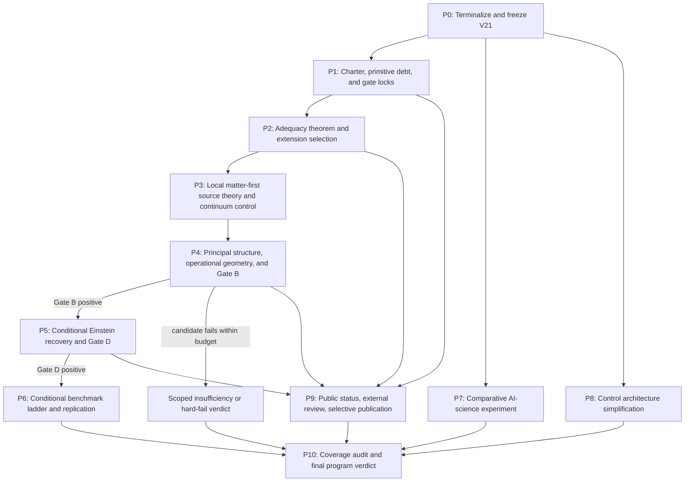

<!-- authority: control -->

# Recommendations Implementation Plan Continue Task v22

```yaml
plan_id: "recommendations_implementation_plan_continue_task-v22"
plan_version: "v22"
created_at: "2026-08-08"
status: "draft_control_implementation_plan_unregistered_pending_v21_terminalization"
review_basis_sha256: "1a0d36e14770c4591717cc4f317691f5efcb8ea6f5b300cb8fe63ba001d1eadd"
review_basis_line_count: 1683
review_recommendation_count: 19
review_cross_cutting_directive_count: 10
review_sequence_step_count: 12
phase_count: 11
work_package_count: 40
track_count: 3
recommended_repo_path: "implementations_plans/recommendations_implementation_plan_continue_task-v22.md"
predecessor_plan: "implementations_plans/recommendations_implementation_plan_continue_task-v21.md"
live_repository_baseline_head: "233e5dd702d3d1ecde1f822f4f1b37b60522fc63"
live_repository_baseline_branch: "main"
live_repository_baseline_status: "clean_and_equal_to_origin_main_at_inspection"
live_control_task_basis: "RT-20260804-005"
live_control_handoff_basis: "handoff-0966"
live_control_status_basis: "generation_256_p16_t06_completion_contract_role_parity_reconciled_pending_checkpoint"
primary_physics_priority: "Gate_B_effective_geometry_only"
primary_source_candidate_strategy: "one_local_multi_field_matter_first_continuum_candidate_plus_one_preregistered_fallback"
physics_promotion_authorized_by_plan: false
canonical_ontology_edit_authorized_by_plan: false
source_law_adoption_authorized_by_plan: false
metric_adoption_authorized_by_plan: false
matter_coupling_adoption_authorized_by_plan: false
einstein_equation_adoption_authorized_by_plan: false
benchmark_promotion_authorized_by_plan: false
gate_chair_verdict_authorized_by_plan: false
external_reviewer_contact_authorized_by_plan: false
publication_or_public_release_authorized_by_plan: false
repository_mutation_authorized_by_plan: false
```

## 0. Answer first

This plan converts all 19 numbered recommendations and all 12 steps in the
review's recommended research sequence into a smaller, dependency-gated V22
program. It does not repeat V21's 122-item downstream traversal. It defines 40
bounded work packages across three separately scored tracks:

- Track A: exact-GR interpretation;
- Track B: first-principles source reconstruction; and
- Track C: AI research-operating-system evaluation.

The only active physics objective is Track B's source-to-geometry bridge:

```text
primitive-debt audit
  -> source-adequacy theorem
  -> one selected local multi-field source extension
  -> controlled continuum/refinement limit
  -> gauge-reduced principal polynomial
  -> stable common hyperbolicity cone
  -> conformal structure
  -> operational scale, clocks, rods, gluing, and robustness
  -> Gate B
```

Einstein-sector work, Gate D, and physical GR benchmarks are conditional
branches. They remain closed unless Gate B is positive on genuinely new
source-derived evidence. Existing P8/P9 finite candidates and six inconclusive
benchmarks are historical obstruction records, not inputs that can be renamed
into success.

V21 must first be terminalized and frozen as an immutable scientific baseline.
At the live repository state inspected for this plan, the tracked control layer
still named one cumulative checkpoint and outer relay verification boundary.
For that reason, this draft was created outside the repository and must not be
registered or copied into the checkout until the V21 transaction is canonically
terminal and the repository fingerprint is revalidated.

## 1. Authority, scope, and non-authority boundary

This document is a planning artifact. It is not:

- a physics proof or theorem;
- a canonical ontology or source law;
- a Lorentzian metric, matter-coupling law, gravitational action, or Einstein
  equation;
- a Gate B, D, or E decision;
- evidence of external review or independent replication;
- authorization to contact reviewers, create a release, tag Git, publish,
  push, or alter an external system; or
- evidence that the first-principles GR objective is complete.

When registered, the plan remains subordinate to registered canonical science,
protected human decisions, `research_control/program_state.yaml`, its named
handoff, `registries/DISTANCE_TO_GR_LEDGER.csv`, activated tasks and AgentJobs,
and live validators. A planned task is not completion evidence. A validator
PASS is operational evidence, not scientific truth.

The plan authorizes no implementation by itself. Each state-changing package
requires a separately activated, bounded repository task, a current role and
skill route, exact source and write allowlists, documentation-impact handling,
proportionate validation, and a governed checkpoint.

## 2. Review recommendation inventory

The IDs below normalize the review without strengthening it. The detailed
work packages later in the plan reproduce each listed obligation in their
actions, outputs, and acceptance criteria.

### V22-R01 — Close V21 and make it an immutable scientific baseline

- Finish the exact pending checkpoint and outer terminal verification rather
  than opening a successor.
- Tag and freeze the qualifying V21 baseline, except for demonstrated
  reproducibility or security defects handled as superseding repairs.
- Package canonical science, the final Distance-to-GR ledger, Gate decisions,
  selector proof archive, P5/P6 negatives, P7 postulate ledger, P8/P9
  obstructions, final scorecards, and a machine-readable hash manifest.
- Prefer PDFs, HTML, wiki views, and large generated reports as release
  artifacts rather than continuously amended main-branch authority.
- Start V22 with a smaller decision tree, not a copy of 122 work items.

### V22-R02 — Split the program into three explicit tracks

- Track A develops the exact-GR interpretation, congruence kinematics,
  conceptual coherence, and philosophy of empirical equivalence without a
  source-derivation claim.
- Track B attempts source-derived Lorentzian geometry and Einstein dynamics or
  ends in a scoped hard failure; its gates are B, D, and E in that order.
- Track C evaluates claim gates, provenance, role separation, negative-result
  memory, efficiency, cost, and reproducibility through controlled evidence.
- Each track has separate authority, budgets, dashboards, success measures,
  and publication outputs. Cross-track process success supplies no physics
  credit. Repository separation remains an optional later architecture choice.

### V22-R03 — Rewrite the scientific objective with exact scope

- State that the source already assumes a smooth four-dimensional manifold,
  topology, locality, charts, differentiability, and any other live primitive
  debt.
- Use the exact objective: derive physical Lorentzian conformal and metric
  structure, universal matter coupling, and Einstein-leading dynamics from
  source fields and laws on that primitive source manifold without assuming the
  target metric or its predictions.
- Maintain an assumption-cost ledger for manifold, dimension, topology,
  smoothness, locality, matter, dynamics, symmetry, and metric-equivalent debt.
- Classify coframes, Lorentzian constitutive tensors, quadratic forms, or
  equivalent structures as metric postulation/reconstruction unless a prior
  source derivation establishes them.

### V22-R04 — Make Gate B the only active physics gate

- Freeze new Gate C, D, and E work until Gate B receives new positive evidence.
- Ask only which smallest source extension can produce a unique, robust,
  operational Lorentzian geometry without importing it.
- Physics tasks must prove a necessary condition, construct a candidate,
  produce a scoped impossibility, compare minimal extensions, or test
  uniqueness and robustness.
- Do not create physically named gravity, clock, signal, or free-fall objects
  before their operational type and source-to-world map exist.

### V22-R05 — Replace the scalar source channel with a local source theory

- Keep the one-amplitude route frozen; deterministic decoding cannot create
  missing local degrees of freedom.
- Define multiple local fields `q^A(x)`, local state spaces or sheaves,
  restriction and gluing, admissible variations, local dynamics, backgrounds,
  linearized response, source symmetries, observables, and scale or
  coarse-graining.
- If an action is used, account explicitly for the measure, derivatives,
  connection, locality, symmetries, and deterministic, stochastic,
  Hamiltonian, or variational status instead of importing familiar field
  theory silently.

### V22-R06 — Generalize the rank obstruction into an information-capacity theorem

- Define a reconstruction from local source jets to physically quotiented
  geometry.
- Avoid naive component counting; quotient coordinate and gauge redundancy.
- Identify physically distinguishable cone, tidal, polarization, clock-rate,
  volume, shear, and curvature variations.
- Prove a lower bound on source rank or information capacity required to
  produce the selected independent variations.
- Turn the result into a reusable source-adequacy test for every extension.

### V22-R07 — Derive conformal structure before the full metric

- Linearize around an admissible background and compute a gauge- and
  constraint-reduced principal symbol and polynomial.
- Require hyperbolicity, stable time orientation, one physical propagation
  cone, nondegeneracy, sector universality, and perturbative robustness.
- Derive the conformal structure before scale.
- Derive scale through a physical clock, volume density, mass scale, action
  normalization, rod, detector response, or another justified calibration.
- Prove tensorial transformation, local-to-global gluing, no second-clock
  effect, Lorentzian-signature preservation, regularity, and required global
  time orientation.
- Use Ehlers-Pirani-Schild only as a constructive guide after actual light and
  free-fall structures have been derived.

### V22-R08 — Use a matter-first geometry route as the primary candidate

- Upgrade the P7 finite package into continuum fields or a controlled
  refinement family while retaining its postulate boundary.
- Derive matter equations, their principal polynomial, a common hyperbolicity
  cone, conformal geometry, physical scale, and then compatible gravitational
  closure.
- Treat gravitational closure as a conditional reconstruction program whose
  assumptions require independent source justification.
- Stop extending scalar graph analogies as if they were geometry.

### V22-R09 — Decide whether matter is primitive or emergent

- Adopt Position A for the next cycle: matter is a declared conditional input
  to the GR-derivation program.
- Treat P7 as a finite probe or prototype, not realistic continuum or Standard
  Model matter.
- Freeze matter as an explicit conditional input and do not claim realistic
  matter emergence.
- If Position B is later chosen, open a separate program for particle/field
  degrees, internal symmetry, statistics, Hilbert/algebraic states, locality,
  interactions, continuum behavior, and effective Standard Model sectors.

### V22-R10 — Require a controlled continuum or refinement limit

- Use a family `K_n`, a declared refinement/scaling parameter, observables at
  each level, a convergence topology or norm, boundary control, finite-size
  errors, universality, a limiting differential operator, and preservation of
  causal/signature properties.
- Select appropriate tools such as spectral convergence, graph-to-manifold
  limits, homogenization, Gamma-convergence, renormalization/coarse-graining,
  principal-symbol convergence, or sheaf/cosheaf compatibility.
- Never infer vanishing continuum corrections from a zero finite remainder.

### V22-R11 — Select an Einstein-recovery route only after geometry exists

- Keep all routes parked until Gate B is genuinely positive.
- Rank matter gravitational closure first, massless spin-2 consistency second,
  canonical constraint algebra third, Lovelock-type classification fourth, and
  thermodynamic reconstruction fifth unless source-native thermodynamics
  justifies reprioritization.
- Verify every route's prerequisites rather than treating it as a substitute
  for the missing metric, covariance, matter coupling, or dynamics.
- After selection, derive an effective action or constraint structure,
  equations, degrees of freedom, stability, coefficients, and controlled
  corrections before Gate D.

### V22-R12 — Replace the benchmarks with a dependency-aware ladder

- Preserve the six current cases as historical obstruction records.
- Pre-register Levels 0 through 6: type/consistency; geometry; flat and weak
  field; equivalence principle and post-Newtonian behavior; radiation;
  cosmology; nonlinear and compact objects.
- List the exact prerequisites and observables for every level.
- Use independent implementations and calibrated tolerances.
- Stop a case as a readiness failure when a required type or bridge is absent,
  before expensive target comparison.

### V22-R13 — Establish explicit hard-fail criteria

- Pre-register a finite source-extension budget, with at most three materially
  distinct families and only one active family at a time.
- Require every Gate B candidate to be target-atlas-free, hyperbolic, stably
  Lorentzian, universally matter-compatible, scaled, globally glued, robust,
  and free of hidden metric-equivalent primitives.
- Declare the current ontology family insufficient when the authorized
  extension budget is exhausted without a qualifying candidate.
- Hard-fail a route that inserts metric-equivalent structure, maps labels to
  observables by fiat, fits coefficients from GR targets, abandons universal
  propagation, accepts instability/nonhyperbolicity, lacks a controlled
  continuum limit, leaves inequivalent geometries unselected, or postulates
  the Einstein action.
- Keep the verdict scoped to the declared ontology and extension budget, not
  all imaginable Æther theories.

### V22-R14 — Do not use protected postulates to pass Gate B or Gate D

- Preserve the bounded P7 postulate as historical theory-building input.
- Prohibit a human decision from converting missing geometry or Einstein
  derivation into a positive derivation-gate result.
- Allow human authority to choose among scientifically supported candidates;
  do not allow it to change evidential truth values.

### V22-R15 — Obtain actual external review

- Use a category theorist for selector novelty, assumptions, equalizers,
  stochastic/quotient alternatives, and Lean fidelity.
- Use a mathematical relativist or hyperbolic-PDE specialist for principal
  symbols, cones, hyperbolicity, causal stability, and gluing.
- Use a GR/EFT specialist for degrees of freedom, constraints, spin-2
  emergence, effective action, corrections, and weak/radiative recovery.
- Use a matter/QFT specialist for P7, continuum limits, universal coupling,
  stress-energy, Ward identities, and quantum consistency.
- Use a philosopher of physics for ontology/interpretation, empirical
  equivalence, explanation, surplus structure, and nonempirical success.
- Make packets blind where possible, hash-bound, run in independent
  environments, and prevent shared primary intermediate outputs. An internal
  role called `external-red-team-reviewer` is not external review.

### V22-R16 — Run a comparative AI-science experiment

- Pre-register matched or randomized arms: unstructured single agent;
  structured single agent with claim gates; role-structured same model;
  role-structured different-model review; human expert review; and hybrid AI
  plus human adjudication.
- Measure mathematical correctness, invalid-claim rate, calibration,
  counterexample discovery, source accuracy, defect recall, false positives,
  time, tokens, cost, repair cycles, expert rating, and reproducibility.
- Ablate claim gates, negative-result memory, child roles, target-import
  firewall, family freeze, checkpointing, and formal proof.
- Separate descriptive results from causal claims and use independent blinded
  adjudication.

### V22-R17 — Simplify the research-control architecture

- Advance the existing tracked-JSONL plus generated-SQLite shadow pilot toward
  one canonical event stream only through parity-tested migration and explicit
  cutover authority.
- Generate Markdown, CSV, YAML, dashboards, and query views from that stream.
- Target one task/event record, one claim-bearing artifact, one machine result
  or receipt, one completion event, and a source manifest only when needed;
  reserve extra sidecars for protected/high-risk packages.
- Use fast, scientific, and release validation tiers; do not run release-grade
  assurance after every low-risk task.
- Measure control cost and set an ordinary-phase ceiling of 25–35 percent,
  with separately justified protected-gate/release exceptions.
- Maintain independent counters for scientific burden reduced and
  project-system work completed.

### V22-R18 — Create a concise public status architecture

- Put four distinct statements on the front page: effective theory,
  interpretation, source program, and derivation status.
- State that the operational theory is exactly GR; Æther-flow is a target-side
  interpretive framework; the source program begins with a primitive smooth 4D
  manifold plus unresolved/candidate source structures; and no source-derived
  metric, Einstein equations, or successful GR benchmark exists.
- Ground the statements in the existing public-status source specifications
  and Distance-to-GR ledger.

### V22-R19 — Publish selectively

- Paper A: selector classification, countermodels, extension taxonomy,
  stochastic/quotient limits, Lean kernel, and novelty comparison, only after
  external mathematical review.
- Paper B: one-mode dynamics, tangent response, generalized information
  capacity theorem, and reconstruction implications, strengthened before
  submission.
- Paper C: descriptive AI-governance case study now; causal methodology only
  after the comparative experiment.
- Paper D: exact-GR interpretation framed as philosophy/interpretation, not a
  new law.
- Paper E: negative reconstruction report on why finite analogies failed to
  type-check as physical geometry.
- Do not prepare a source-derived GR paper until Gates B and D are positive.
- Treat package preparation, external submission, public release, and reviewer
  contact as separate authority decisions.

### Review-wide cross-cutting directives

The review also contains recommendation-like directives outside the numbered
section. They are tracked separately so they are not lost merely because they
repeat or constrain R01–R19.

| ID | Cross-cutting directive | Plan coverage |
| --- | --- | --- |
| V22-X01 | Preserve exact GR as the target-side effective theory; do not treat inherited GR agreement as source-ontology evidence. | P1-T01, P9-T01, P10-T02 |
| V22-X02 | Preserve negative results and scoped no-go language; do not infer global impossibility or future-extension failure. | P2-T03, P4-T02, P6-T03, P10-T02 |
| V22-X03 | Keep the one-amplitude and unchanged finite graph-decoder routes frozen; do not add elaborate downstream decoders to missing source information. | P1-T04, P2-T04, P3-T04 |
| V22-X04 | Return upstream to source law and geometry; do not repeat the downstream Gate D/E and benchmark traversal without Gate B evidence. | P1-T04, P4-T01–P4-T05 |
| V22-X05 | Treat the P7 finite package as a transparent conditional probe, not realistic matter, target coupling, or Standard Model recovery. | P1-T03, P3-T01, P3-T02 |
| V22-X06 | Do not treat the P8 static graph constraint as dynamics, geometry, or a Bianchi identity; dynamically inequivalent completions remain decisive counterevidence. | P1-T04, P5-T02, P6-T01 |
| V22-X07 | Preserve the Æflow congruence as a generally nonunique target-side interpretive representative, not `Phi_src`, pure gauge, a new field, or a source-selected flow. | P9-T01, P9-T03 |
| V22-X08 | Keep the current AI methodology result descriptive and noncausal until the prospective comparative study supports stronger inference. | P7-T01–P7-T03, P9-T03 |
| V22-X09 | Treat validators, same-context AI review, and internal reproduction as conformance/internal evidence, not external review, truth, or independent replication. | P2-T02, P4-T05, P7-T03, P9-T02, P10-T02 |
| V22-X10 | Prevent the control layer from consuming the scientific program: measure control cost, compress representation, and show physics progress separately. | P8-T01–P8-T04, P10-T02 |

## 3. Review sequence inventory

| Step | Required outcome | Primary work packages |
| --- | --- | --- |
| S1 | Freeze and release V21. | P0-T01, P0-T02 |
| S2 | Audit primitive debt. | P1-T02 |
| S3 | Prove a general source-adequacy theorem. | P2-T01, P2-T02 |
| S4 | Select one minimal extension family and one fallback. | P2-T03, P2-T04 |
| S5 | Derive a principal polynomial and stop on failure. | P4-T01, P4-T02 |
| S6 | Reconstruct operational geometry. | P4-T03, P4-T04 |
| S7 | Perform Gate B on new evidence. | P4-T05 |
| S8 | Select one Einstein-recovery mechanism only after Gate B. | P5-T01 |
| S9 | Derive the effective action and corrections. | P5-T02 |
| S10 | Perform Gate D. | P5-T03 |
| S11 | Execute the tiered benchmark suite. | P6-T01, P6-T02 |
| S12 | Independently replicate and issue the final verdict. | P6-T03, P10-T02 |

## 4. Live repository basis and revalidation rule

At inspection time:

- `main` was clean and equal to `origin/main` at
  `233e5dd702d3d1ecde1f822f4f1b37b60522fc63`.
- `research_control/program_state.yaml` named `RT-20260804-005`,
  `handoff-0966`, and one remaining cumulative checkpoint plus outer relay
  verification.
- The P16-T05 science scorecard recorded Gate B, D, and E as `NOT_READY`, six
  benchmark cases as `INCONCLUSIVE`, zero benchmark passes, and zero qualifying
  independent replications.
- The P16-T05 system scorecard recorded complete internal V21 recommendation
  coverage but explicitly denied external review, independent replication,
  causal methodology superiority, publication authority, and physics credit.
- The existing event-store design selected tracked canonical JSONL plus a
  generated local SQLite query index, but only a shadow pilot exists; writer
  activation and cutover remain unauthorized.

These are baseline facts, not permanent assumptions. Before any package is
executed, resolve current state again from canonical sources. If V21 is not
terminal or HEAD/branch/tree/lease differs, stop the V22 launch. Do not repair
or replay the V21 relay from this plan.

## 5. Program architecture

### 5.1 Three-track score separation

| Track | Objective | Success evidence | Explicit non-success evidence |
| --- | --- | --- | --- |
| A — Exact-GR interpretation | Clarify the target-side interpretation, congruence kinematics, its relation to established 1+3 formulations, and empirical-equivalence philosophy. | Coherent canonical exposition, exact agreement with GR, disciplined observer-relative claims, clear 1+3 comparison, and external philosophy/GR review. | No source derivation, novel prediction, Gate B credit, or ontology confirmation follows. |
| B — Source reconstruction | Derive operational Lorentzian geometry and, conditionally, Einstein-leading dynamics or issue a scoped hard failure. | Gate B first; then Gate D; then independently replicated tiered benchmarks and Gate E. | Track A agreement, P7 postulate, finite analogies, validators, or Track C success supply no Gate credit. |
| C — AI research operating system | Causally evaluate claim gates, provenance, role separation, negative-result memory, efficiency, and cost. | Preregistered matched/randomized comparison, blinded adjudication, reproducible analysis, cost accounting. | Internal operational PASS does not prove scientific truth or better physics. |

### 5.2 Cross-track resource rule

- Track B receives the protected physics budget and is the only track that can
  reduce Distance-to-GR burdens.
- Tracks A and C receive distinct budgets, dashboards, completion statuses,
  and publication packages.
- Project-system work has a separate control-cost numerator and cannot be
  counted as physics effort or progress.
- A system defect may temporarily block a physics transaction, but its repair
  remains system work and supplies zero physics credit.
- No track may silently borrow another track's authority, evidence, review, or
  success metric.

### 5.3 Dependency graph



### 5.4 Gate-lock rules

1. `P5-*` is ineligible until P4-T05 records a genuinely positive Gate B
   verdict from source-derived evidence.
2. `P6-T02` is ineligible until P5-T03 records a genuinely positive Gate D
   verdict; P6-T01 may define the protocol earlier but may not execute physics.
3. Gate B or D cannot be passed by a protected postulate, target-side GR
   adoption, renamed finite tokens, or a validator.
4. A failed principal polynomial, unstable/nonhyperbolic cone, non-universal
   matter propagation, hidden metric primitive, or uncontrolled continuum
   limit terminates the active candidate before downstream work.
5. Only one source-extension family may be active. A fallback requires a
   recorded candidate termination and a fresh selector decision.

## 6. Global implementation controls

### 6.1 Exact scientific objective

> Derive a physical Lorentzian conformal and metric structure, universal
> matter coupling, and Einstein-leading dynamics from source fields and laws
> defined on a primitive smooth four-dimensional source manifold, without
> assuming the target metric or its observational predictions.

The assumption ledger must show the cost of every primitive or extension.
Introducing a metric-equivalent object changes the result classification to
postulation or reconstruction unless its provenance is itself derived.

### 6.2 Source-extension budget and terminal outcomes

The maximum budget is three preregistered, materially distinct source-extension
families. Only one may run at a time. At P2-T04, select one primary and one
fallback; leave a third slot unallocated unless independent review identifies a
genuinely distinct hypothesis that does not repeat the same burden. The cycle
terminates in one of four outcomes:

1. first-principles derivation achieved within scope;
2. controlled approximate GR recovery;
3. current ontology insufficient under the preregistered extensions; or
4. exact-GR interpretation retained without source derivation.

No outcome is a global impossibility theorem unless a separate theorem proves
that stronger scope.

### 6.3 Required Gate B criteria

A Gate B candidate must satisfy all of the following with source provenance:

1. target-atlas-free construction;
2. gauge- and constraint-reduced hyperbolic principal polynomial;
3. one stable Lorentzian cone or a physically derived equivalence class;
4. universal compatibility across the declared matter sectors;
5. operational clock and rod calibration and physical scale;
6. tensorial transformation and local-to-global gluing;
7. finite-variation and coarse-graining robustness;
8. no hidden metric, tetrad, coframe, or equivalent constitutive primitive.

Any positive Gate B packet must also record regularity, time orientation,
nondegeneracy, conditioning, and second-clock-effect analysis.

### 6.4 Hard-fail triggers

Terminate and preserve the candidate when it requires any of these moves:

- insert a metric, tetrad, coframe, Lorentzian constitutive tensor, or equivalent
  quadratic structure without prior source derivation;
- identify source labels with clocks, rods, locations, cones, or target
  observables by fiat;
- select free coefficients by matching GR target values;
- abandon universal matter propagation or tolerate mutually inequivalent
  physical cones without a derived selector or quotient;
- accept ghosts, instability, nonhyperbolicity, degeneracy, or uncontrolled
  signature change;
- omit a controlled continuum/refinement limit;
- postulate the Einstein-Hilbert action or Einstein equations as a derivation;
  or
- repeat an already frozen information-deficient route under a new name.

### 6.5 Validation tiers

| Tier | Use | Minimum checks | Prohibited overread |
| --- | --- | --- | --- |
| Fast | Local edit loop and low-risk project-system changes. | Schema, changed-path checks, focused syntax/unit checks, relevant hashes. | Not scientific validation or release readiness. |
| Scientific | A physics-bearing candidate or theorem package. | Symbolic/numerical reproduction, theorem compile where applicable, adversarial counterexamples, source-provenance and claim-boundary checks, domain-specific review. | Not external replication or a protected Gate verdict. |
| Release | V21/V22 baseline, external packet, or publication candidate. | Full affected suite, non-regression, security, generated derivatives, provenance closure, clean-environment reproduction, package manifest. | Not publication authorization or scientific truth. |

### 6.6 Review and independence controls

- Internal role diversity is recorded as internal review only.
- Different context in the same model is not independent replication.
- Actual external review requires a real external specialist, preserved
  identity/provenance, independent environment, and conflict disclosure.
- Blind packets omit conclusion-leading metadata where practical and bind
  source, task, question, and artifact hashes.
- Reviewer contact, compensation, disclosure, and publication activity require
  explicit human authorization outside this plan.

### 6.7 Standard work-package completion record

Every executed package must record:

- package ID, track, role, route, dependencies, and source hashes;
- exact objective and assumption delta;
- mathematical payload, model/candidate identity, or system artifact identity;
- observed evidence, counterevidence, and limitations;
- recommendation IDs and sequence-step IDs covered;
- Distance-to-GR delta or explicit zero-delta rationale;
- science and project-system task-count credit separately;
- elapsed time, tokens/compute, and financial cost as measured or
  `not_measured`, never fabricated as zero;
- validation tier and exact checks actually run;
- external-review and replication class;
- protected authority flags and blocked conclusions;
- final disposition: completed, precisely obstructed, frozen negative,
  fallback-selected, human-gated, conditionally ineligible, or superseded;
- checkpoint and handoff evidence for state-changing work.

## 7. Detailed phased implementation plan

## P0. Terminalize, release, and freeze V21

### P0-T01 — Revalidate and complete the existing V21 terminal boundary

**Track:** shared control. **Covers:** V22-R01, S1. **Owner:** Director of
Research plus the existing outer relay; no new worker. **Depends on:** the live
V21 goal state and `handoff-0966` or their exact current successors.

**Objective.** Finish only the already-routed V21 checkpoint and outer
terminal verification, without using this V22 plan to mutate or replay V21.

**Actions.** Reopen the live goal record, lease, repository binding, branch,
HEAD, tree, manifest, active handoff, completion, and checkpoint status. If the
record is still pending, follow its immutable route exactly once. Verify the
returned receipt, canonical after-fingerprint, 122 final dispositions, 72
covered V21 recommendations, zero unresolved required human actions, zero
successor, and released lease. If the state is already terminal, record that
fact read-only. If any identity differs, stop and use the live V21 recovery
route; do not infer a repair from this plan.

**Outputs.** Canonical terminal receipt or a precise existing-relay blocker;
read-only V21 terminal-state snapshot for the V22 intake.

**Acceptance.** V21 is `terminal_complete`, no successor exists, leases are
released, repository state matches the terminal fingerprint, and no scientific
status was promoted by closure.

**Verification.** Use the exact V21 goal helper and live control validators.
This package does not create a new AgentJob, plan task, or repository change.

**Stop conditions.** Lease ambiguity, stale handoff, dirty-manifest mismatch,
consumed-generation replay risk, checkpoint failure, or any request to broaden
the terminal transaction.

### P0-T02 — Build and approve the immutable V21 scientific baseline release

**Track:** shared release control. **Covers:** V22-R01, V22-R12, V22-R19, S1.
**Owner:** Director of Research, process-integrity auditor, and documentation
curator. **Depends on:** P0-T01.

**Objective.** Package V21 as an immutable, internally reproducible baseline
without implying publication, external validation, or a positive derivation.

**Actions.** Pin the terminal commit and tree. Construct a machine-readable
manifest containing every canonical source and hash, the final
Distance-to-GR ledger, Gates A-E, selector theorem/proof archive, P5/P6
negative results, P7 postulate ledger, P8/P9 obstruction and benchmark records,
P16 science/system scorecards, validation environment, and provenance
receipts. Reproduce selected theorem, Lean, TeX, Python, and benchmark packages
in a clean environment. Verify that generated PDFs, HTML, wiki, and large
reports are derivative release artifacts. Prepare, but do not create, a Git tag
and release until separately authorized. Define the freeze exception process:
only demonstrated security or reproducibility defects, repaired through a
superseding record, may alter the baseline lineage.

**Outputs.** Release manifest, canonical/derivative partition, reproduction
receipt, freeze policy, proposed tag name, and release notes with the exact
negative scientific status.

**Acceptance.** Every required baseline artifact resolves by hash; generated
artifacts trace to canonical sources; clean reproduction is either successful
or exact failures are disclosed; release text says Gates B/D/E are not ready,
benchmarks are six inconclusive/zero pass/zero independent replication, and GR
is not source-derived.

**Verification.** Release-tier validation, clean-environment reproduction,
hash closure, source/derivative audit, claim-language review, and a human check
before tag/release execution.

**Stop conditions.** Missing canonical object, unverifiable hash, nonreproducible
proof or build without disclosure, public-release overclaim, or absent explicit
tag/release authority.

### P0-T03 — Register the compact V22 decision program after V21 freezes

**Track:** shared project control. **Covers:** V22-R01, V22-R02, V22-R17.
**Owner:** project-control maintainer and project-memory system. **Depends on:**
P0-T02. Public tag or release execution may remain separately human-gated, but
the immutable internal baseline manifest, reproduction receipt, freeze policy,
and proposed release package must all be complete.

**Objective.** Register this 40-package V22 plan as draft/control without
copying V21's 122-item implementation structure or altering science.

**Actions.** Revalidate the repository and review-source hash. Copy this draft
to the recommended repository path. Add one Markdown source-registry row linked
to V21 and the V21 terminal baseline. Materialize a machine-readable V22
backlog and acyclic dependency graph. Run the repository classifier, required
documentation-impact handling, memory bootstrap, affected validation, and
`git diff --check`. Check that generated wiki/registry derivatives are created
only by approved scripts. Do not launch the program, create external action, or
edit canonical science in this package.

**Outputs.** Registered plan, V22 backlog, dependency graph, source hash,
coverage seed, documentation-impact receipt, and validation receipt.

**Acceptance.** Exactly 19 review recommendations, 12 sequence steps, 11
phases, and 40 unique work packages are represented; every dependency resolves;
no cycle or orphan exists; plan registration changes no scientific, Gate,
benchmark, or publication status.

**Verification.** Project-memory bootstrap plus validate-only, affected profile,
recommendation/backlog validator, classifier, documentation-impact validator,
and final diff review.

**Stop conditions.** V21 not terminal, live checkout drift, ID collision,
missing recommendation, generated-file hand edit, or a plan field that implies
scientific authority.

## P1. Charter, primitive debt, matter position, and gate locks

### P1-T01 — Establish the three-track charter and separated scorecards

**Track:** shared governance. **Covers:** V22-R02. **Owner:** Director of
Research and project-system director. **Depends on:** P0-T03.

**Objective.** Make the interpretation, reconstruction, and AI-methodology
programs independently accountable.

**Actions.** Create one charter per track with purpose, allowed claims,
success/failure measures, budget, dashboard, publication lane, and authority
owner. Define cross-track references as typed links rather than evidence
promotion. Allocate task-count, elapsed-effort, compute, and financial-cost
fields separately. Define repository separation decision criteria based on
coupling, release cadence, access, and maintenance cost; do not split
repositories merely for appearance.

**Outputs.** Three-track charter, authority matrix, separate scorecard schemas,
budget allocation, and optional future repository-split decision record.

**Acceptance.** Every task can be assigned to exactly one primary track or a
declared shared-control class; Track A/C success cannot change Distance-to-GR;
Track B cannot cite interpretive coherence or workflow PASS as Gate evidence.

**Verification.** Schema fixtures for prohibited cross-track promotion,
dashboard separation tests, and independent process-integrity review.

**Stop conditions.** Shared metric with ambiguous authority, double-counted
budget, or publication language that blends the three programs.

### P1-T02 — Rewrite the scientific objective and complete the primitive-debt audit

**Track:** B. **Covers:** V22-R03, S2. **Owner:** ontology formalizer with
smuggling auditor. **Depends on:** P1-T01.

**Objective.** State exactly what the program assumes and what it still seeks
to derive.

**Actions.** Inventory the live source manifold, dimension, topology,
smoothness, charts, differentiability, locality, measure, derivative,
connection, matter, dynamics, symmetry, scale, operational, and
metric-equivalent assumptions. Classify each as canonical primitive,
protected postulate, proposal-only extension, derived, unresolved, or forbidden
target import. Adopt the exact objective in Section 6.1 on control and public
planning surfaces. Assign an assumption-cost entry, rationale, downstream use,
and removal/derivation criterion. Create a metric-equivalence decision test for
coframes, constitutive tensors, quadratic forms, principal polynomials, and
volume structures.

**Outputs.** Primitive-debt ledger, exact objective source, assumption-cost
schema and populated baseline, metric-equivalent classification checklist, and
smuggling-audit report.

**Acceptance.** Every symbol proposed for the local source theory has a source
type and debt status; the objective does not claim pregeometry; metric-equivalent
inputs cannot be labeled emergence; unresolved debt remains visible.

**Verification.** Canonical-source and registry inspection, no-target audit,
independent assumption-ledger cross-check, and adversarial classification
fixtures.

**Stop conditions.** Hidden target atlas/metric, untyped derivative or measure,
or any attempt to discharge debt through terminology alone.

### P1-T03 — Adopt Position A for matter and codify the no-postulate gate rule

**Track:** B. **Covers:** V22-R09, V22-R14. **Owner:** Director of Research;
protected human authority only where required. **Depends on:** P1-T02.

**Objective.** Freeze matter as a transparent conditional input for the next
geometry cycle while preventing postulates from laundering Gate B or D.

**Actions.** Restate the exact P7 protected finite matter package and its
limits. Declare Position A: a fixed matter theory is input to geometry
reconstruction. List what P7 does not supply: realistic continuum matter,
Standard Model sectors, quantum statistics, Hilbert/algebraic state structure,
microcausality, target stress tensor, or derived universal target coupling.
Define the conditions that would open a separate Position B emergence program.
Add a fail-closed rule: no protected human decision may turn absent
source-to-geometry or source-to-Einstein evidence into a positive derivation
gate; humans may select only among evidence-supported candidates.

**Outputs.** Matter-position decision, P7 conditional-input contract,
Position-B reopening criteria, and no-postulate Gate B/D policy.

**Acceptance.** Later matter-first tasks can use P7 only within its exact
source-side scope; every Gate B/D evaluator rejects postulate-only passage;
realistic matter emergence is explicitly out of scope for this cycle.

**Verification.** Gate-decision fixtures covering allowed selection versus
forbidden truth-value alteration, plus claim-language and authority review.

**Stop conditions.** Expansion of P7 to target coupling by implication,
postulated metric/Einstein action, or ambiguity about who may change scientific
status.

### P1-T04 — Make Gate B the sole active physics gate and park downstream work

**Track:** B. **Covers:** V22-R04, V22-R11, V22-R12, V22-R14. **Owner:**
Director of Research. **Depends on:** P1-T02, P1-T03.

**Objective.** Enforce the upstream dependency chain before any new gravity or
benchmark task is admitted.

**Actions.** Set the active milestone to `effective_metric_g_eff` or its live
successor burden. Mark new Gate C, D, E, Einstein-route, and benchmark-execution
packages ineligible until their prerequisites. Admit physics tasks only when
they prove a Gate B necessary condition, construct a candidate, prove a scoped
obstruction, compare minimal extensions, or test robustness/uniqueness. Add a
physical-typing gate that rejects untyped `clock`, `signal`, `free-fall`,
`gravity`, `metric`, or `compact source` labels. Preserve all old P8/P9 outputs
as historical negative/control evidence.

**Outputs.** Gate-lock policy, physics-admission matrix, parked-route registry,
physical-type checklist, and historical-obstruction index.

**Acceptance.** No eligible route bypasses Gate B; existing Gate C status is
preserved but not rerun; no P5/P6 conditional package below can execute early;
the Director can explain each eligible task's direct Gate B burden.

**Verification.** Dependency and route-selection fixtures, claim-language
tests, and an independent process-integrity audit.

**Stop conditions.** Any downstream task admitted from convenience, a finite
token treated as physical typing, or a protected decision substituted for new
evidence.

## P2. Source-adequacy theorem, extension budget, and candidate selection

### P2-T01 — Prove the local source information-capacity theorem

**Track:** B. **Covers:** V22-R06, V22-R19, S3. **Owner:** ontology formalizer
and mathematical refuter. **Depends on:** P1-T02, P1-T04.

**Objective.** Generalize the factor-through-amplitude obstruction into a
coordinate- and gauge-aware adequacy test for local geometry reconstruction.

**Actions.** Define the source jet bundle or finite-order local state space,
candidate geometry space, physically derived equivalence relation, and
reconstruction map. Select a finite independent family of operationally
distinguishable perturbations: cone deformation, anisotropic tidal response,
polarization response, clock-rate shift, volume/shear variation, and suitable
curvature observables. Prove a rank or information lower bound after quotienting
gauge and coordinate redundancy. Recover the P5 scalar theorem as a corollary.
Test deterministic, stochastic, quotient-observable, partial-domain, and marked
domain cases so the scope does not overreach.

**Outputs.** Theorem manuscript, definitions, proof/countermodel archive,
source-adequacy checklist, machine-readable test cases, and optional
proof-assistant kernel for a bounded core.

**Acceptance.** The theorem states domains, regularity, equivalence, rank notion,
and physical-distinguishability assumptions; it does not rely on “ten metric
components”; known escape routes are classified rather than denied; every
candidate in P2-T04 can be tested against it.

**Verification.** Formal derivation review, explicit counterexamples, finite
model checks, proof-assistant build where used, and same-context internal audit
clearly labeled nonexternal.

**Stop conditions.** Gauge-dependent rank count, unstated quotient,
representative selection assumed, or a local theorem promoted to global
ontology impossibility.

### P2-T02 — Obtain external mathematical review of the selector and adequacy results

**Track:** B and publication support. **Covers:** V22-R06, V22-R15,
V22-R19, S3. **Owner:** external category theorist; packet preparation by
documentation curator. **Depends on:** P2-T01 and the V21 selector archive.

**Objective.** Establish actual specialist review of novelty, scope, and proof
fidelity before publication or use as a hard candidate filter.

**Actions.** Prepare a conclusion-blinded, hash-bound packet containing the
selector theorem, fixed-point classification, equalizer/generalization claims,
stochastic and quotient alternatives, Lean finite kernel, the generalized
adequacy theorem, countermodels, and exact novelty questions. Record conflicts,
reviewer expertise, environment, source hashes, and independent reproduction.
Keep reviewer outputs separate until submission. Reconcile findings in a
response matrix without rewriting negative results.

**Outputs.** External review packet, reviewer provenance, independent build
receipt, comments, response matrix, revised-or-frozen theorem status, and
publication-readiness verdict.

**Acceptance.** At least one real external mathematical specialist completes
the review; internal agent roles are not counted; every major objection is
resolved, accepted as limitation, or blocks publication; novelty wording is
externally defensible.

**Verification.** Hash and environment validation, reviewer-independence
classification, response-closure audit, and separate human publication
authority.

**Stop conditions.** No reviewer-contact authority, same-model review labeled
external, shared primary intermediate answers, or unresolved correctness
objection.

### P2-T03 — Pre-register the source-extension budget and hard-fail protocol

**Track:** B. **Covers:** V22-R13, S4. **Owner:** Director of Research,
refuter, and smuggling auditor. **Depends on:** P2-T01.

**Objective.** Prevent indefinite extension and define what counts as a scoped
failure before candidate results are known.

**Actions.** Define a maximum of three materially distinct families: local
multi-field continuum dynamics, matter-principal-polynomial reconstruction,
and controlled discrete-to-continuum refinement, while allowing overlap only
when one concrete candidate lawfully combines them. Define family identity,
reopening evidence, sequential execution, and nonrepackaging tests. Bind all
eight Gate B criteria and all hard-fail triggers in Section 6. Define how a
primary candidate ends, how a fallback is activated, when a third slot may be
allocated, and when the current ontology is declared insufficient. Pre-register
the exact scoped final wording.

**Outputs.** Extension-budget protocol, candidate-family registry, hard-fail
matrix, sequential activation rule, freeze/reopening criteria, and final-verdict
templates.

**Acceptance.** Only one family can be active; failures cannot be erased;
metric import and target-fitting fail closed; the budget cannot grow without a
new explicit program decision; terminal wording is scoped to the tested
ontology family.

**Verification.** Adversarial fixtures for renamed/repackaged candidates,
target imports, unstable models, and ambiguous equivalence classes; independent
process and scientific review.

**Stop conditions.** Unlimited fallback language, a family defined only after
seeing results, or global no-go wording unsupported by theorem.

### P2-T04 — Select one primary local matter-first candidate and one fallback

**Track:** B. **Covers:** V22-R05, V22-R08, V22-R09, V22-R13, S4.
**Owner:** theoretical-continuation selector followed by protected human
selection only if required. **Depends on:** P1-T03, P2-T01, P2-T03.

**Objective.** Choose the smallest source extension with a plausible path to a
principal polynomial and operational geometry, without running candidates in
parallel.

**Actions.** Solicit bounded candidate packets that specify fields, locality,
symmetry, dynamics, observables, continuum/refinement behavior, assumption
cost, and expected principal structure. Score information capacity, hidden
metric debt, universality, calculability, falsifiability, continuum control,
and difference from frozen routes. Prefer a local multi-field matter-first
continuum candidate. Select one primary, preregister one fallback, leave the
third budget slot unallocated, and freeze the scalar-amplitude and unchanged
finite graph-decoder routes. Record why the selected candidate is minimally
sufficient rather than merely familiar.

**Outputs.** Candidate comparison, source-adequacy results, primary/fallback
selection, assumption delta, family identities, frozen-route map, and activation
handoff to P3.

**Acceptance.** One and only one primary is active; it passes the theorem's
minimum adequacy screen; no metric-equivalent primitive or GR target fit is
present; fallback activation has objective criteria; frozen routes remain
historical negatives.

**Verification.** Smuggling audit, refuter stress, family-identity comparison,
assumption-cost review, and Director dependency check.

**Stop conditions.** No candidate clears adequacy, selection depends on target
agreement rather than source merit, candidates run concurrently, or selection
requires canonical ontology adoption without protected authority.

## P3. Build the local matter-first source theory and continuum control

### P3-T01 — Define the local multi-field source state and operational syntax

**Track:** B. **Covers:** V22-R05, V22-R08, V22-R09. **Owner:** candidate
constructor and ontology formalizer. **Depends on:** P2-T04.

**Objective.** Replace the information-deficient scalar channel with an exact,
source-native local state model that is rich enough to attempt geometry
reconstruction.

**Actions.** Define fields `q^A(x)` and their domains, codomains, regularity,
local sections, restriction maps, gluing rules, admissible variations, boundary
data, and source symmetry actions. State whether the model uses a bundle,
sheaf, cosheaf, algebra, chain complex, or another local structure and why.
Define source-native observables and distinguish them from target clocks,
signals, positions, or geometry. Embed the adopted P7 package only as a
conditional matter probe with an explicit continuum/refinement interface.
Populate the assumption-cost ledger for each new primitive and demonstrate
that no local atlas datum has been silently treated as a target atlas or metric.

**Outputs.** Local-state specification, type and domain table, restriction and
gluing laws, variation space, symmetry and equivalence definitions, observable
catalog, P7 interface contract, and updated assumption ledger.

**Acceptance.** Every field and operation is well typed; local restriction and
gluing are testable; source equivalence is explicit; observables are source
native; the model carries more than one independent local response direction;
no target metric, coframe, clock, rod, or prediction is assumed.

**Verification.** Type/domain audit, local compatibility examples and failure
cases, source-equivalence/naturality checks, smuggling audit, and adequacy-
theorem evaluation from P2-T01.

**Stop conditions.** Untyped locality, gluing by target coordinates, insufficient
information capacity, hidden metric-equivalent structure, or realistic matter
claims inherited from finite P7.

### P3-T02 — Define source dynamics and matter equations without hidden geometry

**Track:** B. **Covers:** V22-R05, V22-R08. **Owner:** candidate constructor
with mathematical refuter. **Depends on:** P3-T01.

**Objective.** Supply a concrete local law whose linearization can generate a
source-derived principal structure.

**Actions.** Choose and justify deterministic, stochastic, Hamiltonian, or
variational dynamics. If using an action, define the integration density,
derivatives, connection or derivative substitute, boundary terms, units, and
symmetry transformations without borrowing the target metric. Derive the
Euler-Lagrange, Hamiltonian, transition, or generator equations. Establish
initial/boundary data, constraints, local composition, admissible solution
class, conserved or balance identities, and well-posedness questions. Define
the continuum matter equations or refined matter update that will act as the
primary geometric probe. Identify all free coefficients and their source-side
selection rules; target GR values are prohibited inputs.

**Outputs.** Source dynamics manuscript, executable/symbolic model where
practical, matter equations, constraint and identity ledger, coefficient
provenance table, units/debt analysis, and well-posedness plan.

**Acceptance.** Equations follow from declared source structures; every
coefficient and differential operation has provenance; target predictions are
not used for selection; the law supports a nontrivial admissible background and
linearization; conditional conservation is not mislabeled as an independent
physical law.

**Verification.** Symbolic derivation, dimensional and symmetry checks,
explicit solution or numerical witness, counterexamples, boundary analysis,
and independent source-purity audit.

**Stop conditions.** Measure or derivative requires an unexplained metric,
coefficient fitting to GR, no admissible solution/background, ill-posed law
without a controlled repair, or dynamics that collapses back to one amplitude.

### P3-T03 — Construct and verify the controlled refinement or continuum limit

**Track:** B. **Covers:** V22-R10, V22-R13. **Owner:** candidate constructor,
refuter, and validator engineer for computational evidence. **Depends on:**
P3-T01, P3-T02.

**Objective.** Establish that finite or discretized evidence approaches a
defined continuum object with controlled error and preserves the properties
needed for geometry.

**Actions.** Define a family `K_n`, the refinement/scaling parameter, embeddings
or comparison maps, observables at each level, and a target source-side limit
object. Select a convergence topology or norm. Specify boundary treatment,
finite-size error, truncation error, stability, and universality with respect to
irrelevant microscopic choices. Derive or numerically support convergence of
the evolution operator and later principal symbols. State which mathematical
tool applies—spectral convergence, graph-to-manifold limits, homogenization,
Gamma-convergence, renormalization/coarse-graining, or local sheaf/cosheaf
compatibility. Add explicit tests for causal-cone and signature preservation;
do not infer a continuum statement from a zero finite remainder.

**Outputs.** Refinement-family specification, convergence theorem or bounded
conjecture, error estimates, boundary protocol, universality tests, limiting
operator definition, computational reproduction package, and failure criteria.

**Acceptance.** The scaling parameter and comparison maps are unambiguous;
errors decrease under declared conditions; the limit is not defined by target
GR agreement; convergence and property preservation have explicit evidence or
a precise unresolved status; absence of a limit ends the candidate.

**Verification.** Multi-resolution runs, analytic bounds where available,
manufactured solutions or controls, sensitivity to boundary/microscopic
choices, independent implementation of selected tests, and refuter stress.

**Stop conditions.** Undefined continuum object, nonconvergent observables,
uncontrolled boundary effects, causal/signature loss, or finite evidence
promoted beyond its limit theorem.

### P3-T04 — Establish backgrounds, linear response, and pre-principal-symbol readiness

**Track:** B. **Covers:** V22-R05, V22-R07, V22-R08, V22-R10, V22-R13.
**Owner:** candidate constructor with smuggling auditor and refuter. **Depends
on:** P3-T02, P3-T03.

**Objective.** Produce the exact admissible background and linearized operator
needed for a lawful principal-symbol calculation.

**Actions.** Classify background solutions and choose one using source-side
criteria. Derive tangent/linearized equations, constraint linearization, gauge
or source-equivalence generators, physical perturbation quotient, and response
operator. Establish regularity and coefficient dependence. Compare finite and
continuum linearizations and bind their error. Apply the P2 adequacy theorem to
the physical perturbation space. Attempt explicit counterfamilies that preserve
the background data while changing cross-response, propagation, or cone
structure. Freeze the candidate if the same source data leave physically
inequivalent principal structures unselected.

**Outputs.** Background classification, selected background rationale,
linearization derivation, constraint/gauge reduction plan, response operator,
finite-to-continuum parity receipt, adequacy result, and countermodel report.

**Acceptance.** A nontrivial background is source-selected; the linearized
operator is explicit and differentiable to the required order; gauge and
constraint directions are identified; the physical response space clears the
adequacy floor; continuum errors are bounded for the principal analysis.

**Verification.** Independent linearization, symbolic/numerical comparison,
gauge-null tests, constraint propagation checks, countermodel search, and
source-purity audit.

**Stop conditions.** Background chosen from target convenience, unresolved
gauge degeneracy that makes the principal polynomial meaningless, inadequate
rank, unbounded refinement error, or nonunique physical response with no
derived quotient.

## P4. Derive principal structure, reconstruct operational geometry, and perform Gate B

### P4-T01 — Derive the gauge-reduced principal symbol and polynomial

**Track:** B. **Covers:** V22-R07, V22-R08, S5. **Owner:** ontology
formalizer/candidate constructor with hyperbolic-PDE consultation. **Depends
on:** P3-T04.

**Objective.** Determine the candidate's actual characteristic structure from
its source equations.

**Actions.** Extract the highest-derivative operator from the continuum
linearization. Separate evolution equations, constraints, gauge directions,
and algebraic redundancies. Construct the reduced principal symbol
`sigma_L(x,k)` on physical perturbations and define the principal polynomial
with multiplicities and density weight stated. Prove coordinate/source-
presentation covariance appropriate to the source model. Compute factorization
and characteristic sets without inserting a quadratic metric form. Reconcile
analytic and numerical symbolic calculations and track all branch/degeneracy
conditions.

**Outputs.** Principal-symbol derivation, reduced physical state space,
principal polynomial, factorization/branch report, executable symbolic checks,
and source-provenance manifest.

**Acceptance.** Gauge and constraints are removed lawfully; the polynomial is
nontrivial, covariantly defined, and source-derived; repeated factors and
degenerate branches are explicit; independent calculation reproduces the
result.

**Verification.** Hand derivation, computer algebra or numerical symbol checks,
gauge-choice invariance tests, limiting-case checks, dimensional/weight audit,
and external-ready reproduction instructions.

**Stop conditions.** Determinant of an unreduced gauge system used as the
physical polynomial, metric factor inserted by premise, branch suppressed
without reason, or irreproducible calculation.

### P4-T02 — Apply the hyperbolicity, universality, robustness, and hard-fail screen

**Track:** B. **Covers:** V22-R07, V22-R08, V22-R13, S5. **Owner:** refuter
and hyperbolic-PDE specialist; Director issues the candidate disposition.
**Depends on:** P4-T01.

**Objective.** Fail early unless the principal structure can support one stable
physical causal geometry for all declared matter sectors.

**Actions.** Test hyperbolicity and hyperbolicity-cone existence, strong or
symmetric hyperbolicity as appropriate, stable time orientation,
nondegeneracy, multiplicity changes, birefringence/multirefringence, sector
compatibility, and finite-variation conditioning. Seek admissible perturbations
that change signature, destroy the cone, or split sectors. Determine whether
one common quadratic cone or a physically justified generalized causal
structure exists. Apply the hidden-metric and target-fit checks. Compare the
candidate against all preregistered hard-fail triggers and the extension budget.

**Outputs.** Hyperbolicity certificate or obstruction, common-cone analysis,
sector-universality matrix, robustness/conditioning report, adversarial
countermodels, and candidate continue/fallback/fail verdict.

**Acceptance.** Continuation requires a stable common physical cone, declared
time orientation, controlled degeneracies, universal declared matter
compatibility, and no hidden target import. A failure is recorded immediately
and activates only the preregistered fallback or scoped insufficiency route.

**Verification.** Analytic cone criteria, perturbation sweeps, independent PDE
review, adversarial sector comparison, and refinement-level convergence of the
principal structure.

**Stop conditions.** Nonhyperbolicity, instability, inequivalent unselected
cones, signature loss, sector-dependent propagation without a physical
quotient, hidden metric primitive, or repeated frozen route.

### P4-T03 — Reconstruct the conformal structure and time orientation

**Track:** B. **Covers:** V22-R07, V22-R08, S6. **Owner:** ontology
formalizer with mathematical relativist review. **Depends on:** a qualifying
P4-T02 continuation verdict.

**Objective.** Recover causal/conformal geometry before introducing physical
scale.

**Actions.** Prove that the common characteristic set determines a unique
Lorentzian conformal class or a physically derived equivalence class. If the
principal polynomial factors as a power of a quadratic form, show that the
factor is reconstructed from source coefficients rather than assumed. If it
does not, state precisely whether a generalized geometry is compatible with
the project's Lorentzian target. Derive time orientation from source dynamics.
Construct actual source-derived signal and free-fall structures before using
EPS-style compatibility reasoning. Prove local covariance and invariance under
source presentation/equivalence.

**Outputs.** Conformal reconstruction theorem or obstruction, time-orientation
derivation, signal/free-fall operational precursor definitions, EPS
compatibility analysis where applicable, and uniqueness/equivalence proof.

**Acceptance.** The conformal class is source-derived, unique to the declared
physical equivalence, Lorentzian, nondegenerate, and common to all declared
matter sectors; physical signal/free-fall semantics have lawful source maps;
scale claims remain explicitly deferred.

**Verification.** Tensorial/covariance checks, equivalence-class stress tests,
separating witnesses for nonuniqueness, comparison with principal data, and
external mathematical-relativity review.

**Stop conditions.** A ray or linear hyperplane relabeled as a cone, multiple
nonconformal forms left unselected, EPS structures named but not derived, or
conformal result promoted to a full metric.

### P4-T04 — Derive physical scale, clocks, rods, gluing, and global robustness

**Track:** B. **Covers:** V22-R07, V22-R08, V22-R10, S6. **Owner:** candidate
constructor, ontology formalizer, and refuter. **Depends on:** P4-T03.

**Objective.** Turn the conformal result into an operative Lorentzian metric
that calibrates physical measurement and survives local-to-global assembly.

**Actions.** Select and derive a scale mechanism from source-native clock
functionals, volume density, mass scale, action normalization, rod response, or
detector calibration. Derive proper-time and length functionals and show common
matter coupling to them. Prove tensorial transformation, overlap consistency,
cocycle/gluing conditions, regularity, signature preservation, global time
orientation where required, and absence of a second-clock effect. Quantify
conditioning under source variation and coarse-graining. Establish the model-
to-world map, physical units, domain of validity, and uncertainty/error budget.

**Outputs.** Scale/calibration derivation, operative metric candidate,
clock/rod/detector protocols, gluing theorem, second-clock analysis,
robustness/conditioning bounds, units ledger, and operational map.

**Acceptance.** The candidate performs all physical metric functions: causal
classification, propagation, proper time/length, universal matter response,
consistent gluing, Lorentzian nondegeneracy, and stable coarse-grained behavior.
No scale is selected from GR target values.

**Verification.** Local and overlap examples, coordinate-transformation tests,
clock-comparison loops, perturbation/refinement sweeps, sector-universality
tests, dimensional calibration, and independent reconstruction.

**Stop conditions.** Scale by fiat, density/phase token renamed as rods/clocks,
second-clock effect without resolution, failed gluing, unstable signature,
unknown units, or target calibration.

### P4-T05 — Conduct actual external specialist review and perform Gate B

**Track:** B. **Covers:** V22-R04, V22-R07, V22-R08, V22-R13,
V22-R14, V22-R15, S7. **Owner:** real external geometry/PDE and matter
specialists; protected Gate Chair for the final verdict. **Depends on:**
P4-T01 through P4-T04.

**Objective.** Decide whether new source evidence genuinely establishes an
operative geometry, without postulate-based passage.

**Actions.** Freeze and hash-bind the candidate, assumptions, calculations,
code, continuum evidence, countermodels, and eight-criterion Gate B matrix.
Distribute blinded packets to at least one mathematical relativist or
hyperbolic-PDE specialist and one matter/QFT or mathematical-physics specialist
in independent environments. Require independent principal-symbol and selected
geometry reconstruction. Reconcile reviews without sharing primary outputs
before collection. Run the internal smuggling/refuter audits separately. The
Gate Chair selects one evidence-grounded verdict: positive, repair-required,
candidate-insufficient/fallback, or ontology-family-insufficient. Human
authority cannot replace a failed criterion with a postulate.

**Outputs.** External review records, independent reproduction receipts,
response matrix, final Gate B evidence matrix, protected decision, updated
Distance-to-GR status, candidate freeze/continuation route, and public-safe
summary.

**Acceptance.** A positive verdict requires all eight criteria, no unresolved
critical external objection, no metric-equivalent import, and qualifying
independent reconstruction. Otherwise the candidate is repaired once within
scope, replaced by the preregistered fallback, or terminalized under the budget.

**Verification.** Reviewer provenance and conflict checks, environment hashes,
independent calculation comparison, Gate/ledger consistency audit, claim-
language review, and scientific validation tier.

**Stop conditions.** Internal role mislabeled external, reviewer outputs
cross-contaminated, unresolved critical objection, any Gate criterion passed by
postulate, or protected authority absent.

## P5. Conditional Einstein recovery and Gate D

All P5 packages are **conditionally ineligible** unless P4-T05 records a
genuinely positive Gate B result. Preparing route criteria is allowed; deriving
or promoting Einstein-sector physics is not.

### P5-T01 — Select exactly one Einstein-recovery mechanism

**Track:** B. **Covers:** V22-R11, S8. **Owner:** theoretical-continuation
selector, external GR/EFT adviser, and Director of Research. **Depends on:**
positive P4-T05.

**Objective.** Choose the recovery route that matches the geometry and matter
structures actually derived, rather than forcing a preferred formalism.

**Actions.** Verify primary literature and source-native prerequisites for five
routes: matter gravitational closure; Weinberg soft-graviton plus Deser
self-coupling or another massless spin-2 consistency route; Hojman-Kuchar-
Teitelboim-style canonical constraint algebra; local covariant/Lovelock-type
classification; and Jacobson-style thermodynamic reconstruction. Evaluate
common Cauchy evolution, canonical
variables, helicity-2 modes, locality, positive energy, covariance,
foliation/path independence, derivative order, dimensions, and source-native
thermodynamics as applicable. Rank routes using the review's default order but
change the ranking only when new Gate B evidence justifies it. Select one route
and freeze alternatives for the cycle.

**Outputs.** Route-prerequisite matrix, primary-source review with APA 7
citations, selection decision, assumption delta, rejected-route rationale, and
one bounded P5-T02 contract.

**Acceptance.** Every selected prerequisite is already derived or explicitly
declared as new debt; the route does not reinsert the metric/coupling it is
supposed to explain; exactly one route is active.

**Verification.** External GR/EFT review, assumption-smuggling audit,
dependency trace to Gate B evidence, and refuter comparison with alternatives.

**Stop conditions.** Gate B not positive, route selected by familiarity alone,
missing prerequisite treated as implicit, or multiple routes executed in
parallel.

### P5-T02 — Derive the effective action, equations, modes, and corrections

**Track:** B. **Covers:** V22-R11, V22-R14, S9. **Owner:** candidate
constructor/ontology formalizer with refuter. **Depends on:** P5-T01.

**Objective.** Produce a covariant, dynamically complete gravitational sector
from the selected route and already-derived geometry/matter inputs.

**Actions.** Derive the effective action, canonical constraints, or closure
equations as dictated by the selected route. Establish tensor type,
diffeomorphism/constraint structure, variational principle, source and target
units, stress-energy or matter source, conservation/Ward identities, initial
value formulation, physical degrees of freedom, ghost/tachyon analysis,
hyperbolicity, propagation speed, and nonlinear consistency. Derive the
Einstein-leading limit and enumerate higher-order or non-GR corrections with
coefficients and validity regime. Prohibit target fitting and postulated
Einstein-Hilbert structure. Compare finite/refined and continuum dynamics.

**Outputs.** Effective action/constraint manuscript, field equations,
conservation derivation, degrees-of-freedom count, stability/hyperbolicity
analysis, correction catalog, coefficient provenance, executable checks, and
assumption ledger update.

**Acceptance.** Equations follow from the selected route; matter coupling is
universal within scope; constraints close and propagate; modes are physical and
stable; Einstein-leading behavior and corrections are explicit; no protected
postulate supplies missing derivation.

**Verification.** Independent variation/constraint calculation, dimensional
checks, mode decomposition, background and perturbation tests, conservation
identity verification, counterexamples, and continuum convergence.

**Stop conditions.** Einstein action inserted by hand, unidentified tensor or
units, nonclosing constraints, ghosts/instability, target-selected coefficients,
or missing universal coupling.

### P5-T03 — Obtain external GR/EFT review and perform Gate D

**Track:** B. **Covers:** V22-R11, V22-R14, V22-R15, S10. **Owner:** real
external gravitational theorist and protected Gate Chair. **Depends on:**
P5-T02.

**Objective.** Decide whether the source-derived gravitational package
qualifies as Einstein-leading dynamics.

**Actions.** Freeze a blind, hash-bound package covering geometry inputs,
matter coupling, route assumptions, action/equations, degrees of freedom,
constraints, stability, corrections, and all negative tests. Obtain independent
external derivation of selected equations and mode counts. Reconcile comments.
Evaluate the live Gate D criteria and issue a protected evidence-bound verdict.
No human postulate may repair a missing action, equation, mode, or stability
result.

**Outputs.** External review, independent calculation, response matrix, Gate D
matrix and verdict, updated ledger, correction/limitation statement, and the
eligibility decision for P6.

**Acceptance.** Positive Gate D requires complete tensorial dynamics,
universal coupling, conservation, stable physical degrees, controlled
corrections, and no critical external objection. Failure freezes or repairs the
route under the extension budget and keeps benchmarks closed.

**Verification.** Reviewer-independence audit, equation and mode reproduction,
Gate/ledger consistency, claim-boundary validation, and scientific tier.

**Stop conditions.** Missing external review authority, same-context review
mislabeling, postulate-based passage, unresolved instability, or Gate B
evidence drift.

## P6. Conditional benchmark ladder, independent replication, and scientific verdict

### P6-T01 — Preserve the historical cases and preregister the new benchmark ladder

**Track:** B. **Covers:** V22-R12, V22-R13, V22-R19, S11. **Owner:** Director
of Research, validator engineer, and external methods adviser. **Depends on:**
P1-T04; protocol design may precede Gate D, execution may not.

**Objective.** Replace ad hoc downstream traversal with a readiness-gated,
observable benchmark protocol.

**Actions.** Seal the six V21 cases as historical obstruction records. Define
independent source-stage and target-comparison implementations, source seals,
target-import firewall, calibrated tolerances, uncertainties, failure classes,
and replication requirements. Preregister the levels:

- **Level 0 — Type and consistency:** domains/codomains, units, symmetries,
  conservation identities, equivalence/gauge, and well-posedness.
- **Level 1 — Geometry:** Lorentzian signature, common cone, time orientation,
  clock/rod calibration, and perturbative stability.
- **Level 2 — Flat and weak field:** lawful Minkowski background, linearized
  modes, Newtonian potential, Poisson limit, redshift, and slow free fall.
- **Level 3 — Equivalence principle/PPN:** common sector free fall, common
  clock/signal geometry, PPN-type observables, tolerances, and uncertainty.
- **Level 4 — Radiation:** physical modes, polarization count, speed,
  dispersion/damping, detector coupling, and energy flux.
- **Level 5 — Cosmology:** physical homogeneity/isotropy, scale factor, cosmic
  time, matter evolution, perturbations, and constant-term interpretation.
- **Level 6 — Nonlinear/compact:** nonlinear equations, constraint propagation,
  exterior solutions, horizons or absence, compactness, and strong-field
  observables.

**Outputs.** Historical-case manifest, benchmark protocol, level dependency
matrix, preregistration, tolerance/uncertainty policy, independent-implementation
contract, and readiness-failure vocabulary.

**Acceptance.** Every observable has physical type, units, source derivation,
comparison target, uncertainty, and pass/fail/inconclusive rule; a missing
bridge terminates readiness before target comparison; old cases cannot be
reinterpreted as passes.

**Verification.** Protocol red team, target-import attack fixtures, synthetic
positive/negative controls, source-seal checks, and external review.

**Stop conditions.** Benchmark execution before positive Gate D, tolerance
chosen after results, target data used in source selection, or historical
obstruction overwritten.

### P6-T02 — Execute Levels 0–6 sequentially with independent implementations

**Track:** B. **Covers:** V22-R12, S11. **Owner:** candidate constructor,
independent replication teams, and refuter. **Depends on:** positive P5-T03 and
P6-T01.

**Objective.** Test the source-derived theory only as far downstream as prior
levels warrant.

**Actions.** Execute Level 0 first. A failed or untyped requirement ends the run
as readiness failure. Advance one level at a time only after preregistered
acceptance. Keep source calculations sealed from target comparison and use a
separate implementation team for replication. At every level record model
domain, units, numerical/symbolic error, parameter provenance, uncertainty,
negative controls, and deviation/correction terms. Preserve `FAIL`,
`INCONCLUSIVE`, and obstruction outcomes. Do not average heterogeneous cases
into a pass.

**Outputs.** Per-level source outputs, target comparisons, independent
implementation results, error/uncertainty receipts, countermodels, and a
dependency-aware suite report.

**Acceptance.** Every executed level has qualifying primary and independent
results; no skipped level; no post-seal retuning; pass status follows only the
preregistered rule; later levels remain unexecuted when an earlier readiness
gate fails.

**Verification.** Reproducible environments, cross-implementation comparison,
target-import firewall, source hash checks, numerical convergence, and external
domain review.

**Stop conditions.** Missing physical type or units, source retuning after
target access, disagreement outside tolerance, upstream Gate drift, or a failed
earlier level.

### P6-T03 — Complete independent replication and issue the final scientific verdict

**Track:** B. **Covers:** V22-R12, V22-R13, V22-R15, V22-R19, S12.
**Owner:** external replicators, specialty reviewers, protected Gate Chair, and
Director of Research. **Depends on:** P6-T02 or a terminal hard-fail from P4/P5.

**Objective.** End the bounded cycle with one precise, evidence-supported
scientific disposition.

**Actions.** Aggregate without conflating external review, independent
reconstruction, and benchmark replication. Require actual independent
environments and reviewers. Audit all extension-budget uses and hard-fail
triggers. Select one of the four terminal outcomes in Section 6.2. If
benchmarks qualify, perform protected Gate E review; otherwise record why Gate
E is ineligible or not ready. State the exact domain, assumptions, errors,
corrections, and remaining debt. Preserve exact-GR interpretation separately.

**Outputs.** Independent replication dossier, external-review synthesis,
extension-budget ledger, Gate E decision when eligible, final scientific
verdict, updated Distance-to-GR ledger, and public-safe limitations.

**Acceptance.** The verdict matches the evidence; ontology insufficiency is
scoped; approximate recovery includes quantified validity and corrections;
positive derivation requires positive B/D and qualifying replicated benchmarks;
no publication or global no-go authority is inferred.

**Verification.** Independent process-integrity audit, Gate dependency audit,
source/provenance closure, claim-language stress, and release-tier scientific
reproduction.

**Stop conditions.** No qualifying independent replication, reviewer conflict
not disclosed, extension budget silently expanded, or verdict language exceeds
the tested scope.

## P7. Run the prospective comparative AI-science experiment

This is Track C work. It may run in parallel after the V21 freeze, but it has a
separate budget and cannot block, promote, or receive credit from Track B.

### P7-T01 — Preregister the matched experimental design and adjudication protocol

**Track:** C. **Covers:** V22-R02, V22-R16. **Owner:** methodology lead,
statistician or experimental-design reviewer, and human expert adjudication
lead. **Depends on:** P0-T03, P1-T01.

**Objective.** Convert the retrospective descriptive V21 methodology record
into a prospective causal study with valid comparison arms and cost measures.

**Actions.** Define the unit of analysis, task population, inclusion/exclusion
rules, domain strata, assignment mechanism, contamination controls, sample-size
or precision target, stopping rule, and analysis plan. Use carefully matched or
randomized tasks with frozen prompts, sources, tools, model/effort settings,
time limits, and outcome rubrics. Define six arms: unstructured single agent;
structured single agent with claim gates; role-structured same model;
role-structured different-model reviewer; human expert; and hybrid AI plus
human adjudication. Blind expert adjudicators to arm where practical. Define
missing-data, protocol-deviation, and model-update handling. Record privacy,
security, and human-reviewer consent requirements.

**Outputs.** Preregistration, task corpus specification, randomization/matching
plan, arm contracts, adjudication rubric, sample-size/precision analysis,
telemetry schema, contamination plan, and immutable analysis code skeleton.

**Acceptance.** Estimands and primary/secondary outcomes are fixed before runs;
arms differ only in declared mechanisms; human and model review classes are
explicit; cost and repair-cycle telemetry is collectible; causal claims are
bounded to the design.

**Verification.** Independent design review, dry-run assignment, blinded-rubric
reliability pilot, leakage audit, and preregistration hash seal.

**Stop conditions.** Post-outcome metric selection, absent control arm,
noncomparable tasks, hidden context leakage, no cost measurement, or no human
adjudication authority.

### P7-T02 — Execute the six arms and seven mechanism ablations

**Track:** C. **Covers:** V22-R16. **Owner:** methodology execution team with
separate data custodian. **Depends on:** P7-T01.

**Objective.** Collect prospective outcome and resource data without changing
the protocol after observing results.

**Actions.** Execute all six arms under pinned model/tool/environment versions.
Run predefined ablations for claim gates, negative-result memory, child roles,
target-import firewall, family freeze, checkpointing, and formal proof. Record
mathematical correctness, invalid-claim rate, calibration, counterexample
discovery, source accuracy, defect-detection recall, false-positive objections,
elapsed time, tokens, compute, financial cost, repair cycles, expert rating,
and reproducibility. Preserve failures and abandonment with closed denominators.
Keep operational validator scores separate from expert scientific judgments.
Monitor protocol deviations without unblinding adjudicators.

**Outputs.** Sealed run manifests, raw and derived datasets, telemetry,
protocol-deviation log, adjudication records, ablation results, reproducibility
packages, and data-quality report.

**Acceptance.** Every planned arm has the preregistered minimum evidence or an
explicit missingness reason; source/version identities resolve; adjudication is
blind as declared; denominators are closed; unknown cost is not recorded as
zero; no physics claim is inferred from software conformance.

**Verification.** Randomization/matching checks, data-quality validation,
double-scored adjudication subset, environment replay, telemetry reconciliation,
and privacy/security review.

**Stop conditions.** Arm contamination, model/version drift without protocol
handling, missing primary outcomes, unblinded outcome manipulation, or
irreconcilable telemetry.

### P7-T03 — Analyze causal effects, limitations, and publication eligibility

**Track:** C. **Covers:** V22-R02, V22-R16, V22-R19. **Owner:** independent
analyst and external methodology reviewer. **Depends on:** P7-T02.

**Objective.** Determine which governance mechanisms improve measured research
quality per unit cost, with uncertainty and design limitations stated.

**Actions.** Execute the sealed analysis. Estimate preregistered arm contrasts
and ablation effects with confidence/credible intervals and multiplicity
handling. Report calibration, correctness, defect discovery, overclaim,
false-positive, time, token, cost, repair, and reproducibility outcomes. Analyze
heterogeneity by task/domain and sensitivity to missingness or deviations.
Separate causal estimates from descriptive mechanism behavior. Obtain external
methods and human-expert review. Decide whether Paper C remains a descriptive
case study or qualifies as a causal methodology paper.

**Outputs.** Analysis report, tables/figures, uncertainty and sensitivity
results, external review, reproducible notebook/code, limitations statement,
and publication-status decision.

**Acceptance.** Every claim traces to a preregistered estimand or is labeled
exploratory; effect sizes include uncertainty and cost; no result is generalized
beyond the sampled tasks/models; Track C outcomes change no physics or
Distance-to-GR status.

**Verification.** Independent rerun, statistical code review, data-to-figure
hash audit, robustness analysis, and claim-language review.

**Stop conditions.** Failed preregistration integrity, unsupported causal
language, pooled heterogeneous scores without justification, or missing
independent analysis.

## P8. Simplify the research-control architecture and cap control cost

This is project-system work. It is implemented through the governed
project-system route, not through physics continuation, and must preserve all
scientific authority and negative-result history.

### P8-T01 — Measure the control-cost baseline and enforce dual progress accounting

**Track:** shared project system. **Covers:** V22-R02, V22-R17. **Owner:**
project-system director and process-integrity auditor. **Depends on:** P0-T03,
P1-T01.

**Objective.** Quantify how much effort is spent on governance and keep system
activity visibly separate from scientific burden reduction.

**Actions.** Define the denominator and measurement window for total research
effort. Compute control cost from task count, elapsed effort, tokens/compute,
financial cost, and durable outputs, preserving `not_measured`. Audit historical
records for missing telemetry and report coverage rather than imputing. Set a
prospective ordinary-phase ceiling of 25–35 percent, choosing the exact value
through a recorded decision. Define higher exceptions for protected gates,
security, and releases with evidence and expiry. Require two counters on every
task: scientific burden reduced and project-system work completed.

**Outputs.** Control-cost definition, baseline dashboard, telemetry-coverage
report, selected ceiling, exception policy, dual-counter schema, and alert rules.

**Acceptance.** The ratio is reproducible; system work cannot increment the
physics counter or ledger; missing values remain visible; over-budget periods
trigger a route review rather than automatic validator weakening.

**Verification.** Historical sample reconciliation, malformed-allocation
fixtures, independent metric review, and dashboard/source parity checks.

**Stop conditions.** Task count used as sole denominator, missing cost coerced
to zero, system work counted as physics, or ceiling used to skip scientific
assurance.

### P8-T02 — Advance the existing event-store pilot through staged parity and cutover decisions

**Track:** project system. **Covers:** V22-R17. **Owner:** project-control
maintainer, validator engineer, and process-integrity auditor. **Depends on:**
P8-T01 and the existing V21 P10-T05/P10-T06 design/pilot.

**Objective.** Consolidate project-control facts into one append-only tracked
JSONL event stream with generated views, without a big-bang migration or loss
of historical readability.

**Actions.** Revalidate the selected hybrid architecture and shadow-pilot
parity. Ensure the canonical event vocabulary covers task creation, route
decision, claim boundary, completion, Gate decision, checkpoint, supersession,
and publication status in addition to candidate, validation, authority, and
handoff facts. Execute separate authorized stages: bounded historical backfill and
dual read; compatibility projection parity; reader cutover; writer cutover;
legacy write freeze and retention. Keep SQLite disposable and untracked. Use
canonical serialization, content identities, source links, a one-writer
compare-and-swap transaction, hash chain, manifest, deterministic reducers,
and Git checkpoint. Generate task, decision, AgentJob, claim, validation,
handoff, candidate-lineage, and status views. At every stage retain rollback to
the last-known-good legacy authority and forbid raw segment merges.

**Outputs.** Versioned event schemas/reducers, backfill manifests, parity
receipts, cutover decisions, generated views, rollback drills, historical-
readability evidence, and legacy-retention policy.

**Acceptance.** Every migrated field has exact mapping or explicit exclusion;
rebuilds are deterministic; scientific source and Gate authority are unchanged;
no reader sees mixed event/view heads; SQLite deletion loses no authority;
cutover occurs only through explicit stage-specific approval.

**Verification.** Event-chain/identity validation, byte/semantic parity,
source-hash resolution, concurrency and stale-writer fixtures, clean rebuild,
rollback drill, and affected/full validation according to stage.

**Stop conditions.** Unmapped authority field, nondeterministic projection,
partial transaction visibility, science stored as replaceable control event,
SQLite treated as authority, or rollback failure.

### P8-T03 — Reduce per-task canonical files and generate secondary views

**Track:** project system. **Covers:** V22-R17. **Owner:** project-control
maintainer and documentation curator. **Depends on:** a qualifying P8-T02
parity stage; writer cutover is not necessarily required for a design pilot.

**Objective.** Preserve safeguards while reducing the sidecar and identity
surface that caused repeated closure repairs.

**Actions.** Inventory task files by function, authority, read frequency,
failure history, and derivability. Define the default task bundle: one event or
task record; one claim-bearing scientific artifact; one machine result/receipt;
one completion event; and a source manifest only when needed. Reserve extra
sidecars for protected gates, external review, publication, and high-risk
releases. Convert redundant Markdown/CSV/YAML dashboards and handoffs to
deterministic views. Preserve immutable historical records and aliases; do not
rewrite prior V21 task directories. Pilot on new V22 tasks and compare review
clarity, validator complexity, and control cost.

**Outputs.** Canonical-minimum contract, artifact classification inventory,
generated-view map, V22 pilot task bundles, compatibility aliases, retention
policy, and before/after cost/error report.

**Acceptance.** New ordinary tasks stay within the default bundle unless an
exception is justified; no authoritative fact is lost; historical checkouts
remain readable; generated files are script-owned; review and recovery are
simpler by measured criteria.

**Verification.** Source-to-view lineage audit, fixture reconstruction, old/new
reader parity, path/identity validation, and rollback to legacy task bundle.

**Stop conditions.** Deletion or rewriting of history, loss of protected
authority, generated view promoted to science, or file reduction that increases
ambiguity or recovery risk.

### P8-T04 — Map fast, scientific, and release validation to proportionate profiles

**Track:** project system. **Covers:** V22-R17. **Owner:** validator engineer
and project-system director. **Depends on:** P8-T01, P8-T03.

**Objective.** Reduce validation overhead while preserving fail-closed checks
at the risk boundary that needs them.

**Actions.** Map the review's fast/scientific/release tiers to the live profile
planner and gate manifest. Define change-family and risk classifiers,
mandatory gates, escalation conditions, cache/freshness rules, receipt fields,
and false-negative monitoring. Use fast checks for local loops, scientific
checks for physics packages, and release checks only for protected gates,
releases, migrations, or scheduled assurance. Measure time, compute, cache
benefit, defect catch, false positive, and missed-defect rates. Keep legacy/full
rollback controls until parity is demonstrated.

**Outputs.** Tier-to-profile policy, change matrix, selected gate manifests,
performance/safety budget, parity and mutation/fixture results, escalation
rules, and rollback decision.

**Acceptance.** Low-risk tasks do not routinely run release-grade validation;
science still receives domain reproduction and claim checks; security and
protected gates retain full assurance; no observed material false-negative
regression; control cost moves toward the selected ceiling.

**Verification.** Planner equivalence, seeded-fault and mutation tests, timing
benchmarks, cache invalidation, selected full-suite comparisons, and audit of
consumed receipts.

**Stop conditions.** A reduced tier misses a seeded critical defect, cache
staleness, classification ambiguity, or performance optimization weakens
authority/claim checks.

## P9. Public status, external-review program, and selective publication

P9 is a standing cross-track communication and review workstream. It prepares
grounded artifacts but performs no external action without separate human
authorization.

### P9-T01 — Implement the four-statement public status architecture

**Track:** A plus shared public control. **Covers:** V22-R02, V22-R18.
**Owner:** documentation curator with scientific-status audit. **Depends on:**
P1-T01 through P1-T04.

**Objective.** Let a reader understand the project in four unambiguous
statements before encountering control detail.

**Actions.** Ground and synchronize the front page and relevant publication
sources with these statements:

1. **Effective theory:** “The operational theory is exactly GR with universal
   matter coupling.”
2. **Interpretation:** “Æther-flow is currently a target-side interpretive
   framework using standard congruence kinematics.”
3. **Source program:** “The source ontology is a primitive smooth
   four-dimensional manifold plus unresolved source structure and selected
   finite or proposal-only source-side candidates.”
4. **Derivation status:** “A physical source-derived metric, Einstein
   equations, and successful GR benchmark have not been obtained.”

Use the live ledger and existing public-status source specs, preserve the
positive P7 postulate scope, state six inconclusive/zero-pass/zero-independent-
replication status when current, and link details rather than duplicating large
control tables. Classify documentation impact before edits and regenerate
derived HTML/wiki only from registered sources.

**Outputs.** Updated source specs/front page, source-evidence map, plain-language
glossary, derivative artifacts, and public claim audit.

**Acceptance.** All four statements are visible and mutually distinct;
effective GR is not presented as source derivation; the congruence is not a
source-selected field; the P7 postulate is positive but bounded; status matches
the live ledger and gates.

**Verification.** Source-to-render parity, claim-language checks, documentation-
impact gate, accessibility/reader review, and derivative freshness validation.

**Stop conditions.** Live status drift, target/source conflation, direct HTML
edit, or public wording that implies completed derivation or external review.

### P9-T02 — Operate a five-specialty external-review program

**Track:** A, B, and C with separate packets. **Covers:** V22-R15.
**Owner:** external-review coordinator and human project owner. **Depends on:**
P1-T01; each review instance additionally depends on a frozen artifact.

**Objective.** Replace internal role labels with actual independent specialty
review at the stage where each discipline can change a decision.

**Actions.** Establish reviewer-selection, conflict, disclosure, compensation,
blind-packet, environment, identity, data-sharing, response, and archival
protocols. Maintain five queues: mathematics; geometry/PDE; GR/EFT;
matter/QFT; philosophy of physics. Route the selector/adequacy package to
mathematics, Gate B candidates to geometry/PDE and matter/QFT, Gate D candidates
to GR/EFT, and Track A claims to philosophy and GR interpretation review. Keep
primary reviewer outputs isolated until collection. Label expert comment,
independent reproduction, and benchmark replication separately.

**Outputs.** External-review policy, reviewer roster/provenance under appropriate
privacy controls, packet manifests, independent-environment receipts, response
matrices, unresolved-objection ledger, and review-class dashboard.

**Acceptance.** Every claimed external review corresponds to a real external
person and preserved scope; specialty matches the question; blinded and
independent procedures are followed or limitations are explicit; unresolved
critical objections block affected promotion/publication.

**Verification.** Process-integrity audit, packet/source hash checks, conflict
review, environment reproduction, and claim-label validation.

**Stop conditions.** No reviewer-contact authority, identity/privacy breach,
same-model role counted as external, shared primary outputs, or inappropriate
specialty used as broad endorsement.

### P9-T03 — Maintain a selective publication-readiness matrix for Papers A–E

**Track:** A, B, and C separately. **Covers:** V22-R15, V22-R19. **Owner:**
documentation curator and relevant scientific leads. **Depends on:** P2-T02,
P9-T01, P9-T02; rows remain conditional on their specific science.

**Objective.** Package publishable results by claim class without blending them
into a false GR-derivation narrative.

**Actions.** Create one row and source manifest for each potential paper:

- **A — Natural selector classification:** require external mathematical
  novelty/correctness review and Lean fidelity.
- **B — Source-dynamics information obstruction:** include the one-mode flow,
  tangent response/cocycle, factor-through-amplitude result, generalized
  adequacy theorem, reconstruction implications, and externally reviewed scope.
- **C — AI governance:** permit a descriptive case study from V21; require
  P7-T03 for causal superiority claims.
- **D — Exact-GR interpretation:** frame as interpretation/philosophy of GR,
  with congruence and empirical-equivalence limits.
- **E — Negative reconstruction report:** preserve finite-model failures,
  typing gaps, and lessons without global no-go language.

For each row record target venue class, audience, exact claims, excluded
claims, sources, external reviews, reproduction, authorship, conflicts,
limitations, and missing prerequisites. Maintain a hard-disabled source-derived
GR-paper row until Gates B and D are positive.

**Outputs.** Publication-readiness matrix, five separate package manifests,
claim/exclusion tables, review requirements, reproducibility links, and blocked
GR-paper record.

**Acceptance.** No paper combines incompatible authority layers; A/B/E are
scoped mathematical/negative results; C is causal only with prospective
evidence; D claims no new law; source-derived GR remains disabled absent B/D.

**Verification.** Source manifest and citation audit, manuscript-split boundary
review, external-review requirement checks, and no-overclaim red team.

**Stop conditions.** Grand unified derivation framing, absent external review
for A/B novelty, causal claim from retrospective data, or exact-GR interpretation
presented as source confirmation.

### P9-T04 — Separate package preparation from submission, release, and outreach authority

**Track:** shared publication control. **Covers:** V22-R01, V22-R15,
V22-R19. **Owner:** human project owner/Gate Chair for each exact external
action. **Depends on:** P9-T03 and the row-specific scientific prerequisites.

**Objective.** Ensure that a ready package does not silently cause external
contact, publication, push, or release.

**Actions.** Define independent decision cells for reviewer contact, preprint,
journal submission, conference submission, public release, repository push,
press/social outreach, and authorship approval. Bind each cell to an artifact
hash, claim scope, reviewer status, reproduction status, conflict disclosure,
and named human authority. Require a final current-state refresh before action.
Record denials and deferrals without treating them as scientific failures.

**Outputs.** External-action decision matrix, authorization template, preflight
checklist, action receipts only when separately approved, and audit log.

**Acceptance.** Default is denied; preparation alone never triggers action;
authorization is exact and time/artifact scoped; no plan or internal role can
approve its own publication.

**Verification.** Fail-closed fixtures, artifact-hash binding, human-authority
check, action/no-action reconciliation, and post-action receipt audit when
applicable.

**Stop conditions.** Ambiguous “authorize all,” stale artifact, missing
authorship/conflict decision, or any external action inferred from this plan.

## P10. Coverage audit, integrated verdict, and program closure

### P10-T01 — Perform the bidirectional recommendation and sequence coverage audit

**Track:** shared audit. **Covers:** V22-R01 through V22-R19 and S1 through
S12. **Owner:** process-integrity auditor independent of package authors.
**Depends on:** P6-T03, P7-T03, P8-T04, P9-T04; ineligible conditional packages
must have explicit evidence-bound dispositions.

**Objective.** Prove that every review recommendation was implemented or
precisely disposed and that no executed package is orphaned from the review.

**Actions.** For each recommendation and sequence step, map planned package,
activated task, completion, artifact, validator, external review class, final
status, and limitations. Reject a plan-only mapping as evidence. Verify every
atomic obligation in Section 2, including all Gate B criteria, benchmark levels,
hard-fail triggers, external specialties, experimental arms/metrics/ablations,
control simplifications, four public statements, and five publication lanes.
Run the reverse check from all 40 packages to at least one recommendation or
sequence step. Classify conditional ineligibility separately from completion.

**Outputs.** Final coverage matrix, missing/partial list, orphan-package list,
evidence hashes, repair list if bounded, and closure recommendation.

**Acceptance.** 19/19 recommendations, 10/10 cross-cutting directives, and
12/12 sequence steps have qualifying evidence/disposition; 40/40 packages are
unique and review-grounded; no planned
task is counted as completed; negative and ineligible outcomes retain their
meaning.

**Verification.** Machine manifest validation, manual atomic-obligation audit,
artifact hash resolution, independent sample replay, and claim-boundary review.

**Stop conditions.** Missing recommendation, orphan package, unverifiable
evidence, false completion, or coverage used as scientific success.

### P10-T02 — Issue separate Track A, B, C, and project-system scorecards

**Track:** shared synthesis. **Covers:** V22-R02, V22-R13, V22-R16,
V22-R17, V22-R18, V22-R19, S12. **Owner:** Director of Research with
independent process audit. **Depends on:** P10-T01.

**Objective.** State the final program result without allowing one track's
success to launder another track's failure.

**Actions.** Produce four answer-first scorecards. Track A reports interpretive
coherence and review. Track B selects one of the four scientific outcomes and
records Gates B/D/E, extension-budget use, benchmark/replication status, and
Distance-to-GR delta. Track C reports causal or descriptive methodology results
and costs. The project-system scorecard reports control-cost, event-store,
artifact-reduction, and validation-tier results. Cross-check public status and
publication readiness against these scorecards.

**Outputs.** Four scorecards, integrated nonpromotion proof, final scientific
verdict, system/methodology results, public status update, and next-authority
matrix.

**Acceptance.** System or methodology PASS supplies zero physics credit;
interpretive exactness is not emergence; a scoped insufficiency result is not a
global no-go; positive derivation requires qualifying B/D/benchmarks and
replication; outward actions remain separately authorized.

**Verification.** Gate/ledger/status consistency audit, independent synthesis
review, public-source parity, and final claim-language stress.

**Stop conditions.** Blended score, missing limitation, Gate status mismatch,
or completion language unsupported by canonical evidence.

### P10-T03 — Close the V22 plan without automatic continuation

**Track:** shared control. **Covers:** V22-R01, V22-R02, V22-R13,
V22-R17, V22-R19. **Owner:** Director of Research and outer goal launcher if a
recursive relay is separately authorized. **Depends on:** P10-T02.

**Objective.** Terminalize the finite plan and preserve its result as the next
scientific baseline.

**Actions.** Verify all package dispositions, leases, repository identity,
checkpoints, manifests, coverage, human-gated actions, and successor absence.
Create a final immutable manifest and archive generated views as release
artifacts. Select terminal completion when the implementation/disposition goal
is met, even if Track B's correct result is a scoped hard failure. Create no
automatic V23. A later research program requires a new review, explicit goal,
and materially new evidence.

**Outputs.** Terminal receipt, final plan manifest, archive/release candidate,
lease release, no-successor record, and concise final summary.

**Acceptance.** All 40 packages have one qualifying disposition; 19/19 and
12/12 coverage is verified; no unresolved action is silently dropped; the
terminal message distinguishes plan completion from GR derivation.

**Verification.** Final repository fingerprint, coverage validator, release-
tier provenance closure, checkpoint audit, and exact terminal-state check.

**Stop conditions.** Ambiguous human action, missing checkpoint, successor
already created, dirty-state mismatch, or any conclusion beyond the evidence.

## 8. Execution waves and bounded concurrency

| Wave | Packages | Entry condition | Exit decision |
| --- | --- | --- | --- |
| 0 | P0-T01–P0-T03 | Existing V21 state resolved. | V21 frozen and V22 registered, or stop on live V21 blocker. |
| 1 | P1-T01–P1-T04 | V22 registered. | Exact charter, primitive debt, Position A, and Gate locks adopted. |
| 2 | P2-T01–P2-T04 | Gate B-only policy active. | Adequacy theorem reviewed; one primary/fallback selected. |
| 3 | P3-T01–P3-T04 | One active candidate. | Candidate ready for principal analysis or precisely terminated. |
| 4 | P4-T01–P4-T05 | Lawful background/linearization. | Gate B positive, fallback selected, or scoped insufficiency/hard failure. |
| 5, conditional | P5-T01–P5-T03 | Positive Gate B only. | Gate D positive or Einstein route terminated. |
| 6, conditional | P6-T01–P6-T03 | Protocol may be prepared early; execution requires positive Gate D. | Replicated benchmark verdict or bounded nonreadiness/hard failure. |
| Parallel C | P7-T01–P7-T03 | P1 track separation. | Prospective causal/descriptive methodology result. |
| Parallel system | P8-T01–P8-T04 | P1 track separation. | Measured control simplification under rollback. |
| Standing review/publication | P9-T01–P9-T04 | Frozen source artifacts and exact human authority per action. | Grounded public status and selective package decisions. |
| Final | P10-T01–P10-T03 | All eligible/conditional packages disposed. | Verified coverage, separated verdicts, terminal plan. |

Only one Track B candidate-construction package runs at a time. Track C and
project-system packages may run in parallel only when they have separate
workers, budgets, write scopes, and do not alter the active physics manifest.

## 9. Recommendation-to-plan coverage matrix

| Review ID | Direct work-package coverage | Required evidence at final audit |
| --- | --- | --- |
| V22-R01 | P0-T01, P0-T02, P0-T03, P9-T04, P10-T03 | Terminal V21 receipt; immutable release manifest; freeze exception policy; compact V22 registration; no unauthorized release. |
| V22-R02 | P1-T01, P7-T01, P7-T03, P8-T01, P9-T01, P10-T02 | Three charters, budgets, dashboards, publication lanes, and separated scorecards. |
| V22-R03 | P1-T02, P3-T01, P3-T02 | Exact objective, populated primitive/assumption ledger, and metric-equivalence classification. |
| V22-R04 | P1-T04, P4-T05 | Gate B-only admission policy, parked downstream routes, and evidence-bound Gate B decision. |
| V22-R05 | P2-T04, P3-T01, P3-T02, P3-T04 | Frozen scalar route; local multi-field state/dynamics/background/response with no hidden geometry. |
| V22-R06 | P2-T01, P2-T02 | General adequacy theorem, countermodels, source-adequacy test, and real external mathematical review. |
| V22-R07 | P3-T04, P4-T01, P4-T02, P4-T03, P4-T04, P4-T05 | Reduced principal polynomial; stable common cone; conformal reconstruction; scale/gluing/robustness; Gate B. |
| V22-R08 | P1-T03, P2-T04, P3-T01, P3-T02, P3-T03, P4-T01–P4-T05 | Position A matter input; selected matter-first continuum candidate; principal geometry; conditional closure route only later. |
| V22-R09 | P1-T03, P2-T04 | Explicit Position A decision, bounded P7 input, Position B reopening scope, no realistic-matter derivation claim. |
| V22-R10 | P3-T03, P3-T04, P4-T02, P4-T04 | `K_n` family, convergence/error/boundary/universality evidence, principal and signature preservation. |
| V22-R11 | P1-T04, P5-T01, P5-T02, P5-T03 | Parked route matrix; one post-Gate-B route; derived action/equations/corrections; external Gate D review. |
| V22-R12 | P1-T04, P6-T01, P6-T02, P6-T03 | Six historical cases sealed; Levels 0–6 preregistered and sequential; independent results and final verdict. |
| V22-R13 | P2-T03, P2-T04, P4-T02, P4-T05, P6-T03, P10-T02 | Finite extension budget, hard-fail matrix, sequential candidates, scoped insufficiency language, terminal outcome. |
| V22-R14 | P1-T03, P1-T04, P4-T05, P5-T02, P5-T03 | Fail-closed no-postulate gate rule and evidence-only Gate B/D decisions. |
| V22-R15 | P2-T02, P4-T05, P5-T03, P6-T03, P9-T02 | Actual reviewers in five specialties, blind/hash-bound packets, independent environments, separated review/replication labels. |
| V22-R16 | P7-T01, P7-T02, P7-T03 | Prospective six-arm design, all metrics, seven ablations, cost data, blinded adjudication, causal/descriptive analysis. |
| V22-R17 | P0-T03, P1-T01, P8-T01, P8-T02, P8-T03, P8-T04 | Event-store migration evidence, minimal task bundle, generated views, validation tiers, control-cost ceiling, dual counters. |
| V22-R18 | P9-T01, P10-T02 | Four public statements grounded in live sources and synchronized to final status. |
| V22-R19 | P0-T02, P2-T02, P6-T01, P6-T03, P7-T03, P9-T03, P9-T04 | Five separate publication packages/readiness rows, blocked GR paper, external review, and exact action authority. |

## 10. Risk register

| Risk | Trigger | Mitigation/owner | Terminal consequence if unresolved |
| --- | --- | --- | --- |
| Live V21 transaction collision | V22 write begins before V21 terminal state. | P0-T01; Director validates goal/lease/repository. | Stop V22 registration. |
| Hidden metric import | Coframe, constitutive tensor, quadratic form, measure, or connection supplies target geometry. | P1-T02 checklist; smuggling auditor at P2/P3/P4. | Candidate hard failure. |
| Information insufficiency | Physical perturbation rank below adequacy bound. | P2-T01 and P3-T04. | Freeze candidate; activate only preregistered fallback. |
| Candidate proliferation | Multiple families or renamed frozen route appear. | P2-T03 budget and family identity. | Stop and classify repackaging. |
| Continuum slippage | Finite identity treated as continuum recovery. | P3-T03 convergence/error contract. | Candidate hard failure. |
| Hyperbolicity/signature failure | No stable common cone or sector split. | P4-T02 external PDE/refuter screen. | Immediate candidate termination. |
| Operational-semantic laundering | Tokens named clock/rod/signal without source map. | P1-T04 typing gate; P4-T04 protocols. | Gate B remains not ready. |
| Postulate laundering | Human decision replaces missing B/D evidence. | P1-T03 no-postulate rule. | Gate verdict invalid; repair decision process. |
| Correlated review mislabeled external | Internal/same-model output counted as independent. | P9-T02 taxonomy and provenance. | No external-review or replication credit. |
| Control migration loss | Event cutover drops authority/history or creates mixed heads. | P8-T02 staged parity and rollback. | Revert readers to legacy authority. |
| Validation overcost or undercoverage | Release suite run continuously or reduced tier misses defect. | P8-T04 tier policy and seeded faults. | Roll back tier/cutover and recalibrate. |
| Publication overclaim | Tracks or papers blended as GR derivation. | P9-T03 split matrix and P9-T04 exact authority. | Block submission/release. |

### 10.1 Repository source map for implementation

At execution time, resolve every path through the live registries and recompute
its hash. The paths below are the inspected source basis for this plan, not a
substitute for the live authority chain.

| Workstream | Primary repository sources to inspect |
| --- | --- |
| Root authority and live state | `SOUL.md`; `AGENTS.md`; `research_control/AGENTS.md`; `research_control/program_state.yaml`; `research_control/current_frontier.md`; the latest handoff named by program state. |
| Persistent science status | `registries/DISTANCE_TO_GR_LEDGER.csv`; `research_control/design/gr_derivation_burden_map.md`; `research_control/design/distance_to_gr_status_aliases.yaml`. |
| V21 plan and terminal record | `implementations_plans/recommendations_implementation_plan_continue_task-v21.md`; `research_control/tasks/RT-20260804-003/artifacts/v21_p16_t05_final_status_synthesis.md`; `research_control/tasks/RT-20260804-003/artifacts/v21_p16_t05_science_scorecard.yaml`; `research_control/tasks/RT-20260804-003/artifacts/v21_p16_t05_system_scorecard.yaml`; `research_control/tasks/RT-20260804-004/artifacts/v21_p16_t06_final_work_item_status_ledger.json`. |
| Canonical target-side ontology/GR benchmark | `ontology/tex/aether_flow_foundations.tex`; `ontology/tex/aether_flow_dynamics.tex`; `ontology/tex/aether_flow_geometry.tex`; their `TEX_SOURCE_REGISTRY.csv` rows. |
| Primitive debt and selected regime | `research_control/tasks/RT-20260720-030/artifacts/comprehensive_source_assumption_ledger_v1.tex`; `research_control/tasks/RT-20260724-004/artifacts/ontology_regime_gate_chair_decision_v1.tex`; `research_control/tasks/RT-20260724-010/artifacts/selected_ontology_regime_integration_v1.tex`. |
| Selector theorem and publication archive | `research_control/tasks/RT-20260720-014/artifacts/eqsrc_source_category_definition_v1.tex`; `research_control/tasks/RT-20260720-016/artifacts/eqsrc_no_selector_nonuniqueness_theorem_v1.tex`; `research_control/tasks/RT-20260723-003/artifacts/selector_minimum_extension_theorem_manuscript_v1.tex`; `research_control/tasks/RT-20260723-003/artifacts/selector_theorem_proof_archive_v1.yaml`; `research_control/tasks/RT-20260723-003/artifacts/selector_theorem_countermodel_data_v1.json`. |
| P5 scalar dynamics and rank obstruction | `research_control/tasks/RT-20260726-001/artifacts/source_dynamics_milestone_synthesis_v1.tex`; `research_control/tasks/RT-20260727-006/artifacts/source_dynamics_reconstruction_technical_report_v1.tex`; its assumption ledger and model archive. |
| Gate B geometry record | P6-T01 through P6-T07 registered TeX sources; `research_control/tasks/RT-20260727-004/artifacts/p6_t08_gate_b_separating_certificate_v1.yaml`; `p6_t08_gate_b_positive_provenance_record_v1.yaml`; `p6_t08_gate_b_review_receipt.md`. |
| Matter Position A / Gate C | P7-T01 through P7-T06 registered sources; `research_control/tasks/RT-20260729-001/artifacts/p7_t08_gate_c_decision_v1.tex`; `p7_t08_constitutive_postulate_ledger_v1.yaml`; `p7_t08_scientific_status_v1.yaml`. |
| Conditional Einstein sector / Gate D | P8-T01 through P8-T06 registered sources; `research_control/tasks/RT-20260729-011/artifacts/p8_t07_gate_d_decision_v1.tex`; `p8_t07_gate_d_verdict_matrix_v1.yaml`. |
| Historical benchmarks / Gate E | P9-T01 protocol and six case records; `research_control/tasks/RT-20260731-001/artifacts/p9_t08_benchmark_audit_receipt.md`; `p9_t08_independent_replication_status_v1.yaml`; `research_control/tasks/RT-20260731-004/artifacts/p9_t09_gate_e_decision_v1.tex`. |
| Review independence | `research_control/tasks/RT-20260722-004/artifacts/blind_review_packet_schema.md`; `reviewer_instructions.md`; `research_control/tasks/RT-20260722-005/artifacts/review_independence_taxonomy.md`; `review_metadata_schema.md`; `registries/EXTERNAL_REVIEW_PACKET_REGISTRY.csv`. |
| AI methodology baseline | `research_control/tasks/RT-20260802-008/artifacts/p15_t02_methodology_experiment_and_ablation_package.json`; `p15_t02_methodology_limitations.md`; `p15_t02_methodology_data_dictionary.json`. |
| Event-store simplification | `research_control/tasks/RT-20260721-007/artifacts/v21_event_store_architecture_decision.md`; `v21_event_store_schema.md`; `v21_generated_view_contract.md`; `v21_event_store_migration_rollback_plan.md`; `research_control/tasks/RT-20260721-008/artifacts/v21_event_store_pilot_parity_receipt.json`. |
| Budget and validation | `research_control/tasks/RT-20260722-014/artifacts/dual_budget_policy_v1.md`; `research_control/design/validation_profile_policy_v1.md`; `validation_gate_manifest_v1.yaml`; `validation_change_matrix_v1.md`; `agent_validation_output_consumption_policy_v1.md`. |
| Public status | `research_control/design/public_status_exists_does_not_exist_source_spec.md`; `public_status_table_source_spec.md`; `scoped_positive_claim_vocabulary.md`; `README.md`; registered publication sources. |
| Publication separation | V21 P15 manuscript/package records; `registries/PUBLICATION_BRIEF_REGISTRY.csv`; `research_control/design/manuscript_split_boundary_checklist_v16.md`. |

## 11. Machine-readable plan manifest

The following manifest is the canonical audit seed for this draft. It is not a
runtime backlog until P0-T03 registers and revalidates it.

<!-- BEGIN V22_MACHINE_MANIFEST -->
```json
{
  "plan_id": "recommendations_implementation_plan_continue_task-v22",
  "review_recommendations": {
    "V22-R01": ["P0-T01", "P0-T02", "P0-T03", "P9-T04", "P10-T01", "P10-T03"],
    "V22-R02": ["P1-T01", "P7-T01", "P7-T03", "P8-T01", "P9-T01", "P10-T01", "P10-T02"],
    "V22-R03": ["P1-T02", "P3-T01", "P3-T02", "P10-T01"],
    "V22-R04": ["P1-T04", "P4-T05", "P10-T01"],
    "V22-R05": ["P2-T04", "P3-T01", "P3-T02", "P3-T04", "P10-T01"],
    "V22-R06": ["P2-T01", "P2-T02", "P10-T01"],
    "V22-R07": ["P3-T04", "P4-T01", "P4-T02", "P4-T03", "P4-T04", "P4-T05", "P10-T01"],
    "V22-R08": ["P1-T03", "P2-T04", "P3-T01", "P3-T02", "P3-T03", "P4-T01", "P4-T02", "P4-T03", "P4-T04", "P4-T05", "P10-T01"],
    "V22-R09": ["P1-T03", "P2-T04", "P10-T01"],
    "V22-R10": ["P3-T03", "P3-T04", "P4-T02", "P4-T04", "P10-T01"],
    "V22-R11": ["P1-T04", "P5-T01", "P5-T02", "P5-T03", "P10-T01"],
    "V22-R12": ["P1-T04", "P6-T01", "P6-T02", "P6-T03", "P10-T01"],
    "V22-R13": ["P2-T03", "P2-T04", "P4-T02", "P4-T05", "P6-T03", "P10-T01", "P10-T02"],
    "V22-R14": ["P1-T03", "P1-T04", "P4-T05", "P5-T02", "P5-T03", "P10-T01"],
    "V22-R15": ["P2-T02", "P4-T05", "P5-T03", "P6-T03", "P9-T02", "P10-T01"],
    "V22-R16": ["P7-T01", "P7-T02", "P7-T03", "P10-T01"],
    "V22-R17": ["P0-T03", "P1-T01", "P8-T01", "P8-T02", "P8-T03", "P8-T04", "P10-T01"],
    "V22-R18": ["P9-T01", "P10-T01", "P10-T02"],
    "V22-R19": ["P0-T02", "P2-T02", "P6-T01", "P6-T03", "P7-T03", "P9-T03", "P9-T04", "P10-T01"]
  },
  "sequence_steps": {
    "S1": ["P0-T01", "P0-T02"],
    "S2": ["P1-T02"],
    "S3": ["P2-T01", "P2-T02"],
    "S4": ["P2-T03", "P2-T04"],
    "S5": ["P4-T01", "P4-T02"],
    "S6": ["P4-T03", "P4-T04"],
    "S7": ["P4-T05"],
    "S8": ["P5-T01"],
    "S9": ["P5-T02"],
    "S10": ["P5-T03"],
    "S11": ["P6-T01", "P6-T02"],
    "S12": ["P6-T03", "P10-T02"]
  },
  "cross_cutting_directives": {
    "V22-X01": ["P1-T01", "P9-T01", "P10-T02"],
    "V22-X02": ["P2-T03", "P4-T02", "P6-T03", "P10-T02"],
    "V22-X03": ["P1-T04", "P2-T04", "P3-T04"],
    "V22-X04": ["P1-T04", "P4-T01", "P4-T02", "P4-T03", "P4-T04", "P4-T05"],
    "V22-X05": ["P1-T03", "P3-T01", "P3-T02"],
    "V22-X06": ["P1-T04", "P5-T02", "P6-T01"],
    "V22-X07": ["P9-T01", "P9-T03"],
    "V22-X08": ["P7-T01", "P7-T02", "P7-T03", "P9-T03"],
    "V22-X09": ["P2-T02", "P4-T05", "P7-T03", "P9-T02", "P10-T02"],
    "V22-X10": ["P8-T01", "P8-T02", "P8-T03", "P8-T04", "P10-T02"]
  },
  "work_packages": {
    "P0-T01": [],
    "P0-T02": ["P0-T01"],
    "P0-T03": ["P0-T02"],
    "P1-T01": ["P0-T03"],
    "P1-T02": ["P1-T01"],
    "P1-T03": ["P1-T02"],
    "P1-T04": ["P1-T02", "P1-T03"],
    "P2-T01": ["P1-T02", "P1-T04"],
    "P2-T02": ["P2-T01"],
    "P2-T03": ["P2-T01"],
    "P2-T04": ["P1-T03", "P2-T01", "P2-T03"],
    "P3-T01": ["P2-T04"],
    "P3-T02": ["P3-T01"],
    "P3-T03": ["P3-T01", "P3-T02"],
    "P3-T04": ["P3-T02", "P3-T03"],
    "P4-T01": ["P3-T04"],
    "P4-T02": ["P4-T01"],
    "P4-T03": ["P4-T02"],
    "P4-T04": ["P4-T03"],
    "P4-T05": ["P4-T01", "P4-T02", "P4-T03", "P4-T04"],
    "P5-T01": ["P4-T05"],
    "P5-T02": ["P5-T01"],
    "P5-T03": ["P5-T02"],
    "P6-T01": ["P1-T04"],
    "P6-T02": ["P5-T03", "P6-T01"],
    "P6-T03": ["P4-T05", "P6-T01"],
    "P7-T01": ["P0-T03", "P1-T01"],
    "P7-T02": ["P7-T01"],
    "P7-T03": ["P7-T02"],
    "P8-T01": ["P0-T03", "P1-T01"],
    "P8-T02": ["P8-T01"],
    "P8-T03": ["P8-T02"],
    "P8-T04": ["P8-T01", "P8-T03"],
    "P9-T01": ["P1-T01", "P1-T02", "P1-T03", "P1-T04"],
    "P9-T02": ["P1-T01"],
    "P9-T03": ["P2-T02", "P9-T01", "P9-T02"],
    "P9-T04": ["P9-T03"],
    "P10-T01": ["P6-T03", "P7-T03", "P8-T04", "P9-T04"],
    "P10-T02": ["P10-T01"],
    "P10-T03": ["P10-T02"]
  },
  "conditional_rules": {
    "P5": "Every P5 package requires a genuinely positive P4-T05 Gate B verdict.",
    "P6-T02": "Requires a genuinely positive P5-T03 Gate D verdict.",
    "P6-T03": "On the positive path it consumes P6-T02; on a terminal-failure path it consumes the frozen P4 or P5 verdict and issues the scoped final disposition.",
    "source_candidate_concurrency": "At most one active source-extension family."
  }
}
```
<!-- END V22_MACHINE_MANIFEST -->

## 12. Pre-execution verification requirements

Before registration or execution, a deterministic plan audit must verify:

1. exactly 19 unique recommendation IDs and no missing `V22-R01`–`V22-R19`;
2. exactly 12 unique sequence IDs and no missing `S1`–`S12`;
3. exactly 10 unique cross-cutting IDs and no missing `V22-X01`–`V22-X10`;
4. exactly 40 unique work-package headings and manifest entries;
5. every mapped package exists;
6. every dependency exists and the dependency graph is acyclic;
7. every work package maps to at least one review recommendation, cross-cutting
   directive, or sequence
   step through its section metadata and machine manifest;
8. Gate B and Gate D conditional locks are present;
9. no plan language authorizes postulate-based Gate passage, publication,
   reviewer contact, push, or scientific promotion;
10. the review source hash matches the exact intake; and
11. current repository state is revalidated before any mutation.

The observed audit result for this draft is recorded after deterministic and
manual checks in Section 13.

## 13. Verified coverage result

**Result: PASS for implementation-plan completeness and traceability.** This is
not a PASS for implementation, physics, any protected Gate, external review,
replication, publication, or release.

| Audit dimension | Observed result | Disposition |
| --- | --- | --- |
| Review identity | 1,683 lines; SHA-256 `1a0d36e14770c4591717cc4f317691f5efcb8ea6f5b300cb8fe63ba001d1eadd`. | Exact intake matched. |
| Numbered recommendations | 19 inventory sections and 19 manifest IDs, exactly `V22-R01`–`V22-R19`. | 19/19 covered. |
| Review-wide directives | 10 separately identified constraints, exactly `V22-X01`–`V22-X10`. | 10/10 covered. |
| Recommended sequence | 12 sequence rows and manifest IDs, exactly `S1`–`S12`. | 12/12 covered. |
| Clause-level semantic audit | 218 atomic recommendation concepts checked against the inventory, detailed packages, controls, and final assessment. | No missing concept. |
| Work-package inventory | 40 unique detailed headings and 40 manifest entries. | Exact match; no duplicate or orphan. |
| Dependency integrity | 61 declared edges; every endpoint exists; topological traversal completed. | Acyclic. |
| Bidirectional traceability | Every review item maps to one or more packages, and every package maps to a recommendation, directive, or sequence step. | No unmapped review item or package. |
| Conditional-gate safety | P5 requires positive Gate B; P6 execution requires positive Gate D; one candidate family may run at a time; fail-closed authority flags are explicit. | Locks present. |
| Inspected repository source map | 62 explicitly resolved files checked in the live checkout. | 62/62 present at inspection. |
| Markdown and manifest structure | JSON parsed; code fences balanced; headings matched; final newline present; no trailing whitespace or continuation placeholder. | PASS. |
| Manual review | Numbered recommendations, embedded directives, S1–S12, the final three-way fork, and the focused-cycle/hard-fail condition were read in both directions against the plan. | No recommendation omitted; no plan package lacked review provenance. |

The one ambiguity found during verification was corrected before this result:
P0-T03 now depends on completion of P0-T02, so V22 registration cannot precede
the internal immutable-baseline package required by S1. Public tag or release
execution remains a separate human-authority decision.

The plan remains intentionally unregistered outside the repository because the
live V21 control record was still pending its cumulative checkpoint and outer
terminal verification at inspection. P0-T01 through P0-T03 are therefore part
of the implementation plan, not completed work. Re-run every audit against the
live repository and exact review source before registration or execution.

## 14. Final forbidden conclusions

Nothing in this plan, its coverage audit, future registration, an executed
work package, a validator PASS, an internal reviewer title, a theorem draft, a
finite model, a project-system migration, a public-status edit, or a publication
package by itself authorizes:

- canonical ontology or source-law adoption;
- an operative Lorentzian metric;
- source-derived universal matter coupling;
- Einstein equations;
- a benchmark pass or Gate B/D/E promotion;
- external review or independent replication;
- a global no-go against every Æther theory;
- publication, reviewer contact, push, release, submission, or outreach; or
- a completed first-principles derivation of GR.

Only exact source evidence, qualifying independent review/replication, and the
protected authority required by the relevant gate can establish its bounded
result.
