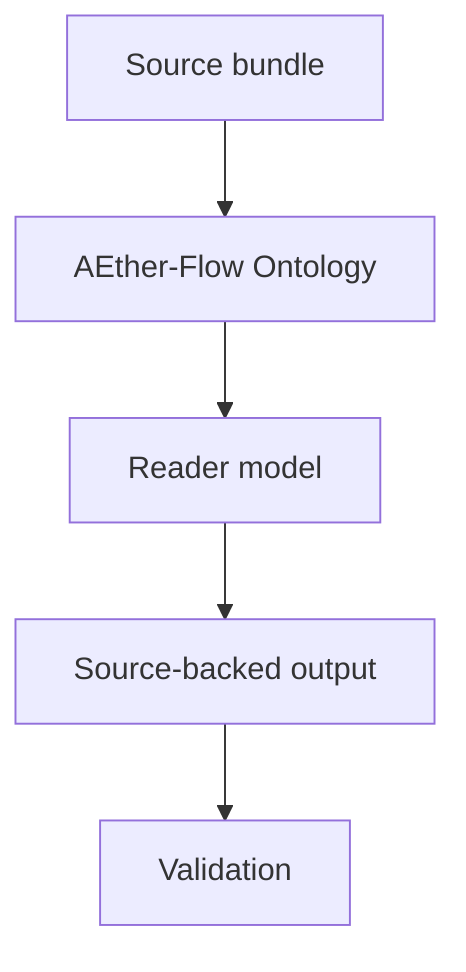

# AEther-Flow Ontology Spec

## Rendering Intent

Teach the AEther-flow ontology as a source-backed project mechanism. The explanation must start from the subject, not from page metadata, renderer behavior, or derivative status. Generated outputs remain human-readable derivatives.

## Required Diagrams

<!-- mermaid-diagram-id: ontology-model-map -->

## Source-Backed Summary

Summary heading: `Summary of AEther-Flow Ontology`

Summary text:

AEther-Flow ontology names the project vocabulary for substrate, flow, relational structure, and the intended bridge toward relativistic geometry. Its function is to organize hypotheses and derivational targets, not to declare empirical acceptance. The ontology is useful only when its assumptions, mathematical objects, and claim boundaries are kept separate from generated explanations and from benchmark equations that have not yet been derived from the substrate.

Summary source basis:

- `README.md`
- `AGENTS.md`
- `ontology/aether-and-aether-flow.md`
- `registries/TEX_SOURCE_REGISTRY.csv`

## Required Content Blocks

- subject_summary: A source-backed summary of AEther-Flow Ontology with plain-language grounding in `README.md` and `AGENTS.md`.
- what_this_does: Plain-language reader block for What This Does grounded in `README.md` and `AGENTS.md`; it must teach the project mechanism, preserve authority boundaries, and expose source evidence.
- why_aether_needs_it: Plain-language reader block for Why AEther Needs It grounded in `README.md` and `AGENTS.md`; it must teach the project mechanism, preserve authority boundaries, and expose source evidence.
- system_map: Plain-language reader block for System Map grounded in `README.md` and `AGENTS.md`; it must teach the project mechanism, preserve authority boundaries, and expose source evidence.
- how_it_works: Plain-language reader block for How It Works grounded in `README.md` and `AGENTS.md`; it must teach the project mechanism, preserve authority boundaries, and expose source evidence.
- objects_and_authority: Plain-language reader block for Objects And Authority grounded in `README.md` and `AGENTS.md`; it must teach the project mechanism, preserve authority boundaries, and expose source evidence.
- example: Plain-language reader block for Example grounded in `README.md` and `AGENTS.md`; it must teach the project mechanism, preserve authority boundaries, and expose source evidence.
- non_example: Plain-language reader block for Non-Example grounded in `README.md` and `AGENTS.md`; it must teach the project mechanism, preserve authority boundaries, and expose source evidence.
- common_confusions: Plain-language reader block for Common Confusions grounded in `README.md` and `AGENTS.md`; it must teach the project mechanism, preserve authority boundaries, and expose source evidence.
- what_this_does_not_authorize: Plain-language reader block for What This Does Not Authorize grounded in `README.md` and `AGENTS.md`; it must teach the project mechanism, preserve authority boundaries, and expose source evidence.
- source_map: Plain-language reader block for Source Map grounded in `README.md` and `AGENTS.md`; it must teach the project mechanism, preserve authority boundaries, and expose source evidence.
- next_reading_path: Plain-language reader block for Next Reading Path grounded in `README.md` and `AGENTS.md`; it must teach the project mechanism, preserve authority boundaries, and expose source evidence.
