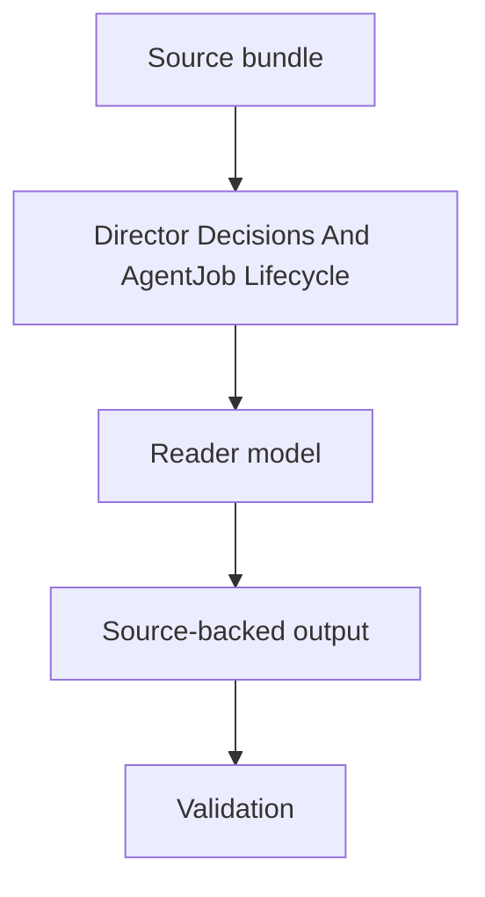

# Director Decisions And AgentJob Lifecycle Spec

## Rendering Intent

Teach Director decisions and AgentJob lifecycle as a source-backed project mechanism. The explanation must start from the subject, not from page metadata, renderer behavior, or derivative status. Generated outputs remain human-readable derivatives.

## Required Diagrams

<!-- mermaid-diagram-id: director-agentjob-lifecycle-map -->

## Source-Backed Summary

Summary heading: `Summary of Director Decisions And AgentJob Lifecycle`

Summary text:

Director decisions and AgentJobs are the control path that prevents open-ended work. The Director selects a role and one bounded objective; the AgentJob records allowed reads, allowed writes, expected outputs, validators, stop conditions, and claim boundary; the execution role performs the work; the completion records command evidence and verdict; the handoff preserves the next state. This lifecycle is project-control authority, not physics authority.

Summary source basis:

- `AGENTS.md`
- `research_control/README.md`
- `research_control/AGENTS.md`
- `.agents/schemas/AGENT_JOB_SCHEMA.md`

## Required Content Blocks

- subject_summary: A source-backed summary of Director Decisions And AgentJob Lifecycle with plain-language grounding in `AGENTS.md` and `research_control/README.md`.
- what_this_does: Plain-language reader block for What This Does grounded in `AGENTS.md` and `research_control/README.md`; it must teach the project mechanism, preserve authority boundaries, and expose source evidence.
- why_aether_needs_it: Plain-language reader block for Why AEther Needs It grounded in `AGENTS.md` and `research_control/README.md`; it must teach the project mechanism, preserve authority boundaries, and expose source evidence.
- system_map: Plain-language reader block for System Map grounded in `AGENTS.md` and `research_control/README.md`; it must teach the project mechanism, preserve authority boundaries, and expose source evidence.
- how_it_works: Plain-language reader block for How It Works grounded in `AGENTS.md` and `research_control/README.md`; it must teach the project mechanism, preserve authority boundaries, and expose source evidence.
- objects_and_authority: Plain-language reader block for Objects And Authority grounded in `AGENTS.md` and `research_control/README.md`; it must teach the project mechanism, preserve authority boundaries, and expose source evidence.
- example: Plain-language reader block for Example grounded in `AGENTS.md` and `research_control/README.md`; it must teach the project mechanism, preserve authority boundaries, and expose source evidence.
- non_example: Plain-language reader block for Non-Example grounded in `AGENTS.md` and `research_control/README.md`; it must teach the project mechanism, preserve authority boundaries, and expose source evidence.
- common_confusions: Plain-language reader block for Common Confusions grounded in `AGENTS.md` and `research_control/README.md`; it must teach the project mechanism, preserve authority boundaries, and expose source evidence.
- what_this_does_not_authorize: Plain-language reader block for What This Does Not Authorize grounded in `AGENTS.md` and `research_control/README.md`; it must teach the project mechanism, preserve authority boundaries, and expose source evidence.
- source_map: Plain-language reader block for Source Map grounded in `AGENTS.md` and `research_control/README.md`; it must teach the project mechanism, preserve authority boundaries, and expose source evidence.
- next_reading_path: Plain-language reader block for Next Reading Path grounded in `AGENTS.md` and `research_control/README.md`; it must teach the project mechanism, preserve authority boundaries, and expose source evidence.
