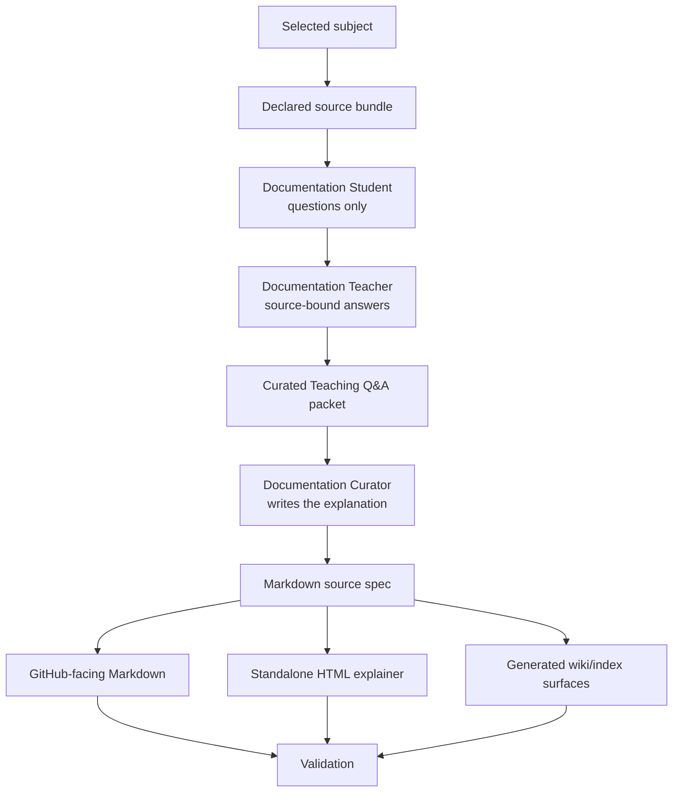

# Documentation Curator Teaching Loop Spec

## Rendering Intent

Teach the Documentation Curator teaching loop as a source-backed project mechanism. The explanation must start from the subject, not from page metadata, renderer behavior, or derivative status. Generated outputs remain human-readable derivatives.

## Required Diagrams

<!-- mermaid-diagram-id: teaching-loop-map -->

## Source-Backed Summary

Summary heading: `Summary of Documentation Curator Teaching Loop`

Summary text:

The Documentation Curator teaching loop improves explanations without changing authority. The Curator selects a subject and source bundle. Documentation Student asks reader-diagnostic questions. Documentation Teacher answers only from the selected sources. The Curator turns that support into a curated teaching packet, a Markdown source spec, GitHub-facing Markdown, tracked standalone HTML, and generated wiki navigation surfaces. Student and Teacher do not write tracked docs directly.

Summary source basis:

- `AGENTS.md`
- `.agents/roles/research_ops/documentation-curator.v1.0.0.md`
- `.agents/roles/research_ops/documentation-student.v0.1.0.md`
- `.agents/roles/research_ops/documentation-teacher.v0.1.0.md`

## Required Content Blocks

- subject_summary: A source-backed summary of Documentation Curator Teaching Loop with plain-language grounding in `AGENTS.md` and `.agents/roles/research_ops/documentation-curator.v1.0.0.md`.
- what_this_does: Plain-language reader block for What This Does grounded in `AGENTS.md` and `.agents/roles/research_ops/documentation-curator.v1.0.0.md`; it must teach the project mechanism, preserve authority boundaries, and expose source evidence.
- why_aether_needs_it: Plain-language reader block for Why AEther Needs It grounded in `AGENTS.md` and `.agents/roles/research_ops/documentation-curator.v1.0.0.md`; it must teach the project mechanism, preserve authority boundaries, and expose source evidence.
- system_map: Plain-language reader block for System Map grounded in `AGENTS.md` and `.agents/roles/research_ops/documentation-curator.v1.0.0.md`; it must teach the project mechanism, preserve authority boundaries, and expose source evidence.
- how_it_works: Plain-language reader block for How It Works grounded in `AGENTS.md` and `.agents/roles/research_ops/documentation-curator.v1.0.0.md`; it must teach the project mechanism, preserve authority boundaries, and expose source evidence.
- objects_and_authority: Plain-language reader block for Objects And Authority grounded in `AGENTS.md` and `.agents/roles/research_ops/documentation-curator.v1.0.0.md`; it must teach the project mechanism, preserve authority boundaries, and expose source evidence.
- example: Plain-language reader block for Example grounded in `AGENTS.md` and `.agents/roles/research_ops/documentation-curator.v1.0.0.md`; it must teach the project mechanism, preserve authority boundaries, and expose source evidence.
- non_example: Plain-language reader block for Non-Example grounded in `AGENTS.md` and `.agents/roles/research_ops/documentation-curator.v1.0.0.md`; it must teach the project mechanism, preserve authority boundaries, and expose source evidence.
- common_confusions: Plain-language reader block for Common Confusions grounded in `AGENTS.md` and `.agents/roles/research_ops/documentation-curator.v1.0.0.md`; it must teach the project mechanism, preserve authority boundaries, and expose source evidence.
- what_this_does_not_authorize: Plain-language reader block for What This Does Not Authorize grounded in `AGENTS.md` and `.agents/roles/research_ops/documentation-curator.v1.0.0.md`; it must teach the project mechanism, preserve authority boundaries, and expose source evidence.
- source_map: Plain-language reader block for Source Map grounded in `AGENTS.md` and `.agents/roles/research_ops/documentation-curator.v1.0.0.md`; it must teach the project mechanism, preserve authority boundaries, and expose source evidence.
- next_reading_path: Plain-language reader block for Next Reading Path grounded in `AGENTS.md` and `.agents/roles/research_ops/documentation-curator.v1.0.0.md`; it must teach the project mechanism, preserve authority boundaries, and expose source evidence.

## Teaching Q&A Basis

This topic uses `markdown/teaching-packets/documentation-curator-teaching-loop.teaching-qa.md` as explanatory support only. The packet helps the Documentation Curator identify plain-language questions, examples, non-examples, common confusions, source gaps, and boundaries. It does not create project behavior, role authority, routing behavior, validator behavior, claim status, ontology authority, benchmark authority, or generated-output authority.
