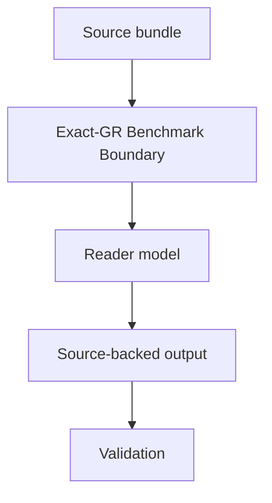

# Exact-GR Benchmark Boundary Spec

## Rendering Intent

Teach the exact-GR benchmark boundary as a source-backed project mechanism. The explanation must start from the subject, not from page metadata, renderer behavior, or derivative status. Generated outputs remain human-readable derivatives.

## Required Diagrams

<!-- mermaid-diagram-id: exact-gr-boundary-map -->

## Source-Backed Summary

Summary heading: `Summary of Exact-GR Benchmark Boundary`

Summary text:

The exact-GR benchmark boundary is the rule that ordinary general relativity supplies the comparison target while the first-principles derivation from AEther-flow substrate structure remains open. The boundary protects the difference between matching a known theory, importing a known equation, proposing a route, and deriving the route from authorized source-side assumptions. It is a claim-control mechanism as much as a physics orientation.

Summary source basis:

- `README.md`
- `AGENTS.md`
- `ontology/aether-and-aether-flow.md`
- `research_control/design/gr_derivation_burden_map.md`

## Required Content Blocks

- subject_summary: A source-backed summary of Exact-GR Benchmark Boundary with plain-language grounding in `README.md` and `AGENTS.md`.
- what_this_does: Plain-language reader block for What This Does grounded in `README.md` and `AGENTS.md`; it must teach the project mechanism, preserve authority boundaries, and expose source evidence.
- why_aether_needs_it: Plain-language reader block for Why AEther Needs It grounded in `README.md` and `AGENTS.md`; it must teach the project mechanism, preserve authority boundaries, and expose source evidence.
- system_map: Plain-language reader block for System Map grounded in `README.md` and `AGENTS.md`; it must teach the project mechanism, preserve authority boundaries, and expose source evidence.
- how_it_works: Plain-language reader block for How It Works grounded in `README.md` and `AGENTS.md`; it must teach the project mechanism, preserve authority boundaries, and expose source evidence.
- objects_and_authority: Plain-language reader block for Objects And Authority grounded in `README.md` and `AGENTS.md`; it must teach the project mechanism, preserve authority boundaries, and expose source evidence.
- example: Plain-language reader block for Example grounded in `README.md` and `AGENTS.md`; it must teach the project mechanism, preserve authority boundaries, and expose source evidence.
- non_example: Plain-language reader block for Non-Example grounded in `README.md` and `AGENTS.md`; it must teach the project mechanism, preserve authority boundaries, and expose source evidence.
- common_confusions: Plain-language reader block for Common Confusions grounded in `README.md` and `AGENTS.md`; it must teach the project mechanism, preserve authority boundaries, and expose source evidence.
- what_this_does_not_authorize: Plain-language reader block for What This Does Not Authorize grounded in `README.md` and `AGENTS.md`; it must teach the project mechanism, preserve authority boundaries, and expose source evidence.
- source_map: Plain-language reader block for Source Map grounded in `README.md` and `AGENTS.md`; it must teach the project mechanism, preserve authority boundaries, and expose source evidence.
- next_reading_path: Plain-language reader block for Next Reading Path grounded in `README.md` and `AGENTS.md`; it must teach the project mechanism, preserve authority boundaries, and expose source evidence.
