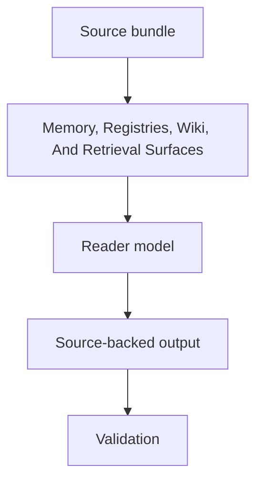

# Memory, Registries, Wiki, And Retrieval Surfaces Spec

## Rendering Intent

Teach memory, registries, wiki, and retrieval surfaces as a source-backed project mechanism. The explanation must start from the subject, not from page metadata, renderer behavior, or derivative status. Generated outputs remain human-readable derivatives.

## Required Diagrams

<!-- mermaid-diagram-id: memory-registry-retrieval-map -->

## Source-Backed Summary

Summary heading: `Summary of Memory, Registries, Wiki, And Retrieval Surfaces`

Summary text:

The memory system connects tracked source objects to generated wiki notes, indexes, semantic extracts, relationship rows, file-object rows, and local retrieval surfaces. Its purpose is discoverability and auditability: it helps agents find the right source and see whether generated outputs are stale. It does not let local memory override tracked sources, control state, registries, or validation failures.

Summary source basis:

- `AGENTS.md`
- `.codex/skills/project-memory-system/SKILL.md`
- `.codex/skills/html-visual-explainer/SKILL.md`
- `registries/MARKDOWN_SOURCE_REGISTRY.csv`

## Required Content Blocks

- subject_summary: A source-backed summary of Memory, Registries, Wiki, And Retrieval Surfaces with plain-language grounding in `AGENTS.md` and `.codex/skills/project-memory-system/SKILL.md`.
- what_this_does: Plain-language reader block for What This Does grounded in `AGENTS.md` and `.codex/skills/project-memory-system/SKILL.md`; it must teach the project mechanism, preserve authority boundaries, and expose source evidence.
- why_aether_needs_it: Plain-language reader block for Why AEther Needs It grounded in `AGENTS.md` and `.codex/skills/project-memory-system/SKILL.md`; it must teach the project mechanism, preserve authority boundaries, and expose source evidence.
- system_map: Plain-language reader block for System Map grounded in `AGENTS.md` and `.codex/skills/project-memory-system/SKILL.md`; it must teach the project mechanism, preserve authority boundaries, and expose source evidence.
- how_it_works: Plain-language reader block for How It Works grounded in `AGENTS.md` and `.codex/skills/project-memory-system/SKILL.md`; it must teach the project mechanism, preserve authority boundaries, and expose source evidence.
- objects_and_authority: Plain-language reader block for Objects And Authority grounded in `AGENTS.md` and `.codex/skills/project-memory-system/SKILL.md`; it must teach the project mechanism, preserve authority boundaries, and expose source evidence.
- example: Plain-language reader block for Example grounded in `AGENTS.md` and `.codex/skills/project-memory-system/SKILL.md`; it must teach the project mechanism, preserve authority boundaries, and expose source evidence.
- non_example: Plain-language reader block for Non-Example grounded in `AGENTS.md` and `.codex/skills/project-memory-system/SKILL.md`; it must teach the project mechanism, preserve authority boundaries, and expose source evidence.
- common_confusions: Plain-language reader block for Common Confusions grounded in `AGENTS.md` and `.codex/skills/project-memory-system/SKILL.md`; it must teach the project mechanism, preserve authority boundaries, and expose source evidence.
- what_this_does_not_authorize: Plain-language reader block for What This Does Not Authorize grounded in `AGENTS.md` and `.codex/skills/project-memory-system/SKILL.md`; it must teach the project mechanism, preserve authority boundaries, and expose source evidence.
- source_map: Plain-language reader block for Source Map grounded in `AGENTS.md` and `.codex/skills/project-memory-system/SKILL.md`; it must teach the project mechanism, preserve authority boundaries, and expose source evidence.
- next_reading_path: Plain-language reader block for Next Reading Path grounded in `AGENTS.md` and `.codex/skills/project-memory-system/SKILL.md`; it must teach the project mechanism, preserve authority boundaries, and expose source evidence.
