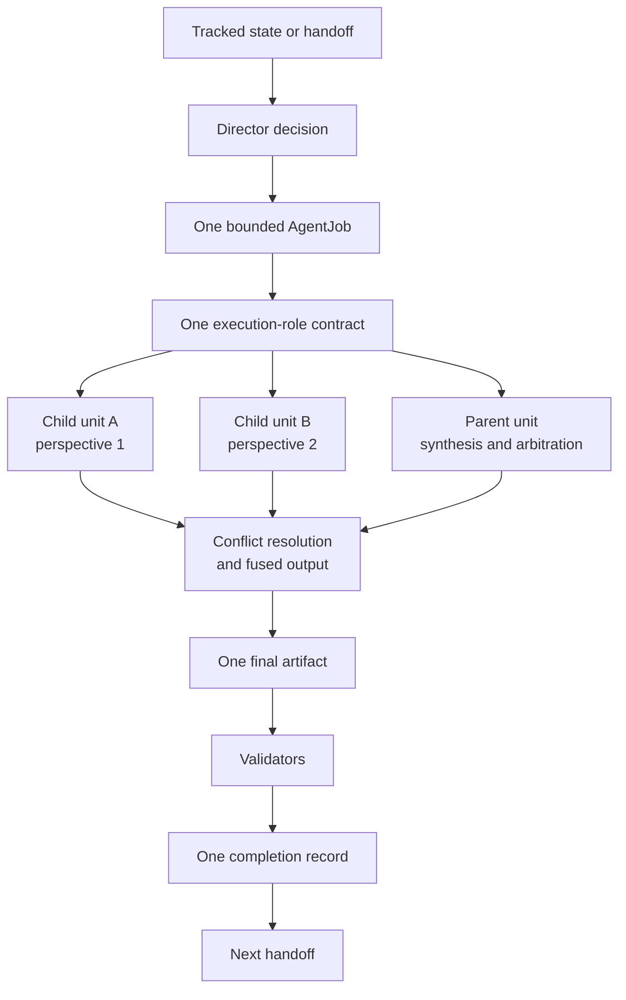

# Parent-Child Parallel Synthesis Spec

## Rendering Intent

Teach parent-child parallel synthesis as a source-backed project mechanism. The explanation must start from the subject, not from page metadata, renderer behavior, or derivative status. Generated outputs remain human-readable derivatives.

## Required Diagrams

<!-- mermaid-diagram-id: parent-child-authority-map -->

## Source-Backed Summary

Summary heading: `Summary of Parent-Child Parallel Synthesis`

Summary text:

Parent-child parallel synthesis increases analytical pressure inside one bounded AgentJob. A parent unit and two child-perspective units may examine the same problem from different angles, but all units inherit the outer job source restrictions, write allowlist, validators, stop conditions, claim boundary, and execution-role contract. Child outputs are support artifacts. The parent resolves conflicts into one fused output, one validation path, one completion record, and one handoff.

Summary source basis:

- `AGENTS.md`
- `research_control/README.md`
- `research_control/AGENTS.md`
- `.agents/schemas/AGENT_JOB_SCHEMA.md`

## Required Content Blocks

- subject_summary: A source-backed summary of Parent-Child Parallel Synthesis with plain-language grounding in `AGENTS.md` and `research_control/README.md`.
- what_this_does: Plain-language reader block for What This Does grounded in `AGENTS.md` and `research_control/README.md`; it must teach the project mechanism, preserve authority boundaries, and expose source evidence.
- why_aether_needs_it: Plain-language reader block for Why AEther Needs It grounded in `AGENTS.md` and `research_control/README.md`; it must teach the project mechanism, preserve authority boundaries, and expose source evidence.
- system_map: Plain-language reader block for System Map grounded in `AGENTS.md` and `research_control/README.md`; it must teach the project mechanism, preserve authority boundaries, and expose source evidence.
- how_it_works: Plain-language reader block for How It Works grounded in `AGENTS.md` and `research_control/README.md`; it must teach the project mechanism, preserve authority boundaries, and expose source evidence.
- objects_and_authority: Plain-language reader block for Objects And Authority grounded in `AGENTS.md` and `research_control/README.md`; it must teach the project mechanism, preserve authority boundaries, and expose source evidence.
- example: Plain-language reader block for Example grounded in `AGENTS.md` and `research_control/README.md`; it must teach the project mechanism, preserve authority boundaries, and expose source evidence.
- non_example: Plain-language reader block for Non-Example grounded in `AGENTS.md` and `research_control/README.md`; it must teach the project mechanism, preserve authority boundaries, and expose source evidence.
- common_confusions: Plain-language reader block for Common Confusions grounded in `AGENTS.md` and `research_control/README.md`; it must teach the project mechanism, preserve authority boundaries, and expose source evidence.
- what_this_does_not_authorize: Plain-language reader block for What This Does Not Authorize grounded in `AGENTS.md` and `research_control/README.md`; it must teach the project mechanism, preserve authority boundaries, and expose source evidence.
- source_map: Plain-language reader block for Source Map grounded in `AGENTS.md` and `research_control/README.md`; it must teach the project mechanism, preserve authority boundaries, and expose source evidence.
- next_reading_path: Plain-language reader block for Next Reading Path grounded in `AGENTS.md` and `research_control/README.md`; it must teach the project mechanism, preserve authority boundaries, and expose source evidence.

## Teaching Q&A Basis

This topic uses `markdown/teaching-packets/parent-child-synthesis.teaching-qa.md` as explanatory support only. The packet helps the Documentation Curator identify plain-language questions, examples, non-examples, common confusions, source gaps, and boundaries. It does not create project behavior, role authority, routing behavior, validator behavior, claim status, ontology authority, benchmark authority, or generated-output authority.
