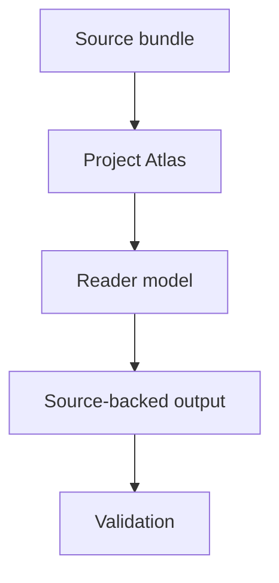

# Project Atlas Spec

## Rendering Intent

Teach the project atlas as a source-backed project mechanism. The explanation must start from the subject, not from page metadata, renderer behavior, or derivative status. Generated outputs remain human-readable derivatives.

## Required Diagrams

<!-- mermaid-diagram-id: project-atlas-map -->

## Source-Backed Summary

Summary heading: `Summary of Project Atlas`

Summary text:

Project Atlas is the entry map for AEther-Flow. It connects the physics program, the exact-GR benchmark boundary, the open derivation burden, research-control workflows, source authority, validators, roles, skills, memory, and generated documentation surfaces into one navigable model. Its function is orientation, not authority: it tells readers which governed source lane to inspect next and why generated explainers remain noncanonical.

Summary source basis:

- `README.md`
- `AGENTS.md`
- `research_control/README.md`
- `markdown/html-explainer-specs/source-authority-explainer.md`

## Required Content Blocks

- subject_summary: A source-backed summary of Project Atlas with plain-language grounding in `README.md` and `AGENTS.md`.
- what_this_does: Plain-language reader block for What This Does grounded in `README.md` and `AGENTS.md`; it must teach the project mechanism, preserve authority boundaries, and expose source evidence.
- why_aether_needs_it: Plain-language reader block for Why AEther Needs It grounded in `README.md` and `AGENTS.md`; it must teach the project mechanism, preserve authority boundaries, and expose source evidence.
- system_map: Plain-language reader block for System Map grounded in `README.md` and `AGENTS.md`; it must teach the project mechanism, preserve authority boundaries, and expose source evidence.
- how_it_works: Plain-language reader block for How It Works grounded in `README.md` and `AGENTS.md`; it must teach the project mechanism, preserve authority boundaries, and expose source evidence.
- objects_and_authority: Plain-language reader block for Objects And Authority grounded in `README.md` and `AGENTS.md`; it must teach the project mechanism, preserve authority boundaries, and expose source evidence.
- example: Plain-language reader block for Example grounded in `README.md` and `AGENTS.md`; it must teach the project mechanism, preserve authority boundaries, and expose source evidence.
- non_example: Plain-language reader block for Non-Example grounded in `README.md` and `AGENTS.md`; it must teach the project mechanism, preserve authority boundaries, and expose source evidence.
- common_confusions: Plain-language reader block for Common Confusions grounded in `README.md` and `AGENTS.md`; it must teach the project mechanism, preserve authority boundaries, and expose source evidence.
- what_this_does_not_authorize: Plain-language reader block for What This Does Not Authorize grounded in `README.md` and `AGENTS.md`; it must teach the project mechanism, preserve authority boundaries, and expose source evidence.
- source_map: Plain-language reader block for Source Map grounded in `README.md` and `AGENTS.md`; it must teach the project mechanism, preserve authority boundaries, and expose source evidence.
- next_reading_path: Plain-language reader block for Next Reading Path grounded in `README.md` and `AGENTS.md`; it must teach the project mechanism, preserve authority boundaries, and expose source evidence.
