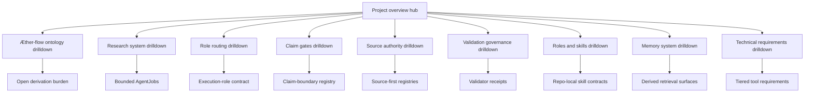
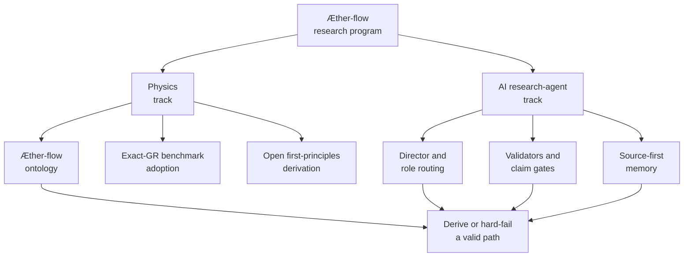

# Project Overview Spec

## Rendering Intent

Create a self-contained tracked HTML hub for the research-atlas explainer set.
The page must orient a technical reader to the project without requiring prior
repository knowledge. It should show the project as a dual physics-and-AI
research program, then route readers to focused drilldowns:

- `Æther-flow ontology`: high-level substrate model plus low-level readout and
  derivation burden.
- `Research system`: Director, AgentJobs, validation, completions, and
  handoffs.
- `Role routing`: how roles are selected and constrained for one job.
- `Claim gates`: how hypotheses, candidates, refutations, blocked claims, and
  negative results are handled.
- `Source authority`: how TeX, registries, Markdown, generated wiki/PDF/HTML,
  and `.local/` scratch layers relate.
- `Roles and skills`: registered roles, governed repo-local skills, and
  evidence-labeled support-skill associations.
- `Memory system`: CSV memory spine and derived wiki, Obsidian, semantic, and
  query surfaces.
- `Technical requirements`: tiered requirements for reading, validating,
  regenerating Mermaid HTML, using local retrieval, and refreshing PDFs.

The page should stop explaining what an ontology is in general. It should
explain what this project means by the `Æther-flow ontology`.

## Shared Research-Atlas Visual System

Use one visual language across this hub and every drilldown page:

- Authority color: canonical sources and registries.
- Physics color: ontology, benchmark, derivation burden, and claim gates.
- Workflow color: Director decisions, AgentJobs, roles, validation, completion,
  and handoff.
- Generated-derivative color: HTML, wiki notes, PDFs, and local retrieval
  surfaces.
- Warning/open-burden color: unresolved derivation steps, blocked promotion,
  and no-go or negative-result preservation.
- Validation color: passing checks, source parity, and successful receipts.

Mermaid diagrams must use the governed build-time inline-SVG path and should
visually match the HTML palette and typography.

## Required Visual Structure

- Source-backed coverage rows: render `Source-Backed Coverage` content blocks
  as full-width horizontal rows rather than narrow multi-column cards. Tables
  must use readable auto layout, with any wide overflow scoped inside the
  content block instead of the page body.
- Responsive containment: navigation chips, grids, tables, code paths, source
  drilldowns, and diagram shells must not create body-level horizontal overflow
  on mobile or desktop viewports.
- Adaptive diagram fit: diagram-backed boxes must read the rendered
  SVG viewBox, set the box height from diagram aspect ratio and available
  width within bounded min/max limits, and make Fit recompute that best-fit
  geometry so horizontal diagrams do not collapse to intrinsic SVG width.
- Three-layer readability: stack the high-level, operational, and evidence
  layer sections vertically; cards inside each layer must auto-fit at a
  readable minimum width rather than nesting fixed three-column grids.
- Hero: state the project as a dual physics-and-AI research program.
- Hub links: grouped drilldown cards for ontology, research system, role
  routing, claim gates, source authority, validation governance, roles and
  skills, memory system, and technical requirements.
- Group links by use case: understand the research idea, understand the agent
  workflow, understand authority and memory, and run or regenerate the system.
- High-level model: project purpose and the two co-developing tracks.
- Operational model: how the research system turns questions into bounded jobs
  and checked outputs.
- Low-level evidence model: source files, registry rows, generated artifacts,
  and validator receipts.
- All Source Materials section: complete source list with source-path evidence; claim-boundary metadata remains in the source spec.
- Claim-boundary panel: human-only, non-authoritative, no physics promotion.

## Required Diagrams

<!-- mermaid-diagram-id: research-atlas-hub -->

<!-- mermaid-diagram-id: dual-track-map -->

## Source-Backed Summary

Summary heading: `Summary of Project Overview`

Summary text:

AEther-Flow is organized around two coupled systems. The physics system keeps ordinary exact general relativity as the observable benchmark while treating any first-principles derivation from Æther or Æther-flow substrate structure as open until a gated source-side derivation succeeds. The AI research-agent system supplies the operating discipline: tracked state, Director decisions, bounded AgentJobs, role contracts, validators, registries, handoffs, and generated explanatory surfaces. The project needs both systems because speculative physics can drift into unsupported certainty unless every proposal, refutation, repair, and negative result remains source-bound and auditable. The overview functions as the entry map for that structure: physics terms route to ontology and claim gates; workflow questions route to research system, role routing, and research control; authority questions route to source authority, roles and skills, memory, and technical requirements.

Summary source basis:

- `README.md`
- `AGENTS.md`
- `ontology/aether-and-aether-flow.md`
- `research_control/README.md`

## Teaching Q&A Basis

This spec uses the curated teaching packet at:

- `markdown/teaching-packets/project-overview.teaching-qa.md`

The packet is explanatory support only. It is derived from the declared source materials and does not promote claims, change role authority, change routing behavior, change schemas, change validators, or make generated docs authoritative.

## Required Content Blocks

- subject_summary: A source-backed summary of Project Overview that directly explains the project subject, its functionality, why it matters, how it fits the physics or AI research-agent system, and its grounding source paths: `README.md`, `AGENTS.md`, `ontology/aether-and-aether-flow.md`, `research_control/README.md`.
- atlas_navigation: A plain-language source-backed block on two-lane navigation that explains the project functionality, common confusion, authority boundary, and next reading path; source paths: `README.md`, `AGENTS.md`, `research_control/README.md`.
- research_idea: A plain-language source-backed block on physics research lane that explains the project functionality, common confusion, authority boundary, and next reading path; source paths: `README.md`, `ontology/aether-and-aether-flow.md`, `registries/CLAIM_BOUNDARY_REGISTRY.csv`.
- agent_workflow: A plain-language source-backed block on ai research-agent lane that explains the project functionality, common confusion, authority boundary, and next reading path; source paths: `research_control/README.md`, `registries/AGENT_JOB_REGISTRY.csv`, `registries/DIRECTOR_DECISION_REGISTRY.csv`.
- authority_memory: A plain-language source-backed block on authority and memory spine that explains the project functionality, common confusion, authority boundary, and next reading path; source paths: `AGENTS.md`, `registries/MARKDOWN_SOURCE_REGISTRY.csv`, `registries/HTML_EXPLAINER_REGISTRY.csv`, `registries/FILE_OBJECT_REGISTRY.csv`.
- run_regenerate_system: A plain-language source-backed block on operator path that explains the project functionality, common confusion, authority boundary, and next reading path; source paths: `README.md`, `Makefile`, `.codex/skills/project-memory-system/scripts/bootstrap_memory_system.py`.
