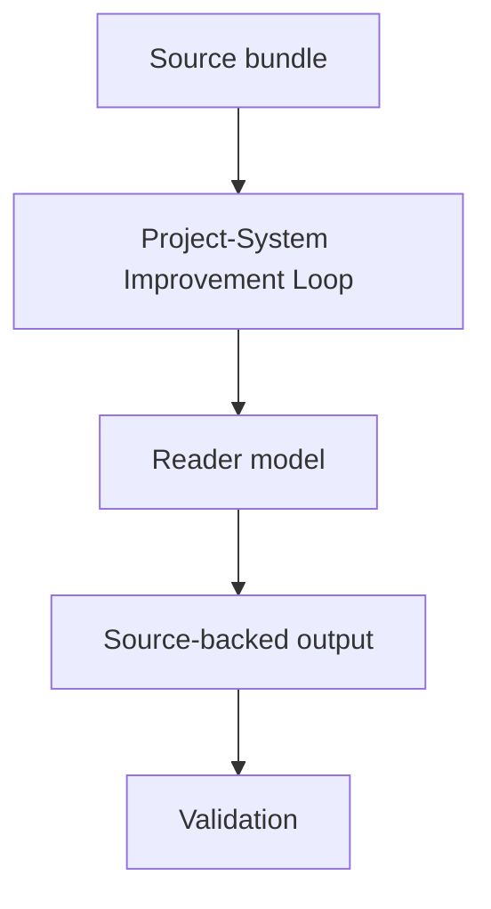

# Project-System Improvement Loop Spec

## Rendering Intent

Teach the project-system improvement loop as a source-backed project mechanism. The explanation must start from the subject, not from page metadata, renderer behavior, or derivative status. Generated outputs remain human-readable derivatives.

## Required Diagrams

<!-- mermaid-diagram-id: project-system-improvement-map -->

## Source-Backed Summary

Summary heading: `Summary of Project-System Improvement Loop`

Summary text:

The project-system improvement loop handles changes to roles, schemas, validators, memory tooling, documentation, generated-output governance, and operational reliability. It starts from classification, memory preflight, resolver state, and registered signals, then creates or reuses one bounded AgentJob. It is separate from physics continuation and must not promote claims or edit science sources as part of system repair.

Summary source basis:

- `AGENTS.md`
- `.codex/skills/improve-project-system/SKILL.md`
- `scripts/project_control/classify_project_changes.py`
- `scripts/project_control/resolve_project_improvement.py`

## Required Content Blocks

- subject_summary: A source-backed summary of Project-System Improvement Loop with plain-language grounding in `AGENTS.md` and `.codex/skills/improve-project-system/SKILL.md`.
- what_this_does: Plain-language reader block for What This Does grounded in `AGENTS.md` and `.codex/skills/improve-project-system/SKILL.md`; it must teach the project mechanism, preserve authority boundaries, and expose source evidence.
- why_aether_needs_it: Plain-language reader block for Why AEther Needs It grounded in `AGENTS.md` and `.codex/skills/improve-project-system/SKILL.md`; it must teach the project mechanism, preserve authority boundaries, and expose source evidence.
- system_map: Plain-language reader block for System Map grounded in `AGENTS.md` and `.codex/skills/improve-project-system/SKILL.md`; it must teach the project mechanism, preserve authority boundaries, and expose source evidence.
- how_it_works: Plain-language reader block for How It Works grounded in `AGENTS.md` and `.codex/skills/improve-project-system/SKILL.md`; it must teach the project mechanism, preserve authority boundaries, and expose source evidence.
- objects_and_authority: Plain-language reader block for Objects And Authority grounded in `AGENTS.md` and `.codex/skills/improve-project-system/SKILL.md`; it must teach the project mechanism, preserve authority boundaries, and expose source evidence.
- example: Plain-language reader block for Example grounded in `AGENTS.md` and `.codex/skills/improve-project-system/SKILL.md`; it must teach the project mechanism, preserve authority boundaries, and expose source evidence.
- non_example: Plain-language reader block for Non-Example grounded in `AGENTS.md` and `.codex/skills/improve-project-system/SKILL.md`; it must teach the project mechanism, preserve authority boundaries, and expose source evidence.
- common_confusions: Plain-language reader block for Common Confusions grounded in `AGENTS.md` and `.codex/skills/improve-project-system/SKILL.md`; it must teach the project mechanism, preserve authority boundaries, and expose source evidence.
- what_this_does_not_authorize: Plain-language reader block for What This Does Not Authorize grounded in `AGENTS.md` and `.codex/skills/improve-project-system/SKILL.md`; it must teach the project mechanism, preserve authority boundaries, and expose source evidence.
- source_map: Plain-language reader block for Source Map grounded in `AGENTS.md` and `.codex/skills/improve-project-system/SKILL.md`; it must teach the project mechanism, preserve authority boundaries, and expose source evidence.
- next_reading_path: Plain-language reader block for Next Reading Path grounded in `AGENTS.md` and `.codex/skills/improve-project-system/SKILL.md`; it must teach the project mechanism, preserve authority boundaries, and expose source evidence.
