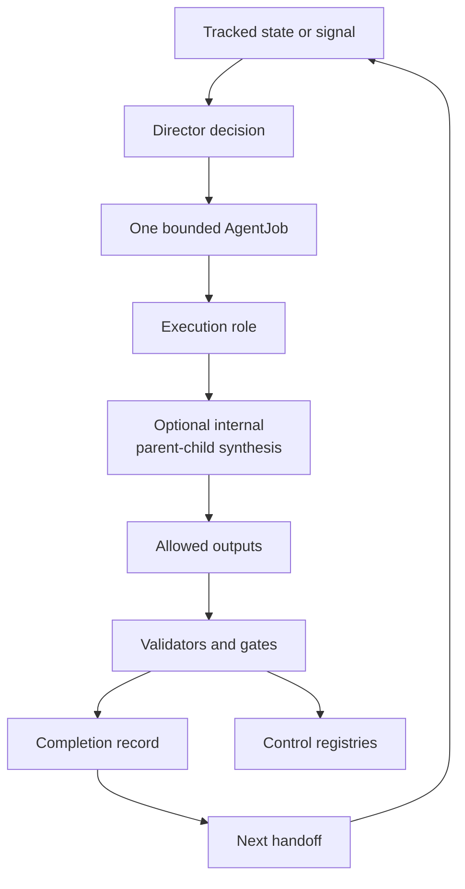
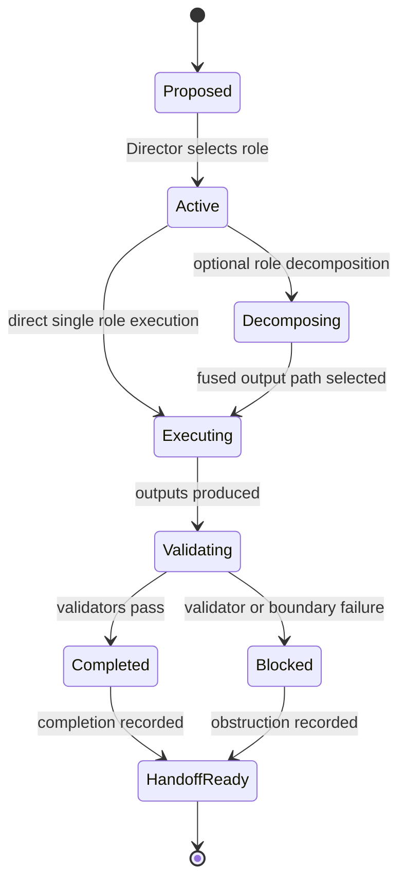

# Research System Spec

## Rendering Intent

Create a tracked HTML drilldown for the project research system. The page
should describe the system as an operational discipline for theoretical work:
questions become bounded tasks, the Director selects role and boundary, an
AgentJob constrains allowed work, validators check outputs, completions record
results, and handoffs preserve the next state.

It should also explain the optional `parent_child_parallel_synthesis` mode:
when selected, it is internal to one AgentJob, inherits the same execution-role
authority, and must end in one fused output and one completion record.

The page should keep two boundaries visible:

- `continue-research` is for physics continuation from tracked state.
- `improve-project-system` is for roles, validators, memory tooling, docs, and
  generated-doc pipelines.

The page should include a concrete object path for task execution:
`research_control/program_state.yaml` -> latest `handoff-*` -> Director
decision -> `00_TASK.yaml` -> `jobs/AJ-*.yaml` -> `roles/*.yaml` ->
`artifacts/*` -> completion YAML -> next handoff -> registries.

## Required Visual Structure

- Source-backed coverage rows: render `Source-Backed Coverage` content blocks
  as full-width horizontal rows rather than narrow multi-column cards. Tables
  must use readable auto layout, with any wide overflow scoped inside the
  content block instead of the page body.
- Responsive containment: navigation chips, grids, tables, code paths, source
  drilldowns, and diagram shells must not create body-level horizontal overflow
  on mobile or desktop viewports.
- Adaptive diagram fit: diagram-backed boxes must read the rendered
  SVG viewBox, set the box height from diagram aspect ratio and available
  width within bounded min/max limits, and make Fit recompute that best-fit
  geometry so horizontal diagrams do not collapse to intrinsic SVG width.
- Three-layer readability: stack the high-level, operational, and evidence
  layer sections vertically; cards inside each layer must auto-fit at a
  readable minimum width rather than nesting fixed three-column grids.
- High-level model: why the research system exists and how it supports both
  physics and AI research-agent development.
- Operational model: Director -> AgentJob -> role execution -> validation ->
  completion -> handoff.
- Optional parent-child synthesis model: one parent and two child perspectives
  may support the same AgentJob only as internal execution units that inherit
  authority and resolve conflicts before a PASS completion.
- Low-level evidence model: task directories, DDRs, AgentJob YAML, execution
  role records, completions, handoffs, and registries.
- Concrete trace: show the file/path lifecycle from `program_state.yaml` and a
  latest handoff through task YAML, job YAML, role YAML, artifacts,
  completion, next handoff, and registry updates.
- Workflow step inspector for each operational step.
- All Source Materials section with source-path evidence; claim-boundary metadata remains in the source spec.

## Required Diagrams

<!-- mermaid-diagram-id: research-system-loop -->

<!-- mermaid-diagram-id: agentjob-lifecycle -->

## Source-Backed Summary

Summary heading: `Summary of Research System`

Summary text:

The research system is the governed workflow that turns a question, continuation state, or project-improvement signal into bounded agent work with explicit roles, decisions, registries, artifacts, validation, completion records, and handoffs. Its function is to separate physics continuation from project-system maintenance, resolve tracked state before acting, assign one bounded AgentJob, constrain that job with role authority and allowlists, and preserve completion evidence for the next handoff. Optional parent-child synthesis can add analytical perspectives inside one AgentJob, but it cannot create new authority, extra jobs, or independent outputs. The system matters because AEther-Flow is not an informal chat log or autonomous proof engine. It is a controlled research program where progress, obstructions, generated derivatives, and negative results must remain reproducible and auditable.

Summary source basis:

- `research_control/AGENTS.md`
- `research_control/README.md`
- `.codex/skills/continue-research/SKILL.md`
- `registries/AGENT_JOB_REGISTRY.csv`
- `registries/DIRECTOR_DECISION_REGISTRY.csv`

## Required Content Blocks

- subject_summary: A source-backed summary of Research System that directly explains the project subject, its functionality, why it matters, how it fits the physics or AI research-agent system, and its grounding source paths: `research_control/AGENTS.md`, `research_control/README.md`, `.codex/skills/continue-research/SKILL.md`, `registries/AGENT_JOB_REGISTRY.csv`.
- state_entry: A source-backed reader block on state entry that explains the project functionality, why it matters, how it works inside AEther-Flow, what boundary constrains it, and where to inspect next; source paths: `research_control/AGENTS.md`, `research_control/README.md`.
- director_decision: A source-backed reader block on director decision that explains the project functionality, why it matters, how it works inside AEther-Flow, what boundary constrains it, and where to inspect next; source paths: `registries/DIRECTOR_DECISION_REGISTRY.csv`, `research_control/README.md`.
- agentjob_lifecycle: A source-backed reader block on agentjob lifecycle that explains the project functionality, why it matters, how it works inside AEther-Flow, what boundary constrains it, and where to inspect next; source paths: `.agents/schemas/AGENT_JOB_SCHEMA.md`, `registries/AGENT_JOB_REGISTRY.csv`.
- role_execution: A source-backed reader block on role execution that explains the project functionality, why it matters, how it works inside AEther-Flow, what boundary constrains it, and where to inspect next; source paths: `.agents/schemas/EXECUTION_ROLE_SCHEMA.md`, `registries/ROLE_EXECUTION_REGISTRY.csv`.
- validation_completion_handoff: A source-backed reader block on validation and handoff that explains the project functionality, why it matters, how it works inside AEther-Flow, what boundary constrains it, and where to inspect next; source paths: `research_control/templates/COMPLETION_TEMPLATE.yaml`, `scripts/research_control/validate_research_control.py`.
- registry_update: A source-backed reader block on registry update that explains the project functionality, why it matters, how it works inside AEther-Flow, what boundary constrains it, and where to inspect next; source paths: `registries/RESEARCH_TASK_REGISTRY.csv`, `registries/AGENT_JOB_REGISTRY.csv`, `registries/ROLE_EXECUTION_REGISTRY.csv`.
