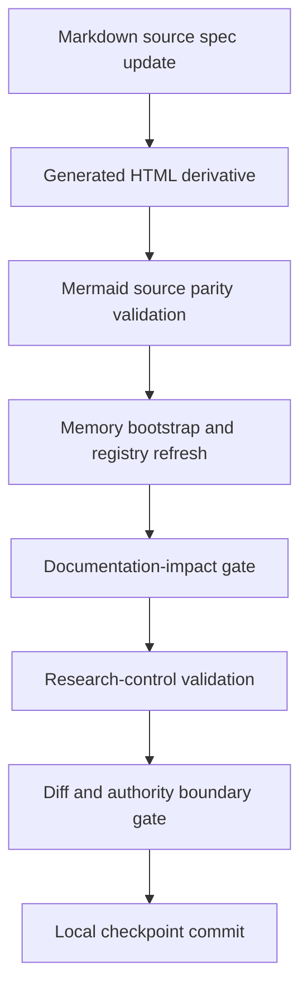
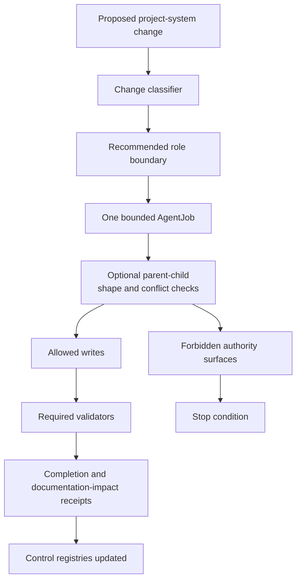

# Research-Control System Spec

## Rendering Intent

Create a tracked HTML drilldown for validation governance. The page should
explain how control-system changes remain bounded: classification, resolver
state, documentation-impact accounting, source-backed HTML rules, Mermaid
parity, bootstrap refresh, research-control validation, diff boundary checks,
and tests.

Keep source authority details summarized here and send deep authority-ladder
content to `source-authority-explainer.html`.

## Required Visual Structure

- Source-backed coverage rows: render `Source-Backed Coverage` content blocks
  as full-width horizontal rows rather than narrow multi-column cards. Tables
  must use readable auto layout, with any wide overflow scoped inside the
  content block instead of the page body.
- Responsive containment: navigation chips, grids, tables, code paths, source
  drilldowns, and diagram shells must not create body-level horizontal overflow
  on mobile or desktop viewports.
- Adaptive diagram fit: diagram-backed boxes must read the rendered
  SVG viewBox, set the box height from diagram aspect ratio and available
  width within bounded min/max limits, and make Fit recompute that best-fit
  geometry so horizontal diagrams do not collapse to intrinsic SVG width.
- Three-layer readability: stack the high-level, operational, and evidence
  layer sections vertically; cards inside each layer must auto-fit at a
  readable minimum width rather than nesting fixed three-column grids.
- High-level model: the control system exists to preserve authority boundaries
  while improving the project machinery.
- Operational model: change classification, bounded AgentJob, documentation
  impact, generated-derivative refresh, validators, and checkpoint boundary.
- Parent-child validator model: optional `parent_child_parallel_synthesis`
  remains inside one AgentJob and is checked for inherited authority, allowlist
  containment, fused output evidence, and unresolved blocking conflicts.
- Low-level evidence model: validator scripts, completion receipts, registry
  rows, source specs, and generated HTML metadata.
- Documentation Curator panel: source-spec-first tracked HTML generation.
- Teaching-loop panel: Documentation Curator v0.8.0 may use Student and
  Teacher subroles to build noncanonical teaching packets, then distill them
  into source specs, tracked HTML, and GitHub-facing Markdown without changing
  authority.
- Flexible HTML contract panel: explain `presentation_profile`,
  `layout_intent`, `required_content_blocks`, `data-content-block`, and
  source-path evidence as deterministic structural requirements.
- Workflow step inspector for the validation chain.
- All Source Materials section with source-path evidence; claim-boundary metadata remains in the source spec.

## Required Diagrams

<!-- mermaid-diagram-id: research-control-validation-flow -->

<!-- mermaid-diagram-id: control-boundary-map -->

## Source-Backed Summary

Summary heading: `Summary of Research-Control System`

Summary text:

The research-control system is the repository's governance layer for deciding
how project-system and research-continuation work may proceed. Its function is
to classify changes, resolve advisory routing, create or reuse one bounded
AgentJob, enforce role and write-path boundaries, require documentation-impact
receipts when project machinery changes, and validate that source specs,
skills, roles, registries, claim boundaries, optional parent-child
decomposition evidence, teaching Q&A packets, and generated derivatives remain
aligned. It blocks PASS completions when a parent-child synthesis lacks a
fused output or leaves a blocking conflict unresolved, and it requires
teaching-enabled documentation to keep Student and Teacher material
source-bound and noncanonical. It matters because the project deliberately
combines scientific exploration with agent workflow development; without
control records, generated HTML, GitHub-facing Markdown, teaching packets,
validators, and role contracts could drift or be mistaken for scientific
authority. The system fits the larger project by making improvements
reversible, auditable, and separate from physics claim promotion.

Summary source basis:

- `AGENTS.md`
- `research_control/README.md`
- `.codex/skills/improve-project-system/SKILL.md`
- `.agents/roles/research_ops/documentation-curator.v0.8.0.md`
- `.codex/skills/aether-teaching-explainer/SKILL.md`
- `.agents/schemas/AGENT_JOB_SCHEMA.md`
- `.agents/schemas/TEACHING_QA_PACKET_SCHEMA.md`
- `research_control/design/html_explainer_flexible_presentation_contract.md`

## Required Content Blocks

- subject_summary: Summarize the research-control system, its safety-harness role, why validators and receipts matter, and which declared sources ground the summary.
- classification_resolver: A completed classification-to-resolver walkthrough covering deterministic change classification, project-improvement signal routing, advisory resolver state, and selected authority surfaces.
- bounded_transaction: A source-backed explanation of one bounded AgentJob, optional parent-child internal decomposition, allowed writes, generated paths, forbidden paths, human-gate requirements, checkpoint gates, and stop conditions.
- flexible_html_contract: A documentation section explaining the flexible HTML explainer contract, presentation profiles, layout intent, required content blocks, subject summaries, teaching-loop enrichment, depth lint, teaching-QA validation, and generated-HTML boundaries.
- documentation_impact: A completed receipt section covering source-doc updates, no-op rationales, reason codes, generated derivatives, validators run, and why documentation impact is a receipt requirement rather than routing authority by itself.
- validator_chain: A source-backed validator chain covering bootstrap validation, Mermaid parity, emitted signal validation, documentation-impact validation, teaching-QA validation, parent-child decomposition and completion checks, research-control validation, diff checks, tests, and advisory depth lint.
