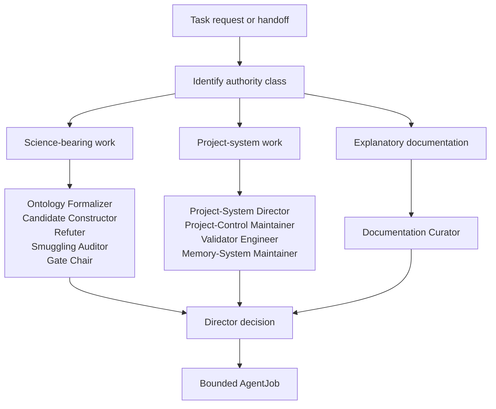
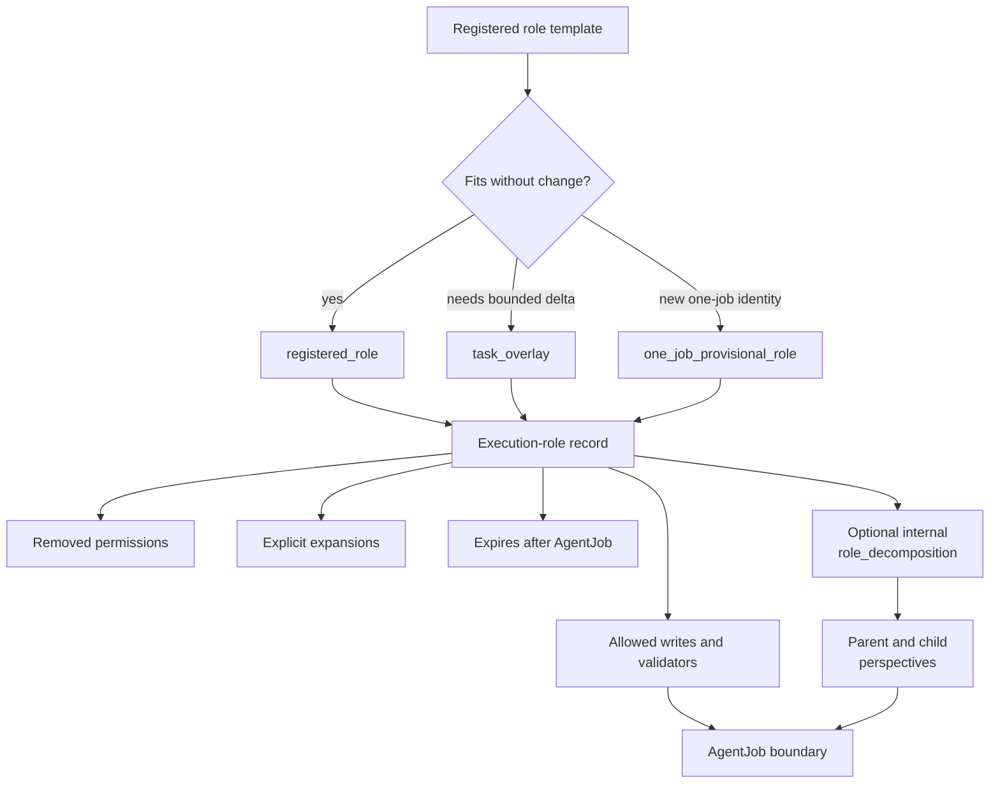

# Role Routing Spec

## Rendering Intent

Create a tracked HTML drilldown for role routing. The page should explain how
the Director chooses a role, how a role is bound to one task through an
execution-role record, and how the system distinguishes:

- registered role used directly,
- `task_overlay` for a bounded task-specific delta,
- `one_job_provisional_role` for a temporary role or distinct one-job identity.
- optional `role_decomposition` inside an AgentJob as analytical perspective
  synthesis, not role authority expansion.

The page must not change role contracts or routing rules.

## Required Visual Structure

- Source-backed coverage rows: render `Source-Backed Coverage` content blocks
  as full-width horizontal rows rather than narrow multi-column cards. Tables
  must use readable auto layout, with any wide overflow scoped inside the
  content block instead of the page body.
- Responsive containment: navigation chips, grids, tables, code paths, source
  drilldowns, and diagram shells must not create body-level horizontal overflow
  on mobile or desktop viewports.
- Adaptive diagram fit: diagram-backed boxes must read the rendered
  SVG viewBox, set the box height from diagram aspect ratio and available
  width within bounded min/max limits, and make Fit recompute that best-fit
  geometry so horizontal diagrams do not collapse to intrinsic SVG width.
- Three-layer readability: stack the high-level, operational, and evidence
  layer sections vertically; cards inside each layer must auto-fit at a
  readable minimum width rather than nesting fixed three-column grids.
- High-level model: why role routing exists.
- Operational model: problem type -> authority class -> role candidates ->
  selected role -> execution-role record -> AgentJob.
- Decomposition boundary: if `parent_child_parallel_synthesis` is present, it
  inherits the existing execution-role record and preserves the same AgentJob
  boundary.
- Low-level evidence model: role registry, execution-role registry, Director
  decision registry, schema, and task-local role record.
- Teaching model: plain-language opening, glossary, guided walkthrough,
  learner questions, examples and non-examples, misconception repairs,
  authority boundaries, retrieval prompts, and next-reading path from the
  curated teaching packet.
- Workflow step inspector for role selection.
- All Source Materials section with source-path evidence; claim-boundary metadata remains in the source spec.

## Required Diagrams

<!-- mermaid-diagram-id: role-routing-decision-tree -->

<!-- mermaid-diagram-id: execution-role-contract-map -->

## Source-Backed Summary

Summary heading: `Summary of Role Routing`

Summary text:

Role routing is the project’s decision system for assigning bounded work to the correct registered role or task-local execution overlay. Its function is to connect task state, Director decisions, base role contracts, provisional or overlay authority, and registry evidence so an agent knows who owns the change, what paths may be written, which validators are required, and when the job must stop. It also explains why optional parent-child synthesis is a decomposition of analytical perspective inside the selected AgentJob, not a new role class or permission expansion. The project needs role routing because physics roles, documentation roles, validator roles, memory roles, and project-control roles carry different authority. Collapsing them into one generic helper would risk claim promotion, direct derivative edits, or untracked control changes.

Summary source basis:

- `registries/AGENT_ROLE_REGISTRY.csv`
- `registries/ROLE_EXECUTION_REGISTRY.csv`
- `registries/DIRECTOR_DECISION_REGISTRY.csv`
- `.agents/schemas/AGENT_JOB_SCHEMA.md`
- `.agents/schemas/EXECUTION_ROLE_SCHEMA.md`

## Teaching Q&A Basis

This explainer uses the curated teaching packet at:

- `markdown/teaching-packets/role-routing.teaching-qa.md`

The packet is explanatory support only. It is derived from the declared source
materials and does not promote claims, change role authority, change routing
behavior, change schemas, change validators, or make generated docs
authoritative.

## Required Content Blocks

- subject_summary: A source-backed summary of Role Routing that directly explains the project subject, its functionality, why it matters, how it fits the physics or AI research-agent system, and its grounding source paths: `registries/AGENT_ROLE_REGISTRY.csv`, `registries/ROLE_EXECUTION_REGISTRY.csv`, `registries/DIRECTOR_DECISION_REGISTRY.csv`, `.agents/schemas/AGENT_JOB_SCHEMA.md`.
- plain_language_model: A plain-language source-backed block on plain model that explains the project functionality, common confusion, authority boundary, and next reading path; source paths: `README.md`, `AGENTS.md`, `research_control/README.md`.
- why_this_exists: A plain-language source-backed block on why routing exists that explains the project functionality, common confusion, authority boundary, and next reading path; source paths: `AGENTS.md`, `registries/AGENT_ROLE_REGISTRY.csv`.
- glossary: A plain-language source-backed block on key terms that explains the project functionality, common confusion, authority boundary, and next reading path; source paths: `registries/AGENT_ROLE_REGISTRY.csv`, `registries/ROLE_EXECUTION_REGISTRY.csv`, `.agents/schemas/EXECUTION_ROLE_SCHEMA.md`.
- guided_walkthrough: A plain-language source-backed block on routing walkthrough that explains the project functionality, common confusion, authority boundary, and next reading path; source paths: `registries/DIRECTOR_DECISION_REGISTRY.csv`, `.agents/schemas/AGENT_JOB_SCHEMA.md`.
- common_questions: A plain-language source-backed block on common questions that explains the project functionality, common confusion, authority boundary, and next reading path; source paths: `README.md`, `AGENTS.md`, `registries/DIRECTOR_DECISION_REGISTRY.csv`.
- examples_and_non_examples: A plain-language source-backed block on examples and non-examples that explains the project functionality, common confusion, authority boundary, and next reading path; source paths: `research_control/README.md`, `.agents/schemas/EXECUTION_ROLE_SCHEMA.md`, `.agents/schemas/AGENT_JOB_SCHEMA.md`.
- misconception_repairs: A plain-language source-backed block on common misunderstandings that explains the project functionality, common confusion, authority boundary, and next reading path; source paths: `AGENTS.md`, `.agents/schemas/EXECUTION_ROLE_SCHEMA.md`, `.agents/schemas/AGENT_JOB_SCHEMA.md`.
- authority_boundaries: A plain-language source-backed block on authority boundaries that explains the project functionality, common confusion, authority boundary, and next reading path; source paths: `AGENTS.md`, `research_control/README.md`, `.agents/schemas/ROLE_SCHEMA.md`.
- check_your_understanding: A plain-language source-backed block on check understanding that explains the project functionality, common confusion, authority boundary, and next reading path; source paths: `registries/AGENT_ROLE_REGISTRY.csv`, `registries/ROLE_EXECUTION_REGISTRY.csv`, `.agents/schemas/AGENT_JOB_SCHEMA.md`.
- where_to_go_next: A plain-language source-backed block on next reading that explains the project functionality, common confusion, authority boundary, and next reading path; source paths: `AGENTS.md`, `research_control/README.md`, `registries/AGENT_ROLE_REGISTRY.csv`.
