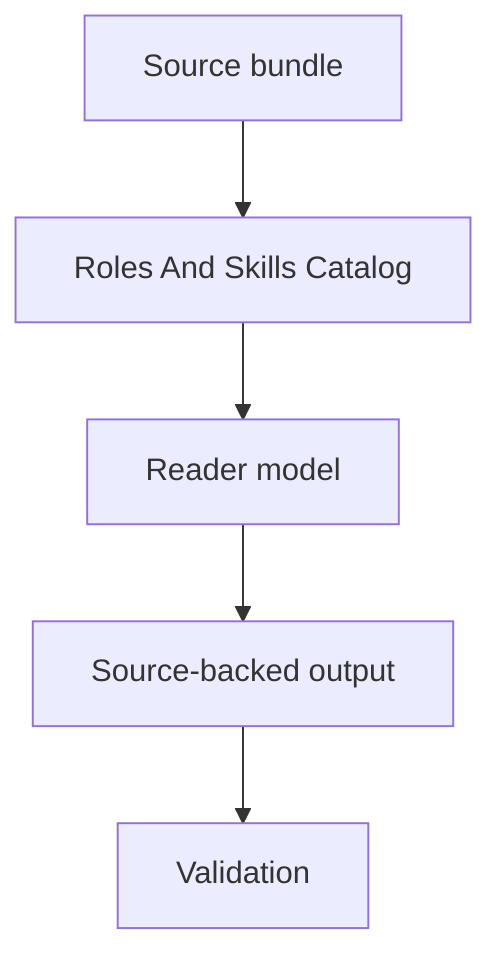

# Roles And Skills Catalog Spec

## Rendering Intent

Teach the roles and skills catalog as a source-backed project mechanism. The explanation must start from the subject, not from page metadata, renderer behavior, or derivative status. Generated outputs remain human-readable derivatives.

## Required Diagrams

<!-- mermaid-diagram-id: roles-skills-catalog-map -->

## Source-Backed Summary

Summary heading: `Summary of Roles And Skills Catalog`

Summary text:

The roles and skills catalog lists the project-governed execution roles and local skill front doors that structure work. It separates stable role authority, historical versions, task-local overlays, support subroles, and general tool availability. This matters because having a skill or tool available does not authorize source edits; only the selected role, AgentJob allowlist, and project-control contract do.

Summary source basis:

- `registries/AGENT_ROLE_REGISTRY.csv`
- `.agents/roles/research_ops/documentation-curator.v1.0.0.md`
- `.agents/roles/research_ops/documentation-student.v0.1.0.md`
- `.agents/roles/research_ops/documentation-teacher.v0.1.0.md`

## Required Content Blocks

- subject_summary: A source-backed summary of Roles And Skills Catalog with plain-language grounding in `registries/AGENT_ROLE_REGISTRY.csv` and `.agents/roles/research_ops/documentation-curator.v1.0.0.md`.
- what_this_does: Plain-language reader block for What This Does grounded in `registries/AGENT_ROLE_REGISTRY.csv` and `.agents/roles/research_ops/documentation-curator.v1.0.0.md`; it must teach the project mechanism, preserve authority boundaries, and expose source evidence.
- why_aether_needs_it: Plain-language reader block for Why AEther Needs It grounded in `registries/AGENT_ROLE_REGISTRY.csv` and `.agents/roles/research_ops/documentation-curator.v1.0.0.md`; it must teach the project mechanism, preserve authority boundaries, and expose source evidence.
- system_map: Plain-language reader block for System Map grounded in `registries/AGENT_ROLE_REGISTRY.csv` and `.agents/roles/research_ops/documentation-curator.v1.0.0.md`; it must teach the project mechanism, preserve authority boundaries, and expose source evidence.
- how_it_works: Plain-language reader block for How It Works grounded in `registries/AGENT_ROLE_REGISTRY.csv` and `.agents/roles/research_ops/documentation-curator.v1.0.0.md`; it must teach the project mechanism, preserve authority boundaries, and expose source evidence.
- objects_and_authority: Plain-language reader block for Objects And Authority grounded in `registries/AGENT_ROLE_REGISTRY.csv` and `.agents/roles/research_ops/documentation-curator.v1.0.0.md`; it must teach the project mechanism, preserve authority boundaries, and expose source evidence.
- example: Plain-language reader block for Example grounded in `registries/AGENT_ROLE_REGISTRY.csv` and `.agents/roles/research_ops/documentation-curator.v1.0.0.md`; it must teach the project mechanism, preserve authority boundaries, and expose source evidence.
- non_example: Plain-language reader block for Non-Example grounded in `registries/AGENT_ROLE_REGISTRY.csv` and `.agents/roles/research_ops/documentation-curator.v1.0.0.md`; it must teach the project mechanism, preserve authority boundaries, and expose source evidence.
- common_confusions: Plain-language reader block for Common Confusions grounded in `registries/AGENT_ROLE_REGISTRY.csv` and `.agents/roles/research_ops/documentation-curator.v1.0.0.md`; it must teach the project mechanism, preserve authority boundaries, and expose source evidence.
- what_this_does_not_authorize: Plain-language reader block for What This Does Not Authorize grounded in `registries/AGENT_ROLE_REGISTRY.csv` and `.agents/roles/research_ops/documentation-curator.v1.0.0.md`; it must teach the project mechanism, preserve authority boundaries, and expose source evidence.
- source_map: Plain-language reader block for Source Map grounded in `registries/AGENT_ROLE_REGISTRY.csv` and `.agents/roles/research_ops/documentation-curator.v1.0.0.md`; it must teach the project mechanism, preserve authority boundaries, and expose source evidence.
- next_reading_path: Plain-language reader block for Next Reading Path grounded in `registries/AGENT_ROLE_REGISTRY.csv` and `.agents/roles/research_ops/documentation-curator.v1.0.0.md`; it must teach the project mechanism, preserve authority boundaries, and expose source evidence.
