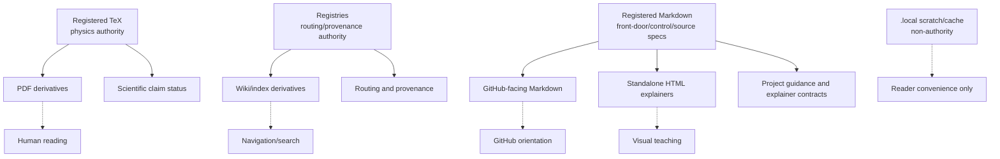

# Source Authority And Generated Derivatives Spec

## Rendering Intent

Teach source authority and generated derivatives as a source-backed project mechanism. The explanation must start from the subject, not from page metadata, renderer behavior, or derivative status. Generated outputs remain human-readable derivatives.

## Required Diagrams

<!-- mermaid-diagram-id: source-authority-trust-map -->

## Source-Backed Summary

Summary heading: `Summary of Source Authority And Generated Derivatives`

Summary text:

Source authority and generated derivatives form the trust map of AEther-Flow. Registered TeX carries physics and derivational claims; registries carry provenance, routing, generated-output, and memory fields; registered Markdown carries guidance, role and skill contracts, source specs, and control notes. HTML, GitHub-facing Markdown, wiki notes, PDFs, semantic extracts, Obsidian notes, and local caches are useful only because they point back to authority.

Summary source basis:

- `AGENTS.md`
- `.codex/skills/project-memory-system/SKILL.md`
- `.codex/skills/html-visual-explainer/SKILL.md`
- `registries/MARKDOWN_SOURCE_REGISTRY.csv`

## Required Content Blocks

- subject_summary: A source-backed summary of Source Authority And Generated Derivatives with plain-language grounding in `AGENTS.md` and `.codex/skills/project-memory-system/SKILL.md`.
- what_this_does: Plain-language reader block for What This Does grounded in `AGENTS.md` and `.codex/skills/project-memory-system/SKILL.md`; it must teach the project mechanism, preserve authority boundaries, and expose source evidence.
- why_aether_needs_it: Plain-language reader block for Why AEther Needs It grounded in `AGENTS.md` and `.codex/skills/project-memory-system/SKILL.md`; it must teach the project mechanism, preserve authority boundaries, and expose source evidence.
- system_map: Plain-language reader block for System Map grounded in `AGENTS.md` and `.codex/skills/project-memory-system/SKILL.md`; it must teach the project mechanism, preserve authority boundaries, and expose source evidence.
- how_it_works: Plain-language reader block for How It Works grounded in `AGENTS.md` and `.codex/skills/project-memory-system/SKILL.md`; it must teach the project mechanism, preserve authority boundaries, and expose source evidence.
- objects_and_authority: Plain-language reader block for Objects And Authority grounded in `AGENTS.md` and `.codex/skills/project-memory-system/SKILL.md`; it must teach the project mechanism, preserve authority boundaries, and expose source evidence.
- example: Plain-language reader block for Example grounded in `AGENTS.md` and `.codex/skills/project-memory-system/SKILL.md`; it must teach the project mechanism, preserve authority boundaries, and expose source evidence.
- non_example: Plain-language reader block for Non-Example grounded in `AGENTS.md` and `.codex/skills/project-memory-system/SKILL.md`; it must teach the project mechanism, preserve authority boundaries, and expose source evidence.
- common_confusions: Plain-language reader block for Common Confusions grounded in `AGENTS.md` and `.codex/skills/project-memory-system/SKILL.md`; it must teach the project mechanism, preserve authority boundaries, and expose source evidence.
- what_this_does_not_authorize: Plain-language reader block for What This Does Not Authorize grounded in `AGENTS.md` and `.codex/skills/project-memory-system/SKILL.md`; it must teach the project mechanism, preserve authority boundaries, and expose source evidence.
- source_map: Plain-language reader block for Source Map grounded in `AGENTS.md` and `.codex/skills/project-memory-system/SKILL.md`; it must teach the project mechanism, preserve authority boundaries, and expose source evidence.
- next_reading_path: Plain-language reader block for Next Reading Path grounded in `AGENTS.md` and `.codex/skills/project-memory-system/SKILL.md`; it must teach the project mechanism, preserve authority boundaries, and expose source evidence.

## Teaching Q&A Basis

This topic uses `markdown/teaching-packets/source-authority.teaching-qa.md` as explanatory support only. The packet helps the Documentation Curator identify plain-language questions, examples, non-examples, common confusions, source gaps, and boundaries. It does not create project behavior, role authority, routing behavior, validator behavior, claim status, ontology authority, benchmark authority, or generated-output authority.
