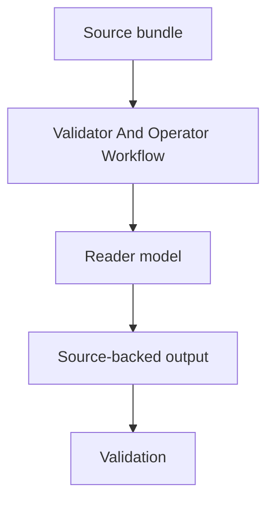

# Validator And Operator Workflow Spec

## Rendering Intent

Teach the validator and operator workflow as a source-backed project mechanism. The explanation must start from the subject, not from page metadata, renderer behavior, or derivative status. Generated outputs remain human-readable derivatives.

## Required Diagrams

<!-- mermaid-diagram-id: validator-operator-workflow-map -->

## Source-Backed Summary

Summary heading: `Summary of Validator And Operator Workflow`

Summary text:

Validator and operator workflow is the practical command map for safe project work. Bootstrap refreshes registries and generated wiki/retrieval surfaces; validate-only checks the current state; atlas validators check concept coverage, parity, standalone HTML, reader-first structure, and diagrams; depth and teaching validators catch shallow or unsupported docs; documentation-impact and research-control validators protect control receipts and job boundaries. PASS means the checked contract holds, not that physics claims are true.

Summary source basis:

- `AGENTS.md`
- `.codex/skills/improve-project-system/SKILL.md`
- `.codex/skills/project-memory-system/SKILL.md`
- `scripts/project_control/audit_documentation_surfaces.py`

## Required Content Blocks

- subject_summary: A source-backed summary of Validator And Operator Workflow with plain-language grounding in `AGENTS.md` and `.codex/skills/improve-project-system/SKILL.md`.
- what_this_does: Plain-language reader block for What This Does grounded in `AGENTS.md` and `.codex/skills/improve-project-system/SKILL.md`; it must teach the project mechanism, preserve authority boundaries, and expose source evidence.
- why_aether_needs_it: Plain-language reader block for Why AEther Needs It grounded in `AGENTS.md` and `.codex/skills/improve-project-system/SKILL.md`; it must teach the project mechanism, preserve authority boundaries, and expose source evidence.
- system_map: Plain-language reader block for System Map grounded in `AGENTS.md` and `.codex/skills/improve-project-system/SKILL.md`; it must teach the project mechanism, preserve authority boundaries, and expose source evidence.
- how_it_works: Plain-language reader block for How It Works grounded in `AGENTS.md` and `.codex/skills/improve-project-system/SKILL.md`; it must teach the project mechanism, preserve authority boundaries, and expose source evidence.
- objects_and_authority: Plain-language reader block for Objects And Authority grounded in `AGENTS.md` and `.codex/skills/improve-project-system/SKILL.md`; it must teach the project mechanism, preserve authority boundaries, and expose source evidence.
- example: Plain-language reader block for Example grounded in `AGENTS.md` and `.codex/skills/improve-project-system/SKILL.md`; it must teach the project mechanism, preserve authority boundaries, and expose source evidence.
- non_example: Plain-language reader block for Non-Example grounded in `AGENTS.md` and `.codex/skills/improve-project-system/SKILL.md`; it must teach the project mechanism, preserve authority boundaries, and expose source evidence.
- common_confusions: Plain-language reader block for Common Confusions grounded in `AGENTS.md` and `.codex/skills/improve-project-system/SKILL.md`; it must teach the project mechanism, preserve authority boundaries, and expose source evidence.
- what_this_does_not_authorize: Plain-language reader block for What This Does Not Authorize grounded in `AGENTS.md` and `.codex/skills/improve-project-system/SKILL.md`; it must teach the project mechanism, preserve authority boundaries, and expose source evidence.
- source_map: Plain-language reader block for Source Map grounded in `AGENTS.md` and `.codex/skills/improve-project-system/SKILL.md`; it must teach the project mechanism, preserve authority boundaries, and expose source evidence.
- next_reading_path: Plain-language reader block for Next Reading Path grounded in `AGENTS.md` and `.codex/skills/improve-project-system/SKILL.md`; it must teach the project mechanism, preserve authority boundaries, and expose source evidence.
